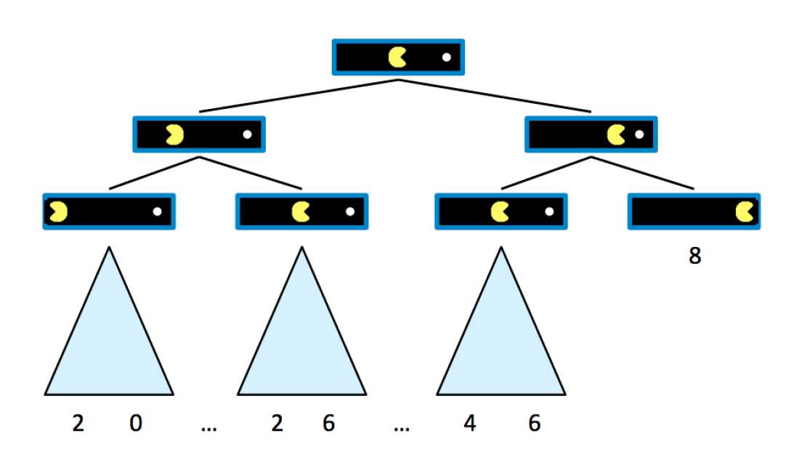

# Game

在前面讨论的搜索问题中，我们并没有考虑到那些可能阻挡我们到达目标的**敌方**(adversaries)（这类搜索问题称为**对抗性搜索问题**(adverserial search problem)或**博弈**(game)）。在这种更复杂的情况下，之前介绍过的搜索算法就无效了，因为这些算法都是提前规划好路径的，并没有考虑到敌方会如何回应并阻挡我们的行动，因此需要引入新的算法来解决。在此之前，我们先简要介绍一下博弈的概念。

博弈中的行动可以带来**确定性**(deterministic)或**随机性**(stochastic)的结果，可以有单个或多个玩家，也可以**零和**(zero-sum)（博弈双方势均力敌）或不零和。下面我们主要介绍的是**确定性零和博弈**(determinisic zero-sum game)——有确定的行动；并且我们的收获 = 对方的损失（反之亦然），这个可以用一个单变量值来描述：比如我们希望让这个变量值尽可能大，而对手希望让这个值尽可能小，由此带来了直接的竞争。

不同于一般搜索算法返回完整的规划，对抗性搜索算法返回的是一个**策略**(strategy/policy)，即一个根据代理体和敌方的布局而推荐的最佳可能移动方案。

下面给出一个对于标准博弈的定义：

- 初始状态$s_0$
- 玩家$\text{Players}(s)$
- 行动$\text{Actions}(s)$
- 转变模型(transition model)$\text{Result}(s, a)$
- 终止条件测试(terminal test)$\text{Terminal-test}(s)$
- 终值(terminal values)$\text{Utility}(s, player)$

## Minimax

第一个要介绍的零和博弈算法是**极小化极大**(minimax)算法：

- 它的实现基于一个前提：对手希望表现最优化，并且总是执行对于我们而言最不利的移动
- **状态值**(state value)/**效用**(utility)：代理体控制某个状态时能够得到的最优分数
- **终止效用**(terminal utility)：终止状态值，该值总是确定的，并能反映博弈的固有性质
- **博弈树**(game tree)：用于分析博弈问题中各种状态的树状结构，可类比一般搜索问题中的搜索树

??? example "例子"

    这里给一个很简单的吃豆人游戏的例子：

    

        
    

    假设吃豆人初始分数为10，且每走1步就要扣1分，直到吃到豆子为止（此时游戏就进入了终止状态并结束）。下面给出对应的博弈树：

    

        
    

## Alpha-Beta Pruning

## Evaluation Functions

## Expectimax

## Mixed Layer Types

## Monte Carlo Tree Search