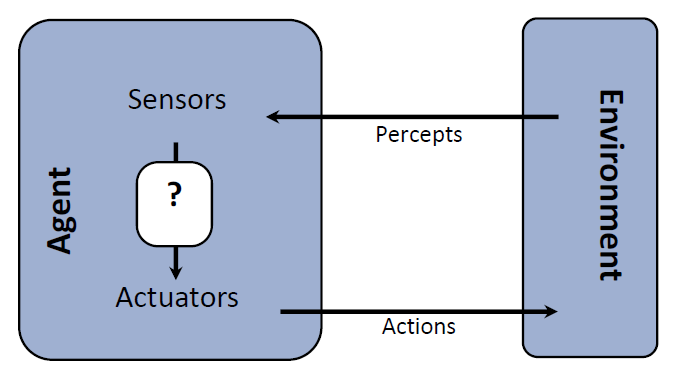

# Intro

**理智决策**(rational decision)：

- “理智”：最大化实现**预期**（因为世界是不确定的）的目标（即结果的**实际效用**(utility)）
- 实际上，这门课讨论的是可计算的理智(computational rationality)

对智能(intelligence)的不同看法：

- 基于技术(skill-based)的观点
- 实体(embodiment)观点
- 心理测量学(psychometrics)观点
- 与人类和睦共处(human-compatible)的观点

关于大脑：

- 大脑善于进行理智决策，但并非完美
- 大脑不像软件那样模块化，因此难以逆向工程
- AI在某些方面做得比大脑好
- 目前AI的规模远不如大脑（人脑有100T的突触，但GPT4只有1.8T的权重）
    

**理智代理体**(rational agents)：

- 代理体：能够感知（利用**传感器**(sensors)）和行动（利用**制动器**(actuators)）的实体
    - 感知：包括**认知**(percepts)、**环境**和**行动空间**
    - 环境的不同类型：
        - 部分可观察(partially observable)环境和完全可观察(fully observable)的环境
        - 随机(stochastic)环境（一次行动可能带来不同可能结果）和确定(deterministic)环境（一次行动带来一个确定结果）
        - 多代理体(multi-agent)环境
        - 静态(static)环境和动态(dynamic)环境（环境是否会因为代理体的行动而改变）
        - 已知(known)环境和未知(unknown)环境
- **理智代理体**能够选择最大化自己（预期）效用的行动
- 分类：
    - **反射代理体**(reflex agent) -> consider how the world **IS**
        - 根据当前的感知（可能也考虑内存信息）来选择行动
        - 可能有一个存储当前环境状态的内存或模型
        - 不考虑当下行动的影响

    - **规划代理体**(planning agent) -> consider how the world **WOULD BE**
        - ask "what if"
        - 根据（假设的）行动后果做出决策
        - 必须有一个用于记录环境随行动的变化的模型
        - 必须为达到目标而深思熟虑
        - 最优规划 vs. 完全规划
        - 规划 vs. 重规划

- 理智代理体的抽象模型：

    

        
    

- 理智代理体的核心部件（同时也是这门课程的主题）：
    - 搜索和规划(search & planning)
    - 概率和推断(probability & inference)
    - 监督学习(supervised learning)
    - 强化学习(reinforcement learning)

- 

