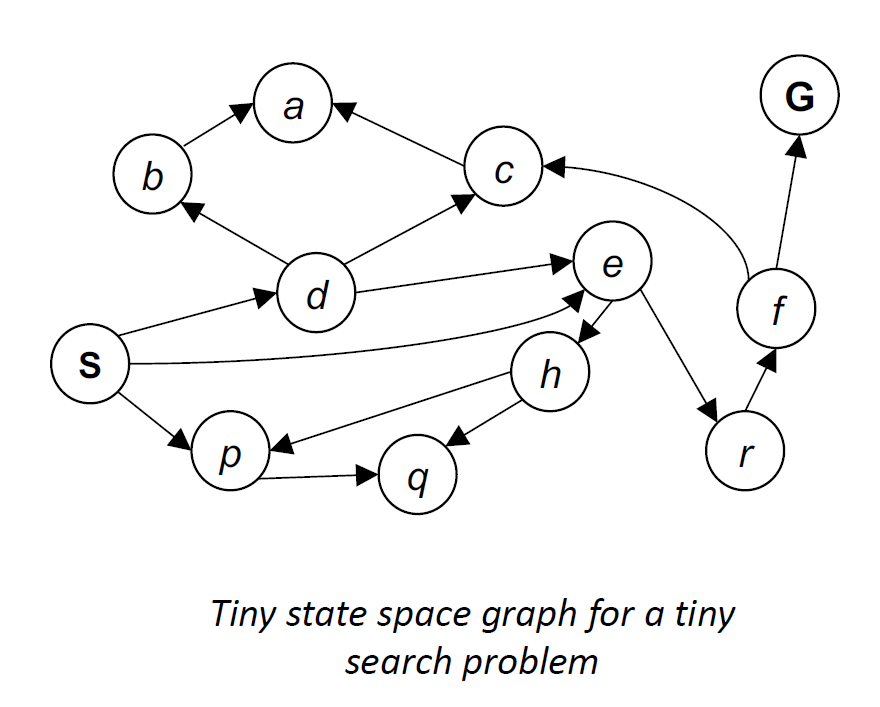

# Search

**搜索问题**(search problem)由以下几部分构成：

- 一个**状态空间**(state space)

- 一个后继函数(successor function)
- 一个开始状态和一个目标测试

搜索问题的一个**解**(solution)是指能够实现从开始状态到目标状态的转变的一系列行动。

搜索问题本质上是一个（针对实际问题的）模型(model)

## State Space and Search Tree

状态空间内的状态可以分为：

- **环境状态**(world state)：外界环境内的每一寸细节
- **搜索状态**(search state)：仅保留与规划(planning)（一种抽象）相关的细节

**状态空间图**(state space graph)：一种对于搜索问题的数学表示

- 节点表示一种可能的环境布局(configuration)
- 边表示后继(successors)（行动的结果）
- 在图中，目标测试是一组（也可能只有一个）目标节点
- 每个状态在状态空间图中仅出现一次
- 由于通常状态空间图很大，我们无法直接将它存入内存中，但它还是一种不错的想法

    

---
**搜索树**(search tree)