# Search

## State Space and Search Problems

为了创建一个理智代理体，我们需要用数学的方式来表达当前代理体所处的环境——**搜索问题**(search problem)：给定当前代理体的**状态**(state)（或配置(configuration)），如何到达一个使代理体以最佳方式实现目标的新状态。搜索问题由以下几部分构成：

- 一个**状态空间**(state space)：所有可能状态的集合
- 每个状态下的一组可用行动(actions)，每个行动都有相应的成本
- 一个**转变模型**(transition model)：在当前状态做出某一行动后输出下一状态
- 一个开始状态
- 一个目标测试：将状态作为输入，判断是不是目标状态

**规划**(plan)：从开始状态到目标状态的一条路径。

!!! info "概念区分"

    - **世界状态**(world state)：包含给定状态的所有信息
    - **搜索状态(**search state)：仅包含对规划而言有用的部分信息

状态空间的大小：采用**基本计数原理**(fundamental counting principle)计算——对于给定的环境，若有$n$个变量对象，且分别对应$x_1, x_2, \dots, x_n$中不同的值，那么状态总数为$x_1 \cdot x_2 \cdot \dots \cdot x_n$。

搜索问题的一个**解**(solution)是指能够实现从开始状态到目标状态的转变的一系列行动。


### State Space Graphs and Search Trees

**状态空间图**(state space graph)：一种用节点表示状态，用有向边表示状态与其孩子的联系的图。

- 每个状态在图中仅出现一次
- 边还能表示行动(actions)，以及行动的成本（边的权重）
- 通常状态空间图所占空间太大，无法直接存储，但这仍然是一种用于解决问题的好思路

**搜索树**(search tree)

- 每个状态在树中出现的次数没有限制，因为树中的每条路径代表一种可行解法，可能某些状态会出现在多个解法中
- 所占空间不低于等价的状态空间图

状态空间图与搜索树的比较：

<div style="text-align: center">
    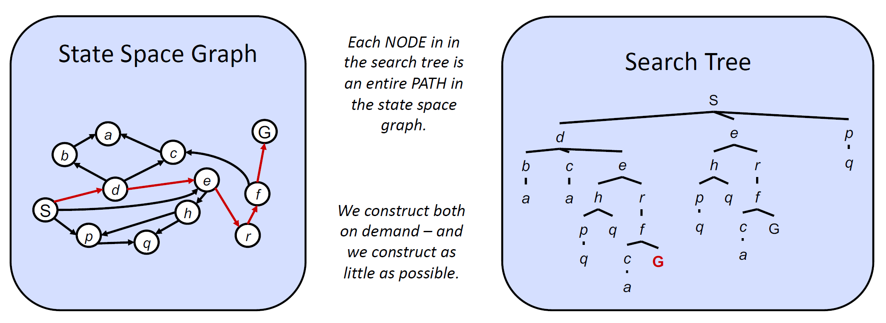
</div>


## Uniformed Search

!!! code "通用搜索树算法的伪代码"

    ```py
    function TREE-SEARCH(problem, frontier) return a solution or failure
        frontier <- INSERT(MAKE-NODE(INITIAL-STATE[problem]), frontier)
        while not IS-EMPTY(frontier) do
            node <- POP(frontier)
            if problem.IS-GOAL(node.STATE) then
                return node
            end
            for each child-node in EXPAND(problem, node) do
                add child-node to frontier
            end
        end
        return failure

    function EXPAND(problem, node) yields nodes
        s <- node.STATE
        for each action in problem.ACTIONS(s) do
            s` <- problem.RESULT(s, action)
        end
        yield NODE(STATE = s`, PARENT = node, ACTION = action)
    ```

评估搜索策略的一些性质：

- 完全性(completeness)：是否存在解，是否能保证在有限计算资源的情况下得到解
- 最优性(optimality)：能否保证找到达到目标状态的最低成本解
- 分支因数(branching factor)$b$：节点的孩子节点数，因此深度为$k$的搜索树有$O(b^k)$个节点
- 最大深度$m$
- 深度最浅解$s$


几类常见的搜索算法：

- [深度优先搜索](../../algo/fds/9.md#applications-of-depth-first-search)(depth-first search, DFS)
    - 应用：无向图的双连通性、欧拉环...
- [广度优先搜索](../../algo/fds/9.md#unweighted-shortest-paths)(breath-first search, BFS)
    - 应用：无权最短路算法...

???+ note "迭代深化(iterative deepening) = DFS + BFS"

    此种搜索算法利用了DFS的空间优势和BFS的时间优势（浅搜索），具体过程为：

    - 限制搜索深度为1，使用DFS算法搜索，若没有找到解，则：
    - 限制搜索深度为2，使用DFS算法搜索，若没有找到解，则：
    - 限制搜索深度为3，使用DFS算法搜索，若没有找到解，则：
    - 以此类推

    <div style="text-align: center">
        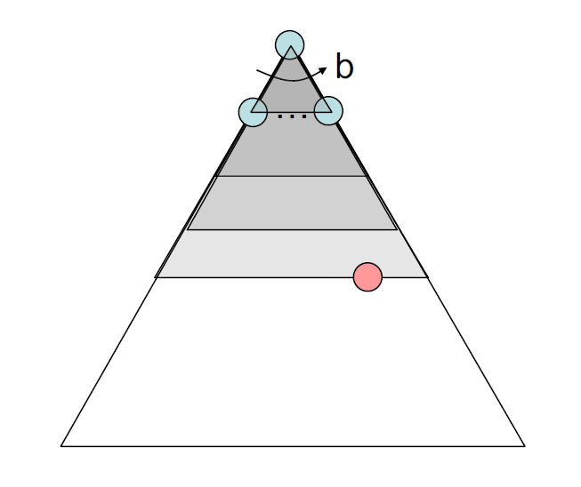
    </div>


- **统一成本搜索**(uniform cost search, UCS)：寻找最小成本解
    - 与寻找最短路Dijkstra算法很像，但UCS是搜索树上搜索的，且UCS只搜索一个解（Dijkstra算法会计算所有顶点的成本）
    - 使用优先队列（最小堆）来记录节点的成本（从起始节点到该节点之间的边成本之和），每次我们移除成本最小的节点，该节点的孩子随后就会进入堆内
    - 若每条边都是正数，那么该方法能够保证得到最优解，否则的话该方法就会失效
    - 时间复杂度：$O(b^{C^* / \varepsilon})$
        - $b$：每个节点的孩子数
        - $C^*$：最优路径的成本
        - $\varepsilon$：在状态空间图中两个节点之间的最小成本
        - 那么该算法探索的深度大致为$\dfrac{C^*}{\varepsilon}$

    - 空间复杂度：$O(b^{C^* / \varepsilon})$

    <div style="text-align: center">
        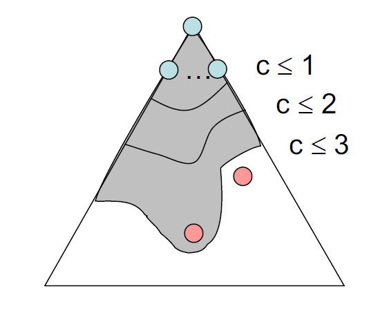
    </div>


## Informed Search

虽然UCS能够保证找到最优解，但是它的效率实在太低了，因为它会遍历每一种可能的方向。要是我们知道大致的正确方向的话，搜索效率就会提升不少，而这类搜索算法称为**带决策的搜索**(informed search)。

### Heuristics

**启发式算法**(heurisitcs)：将**状态**作为输入，并输出关于**离目标状态的距离的评估**的一类函数。

- 我们希望启发式算法能够作为离目标状态距离的一个下界，因此启发式算法是对原问题**松弛**(relaxed)（即移除原问题的某些限制）过后的一个解。
- 常用的启发式算法——**曼哈顿距离**(Manhattan distance)：对于空间上两点$(x_1, y_1), (x_2, y_2)$，它们之间的曼哈顿距离为：

    $$
    \text{Manhattan}(x_1, y_1, x_2, y_2) = |x_1 - x_2| + |y_1 - y_2|
    $$

    - 举例：在吃豆人游戏中，吃豆人距目标位置的曼哈顿距离如下所示：

        <div style="text-align: center">
            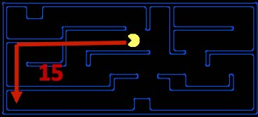
        </div>

        可以看到，在计算曼哈顿距离时，我们并没有考虑到实际存在于迷宫中的墙壁（一种对原问题的松弛）。

- 松弛搜索问题的**精确解**(exact goal) = 对应的实际搜索问题的**评估解**(estimated goal)
- 我们可以让代理体根据启发式算法得到的评估解来寻找距离目标状态更近的行动，下面将会介绍实现这一思想的两类启发式函数：**贪心搜索**(greedy search)和A*算法


### Greedy Search

- 算法描述：每一步总是挑选花费**最低启发式价值**(lowest heuristic value)的**前沿节点**(frontier)（就是当前被挑选的节点），算法认为这类节点最接近目标。
- 前沿节点表示：与UCS类似，使用优先队列挑选节点，但区别在于UCS选择的是**计算后向成本**(computed backward cost)（即从起始节点开始到当前节点路径上的边权重之和）最小的节点，而贪心搜索选择的是**评估前向成本**(estimated forward cost)（启发式函数的计算值）最小的节点。
- 完全性和最优性：贪心搜索既不保证能够找到目标状态，也不保证找到的解是最优解，尤其是在采用很烂的启发式函数的情况下。它的行动难以预测，可以表现为径直走向目标状态，或者探索所有错误区域（类似一个很烂的DFS）。

<div style="text-align: center">
    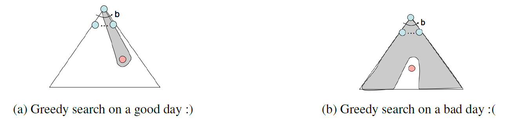
</div>


!!! info "注"

    对一般的贪心算法感兴趣的读者可以参考我的这篇[笔记](../../algo/ads/9.md)，里面介绍了更多贪心算法的应用，而非局限于搜索领域。


### A* Search

- 算法描述：每一步总是挑选花费**最少评估总成本**(lowest estimated total cost)（“总成本”是指从起始节点到目标节点的总成本）的节点。
- 前沿节点表示：同样采用优先队列，但区别在于它同时结合了UCS的计算后向成本和贪心搜索的评估前向成本，将两者相加得到了从起点到目标的**评估总成本**(estimated total cost)。因为我们希望最小化从起点到目标的总成本，因此这一策略相当合适。
- 完全性和最优性：若给定一个合适的启发式算法，则A*搜索能够兼具完全性和最优性。它很好地结合了我们之前提到过的所有算法的优势，即贪心搜索的高速，以及UCS的最优性和完全性


#### Admissiblility and Consistency

现在我们来讨论如何构建一个好的启发式算法。在这之前，我们先定义以下三个函数：

- $g(n)$：由UCS计算得到的**总后向成本**
- $h(n)$：由贪心搜索计算得到的**启发式价值/评估前向成本**
- $f(n)$：由A*搜索计算得到的**评估总成本**，满足：$f(n) = g(n) + h(n)$

!!! bug "一个很烂的启发式函数"

    若启发式函数$h(n) = 1 - g(n)$，那么$f(n) = g(n) + h(n) = 1$，也就是说A*搜索会退化成**BFS**（此时将每条边看作是等权重的），而BFS并不保证在边权重不一致的情况下得到最优解，因此该A*搜索也就不具备最优性了。

**可采纳性**(admissibility)：确保A*搜索最优性的条件。由一个可采纳的(admissible)启发式算法评估得到的值满足：

- **非负**
- **不能高估**：定义$h^*(n)$为对于给定节点$n$，到达目标状态的真正的最优前向成本，我们可以用以下不等式表述可采纳性的限制条件：

$$
\forall n, 0 \le h(n) \le h^*(n)
$$

**定理**：对于给定的搜索问题，若启发式函数$h$满足**可容纳性限制**，则采用启发式函数$h$的**A\*搜索**能够产生对于该搜索问题的最优解。

??? proof "证明"

    假设对于给定的搜索问题，在搜索树中有两个可到达的状态，分别为最优目标$A$和次优目标$B$。易知$A$的某个祖先$n$必然会在前沿节点中（或者说最优解的路径上），那么我们有结论：$n$将会先于$B$被探索到，理由有：

    - $g(A) < g(B)$：这是显然的，因为我们规定了$A$是最优解，$B$是次优解，因此$A$的后向成本应该比$B$更低
    - $h(A) = h(B) = 0$：我们已经假设启发式算法已经满足了可容纳性限制，而且$A, B$均为目标状态，那么$A, B$的真正的最优成本均为$h^*(n) = 0$，那么$0 \le h(n) \le 0$
    - $f(n) \le f(A)$：因为$f(n) = g(n) + h(n) \le \underbrace{g(n) + h^*(n) = g(A)}_{?} = f(A)$（标出来的那部分我没有看懂？）

    综上，可以得到：

    $$
    \begin{align}
    f(A) = g(A) + h(A) = g(A) < g(B) & = g(B) + h(B) = f(B) \notag \\
    f(n) \le f(A) \wedge f(A) < f(B) & \Rightarrow f(n) < f(B) \notag
    \end{align}
    $$

    所以，$n$将会先于$B$被探索到。因为我们是对任意的$n$进行证明，所以我们可以得出结论：所有$A$的祖先（包括$A$）都先于$B$被探索到。

---
有时，搜索算法可能会陷入无限循环的情况，也就是说有些节点会被访问多次。为了阻止这一问题的发生，我们需要标记那些被访问过的节点，规定被标记过不得被搜索算法再次访问，这种改进后的搜索算法被称为**图搜索**(graph search)，对应的伪代码如下：

!!! code "伪代码"

    ```py
    function GRAPH-SEARCH(problem, frontier) return a solution or failure
        reached <- an empty set
        frontier <- INSERT(MAKE-NODE(INITIAL-STATE[problem]), frontier) 
        while not IS-EMPTY(frontier) do
            node <- POP(frontier)
            if problem.IS-GOAL(node.STATE) then
                return node
            end
            if node.STATE is not in reached then
                add node.STATE in reached
            end
            for earch child-node in EXPAND(problem, node) do
                frontier <- INSERT(child-node, frontier)
            end
        end
        return failure
    ```

!!! bug "图搜索算法的缺陷"

    - 在上面的伪代码中，被标记的节点集合`reached`应该用**并查集**存储而非列表，因为若采用后者，需要$O(n)$的时间来判断某个节点是否被访问过，因而会破坏图搜索算法带来的性能提升。
        - 个人观点：为什么不用哈希表来存呢，这不是比并查集更快吗？而且好像也没必要专门开一个数据结构来存吧，只需要为每个节点设置一个额外的字段就行了，不用这么麻烦吧...

    - 采用图搜索算法的A*搜索无法确保得到最优解，即便我们用到了可采纳的启发式算法。来看下面的例子：

        ??? example "例子"

            <div style="text-align: center">
                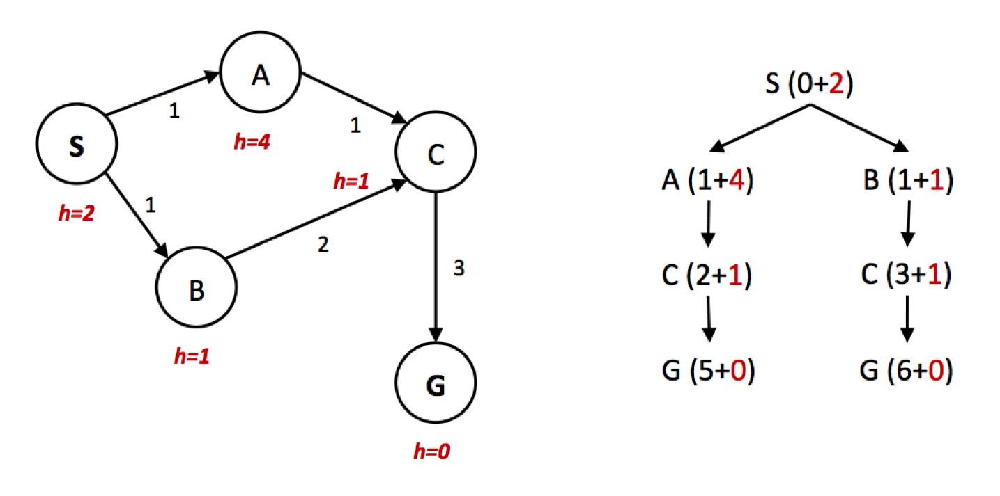
            </div>     

            - 显然，最优解为S -> A -> C -> G
            - 然而，我们从右侧的搜索树中可以看出，$f(A) > f(C) > f(B)$，因此A*算法会以S -> B -> C -> G的路径到达目标，且因为被访问的节点被标记过不可再被访问，因而无法得到最优解

        - 因此，我们需要一种比可采纳性更强的性质——一致性

**一致性**(consistency)：要求启发式算法低估从任意节点出发到目标的总距离，以及图中每条边的成本或权重，其中边的成本可通过边上两个节点的启发式函数值之差得到，用公式表示为：

$$
\forall A, C \quad h(A) - h(C) \le \text{cost}(A, C)
$$

**定理**：对于给定的搜索问题，若启发式函数$h$满足**一致性限制**，则采用启发式函数$h$的**A\*图搜索**（注意是图搜索）能够产生对于该搜索问题的最优解。

??? proof "证明"

    首先，我们证明：当运行具有一致性的启发式算法的A*图搜索时，在搜索过程中每当删除一个节点时，我们都会找到该节点的最佳路径。

    使用一致性限制后，我们将会看到沿着某条路径的$f(n)$值是**非递减**的，用公式表示为（令$n'$为$n$的孩子）：

    $$
    \begin{align}
    f(n') & = g(n') + h(n') \notag \\
    & = g(n) + \text{cost}(n, n') + h(n') \notag \\
    & \ge g(n) + h(n) \notag \\
    & = f(n) \notag
    \end{align}
    $$

    >在上面的“例子”中，A -> C的路径上，$f(A) > f(C)$，因此违背了一致性限制。

    下面用**反证法**(contradiction)证明：假设结论为假，即在搜索过程中移除节点$n$之后，关于$n$节点的路径是次优解。这也就意味着存在$n$的祖先$n''$，它从来没有被访问过，但是它是关于$n$的路径的最优解上的一点——这是不可能的，因为$f(n'') \le f(n)$，那么$n''$应该先于$n$在搜索过程中被移除。因此原假设成立。

    ---
    最后，我们证明：最优目标$A$总是会在搜索过程中被移除，并先于次优目标$B$被返回。因为$h(A) = h(B) = 0$，因此：

    $$
    f(A) = g(A) < g(B) = f(B)
    $$

    得证。

一致性不仅是比可采纳性更强的性质，一致性的成立也意味着可采纳性的成立。

??? example "例子"

    <div style="text-align: center">
        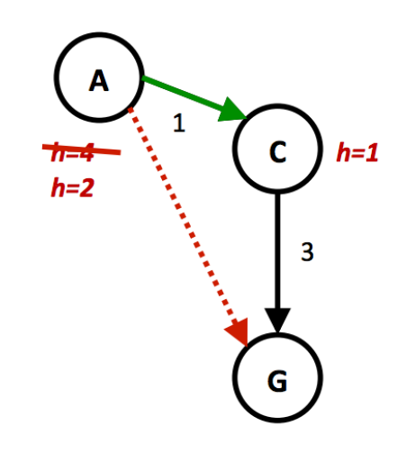
    </div> 

    - 若$h(A) = 4$
        - 因为$h(A) \le 1 + 3, h(C) = 1 < 3$，所以该启发式算法满足一致性
        - 然而，因为$h(A) - h(C) = 3$，而$\text{cost}(A, C) = 1$，不满足$h(A) - h(C) \not \le \text{cost}(A, C)$，因此该启发式算法不满足一致性

    - 当$h(A) = 2$时，该启发式算法就满足一致性了，读者可自行验证。


#### Dominance

接下来，我们介绍一种比较两种启发式算法好坏的量度——**支配性**(dominance)：若启发式算法$a$支配(be dominant over)启发式算法$b$，那么在状态空间图中，$a$的评估目标距离将不小于$b$的评估目标距离，即：$\forall n: h_a(n) \ge h_b(n)$，也就是说$a$能够更加接近地估计任意状态到达目标的实际距离。

- **平凡启发式算法**(trivial heurisitc)：满足$h(n) = 0$，此时A*算法会退化为UCS
    - 所有的可采纳性启发式算法都会支配平凡启发式算法
    - 此类算法经常作为搜索问题中**半格**(semi-lattice)问题的基础，位于半格结构的底部
        - 什么是“[格](../../math/dm/9.md#lattices)”
        - 也就是说，我们可以用半格这一结构来形象反映各种启发式算法的支配关系
        
        ???+ example "例子"

            <div style="text-align: center">
                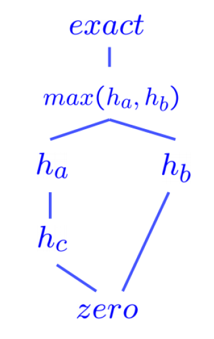
            </div> 

            其中最底下的0就是平凡启发式算法

        - 关于多个可采纳的/一致的启发式算法的**最大函数**(max function)也满足可容纳性/一致性（挺好理解的）
            - 因此在实际应用中，我们可以得到多个可采纳/一致的启发式算法，然后计算它们之中的最大值，由此得到支配所有这些算法的更优算法


## Local Search

之前，我们希望通过搜索算法找出一条最优的路径到达特定的目标状态，但现在我们**仅关心目标状态**在哪里（此时重构路径这件事比较轻松，可以暂且不去考虑），这时我们可以用**局部搜索**(local search)算法来达成这一目的。在局部搜索问题中，状态空间图是一组“完全”解的集合（？）；我们通过该算法找到满足某些限制或最优化某个目标函数的一种配置。

<div style="text-align: center">
    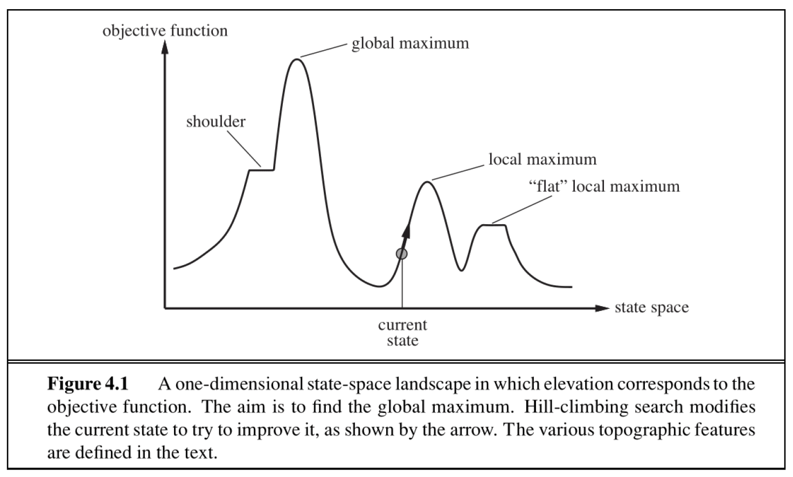
</div> 

上图展示了一维状态空间与目标函数的关系曲线，我们的目标是找到最大目标值下的状态。局部算法的基本思想是：从某个状态出发，移动局部的几步，找到比当前状态的目标值更高的状态，直到到达最大值为止（注意此时不一定是全局最大值）。下面将介绍4类局部搜索算法：

- **爬坡搜索**(hill-climbing search)
- **模拟退火**(simulated annealing)
- **局部束搜索**(local beam search)
- **遗传算法**(genetic algorithms)


### Hill-Climbing Search

**爬坡算法**(hill-climbing search)（又称**最陡-上升**(steepest-acsent)）的思路：

- 从当前状态开始，移动到所有邻居状态中目标值提升最大的那个状态
- 该算法并不维护一棵搜索树，而仅仅保留状态及其目标值

!!! bug "问题"

    - 显然该算法是一种**贪心算法**，因此这种算法很容易陷入**局部最大**(local maxima)的状态（如上图所示）
    - 该算法还可能会陷入**高原**(plateaus)区域——一组相邻且目标值相等的节点，没有任何提升的空间（在上图就是一段水平的曲线），或者提升过于缓慢（这种区域称为**肩部**(shoulder)）
    - 该算法是不完全的，也就是它不能找出所有的解

随机爬坡算法的伪代码如下所示：

!!! code "伪代码"

    ```py
    function HILL-CILMBING(problem) returns a state
        current <- make-node(problem.initial-state)
        loop do
            neighbor <- a highest-valued successor of current
            if neightbor.value <= current.value then
                return current.state
            current <- neighbor
    ```


!!! info "爬坡算法的变体"

    - **随机爬坡**(stochastic hill-climbing)：随机做出可能使目标值变大的行动，它可以在更多迭代次数的代价下得到更大的“最大值”
    - **随机侧向移动**(random sideways moves)：允许做出并没有使目标值严格递增的移动，因而可以使算法避免陷入“肩部”区域
    - **随机重启爬坡**(random-restart hill-climbing)：重复执行多次随机爬坡算法，每次随机挑选一个初始状态，相比只用一次随机爬坡算法更有可能找到全局最大值，但也仅仅稍微提升了一些完全性


>也许你听说过另一种很类似的算法——**梯度下降法**(gradient descent)，事实上两者的思路确实是一致的，只不过梯度下降法适用于寻找**最小成本**的问题。


### Simulated Annealing Search

**模拟退火**(simulated annealing)搜索的思路：

- 结合了随机漫步(random walk)（随机移动到邻近的状态）和爬坡算法，得到一种完全而高效的搜索算法
- 该算法允许向目标值更小的状态移动
- 具体来说：
    - 每个时间点做出随机的移动，总是接受那些提升目标值的移动
    - 然而，对于降低目标值的移动，有一定概率会接受这类移动
    - 这个概率由温度参数决定，初始情况下温度值很高，可以容忍更多这类糟糕的移动；随后由调度函数以足够慢的速度降低温度
- 该算法找到全局最优的概率接近1


!!! code "伪代码"

    ```py
    function SIMULATED-ANNEALING(problem, schedule) returns a state
        current <- problem.initial-state
        for t = 1 to ∞ do
            T <- schedule(t)
            if T = 0 then
                return current
            next <- a randomly selected successor of current
            ΔE <- next.value - current.value
            if ΔE > 0 then
                current <- next
            else
                current <- next only with probability exp(ΔE / T)
    ```


### Local Beam Search


**局部束搜索**(local beam search)的思路：

- 每次迭代会追踪k个状态（或者称为**线程**(thread)），这k个状态可以共享信息，使得那些“好的”（即目标值较高的）线程“吸引”那块区域内的其他线程
- 算法开始时会随机挑选k个状态，然后在每次迭代中根据爬坡算法找出k个新的状态，而这k个状态应该是已知状态中前k个最佳状态（也就是目标值最大的状态）
- 当任意一个线程找到最优值时，算法停止

!!! bug "局限"

    该算法还是很容易陷入平坦区域的。

    改进方法是采取**随机束搜索**(stochastic beam search)算法（类比随机爬坡算法），可以减缓这个问题。


### Genetic Algorithms

**遗传算法**(genetic algorithm)的思路：它是局部束搜索的一个变体，它将挑选出来的k个状态视为**人口**(population)，将状态视为**个体**(individuals)，这些个体用来自有限字母表的字符串表示。

>正如它的字面意思，该算法来源于进化学的研究。

???+ example "例子：[八皇后问题](../../algo/ads/6.md#eight-queens)"

    >由于问题过于经典，且在数据结构课程中已经提到过，故不再赘述题面内容。

    <div style="text-align: center">
        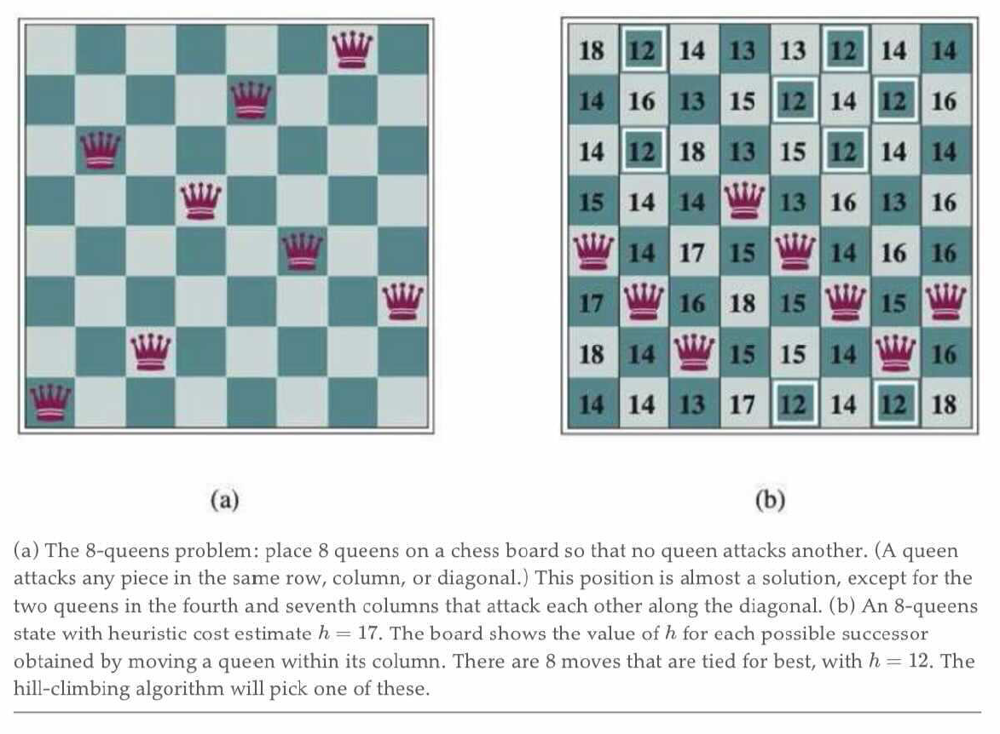
    </div> 

    下面用遗传算法来解决该问题，具体过程的示意图如下所示：

    <div style="text-align: center">
        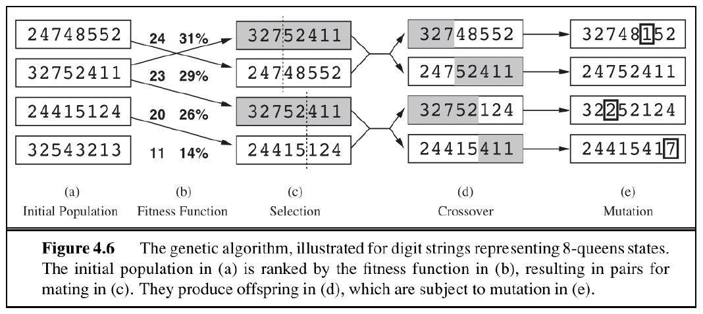
    </div> 

    - 初始状态：对于(a)列，这里列出了4种可能的状态（/棋局/个体），每个状态由8个十进制数构成，分别表示第1列到第8列的皇后所处的行数（注意行号是从下往上数的）。对于每个状态，我们需要计算该棋局下的不会相互攻击的皇后对数(number of non-attacking pairs)
    - 接下来用一个评估函数（称为**适应度函数**(fitness function)）来评估每个个体，该函数接收的参数就是不攻击对的对数，然后将状态按函数值排好序
    - 选择：接着选择其中一个状态进行复制，被选中的概率与适应度函数值成正比（在上面的例子中，第2个状态被选为复制的样本）
    - **交叉**(crossover)：将复制样本与另外的状态进行交叉融合，得到孩子状态，交叉点是随机挑选的
    - **变异**(mutation)：最后，后代会发生一些独立概率下的随机变异（比如某个数发生了变化，当然也有可能无事发生）

    对应的实际棋局（(c)列中的前两个父母状态）

    <div style="text-align: center">
        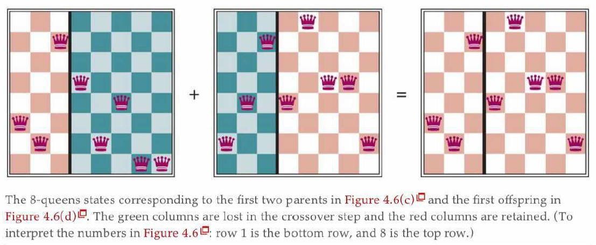
    </div>


遗传算法的伪代码如下所示：

!!! code "伪代码"

    ```py
    function GENETIC-ALGORITHM(population, FITNESS-FN) returns an individual
        inputs: population, a set of individuals
                FITNESS-FN, a function that measures the fitness of an individual
        
        repeat
            new_population <- empty set
            for i = 1 to SIZE(population) do
                x <- RANDOM-SELECTION(population, FITNESS-FN)
                y <- RANDOM-SELECTION(population, FITNESS-FN)
                child <- REPRODUCE(x, y)
                if (small random probability) then 
                    child <- MUTATE(child)
                and child to new_population
            population <- new_population
        until some individual is fit enough, or enough time has elapsed
        return the best individual in population, according to FITNESS-FN

    function REPRODUCE(x, y) returns an individual
        inputs: x, y, parent individuals

        n <- LENGTH(x)
        c <- random number from 1 to n
        return APPEND(SUBSTRING(x, 1, c), SUBSTRING(y, c + 1, n))
    ```

与随机束搜索类似，遗传算法通过探索状态空间和交换线程之间的信息来实现“上坡”（使目标值变大），但是它的优势在于利用**交叉**操作——那些经过进化得到较高目标值的大字符块之间互相结合，产生更高的价值！

!!! note "注"

    关于局部搜索更多的讨论，可以参看我的[ADS笔记](../../algo/ads/12.md)！