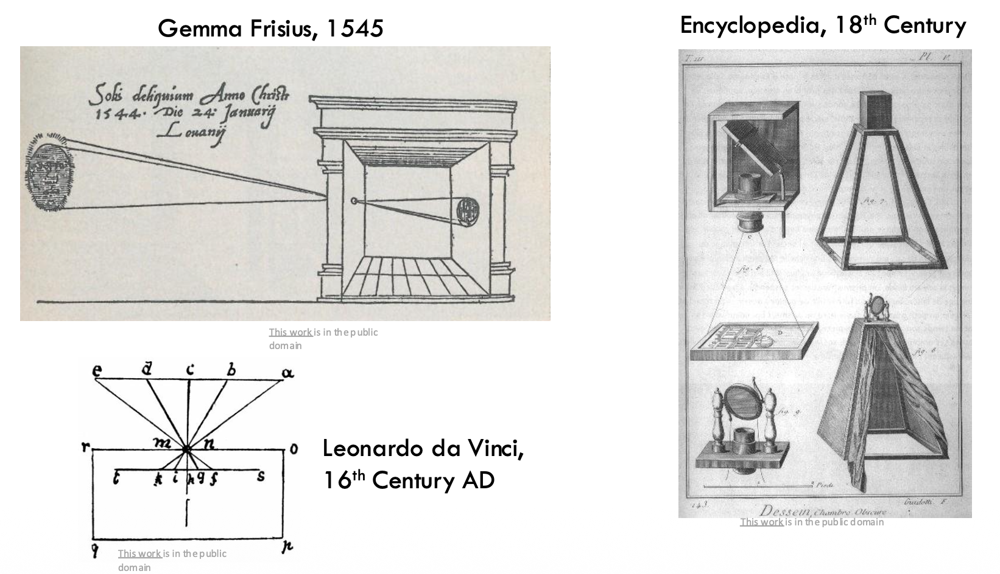

# Introduction

??? info "为什么要学习计算机视觉？"

    - 计算机视觉是人工智能的重要组成部分
    - 与很多学科关系紧密
    - 计算机视觉生动有趣
    - 计算机视觉应用广泛、工业界需求火热

??? abstract "核心知识"

    无（zxw 在复习课上也直接跳过了本讲）

## What is Computer Vision?

用一幅图介绍标准的计算机视觉系统？

    

- 输入为现实世界的场景
- 输出的是关于场景的描述，描述的形式可以是文本、三维模型，或者隐式的编码等

计算机视觉的任务大致可分为以下几类：

- **三维重建**(3D reconstruction)：
    - 定位(localization)、
    - SLAM（同步定位与地图构建(simultaneous localization and mapping)）
    - ...
- **图像理解**(image understanding)：
    - 图像识别(image recognization)
    - 目标检测(object detection)
    - 图像分割(image segmentation)
    - 行为识别(action recognization)
    - 深度学习(deep learning)
    - ...
- **图像合成**(image synthesis)：
    - 着色(colorization)
    - 超分辨率(super-resolution)
    - 去模糊(debluring)
    - HDR
    - 全景图(panorama)
    - 自由视角(free-viewpoint)
    - GANs（生成式对抗网络(generative adversarial networks)）
    - ...

为什么实现计算机视觉很难呢？对人类而言能够轻易理解的图像，在计算机看来只是一串编码。

    

不过至今还没有人搞清楚人脑是怎么感知视觉信息的。然而，人类的感知也不总是准确的：

???+ example "例子"

    === "例1"

        

            
        

    === "例2"

        

            
        

    === "例3"

        

            
        

        虽然图片是静止的，但我们人眼感觉这张图在动。

    === "例4"

        

            
        

        [wiki](https://www.wikiwand.com/en/articles/Spinning_dancer)

        图中的女舞者看上去是顺时针转，还是逆时针转？

尽管如此，人的强大之处在于仅凭场景中的少量信息就能理解很多东西了。

    

??? info "CV vs. CG"

    计算机视觉和计算机图形学的关系可以简单地理解为：

    

        
    

## Historical Background

视觉的起源得从寒武纪这一动物演化史的“大爆炸”说起。那时的动物还不具备完整的视觉能力，但是已经有初步的感光功能，这有助于捕食、躲避天敌等活动。

???+ info "注"

    人脑中超过一半的部分都是在加工视觉信息。

    

        
    

**相机暗箱**(camera obscura)可能是人类首次将生物视觉迁移至机器视觉的发明。最初的相机主要利用了**小孔成像**的原理。

    

从二十世纪五十年代开始，人们开始探索这样一个问题：我们的视觉能力从何而来？下面按时间顺序罗列了 CV 发展史上的里程碑：

=== "Hubel and Wiesel, 1959"

    

        
    

=== "Larry Roberts, 1963"

    

        
    

=== "MIT Summer Vision Program, 1966"

    

        
    

=== "*Vision*, David Marr, 1970s"

    

        
    

=== "Recognition via Parts (1970s)"

    

        
    

=== "Recognition via Edge Detection (1980s)"

    

        
    

---
但随后 AI 步入了寒冬：

- AI 研究的热情（和资金）开始萎缩
- 基于规则的“专家系统”未能完成它们的使命
- 但 AI 的其他子领域仍然蓬勃发展，包括 CV，NLP，机器人学(robotics)，计算生物学(compbio)等

与此同时，人们在认知学和神经科学中取得了开创性的成果，而这些成果推动了 CV 的发展。因此到了九十年代，关于视觉的研究又重回正轨，不断取得突破。

=== "Recognition via Grouping (1990s)"

    

        
    

=== "Recognition via Matching (2000s)"

    

        
    

=== "Face Detection"

    

        
    

=== "Caltech 101 & PASCAL"

    

        
    

再回过头来看 AI 领域的发展：

=== "Perceptron, 1958"

    

        
    

=== "Minsky and Papert, 1969"

    

        
    

=== "Neocognitron: Fukushima, 1980"

    

        
    

=== "Backprop: Rumelhart, Hinton, and Williams, 1986"

    

        
    

=== "Convolutional Networks: LeCun et al, 1998"

    

        
    

=== "2000s: “Deep Learning”"

    

        
    

如最后一个阶段所示，刚进入 21 世纪的深度学习缺少一个好的数据集，导致再精妙的模型也很难被训练起来。不过这一困境在 2009 年被一个大型数据集（现在来看其实规模不是很大，但对当时而言已经相当大了）**ImageNet** 给打破了。它有一百多万张图像，并包含了 1000 个物体类别。

    

此后基于 ImageNet 每年开办相关竞赛，找出图像分类能力最强的算法。以下图表列出了每年的优胜者：

    

从 2012 年的获奖算法 **AlexNet** 开始，深度学习开始成为主流。

    

    

AI 发展的三个核心部分：**算力**(computation)、**算法**(algorithm)和**数据**(data)。

CV 的发展有利有弊：

- 坏处

    

        
    

- 好处

    

        
    

## What is Vision Used For?

计算机视觉的应用早已覆盖了我们生活的方方面面。

    

- 人脸 ID
- 人脸追踪(face tracking)
    - 一个在线应用：<https://codepen.io/mediapipe/details/KKgVaPJ>，挺好玩的
- 深度伪造(deepfake)
- 视觉检测(vision inspection)
- OCR（光学字符识别(optical character recognization)）
- 视频监控(video surveillance)
- 视觉定位和导航(visual localization and navigation)
- 自动导航(autonomous navigation)
- 机器人感知(robot perception)
    - <https://www.youtube.com/watch?v=y3RIHnK0_NE>（~~其实是假的，但很搞笑~~）
- 无人驾驶(autonomous driving)
    - <https://www.bilibili.com/video/BV1sA411N7x6/?vd_source=7c38ff5056b0974a26db352a36e1359c>
- 人机交互(human computer interaction)
    - （光学）鼠标下方的洞（启动时会发光）是一个红外相机，用于检测鼠标移动
    - 体感游戏(motion sensing game)：XBoxViewTV、Kinect（已停产）
- 体育广播(sport broadcasting)
- 3D 街景(3D street view)
- VR 旅行(VR tour)
    - <https://playcanv.as/p/Zp9Oh1ia/>（里面的内容都是真实的，根据现实世界的图像重构而成）
- 体积视频(volumetric video)
    - 周晓巍老师团队和影视飓风合作的一个项目：[视频](https://www.bilibili.com/video/BV1k85NzMEv4/)，[在线尝试](https://4dv.ai)
    - 《黑客帝国》的“子弹时间”(bullet time effect)
    - 远程呈现(telepresence)：<https://www.youtube.com/watch?v=Q13CishCKXY>
- 数字人(digital man)
    - [SIREN](https://www.nextstudios.com/tech/digitalhuman/siren/index_en.html)
    - [邓丽君](https://www.youtube.com/watch?v=dP0uJcBZ8iw)
- VR（虚拟现实(virtual reality)） 和 AR（增强现实(augmented reality)）
    - AR：Apple Vision Pro
- 医学图像分析

CV 相关的研究：

- CV 是一个难题
- CV 是跨学科的
- CV 已取得长足进步
- 用很多在现实世界中取得成功的应用

CV 在研究领域中相当活跃（截止 2019 年的数据）：

    

CV 三大顶会：

- [**CVPR**](https://cvpr.thecvf.com/)：计算机视觉与模式识别会议(Computer Vision and Pattern Recognition)
- [**ICCV**](https://iccv.thecvf.com/)：国际计算机视觉会议(International Conference on Computer Vision)
- [**ECCV**](https://eccv.ecva.net/)：欧洲计算机视觉会议(European Conference on Computer Vision)

## Course Overview

见[主页](index.md)“目录”部分。

## Review of Linear Algebra

大部分内容来自闫令琪老师的 GAMES101 课程，可点击[链接](../../software/cg/2.md)进入阅读。

不过课件还补充了一些知识点：

- 矩阵**行列式**(determinant)
    - 计算公式：$\det(A) = \sum\limits_{\sigma \in S_n} \left(\text{sgn} (\sigma) \prod\limits_{i=1}^n a_{i, \sigma_i}\right)$，其中 $S_n$ 是集合 $\{1, 2, \dots, n\}$ 的全排列

        

            
        

    - 几何意义：行列式是 n 维平行体的体积

        

            
        

- **特征值**(eigenvalue)和**特征向量**(eigenvector)
    - $Ax = \lambda x\ (A in \mathbb{R}^{n \times n}, x \ne 0)$，其中 $x$ 是 $A$ 的特征向量，对应的特征值为 $\lambda$
    - 几何意义：假如矩阵乘上某个向量后只改变这个向量的大小，方向没变（可以是相反方向），那么这个向量就是矩阵的特征向量，对应的缩放比例就是特征值
    - **特征分解**(eigen decomposition)：

        

            
        

    - 应用——**主成分分析**(principal component analysis)：找到数据的主方向

        

            
        

        主成分 = $A^T A$ 的特征向量

        

            
        
