# Regularization and Optimization

## Regularization

???+ info "引入"

    我们现在有一些 (x, y) 的数据集，一个分数函数（比如线性分类器）和一个损失函数（比如 SVM 或 Softmax）。现在的问题是：损失函数鼓励模型在**训练**数据上表现良好，但我们真正关心的是在**测试**数据上的表现。

当模型在训练数据上表现很好，但是在它之前从未见过的数据上表现很差时，我们称这种现象为**过拟合**(overfitting)。

??? example "例子"

    <div style="text-align: center">
        
    </div>

    <div style="text-align: center">
        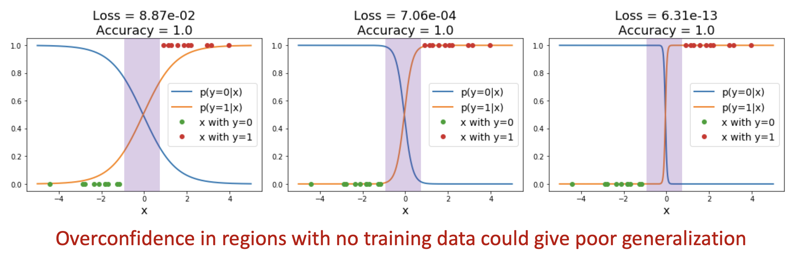
    </div>

再上一节，我们给出了损失函数的计算公式：
$$
L(W) = \dfrac{1}{N} \sum_{i=1}^N L_i(f(x_i, W), y_i)
$$

实际上，完整的损失函数是长这样的：
$$
L(W) = \dfrac{1}{N} \sum_{i=1}^N L_i(f(x_i, W), y_i) + \lambda R(W)
$$

其中等号右边的两项分别是：

- **数据损失**(data loss)：模型预测需要拟合训练数据
- **正则化**(regularization)：阻止模型在训练数据上“表现太好”，即过拟合

<div style="text-align: center">
    
</div>

什么是“正则化”？为什么要阻止模型在训练集上更好的表现呢？也许此刻读者感觉一头雾水，那就不妨来看下面的例子：现在在坐标系上用一个个蓝点来表示训练数据；并且有两条函数曲线（模型）f1 和 f2 来拟合这些点，其中 f1 是一条复杂的，但是经过了所有点的曲线；而 f2 虽然没经过这些点，但也和这些点足够接近，并且就是一条简单的直线。

<div style="text-align: center">
    
</div>

结论就是：我们一般更偏好 f2 模型，不是因为它简单，而是因为它更胜任一般的情况。假如测试数据用白点表示，f1 就会完美地避开这些点，而 f2 离这些点很接近。而正则化的目的就是阻止像 f1 这样在训练数据上**过拟合**的情况出现。

<div style="text-align: center">
    
</div>

>这正如**奥卡姆剃刀**(Occam’s Razor)法则所言：Among multiple competing hypotheses, the simplest is the best.

---
现在仔细观察正则化项 $\lambda R(W)$，其中：

- $\lambda$：**正则化强度**(regularization strength)，是一个**超参数**
- $R(W)$ 的选择很多，常见的有：
    - **L2 正则化**：$R(W) = \sum_k \sum_l W_{k, l}^2$（权重中每个元素的平方之和）
    - **L1 正则化**：$R(W) = \sum_k \sum_l |W_{k, l}|$（权重中每个元素的绝对值之和）
    - **弹性网**(elastic net)（本质上是 L1 + L2 的组合）：$\sum_k \sum_l \beta W_{k, l}^2 + |W_{k, l}|$
- 更复杂的形式：
    - 随机失活(**dropout**)（一般直接用英文）
    - **批归一化**(batch normalization)：
    - 随机深度(stochastic depth)
    - 分数池化(fractional pooling)
    - ...

!!! info "正则化的原因"

    - 表达对某些权重的偏好
    - 让模型“长得”更简单，从而使其在测试数据上表现良好
    - 通过增加曲率(curvature)提升优化

下面通过一个例子来看正则化是如何表达偏好的。

???+ example "例子"

    === "例1"

        假如数据 $x = [1, 1, 1, 1]$，有权重 $w_1 = [1, 0, 0, 0], w_2 = [0.25, 0.25, 0.25, 0.25]$。显然通过这两个权重得到的分数均为1（$w_1^T x = w_2^T x = 1$）。所以仅凭数据损失是难以看出两个权重的差异的。

        为此我们引入了 L2 正则化（$R(W) = \sum_k \sum_l W_{k, l}^2$）。通过计算发现，$R(w_1) > R(w_2)$，因此 L2 正则化更偏好像 $w_2$ 这种将权重值分散开来的情况。

        如果用的是 L1 正则化，两者的值就是一样的。但实际上 L1 正则化倾向于分布更稀疏的权重。

    === "例2"

        <div style="text-align: center">
            
        </div>


## Optimization

如何通过损失函数 $L$ 找到最好的权重 $W$，这便是**优化**(optimization)要做的事情了，用数学表示的话就是：
$$
w^*=\arg\min_wL(w)
$$

用更通俗的比喻来说，优化这件事就好比一个人从山坡上的某一点出发，寻找这片山区的最低点。

<div style="text-align: center">
    
</div>

下面来看几种可能的优化策略。


### Strategies

1. **随机搜索**（~~一个很烂的想法~~）：字面意思，就是随机挑选权重，然后一个个试，找出精度最高的那组权重

    ```py
    # assume X train is the data where each column is an example (e.g. 3073 x 50,000)
    # assume Y train are the labels (e.g. ID array of 50,000)
    # assume the function L evaluates the loss function
    bestloss = float("inf") # Python assigns the highest possible float value
    for num in range(1000):
        W = np.random.randn(10, 3073) * 0.0001 # generate random parameters
        loss = L(X_train, Y_train, W) # get the loss over the entire training set
        if loss < bestloss: # keep track of the best solution
            bestloss = loss
            best = W
        print(f"in attempt {num} the loss was {loss}, best {bestloss}")
    # prints:
    # in attempt 8 the loss was 9.401632, best 9.401632
    # In attempt 1 the loss was 8,959668, best 8.959668
    # in attempt 2 the loss was 9.044034, best 8.959668
    # in attempt 3 the loss was 9.278948, best 8.959668
    # in attempt 4 the loss was 8.857370, best 8.857370
    # in attempt 5 the loss was 8.943151, best 8.857370
    # in attempt 6 the loss was 8.605604, best 8.605604
    #... (trunctated: continues for 1000 lines)
    ```

    但即便如此，通过该优化策略得到的模型也有 15.5% 的准确率（随便瞎猜的话准确率为 10% 左右（1/10）），~~尽管离 SOTA（99.7%）还远得很~~

    ```py
    # Assume X_test is [3073 x 10000], Y_test [10000 x 1]
    scores = Wbest.dot (Xte_cols) # 10 x 10000, the class scores for all test examples
    # find the index with max score in each column (the predicted class)
    yte_predict = np.argmax(scores, axis = 0)
    # and calculate accuracy (fraction of predictions that are correct)
    np.mean (Yte_predict == Yte)
    # returns 0.1555
    ```

2. 沿着梯度走
    - 类比登山，这种方法大致相当于感受脚下小山的坡度，并沿着感觉最陡峭的方向向下走
    - 一维的函数微分为：
  
        $$
        \frac{df(x)}{dx}=\lim_{h\to0}\frac{f(x+h)-f(x)}{h}
        $$

    - 而在多维情况下，**梯度**(gradient)就是沿着每个维度（偏微分）的向量

        ???+ example "例子"

            === "第1维"

                <div style="text-align: center">
                    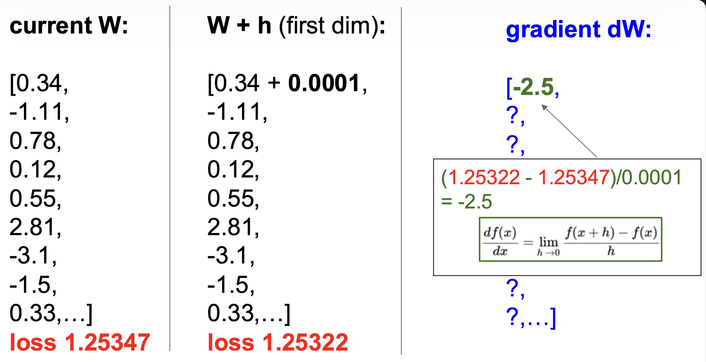
                </div>

            === "第2维"

                <div style="text-align: center">
                    
                </div>

            === "第3维"

                <div style="text-align: center">
                    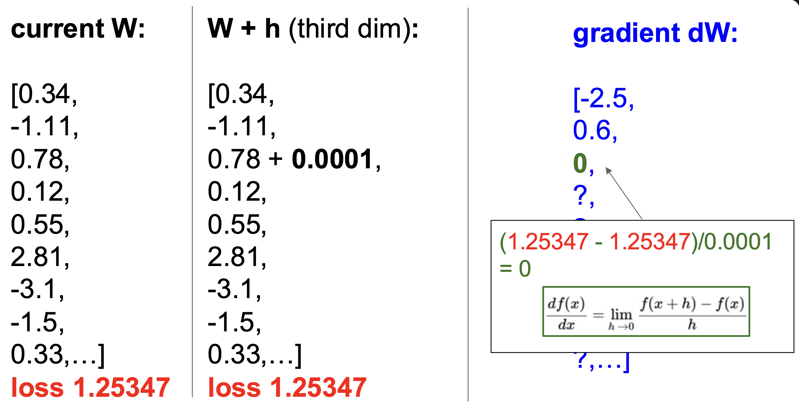
                </div>

            ---
            通过上述计算方法得到的梯度叫做**数值梯度**(numeric gradient)

            - 显然计算速度很慢，时间复杂度为 $O(\#\text{dimension})$
            - 得到的梯度是近似值

            ??? code "代码实现"

                ```py
                def eval_numerical_gradient(f, x):
                    """
                    a naive implementation of numerical gradient of f at x
                    - f should be a function that takes a single argument
                    - x is the point (numpy array) to evaluate the gradient at
                    """

                    fx = f(x) # evaluate function value at original point
                    grad = np.zeros(x.shape)
                    h = 0.00001

                    # iterate over all indexes in x
                    it = np.nditer(x, flags=['multi_index'], op_flags=['readwrite'])
                    while not it.finished:

                        # evaluate function at x+h
                        ix = it.multi_index
                        old_value = x[ix]
                        x[ix] = old_value + h # increment by h
                        fxh = f(x) # evalute f(x + h)
                        x[ix] = old_value # restore to previous value (very important!)

                        # compute the partial derivative
                        grad[ix] = (fxh - fx) / h # the slope
                        it.iternext() # step to next dimension

                    return grad
                ```

    - 任何方向的斜率都是该方向与梯度的**点积**(dot product)，而最陡的下降的方向就是**负梯度**的方向
    - 前面数值梯度的计算太笨了，一种更聪明的做法是使用微积分，这样得到的梯度是**分析梯度**(analytic gradient)
        - 这样得到的梯度精确、快速，但是容易算错

        ???+ example "例子"

            <div style="text-align: center">
                
            </div>

            实际上在计算 $\dfrac{dL}{dW}$ 时用到[**反向传播**](11.md)(backpropagation)，这会在之后详细介绍。

    - 实际应用中，我们总是用分析梯度，但也需要用数值梯度来检验实现，这叫做**梯度检查**(gradient check)

        ??? info "Pytorch 中的梯度检查"

            <figure style=" width: 60%" markdown="span">
                
                
                <figcaption></figcaption>
            </figure>

            <figure style=" width: 60%" markdown="span">
                
                
                <figcaption></figcaption>
            </figure>

    - 代码实现：

        ```py
        # Vanilla Gradient Descent
        w = initialize_weights()
        for t in range(num_steps):
            dw = compute_gradient(loss_fun, data, w)
            w -= learning_rate * dw
        ```

        - 迭代地向负梯度方向（局部最速下降方向）迈进
        - 这里有以下超参数：
            - 权重初始化方法（`initialize_weights()`）
            - 步数（`num_steps`）
            - 学习速率（`learning_rate`）
                - 又称为步长
                - 梯度仅告诉我们函数增加最快的方向，但它并没有告诉我们应该沿着这个方向走多远。所以选择步长将成为训练神经网络时最重要的（也是最令人头疼的）超参数设置之一

损失函数的可视化——**误差曲面**(error surface)（假设权重只是个二维向量）：

<div style="text-align: center">
    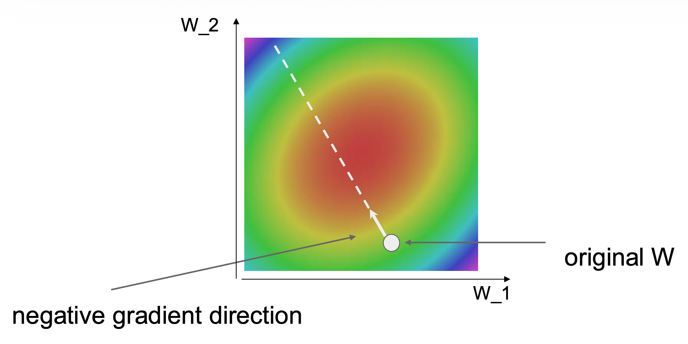
</div>

??? play "动画演示"

    <div style="text-align: center">
        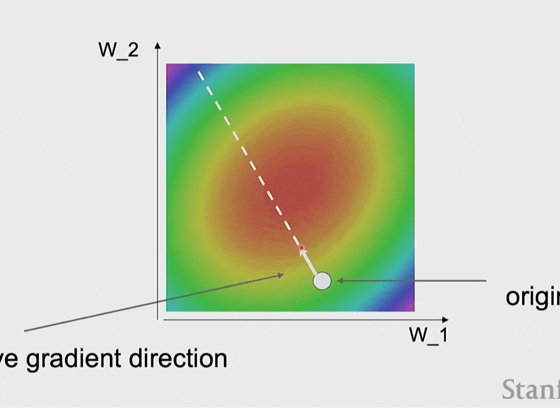
    </div>

    由于是固定步长，所以随着误差曲面变得越平缓，权重变化的速度就会逐渐放缓。

下面将更详细地介绍跟梯度下降法相关的技术。


### Stochastic Gradient Descent

已知损失函数：$L(W)=\frac{1}{N}\sum_{i=1}^{N}L_i(x_i,y_i,W)+\lambda R(W)$，那么该损失函数的梯度为：
$$
\nabla_WL(W)=\frac{1}{N}\sum_{i=1}^N\nabla_WL_i(x_i,y_i,W)+\lambda\nabla_WR(W)
$$

- 当 $N$ 很大时，计算成本将会很高昂
- 所以通常会用（随机采样的）**小批量**(minibatch)的样例做近似计算，每批的样例数一般设为 32 / 64 / 128
- **随机梯度下降法**(stochastic gradient descent, **SGD**)的代码实现：

    ```py
    # Stochastic gradient descent
    w = initialize_weights()
    for t in range(num_steps) :
        minibatch = sample_data(data, batch_size)
        dw = compute_gradient(loss_fn, minibatch, w)
        w -= learning_rate * dw
    ```

    超参数包括：权重初始化、步数、学习速率、批大小（`batch_size`）、数据采样（`sample_data`）

- 我们可以将损失看作在整个数据分布 $p_{\text{data}}$ 上的期望

    $$
    \begin{aligned}L(W)&=\mathbb{E}_{(x,y)\thicksim p_{data}}[L(x,y,W)]+\lambda R(W)\\&\approx\frac{1}{N}\sum_{i=1}^NL(x_i,y_i,W)+\lambda R(W)\\\nabla_WL(W)&=\nabla_W\mathbb{E}_{(x,y)\thicksim p_{data}}[L(x,y,W)]+\lambda\nabla_WR(W)\\&\approx\sum_{i=1}^N\nabla_wL_W(x_i,y_i,W)+\nabla_wR(W)\end{aligned}
    $$

???+ info "交互式网页 demo"

    <div style="text-align: center">
        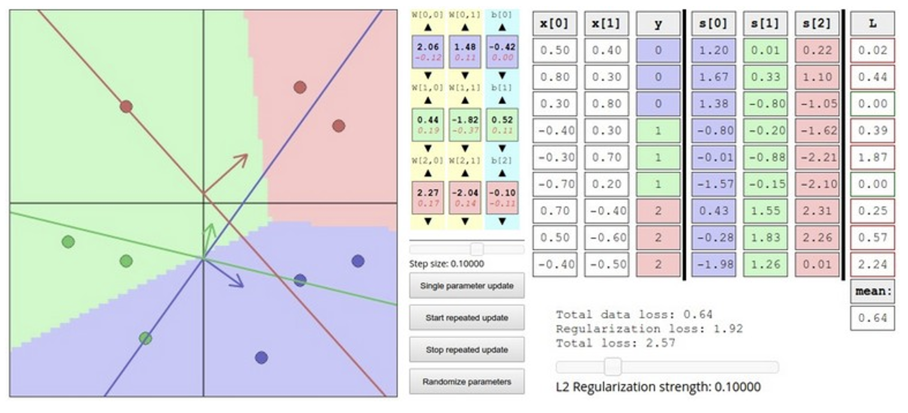
    </div>

    链接：<http://vision.stanford.edu/teaching/cs231n-demos/linear-classify/>

???+ bug "问题"

    - 要是损失沿某个方向下降很快，但是在另一个方向上下降很慢，那么使用梯度下降法会怎么样？
  
        - 答：在平坦的维度上前进缓慢，而在陡峭的维度上剧烈抖动(jitter)

        <div style="text-align: center">
            
        </div>

        - 注：损失函数的**条件数**(condition number)很大，即[**黑塞矩阵**](https://en.wikipedia.org/wiki/Hessian_matrix)(Hessian matrix)的最大与最小奇异值之比很大，用人话说就是此时输入数据的小幅扰动可能会导致输出结果的巨大变化

    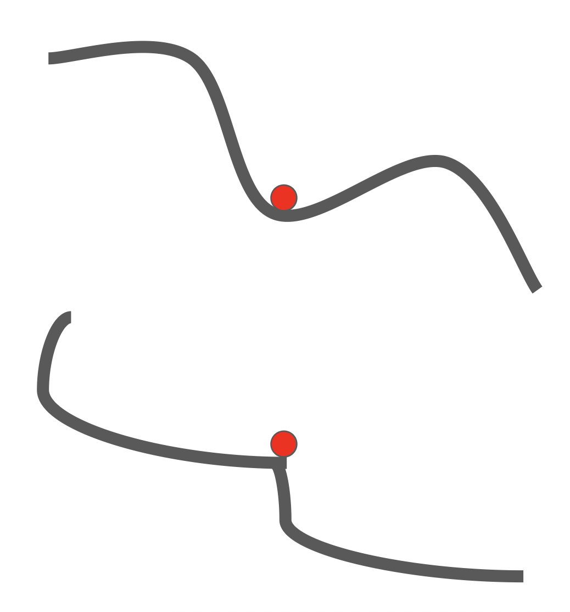{ align=right width=20% }

    - 损失函数上的**局部最小**(local minima)（上）和**鞍点**(sadde point)（下）问题
        - 在这些位置上，梯度 = 0，因此梯度下降法就不会进行下去了
        - 在高维空间中，鞍点更为常见

        ??? example "例子"

            <div style="text-align: center">
                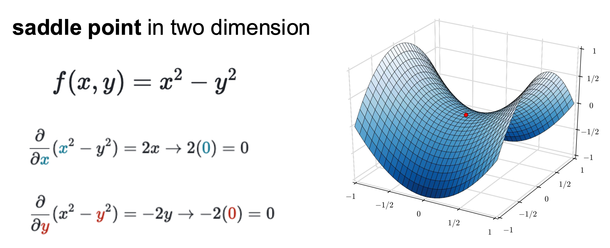
            </div>

    - 由于梯度是通过小批量样本得来的，因此计算结果会有很多噪声


### Momentum

SGD 的前两个问题都可通过额外增加一个**动量**(momentum)来解决。

<div style="text-align: center">
    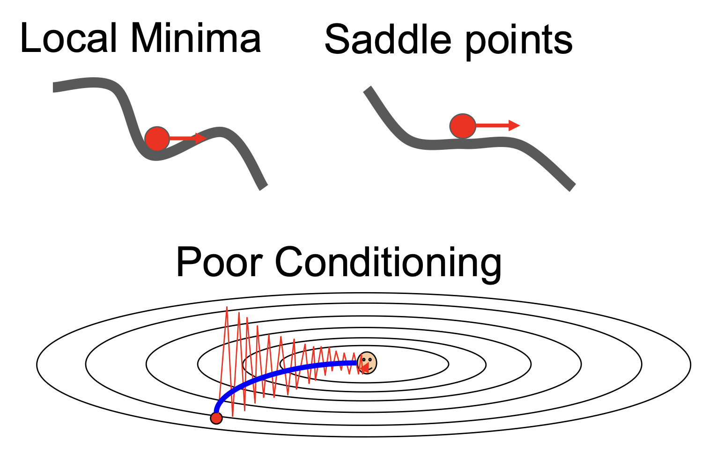
</div>

- 局部最小和鞍点情况下的红色箭头表示的是动量
- 下图的蓝线就是加入动量后的结果，发现没有剧烈抖动，而是直接前往梯度最小的地方

??? play "动画演示"

    <div style="text-align: center">
        
    </div>

    加了动量后，梯度下降速度明显变快。

SGD + 动量后的公式为：
$$
v_{t+1} = \rho v_t + \nabla f(x_t) \quad x_{t+1} = x_t - \alpha v_{t+1}
$$

代码实现如下：

```py
v = 0
for t in range(num_steps):
    dw = compute_gradient(w)
    v = rho * v + dw
    w -= learning_rate * v
```

- 这里建立了一个“速度”的概念（`vx`），作为梯度的运行中平均值
- 梯度前有一个系数 $\rho$，一般取 0.9 或 0.99

!!! note "动量更新"
    
    { align=right width=25% }

    将当前点的梯度与速度结合，得到用于更新权重的步长。

SGD + 动量的另一种等价形式是：
$$
v_{t+1} = \rho v_t - \alpha \nabla f(x_t) \quad x_{t+1} = x_t + v_{t+1}
$$

代码实现如下：

```py
v = 0
for t in range (num_steps):
    dw = compute_gradient(w)
    v = rho * v - learning_rate * dw
    w += v
```


#### Nesterov Momentum

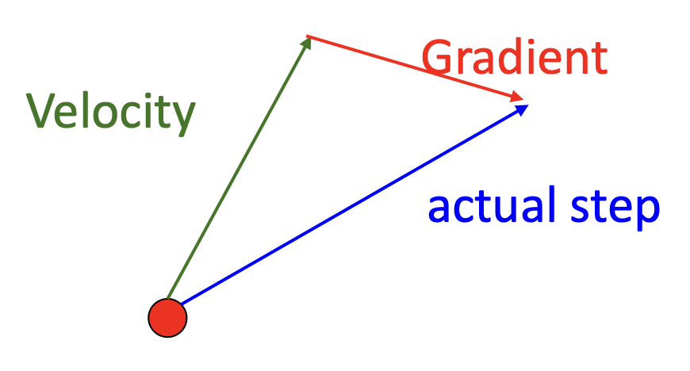{ align=right width=25% }

另一种和动量相关的变体是 **Nesterov 动量**。它的思路是：“向前看(look ahead)”一个使用速度更新将带我们到达的点。之后计算那里的梯度，并将其与速度混合，以获得实际的更新方向。

计算公式为：

$$
\begin{aligned}v_{t+1}&=\rho v_t-\alpha\nabla f(\boxed{x_t+\rho v_t})\\x_{t+1}&=x_t+v_{t+1}\end{aligned}
$$

其中框出来的地方比较麻烦，因为我们一般希望在关于 $x_t \nabla f(x_t)$ 上更新。所以可以做一次变量替换：$\tilde{x}_t = x_t + \rho v_t$，然后重新组织上面的公式为：

$$
\begin{aligned}&v_{t+1}\begin{aligned}=\rho v_t-\alpha\nabla f(\tilde{x}_t)\end{aligned}\\&\tilde{x}_{t+1}=\tilde{x}_t-\rho v_t+(1+\rho)v_{t+1}\\&=\tilde{x}_t+v_{t+1}+\rho(v_{t+1}-v_t)\end{aligned}
$$

代码实现如下：

```py
v = 0
for t in range(num_steps):
    dw = compute_gradient(w)
    old_v = v
    v = rho * v - learning_rate * dw
    w -= rho * old_v - (1 + rho) * v
```

下面的动画演示展示了 Nesterov 动量的效果：

??? play "动画演示"

    <div style="text-align: center">
        
    </div>

    黑线、蓝线、绿线分别对应普通的 SGD、SGD + 动量和 Nesterov 动量。


### RMSProp

**RMSProp** 是一种更复杂的优化器(optimizer)，它的代码实现如下：

```py
grad_squared = 0
while True:
    dx = compute_gradient(x)
    grad_squared = decay_rate * grad_squared + (1 - decay_rate) * dx * dx  # (1)
    x -= learning_rate * dx / (np.sqrt(grad_squared) + 1e-7)  # (2)
```

1.  基于各维度的历史平方和（带有衰减率），对梯度进行逐元素缩放
2.  “**每参数的学习率**(per-parameter learning rate)”或“**自适应学习率**(adaptive learning rate)”

通过 RMSProp，能够实现在陡峭的方向上减速，而在平坦的方向上加速。

??? play "动画演示"

    <div style="text-align: center">
        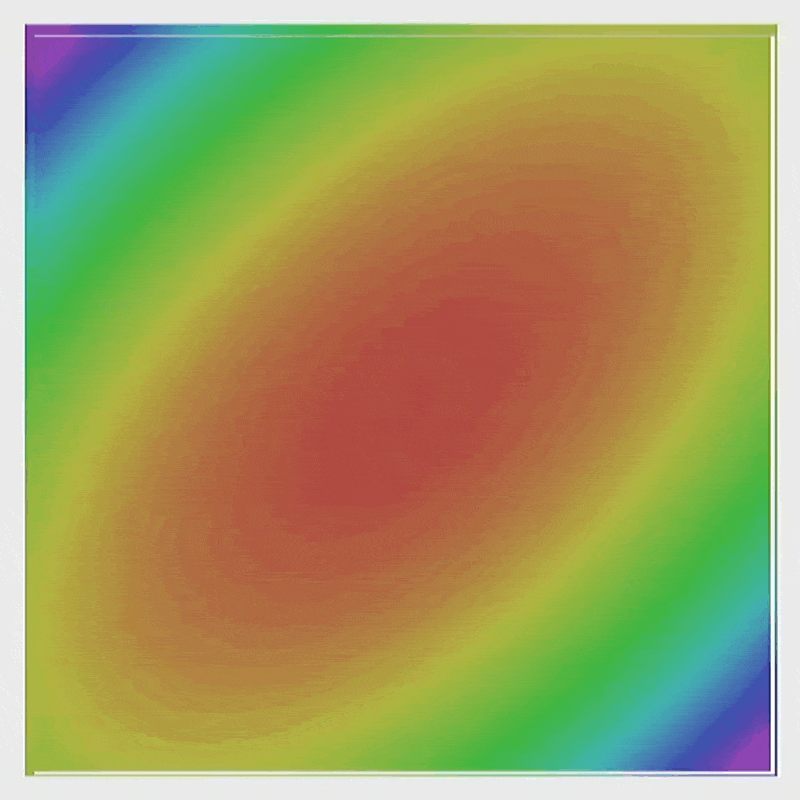
    </div>


### Adam

一种更复杂，但是更知名的优化器是 **Adam**。

??? info "看看 Adam 多有名"

    <div style="text-align: center">
        
    </div>

    ~~不过今年（2025） NeurIPS 评审的一个笑话就和这个有关（我想 AI 都知道这个吧，这太离谱了）~~

    <div style="text-align: center">
        
    </div>

它的代码实现如下：

```py
moment1 = 0
moment2 = 0
for t in range(1, num_steps + 1) :
    dw = compute_gradient(w)
    # Momentum
    moment1 = beta1 * moment1 + (1 - beta1) * dw
    # AdamGrad / RMSProp
    moment2 = beta2 * moment2 + (1 - beta2) * dw * dw
    # Bias correction
    moment1_unbias = moment1 / (1 - beta1 ** t)
    moment2_unbias = second2 / (1 - beta2 ** t)
    # AdamGrad / RMSProp
    w -= learning_rate * moment1_unbias / (moment2_unbias.sqrt() + 1e-7)
```

- **偏差纠正**(bias correction)的两行代码是为了应付刚开始估计 `moment1` 和 `moment2` 值时存在的偏差
    - 如果没有这一步处理，梯度最开始就很难降下去（读者可自行思考）
- 对多数模型而言，Adam 的参数设为 `beta1 = 0.9, beta2 = 0.99, learning_rate = 1e-3` 或 `5e-4` 是一个不错的开头

下面来看 Adam 的效果：

??? play "动画演示"

    <div style="text-align: center">
        
    </div>


### AdamW

**AdamW** 是 Adam 的一种变体。它和标准版 Adam 的区别在于会在最后增加一个**权重衰减**(weight decay)项，这也正是 L2 正则化发挥作用的地方（原来 L2 正则化是在 `computer_gradient()` 内就算好的）。

<div style="text-align: center">
    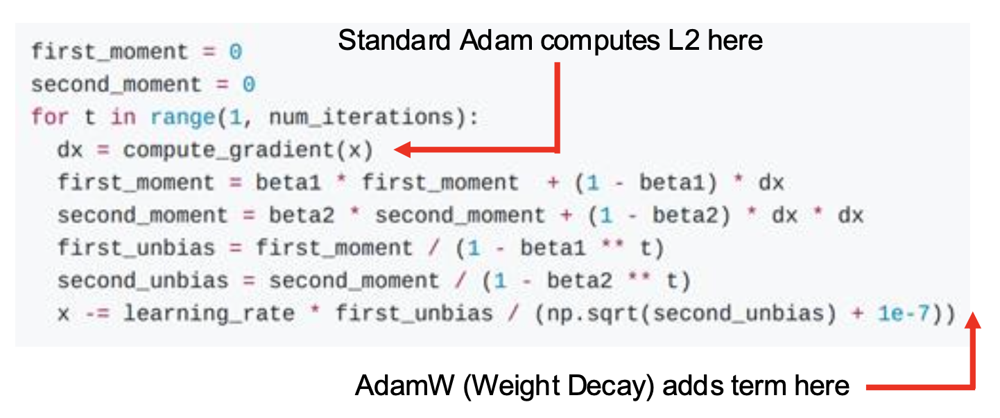
</div>

??? info "注"

    - L2 正则化和权重衰减在 SGD，SGD + 动量上是等价的，所以人们通常会混用这两个术语
    - 但它们在自适应方法上是不同的，比如 AdamGrad，RMSProp，Adam 等

算法如下：

<div style="text-align: center">
    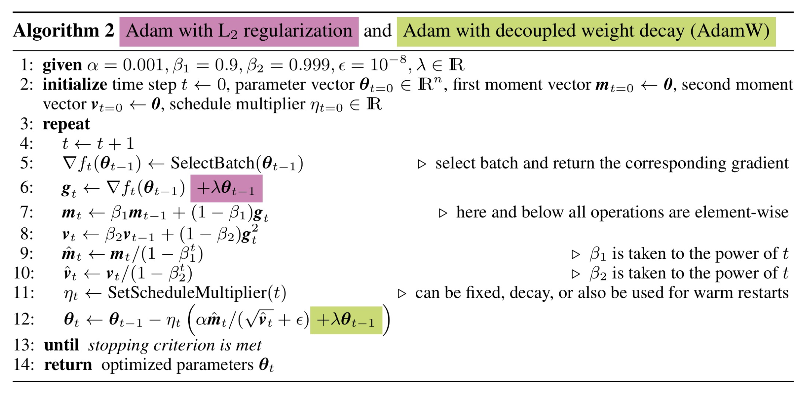
</div>

比较 Adam（对应图例 L2）和 AdamW（对应图例 wd）的训练效果，发现后者的准确率会略高一些。

<div style="text-align: center">
    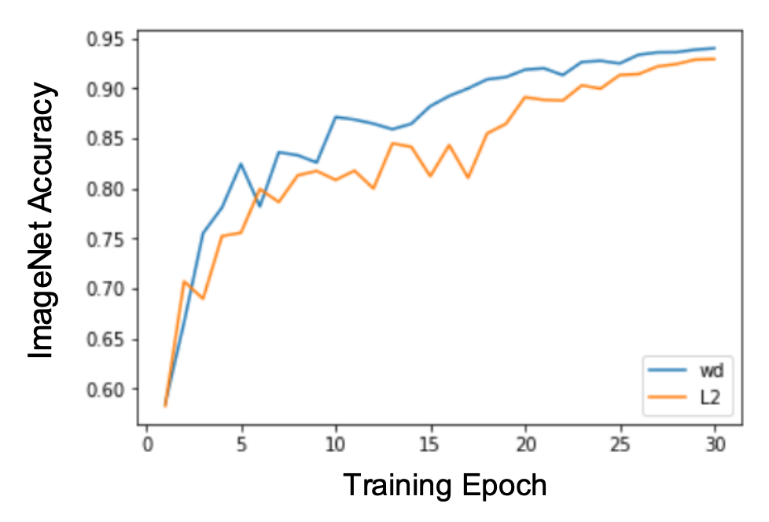
</div>

!!! note "温馨提示：对于一个新问题，AdamW 应当是你的“默认”优化器"

???+ abstract "总结：比较各种优化算法"

    <div style="text-align: center">
        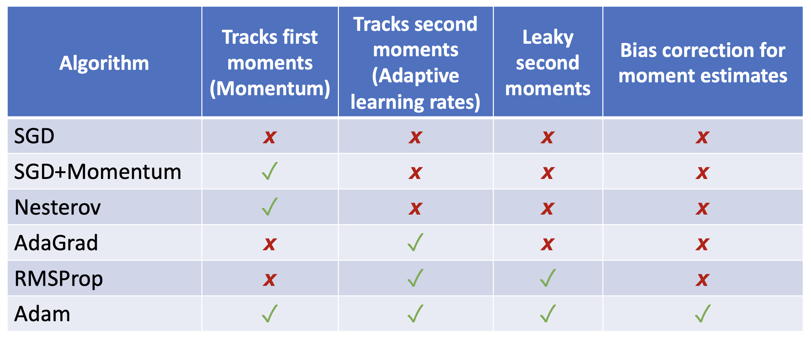
    </div>


### Learning Rate Schedules

{ align=right width=20% }

通过前面的学习不难发现，几乎所有的优化算法都包含了 `learning_rate`，即**学习速率**(learning rate)这一超参数。右图展示了一系列的学习速率，那么究竟哪个是最好的呢？答案是都可能是最好的，也就是要视情况而定。

通常学习速率不是一成不变的——我们会让学习速率随着迭代次数增加而**衰减**(decay)，比如到了一定次数（30 / 60 / 90 / ...次）后就适当减小学习速率（x0.1）

<div style="text-align: center">
    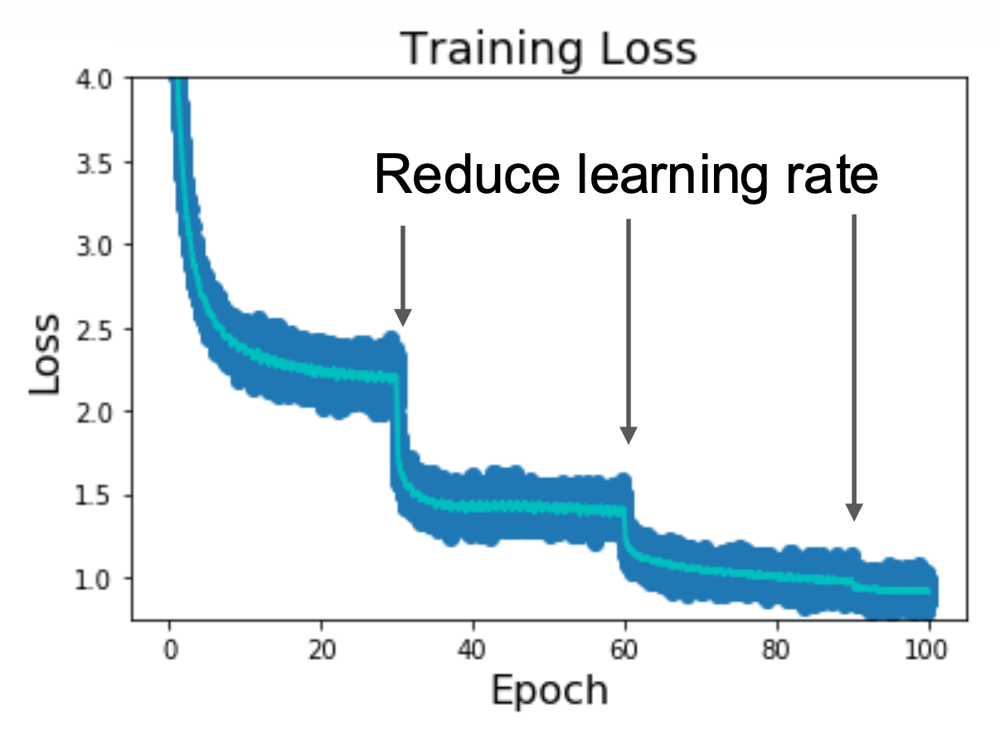
</div>

此外还有各种衰减的方式（其中 $\alpha_0$ 表示初始学习速率，$\alpha_t$ 表示第 $t$ 次迭代后的学习速率，$T$ 表示总的迭代次数）：

- 余弦函数：$\alpha_t = \dfrac{1}{2} \alpha_0 (1 + \cos(t \pi / T))$

    <div style="text-align: center">
        
        
    </div>

- 线性函数：$\alpha_t = \alpha_0 (1 - t / T)$

    <div style="text-align: center">
        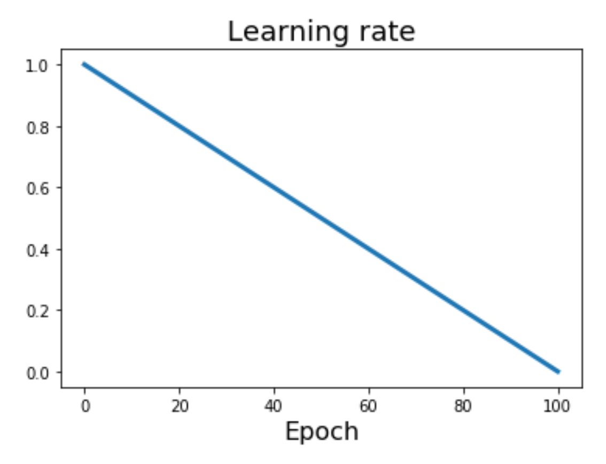
    </div>

- 平方根的倒数：$\alpha_t = \alpha_0 / \sqrt{t}$

    <div style="text-align: center">
        
    </div>

- **线性热身**(linear warmup)：
    - 较高的初始学习速率可能导致损失的激增。在最初的约 5000 次迭代中，将学习率从 0 开始线性增加可以避免这种情况
    - 经验法则：如果你批次大小增加 N，也要将初始学习率按 N 倍缩放

    <div style="text-align: center">
        
    </div>


### First-Order and Second-Order Optimization

- 一阶优化
    - 使用梯度以构成线性近似
    - 前进，以最小化近似

    <div style="text-align: center">
        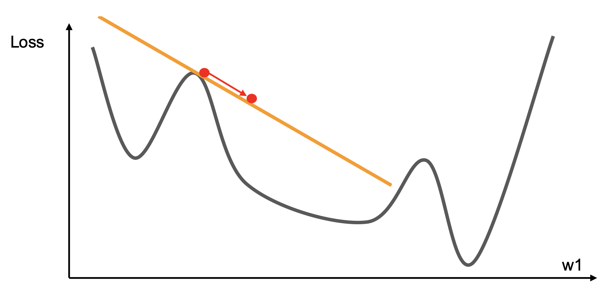
    </div>

- 二阶优化
    - 使用梯度和**黑塞矩阵**以形成**二次**(quadratic)近似
    - 前往近似的最小值

    <div style="text-align: center">
        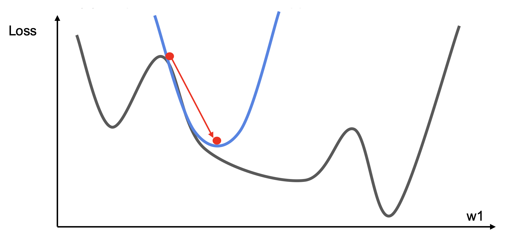
    </div>

    - 在曲率小的地方迈大步

    <div style="text-align: center">
        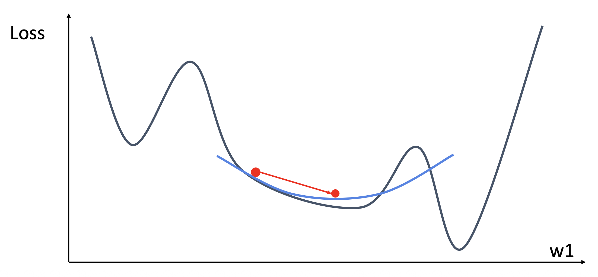
    </div>

    - 二阶泰勒展开

        $$
        J(\mathbf{\theta}) \approx J(\mathbf{\theta}_0) + (\mathbf{\theta} - \mathbf{\theta}_0)^\top \nabla_{\mathbf{\theta}} J(\mathbf{\theta}_0) + \frac{1}{2} (\mathbf{\theta} - \mathbf{\theta}_0)^\top \boldsymbol{H} (\mathbf{\theta} - \mathbf{\theta}_0)
        $$

        求解临界点(critical point)，我们得到牛顿参数更新：

        $$
        \theta^*=\theta_0-H^{-1}\nabla_{\boldsymbol{\theta}}J(\boldsymbol{\theta}_0)
        $$

        ??? question "思考"

            === "题目"

                为何这不利于深度学习？

            === "答案"

                黑塞矩阵有 $O(N^2)$ 个元素，求逆的时间复杂度为 $O(N^3)$。而在深度学习中，$N$ 的大小数以百万计。

    - **拟牛顿法**(quasi-Newton method)（以 BGFS 最为常用）：不直接求逆黑塞矩阵，而是随时间通过秩 1 更新来近似其逆矩阵（每次更新为 $O(N^2)$ 复杂度）
    - **L-BFGS**（有限内存的 BFGS 算法）：不形成/存储完整的逆黑塞矩阵
        - 通常在完整批量、确定性模式下运行良好：有一个单一且确定的 f(x)，那么 L-BFGS 算法很可能会表现得非常出色
        - 不太适合于小批量设置：结果不佳；将二阶方法应用于大规模、随机设置是研究的一个活跃领域

!!! note "实际应用"

    - **Adam(W)** 在很多情况下是一个好的默认选择，通常即使使用恒定学习率也能正常工作
    - **SGD + Momentum** 可能比 Adam 表现更好，但可能需要对学习率和调度进行更多的调整
    - 如果你能够承担全批量更新的成本，那么可以考虑用二阶及以上的优化