# Neural Networks and Backpropagation

## Image Features

??? bug "线性分类器的缺陷"

    <div style="text-align: center">
        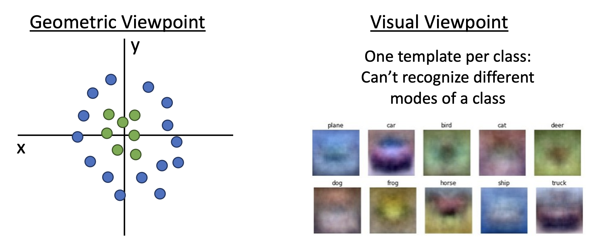
    </div>

解决线性分类器分类不清的一种方案是**特征变换**(feature transform)，比如从笛卡尔坐标变换到极坐标上，即从原始空间变换到特征空间。

<div style="text-align: center">
    
</div>

特征变换在 CV 领域得到广泛应用，包括：

=== "颜色直方图"

    <div style="text-align: center">
        
    </div>

=== "方向梯度直方图（HoG）"

    <div style="text-align: center">
        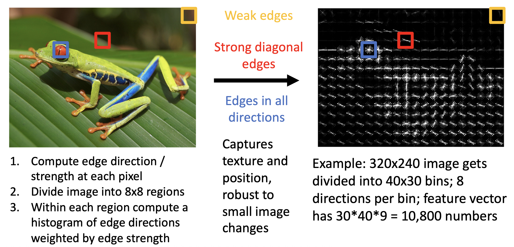
    </div>

=== "词袋模型（数据驱动）"

    <div style="text-align: center">
        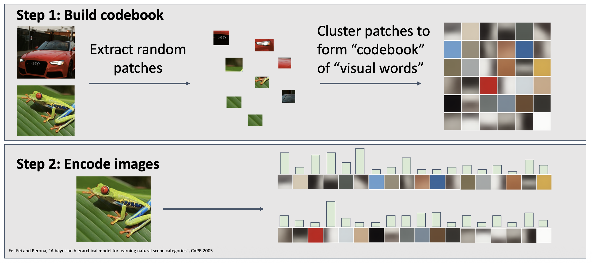
    </div>

一种得到广泛应用的技巧是：假如一幅图像有多个特征表示（比如前面提到的颜色、方向梯度、词袋等），我们可以将它们连接起来，构成一个长长的特征向量。比如在 2011 年 ImageNet 挑战赛中的获胜模型就用了这种技术。

<div style="text-align: center">
    
</div>

在 2012 年前，这种基于图像特征的图像分类模型曾占据主导地位；但到了 2012 年 AlexNet 的出现，让人们认识到神经网络架构在图像分类上的强大威力，自此神经网络逐渐成为主流技术。下面就来详细介绍神经网络。

<div style="text-align: center">
    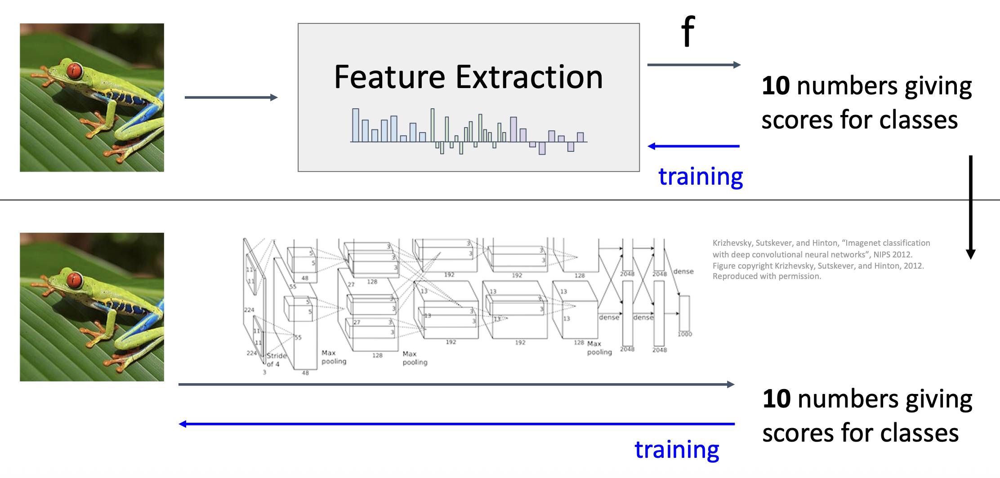
</div>


## Neural Networks

??? example "深度学习的应用"

    === "DALL-E 系列"

        <div style="text-align: center">
            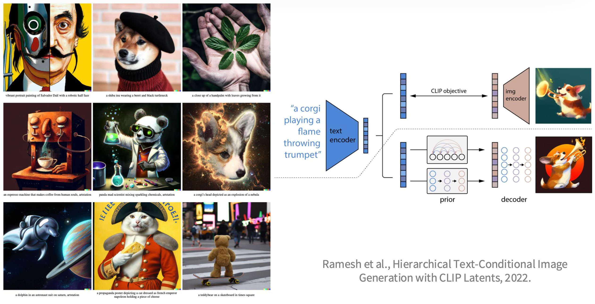
        </div>

    === "万物分割模型(Segment Anything Model, SAM)"

        <div style="text-align: center">
            
        </div>

    === "Sora 系列"

        <div style="text-align: center">
            
        </div>

        >~~在笔者撰写这篇笔记时，他的 B 站上充斥着各种 Sora 2 生成的短视频（合集）~~。

而实现这些深度学习应用的核心技术和原理便是本讲的主角——**神经网络**(nerual network)。

之前介绍的线性分类器就是一种（也许是最）简单的神经网络，对应的线性分数函数为：
$$
f = Wx \quad (x \in \mathbb{R}^D, W \in \mathbb{R}^{C \times D})
$$

现在我们更进一步，搭建一个 2 层的神经网络：
$$
f = W_2 \max(0, W_1 x) \quad (x \in \mathbb{R}^D, W_1 \in \mathbb{R}^{H \times D}, W_2 \in \mathbb{R}^{C \times H})
$$

图形化的表述如下图所示。我们可以这么理解：

<div style="text-align: center">
    
</div>

{ align=right width=20% }

- 第一层网络的作用是对于一张展平为 3072 维的图像，从 100 个模板中找出最匹配的**模板**(template)
- 而第二层网络就找出这个模板对应到的类（所以一个类可以有多个模板）
    - 但多数模板是不可解释的

3 层网络的构建也是类似的：
$$
f = W_3 \max(0, W_2 \max(0, W_1 x)) \quad (x \in \mathbb{R}^D, W_1 \in \mathbb{R}^{H_1 \times D}, W_2 \in \mathbb{R}^{H_2 \times H_1}, W_3 \in \mathbb{R}^{C \times H_2})
$$

!!! warning "注意"

    实际应用中，我们通常会在每一层增加一个**可学习的偏移量**(learnable bias)。比如三层神经网络应该表示为：
    $$
    f(x)=W_3\max(0,W_2\max(0,W_1x+b_1)+b_2)+b_3   
    $$
    
    不过为了方便讨论，这里（包括本讲的后续部分）不会引入这个偏移量，但读者需要记得这件事。

实际应用中，神经网络的层数可能远不止 3 层。我们称这种多层的神经网络为**深度神经网络**(deep neural network)（“深度(depth)”的意思就是层数；对应地，“宽度(width)”是指层的大小）。

<div style="text-align: center">
    
</div>

---
“神经网络”是一个很宽泛的概念，而更准确的叫法是**全连接网络**(fully-connected network)（有时又称为**多层感知器**(multi-layer perceptrons, MLP)）。不过在本讲笔记中我们就不做区分了（~~因为还没有引入更多的神经网络类型~~）。

通常我们会用以下形式来展现一个神经网络：

<div style="text-align: center">
    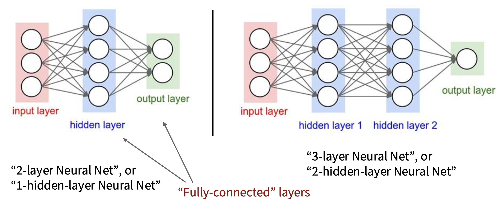
</div>

图中的一个个球表示的是网络中的**神经元**(neuron)。可以看到，一个神经网络会被分为以下三部分：

- **输入层**(input layer)
- **隐藏层**(hidden layer)
- **输出层**(output layer)

其中后两个部分构成的网络才是全连接网络的组成部分。


### Activation Functions

到这里也许读者会有这样的疑问：这里为什么要用到 $\max(0, x)$ 函数，我们可不可以去掉它呢？（比如对于 2 层网络，$f = W_2 W_1 x$）答案是否定的：只要令 $W_3 = W_2 W_1 \in \mathbb{R}^{C \times H} \Rightarrow f = W_3 x$——这不就是线性分类器吗！

实际上这个看似简单的 $\max$ 函数叫做 ReLU，它是一种**激活函数**(activation function)，而且可作为多数问题的默认激活函数（~~显然是因为表现不错~~）。下面罗列了各种激活函数的函数图像：

<div style="text-align: center">
    
</div>


### Implementation

由于计算过程是向前的（输入 -> 输出），以及要和后面介绍的概念做区分，因此我们称这样的计算为**前馈计算**(feed-forward computation)。下面是一段关于简单的 3 层神经网络的计算：

```py
# forward-pass of a 3-layer neural network:
f = lambda x: 1.0 / (1.0 + np.exp(-x))  # activation function (use sigmoid)
× = np.random.randn(3, 1)               # random input vector of three numbers (3x1)
h1 = f(np.dot(W1, x) + b1)              # calculate first hidden layer activations (4x1)
h2 = f(np.dot(W2, h1) + b2)             # calculate second hidden layer activations (4x1)
out = np.dot(W3, h2) + b3               # output neuron (1x1)
```

而训练一个 2 层神经网络的完整实现大概需要 20 行，代码量也不是很大：

```py
import numpy as np
from numpy.random import randn

# Define the network
n, D_in, H, D_out = 64, 1000, 100, 10
x, y = randn(N, D_in), randn(N, D_out)
w1, w2 = randn(D_in, H), randn(H, D_out)

# Forward pass
for t in range(2000):
    h = 1 / (1 + np.exp(-x.dot(w1)))
    y_pred = h.dot(w2)
    loss = np.square(y_pred - y).sum()
    print(t, loss)

    # Calculate the analytical gradient
    grad_y_pred = 2.0 * (y_pred - y)
    grad_w2 = h.T.dot(grad_y_pred)
    grad_h = grad_y_pred.dot(w2.T)
    grad_w1 = x.T.dot(grad_h * h * (1 - h))

    # Gradient descent
    w1 -= 1e-4 * grad_w1
    w2 -= 1e-4 * grad_w2
```

更多的神经元往往意味着更强大的网络，如下图所示：

<div style="text-align: center">
    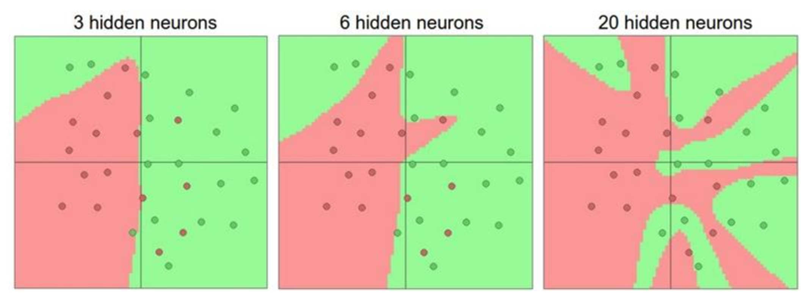
</div>

但不要将神经网络的大小直接作为正则化器的参数，应当使用更强大的正则化技术。

<div style="text-align: center">
    
</div>

一些在线 demo：

- [Web demo with ConvNetJS](http://cs.stanford.edu/people/karpathy/convnetjs/demo/classify2d.html)
- [TensorFlow Play Ground](https://playground.tensorflow.org/)


### Comparing with Biological Neural Network

“神经网络”一词显然来自生物学的类比，因为这种架构和生物学的神经网络十分相似。

<div style="text-align: center">
    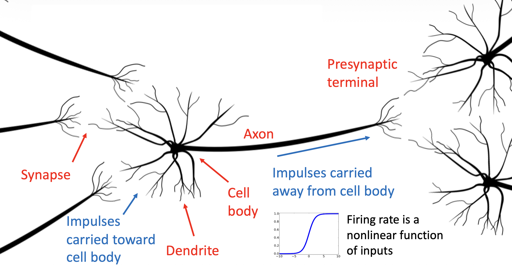
</div>

对比生物学的神经元和人工神经元：

<div style="text-align: center">
    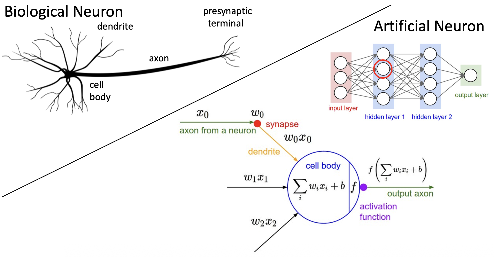
</div>

{ align=right width=25% }

但两者还是有些区别的：

- 生物意义上的神经元可以构成相当复杂的连接模式
    - 神经元有众多不同类型
    - 树突可以执行很复杂的非线性计算
    - 突触可不是单个权重，而是一个复杂的非线性动态系统
    - 仅通过“放电率(firing rate)”来抽象神经元是不够的，激活的时间序列同样重要（脉冲神经网络(spiking neural network)）
- 而深度学习中的神经网络里的神经元会被人为地组织成规整的层级结构，以实现高效的计算
    - 但随机连接的神经网络有时也能起作用（~~但实际应用中谁会这样做啊~~）


### Space Warping

一种思考神经网络为何如此强大的有趣方式是通过**空间扭曲**(space warping)（由之前介绍的特征变换实现）的视角来观察。

=== "线性分类器"

    考虑以下线性变换：$h = Wx$，其中 $x, h$ 都是二维的。线性变换前后发生的变化如下所示：

    <div style="text-align: center">
        
    </div>

    对于平面上的点，变换前后的分布如下所示：

    <div style="text-align: center">
        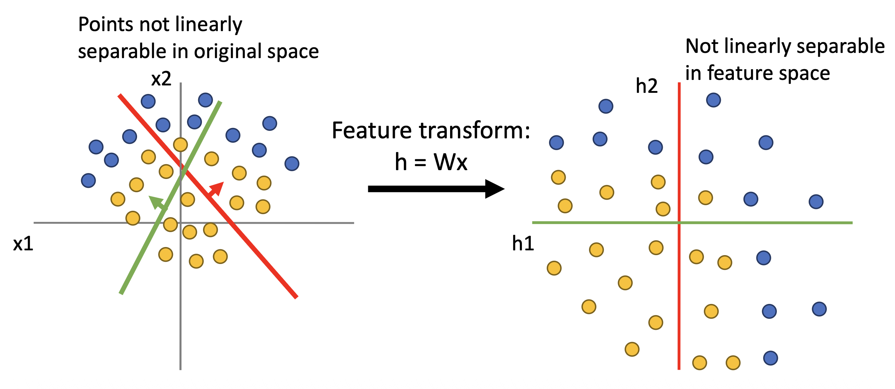
    </div>

    可以看到，在变换前后，平面上的这两类点都没有做到被线性划分，因此分类效果并不是很好。


=== "神经网络（ReLU）"

    考虑神经网络某个隐藏层 $h = \text{ReLU}(Wx) = \max(0, Wx)$，其中 $x, h$ 都是二维的。特征变换前后发生的变化如下所示：

    <div style="text-align: center">
        
    </div>

    注意到除了 A 区域外的其他区域都被挤压到两条直线上。这使得空间上的点更有可能被线性划分，因而分类效果更佳。

    <div style="text-align: center">
        
    </div>


### Universal Approximation

**通用近似**(universal approximation)是指神经网络的某一个隐藏层可以以任意精度近似任意函数 $f: \mathbb{R}^N \rightarrow \mathbb{R}^M$。下面就以使用 2 层 ReLU 网络近似函数 $f: \mathbb{R} \rightarrow \mathbb{R}$ 为例来说明这一点。

<div style="text-align: center">
    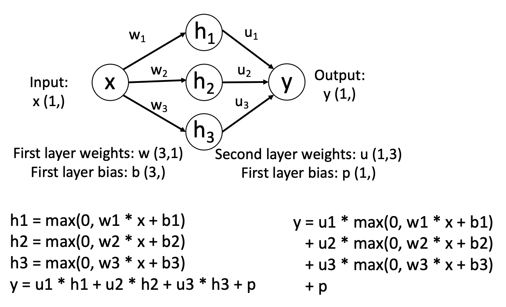
</div>

{ align=right width=30% }

右下角的方程正是 $f: \mathbb{R} \rightarrow \mathbb{R}$ 的近似表示。为什么这么说呢？先来理解这样一件事：**输出值本质上是缩放过的(scaled)、移动过的(shifted)一组 ReLU 函数之和**。右图展示的便是其中一个经过变换的 ReLU 函数曲线。

我们可以用 4 个隐藏层单元来构建一个“凹凸(bump)函数”。

<div style="text-align: center">
    
</div>

{ align=right width=30% }

以此类推，假如有 4K 个隐藏层单元，就能构建一个由 K 个凹凸函数构成的函数，而这个函数可用于近似任意（简单的）函数。对于更复杂的函数，我们还得考虑：

- 凹凸函数之间的间隔
- 其他非线性？
- 高维函数？

事实上，神经网络不会去学习这些凹凸函数。

通用近似告诉我们的是“神经网络能用来表示任意函数”，而不是告诉我们：

- 是否真的能够通过 SGD 学习任何函数
- 需要多少数据学习一个函数

>注：[kNN](9.md#k-nearest-neighbor-classifier) 也是一个通用近似器。


### Convex Functions

>注：本节为扩展内容，不强求完全掌握（~~但这些知识并不难，可能比前面讲得还简单~~）。

对于一个函数 $f: X \subseteq \mathbb{R}^N \rightarrow \mathbb{R}$，若 $\forall\ x_1, x_2 \in X, t \in [0, 1]$，满足以下不等式，则 $f$ 是一个**凸函数**(convex function)。
$$
f(tx_1 + (1 - t)x_2) \le tf(x_1) + (1 - t)f(x_2)
$$

??? example "例子"

    $f(x) = x^2$ 是凸函数：

    <div style="text-align: center">
        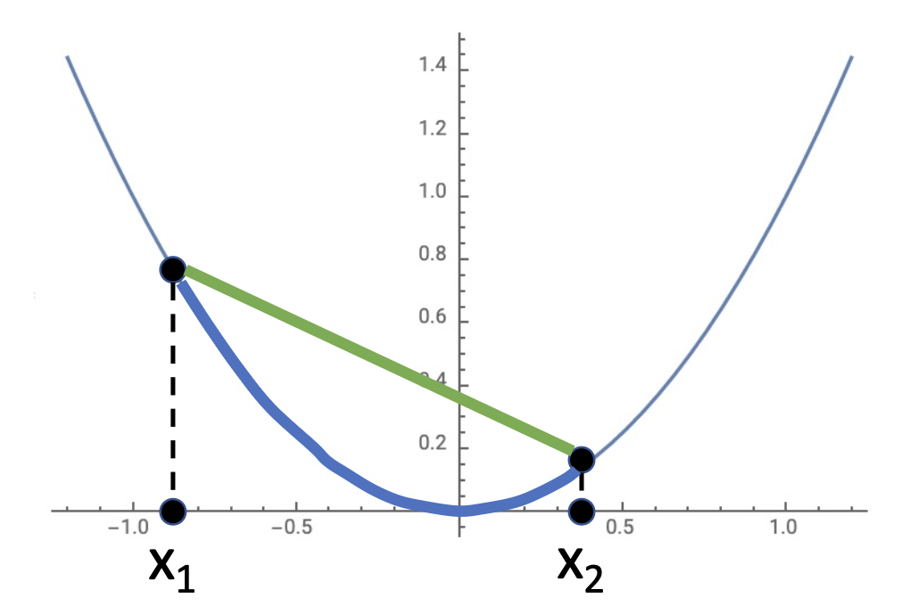
    </div>

    而 $f(x) = \cos (x)$ 不是凸函数：

    <div style="text-align: center">
        
    </div>

{ align=right width=20% }

直观感受上看，在多维空间上的凸函数就像一个碗，如右图所示。

一般来说，在凸函数上**做优化更容易些**——可以推导出收敛到**全局最小值**(global minima)的理论保证。

<br/>

- 线性分类器就是在优化一个凸函数
- 但神经网络就不确定了
    - 有时损失函数是一个凸函数

        <div style="text-align: center">
            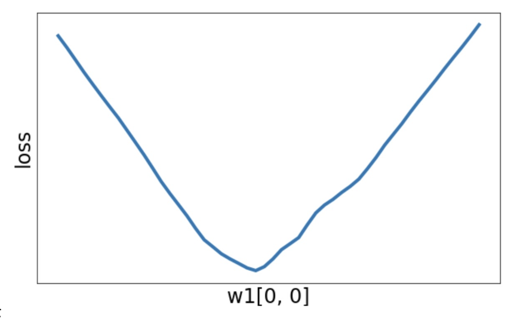
        </div>

    - 但通常不是一个凸函数

        <div style="text-align: center">
            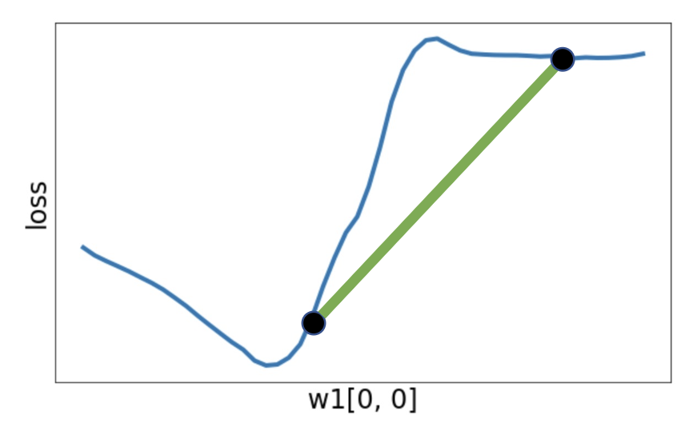
        </div>

    - 或者有一个局部最小值

        <div style="text-align: center">
            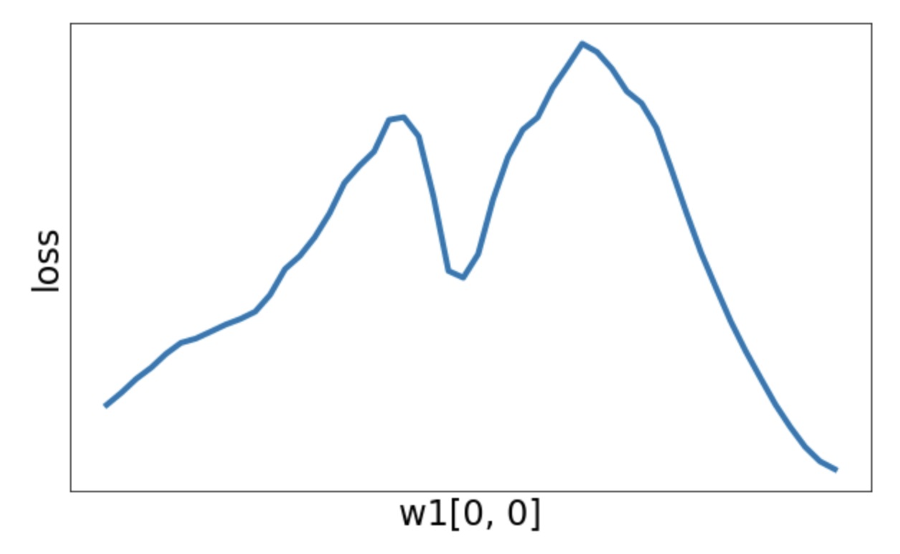
        </div>

    - 或者可以很“狂野”

        <div style="text-align: center">
            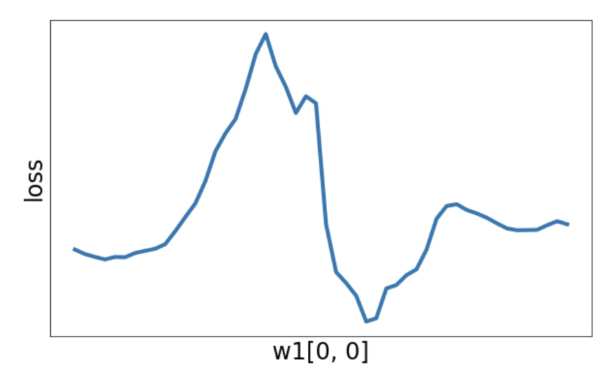
        </div>

总之，大多数神经网路是在非凸函数上做优化的。

- 很少会或压根不保证收敛
- 从经验来看，它似乎仍然有效
- 这是研究中的活跃领域


### Loss Functions

引入神经网络后，我们得重新考虑损失函数的计算及优化了。

- 非线性分数函数：$s = f(x; W_1, W_2) = W_2 \max(0, W_1 x)$
- 预测值的铰链损失（SVM）：$L_i = \sum\limits_{j \ne y_i} \max(0, s_j - s_{y_i} + 1)$
- 正则化：$R(W) = \sum\limits_k W_k^2$
- 总损失 = 数据损失 + 正则化：$L = \frac{1}{N} \sum_{i=1}^{N} L_i + \lambda R(W_1) + \lambda R(W_2)$

要计算损失函数的梯度，即 $\dfrac{\partial L}{\partial W_1}, \dfrac{\partial L}{\partial W_2}$，我们得先训练出 $W_1, W_2$ 的参数。

一种简单粗暴的想法是直接计算 $\nabla_W L$——可即便是三层神经网络也很难算下去啊：

<div style="text-align: center">
    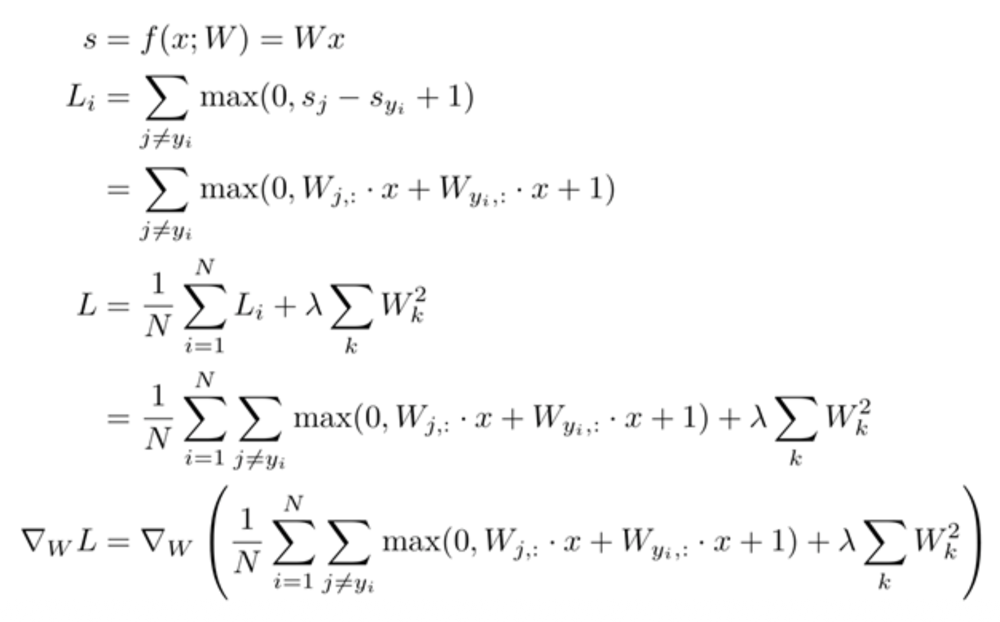
</div>

问题在于：

- 直接做会涉及到很多矩阵上的微积分计算
- 要是我们换一种损失函数的计算方式，比如用 Softmax，那么就得从头开始重新计算梯度了
- 这还只是很简单的模型，复杂的模型更是不可能这么就算出来了，比如：
    - [AlexNet](https://en.wikipedia.org/wiki/AlexNet)（一种经典的 CNN 架构）

        <div style="text-align: center">
            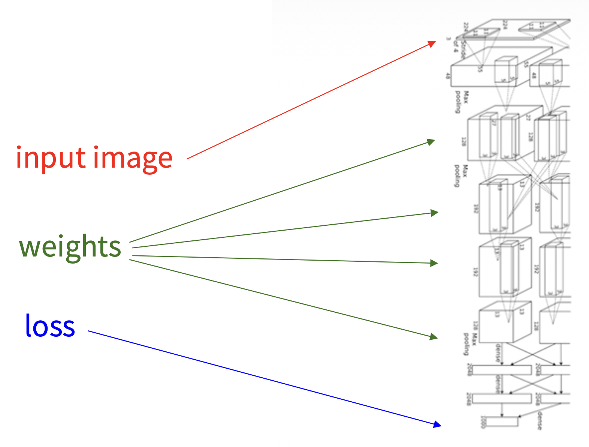
        </div>

    - [神经图灵机](https://en.wikipedia.org/wiki/Neural_Turing_machine)(Neural Turing Machine, NTM)

        <div style="text-align: center">
            
        </div>

实际上，我们的解决方案是**计算图**(computational graph) + **反向传播**(backpropagation)，下面马上介绍！

<div style="text-align: center">
    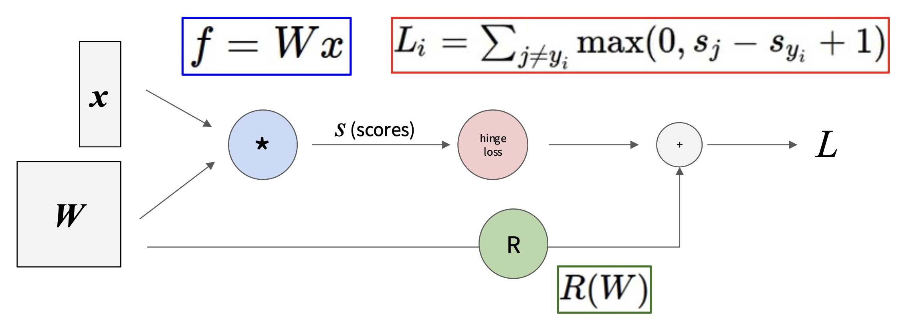
</div>


## Backpropagation

### A Simple Example

{ align=right width=30% }

先从一个很简单的例子开始：假定某个神经元的激活函数为 $f(x, y, z) = (x + y)z$。令 $q = x + y$，那么 $f = qz$。因此可得到：
$$
\dfrac{\partial q}{\partial x} = 1,\ \dfrac{\partial q}{\partial y} = 1,\ \dfrac{\partial f}{\partial q} = z,\ \dfrac{\partial f}{\partial z} = q
$$

我们要计算的是 $\dfrac{\partial f}{\partial x}, \dfrac{\partial f}{\partial y}, \dfrac{\partial f}{\partial z}$。其中最后一个已经得出来，现在只需考虑前两个该如何计算的就行了。由于 $x, y$ 是对称的，所以它们的计算方式是一致的，那就是要用到偏微分的**链式法则**(chain rule)，即：
$$
\dfrac{\partial f}{\partial x} = \dfrac{\partial f}{\partial q} \dfrac{\partial q}{\partial x},\ \dfrac{\partial f}{\partial y} = \dfrac{\partial f}{\partial q} \dfrac{\partial q}{\partial y}
$$

如下图所示，我们发现梯度的计算方向是**从输出到输入的**，故曰“反向(backward)”。其中 $\dfrac{\partial L}{\partial z}$ 称为**上游梯度**(upstream gradient)，$\dfrac{\partial L}{\partial x}, \dfrac{\partial L}{\partial y}$ 称为**下游梯度**(downstream gradient)，而神经元内的梯度称为**局部梯度**(local gradient)。

<div style="text-align: center">
    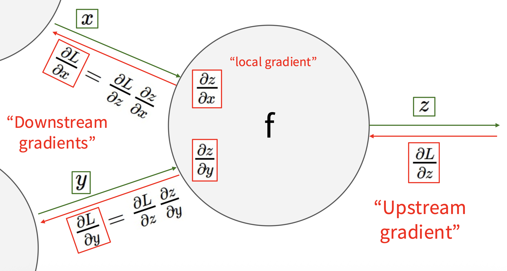
</div>

!!! info "注"

    最上游的梯度 $\dfrac{\partial f}{\partial f} = 1$，在反向传播中作为 base case 使用。


### Sigmoid Example

下面来看一个更复杂的例子，以加深对反向传播机制的理解。假设激活函数 $f(w, x) = \dfrac{1}{1 + e^{-(w_0 x_0 + w_1 x_1 + w_2)}}$，我们可以将这一复杂计算拆分为多个不可分割的计算（一个复杂神经元 -> 多个简单神经元构成的小网络）。

<div style="text-align: center">
    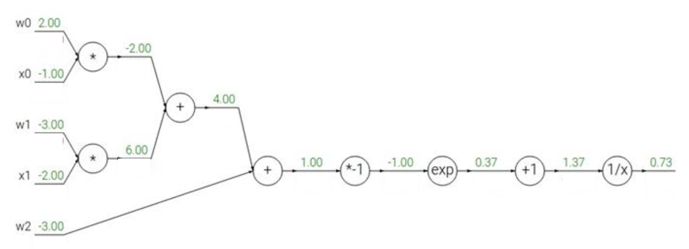
</div>

我们从右往左计算梯度值（图中红色数字）：

=== "反比例函数"

    <div style="text-align: center">
        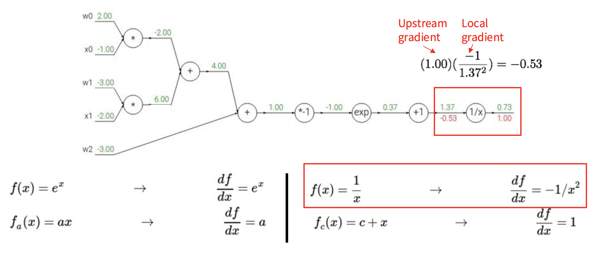
    </div>

=== "线性函数（带常数）"

    <div style="text-align: center">
        
    </div>

=== "指数函数"

    <div style="text-align: center">
        
    </div>

=== "线性函数（带系数）"

    <div style="text-align: center">
        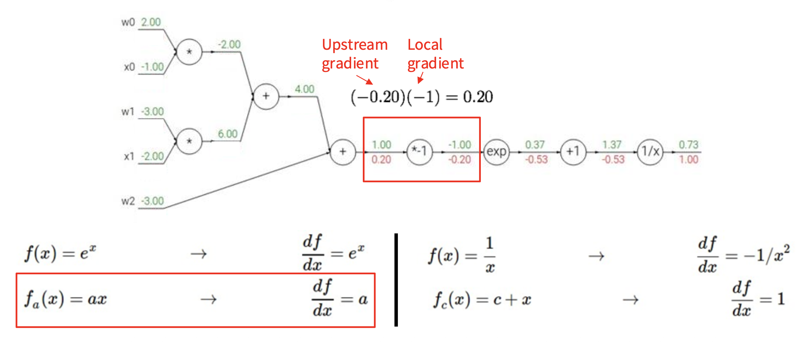
    </div>

=== "加法"

    <div style="text-align: center">
        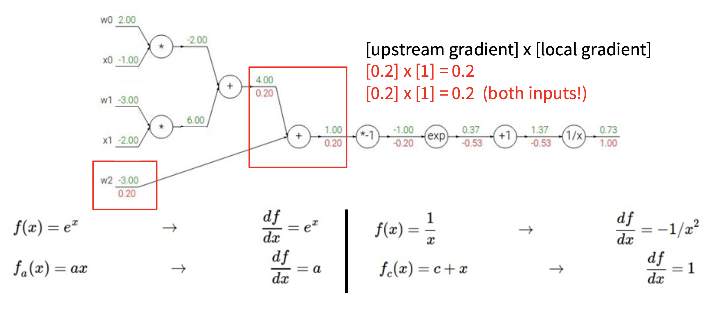
    </div>

=== "乘法"

    <div style="text-align: center">
        
    </div>

如下图所示，蓝框标出的部分就是 Sigmoid 函数 $\sigma(x) = \dfrac{1}{1 + e^{-x}}$。

<div style="text-align: center">
    
</div>

而 Sigmoid 的局部梯度为：

$$
\frac{d\sigma(x)}{dx}=\frac{e^{-x}}{\left(1+e^{-x}\right)^2}=\left(\frac{1+e^{-x}-1}{1+e^{-x}}\right)\left(\frac{1}{1+e^{-x}}\right)=\left(1-\sigma(x)\right)\sigma(x)
$$

!!! info "注"

    计算图的表示并不唯一，选择一种能够表示清楚每个节点的局部梯度的那种就 OK 了。

下面列举一些常见的梯度流模式：

<div class="grid cards" markdown>

-   加法门(add gate)：梯度分配器

    <figure markdown="span">
        { width=60% }
        <figcaption></figcaption>
    </figure>

-   乘法门(mul gate)：交换乘数

    <figure markdown="span">
        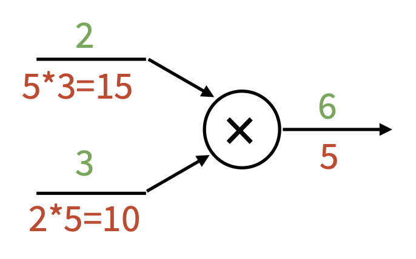{ width=60% }
        <figcaption></figcaption>
    </figure>

-   拷贝门(copy gate)：梯度加法器

    <figure markdown="span">
        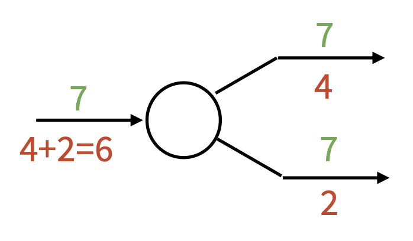{ width=60% }
        <figcaption></figcaption>
    </figure>

-   最大门(max gate)：梯度路由器

    <figure markdown="span">
        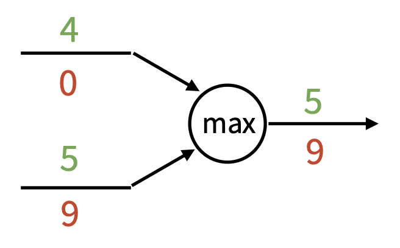{ width=60% }
        <figcaption></figcaption>
    </figure>

</div>

>这些节点被叫做“门”，是因为有时计算图又被称为电路图(circuit diagram)。

下面是反向传播的代码实现，但是将每一步都展开来：

```py
def f(w0, x0, w1, x1, w2):
    # Forward pass: Compute output
    # Multiply gate
    s0 = w0 * x0
    s1 = w1 * x1
    # Add gate
    s2 = s0 + s1
    s3 = s2 + w2
    L = sigmoid(s3)                     # Sigmoid

    # Backward pass: Compute grads
    grad_L = 1.0                        # Base case
    grad_s3 = grad_L * (1 - L) * L      # Sigmoid
    # Add gate
    grad_w2 = grad_s3
    grad_s2 = grad_s3
    grad_s0 = grad_s2
    grad_s1 = grad_s2
    # Multiply gate
    grad_w1 = grad_s1 * x1
    grad_x1 = grad_s1 * w1
    grad_w0 = grad_s0 * x0
    grad_x0 = grad_s0 * w0
```

模块化的代码实现如下（提供了前向和反向计算的 API）：

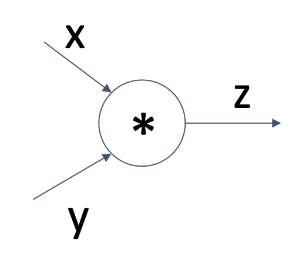{ align=right width=10% }

```py
class Multiply(torch.autograd.Function):
    @staticmethod
    def forward(ctx, x, y):
        # need to cache some values for use in backward
        ctx.save_for_backward(x, y)
        z = x * y
        return z

    @staticmethod
    # upstream gradient
    def backward(ctx, grad_z):
        x, y = ctx.saved_tensors
        # multiply upstream and local gradients
        grad_x = y * grad_z      # dz/dx * dL/dz
        grad_y = x * grad_z      # dz/dy * dL/dz
        return grad_x, grad_y
```

>这里的 `x`, `y`, `z` 都是标量。

??? example "Pytorch 中的算子"

    GitHub 仓库：<https://github.com/pytorch/pytorch>

    Pytorch Sigmoid 层的实现（来自 sha 值为 571c7c9 的 commit）：<https://github.com/pytorch/pytorch/blob/517c7c98610402e2746586c78987c64c28e024aa/aten/src/THNN/generic/Sigmoid.c>

    <div style="text-align: center">
        
    </div>


### Backprop with Vectors

前面介绍的都是在标量上的计算，那么在向量上又是如何实现的呢？先来回顾向量的微分计算：

- 在标量上对标量微分（$x \in \mathbb{R}, y \in \mathbb{R}$）-> 常规的导数计算

    $$
    \dfrac{\partial y}{\partial x} \in \mathbb{R}
    $$

- 在向量上对标量微分（$x \in \mathbb{R}^N, y \in \mathbb{R}$）-> 导数就是**梯度**

    $$
    \dfrac{\partial y}{\partial x} \in \mathbb{R}^N \quad \left(\dfrac{\partial y}{\partial x}\right)_n = \dfrac{\partial y}{\partial x_n}
    $$

- 在向量上对向量微分（$x \in \mathbb{R}^N, y \in \mathbb{R}^M$）-> 导数为**雅可比矩阵**(Jacobian matrix)

    $$
    \dfrac{\partial y}{\partial x} \in \mathbb{R}^{N \times M} \quad \left(\dfrac{\partial y}{\partial x}\right)_{n, m} = \dfrac{\partial y_m}{\partial x_n}
    $$

因此向量上的反向传播如下所示：

<div style="text-align: center">
    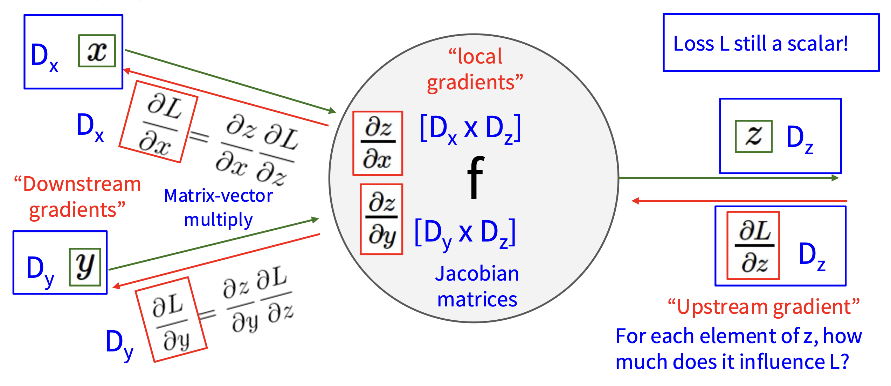
</div>

注意到：

- 损失函数仍然是标量，因此上游梯度属于“在向量上对标量微分”的情况
- 而局部梯度则是雅可比矩阵
- 所以下游梯度的计算是矩阵-向量乘法

变量相对于损失函数的梯度具有与原变量相同的维度。

???+ example "例子"

    <div style="text-align: center">
        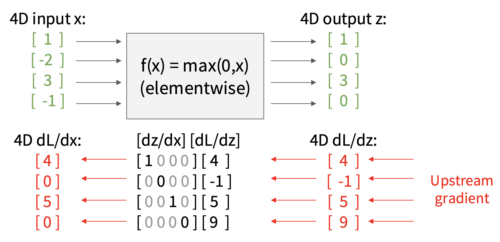
    </div>

    注意到雅可比矩阵是一个稀疏矩阵——不在对角线上的元素永远是0，因此不要像上面那样使用雅可比矩阵的显示形式，而是采用下面这种隐式乘法：

    <div style="text-align: center">
        
    </div>


### Backprop with Matrices

矩阵（或张量(tensor)）上的反向传播计算则更为复杂：

<div style="text-align: center">
    
</div>

???+ example "例子"

    <div style="text-align: center">
        
    </div>

    ???+ question "思考"

        === "问题1"

            === "题目"

                $\bm{y}$ 的哪些部分受 $\bm{x}$ 的某个元素的影响？

            === "解答"

                $\bm{x}_{n, d}$ 会影响一整行 $\bm{y}_n$，即
                $$
                \frac{\partial L}{\partial x_{n,d}}=\sum_m\frac{\partial L}{\partial y_{n,m}}\frac{\partial y_{n,m}}{\partial x_{n,d}}
                $$

        === "问题2"

            === "题目"

                $\bm{x}_{n, d}$ 是如何影响 $\bm{y}_{n, m}$ 的？

            === "解答"

                $w_{d, m}$。前一问的公式可扩展为：
                $$
                \frac{\partial L}{\partial x_{n,d}}=\sum_{m}\frac{\partial L}{\partial y_{n,m}}\frac{\partial y_{n,m}}{\partial x_{n,d}}=\sum_{m}\frac{\partial L}{\partial y_{n,m}}w_{d,m}
                $$


        思考部分的公式可简写为：$\dfrac{\partial L}{\partial x}=\left(\dfrac{\partial L}{\partial y}\right)w^T$。同样地，$\begin{aligned}\frac{\partial L}{\partial w}=x^{T}\left(\frac{\partial L}{\partial y}\right)\end{aligned}$。这些公式相对比较容易记忆——它们是让形状匹配的唯一方法。


### Another View

下面从另一个视角来看反向传播这件事：

<div style="text-align: center">
    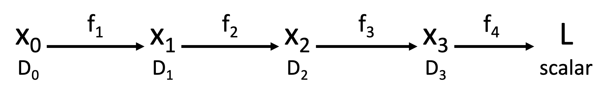
</div>

根据链式法则可得：$\frac{\partial L}{\partial x_0}=\left(\frac{\partial x_1}{\partial x_0}\right)\left(\frac{\partial x_2}{\partial x_1}\right)\left(\frac{\partial x_3}{\partial x_2}\right)\left(\frac{\partial L}{\partial x_3}\right)$

- 根据矩阵乘法的**结合律**(associativity)，我们可以以任意顺序计算乘积
- **反向模式自动微分**(reverse-mode automatic differentiation)：所以从右向左计算上面的式子可以避免矩阵-矩阵乘法，只需计算矩阵-向量乘法即可，从而减小计算量

如果要想求标量输入相对于向量输出的梯度，则需要做**前向模式自动微分**(forward-mode automatic differentiation)。

<div style="text-align: center">
    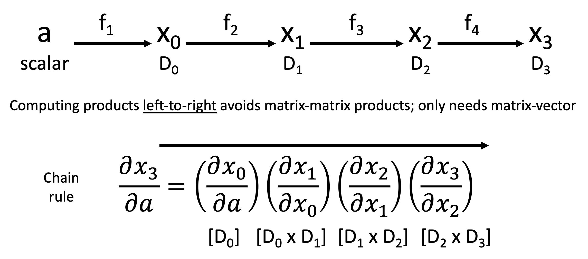
</div>

??? info "注"

    - Pytorch 中有更好的实现（链接：<https://pytorch.org/tutorials/intermediate/forward_ad_usage.html>）
    - 你也可以通过使用 2 次反向模式 AD 的调用来实现前向模式 AD（虽然低效但优雅）

高阶导数的情况更为复杂：

<div style="text-align: center">
    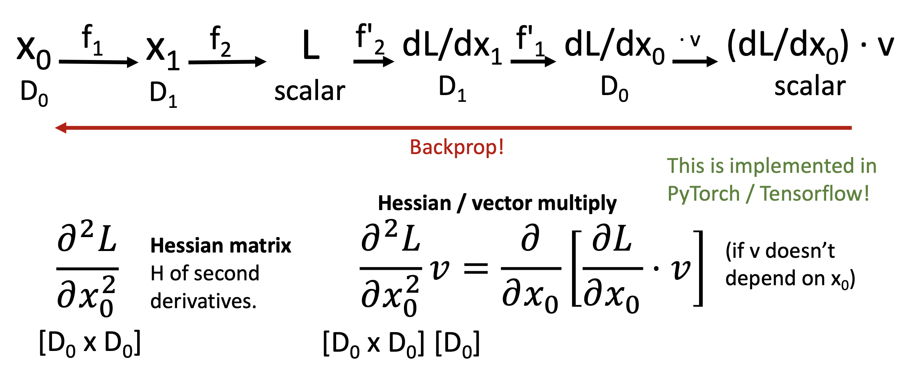
</div>

<div style="text-align: center">
    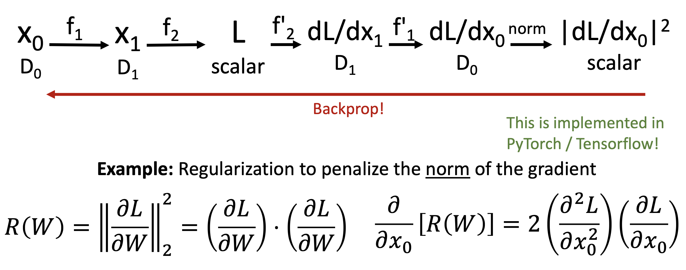
</div>

