# Image Classification with CNNs

前面讲的（全连接）神经网络有一个问题：由于图像需要被展平为一维向量后再被处理，所以图像原本的空间结构就会被破坏掉；这就成了神经网络永远学不到的东西。所以本讲我们介绍一种专门用于图像和视觉任务的神经网络——**卷积神经网络**(convolutional neural network, **ConvNet** / **CNN**)。

如下图所示，整个网络分成了两部分：

<div style="text-align: center">
    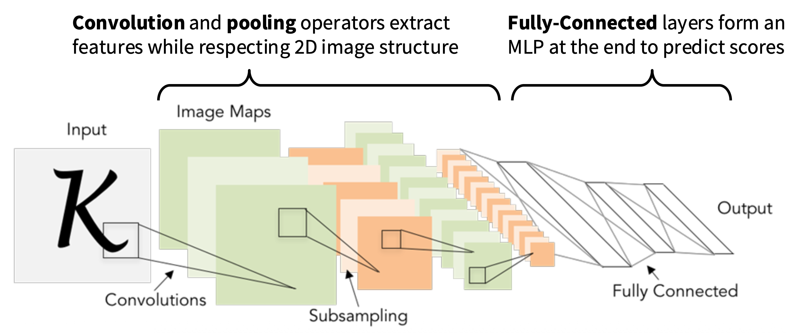
</div>

- **卷积**(convolution)和**池化**(pooling)算子提取有关 2D 图像结构的特征
- **全连接**层在末端构成了多层感知机（MLP）以预测分数
- 通过反向传播 + 梯度下降法可以实现端到端的训练

???+ note "另一种理解卷积的思路"

    卷积 = 局部连接性 + 权重共享

    - 局部连接性：仅关注图像的局部特征(local pattern)
    
        <div style="text-align: center">
            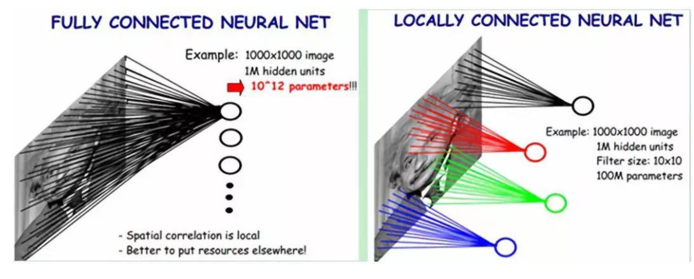
        </div>
    
    - 权重共享
        - 能够减少参数量

            <div style="text-align: center">
                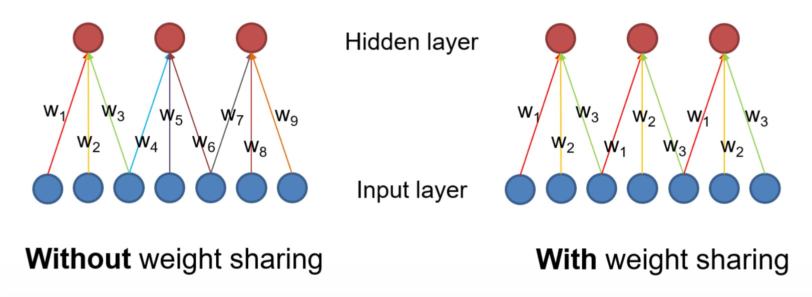
            </div>

            - 全局连接：7
            - 局部连接：9
            - 采用权重共享的局部连接：3

        - 为何是有效假设？

            <div style="text-align: center">
                
            </div>

            - 权重表示物体应该看起来是什么样子
            - 而不应该改变物体在图像中的位置（**移位不变性**(shift invariance property)）


??? info "一些关于 ConvNet 的历史"

    - 杨立昆等人于 1998 年将基于梯度的学习（即上面那幅图）用于文档识别任务中
    - 2012 年，ImageNet 挑战赛获胜者 **AlexNet** 用的就是一种深度卷积神经网络

        <div style="text-align: center">
            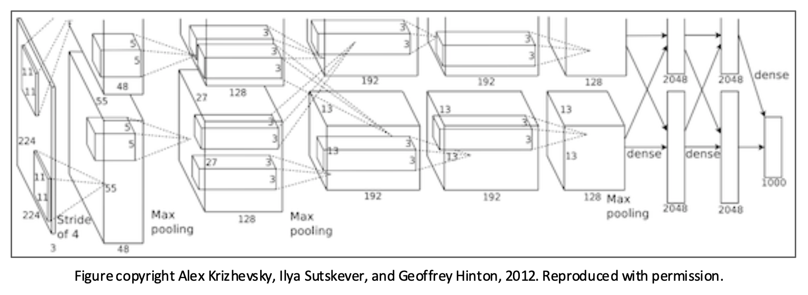
        </div>

    - ~2012-2020，CNN 几乎支配了全部的视觉任务

        === "检测"

            <div style="text-align: center">
                
            </div>

        === "图像捕捉"

            <div style="text-align: center">
                
            </div>

        === "文生图"

            <div style="text-align: center">
                
            </div>

        - CS231n 这门课以前也仅专注于 CNN

            <div style="text-align: center">
                
            </div>

    - 2021-至今：**Transformer** 成为主流

        <div style="text-align: center">
            
        </div>


## Convolution Layers

对于一幅大小为 32x32x3 的图像，全连接层在处理前会将其展平为 3072x1 的向量，然后做矩阵-向量乘法（$Wx$），得到一个激活向量。

- 激活向量的每个元素是 $W$ 中的某行和输入向量的（3072 维的）点积

<div style="text-align: center">
    
</div>

而**卷积**层则会保留图像原本的空间结构，并且用一个深度（通道数）和图像相同的**滤波器**(filter)（或叫做卷积**核**(kernel)）$w$ 对图像做卷积，即滤波器扫过整张图像，计算点积（$w^T x + b$，矩阵点积是逐元素相乘再求和）

<div style="text-align: center">
    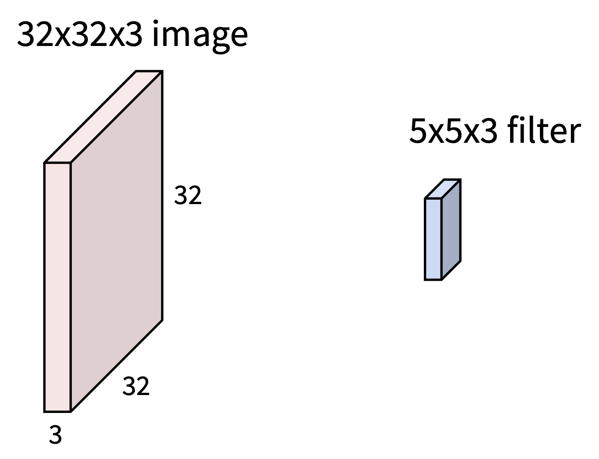
    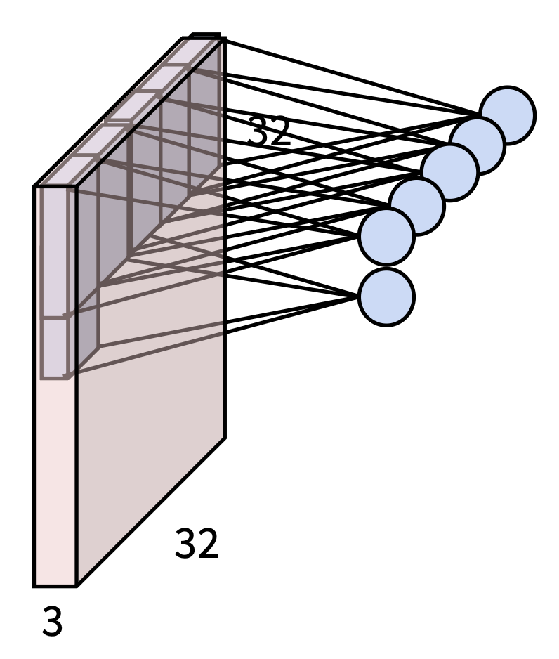
</div>

- 滤波器和图像某小块的点积结果是一个数字
- 当滤波器扫过整张图像后，所有卷积的结果会构成一张**激活图**(activation map)

    <div style="text-align: center">
        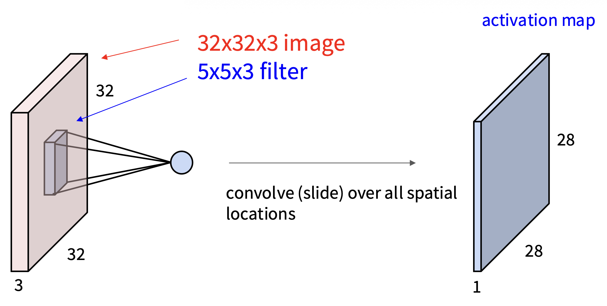
    </div>

- 实际应用中，往往有不止一个的滤波器。这里假设用了 6 个滤波器（并且考虑偏移量（构成了一个向量）），结果如下：

    <div style="text-align: center">
        
    </div>

    可以看到，6 张激活图叠在一起就好像一张大小为 6x28x28 的输出图像

- 推广上述模型：假设有 N 幅大小为 C~in~xHxW 的图像，有 C~out~ 个大小为 C~in~xK~w~xK~h~ 的滤波器和 C~out~ 维的偏移向量，那么对应有 N 个大小为 C~out~xH'xW' 的输出

    <div style="text-align: center">
        
    </div>

类似全连接层，如果仅是简单地将两个卷积层堆叠起来，我们只会得到另一种卷积。解决这个问题的方法依然是使用**激活函数**。

<div style="text-align: center">
    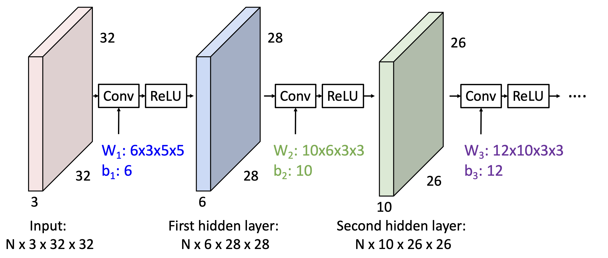
</div>


### What do Conv Filters Learn?

- 对于线性分类器，它能学到每个类别的模板

    <div style="text-align: center">
        
    </div>

- 对于一般的神经网络（多层感知机），它能学到图像的所有模板

    <div style="text-align: center">
        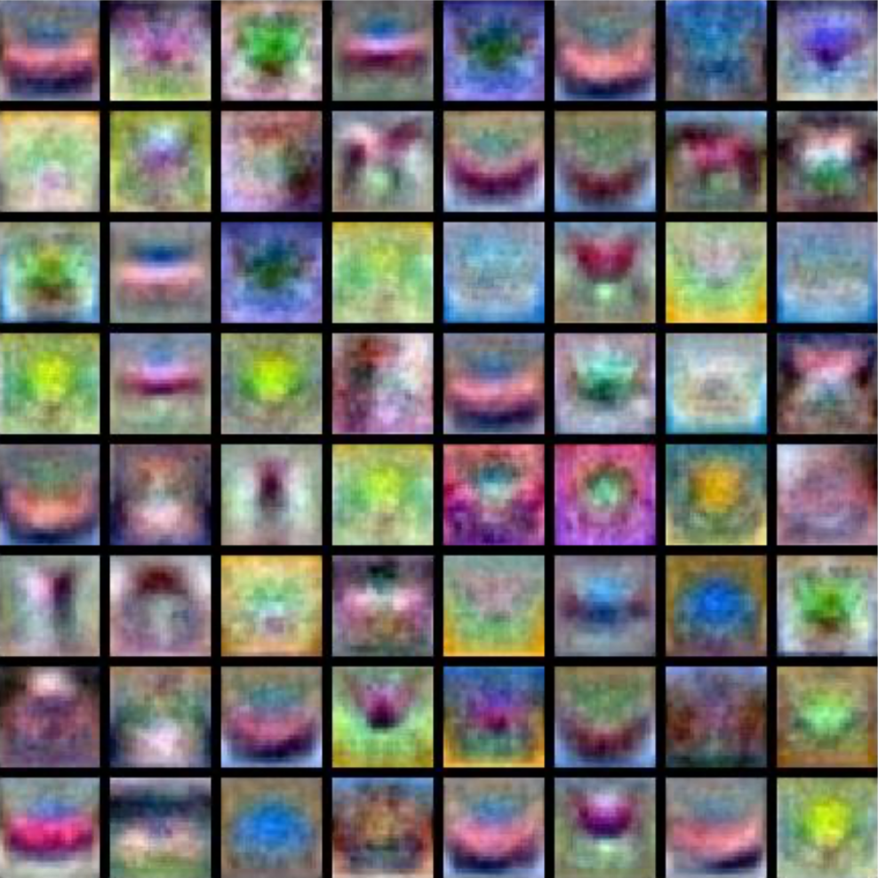
    </div>

- 对于第一层的卷积滤波器，它能学到一些局部的图像模板（通常学到有方向的边缘、对比色等）
    - 下面的例子来自 AlexNet（64 个滤波器，大小为 3x11x11）

    <div style="text-align: center">
        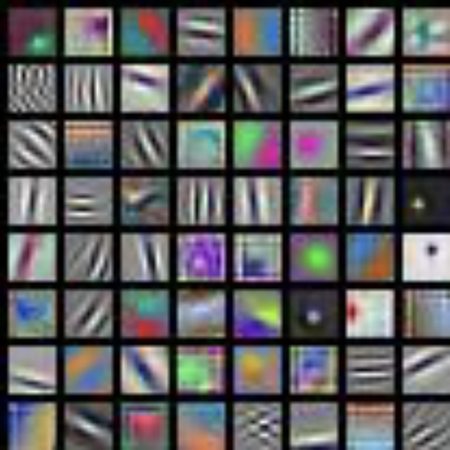
    </div>

- 对于更深的卷积层，我们难以将其学到的东西可视化，但可以肯定的是它们可能学到了更大的图像结构，比如眼睛、字母等
    - 下面的例子来自参与 ImageNet 比赛的某个模型的第 6 个卷积层（可视化来自 [Springenberg et al, ICLR 2015]）

    <div style="text-align: center">
        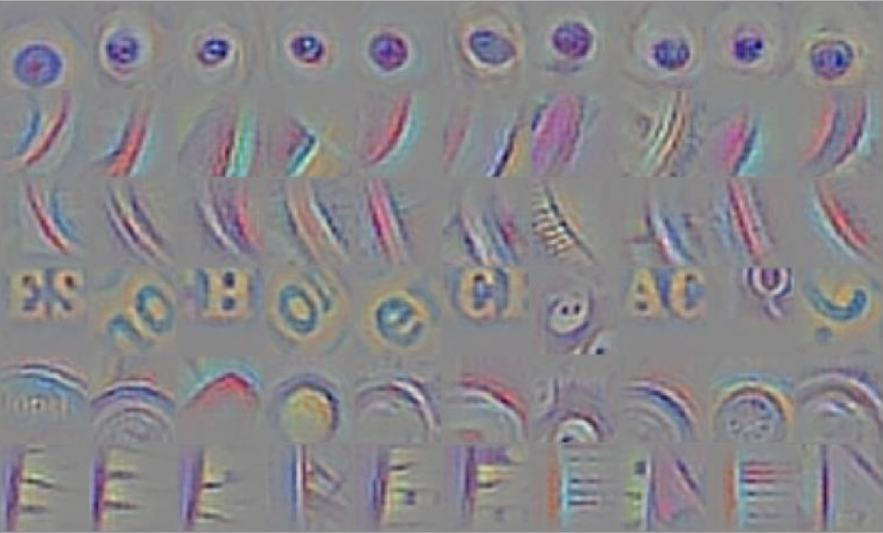
    </div>


### Spatial Dimension

为便于解说和理解，下面从一维角度来看滤波器在图像上的操作：

<div style="text-align: center">
    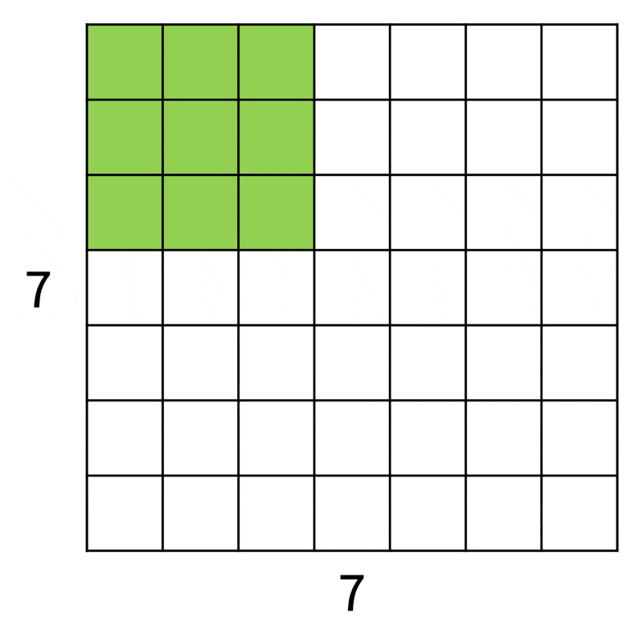
</div>

如上图所示，输入图像大小为 7x7，而滤波器大小为 3x3，因此输出大小为 5x5。

更一般地（仅考虑某一边的大小），

- 输入：W
- 滤波器：K
- 输出：W - K + 1

不难发现这样一个问题：每经过一次卷积层，（特征）图就会缩小，这显然是不合理的。解决方案是在卷积前为输入图像周围**填充**一些数字(padding)。

<div style="text-align: center">
    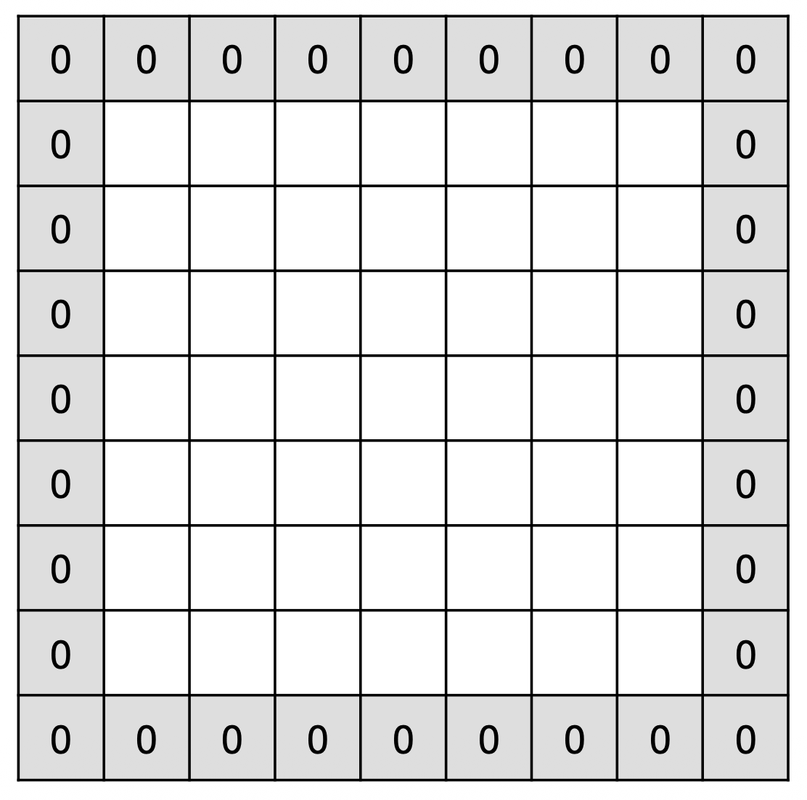
</div>

假设填充宽度为 P，那么输出宽度就变成 W - K + 1 + 2P，所以我们通常设置 P = (K - 1) / 2，从而保证输出大小 = 输入大小。


### Receptive Field

假如卷积核大小为 K，那么输出中的每个元素对应输入中 KxK 大小的**感受野**(receptive field)。

<div style="text-align: center">
    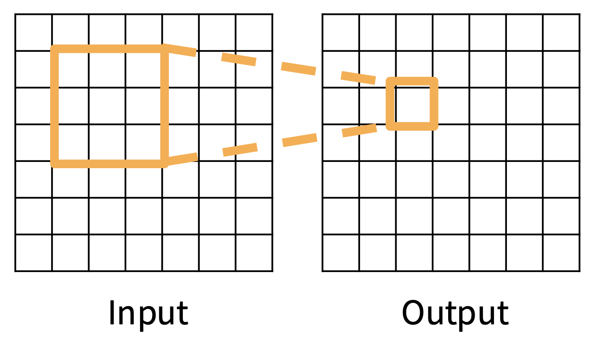
</div>

每次连续的卷积都会使感受野宽度增加 K – 1，因此连续使用 L 层卷积时，感受野宽度变为 1 + L * (K – 1)。

<div style="text-align: center">
    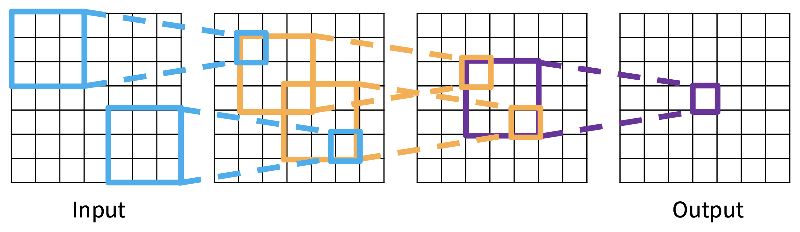
</div>

注意区分“输入中的感受野”和“前一层中的感受野”的概念！

这里存在的一个问题是：对于很大的图像，可能需要很多层才能让每个输出“看见”整张图像。解决方案是在网络内做**降采样**(downsampling)。


### Stride Convolution

一种降采样方式是增大滤波器的移动**步幅**(stride)。还是对于 7x7 大小的输入和 3x3 大小的滤波器，假如步幅调整至 2 个单位（原来为 1），那么输出大小就降至 3x3 了。

<div style="text-align: center">
    
</div>

推广至一般情况：

- 输入：W
- 滤波器：K
- 填充：P
- 步幅：S

-> 输出：(W - K + 2P) / S + 1

??? question "问题"

    === "题目"

        - 输入图像大小：3x32x32
        - 10 个 5x5 的滤波器，步幅为 1，填充宽度为 2

        请问：

        - 输出大小？
        - 可学习的参数数量？
        - 乘法-加法运算次数？

    === "解答"

        - 输出大小：10x32x32
        - 可学习的参数数量：10 \* (3 \* 5 \* 5 + 1 (for bias))
        - 乘法-加法运算次数：(3 \* 5 \* 5) \* (10 \* 32 \* 32) = 768K

???+ abstract "总结"

    <div style="text-align: center">
        
    </div>

???+ info "PyTorch 中的卷积层"

    <div style="text-align: center">
        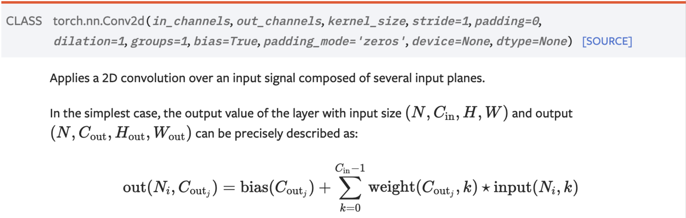
    </div>

    <div style="text-align: center">
        
    </div>

???+ note "其他类型的卷积"

    <div style="text-align: center">
        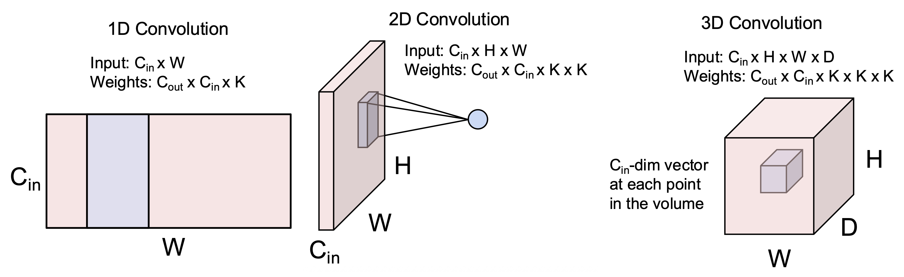
    </div>


## Pooling Layers

**池化层**(pooling layer)是另一种降采样的方法：对于大小为 CxHxW 的输入，为每个 1xHxW 的平面进行降采样。

<div style="text-align: center">
    
</div>

超参数：

- 核大小
- 步幅
- 池化函数

常用的池化函数：

- **最大池化**(max pooling)：选取核内最大值作为输出结果
    - 该函数对小的空间位移具有**不变性**(invariance)，并且没有可学习的参数

    <div style="text-align: center">
        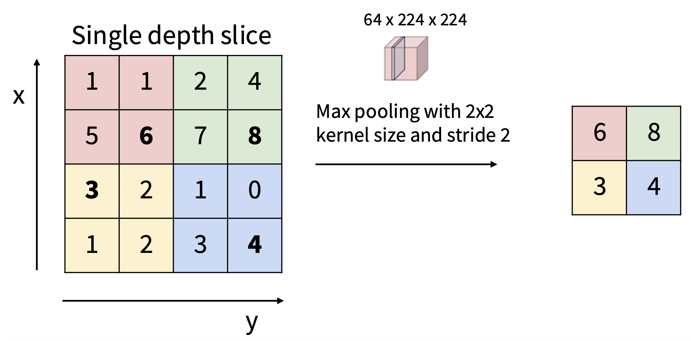
    </div>

- **平均池化**(average pooling)

池化的意义：

- 聚合空间信息
- 让特征图更小，更易于管理

???+ abstract "总结"

    <div style="text-align: center">
        
    </div>


### Translation Equivariance

卷积和池化之间具有**转换等变性**(translation equivariance)，即：

<div style="text-align: center">
    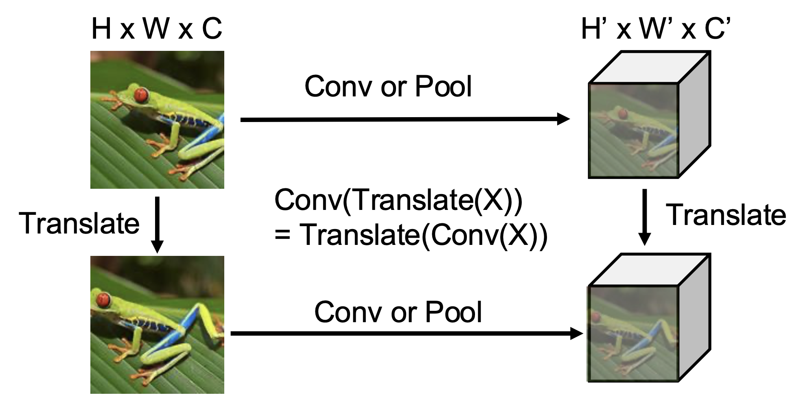
</div>

这一性质对应到我们的直觉上就是：图像的特征不依赖于它们在图像上的位置。

!!! note "注"

    经典的 CNN 架构：
    
    <div align=center>
    [Conv, ReLU, Pool] x N, flatten, [FC, ReLU] x N, FC
    </div>

???+ example "LeNet-5"

    <div style="text-align: center">
        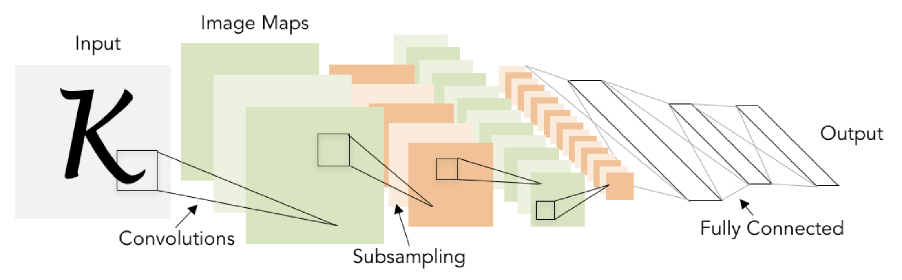
    </div>

    | Layer | Output Size | Weight Size |
    | :--- | :--- | :--- |
    | Input | 1 x 28 x 28 | |
    | Conv (C_out=20, K=5, P=2, S=1) | 20 x 28 x 28 | 20 x 1 x 5 x 5 |
    | ReLU | 20 x 28 x 28 | |
    | MaxPool(K=2, S=2) | 20 x 14 x 14 | |
    | Conv (C_out=50, K=5, P=2, S=1) | 50 x 14 x 14 | 50 x 20 x 5 x 5 |
    | ReLU | 50 x 14 x 14 | |
    | MaxPool(K=2, S=2) | 50 x 7 x 7 | |
    | Flatten | 2450 | |
    | Linear (2450 -> 500) | 500 | 2450 x 500 |
    | ReLU | 500 | |
    | Linear (500 -> 10) | 10 | 500 x 10 |

    当我们走进这个网络，可以发现：

    - 空间大小在减小
    - 但是通道数在增加
    - 不过一些现代架构打破了这一趋势（之后会介绍）


## Normalization

### Batch Normalization

???+ info "引入"

    考虑单个网络层 $y = Wx$，以下条件会为优化带来困难：

    - 输入 $x$ 不以 0 附近为中心（因而需要较大的偏移量）
    - 输入 $x$ 的每个元素有不同的缩放比例（因而 $W$ 中的项需要变化很大）

    解决思路是迫使输入在每个层上有着很好的缩放比例！

思路：将每一层的输出归一化，使其均值为 0，方差为 1 个单位。这样做是为了减少内部协变量偏移(internal covariate shift)并提升优化空间。

可以像这样对一批激活值进行归一化：
$$
\hat{x} = \dfrac{x - E[x]}{\sqrt{Var[x]}}
$$

由于这是一个**可微**(differentiable)函数，因此我们可以将其用作网络中的算子，并通过它进行**反向传播**。

假如输入为 $X \in \mathbb{R}^{N \times D}$，那么：

- （每通道的）均值 $\mu_j=\dfrac{1}{N}\sum_{i=1}^Nx_{i,j}$，形状为 $D$
- （每通道的）方差 $\sigma_j^2=\dfrac{1}{N}\sum_{i=1}^N(x_{i,j}-\mu_j)^2$，形状为 $D$
- 归一化后的元素 $\widehat{x}_{i,j}=\dfrac{x_{i,j}-\mu_j}{\sqrt{\sigma_j^2+\varepsilon}}$，形状为 $N \times D$

如果零均值、单位方差的约束过于严格该怎么办呢？于是我们引入了可学习的缩放(scale)和偏移(shift)参数 $\gamma, \beta \in \mathbb{R}^D$。学习 $\gamma = \mu, \beta = \sigma$ 将恢复恒等函数（在期望上）。此时输出为（形状：$N \times D$）：
$$
y_{i, j} = \gamma_j \hat{x}_{i, j} + \beta_j
$$

即便如此，上述方法仍然存在一个问题：上述估计依赖于选定的小批量，而在测试时不能这么做。所以 $\mu_j, \sigma_j^2$ 的值需要通过在训练过程中获取平均值得到。以均值为例：

```py
mu_test[j] = 0
for each training iteration:
    mu[j] = 1 / N * sum(i=1, N, x[i][j])
    mu_test[j] = 0.99 * mu_test[j] + 0.01 * mu[j]
```

方差的计算同理。

由于在测试过程中，批归一化操作成为一个线性算子，因此可以和先前的全连接层或卷积层融合起来。

- FC：

    $$
    \begin{align*}
    x &: N \times D \\
    \text{Normalize} &\downarrow \\
    \mu, \sigma &: 1 \times D \\
    \gamma, \beta &: 1 \times D \\
    y &= \frac{(x - \mu)}{\sigma}\gamma + \beta
    \end{align*}
    $$

- CNN（空间批归一化，BatchNorm2D）：

    $$
    \begin{align*}
    x &: N \times C \times H \times W \\
    \text{Normalize} &\downarrow \quad \quad \quad \quad\ \downarrow \quad \ \ \ \downarrow\\
    \mu, \sigma &: 1 \times C \times 1 \times 1 \\
    \gamma, \beta &: 1 \times C \times 1 \times 1 \\
    y &= \frac{(x - \mu)}{\sigma}\gamma + \beta
    \end{align*}
    $$

批归一化通常位于 FC 或 CNN 之后，并在非线性(nonlinearity)操作前：

<div style="text-align: center">
    
</div>

优点：

- 使深度网络训练变得容易得多
- 允许更高的学习率，实现更快收敛
- 网络对初始化的鲁棒性增强
- 在训练过程中起到正则化作用
- 测试时零额外开销：可与卷积层融合

<div style="text-align: center">
    
</div>

缺点：

- （目前）理论上尚未充分理解
- 在训练和测试期间表现不同，这是非常常见的错误来源


### Layer Normalization

- FC 上的批归一化：

    $$
    \begin{align*}
    x &: N \times D \\
    \text{Normalize} &\downarrow \\
    \mu, \sigma &: 1 \times D \\
    \gamma, \beta &: 1 \times D \\
    y &= \frac{(x - \mu)}{\sigma}\gamma + \beta
    \end{align*}
    $$

- FC 上的**层归一化**(layer normalization)，在训练和测试上有相同行为，为 RNN 和 Transformer 所用：

    $$
    \begin{align*}
    x &: N \times D \\
    \text{Normalize} &\downarrow \\
    \mu, \sigma &: N \times 1 \\
    \gamma, \beta &: 1 \times D \\
    y &= \frac{(x - \mu)}{\sigma}\gamma + \beta
    \end{align*}
    $$


### Instance Normalization

- CNN 上的批归一化：

    $$
    \begin{align*}
    x &: N \times C \times H \times W \\
    \text{Normalize} &\downarrow \quad \quad \quad \quad\ \downarrow \quad \ \ \ \downarrow\\
    \mu, \sigma &: 1 \times C \times 1 \times 1 \\
    \gamma, \beta &: 1 \times C \times 1 \times 1 \\
    y &= \frac{(x - \mu)}{\sigma}\gamma + \beta
    \end{align*}
    $$

- CNN 上的**实例归一化**(instance normalization)：

    $$
    \begin{align*}
    x &: N \times C \times H \times W \\
    \text{Normalize} &\downarrow \quad \quad \quad \quad\ \downarrow \quad \ \ \ \downarrow\\
    \mu, \sigma &: 1 \times C \times 1 \times 1 \\
    \gamma, \beta &: 1 \times C \times 1 \times 1 \\
    y &= \frac{(x - \mu)}{\sigma}\gamma + \beta
    \end{align*}
    $$

???+ abstract "各种归一化技术"

    <div style="text-align: center">
        
    </div>