# CNN Architectures

## How to Build CNNs?

### Layers in CNNs

实际上，一个完整的 CNN 包含以下组成部分：

<div style="text-align: center">
    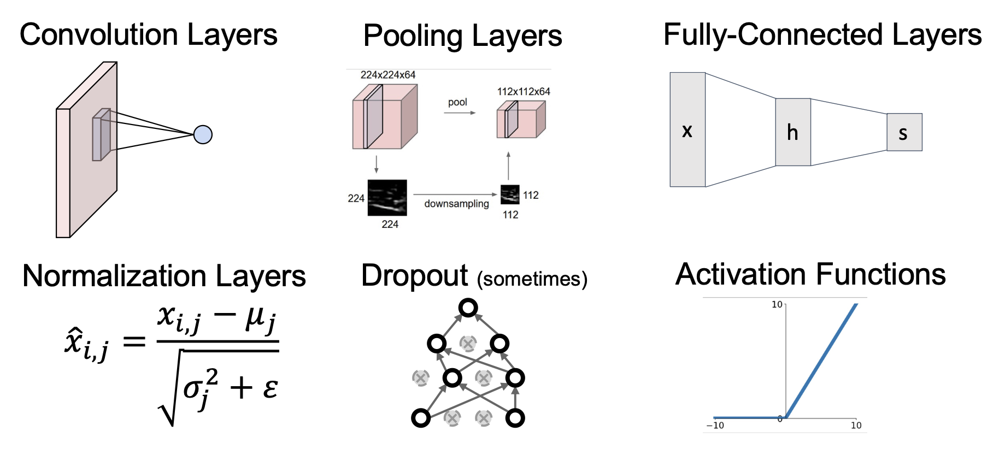
</div>

到正则化之前的部分都已经介绍过了，下面就从 Dropout 开始介绍了。


#### Regularization: Dropout

**Dropout** 的思路是：每一次向前传递时，随机将某些神经元置零（即去除某些神经元）。去除的概率是一个超参数，通常设置为 0.5。

<div style="text-align: center">
    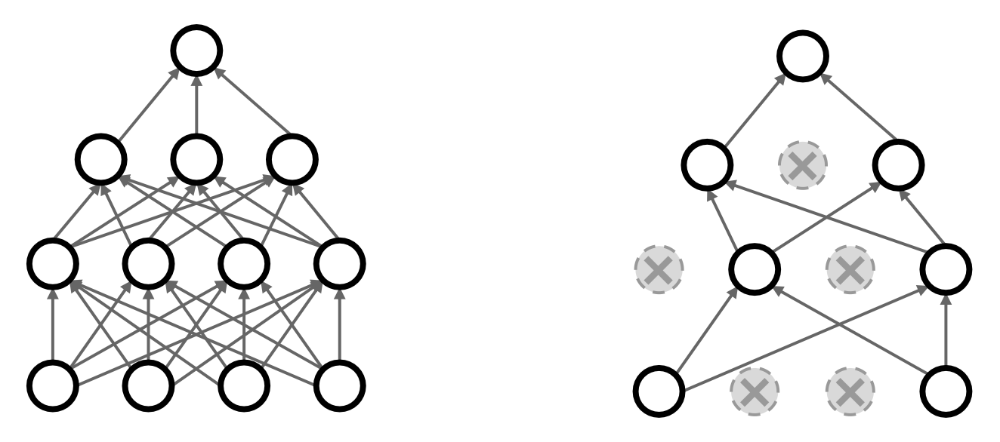
</div>

为什么这样是可行的？

- 这迫使网络存在一种冗余的表示，以阻止特征的**共适应**(co-adaptation)（即神经元之间过度依赖）

    <div style="text-align: center">
        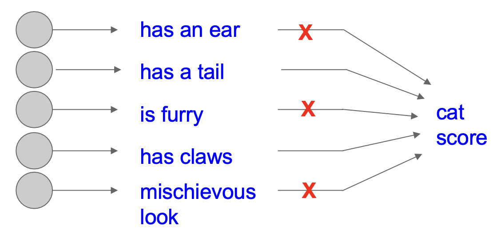
    </div>

- 另一种解释：Dropout 是在训练一个很大的（共享参数的）模型**集**(ensemble)，每一个二元任务对应一个模型
    - 所以一个有 4096 个神经元的 FC 层就有 2^4096^ ~ 10^1023^ 个可能的任务（而宇宙中的原子也就 ~10^82^ 的量级啊）

不过在**测试**时，所有的神经元都要求被激活，因为我们必须缩放激活值，使得对于每个神经元，测试时的输出 = 训练时的期望输出。

下面是加入 Dropout 技术后，训练和预测模型的代码：

```py
""" Vanilla Dropout: Not recommended implementation (see notes below) """

p = 0.5 # probability of keeping a unit active. higher = less dropout

def train_step(X):
    """ X contains the data """
    """ drop in train time """

    # forward pass for example 3-layer neural network
    H1 = np.maximum(0, np.dot(W1, X) + b1)

    # first dropout mask
    U1 = np.random.rand(*H1.shape) < p
    H1 *= U1 # drop!

    H2 = np.maximum(0, np.dot(W2, H1) + b2)

    # second dropout mask
    U2 = np.random.rand(*H2.shape) < p
    H2 *= U2 # drop!

    out = np.dot(W3, H2) + b3

    # backward pass: compute gradients... (not shown)
    # perform parameter update... (not shown)


def predict(X):
    """ scale at test time """
    # ensembled forward pass
    H1 = np.maximum(0, np.dot(W1, X) + b1) * p # NOTE: scale the activations
    H2 = np.maximum(0, np.dot(W2, H1) + b2) * p # NOTE: scale the activations
    out = np.dot(W3, H2) + b3
```

更常用的方法是“**反向(inverse) Dropout**”，即把缩放步骤也放在训练环节，测试时不用做任何改变。

```py
p = 0.5 # probability of keeping a unit active. higher = less dropout

def train_step(X):
    # forward pass for example 3-layer neural network
    """ drop and scale during training """

    H1 = np.maximum(0, np.dot(W1, X) + b1)

    # first dropout mask. Notice /p!
    U1 = (np.random.rand(*H1.shape) < p) / p
    H1 *= U1 # drop!

    H2 = np.maximum(0, np.dot(W2, H1) + b2)

    # second dropout mask. Notice /p!
    U2 = (np.random.rand(*H2.shape) < p) / p
    H2 *= U2 # drop!

    out = np.dot(W3, H2) + b3

    # backward pass: compute gradients... (not shown)
    # perform parameter update... (not shown)


def predict(X):
    """ test time is unchanged! """
    # ensembled forward pass
    H1 = np.maximum(0, np.dot(W1, X) + b1) # no scaling necessary
    H2 = np.maximum(0, np.dot(W2, H1) + b2) # no scaling necessary
    out = np.dot(W3, H2) + b3
```


### Activation Functions

激活函数的目标是向模型引入**非线性**(non-linearity)。


#### Sigmoid

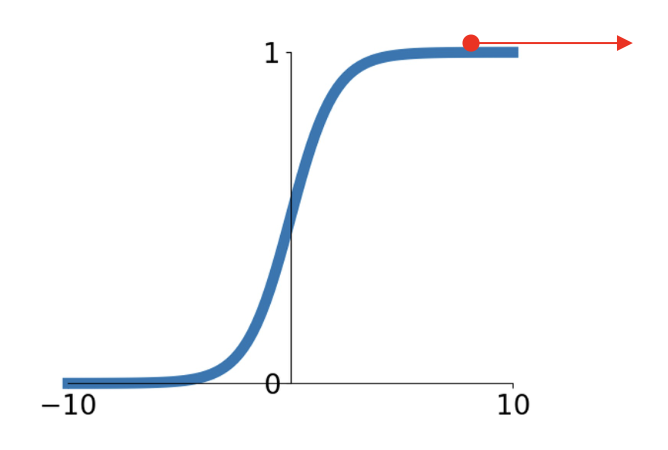{ align=right width=30% }

在早期，常用的激活函数是 **Sigmoid**：$\sigma(x) = \dfrac{1}{1 + e^{-x}}$。

- 将数字压缩在 [0, 1] 的范围内
- 这个激活函数在过去很流行，因为它对神经元饱和的“发射速率”(saturating "firing rate")有一个不错的解释
- 关键问题：
    - 绝对值大的正数或负数值会“杀死”梯度 + 多层级的 Sigmoid -> 梯度会变得越来越小（**最严重**的问题）
    - Sigmoid 的输出并不是以 0 为中心的（输出都是正数）

        <div style="text-align: center">
            
        </div>

        - 可以看到，所有 $w^{(l)}_{i, j}$ 的符号和上游梯度 $\dfrac{\partial L}{\partial h_i^{(l)}}$，这导致 $w$ 的行上的梯度只能指向某些方向；需要锯齿形(zigzag)的移动才能朝其他方向前进

            <div style="text-align: center">
                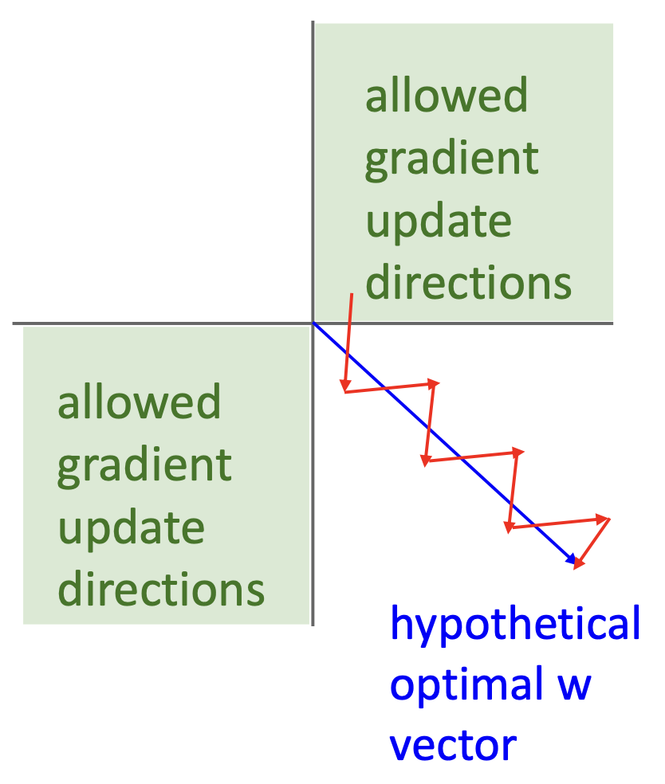
            </div>

        - 实践上这个问题并不是特别糟糕
            - 仅对单个样例有影响，可采取小批量(minibatch)解决
            - 也可用 [BatchNorm](12.md#batch-normalization) 来避免这一问题

    - 指数计算开销有些大


#### Tanh

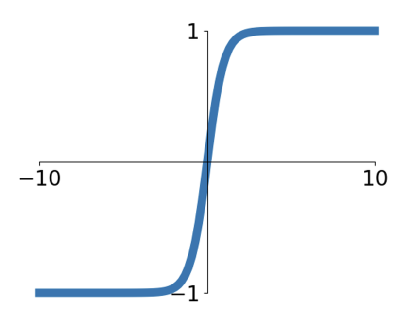{ align=right width=30% }

一种改进措施是采用 Tanh 函数：

- 将范围压至 [-1, 1]
- 优点：以 0 为中心
- 缺点：仍然没能解决梯度在两端被“杀死”的问题


#### ReLU

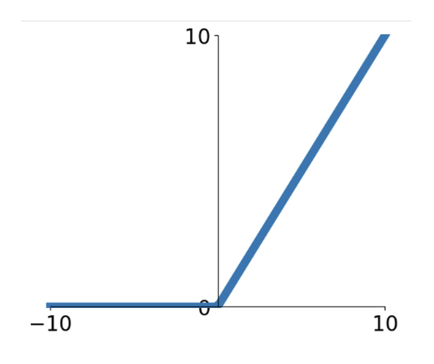{ align=right width=30% }

大概从 AlexNet 出世后，最流行的激活函数莫过于 **ReLU**（校正线性单元(rectified linear unit)）$f(x) = \max(0, x)$。

- 优点：
    - 不会在正数区域饱和
    - 计算非常高效
    - 实践上比 Sigmoid 收敛更快
- 缺点
    - 输出不以 0 为中心
    - 令人不爽的是，ReLU 在 < 0 的时候就寄了

        <div style="text-align: center">
            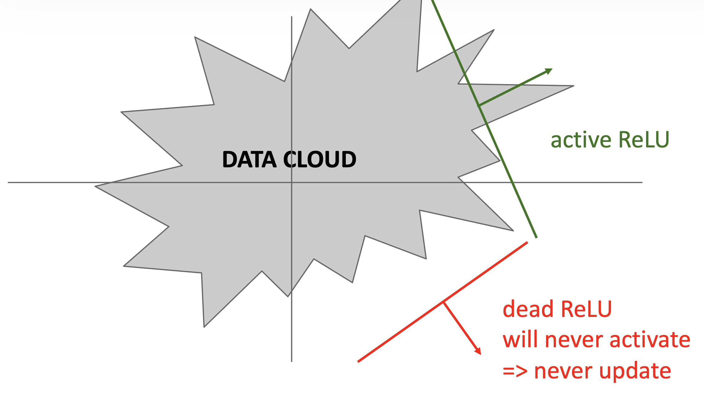
        </div>

        - 有时可用较小的正偏移量（比如 0.01）来初始化 ReLU 神经元


#### Leaky ReLU and PReLU

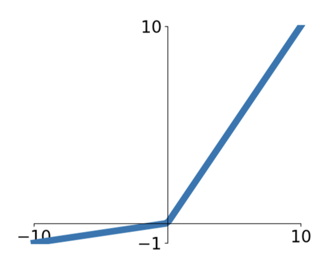{ align=right width=30% }

ReLU 的一种变体是 **Leaky ReLU** $f(x) = \max(\alpha x, x)$，其中 $\alpha$ 是**超参数**，通常设置 $\alpha = 0.1$

- 不会饱和
- 计算高效
- 实际上比 Sigmoid / Tanh 收敛得快的多
- 不会像 ReLU 那样在 < 0 时“寄掉”
 
一种很类似的函数是参数化(parametric) ReLU（**PReLU**），和 Leake ReLU 的唯一不同是 $\alpha$ 是通过**反向传播**学习出来的，而不是超参数。


#### ELU and SELU

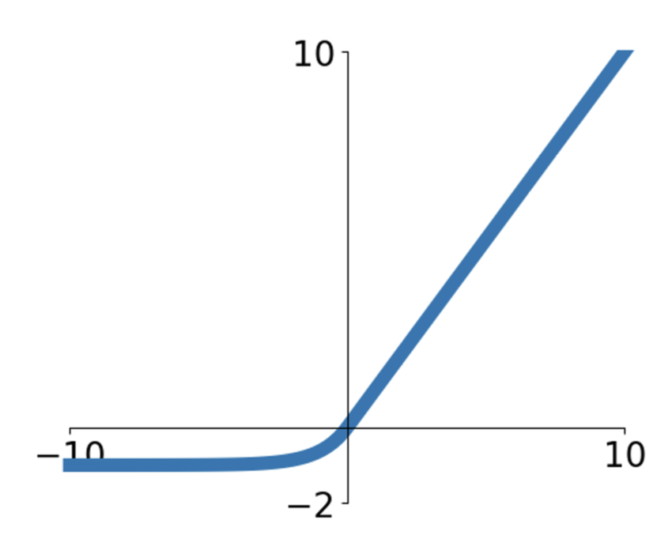{ align=right width=30% }

另一种和 ReLU 类似的是 **ELU**（指数线性单元(exponential linear unit)）$f(x) = \begin{cases}x & \text{if } x > 0 \\ \alpha(e^x - 1) & \text{if } x \le 0\end{cases}$（默认情况下 $\alpha = 1$）

- 优点：
    - 所有 ReLU 的优点
    - 更接近 0 均值输出
    - 与 Leaky ReLU 相比，增加了负饱和状态下对噪声的鲁棒性
- 缺点：涉及到指数计算

{ align=right width=30% }

基于 ELU 的一个变体是 **SELU**（缩放指数线性单元(scaled exponential linear unit)）

$$
f(x) = \begin{cases}\lambda x & \text{if } x > 0 \\ \lambda \alpha(e^x - 1) & \text{if } x \le 0\end{cases}
$$

其中 $\alpha = 1.6732632423543772848170429916717, \lambda = 1.0507009873554804934193349852946$

- 优点：
    - 缩放版本的 ELU，在更深的网络上表现更好
    - “**自归一化**(self-normalizing)”的性质，能够在没有 BatchNorm 的情况下训练深层的 SELU 网络

- 缺点：这玩意儿的推导在论文附录占据了 91 页！


#### GELU

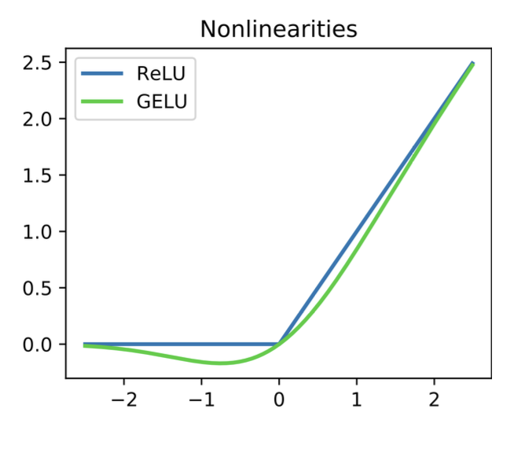{ align=right width=30% }

最近几年比较流行的一种激活函数是 **GELU**（高斯误差线性单元(Gaussian error linear unit)）：

$$
\begin{align*}
X &\sim \mathcal{N}(0, 1) \\
\mathrm{gelu}(x) &= x P(X \le x) = \frac{x}{2}\left(1 + \mathrm{erf}(x/\sqrt{2})\right) \\
&\approx x\sigma(1.702x)
\end{align*}
$$

思路：

- 随机乘以 0 或 1；大值更可能乘以 1，小值更可能乘以 0（数据依赖的 Dropout）
- 取随机结果的期望

- 优点：
    - 在 0 附近有非常好的行为
    - 其平滑性有利于训练
    - 因此在基于 Transformer 的模型中十分常见（BERT、GPT、ViT）
- 缺点：
    - 计算开销相比 ReLU 更高
    - 绝对值很大的负数仍然存在梯度趋近于 0 的情况


#### Summary

激活函数可不止这几种——下面列举了更多的激活函数：

<div style="text-align: center">
    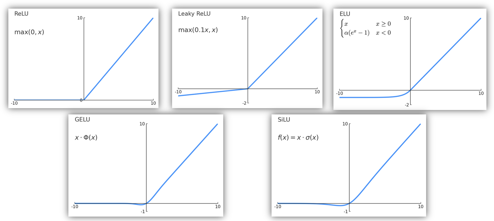
</div>

在 CNNs 中，激活函数通常放置在线性算子（比如前馈/线性层，卷积层等）之后。

各种激活函数在 CIFAR10 上的准确率

<div style="text-align: center">
    
</div>

???+ abstract "总结"

    - 不要想太多，就用 ReLU 好了
    - 如果需要压榨那最后的 0.1% 的精度，再尝试用 Leaky ReLU / ELU / SELU / GELU
    - 不要使用 Sigmoid 或 Tanh
    - 一些（非常）最近的结构使用 GeLU 代替 ReLU，但收益微乎其微


### CNN Architecture

下图展示了各年 ImageNet 大规模视觉识别挑战赛（ILSVRC）获胜模型的层数（折线图）和误差率（柱形图）（最后一列是人类的表现）

<div style="text-align: center">
    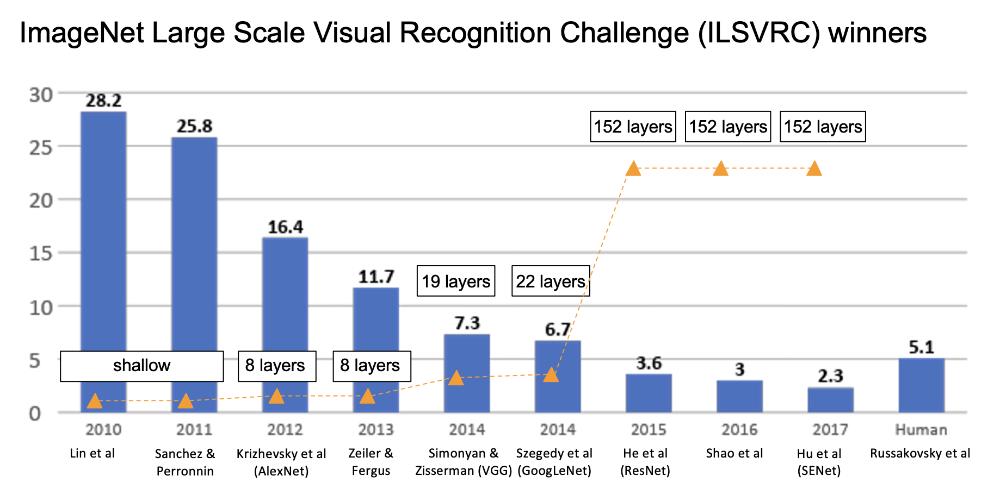
</div>


#### AlexNet

- 输入规模为 227x227
- 5 个卷积层
- 最大池化
- 3 个全连接层
- ReLU 非线性
- 采用**局部响应归一化**(local response normalization)技术（不过现在已经被淘汰了）
- 在 2 张 GTX 580 GPU 上训练；由于每个显卡只有 3 GB 内存，所以模型被划分到 2 个 GPU 上

下面给出 AlexNet 的架构图：

<div style="text-align: center">
    
</div>

AlexNet 的超绝影响力：

<div style="text-align: center">
    
</div>

AlexNet 各层参数列表：

<div style="text-align: center">
    
</div>

- conv1
    - 输出通道数 C' = 滤波器数
    - 输出宽/高 W'(H') = (W - K + 2P) / S + 1 = (227 - 11 + 2 * 2) / 4 + 1 = 56
    - 内存 = 200,704 * 4 / 1024 = 784 B
        - 输出元素数 = C' * W' * H' = 64 * 56 * 56 = 200,704
        - 每个元素 4B（32 位浮点数）

    - 权重数 = 23,296
        - 权重形状 = C~out~ * C~in~ * K * K = 64 * 3 * 11 * 11
        - 偏移形状 = C~out~ = 64

    - 浮点数运算次数(flop)（乘法 + 加法）= 输出元素数 * 每元素的运算 = (C~out~ * H' * W') * (C~in~ * K * K) = 72,855,552

- pool1
    - 输出通道数 = 输入通道数 = 64
    - W' = float((W - K) / S + 1) = 27
    - 内存 = C~out~ * H' * W' * 4 / 1024 = 182.25
        - 输出元素数 = C~out~ * H' * W'
        - 每个元素 4B（32 位浮点数）

    - 池化层没有可学习的参数
    - 浮点数运算次数 = 输出位置数 * 每个输出位置的运算 = (C~out~ * H' * W') * (K * K) = 419,904 = 0.4 MFLOP


- flatten
    - 输出大小 = C~in~ * H * W = 9216

- fc6
    - 参数个数 = C~in~ * C~out~ + C~out~ = 37,725,832
    - 浮点数运算次数 = C~in~ * C~out~ = 37,748,736

表格中蓝色和绿色列通过不断试错得到；而黄色列的参数则有一些有趣的规律：

- 大多数内存用在前面的卷积层上
- 几乎所有的参数都在全连接层上
- 大多数的浮点运算发生在卷积层中

<div style="text-align: center">
    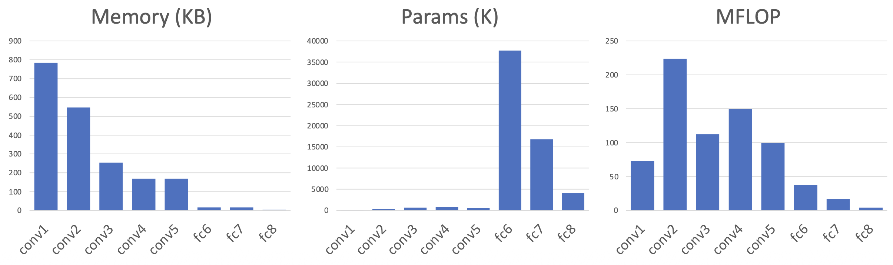
</div>


#### ZFNet

**ZFNet** 是一个更大的 AlexNet，和 AlexNet 的区别在于：

<div style="text-align: center">
    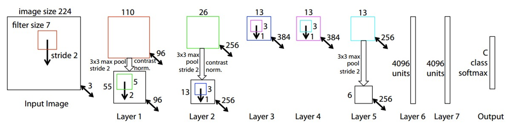
</div>

- CONV1：滤波器大小从（11x11，步幅 4）变为（7x7，步幅 2）
- CONV3, 4, 5：滤波器数从（384，384，256）变到（512，1024，512）

包含更多的试错...

通过以上努力，误差率从 16.4% 降至 11.7%


#### VGGNet

{ align=right width=30% }

相比前两年的 AlexNet，**VGGNet** 的滤波器更小，但是网络更深。

- 8 层（AlexNet）-> 16-19 层（VGGNet）
- 卷积核的大小统一为 3x3，步幅为 1，填充宽为1；最大池化核大小统一为 2x2，步幅为 2
- 误差率从前一年的 11.7% 降至 7.3%
- 网络包含 5 个卷积阶段：
    1. conv-conv-pool
    2. conv-conv-pool
    3. conv-conv-pool
    4. conv-conv-conv-[conv]-pool
    5. conv-conv-conv-[conv]-pool

为何能使用更小的滤波器呢？假如有 3 个 3x3 的滤波器（步幅为 1），那么有效的感受野大小为 7x7，如下所示：

<div style="text-align: center">
    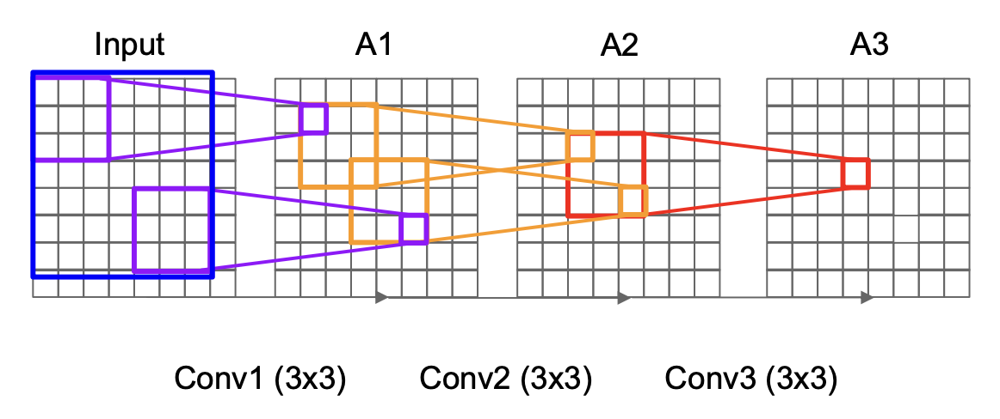
</div>

- 也就是说，只要堆叠 3 个 3x3 的滤波器，就对应一个有相同的有效感受野的 7x7 的滤波器
- 但同时更深，意味着更多的非线性
- 并且用到的参数更少（假设每层通道数为 C）：3 * (3^2^C^2^) v.s. 7^2^C^2^

???+ info "AlexNet v.s. VGG-16"

    <div style="text-align: center">
        
    </div>


#### GoogLeNet

{ align=right width=20% }

**GoogLeNet** 有以下特点：

- 注重效率：减少参数量、内存使用和计算量
- 在开始时，**主干网络**(stem network)会积极地(aggressively)对输入进行降采样（注意到 VGG-16 的大部分计算发生在开始阶段）

    <div style="text-align: center">
        
    </div>

- **起始模块**(inception module)：使用并行分支加载单元
    - 局部结构在网络内重复出现多次
    - 在开销较大的卷积操作之前使用 1x1 “瓶颈(bottleneck)”层来减少通道维度

    <div style="text-align: center">
        
    </div>

- **全局平均池化**(global average pooling)：网络末端没有用到大型的全连接层，而是使用全局平均池化来折叠(collapse)空间维度，并使用一个线性层来生成类别得分（而 VGG-16 的大多数参数集中在全连接层中）

    <div style="text-align: center">
        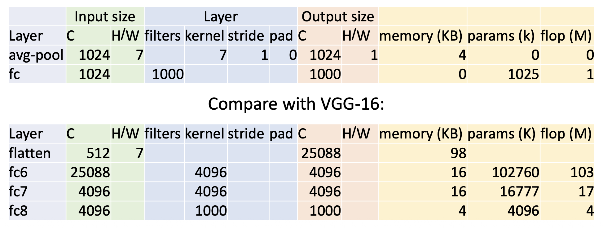
    </div>

- **辅助分类器**(auxiliary classifiers)
    - 使用网络末尾的损失进行训练效果不佳：网络太深，梯度传播不顺畅
    - 一种 hack 手段是：在网络的几个中间点附加一些“辅助分类器”，也尝试对图像进行分类并接收损失
    - GoogLeNet 在批量归一化之前没，所以有了 BatchNorm 的话就不再需要使用这个技巧


#### ResNet

从 **ResNet** 开始，模型从深度上有了革命性的突破——从前一年的 22 层，到 ResNet 的 152 层。

以前，人们通常认为模型越深往往意味着更糟糕的表现。如果只是简单地向 CNN 堆叠更深的层，如下所示，无论是在测试还是在训练时，56 层的网络比 22 层表现更糟；但这也意味着**不是**由过拟合导致的问题（不然的话 56 层的表现在训练时应和 22 层的差不多）。实际上，这是一种**欠拟合**(underfitting)。

<div style="text-align: center">
    
</div>

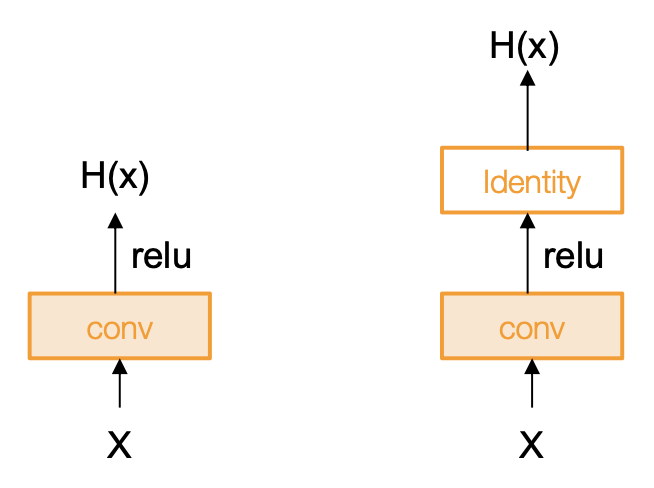{ align=right width=30% }

事实上，对于较深模型，其表示能力比较浅模型强大得多（因为有更多的参数）。

我们提出这样一个假设：此问题是**优化**问题；更深的模型意味着更难优化。那么如何让较深模型表现得至少和较浅模型一样好呢？一种通过构造的解决方法是复制较浅模型中学习到的层，并将额外的层设置为**恒等映射**(identity mapping)。

而 ResNet 给出的方案是：使用网络层来拟合**残差映射**(residual mapping)，而不是直接尝试拟合一个期望的底层映射。

<div style="text-align: center">
    
</div>

- 恒等映射：$H(x) = x \text{ if } F(x) = 0$
- 使用层来拟合**残差** $F(x) = H(x) - x$ 而非直接使用 $H(x)$

完整的 ResNet 架构如下：

<div style="text-align: center">
    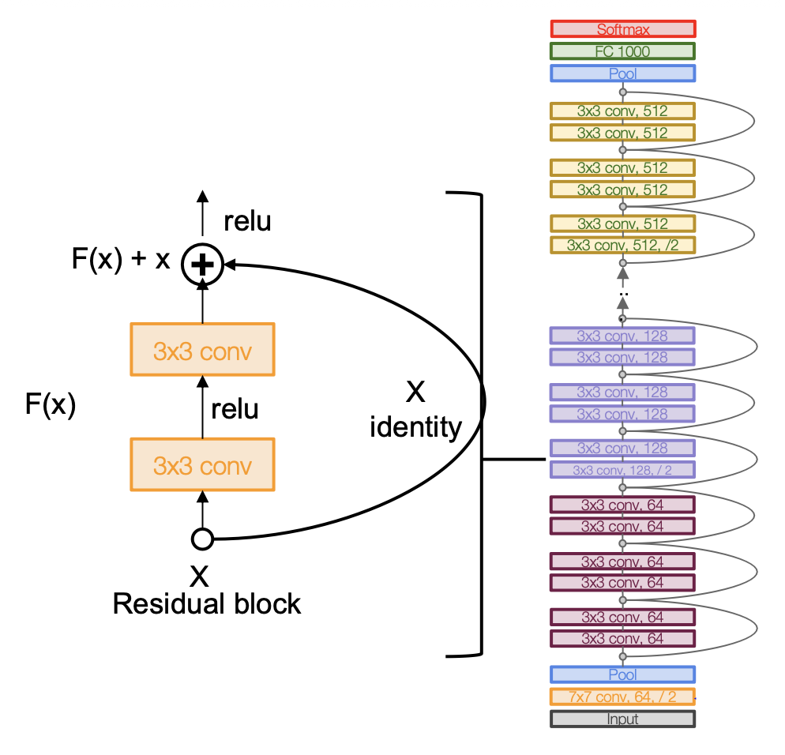
</div>

- 堆叠残差块
- 每个残差块有 2 个 3x3 的卷积核
- 周期性地加倍卷积核的数量，使用值为 2 的步幅进行降采样（每一维 / 2），并将激活值减少一半
- 和 GoogLeNet 一样在网络开头设置额外的卷积层（主干网络），在应用残差块之前把输入降采样至原来的 1/4

    <div style="text-align: center">
        
    </div>

- 还是类似 GoogLeNet，在网络末端不使用很大的全连接层，而采用全局平均池化和单个的线性层

ResNet 被划分为以下阶段：

<div style="text-align: center">
    
</div>

关于残差块：

- 基本块

    <div style="text-align: center">
        
    </div>

- “瓶颈”块（更多层，但更少的计算成本）

    <div style="text-align: center">
        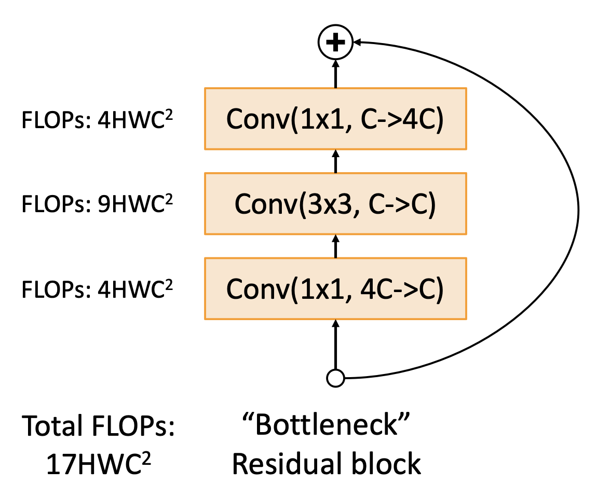
    </div>

更深 ResNet-101 和 ResNet-152 模型确实更准确，但是计算量更大：

<div style="text-align: center">
    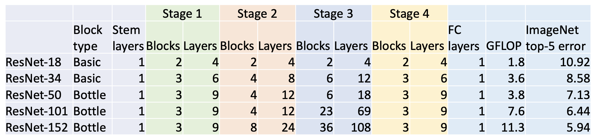
</div>

改善残差块的设计

- 原来的残差块：ReLU 在残差块后，实际上无法学习恒等函数，因为输出是非负的

    <div style="text-align: center">
        
    </div>

- **预激活**(pre-activation)的残差块：**ReLU 在残差块内**，可以通过将卷积权重设置为零来学习真实的恒等函数

    <div style="text-align: center">
        
    </div>

这一调整在准确率上有了微小的进步，但在实践上用的不多。

---
???+ abstract "总结：比较各 CNN 架构的复杂性"

    <div style="text-align: center">
        
    </div>

    - Inception-v4：ResNet + Inception
    - VGG：内存用的最多，计算量最大
    - GoogLeNet：非常高效
    - AlexNet：计算量少，参数量也少
    - ResNet：简单的设计（~~简单在哪~~）、中度效率、较高的准确率


#### Post-ResNet Architectures

鸽掉了hh


### Weight Initialization

为神经网路层初始化权重也是一门学问。

- 如果值设的太小，在小网络上是 OK 的；但是对于更深的网络层，所有的激活值趋近于 0

    ```py hl_lines="6"
    dims = [4096] * 7
    hs = []
    x = np.random.randn(16, dims[0])
    # Forward pass with ReLU activation
    for Din, Dout in zip(dims[:-1], dims[1:]):
        W = 0.01 * np.random.randn(Din, Dout) # Small weight init
        x = np.maximum(0, x.dot(W)) # ReLU activation
        hs.append(x)
    ```

    <div style="text-align: center">
        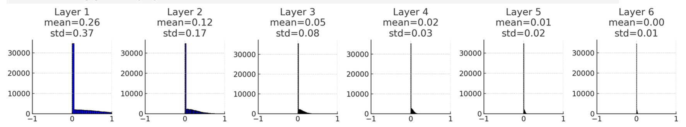
    </div>

- 如果值设的太大，激活值会迅速增加

    ```py hl_lines="6"
    dims = [4096] * 7
    hs = []
    x = np.random.randn(16, dims[0])
    # Forward pass with ReLU activation
    for Din, Dout in zip(dims[:-1], dims[1:]):
        W = 0.05 * np.random.randn(Din, Dout) # Small weight init
        x = np.maximum(0, x.dot(W)) # ReLU activation
        hs.append(x)
    ```

    <div style="text-align: center">
        
    </div>

一种解决方案是 **Kaiming / MSRA 初始化**：依赖层的大小

```py hl_lines="6"
dims = [4096] * 7
hs = []
x = np.random.randn(16, dims[0])
for Din, Dout in zip(dims[:-1], dims[1:]):
    W = np.random.randn(Din, Dout) * np.sqrt(2 / Din)
    x = np.maximum(0, x.dot(W)) # ReLU activation
    hs.append(x)
```

可以看到，现在激活值在每一层都得到很好的缩放！

<div style="text-align: center">
    
</div>

在残差块中，如果用 MSRA 初始化，那么 Var(F(x)) = Var(x)，但随后 Var(F(x) + x) > Var(x)，方差会在每个块中增长。解决方案是仅对第一个卷积层用 MSRA 初始化，第二个卷积层使用零初始化，从而 Var(F(x) + x) = Var(x)。


## How to Train CNNs?

### Data Preprocessing

数据预处理时，我们要对图像做**归一化**(normalization)处理，即对每一个通道进行中心化和缩放，具体来说：

- 减去每个通道的均值(per-channel mean)
- 然后除以每个通道的标准差(per-channel std)
- 需要根据给定的数据集预先计算好各通道的均值和标准差

用代码表示为：

```py
norm_pixel[i, j, c] = (pixel[i, j, c] - np.mean(pixel[:, :, c])) / np.std(pixel[:, :, c])
```

用散点图表示为：

<div style="text-align: center">
    
</div>

- 归一化前：分类损失对权重矩阵的变化非常敏感，难以优化
- 归一化后：对小权重变化不太敏感，更容易优化

---
在实践中，可能还会用到数据的主成分分析（**PCA**）和**白化处理**(whitening)技术：

<div style="text-align: center">
    
</div>


### Data Augmentation

**数据增强**(data augmentation)也是一种正则化方法，简单来说就是基于数据集中原有数据，经过一定变换后构造一些新的数据。

<div style="text-align: center">
    
</div>

数据增强为模型编码了**不变性**(invariance)，所以设计时需要思考：哪些对图像的改变不应该影响输出？对于不同的任务，该问题的答案也有所不同。

这些变换包括：

- **水平翻转**(horizontal flip)

    <div style="text-align: center">
        
    </div>

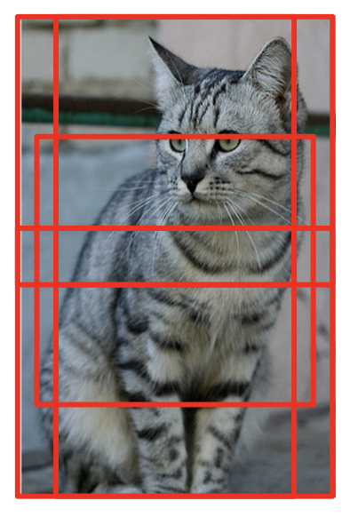{ align=right width=20% }

- **随机裁剪和缩放**(random crops and scales)（以 ResNet 为例）
    - 训练：采样进行随机裁剪或缩放
        1. 在范围 [256, 480] 中随机选取一个数 L
        2. 调整训练图像大小，短边长为 L
        3. 随机从图像裁剪出 224x224 的小块
    - 测试：计算一组固定的裁剪后的图像的均值
        1. 以 5 种比例调整图像大小：{224, 256, 384, 480, 640}
        2. 对于每个大小，使用 10 种 224x224 的裁剪：4 角 + 中心，+ 翻转

- **颜色抖动**(color jitter)：
    - 一种简单的方法是随机调整对比度和亮度
    - 更复杂的方法（被用在 AlexNet, ResNet 等模型上）：
        1. 在训练集中将主成分分析（PCA）用于 [R, G, B] 像素上
        2. 沿着主成分方向采样“颜色偏移量(color offset)”
        3. 将偏移量加在所有训练图像的像素上

    <div style="text-align: center">
        
    </div>

- **随机增强**(RandAugment)：应用各种变换的随机组合
    - 几何：旋转、平移、剪切(shear)
    - 颜色：锐化、对比度、亮度、光色分离(solarize)、色阶分离(posterize)、颜色

    ```py
    transforms = [
        'Identity', 'AutoContrast', 'Equalize',
        'Rotate', 'Solarize', 'Color', 'Posterize',
        'Contrast', 'Brightness', 'Sharpness',
        'ShearX', 'ShearY', 'TranslateX', 'TranslateY'
    ]

    def randaugment(N, M):
        """Generate a set of distortions.

        Args:
        N: Number of augmentation transformations to apply sequentially.
        M: Magnitude for all the transformations.

        """
        sampled_ops = np.random.choice(transforms, N)
        return [(op, M) for op in sampled_ops]
    ```

    <div style="text-align: center">
        
    </div>

{ align=right width=30% }

---
以下是一些正则化手段，但又和数据增强关系密切的技术：

- **挖剪**(cutout)
    - 训练：在图像上随机选择一块区域，将其值置零
    - 测试：使用完整的图像
    - 该方法在像 CIFAR 这样小的数据集上表现很好，但通常很少在像 ImageNet 这样的大型数据集中使用

- **混合**(mixup)
    - 训练：在随机混合的图像上训练
    - 测试：使用原始图像

    <div style="text-align: center">
        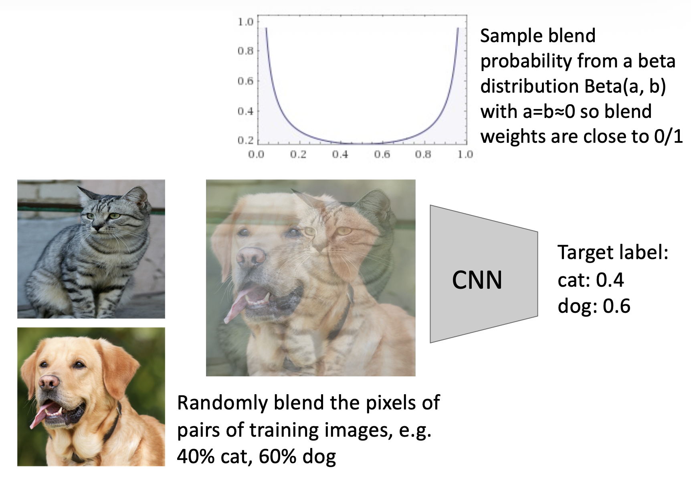
    </div>

- **裁剪 + 混合**(CutMix)
    - 训练：在随机混合的图像上训练
    - 测试：使用原始图像

    <div style="text-align: center">
        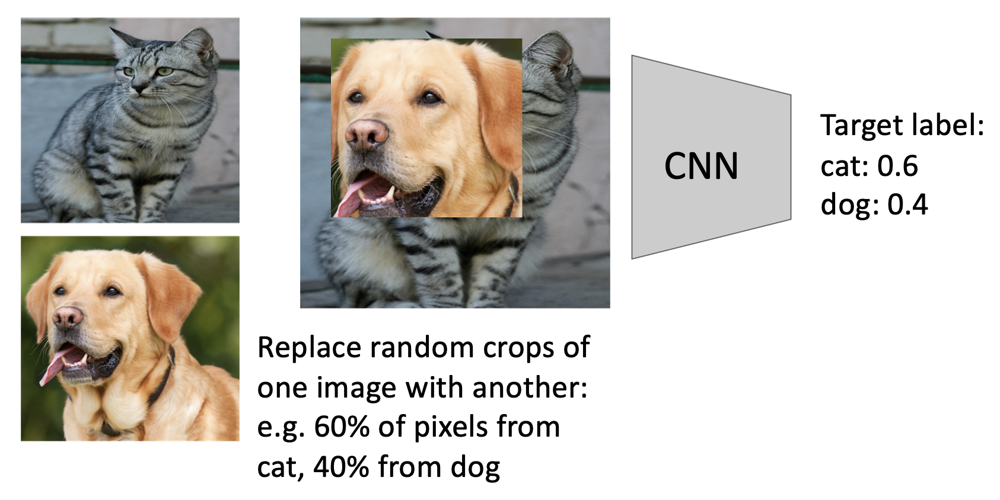
    </div>


### Hyperparameter Selection

选择超参数的步骤如下（无需大量 GPUs）：

1. 检查初始损失
    - 关闭权重衰减，在初始化时进行合理性检查损失

2. 过拟合一个小样本
    - 尝试在一小部分训练数据（约 5-10 个小批量）上训练到 100% 的训练准确率
    - 调整架构、学习率和权重初始化
    - 关闭正则化
    - 若损失不下降，说明学习速率太低，初始化效果不佳
    - 反之，若损失爆炸到无穷大或 NaN，说明学习率太高，初始化效果不佳

3. 找到使损失下降的 LR（学习速率）
    - 使用上一步的架构和所有训练数据，开启小权重衰减，然后找到一个学习速率，使得损失在约 100 次迭代内显著下降
    - 值的一试的学习速率：1e-1, 1e-2, 1e-3, 1e-4, 1e-5
4. 粗糙的超参数网格，训练约 1-5 个周期(epochs)
    - 选择几个学习速率和权重衰减的值，围绕步骤 3 中的有效参数，训练几个模型约 1-5 个周期
    - 值的一试的权重衰减：1e-4, 1e-5, 0

5. 细化网格，训练时间更长
    - 选择步骤 4 得到的最佳模型，在没有学习速率衰减的情况下训练得更久些（约 10-20 个周期）

6. 查看损失和准确率曲线
    - 损失可能存在噪声，所以使用散点图并绘制移动平均线以更好地观察趋势

        <div style="text-align: center">
            
        </div>

    - 以下曲线说明很有可能初始化效果不佳

        <div style="text-align: center">
            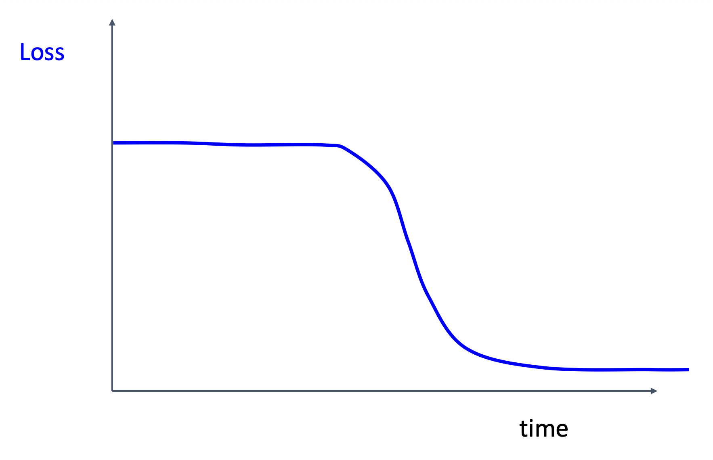
        </div>

    - 如果损失下不去，尝试让学习速率衰减

        <div style="text-align: center">
            
        </div>

    - 当学习速率下降时，损失还在减少，说明学习速率衰减过早

        <div style="text-align: center">
            
        </div>

    - 如果准确率仍然在上升，说明还需要训练更久

        <div style="text-align: center">
            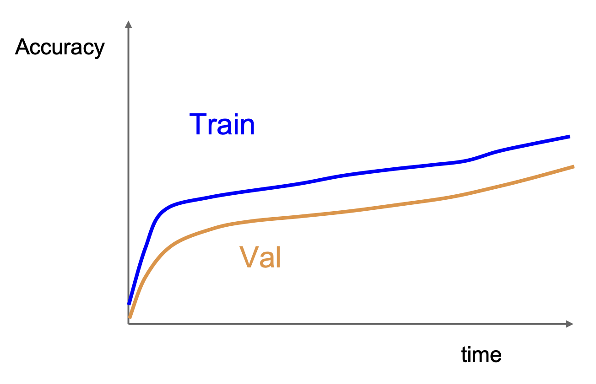
        </div>

    - 训练集和验证集的准确率相差太大，意味着存在**过拟合**问题，此时需要增加正则化程度或者获取更多数据

        <div style="text-align: center">
            
        </div>

    - 训练集和验证集的准确率没有差别，意味着**欠拟合**(underfitting)，此时需要训练得更久，或采用更大的模型

7. 回到第 5 步

超参数选择的方法有：

- **网格搜索**(grid search)：在超参数网格中评估所有可能的选择
    - 例子：
        - 权重衰减：[1x10^-4^, 1x10^-3^, 1x10^-2^, 1x10^-1^]
        - 学习速率：[1x10^-4^, 1x10^-3^, 1x10^-2^, 1x10^-1^]

- **随机搜索**(random search)：运行许多不同的试验
    - 例子：
        - 权重衰减：在 [1x10^-4^, 1x10^-1^] 上对数均匀分布
        - 学习速率：在 [1x10^-4^, 1x10^-1^] 上对数均匀分布

<div style="text-align: center">
    
</div>

>*Random Search for Hyper-Parameter Optimization*, Bergstra and Bengio, 2012


## After Training

### Model Ensembles

**模型集成**(model ensemble)的步骤如下：

1. 训练多个独立模型
2. 测试时，计算这些模型结果的平均值
    - 取预测概率分布的平均值，然后选择 argmax

该方法仅得到额外 2% 的性能提升。

模型集成的小技巧：

- 在训练时使用单个模型的多份快照，而不要训练独立的模型
    - **循环学习速率调度**(cyclic learning rate scheduling)能够让这一技巧发挥得更好

    <div style="text-align: center">
        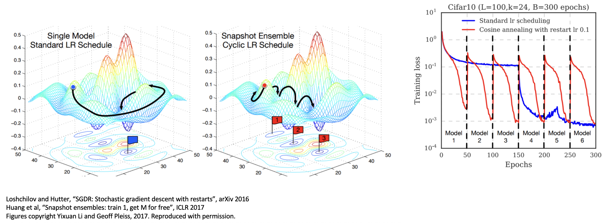
    </div>

- 保持一个移动的参数向量均值，并在测试时使用，而不是使用真正的参数向量（**Polyak 平均**）

    ```py
    while True:
        data_batch = dataset.sample_data_batch()
        loss = network.forward(data_batch)
        dx = network.backward()
        x += -learning_rate * dx
        x_test = 0.995 * x_test + 0.005 * x        # use for test set
    ```


### Transfer Learning

**迁移学习**(transfer learning)用来解决训练 CNNs 时手边没有很多数据的情况。步骤如下：

<div style="text-align: center">
    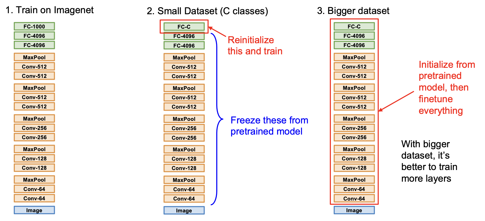
</div>

1. 在 ImageNet 上训练模型
2. 由于我们只关心部分数据集上的表现，所以提取上一步训练好的模型，去掉最后的全连接层，冻结和其他数据集相关的权重
3. 从预训练模型中初始化，然后进行微调

一些技巧：

- 先进行特征提取训练，然后再进行微调
- 降低学习速率：仅使用在初始训练时 1/10 的学习速率
- 有时通过固定低层来暴露计算
- 在“测试”模式下用 BatchNorm 训练

在迁移学习中，CNN 架构的提升也会为很多下游任务带来提升。

<div style="text-align: center">
    
</div>

???+ abstract "总结"

    { align=left width=20% }

    | | 非常相似的数据集 | 非常不同的数据集 |
    | :--- | :--- | :--- |
    | 非常少的数据 | 在最终层使用线性分类器 | 使用别的模型或收集更多的数据 |
    | 相当多的数据 | 微调所有模型层 | 要么微调所有模型层，要么从头训练 |

带给我们的启示：如果手边有一些感兴趣的数据，但是 < ~1M 的图像

- 寻找很大的且包含相似图像的数据集，根据该数据集训练一个大模型
- 迁移学习至原来手边的数据集上

在 CV 中，迁移学习已然成为常态。比如在**目标检测**(object detection)任务中，部分模型就是在 ImageNet 上预训练的。

<div style="text-align: center">
    
</div>

{ align=right width=30% }

我们可以将这一流程概括为以下步骤：

1. 在 ImageNet 上训练 CNN
2. 在 Visual Genome 上微调来自步骤 1 的模型，用于目标检测
3. 在大量文本上训练 BERT 语言模型
4. 结合步骤 2 和 3 得到的模型，训练联合的图像/语言模型
5. 微调步骤 4 得到的模型，用于图像描述、视觉问答等任务

??? question "受到质疑"

    最近有研究发现迁移学习的效果可能并不像我们认为的那么好。在 ImageNet 上从头训练一个模型可以取得和采用预训练模型微调差不多的结果（只要训练时间足够长）。

    <div style="text-align: center">
        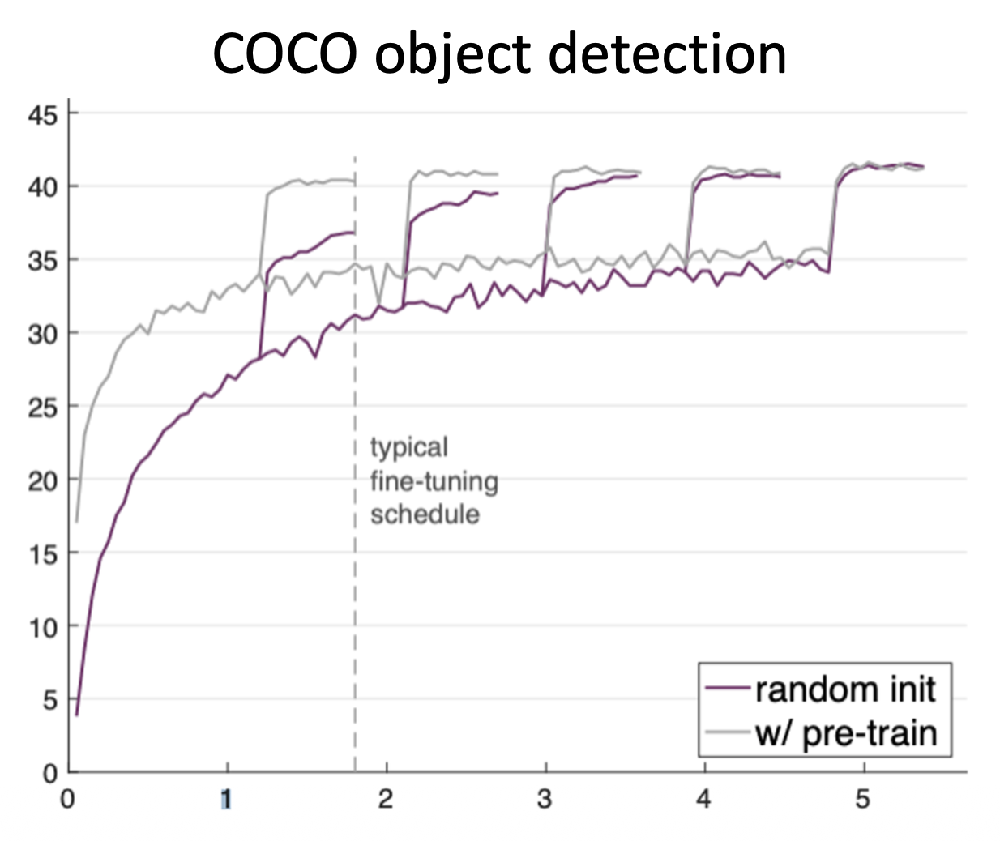
    </div>

    并且只有当数据量很小时，预训练 + 微调才能击败从头训练的策略。也就是说，收集大量数据比预训练更有效。

    <div style="text-align: center">
        
    </div>

深度学习框架提供了一个预训练模型家族，所以我们无需训练自己的模型。

- Pytorch：<https://github.com/pytorch/vision>
- Hugggingface：<https://github.com/huggingface/pytorch-image-models>