# Recurrent Neural Networks

???+ note "训练一个非循环神经网络"

    - **一次性设置**(setup one time)：激活函数、预处理、权重初始化、归一化、迁移学习
    - **训练动态**(training dynamics)：关注学习过程、参数更新、超参数优化
    - **评估**(evaluation)：验证性能(validation performance)、测试时增强(test-time augmentation)

相比一般的神经网络，**循环神经网络**(recurrent neural network, **RNN**)擅长的是处理**序列**(sequences)。

=== "NN"

    <div style="text-align: center">
        
    </div>

=== "RNN"

    <div style="text-align: center">
        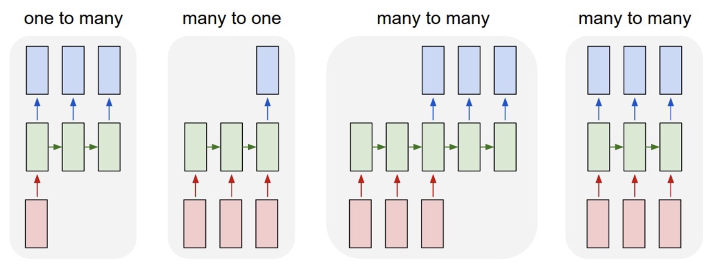
    </div>

    - 一对多：比如图像描述（一张图像 -> 一段词序列）
    - 多对一：比如行动预测（一段视频帧序列 -> 一个行动类别）
    - 多对多：比如
        - 图像描述（一段视频帧序列 -> 一段词序列）（右二）
        - 帧级别的视频分类（右一）

    ??? info "其实也可作用在非序列数据上"

        通过一系列“瞥见(glimpse)”来对图像进行分类：

        <div style="text-align: center">
            
        </div>

        一块块地生产图像：

        <div style="text-align: center">
            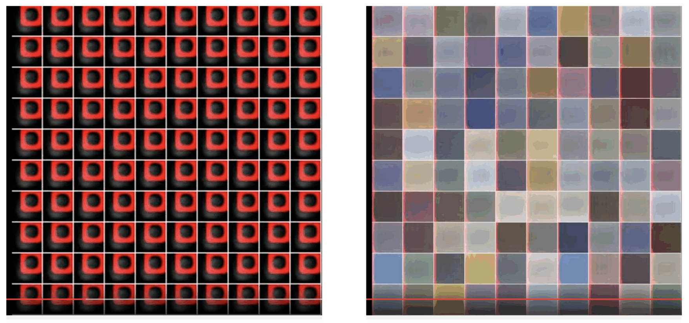
        </div>

        与油画模拟器集成，每一个时间步输出新的一笔：

        <div style="text-align: center">
            
        </div>

RNN 的关键思想是有一个在序列处理过程中不断更新的“**内部状态**(internal state)”。

展开后的 RNN：

<div style="text-align: center">
    
</div>

- 隐含的状态更新：$h_t = f_W(h_{t-1}, x_t)$
    - $h_t$：新状态
    - $f_W$：以 $W$ 为参数的函数
    - $h_{t-1}$：旧状态
    - $x_t$：在某一时刻的输入向量
- 输出生成：$y_t = f_{W_{hy}}(h_t)$
    - $y_t$：输出
    - $f_{W_{hy}}$：另一个以 $W_{hy}$ 为参数的函数
    - $h_t$：新状态

>注意：每一步都用到相同的函数和参数。


## Vanilla RNNs

在一个简单的 RNN（Vanilla RNN / Elman RNN）中，

<div style="text-align: center">
    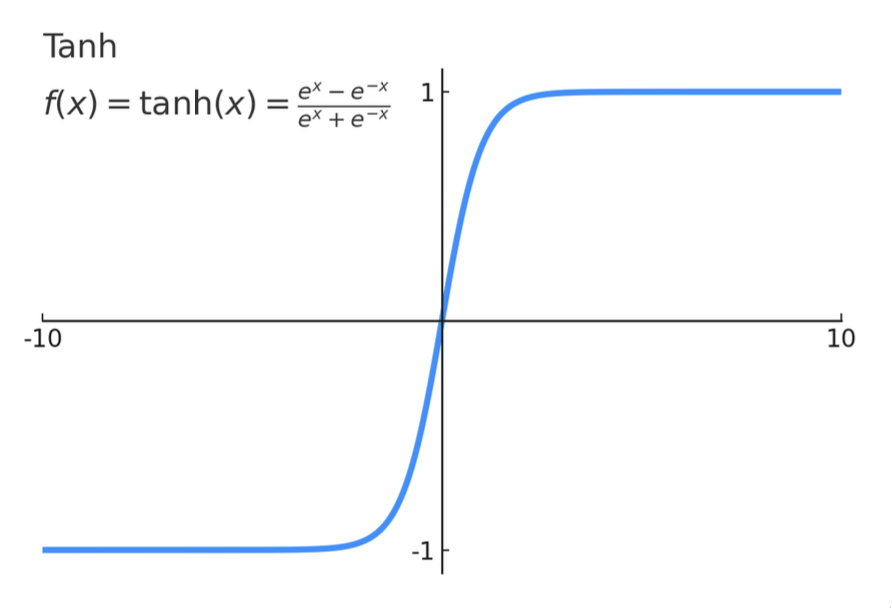
</div>

- $h_t = \tanh (W_{hh}h_{t-1} + W_{xh}x_t)$
- $y_t = W_{hy}h_t$

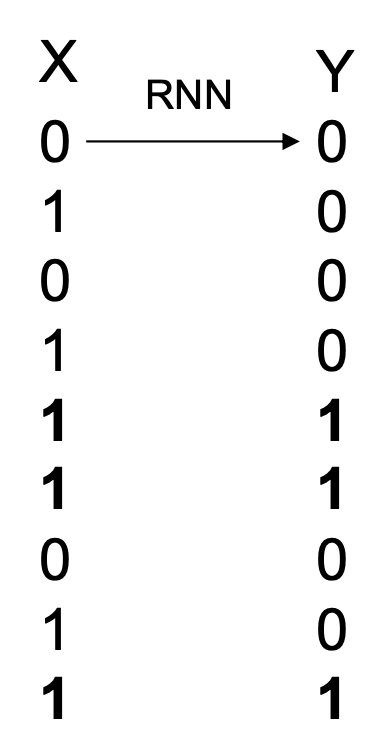{ align=right width=15% }

现在我们手动创建一个 RNN 来检测重复的 1，这是一个多对多的序列建模任务。

- 隐含状态需要捕捉先前的输入和当前的 $x$ 值
- 简洁起见，令 $f_W$ 和 $f_y$ 均为 ReLU 函数，即：
    - $h_t=ReLU(W_{hh}h_{t-1}+W_{xh}x_t)$
    - $y_t=ReLU(W_{hy}h_t)$
- $h_t = \begin{pmatrix}\text{Current} \\ \text{Previous} \\ 1\end{pmatrix}$，初始化 $h_0 = (0, 0, 1)$

核心代码段如下（[完整代码链接](https://colab.research.google.com/drive/15YMP5dVcfUz2M36a_wmL4mEqKUlgJrdE?usp=sharing)）：

```py
w_xh = np.array([[1], [0], [0]])  # (1)

w_hh = np.array([[0, 0, 0],       # (2)
                 [1, 0, 0],       # (3)
                 [0, 0, 1]])      # (4)

w_yh = np.array([1, 1, -1])       # (5)

x_seq = [0, 1, 0, 1, 1, 1, 0, 1, 1]

h_t_prev = np.array([[0], [0], [1]])

for t, x in enumerate(x_seq):
    h_t = relu(w_hh @ h_t_prev + (w_xh @ x))
    y_t = relu(w_yh @ h_t)
    h_t_prev = h_t
```

1.  右侧项 
    - x = 0 -> [0, 0, 0]
    - x = 1 -> [1, 0, 0]
2.  0 代表左侧项首行（仅用来自右侧项的值）
3.  将“当前”的值从之前的隐藏状态复制过来，成为“之前”
4.  保留底部的 1（有利于输出）
5.  max(current + previous - 1, 0)


## Computational Graphs

每一步重复使用相同的权重矩阵：

<div style="text-align: center">
    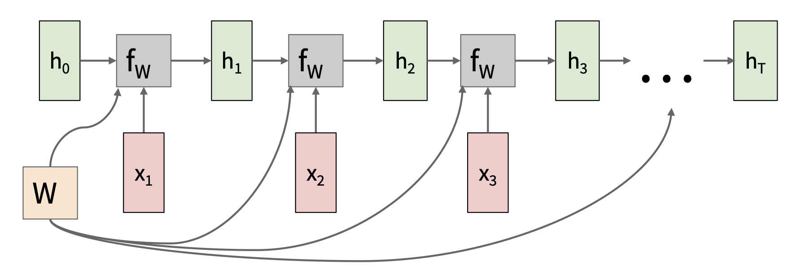
</div>

- 多对多：

    <div style="text-align: center">
        
    </div>

- 多对一：将输入序列编码为单个向量

    <div style="text-align: center">
        
    </div>

- 一对多：从单个输入向量中产生输出序列

    <div style="text-align: center">
        
    </div>


## Backpropagation

在 RNN 中，向前遍历整个序列以计算损失，然后向后遍历整个序列以计算梯度（**反向传播**）。

<div style="text-align: center">
    
</div>

但对 RNN 而言，这样做会在长序列上消耗大量内存。因此在 RNN 上，实际做的是**随时间截断的反向传播**(truncated backpropagation through time, TBTT)：

- 在序列**块**(chunks)中向前和向后遍历计算，而不是一次考虑整个序列
- 永远向前传递隐含状态，但仅在较少的步骤中进行反向传播
- 仍然在每个时间步计算梯度，依赖于上游梯度（每个时间步不再有损失）

=== "Chunk 1"

    <div style="text-align: center">
        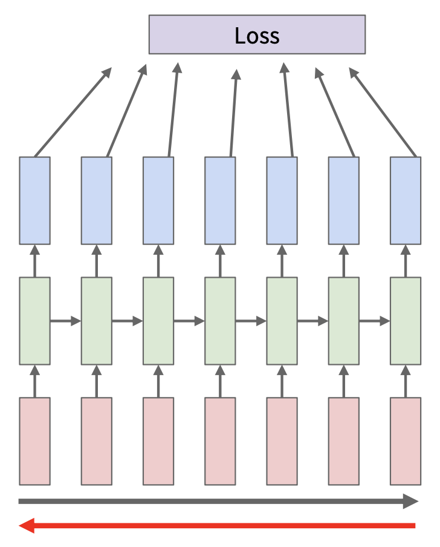
    </div>

=== "Chunk 2"

    <div style="text-align: center">
        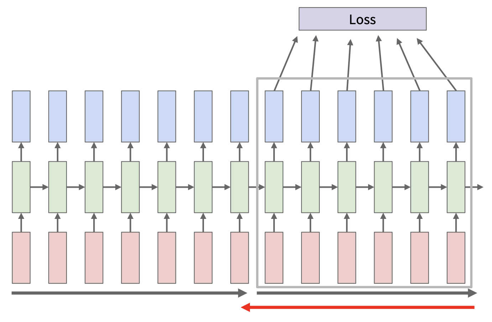
    </div>

=== "Chunk 3"

    <div style="text-align: center">
        
    </div>


## A More Pratical Example

用 RNN 搭建一个字符级的语言模型(character-level language model)

- 字母表：[h, e, l, o]
- 样例训练序列："hello"
- 给定前 t - 1 个字符，生成第 t 个字符

<div style="text-align: center">
    
</div>

测试时每次仅采样一个字符，将输出反馈给模型（作为下一次的输入）：

<div style="text-align: center">
    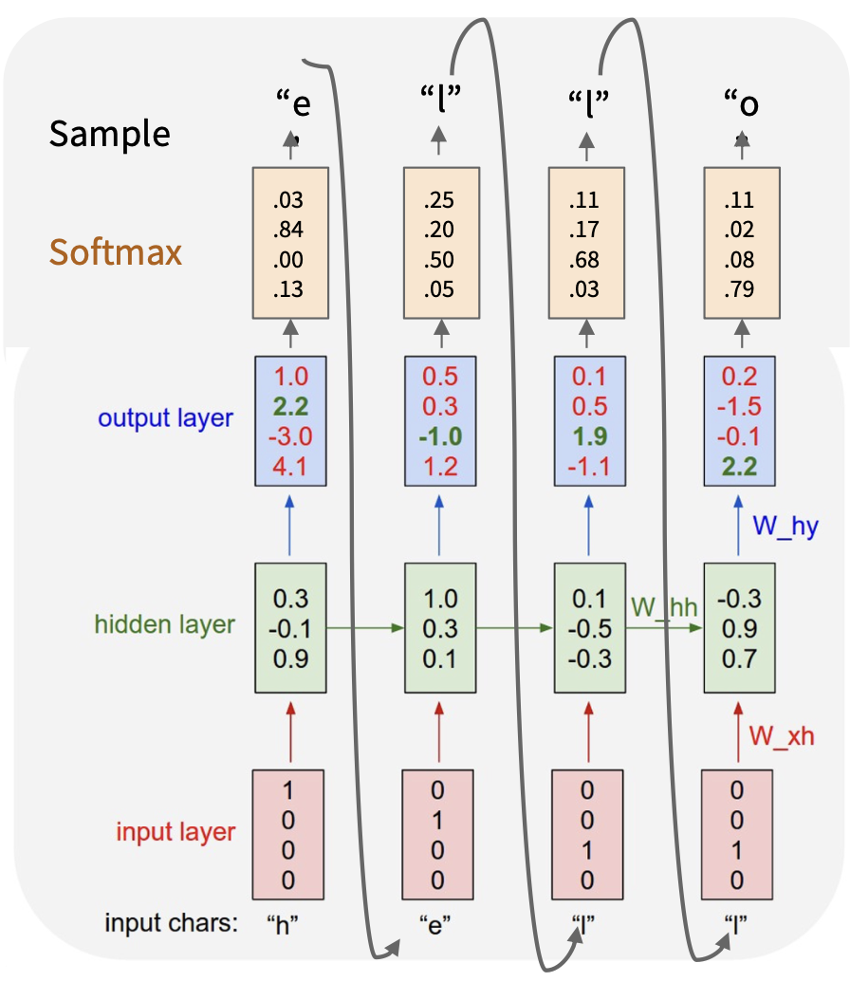
</div>

矩阵-独热向量（输入）乘法的结果是从权重矩阵中提取某一列。

$$
\begin{bmatrix}
W_{11} & W_{12} & W_{13} & W_{14} \\
W_{21} & W_{22} & W_{23} & W_{24} \\
W_{31} & W_{32} & W_{33} & W_{34} \\
W_{41} & W_{42} & W_{43} & W_{44}
\end{bmatrix}
\begin{bmatrix}
1 \\
0 \\
0 \\
0
\end{bmatrix} =
\begin{bmatrix}
W_{11} \\
W_{21} \\
W_{31} \\
W_{41}
\end{bmatrix}
$$

我们通常在输入层和隐藏层之间放置一个单独的**嵌入层**。

<div style="text-align: center">
    
</div>

源代码仅 112 行（Python）（[链接](https://gist.github.com/karpathy/d4dee566867f8291f086)）

???+ example "实际应用"

    === "文学作品"

        让 RNN 基于莎士比亚的作品训练：

        <div style="text-align: center">
            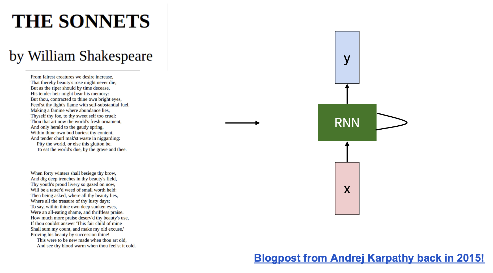
        </div>

        可以看到，随着训练次数的增加，模型生成文本的质量越来越高：

        <div style="text-align: center">
            
        </div>

        最终成果：

        <div style="text-align: center">
            
        </div>

    === "代码"

        让模型阅读 [Linux 源码](https://github.com/torvalds/linux)，最终它能生成这样的 C 代码：

        ```c
        static void do_command (struct seg_file *m, void *v)
        {
            int column = 32 << (cmd[2] & 0x80);
            if (state)
                cd = (int) (int_state ^ (in_8(&ch->ch_flags) & Cmd) ? 2: 1);
            else
                seg = 1;
            for (i = 0; i < 16; i++) {
                if (k & (1 << 1))
                    pipe = (in_use & UMXTHREAD_UNCCA) +
                        ((count & 0x00000000fffffff8) & 0x000000f) << 8;
                if (count == 0)
                    sub(pid, ppc_md.kexec_handle, 0x20000000) ;
                pipe_set_bytes(1, 0) ;
            }
            /* Free our user pages pointer to place camera if all dash */
            subsystem_info = &of_changes[PAGE_SIZE];
            rek_controls(offset, idx, &soffset);
            /* Now we want to deliberately put it to device */
            control_check_polarity(&context, val, 0);
            for (i = 0; i < COUNTER; i++)
                seą_puts(s, "policy ");
        }
        ```

        现在的 OpenAI Codex, GitHub Copilot, Cursor IDE 已经具备相当不错的代码生成能力了。

        <div style="text-align: center">
            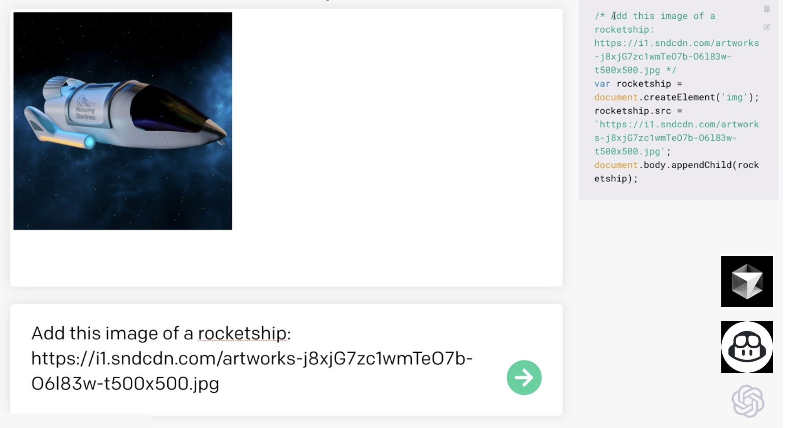
        </div>


## Searching for Interpretable Cells

<div style="text-align: center">
    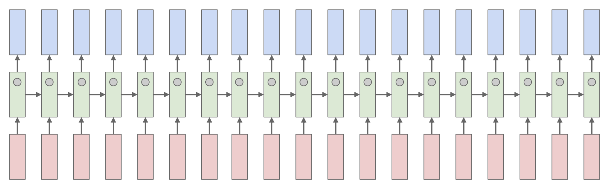
</div>

我们将展开后的 RNN 中的隐含状态看作神经网络上的一个个细胞。我们希望能找到那些**可解释的**(interpretable)细胞，即有明确功能和目的的细胞，比如说：

- 引用检测细胞

    <div style="text-align: center">
        
    </div>

- 行长度追踪细胞

    <div style="text-align: center">
        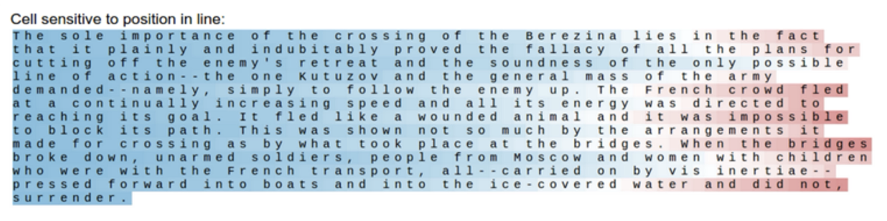
    </div>

- `#!c if` 语句细胞

    <div style="text-align: center">
        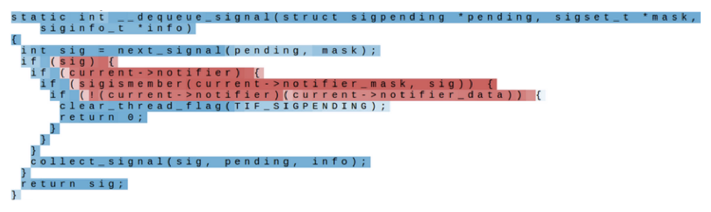
    </div>

- 注释细胞

    <div style="text-align: center">
        
    </div>

- 代码深度细胞

    <div style="text-align: center">
        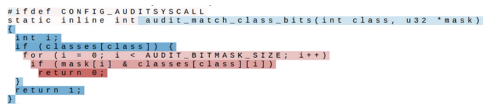
    </div>

???+ abstract "RNN 的优缺点"

    - 优点：
        - 能处理任意长度的输入（无上下文长度）
        - 步骤 t 的计算（理论上）能使用很多步前的信息
        - 模型大小不会因输入变长而增加
        - 相同的权重作用在每一个时间步上，所以在输入的处理方式上具有对称性

    - 缺点：
        - 循环计算很慢
        - 实际上难以访问很多步前的信息


## Applications

### Image Captioning

图像描述的模型同时用到了 CNN 和 RNN。

<div style="text-align: center">
    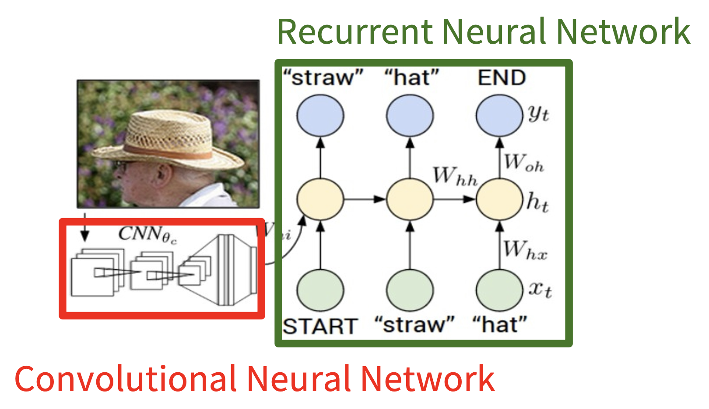
</div>

=== "Step 0"

    去掉了最后的全连接层

    <div style="text-align: center">
        
    </div>

=== "Step 1"

    <div style="text-align: center">
        
    </div>

    - 图像经过 CNN 后产生权重矩阵 $W_{ih}$ 给 RNN
    - 而 RNN 的隐含状态方程变为了 $h = \tanh (W_{xh} \cdot x + W_{hh} \cdot h \textcolor{red}{+ W_{ih} \cdot v})$

=== "Step 2"

    采样前一次输出结果，作为下一次的输入：

    <div style="text-align: center">
        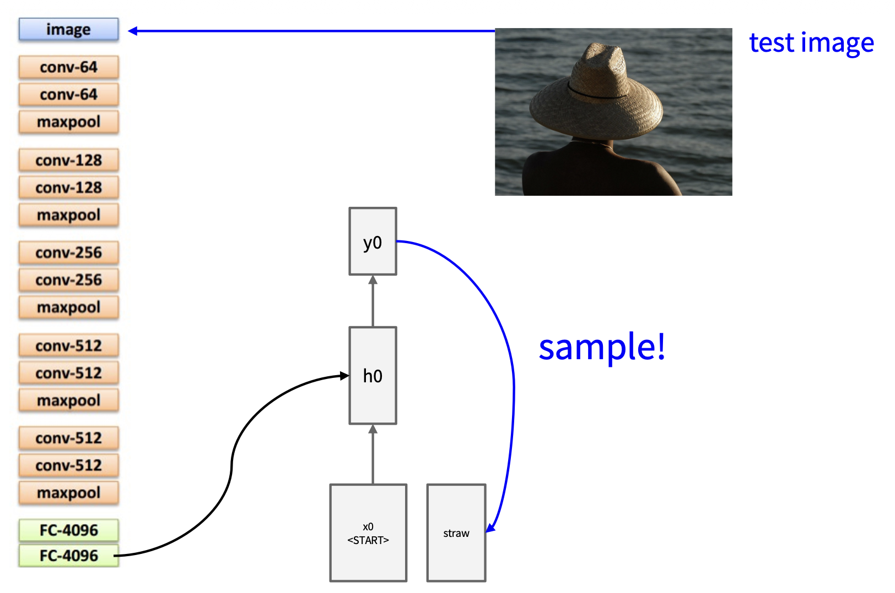
    </div>

    <div style="text-align: center">
        
    </div>

=== "Step 3"

    同上

    <div style="text-align: center">
        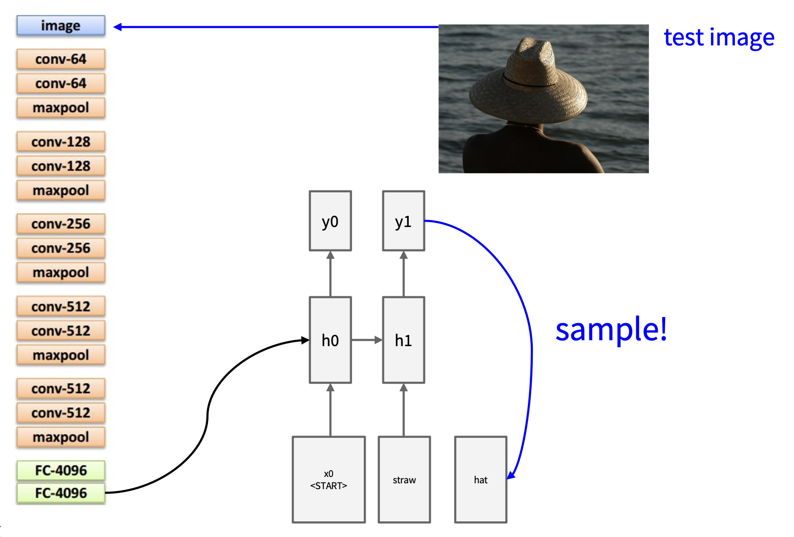
    </div>

    <div style="text-align: center">
        
    </div>

=== "Step 4"

    若采样发现 <END> token，意味着任务完成，模型停止运行。

    <div style="text-align: center">
        
    </div>

---
结果：

- 成功例子：

    <div style="text-align: center">
        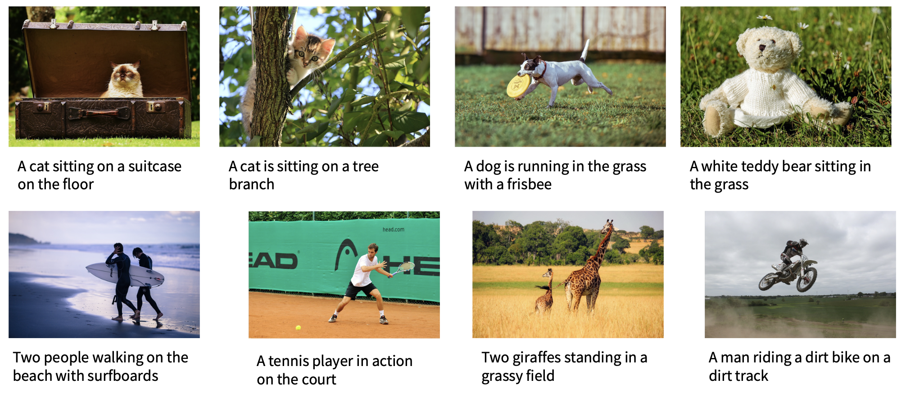
    </div>

- 失败例子：

    <div style="text-align: center">
        
    </div>


### Visual Question Answering (VQA)

<div style="text-align: center">
    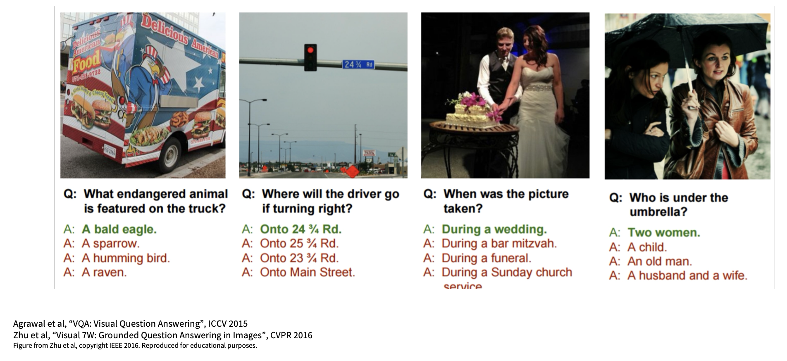
</div>


### Visual Dialog

<div style="text-align: center">
    
</div>


### Visual Language Navigation

- 智能体将指令编码为语言
- 当视觉输入在一次移动后改变时，用 RNN 生成一系列的移动

<div style="text-align: center">
    
</div>


## Long Short Term Memory (LSTM)

<div class="grid cards" markdown>

-   普通 RNN

    $$
    h_t = \tanh \left( W \begin{pmatrix} h_{t-1} \\ x_t \end{pmatrix} \right)
    $$

-   **LSTM** 

    $$
    \begin{aligned}
    \begin{pmatrix} i \\ f \\ o \\ g \end{pmatrix}
    & = \begin{pmatrix} \sigma \\ \sigma \\ \sigma \\ \tanh \end{pmatrix}
    W
    \begin{pmatrix} h_{t-1} \\ x_t \end{pmatrix} \\
    c_t & = f \odot c_{t-1} + i \odot g \\
    h_t & = o \odot \tanh(c_t)
    \end{aligned}
    $$

</div>

???+ bug "普通 RNN 的问题"

    普通 RNN 的梯度流：

    <div style="text-align: center">
        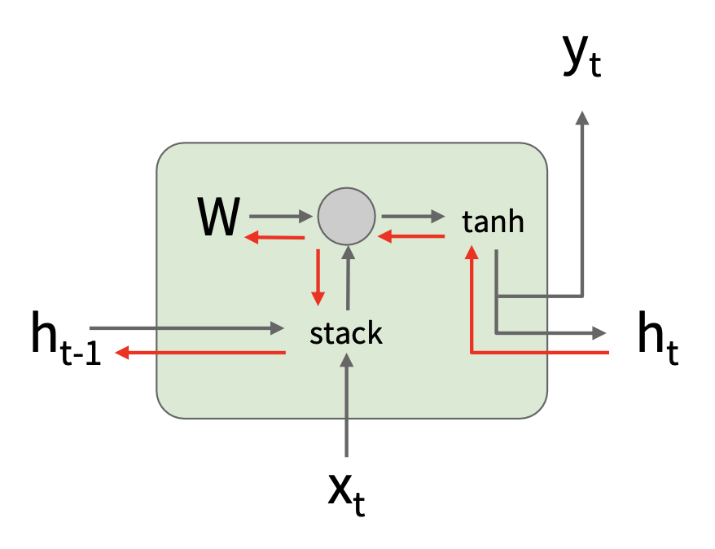
    </div>

    从 $h_t$ 到 $h_{t-1}$ 的反向传播乘以 $W$（实际上是 $W_{hh}^T$）。因此：
    $$
    \frac{\partial h_t}{\partial h_{t-1}} = \tanh' \left( W_{hh} h_{t-1} + W_{xh} x_t \right) W_{hh}
    $$

    在多个时间步上的梯度：

    <div style="text-align: center">
        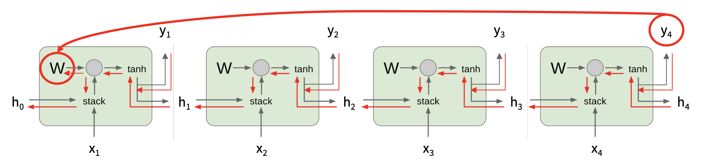
    </div>

    $$
    \begin{align*}
    \frac{\partial L}{\partial W} &= \sum_{t=1}^{T} \frac{\partial L_t}{\partial W} \\
    \frac{\partial L_T}{\partial W} &= \frac{\partial L_T}{\partial h_T} \frac{\partial h_T}{\partial h_{T-1}} \cdots \frac{\partial h_1}{\partial W} = \frac{\partial L_T}{\partial h_T} \left( \prod_{t=2}^{T} \frac{\partial h_t}{\partial h_{t-1}} \right) \frac{\partial h_1}{\partial W} \\
    & = \frac{\partial L_T}{\partial h_T} \left( \prod_{t=2}^{T} \tanh' \left( W_{hh} h_{t-1} + W_{xh} x_t \right) \right) W_{hh}^{T-1} \frac{\partial h_1}{\partial W}
    \end{align*}
    $$

    但是根据 $\tanh'$ 的图像，其值几乎总是 < 1（只有在接近 0 的时候取值较大），所以这样计算出来的梯度值近乎消失(vanishing gradient)。

    若假设没有非线性，考虑 $W_{hh}^{T-1}$ 的最大奇异值：

    - \> 1 -> 梯度爆炸
        - 解决方案——**梯度裁剪**(gradient clipping)：若范数过大，则缩放梯度

        ```py
        grad_norm = np.sum(grad * grad)
        if grad_norm > threshold:
            grad *= (threshold / grad_norm)
        ```

    - < 1 -> 梯度消失
        - 解决方案：改变 RNN 架构

**长短期记忆**(long short term memory, **LSTM**)的方程如下：

$$
\begin{aligned}
\begin{pmatrix} i \\ f \\ o \\ g \end{pmatrix}
& = \begin{pmatrix} \sigma \\ \sigma \\ \sigma \\ \tanh \end{pmatrix}
W
\begin{pmatrix} h_{t-1} \\ x_t \end{pmatrix} \\
c_t & = f \odot c_{t-1} + i \odot g \\
h_t & = o \odot \tanh(c_t)
\end{aligned}
$$

其中：

- $\begin{pmatrix} i \\ f \\ o \\ g \end{pmatrix}$ 表示四个门

    <div style="text-align: center">
        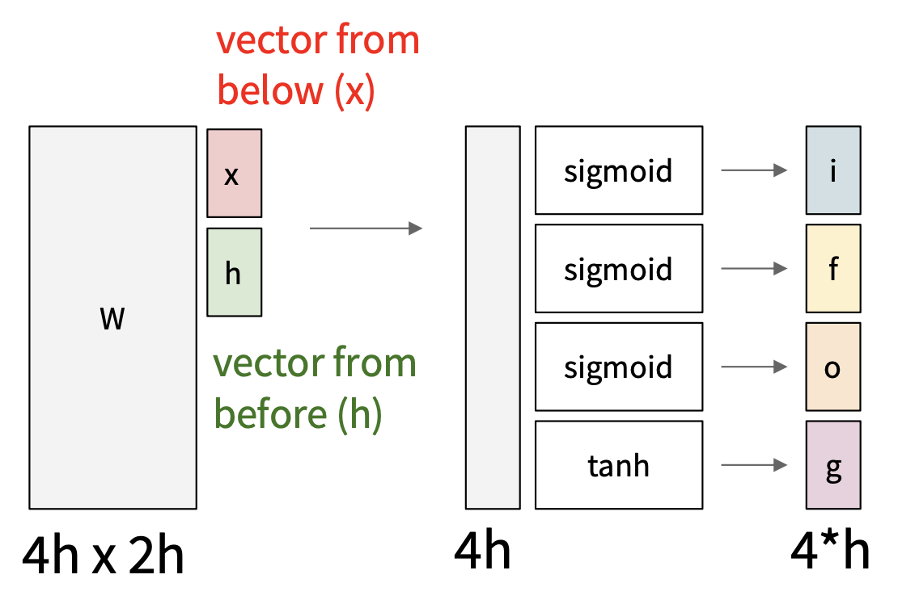
    </div>

    - $i$：输入门(input gate)，是否向细胞写入
    - $f$：遗忘门(forget gate)，是否删除细胞
    - $o$：输出门(output gate)，要揭露多少细胞
    - $g$：门门(Gate gate)，向细胞写入多少东西

- $c_t$ 表示细胞状态
- $h_t$ 表示隐含状态

LSTM 的内部结构如下：

<div style="text-align: center">
    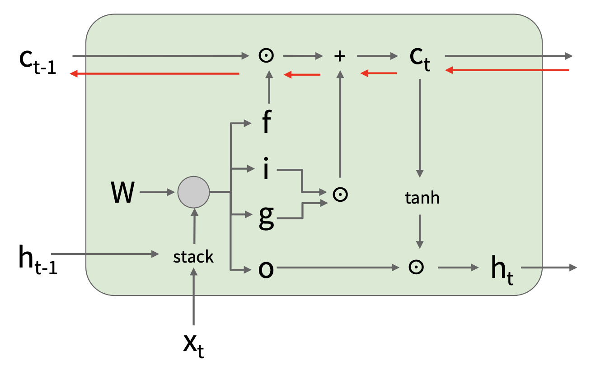
</div>

从 $c_t$ 到 $c_{t-1}$ 的反向传播仅做和 $f$ 的逐元素乘法，而不是和 $W$ 的矩阵乘法。

梯度流不可中断！

<div style="text-align: center">
    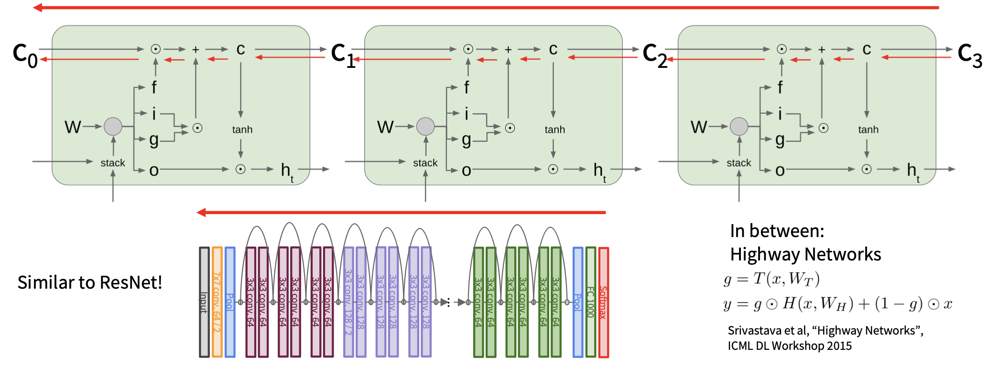
</div>

???+ question "LSTMs 是否解决了消失梯度的问题呢？"

    LSTM 架构使得 RNN 更容易在多个时间步长中保留信息。

    - 例如，如果 $f = 1$ 且 $i = 0$，则该单元的信息将被无限期保留
    - 相比之下，普通 RNN 更难学习一个保持隐含状态信息的递归权重矩阵 $W_h$

    LSTM **并不能保证没有消失/爆炸梯度**，但它确实为模型学习长距离依赖提供了更简单的方法。


## Multilayer RNNs

=== "单层 RNNs"

    <div style="text-align: center">
        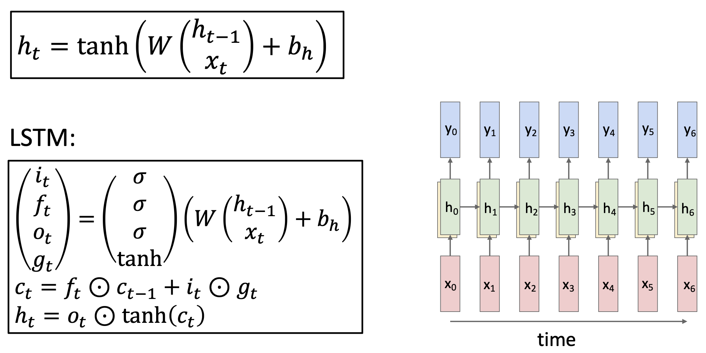
    </div>

=== "多层 RNNs"

    <div style="text-align: center">
        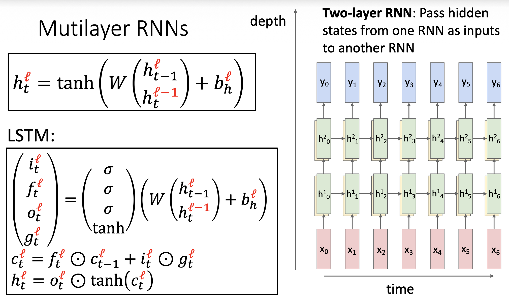
    </div>

    <div style="text-align: center">
        
    </div>

???+ info "现代 RNNs"

    - 有时称为「状态空间模型(state space models)」
        - 隐含状态
    - 主要优势：
        - 无限的上下文长度
        - 计算与序列长度成线性关系

    <div style="text-align: center">
        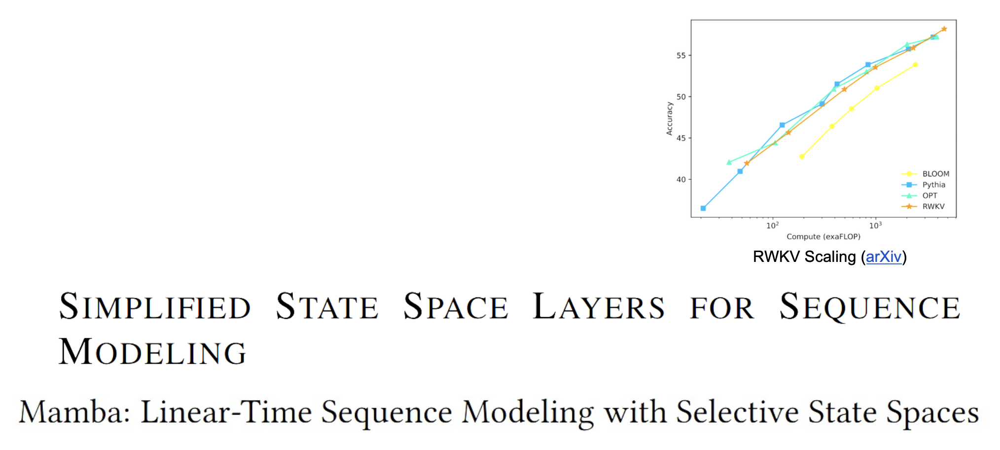
    </div>

???+ abstract "总结"

    - RNN 使得架构设计有很大的灵活性
    - 普通 RNN 简单但效果不佳
    - 更复杂的变体（例如 LSTM、Mamba）可以引入选择性地传递信息的方法
    - RNN 中的梯度反向传播可能会爆炸或消失
        - 通过梯度裁剪来控制爆炸
        - 通常需要时间反向传播
    - 更好/更简单的架构是当前研究的热门话题，以及对序列进行推理的新范式

