# Attention and Transformers

- **注意力**(attention)：一种在向量集合上操作的原语(primitive)

    

        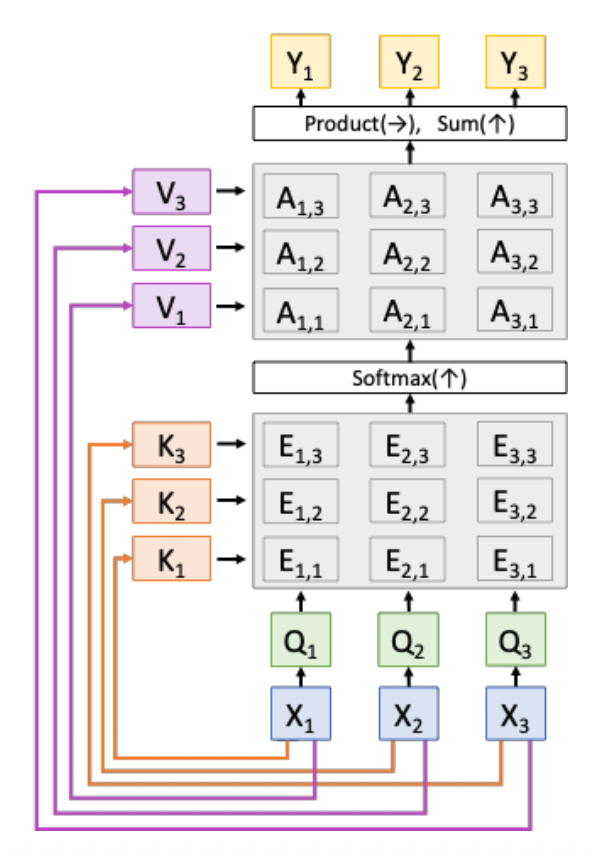
    

- **Transformer**：一种在各处使用注意力的神经网络架构

    

        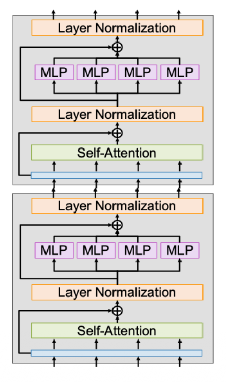
    

现在 Transformers 已无处不在，但它们都是从 RNNs 的分支发展起来的，所以接下来也将从 RNNs 出发来引出注意力和 Transformer 的介绍。

## Attention

### Sequence to Sequence with RNNs

使用 RNNs 解决序列到序列(**seq2seq**)的问题时，我们可以采用一种叫做**编码器-解码器**(encoder-decoder)的架构。顾名思义，整个网络被分成了两部分：

    

>注：已知输入序列为 $x_1, \dots, x_T$，输出序列为 $y_1, \dots, y_T$；并且假设具体要完成的任务是从英文到意文的机器翻译。

- **编码器**：$h_t = f_W(x_t, h_{t-1})$

    

        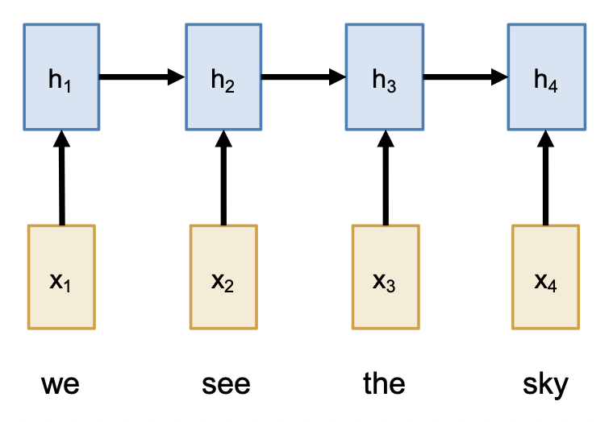
    

    根据最后一个隐含状态预测出：

    - **初始解码器向量**(initial decoder vector) $s_0$
    - **上下文向量**(context vector) $c$（通常 $c = h_T$）

- **解码器**：$s_t = g_U(y_{t-1}, s_{t-1}, c)$

    

        
    

也许读者发现，输入序列的瓶颈来自固定长度的上下文向量 $c$。尽管对上例而言影响不大，但假如 $T = 1000$ 时该怎么办呢？解决方案是：在输出的每一步中，都要回过头来看整个输入序列——这也正是注意力机制的思路。

### Seq2Seq with RNNs and Attention

相较于前一版架构，这次我们得好好考虑 $c$ 是怎么计算出来的。

    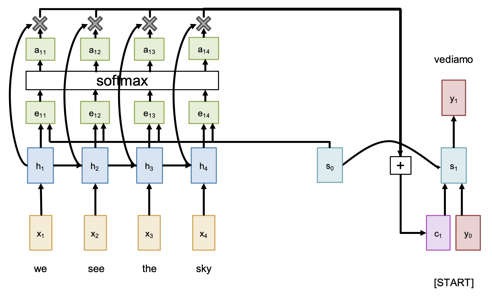

- 根据初始解码器状态 $s_0$ 和编码器的隐含状态，计算每个隐含状态对应的**对齐分数**(alignment score)（标量）

    $$
    e_{t, i} = f_{att}(s_{t-1}, h_i)
    $$

    其中 $f_{att}$ 作为线性层

- 归一化对齐分数，得到**注意权重**，即满足 $0 < a_{t, i} < 1, \sum_i a_{t, i} = 1$
- 计算上下文向量，它是一个关于隐含状态的加权和

    $$
    c_t = \sum_i a_{t, i} h_i
    $$

- 在解码器中使用上下文向量：

    $$
    s_t = g_U(y_{t-1}, s_{t-1}, c_t)
    $$

    其中 $g_U$ 是 RNN 单元（比如 LSTM、GRU 等）

直觉上看，上下文向量关注的是输入序列的相关部分。比如意大利语 "vediamo" = 英语 "we see"，所以可能 $a_{11} = a_{12} = 0.45, a_{13} = a_{14} = 0.05$。

好消息是：这些步骤都是可微的，这意味着可以用到反向传播！

再回过头来看解码器：

    

- 使用 $s_1$ 计算新的上下文向量 $c_2$
- 计算新的对齐分数 $e_{2, i}$ 和注意权重 $a_{2, i}$
- 继续使用上下文向量计算新的隐含状态：$s_t = g_U(y_{t-1}, s_{t-1}, c_t)$
- 重复上述过程，直到输出 \<STOP\> 之类的 token 时停止

由于在解码器的每个时间步中使用了不同的上下文向量，因此：

- 输入序列不会因只有单个向量而受阻
- 每个时间步中，上下文向量会“查看”输入序列的不同部分

---
仍然回到前面机器翻译的任务，假设：

- 输入："The agreement on the European Economic Area was signed in August 1992."
- 输出："L'accord sur la zone économique européenne a été signé en août 1992."

我们可以得到以下关于注意权重的可视化结果：

    

- 蓝色和紫色部分：对角注意意味着词语按顺序对应
- 黄色部分：注意找到了其他词序（也就是有问题）

??? example "应用：图像描述"

    === "Step 1"

        

            
        

    === "Step 2"

        

            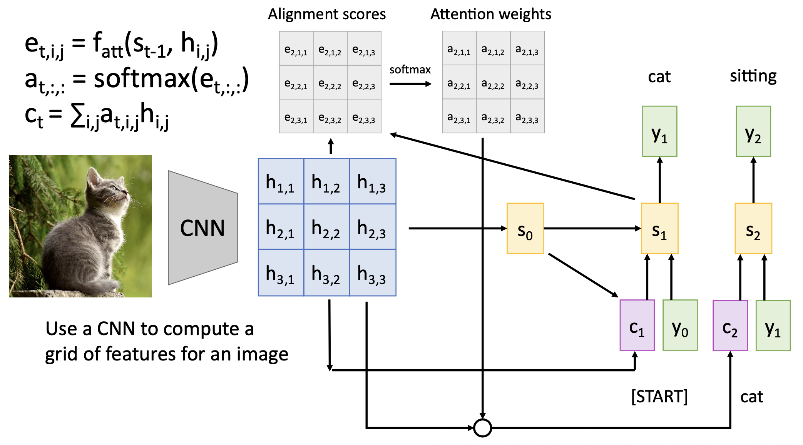
        

    === "Step 3"

        

            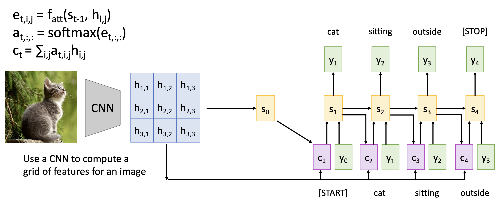
        

    ---
    解码器在每个时间步中使用不同的上下文向量来观察图像的不同部分。

    

        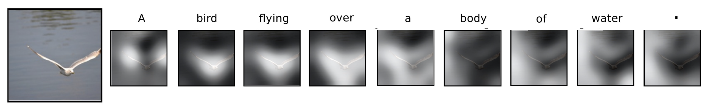
    

    

        
    

??? info "A Fun Fact"

    有很多关于注意力的 paper 的标题都是 "X, Attend and Y"（X, Y 都是动词），比如：

    

        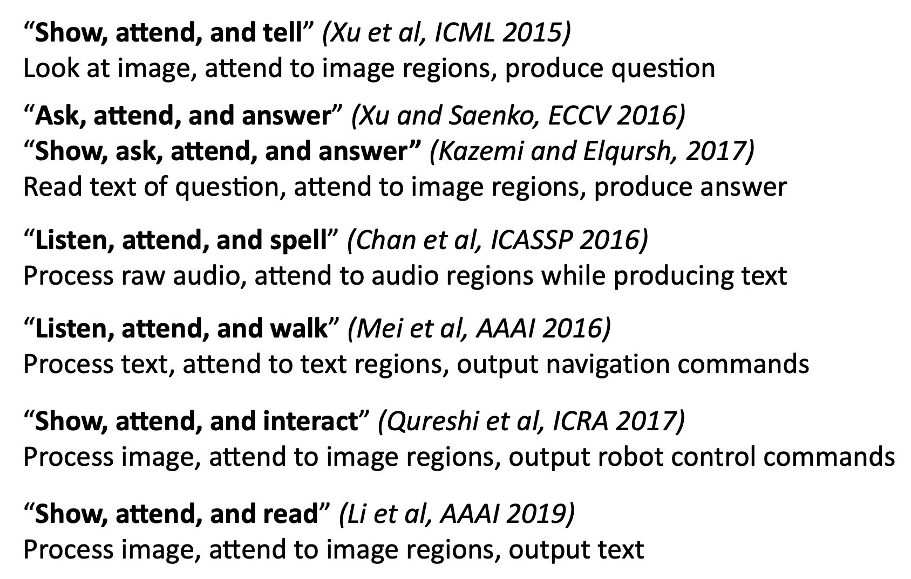
    

---
回到整体的编码器-解码器架构上，我们再来确定一些术语：

    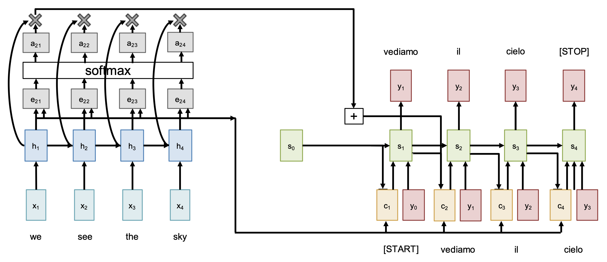

- **查询向量**(query vector)：解码器的 RNN 状态（上图绿色部分）
- **数据向量**(data vector)：编码器的 RNN 状态（上图蓝色部分）
- **输出向量**(output vector)：上下文状态（上图黄色部分）

每一个查询会关注所有数据向量，并得到一个输出向量。

### Attention Layer

我们将上述过程进行更加形式化的表述：

    

- 输入：
    - 查询向量：$q$【$D_Q$】
    - 数据向量：$X$【$N_X \times D_X$】
- 计算：
    - **相似度**(similarity)：$e$【$N_X$】，其中 $e_i = f_{att}(q, X_i)$
    - 注意权重：$a = \text{softmax}(e)$【$N_X$】
    - 输出向量：$y = \sum_i a_i X_i$【$D_X$】

我们要对以上过程做一些改动：

- 计算相似度时使用**比例**点积，即

    $$
    e_i = q \cdot X_i / \sqrt{D_X}
    $$

    - 之所以要除以 $\sqrt{D_X}$，是因为相似度太大会导致 softmax 饱和并产生消失的梯度；回想一下 $a \cdot b = |a||b| \cos(\text{angle})$，假设 $a, b$ 是维度为 $D$ 的常量向量，那么 $|a| = (\sum_i a^2)^{1/2} = a \sqrt{D}$

- 使用多个查询向量，即 $Q$【$N_Q \times D_X$】，从而改变了后续的计算
    - 相似度：$E = QX^T / \sqrt{D_X}$【$N_Q \times N_X$】，其中 $E_{ij} = Q_i \cdot X_j / \sqrt{D_X}$
    - 注意权重：$A = \text{softmax}(E, \text{dim}=1)$【$N_Q \times N_X$】
    - 输出向量：$Y = AX$【$N_Q \times D_X$】，其中 $Y_i \sum_i A_{ij} X_j$

- 分离**键**和**值**
    - 键矩阵 $W_K$【$D_X \times D_Q$】，值矩阵 $W_V$【$D_X \times D_V$】
    - 在数据向量上作用这两个矩阵，可分别得到键（$K = XW_K$【$N_X \times D_Q$】）和值（$V = XW_V$【$N_X \times D_V$】）
    - **相似度**变为基于**键**的计算：$E = QK^T / \sqrt{D_Q}$【$N_Q \times N_X$】，其中 $E_{ij} = Q_i \cdot K_j / \sqrt{D_X}$
    - 而**输出向量**则变为基于**值**的计算：$Y = AX$【$N_Q \times D_X$】，其中 $Y_i \sum_i A_{ij} X_j$

经过这三个改变后，我们得到了更通用的注意层，如下所示：

    

- softmax 用来归一化每一列，使得每个列能表示每个**查询**预测关于**键**的分布
- **输出**是关于**值**的线性组合，加权来自注意权重
- 每个查询产生一个输出，该输出是一个关于数据向量的混合信息

这个注意层已经跟 RNN 没什么关系了，它是一个独立的神经网络层，可以直接插入到神经网络架构中。

有时这又称为**交叉注意层**(cross-attention layer)，因为它有两组输入（查询向量和数据向量）。

### Self-Attention Layer

上述注意层还有一种更常见的变体，叫做**自注意层**(self-attention layer)。它的不同之处在于只有一个输入来源，即**输入向量**，而它对应原来注意层中的数据向量。而**查询**的计算类似键和值的计算，也是让输入向量和一个**查询矩阵**相乘得到。下面列出修改后的各项参数：

- 输入：
    - 输入向量：$X$【$N \times D_{\text{in}}$】
    - 键矩阵：$W_K$【$D_{\text{in}}, D_{\text{out}}$】
    - 值矩阵：$W_V$【$D_{\text{in}}, D_{\text{out}}$】
    - 查询矩阵：$W_Q$【$D_{\text{in}}, D_{\text{out}}$】
- 计算：
    - 查询：$Q = XW_Q$【$N \times D_{\text{out}}$】
    - 键：$K = XW_K$【$N \times D_{\text{out}}$】
    - 值：$V = XW_V$【$N \times D_{\text{out}}$】
    - 相似度：$E = QK^T / \sqrt{D_Q}$【$N \times N$】，其中 $E_{ij} = Q_i \cdot K_j / \sqrt{D_Q}$
    - 注意权重：$A = \text{softmax}(E, \text{dim}=1)$【$N \times N$】
    - 输出向量：$Y = AV$【$N \times D_{\text{out}}$】，其中 $Y_i = \sum_j A_{ij} V_j$

对应的示意图如下：

    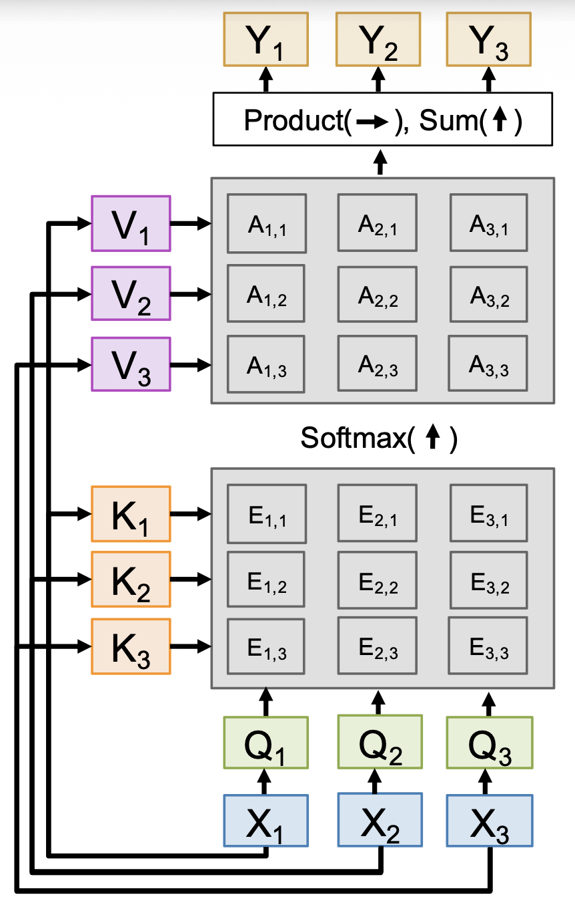

- 每个输入产生一个输出，该输出是所有输入的混合信息
- 形状上变得更简单了
    - $N$ 个输入向量，每个都是 $D_{\text{in}}$ 维的
    - 几乎总是满足 $D_Q = D_V = D_{\text{out}}$

- 对于每个输入，计算查询、键和值向量
    - 通常融合为一个矩阵乘法：$\begin{bmatrix}Q & K & V\end{bmatrix} = X\begin{bmatrix}W_Q & W_K & W_V\end{bmatrix}$（$[N \times 3 D_{\text{out}}] = [N \times D_{\text{in}}] [D_{\text{in}} \times 3 D_{\text{out}}]$）

- 对每个键和每个查询，计算相似度
- 归一化每一列，用于表示每个查询预测关于键的分布
- 输出是关于值的线性组合，加权来自注意权重

注意到，调换输入顺序后，查询、键、值、相似度、注意权重和输出的顺序也发生了对应的改变，但始终和输入顺序对应。这说明自注意是**排列等变的**(permutation equivariant)，即 $F(\sigma(X)) = \sigma(F(X))$，这意味着自注意能在向量集合上正常运作。

    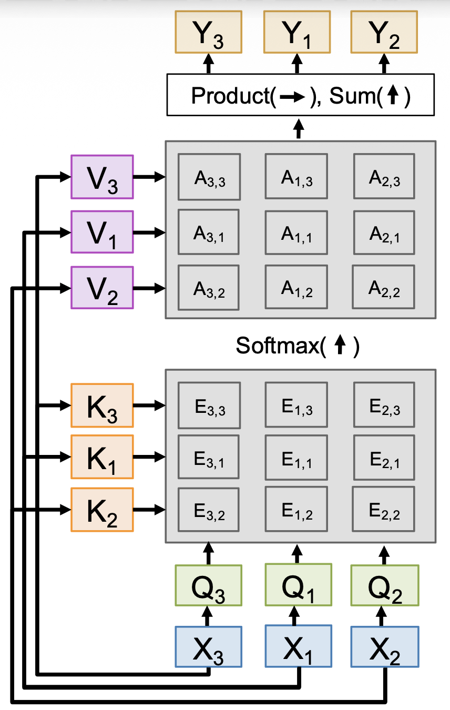

自注意的一个问题是无法得知输入序列的顺序。解决方案是在每个输入上加一个**位置编码**(position encoding)，这是一个表示关于索引的固定函数的向量。

    

???+ example "例子：带自注意模块的 CNN"

    

        
    

### Masked Self-Attention Layer

有时对于某个输入，我们可能不希望它能提前看到序列的其他部分；这样的自注意层称为**掩码自注意层**(masked self-attention layer)。「掩码」操作是这样实现的：用负无穷（-inf）覆写原有相似度的值，从而控制每个向量能看到的输入。

    

这种结构适用于希望能预测下一个词的 LLM。

### Multiheaded Self-Attention Layer

为提高效率，我们可以并行运行同一个自注意层的 H 个副本。

- 这些副本是独立的自注意层（称为**头**）
    - 每个副本都有自己的权重
    - 并且引入一种新的维度 $D_H = D / H$，使得输入和输出有相同的维度
- 对于每个输入，堆叠来自这些副本的 H 个独立的输出
- 输出投影融合来自每个头的数据
- 实际上使用分批的矩阵乘法运算并行计算全部的头

    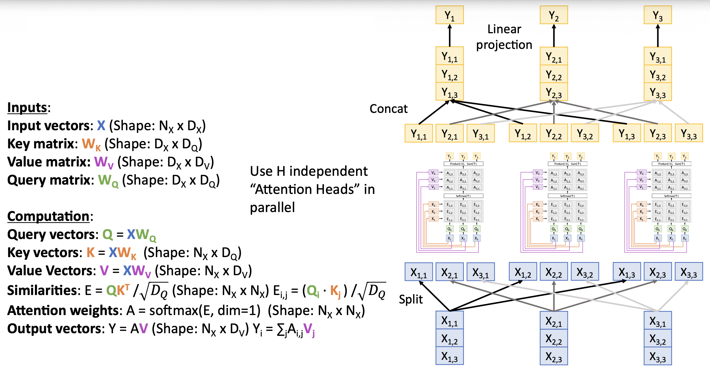

### Self-Attention == 4 Matrix Multiplication

自注意层看似要做很多事，但本质上完成的是 4 类矩阵乘法运算：

1. **QKV 投影**：
    - [N x D] [D x 3HD~H~] => [N x 3HD~H~]
    - 分割并重塑以获得维度为 [H x N x D~H~] 的 Q, K, V 

2. **QK 相似度**：[H x N x D~H~] [H x D~H~ x N] => [H x N x N]
3. **V 权重**：
    - [H x N x N] [H x N x D~H~] => [H x N x D~H~]
    - 重塑为 [N x HD~H~]

4. **输出投影**：[N x HD~H~] [HD~H~ x D] => [N x D]

上述计算的时间和空间复杂度均为 $O(N^2)$（来自第 2 和第 3 个矩阵运算）。

但如果空间复杂度为 $O(N^2)$，假如 N=100K, H=64，那么规模为 NxHxH 的注意权重就会耗费 1.192 TB，GPU 可没那么多内存啊！但好在我们有解决方案：采用**快速注意算法**(flash attention algorithm)，同时计算第 2 和第 3 个矩阵乘法，无需存储完整的权重矩阵，这使得更大的 N 成为可能。此时空间复杂度降至 $O(N)$。

???+ abstract "总结：处理序列的方法"

    - **RNN**：在一维有序序列上运行
        - 优点：理论上在长序列上表现不错，时间和空间复杂度均为 $O(N)$（长度为 $N$）
        - 缺点：无法并行，需要按顺序计算隐含状态

        

            
        

    - **CNN**：在 N 维网格上运行
        - 优点：可并行计算输出
        - 缺点：在长序列上表现差，需要堆叠很多层形成更大的感受野

        

            
        

    - **自注意**：在向量集上运行
        - 优点：在长序列上表现很好，输出直接依赖于输入
        - 缺点：成本高，时间复杂度 $O(N^2)$，空间复杂度 $O(N)$

        

            
        

## Transformer

**Transformer** 由多个相同的 Transformer 块堆叠而成。每个 Transformer 块的输入输出均为一组向量，其内部结构如下：

{ align=right width=30% }

1. 所有的输入向量通过（多头）自注意交互
2. 用到**残差连接**(residual connection)技术（类似 ResNet）
3. 通过**层归一化**(layer normalization)来归一化向量
    - 输入：$h_1, \dots, h_N$，比例因子 $\gamma$，偏移 $\beta$（都是 $D$ 维向量）
    - $\mu_i = (\sum_j h_{i, j}) / D$
    - $\sigma_i = (\sum_j (h_{i, j} - \mu_i)^2 / D)^{1/2}$
    - $z_i = (h_i - \mu_i) / \sigma_i$
    - $y_i = \gamma * z_i + \beta$

4. 每个向量独立作用一个 **MLP**（多层感知机）
    - 使用两层 MLP，使用经典设置 D => 4D => D
    - 有时称作**前馈网络**(feed-forward network, FFN)

5. 再过一次残差连接
6. 再过一次层归一化，得到最终输出向量

可以看到，这是一个高度可扩展和并行化的结构。计算主要包括 6 个矩阵乘法，其中 4 个来自自注意，2 个来自 MLP。

Transformer 上的迁移学习：

- 预训练：从网上下载大量文本，训练一个很大的用于语言建模的 Transformer
- 微调：在自己的任务上微调 Transformer

自 2017 年首次提出到现在，Transformer 架构本质上没有太大变化，但是规模上变得越来越大。对比：

    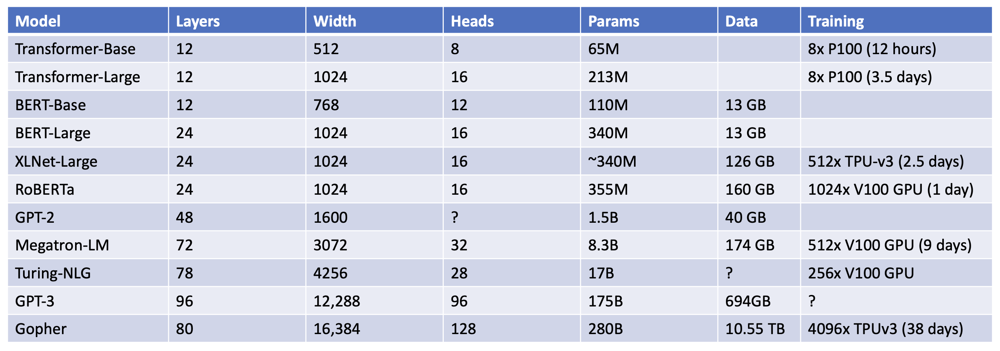

{ align=right width=20% }

### Transformers for Language Modeling (LLM)

- 在模型开头部分学习一个嵌入矩阵，将词转换为向量
- 对于大小为 V 的词汇表和 D 维的模型，查找表的大小为 [V x D]
- 每个 Transformer 块内使用掩码注意，这样每个 token 只能看到前面的内容
- 模型末端再学习一个形状为 [D x V] 的投影矩阵，将每个 D 维的向量投影到 V 维的分数向量，对应词汇表的每个元素
- 使用 softmax 和交叉熵来训练预测下一个 token 的能力

??? example "例子：GPT-3"

    === "文本生成"

        

            
        

    === "编程"

        

            
        

    === "文学风格迁移"

        

            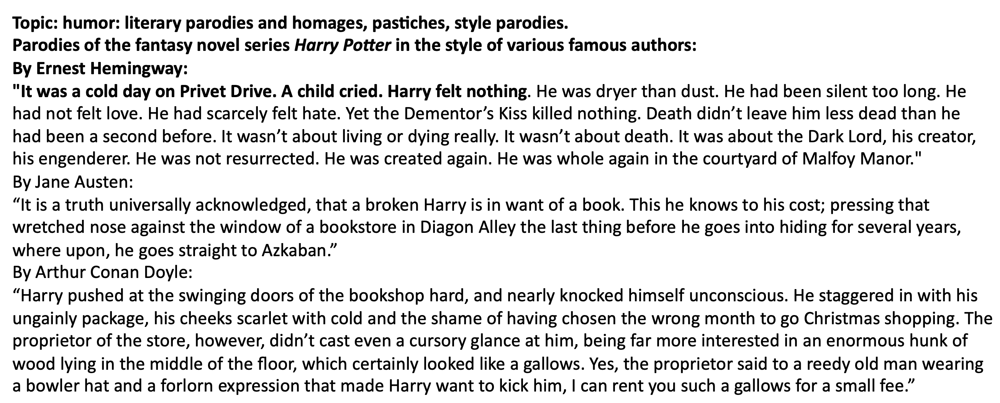
        

### Vision Transformers (ViT)

现在思考一下：如何将注意力 / Transformer 用于视觉任务中？

=== "思路1：将注意层加入到现有的 CNNs"

    

        
    

    - 从标准的 CNN 架构开始（比如 ResNet）
    - 在现有的 ResNet 块中加入自注意块
    - 此时模型仍然是 CNN，我们是否能完全替换掉 CNN？

=== "思路2：用“局部注意”替换卷积"

    

        
    

    - 卷积：每个位置上的输出是卷积核与输入上的感受野之间的内积
    - 替换过程：
        - 将感受野中心映射到查询上
        - 将感受野的每个元素映射到键和值上
        - 使用注意来计算输出
    
    - 使用局部注意替换 ResNet 中所有的卷积
        - LR：局部关系(local relation)

        

            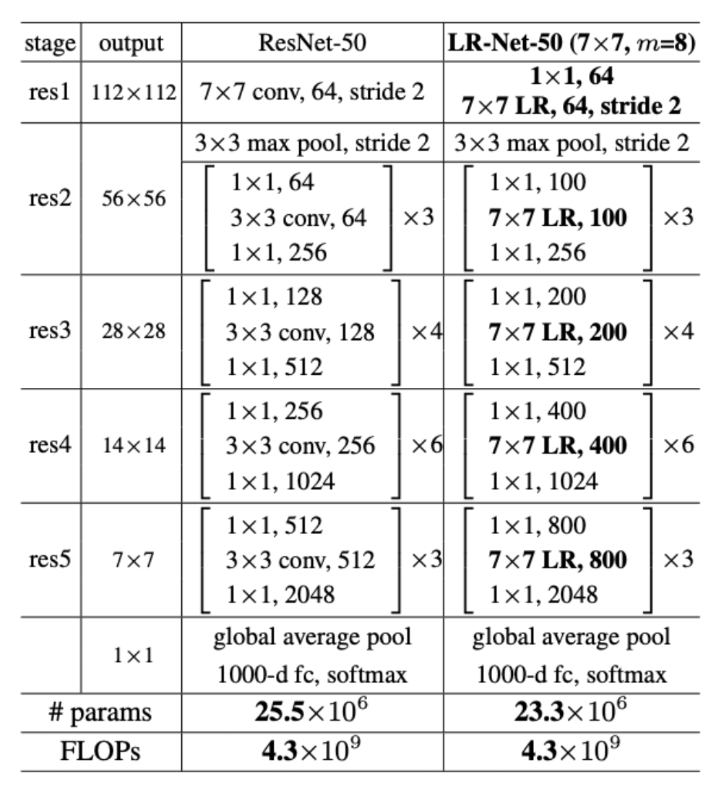
        

    - 问题：有大量棘手的细节，难以实现，仅略优于 ResNets

=== "思路3：在像素上的标准 Transformer"

    

        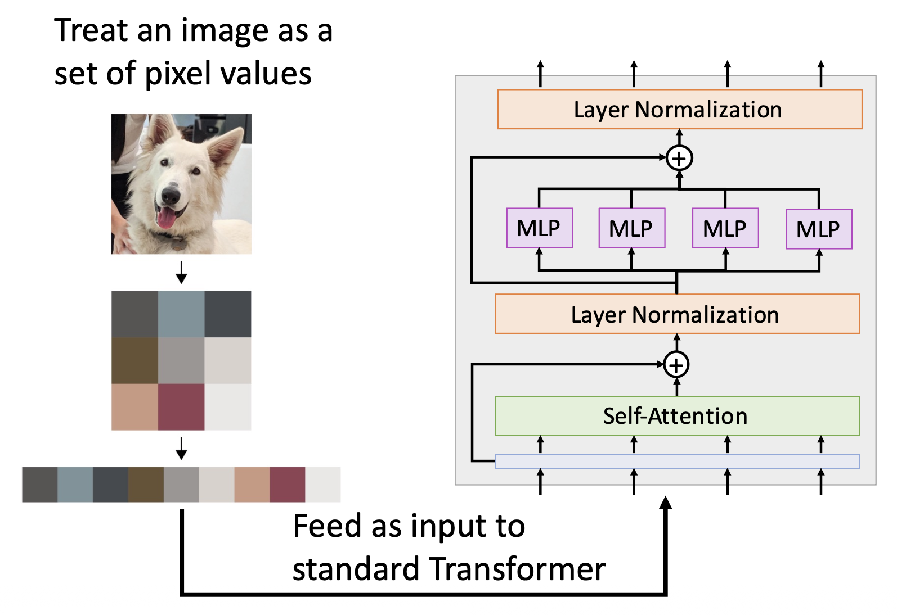
    

    - 将图像看作一组像素值，作为标准 Transformer 的输入
    - 问题：内存使用
        - RxR 的图像需要大小为 R^4^ 的注意力矩阵
        - 假设 R=128，48 层，每层 16 个头，一个样例就要 768GB 的内存空间来存储注意力矩阵

实际上的视觉 Transformer 的执行过程为：

1. 将输入图像分成多个小块
2. 将每个小块展平，并进行线性转换，得到 D 维向量，作为 Transformer 的输入
    - 另外还会输入一个特殊的额外输入：分类 token（D 维，学习得来的）
3. 使用**位置编码**告诉 Transformer 每个块的二维位置
4. 不要使用掩码，每个块都能看到其他所有的块
5. Transformer 为每个块输出一个向量，这些向量经过一个平均池化后从 NxD 转化为 1xD 的输出
6. 最后经过一个线性层，从 D 维转为 C 维，作为预测类别分数

    

- 这是一种无卷积的计算机视觉模型
- 但也不完全是无卷积的：
    - 当块大小为 p 时，第一层实际上是一个二维卷积（pxp, 3->D, stride=p）
    - Transformer 中的 MLP 是1x1卷积的堆叠

- 实际上：
    - 取 224x224 输入图像，将其划分为 14x14 的 16x16 的像素块（或网格）
    - 每个注意力矩阵有 14^4^ = 38,416 个条目，占用 150 KB（或 65,536 个条目，占用 256 KB）
    - 48 层，每层 16 头，所有注意力矩阵共占 112MB（或 192MB）

???+ note "ViT vs ResNets"

    

        
    

    - 在 ImageNet（1k 类别，1.2M 张图像）上训练时，ViT 模型的表现比 ResNet 更差
    - 在 ImageNet-21k（21k 类别，14M 张图像）上预训练，并在 ImageNet 上微调的话，ViT 表现更好，和大型 ResNet 差不多
    - 在 JFT-300M（Google 内部的数据集，有 300M 张标注图像）上预训练，并在 ImageNet 上微调的话，大型 ViT 比大型 ResNet 表现更好
    - ViTs 更高效地利用 GPU/TPU 硬件（矩阵乘法比卷积对硬件更友好）
    - ViT 模型比 ResNet 具有“更少的归纳偏差”，因此需要更多的预训练数据来学习良好的特征
        - 但“归纳偏差”不是一个定义明确的、可以衡量的概念

#### Improving ViTs

既然 ViT 在 ImageNet 上表现不佳，那么我们就尝试改进 ViT，具体有以下两种思路：

- **增强**(augmentation)和**正则化**(regularization)
    - 正则化：
        - 权重衰减(weight decay)
        - 随机深度(stochastic depth)
        - 随机失活(dropout)（在 Transformer 的前馈层中）
    
    - 数据增强：
        - 混合(MixUp)
        - 随机增强(RandAugment)

    - 加入正则化几乎总是有帮助的
    - 使用正则化 + 增强后的结果相比原来有巨大提升

    

        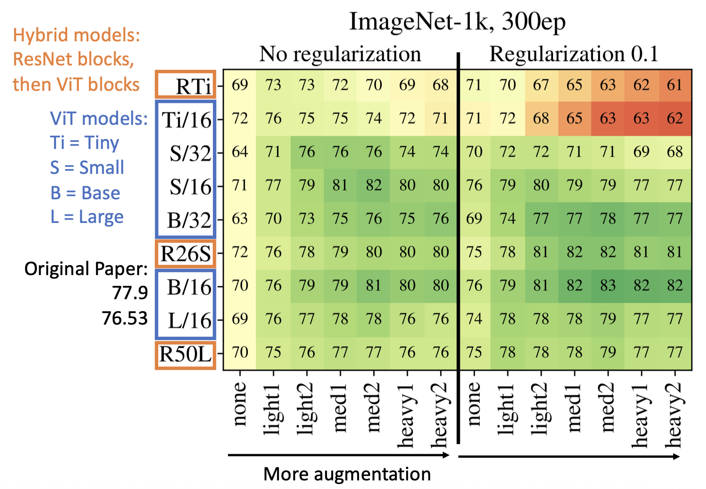
    

- **蒸馏**(distillation)
    - 步骤：
        1. 在图像和基准事实标注上训练一个**教师模型**(teacher model)
        2. 训练一个**学生模型**(student model)，匹配教师模型的预测结果（有时也要和基准事实标注匹配）

    

        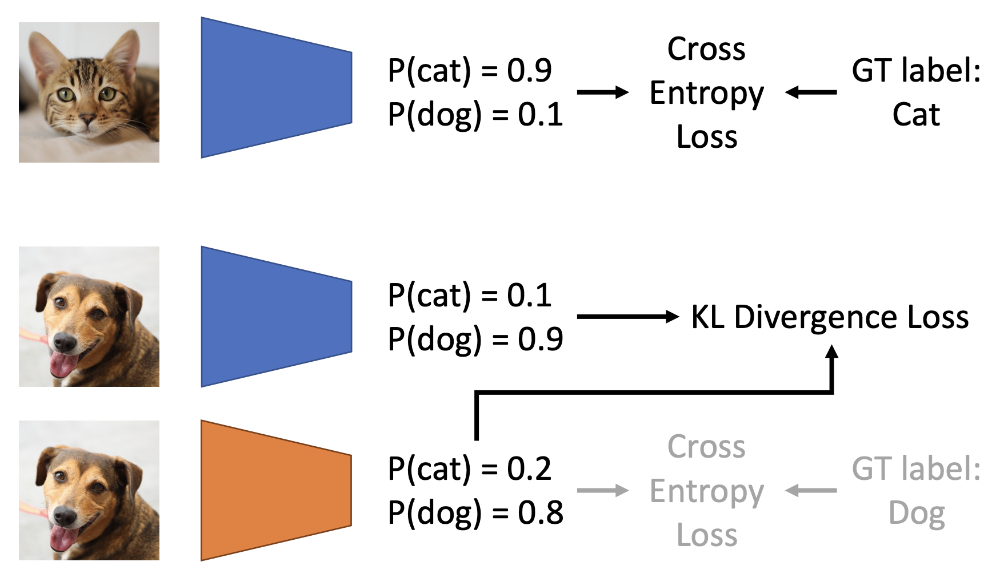
    

    - 相比从头训练一个学生模型表现更好（尤其在教师模型比学生模型更大的时候）
    - 也能在**无标注**数据上训练学生模型（半监督学习(semi-supervised learning)）
    - 更具体的步骤：
        1. 在图像和基准事实标注上训练一个**教师 CNN**
        2. 训练一个**学生 ViT**，匹配教师 CNN 的预测结果（并且和基准事实标注匹配）

    

        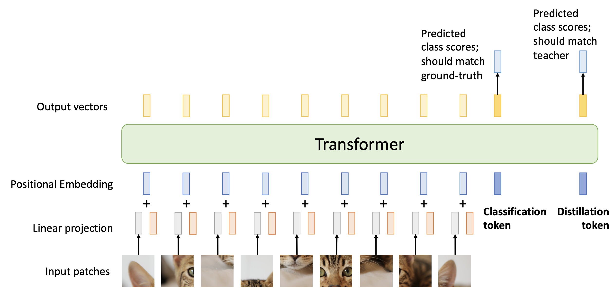
    

    - 结果对比：

        

            
        

???+ note "ViT vs CNN"

    

        
    

    - 在大多数卷积神经网络（包括 ResNets）中，随着网络的加深，分辨率降低，而通道数增加（层次结构）
        - 在图像中，物体可以以不同的尺度出现，因此这一特征很有用

    - 在 ViT 中，所有块具有相同的分辨率和通道数（各向同性架构）

    所以下面尝试构建一种分层的 ViT。

#### Hierarchical ViT: Swin Transformer

架构图如下：

    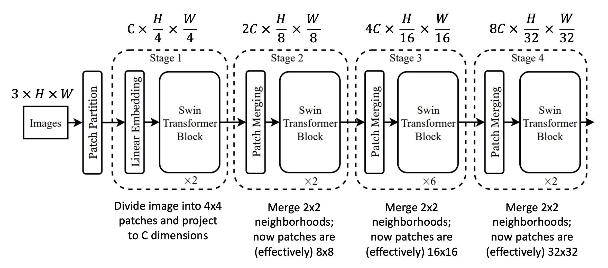

- 阶段1：将图像划分为 4x4 的块，并投影至 C 维
- 阶段2：合并 2x2 范围内的邻居，现在块大小变为 8x8

    

        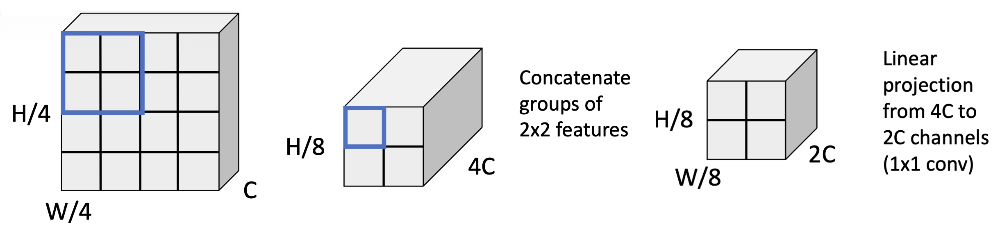
    

- 问题：224x224 图像，包含 56x56 的 4x4 块网格 -> 注意力矩阵有 56^4^ = 9.8M 个条目
    - 解决方案：不要使用完整的注意力，使用块上的注意力

{ align=right width=30% }

**窗口注意力**(window attention)：

- 对于 HxW 的 token 网格，每个注意力矩阵是 H^2^W^2^，与图像大小成**平方**关系
- 划分为 MxM 大小的 token **窗口**（M=4），仅在每个窗口内计算注意力，而不是让每个 token 关注所有其他 token
- 现在所有注意力矩阵的总大小为：M^4^ (H/M) (W/M) = M^2^HW
- 对于固定的 M，图像大小呈**线性**关系；在整个网络中，M=7
- 问题：token 只能与窗口内的其他 token 交互，窗口之间无法通信
- 解决方案：在连续的 Transformer 块中交替使用正常窗口和偏移窗口

    

        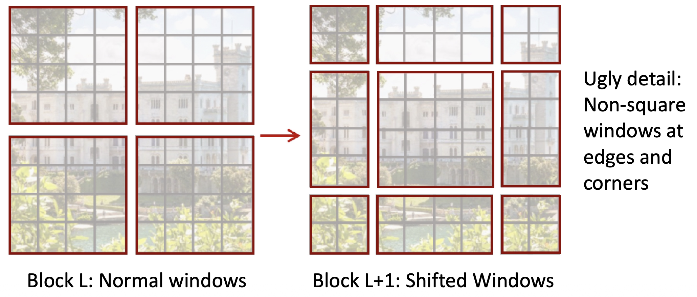
    

    - 细节：相对位置偏移(relative positional bias)
        - ViT 将位置嵌入向量添加到输入 token 中，编码图像中每个 token 的绝对位置；标准注意力：

            $$
            A = Softmax\left(\dfrac{QK^T}{\sqrt{D}}\right)V
            $$

            其中 $Q, K, V$：$M^2 \times D$

        - 而 Swin 不使用位置嵌入，而是在计算注意力时编码块之间的相对位置；带相对偏移的注意力：

            $$
            A = Softmax\left(\dfrac{QK^T}{\sqrt{D}} + B\right)V
            $$

            其中 $Q, K, V$：$M^2 \times D$，$B$：$M^2 \times M^2$

下面展示了 Swin Transformer 的速度和精度：

    

Swin Transformer 还可以作为目标检测、实例分割和语义分割的骨干网络。

??? info "其他分层的视觉 Transformers"

    

        
    

#### MLP-Mixer

有一种比自注意层更简单的混合输入 token 的方法是使用 **MLP**：

    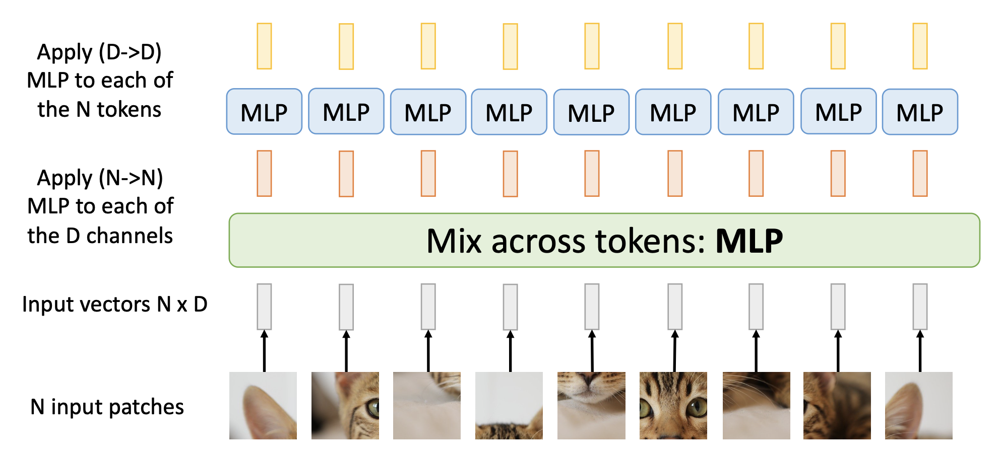

具体结构如下：

    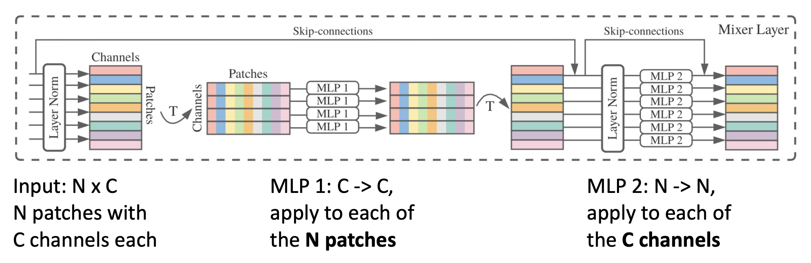

- MLP-Mixer 看起来就是一个古怪的 CNN
- 这是一种很酷的想法；但初始的 ImageNet 结果并不是很有说服力（不过通过 JFT 预训练会更好）

更多相关研究：

    

??? info "使用 Transformer 的目标检测：DETR"

    

        
    

### Tweaking Transformers

虽然 Transformer 的整体架构没有发生过太大的变化，但是有以下常见的一些小改动：

- 原来**层归一化**位于残差连接的外部；有点奇怪的是，模型实际上没法从恒等函数中学到东西
    - 解决方案：将层归一化移动到自注意和 MLP 之前，位于残差连接内部，这样使得训练更稳定

- **RMSNorm**：使用**均方根归一化**(root-mean-square normalization)替代测归一化
    - 输入：$x$【形状：$D$】，输出：$y$【形状：$D$】，权重：$\gamma$【形状：$D$】
    - $y_i = \dfrac{x_i}{RMS(x)} * \gamma_i$
    - $RMS(x) = \sqrt{\varepsilon + \dfrac{1}{N} \sum\limits_{i=1}^N x_i^2}$
    - 训练会变得稍微稳定些

- **SWiGLU MLP**
    - 输入：$X\ [N \times D]$
    - 权重：$W_1, W_2\ [D \times H], W_3\ [H \times D]$
    - 输出：$Y = (\sigma(XW_1) \odot XW_2) W_3$
    - 设置 $H = \dfrac{8D}{3}$ 保持相同的总参数量

- **专家混合**(mixture of experts, MoE)
    - 每个块中学习 E 个独立的 MLP 权重；每个 MLP 是一个**专家**
    - 权重 $W_1, W_2$ 的规模分别变成了 [E x D x 4D] 和 [E x 4D x D]
    - 每个 token 被路由到 A < E 的专家，这些是活跃的专家
    - 参数增加了 E，但计算仅增加了 A
    - 今天所有最大的LLM（例如：GPT-4o、GPT-4.5、Claude 3.7、Gemini 2.5 Pro 等）几乎可以肯定使用了 MoE，并且参数超过1T，但它们没有公开细节