# Recognition

## Semantic Segmentation

**语义分割**(semantic segmentation)描述的是这样一个问题：

    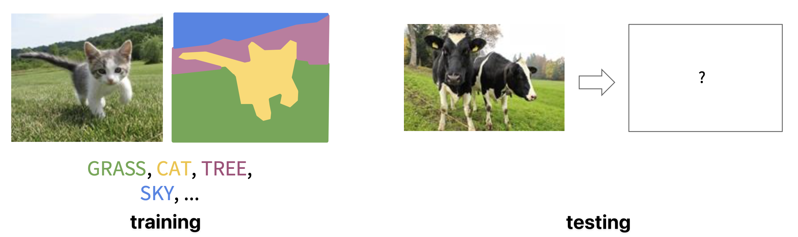

- 成对的训练数据：对于每张训练图像，为每个像素标注一种语义类别(semantic category)
- 测试时，对图像的每个像素分类
- 不区分实例，只关心像素

实现途径：

- 滑动窗口(sliding window)
    - 效率太低，无法在重叠块之间复用共享的特征
    - 有限的感受野

    

        
    

- 卷积：

    

        
    

    - 一种直观的思路：使用卷积网络编码整张图像，然后在结果上做语义分割
    - 问题：分类架构通常通过减少特征空间大小来加深层次，但语义分割需要输出大小与输入大小相同

- 全卷积网络(fully convolutional network)

    

        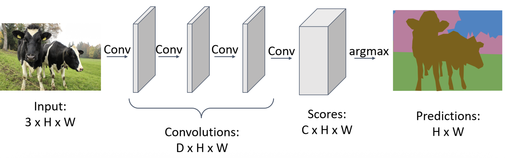
    

    - 设计一个仅包含卷积层的网络，不使用降采样操作，以便一次性对所有像素进行预测
    - 训练用的损失函数是逐像素的交叉熵
    - 感受野和卷积层数量呈线性关系
    - 问题：高分辨率的卷积成本也很高

- 解决方案：将网络设计为一组卷积层，内部包含降采样和升采样

    

        
    

    - **降采样**(downsampling)：**池化**(pooling)、**步长卷积**(strided conv)
    - **升采样**(upsampling)：
        - **反池化**(unpooling)
            - **钉床**(bed of nails)

                

                    
                

            - **最近邻居**(nearest neighbors)

                

                    
                

        - **最大反池化**(max unpooling)

            

                
            

        - **双线性插值**(bilinear interpolation)

            

                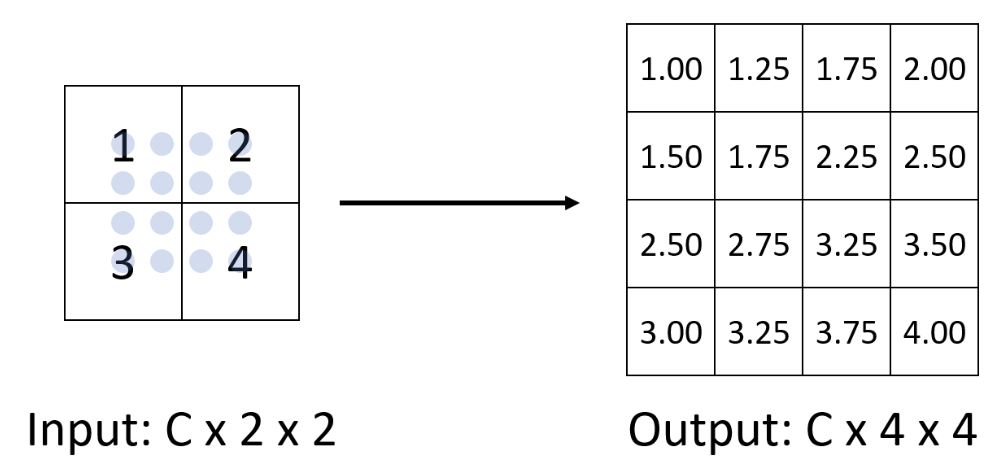
            

        - **双三次插值**(bicubic interpolation)

            

                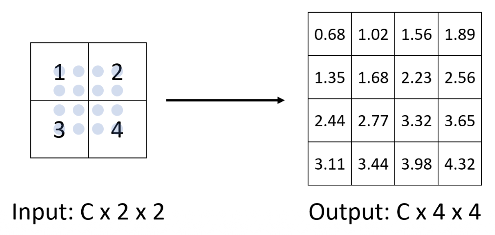
            

        - **可学习的反池化**(leanable unpooling)——**转置卷积**(transposed convolution)：反池化后的卷积

            

                
            

            

                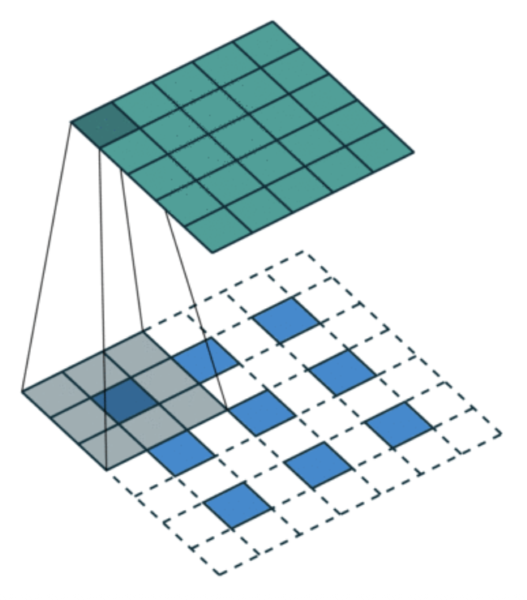
            

- **U-Net**：跳过降采样和升采样阶段之间的连接

    

        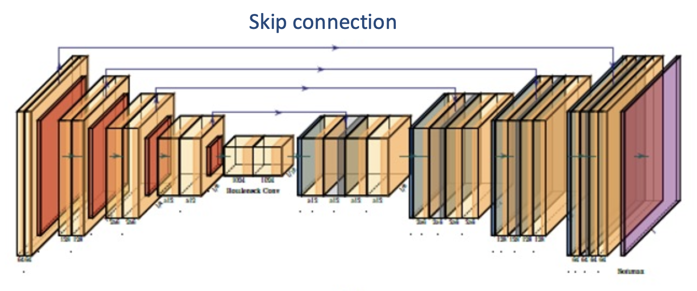
    

    === "降采样阶段"

        

            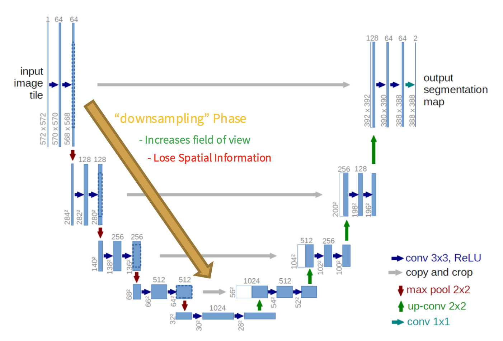
        

    === "升采样阶段"

        

            
        

    === "拼接特征图"

        

            
        

- **DeepLab**：FCN + CRF（条件随机场(conditional random field)）

    

        
    

    - 条件随机场：
        - 能量函数：$E(\boldsymbol{x})=\sum_i\theta_i(x_i)+\sum_{ij}\theta_{ij}(x_i,x_j)$
        - 一元势能：$\theta_i(x_i)=-\log P(x_i)$，其中 $P(x_i)$ 是网络给出的分数映射
        - 成对势能：

            $$
            \begin{aligned}
            \theta_{i, j}(x_i, x_j) & = \mu(x_i, x_j) \bigg[w_1 \exp \left(-\dfrac{\|p_i - p_j\|^2}{2\sigma_\alpha^2} - \dfrac{\|I_i - I_j\|^2}{2\sigma_\beta^2}\right) \\
            & + w_2 \exp\left(-\dfrac{\|p_i - p_j\|^2}{2 \sigma_\gamma^2}\right)\bigg] \\
            & \text{where } \mu(x_i, x_j) = 1 \text{ if } x_i \ne x_j, \text{and zero otherwise}
            \end{aligned}
            $$

    - 效果：

        

            
        

- 评估指标：**逐像素交并比**(per-pixel intersection-over-union(IoU))

    

        
    

## Object Detection

{ align=right width=30% }

**目标检测**(object detection)：

- 输入：单张 RGB 图像
- 输出：一组表示目标的**包围盒**(bounding box, bbox)

包围盒包含以下信息：

- 类别标签
- 位置（x, y）
- 大小（w, h）

???+ info "包围盒"

    

        
    

    

        
    

    使用**交并比**(intersection over union, IoU)，将预测结果和基准事实框做比较。

    

        
    

挑战：

- **多个输出**：需要每张图像输出可变数量的目标
- **多种类型的输出**：需要预测“是什么”（类别标签）以及“在哪里”（包围盒）
- **大图像**：分类可以在 224x224 的分辨率下进行，但检测需要更高的分辨率，通常在 800x600 左右

检测单个目标（分类(classification) + 定位(localization)）：

    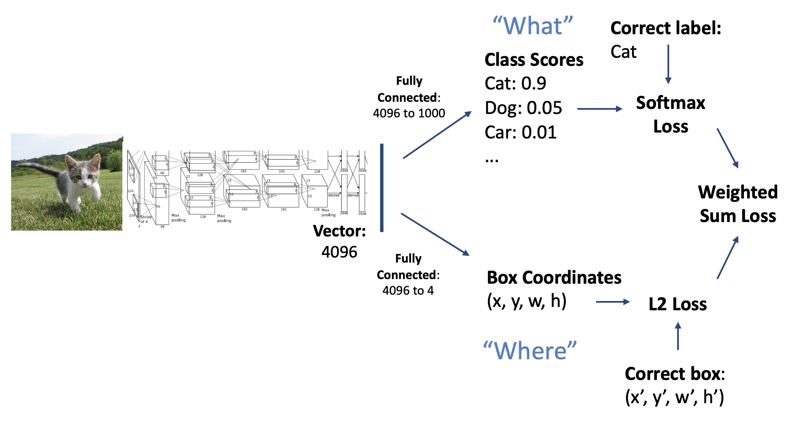

- 将定位看作回归(regression)问题
- 问题：图像可能有不止一个目标

    

        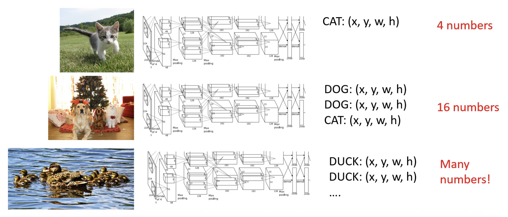
    

实现方法：

- **滑动窗口**：将 CNN 应用于图像的许多不同部分，CNN 将每个部分分类为目标或背景

    ??? example "例子"

        === "背景"

            

                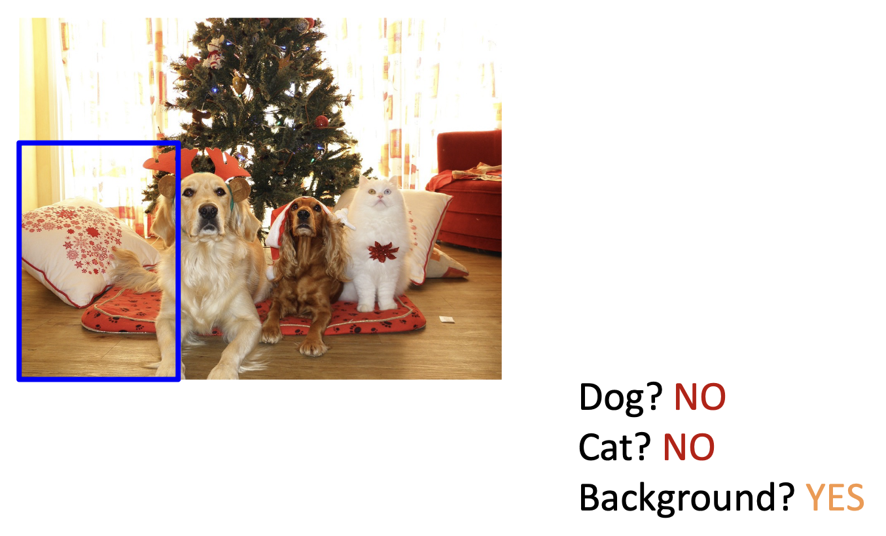
            

        === "狗"

            

                
            

        === "猫"

            

                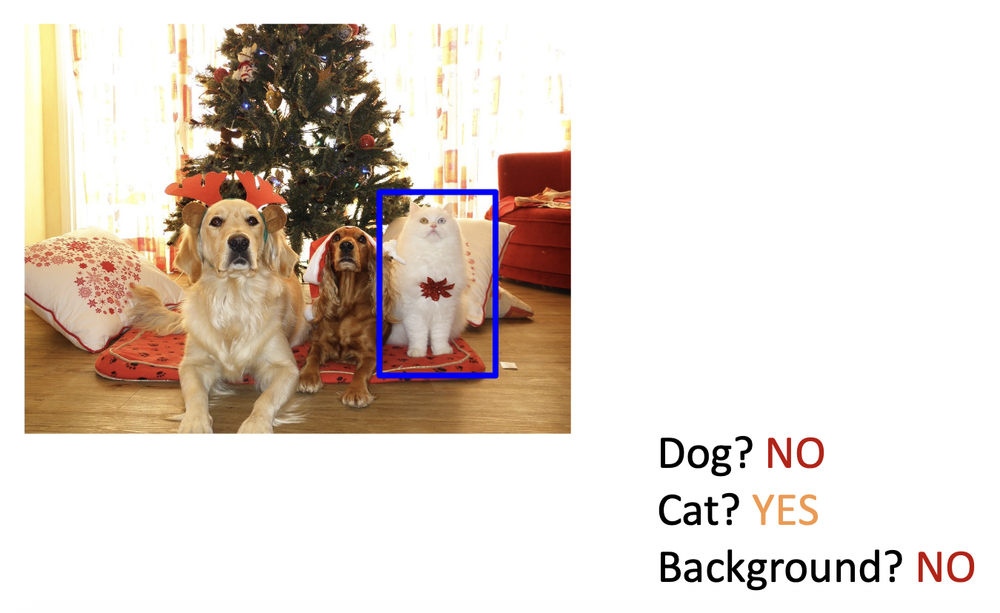
            

    - 问题：需要将 CNN 应用于大量位置、尺度和宽高比，计算成本非常高

        

            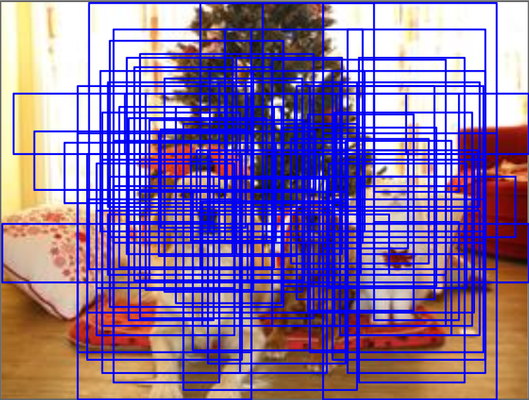
        

        - 假如包框大小为 h * w
            - 可能的 x 位置：W - w + 1
            - 可能的 y 位置：H - h + 1
            - 可能的位置：(W - w + 1) * (H - h + 1)
        - 所以对于一张 800x600 的图像，包框大小约为 58MB，成本太高，这样我们就没法评估所有目标了

- **区域建议**(region proposal)：寻找一组可能可以包含所有目标的小的包框
    - 通常基于启发式(heuristics)，比如根据分割
    - 运行速度相对更快，比如通过选择性搜索，在 CPU 上花几秒钟就能给出 2000 个区域建议

    

        
    

- **R-CNN**（基于区域的(region-based) CNN）

    === "Step 1"

        

            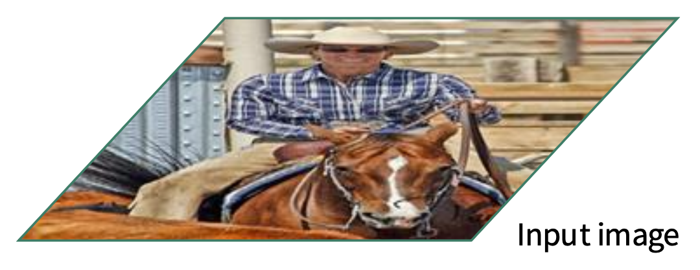
        

    === "Step 2"

        

            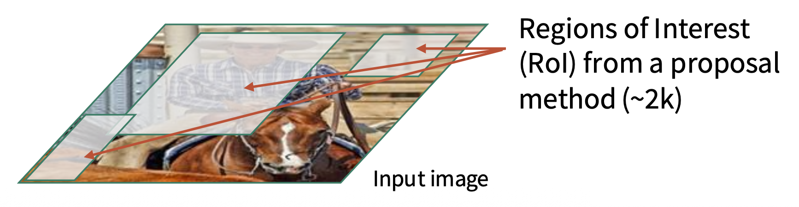
        

    === "Step 3"

        

            
        

    === "Step 4"

        

            
        

    === "Step 5"

        

            
        

    === "Step 6"

        

            
        

    - 问题：非常慢，每张图像需要大约 2000 次的独立的前向传递
    - 解决思路：在裁剪之前通过 CNN 传递图像，这样传递的就是裁剪了的卷积特征

    ???+ note "**框回归**(box regression)"

        - 考虑一个区域建议，其中心为 $(p_x, p_y)$，宽为 $p_w$，高为 $p_h$
        - 模型预测一个变换 $(t_x, t_y, t_w, t_h)$ 来纠正区域建议

        { align=right width=30% }

        - 输出框的定义为：
            - 根据建议大小相对地移动中心
                - $\textcolor{orange}{b_x} = \textcolor{cornflowerblue}{p_x} + \textcolor{cornflowerblue}{p_w}\textcolor{green}{t_x}$
                - $\textcolor{orange}{b_y} = \textcolor{cornflowerblue}{p_y} + \textcolor{cornflowerblue}{p_h}\textcolor{green}{t_y}$

            - 尺度建议；$\exp$ 确保缩放因子 $> 0$
                - $\textcolor{orange}{b_w} = \textcolor{cornflowerblue}{p_w} \exp(\textcolor{green}{t_w})$
                - $\textcolor{orange}{b_h} = \textcolor{cornflowerblue}{p_h} \exp(\textcolor{green}{t_h})$

        - 当变换 = 0 时，输出 = 建议
        - L2 正则化鼓励不让建议发生改变
        - **尺度/平移不变性**(scale/translation invariance)：变换编码了提议和输出之间的**相对**差异；这很重要，因为卷积神经网络在裁剪后无法看到绝对大小或位置。
        - 给定建议和目标输出，我们可以求解网络应输出的变换：
            - $\textcolor{green}{t_x} = (\textcolor{orange}{b_x} - \textcolor{cornflowerblue}{p_x})/\textcolor{cornflowerblue}{p_w}$
            - $\textcolor{green}{t_y} = (\textcolor{orange}{b_y} - \textcolor{cornflowerblue}{p_y})/\textcolor{cornflowerblue}{p_h}$
            - $\textcolor{green}{t_w} = \log(\textcolor{orange}{b_w}/\textcolor{cornflowerblue}{p_w})$
            - $\textcolor{green}{t_h} = \log(\textcolor{orange}{b_h}/\textcolor{cornflowerblue}{p_h})$

    - 训练：

        

            
        

    - 测试：

        

            
        

    ???+ note "**非极大值抑制**(non-max suppression, NMS)"

        - 目标检测器通常会输出很多重叠的检测
        - 步骤：
            1. 选择分数最高的包框
            2. 使用 IoU > 阈值来去除最低分数的包框
            3. 如果还有剩余的包框，回到第 1 步

        ??? example "例子"

            === "去除第 1 个目标的多余包框"

                

                    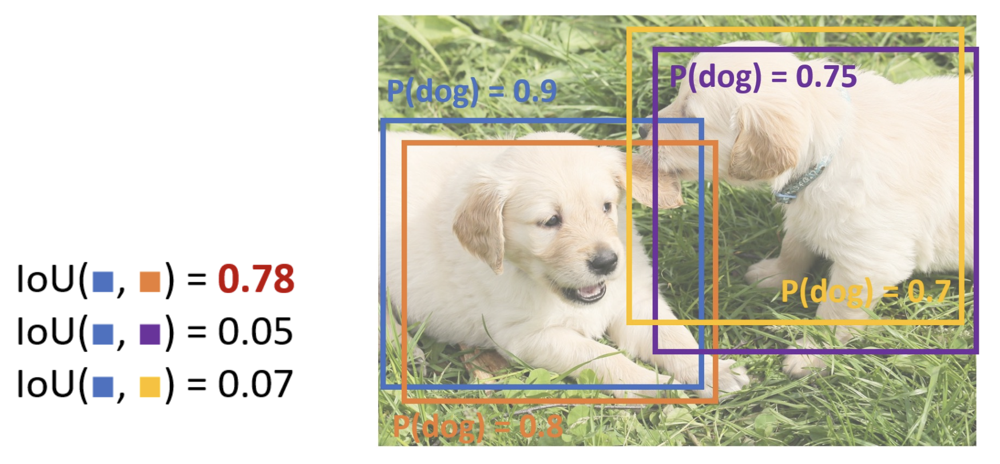
                

            === "去除第 2 个目标的多余包框"

                

                    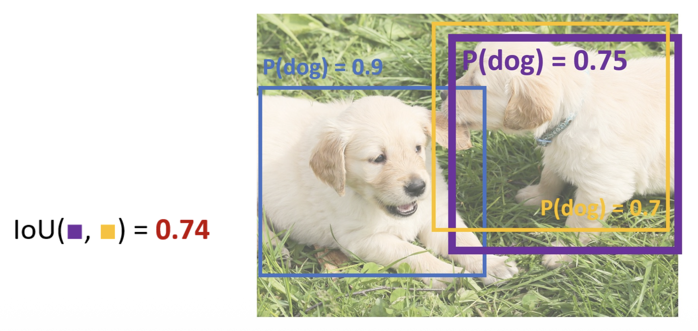
                

            === "结果"

                

                    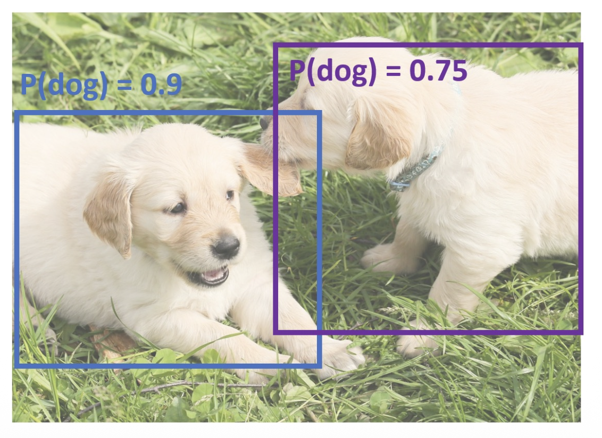
                

        !!! bug "问题：NMS 可能在目标高度重叠时消除“好”的框（目前没有好的解决方案）"

    ??? info "评估目标检测器：平均精度均值(mean average precision, mAP)"

        1. 在所有测试图像上运行目标检测器（带 NMS）
        2. 对于每个类别，计算平均精度（AP）= 精确度与召回率曲线下的面积
            1. 对于每个检测（从最高分数到最低分数）
                1. 如果它与某些 GT 框匹配且 loU > 0.5，将其标记为正例并消除 GT
                2. 否则将其标记为负例
                3. 在 PR 曲线上绘制一个点

                

                    
                    
                

            2. 平均精度（AP）= PR曲线下的面积

                

                    
                

        3. 均值平均精度（mAP）= 每个类别的AP平均值
        4. 对于 COCO mAP：计算每个 loU 的 mAP @thresh 阈值 (0.5，0.55，0.6，...，0.95) 并取平均值

- **快速 R-CNN**

    

        
    

    - 其中对图像特征的裁剪和调整大小一步被称为 Rol 池化

- **更快的 R-CNN**：使用 CNN 选择建议

    

        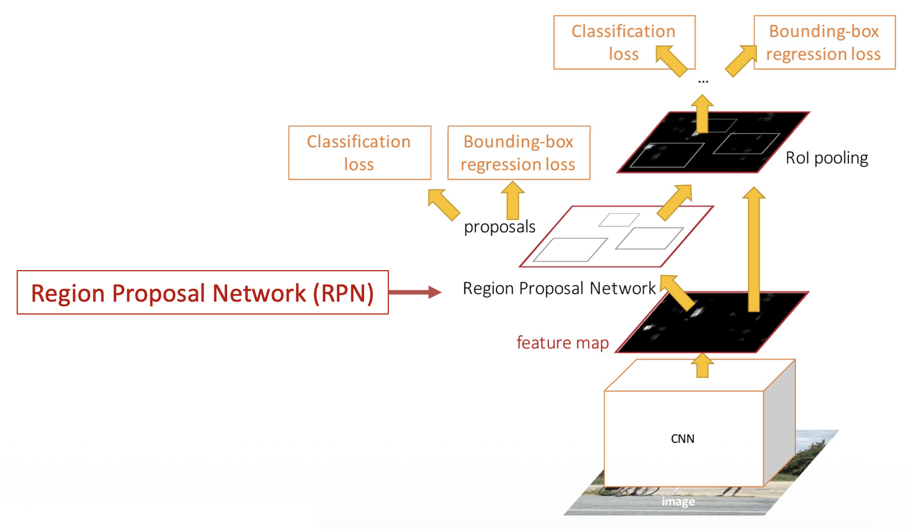
    

    - **RPN**（区域建议网络(region proposal network)）：
        - 在特征图的每个点上都有一个固定大小的**锚框**(anchor box)

            

                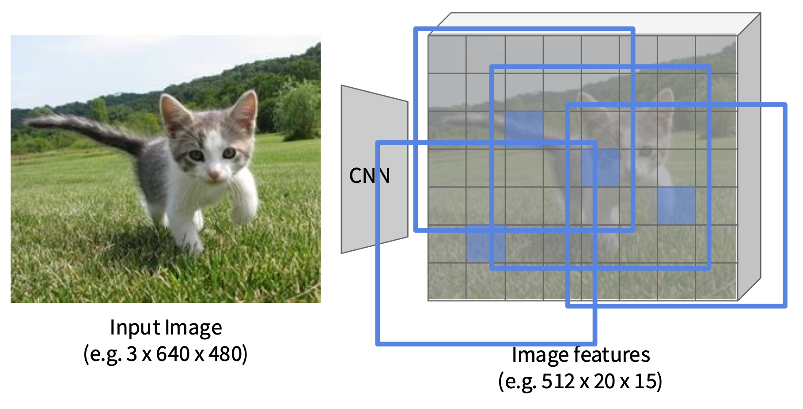
            

        - 在每一个点上预测相应的锚框是否包含一个目标（二元分类）

            

                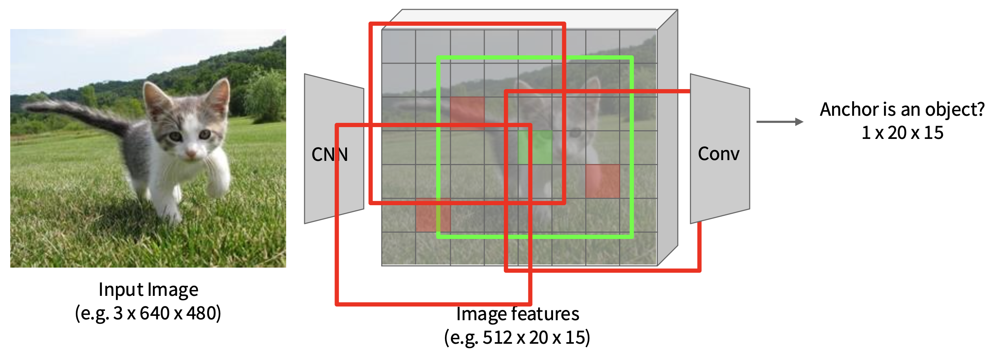
            

        - 对于每个正框，还要预测从锚框到基准事实框的修正（每个像素回归 4 个数字）

            

                
            

        - 在实际应用中，每个点使用 K 个不同大小/比例的锚框

            

                
            

        - 按“目标性(objectness)”分数对 K\*20\*15 个盒子进行排序，取前大约 300 个作为建议

    - 可学习的区域建议

        

            
        

    - 两阶段目标检测器
        - 第一阶段：每张图像运行一次
            - 骨干网络(backbone network)
            - RPN

        - 第二阶段：每个区域运行一次
            - 裁剪特征：Rol 池化 / 对齐
            - 预测目标类别
            - 预测包框偏移量

    - 单阶段目标检测：包括 YOLO / SSD / RetinaNet

        

            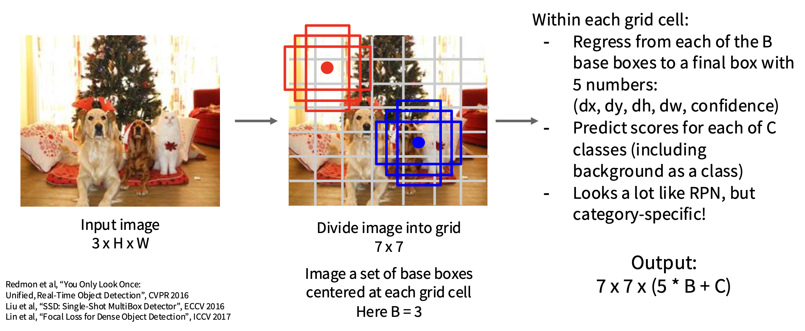
        

        - 例子：**YOLO**(You Only Look Once) 实时对象检测

            

                
            

            对于每个输出框：

            - P(object)：该框包含对象的概率
            - B：包围盒 (x, y, h, w)（图中 B = 2）
            - P(class)：属于该类别的概率

            

                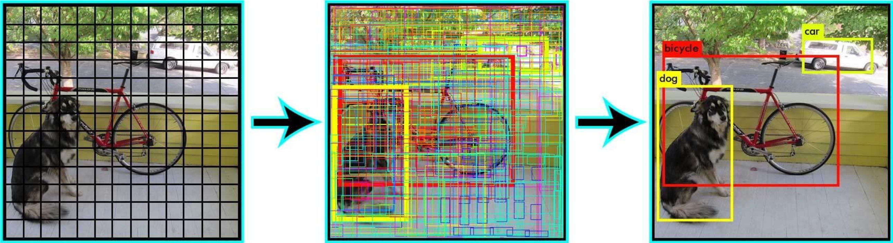
            

    - 两阶段 vs 单阶段
        - 两阶段更准确
        - 单阶段更快

- 使用 Transformer 的目标检测：**DETR**
    - 简单目标检测流程：直接从 Transformer 输出一组框
    - 没有锚框，没有框变换的回归
    - 通过二分图匹配(bipartite matching)将预测框与 GT 框匹配；训练回归框坐标

    

        
    

## Instance Segmentation

**实例分割**(instance segmentation)的思路：

- 检测图像上的所有目标，识别出属于各目标的像素
- 执行目标检测，然后为每个目标预测一个分割掩码(segmentation mask)

    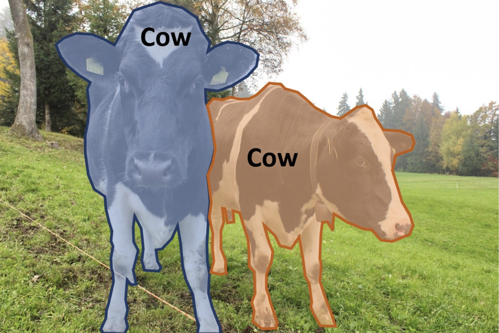

实现方法：

- **掩码 R-CNN**

    

        
    

    

        
    

    - 样例掩码训练目标：

        

            
        

    - 可以看到效果非常好：

        

            
        

- 深蛇(deep snake)：利用轮廓(contours)

    

        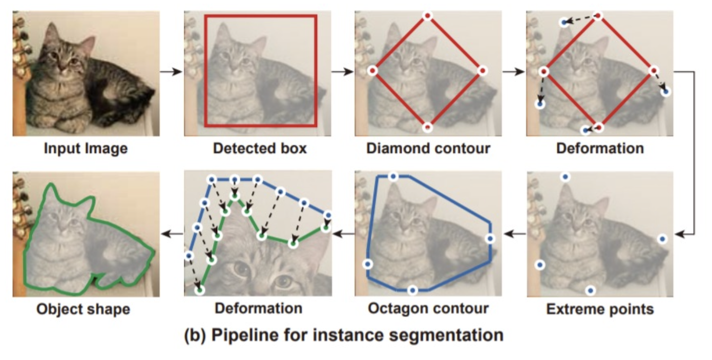
    

---
**全景分割**(panoptic segmentation)

- 标注图像中所有像素（包括事物和物品）
- 对于“事物”类别，也分别标注实例

    

效果：

    

---
数据集：Microsoft COCO

- 118K 训练数据
- 5K 验证数据
- 包含了：目标检测、关键点、实例分割、全景分割

    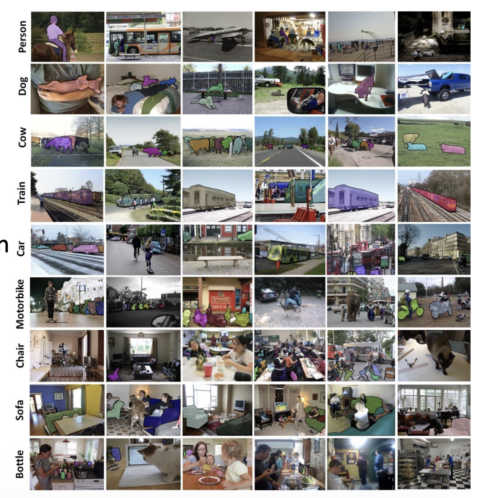

## Human Pose Estimation

**人体姿态估计**(human pose estimation)：通过定位一组**关键点**(keypoints)来表示人体姿态。比如可以采用以下 17 个关键点：

{ align=right width=25% }

- 鼻子
- 左/右眼
- 左/右耳
- 左/右肩
- 左/右肘
- 左/右腕(wrist)
- 左/右髋(hip)
- 左/右膝
- 左/右踝(ankle)

使用深度传感器进行人体姿态估计：

    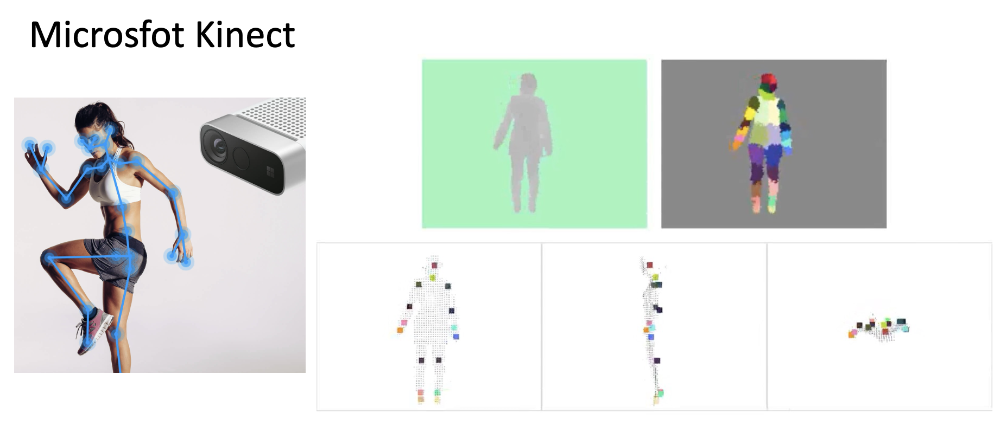

如果只有一个人，可以直接预测关节位置（一个 17*2 的向量）

    

使用热图表示关节位置：

    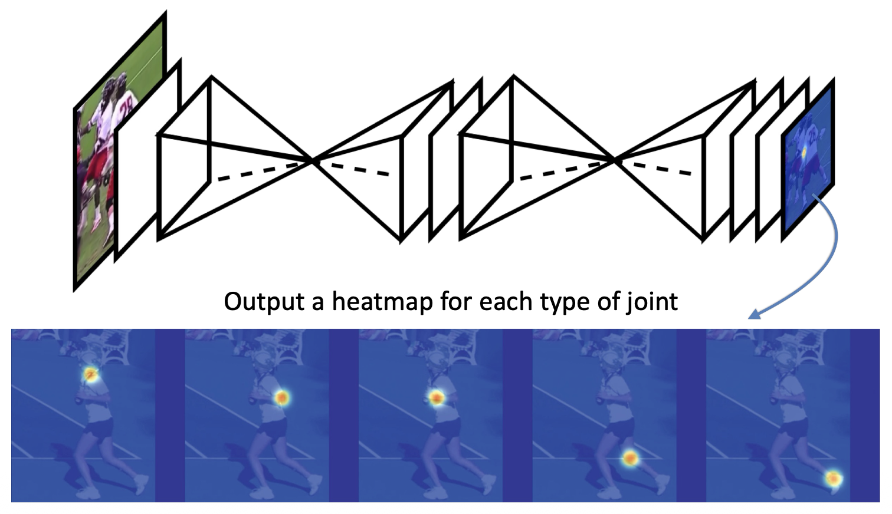

如果有多个人，我们有以下两种方案：

- 自顶向下：
    - 检测每个包框内的人体和关键点（**更精确**）
    - 例子：**掩码 R-CNN**

        

            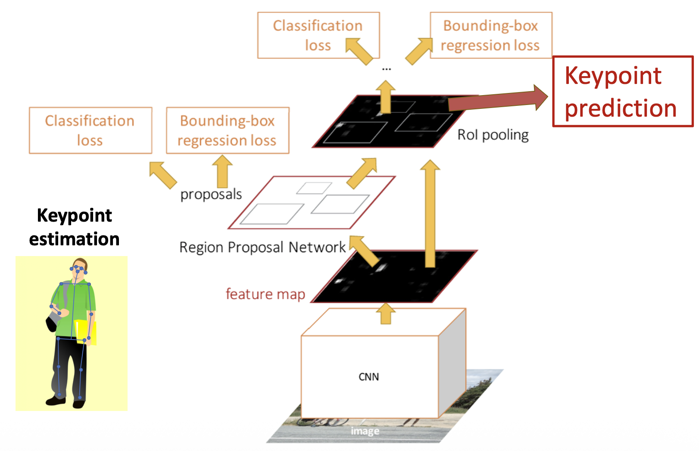
        

        - 具体过程：

            

                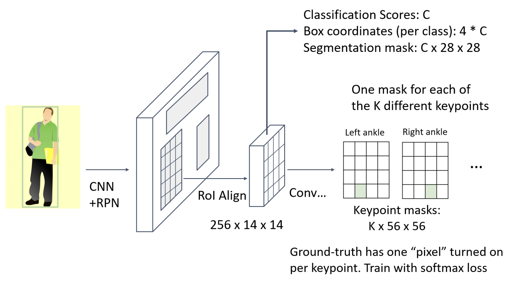
            

        - 效果：

            

                
            

- 自底向上
    - 检测关键点和组关键点来构成人体（**更快**）
    - 例子：**OpenPose**
        - 基于部分亲和域(part affinity field)连接部分

            

                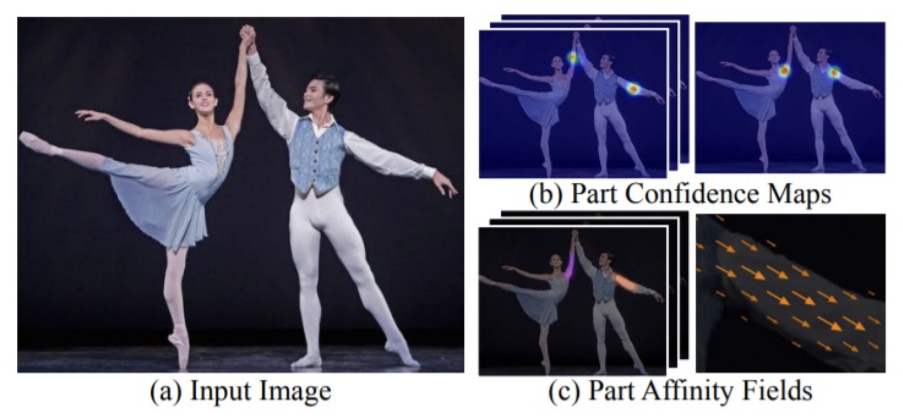
            

            

                
            

        - 效果（视频链接：<https://www.youtube.com/watch?v=mxKlUO_tjcg>）：

            

                
            

## Other Tasks

- **光流**(optical flow)

    

        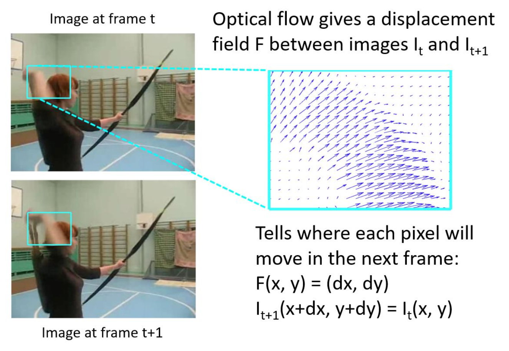
    

    - 方法：
        - 直接通过拼接两张图像来预测流？
            - 不可行！无法使用梯度优化让网络学习这种映射

            

                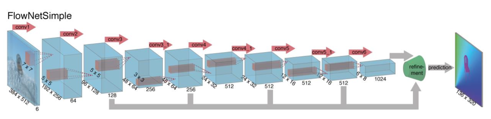
            

        - 将经典方法整合到网络中
            - 通过比较局部补丁来估计流动
            - 从**成本体积**(cost volume)中估计流动

            

                
            

        - **RAFT**：SOTA 方法，从粗到细的成本体积中迭代估计流动

            

                
            

- **视频分类**(video classification)

    

        
    

    - 3D CNNs

        

            
        

    - **时间动作定位**(temporal action localization)：给定一个未修剪的长视频序列，识别对应于不同动作的帧，生成建议后再分类

        

            
        

    - **时空检测**(spatial-temporal detection)：给定一段未剪辑的长视频，检测所有人在时间和空间中的活动，并对他们所进行的活动进行分类

        

            
        

- **多目标追踪**(multi-object tracking)：识别和追踪属于一个或多个类别的目标，无需事先了解目标的外观和数量

    

        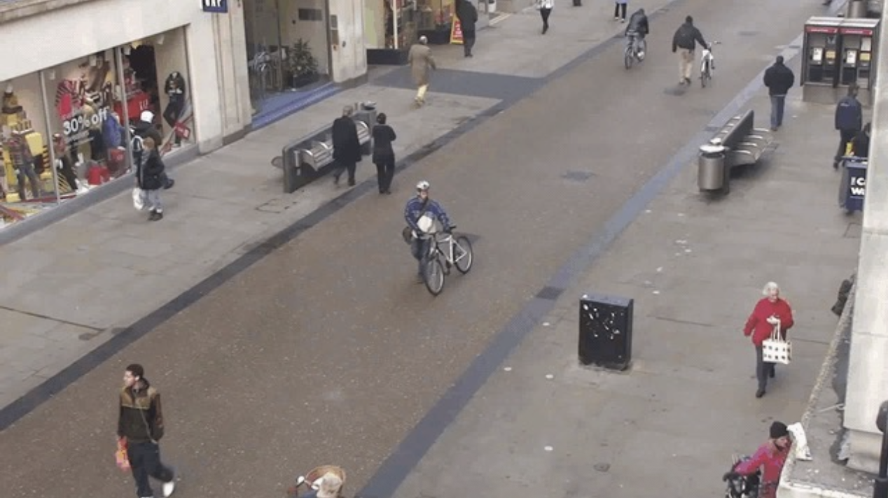
    
