# Video Understanding

视频 = 2D 图像 * 时间

    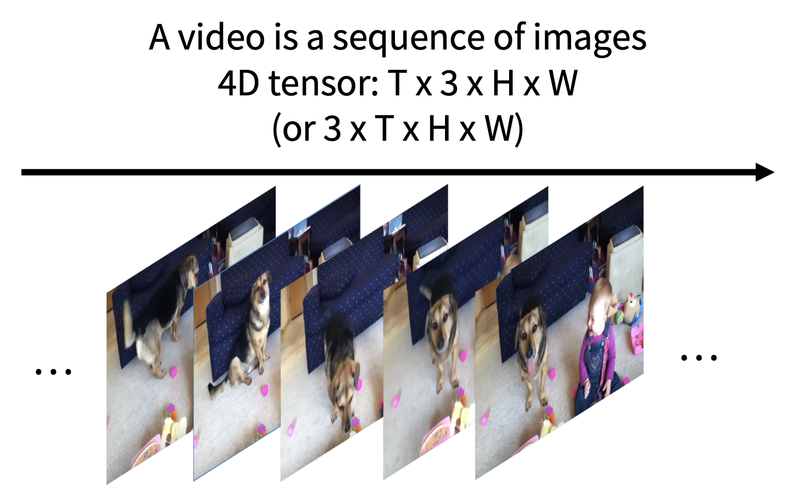

## Video Classification

视频分类任务与图像分类类似，但目标是识别视频中的**行动**(action)。

    

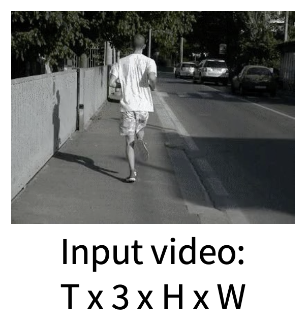{ align=right width=20% }

要完成这项任务，就不得不要解决一个问题：视频数据比图像大得多！

- 一般视频每秒约 30 帧（fps）
- 未压缩的视频大小
    - SD（标清，640 x 480）：每分钟约 1.5 GB
    - HD（高清，1920 x 1080）：每分钟约 10 GB

- 解决方案：在**短片段**(short clips)上训练：低帧率、低空间分辨率
    - 例如：T=16, H=W=112（5fps 下 3.2s, 588 KB）
    - 原始视频：时间长，FPS 大

        

            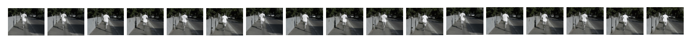
        

    - 训练阶段：训练能够在低帧率的短片段上分类

        

            
        

    - 测试阶段：在不同片段上运行模型，计算预测的平均值

        

            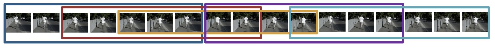
        

具体的视频分类技术包括：

- **单帧 CNN**(single-frame CNN)
    - 训练一个普通的 2D CNN，用于独立地对视频帧分类
    - 测试时计算预测概率的平均值
    - 通常作为一个非常强的视频分类模型的基准

    

        
    

- **晚期融合**(late fusion)
    - 直觉：获取每帧的高层次外观，并将它们结合起来
    - 使用 **FC 层**：在每个帧上运行 2D CNN，然后连接特征，并输入到 MLP 中

        

            
        

    - 使用**池化**(pooling)：在每个帧上运行 2D CNN，然后池化特征，并输入到线性层中
        - 问题：难以比较帧之间的低层级运动

        

            
        

- **早期融合**(early fusion)
    - 直觉：与第一个卷积层比较，之后用正常的 2D CNN
    - 第一个卷积层压缩所有的时间信息
        - 输入：3T x H x W
        - 输出：D x H x W
    
    - 剩余的网络是标准的 2D CNN
    - 问题：只用一层处理时间信息可能不太够

    

        
    

- **3D CNN**
    - 直觉：使用卷积和池化的 3D 版本，在网络过程中缓慢融合时间信息
    - 网络的每一层是一个 4D 张量（D x T x H x W）

    

        
    

    - 3D 卷积

        

            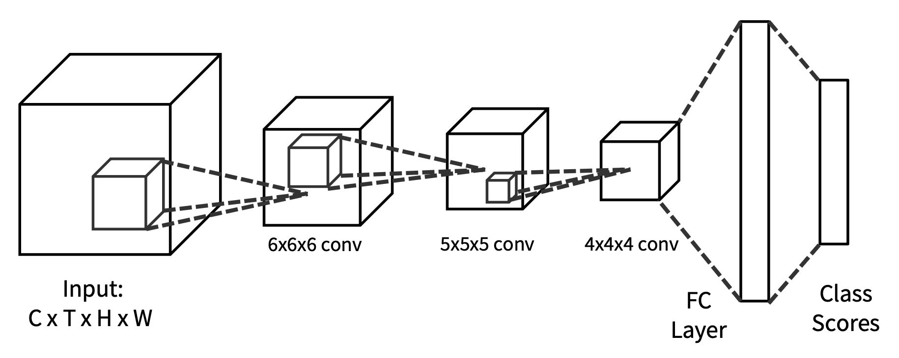
        

???+ abstract "后三种方法的比较"

    === "晚期融合"

        空间上构建慢，在时间快结束的最后一次性完成

        

            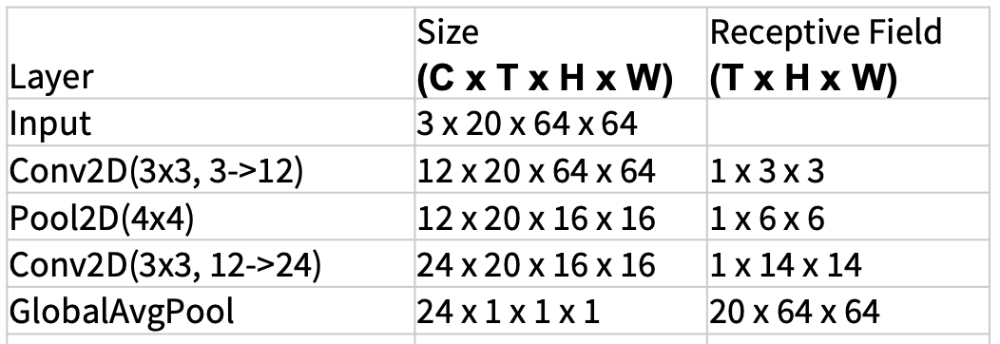
        

    === "早期融合"

        空间上构建慢，在时间一开始一次性完成

        

            
        

    === "3D CNN"

        在时间和空间上构建都很慢——“慢融合(slow fusion)”

        

            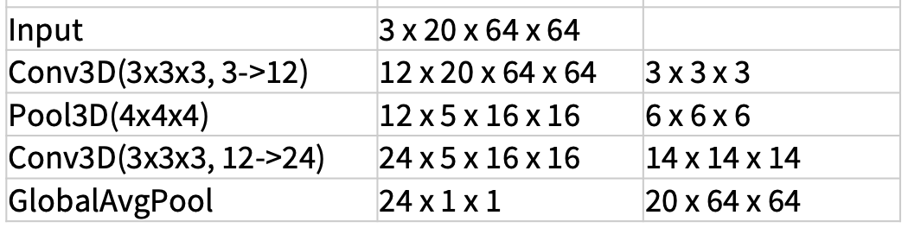
        

???+ note "进一步比较早期融合与 3D CNN"

    === "2D 卷积（早期融合）"

        

            
        

        - 没有时间平移不变性，需要学习不同时间下相同运动的独立滤波器

    === "3D 卷积（3D CNN）"

        

            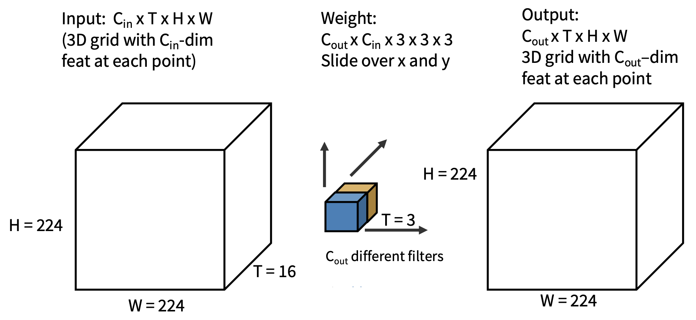
        

        - 具有时间平移不变性，因为每个滤波器随时间滑动
        - 第一层滤波器的形状为 3（RGB）x 4（帧）x 5 x 5（空间），可用于可视化视频片段

样例视频数据集：**Sport-1M**

    

上述方法在这个数据集上的表现：

    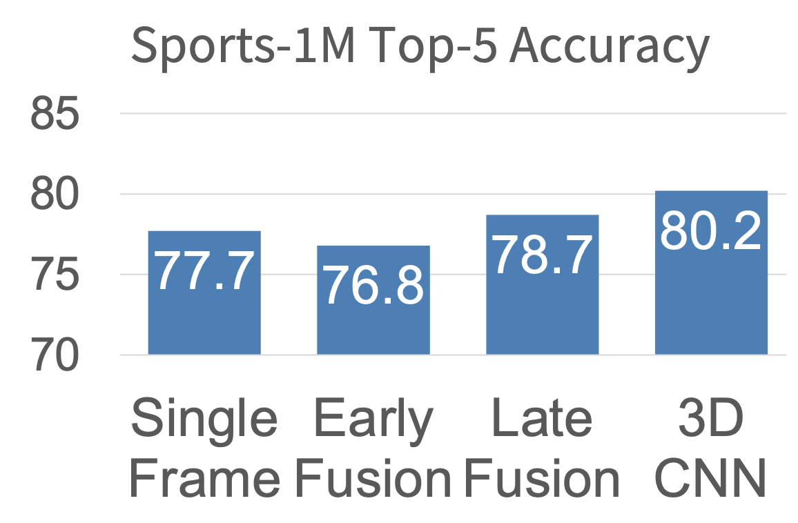

- 单帧模型表现不错，总是最先尝试
- 自从 2014 年开始，3D CNN 的表现已经提升了很多

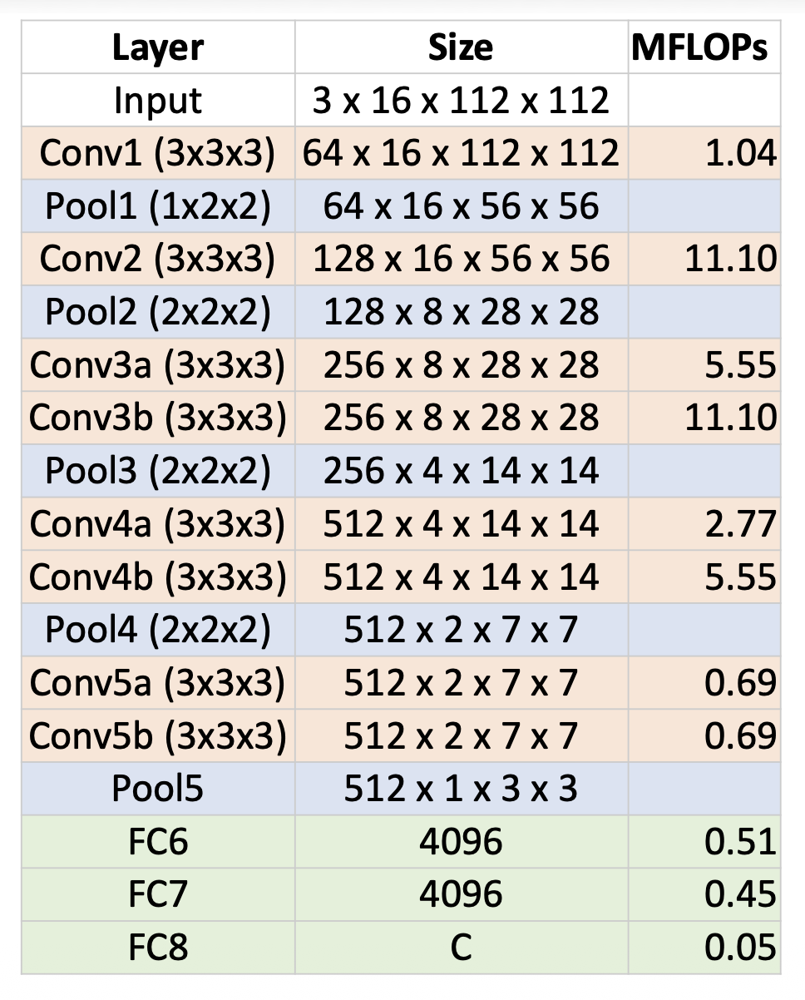{ align=right width=25% }

一种更先进的方法是 **C3D**，它是 3D CNNs 的 VGG

- 3D CNN，所有卷积和池化的规模分别为 3x3x3 和 2x2x2（除 Pool1 为 1x2x2 外）
- 发布在 Sports-1M 上的预训练模型；许多人将其用作视频特征提取器
- 问题：3x3x3 卷积成本很高，对比其他成本
    - AlexNet：0.7 GFLOP
    - VGG-16：13.6 GFLOP
    - C3D：39.5 GFLOP（是 VGG 的 2.9 倍！）

- 表现超过之前4种方法（~~力大砖飞~~）

    

        
    

## Measuring Motion: Optical Flow

我们可以仅使用运动信息轻松识别动作。

对机器而言，测量运动需要利用**光流**(optical flow)完成。

- 光流提供了图像 $I_t$ 和 $I_{t+1}$ 之间的位移场 $F$
- 告诉每个像素在下一帧将移动到何处：

    $$
    \begin{aligned}
    F(x, y) & = (dx, dy) \\ 
    I_{t+1}(x+dx, y+dy) & = I_t(x, y)
    \end{aligned}
    $$

- 光流强调了局部运动

    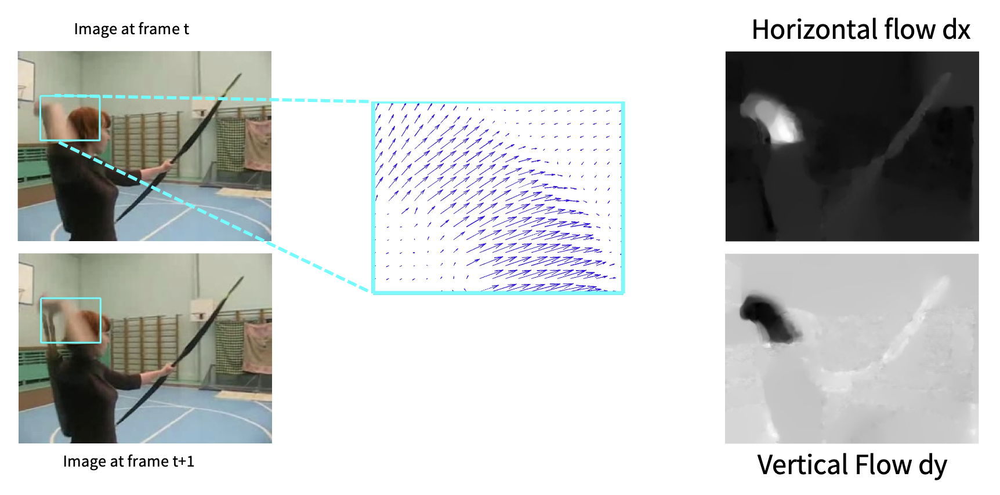

## Separating Motion and Appearance: Two-Stream Networks

    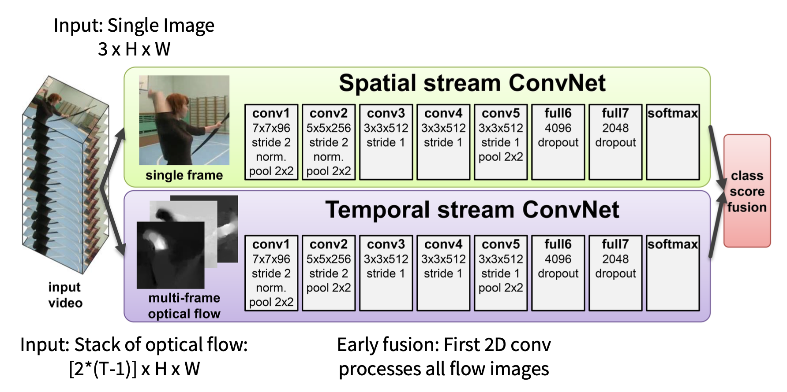

效果比前面介绍的方法都要好：

    

## Modeling Long-Term Temporal Structure

到目前为止，所有的时序 CNNs 仅对非常短的片段（约 2-5 秒）中的帧之间的局部运动进行建模，那么如何处理长视频呢？

    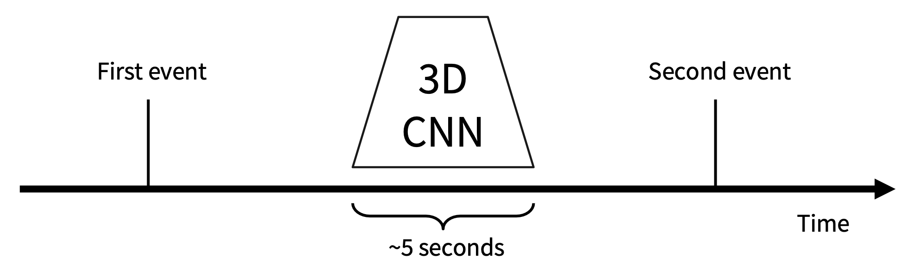

我们把长视频看成一个序列，那么很自然地就会想到用 **RNN** 来处理这个问题，那就来试试看吧！

- 先通过（2D / 3D）CNN 提取特征
- 使用 RNN 处理局部特征
- **多对一**：每个视频只有一个输出；或者**多对多**：每个视频帧都有一个输出
- 有时不要在 CNN 上使用反向传播，以节省内存
- 预训练，将其作为特征提取器

    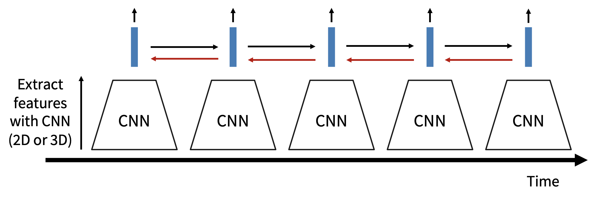

- **CNN** 内部：每个值都是关于固定时间窗口（**局部**时间结构）的函数
- **RNN** 内部：每个向量都是关于所有先前向量的函数（**全局**时间结构）

### Spatio-Temporal Self-Attention

我们可以采用和多层 RNN 类似的想法来改进处理视频的结构——于是我们得到了一个叫做**递归卷积网络**(recurrent convolutional network)的东西！

    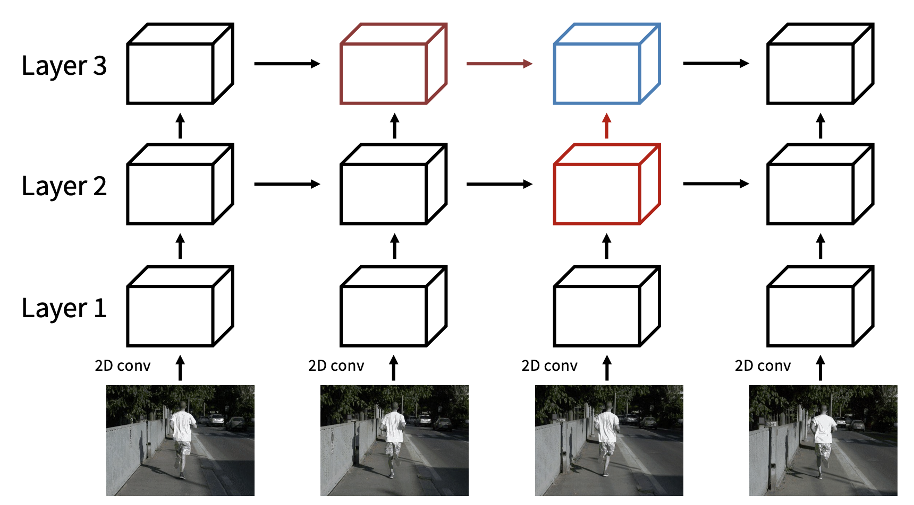

- 整个网络使用 2D 特征图（规模为 CxHxW）
- 每个部分依赖两个输入：来自同层的前一个时间步的输出，以及前一层在相同时间步的输出

    

        
    

    - 使用 2D 卷积替代所有的矩阵乘法

- 每层采用不同权重，跨时间共享权重

我们成功结合了 CNN 和 RNN 的优点，得到了递归 CNN：

    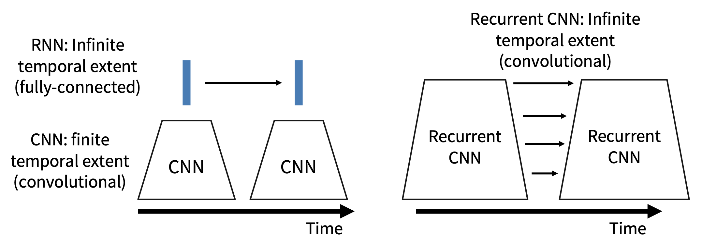

但我们还得面对另一个问题：RNN 在长序列上速度慢（因为 RNN 无法并行计算）。这时就得请另一位朋友——**自注意**(self-attention)登场了！利用它，我们可以搭建一种叫做**时空自注意**(spatio-temporal self-attention)（**非局部块**(nonlocal block)）的结构。

    

我们可以将非局部块添加到现有的 3D CNN 架构中。但最佳的 3D CNN 架构是什么呢？

    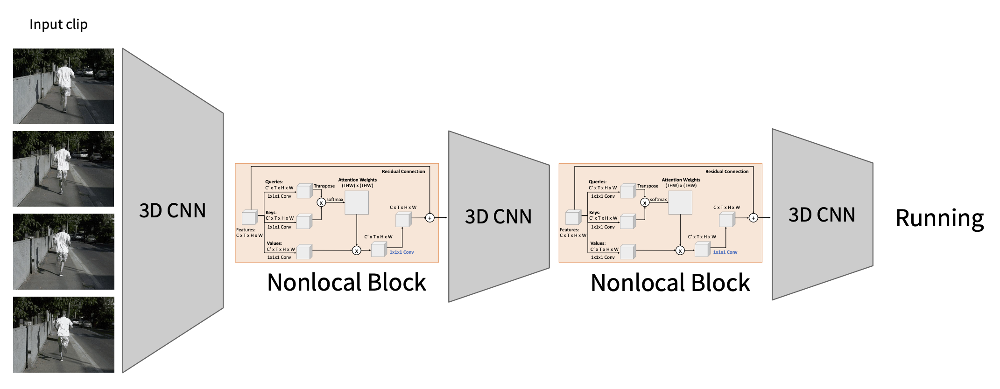

### Inflating 2D Networks to 3D (I3D)

关于图像架构的研究已经有很多了，所以我们不妨重用一些图像架构来处理视频。具体思路是：取一个 2D CNN 架构，用 3D 的规模为 $K_t \times K_h \times K_w$ 的版本替换 2D 的规模为 $K_h \times K_w$ 卷积/池化层。

=== "原来"

    

        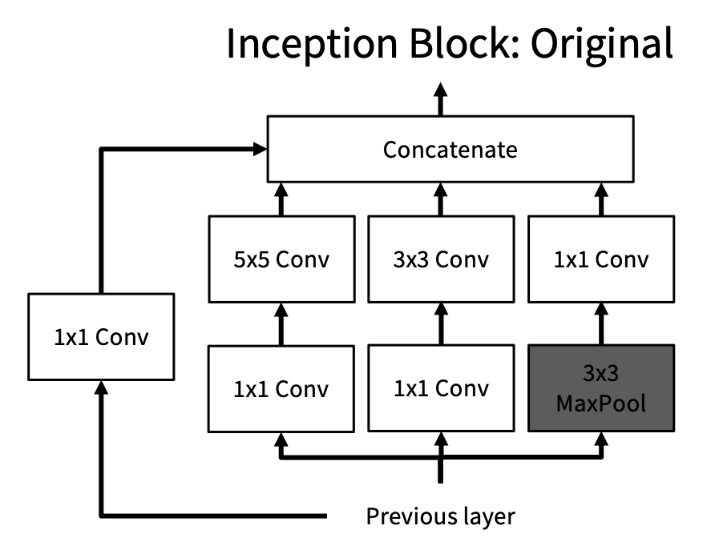
    

=== "膨胀后"

    

        
    

另外，我们可以使用 2D 卷积的权重来初始化 3D 卷积：在空间中复制 $K_t$ 次并除以 $K_t$。这给出了与给定“常数”视频输入的 2D 卷积相同的结果。

    

表现：

    

### Vision Transformers for Video

    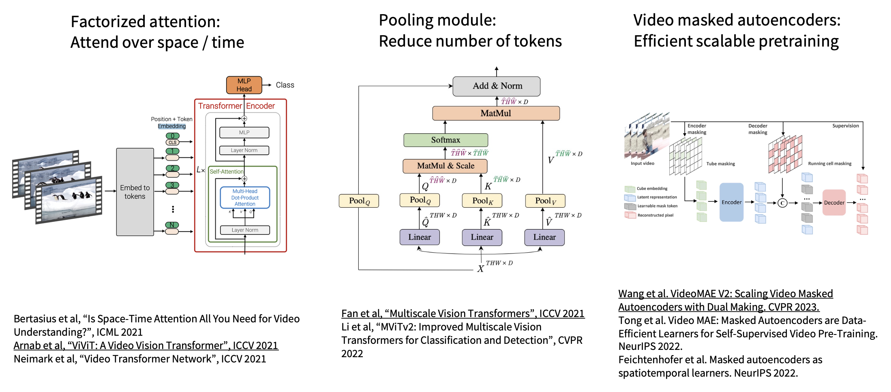

表现：

    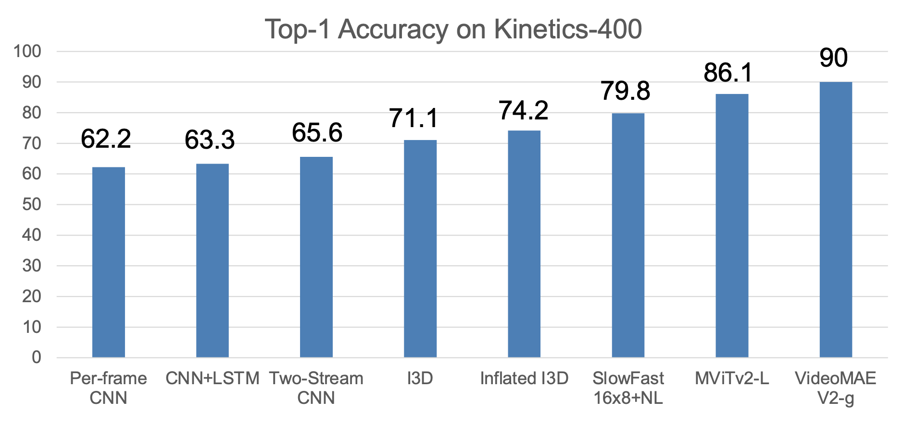

## Visualizing Video Models

    

- 添加一个用于鼓励空间上的平滑流动的项
- 调整惩罚，以区分“慢”和“快”动作

???+ example "猜测动作"

    === "例1"

        === "可视化结果（问题）"

            

                
            

        === "答案"

            

                
            

    === "例2"

        === "可视化结果（问题）"

            

                
            

        === "答案"

            

                
            

## Temporal Action Localization

**时间动作定位**(temporal action localization)：

    

- 给定一段未剪辑的长视频序列，识别对应不同动作的帧
- 可以使用类似于 **Faster R-CNN** 的架构：首先生成时间建议，然后进行分类

## Spatio-Temporal Detection

**时空检测**(spatio-temporal detection)：给定一段未剪辑的长视频，检测空间和时间中所有的人，并对他们正在执行的活动进行分类。

一些来自 AVA 数据集的例子：

    

## Applications

=== "视频引导音频分离(visually-guided audio source separation)"

    

        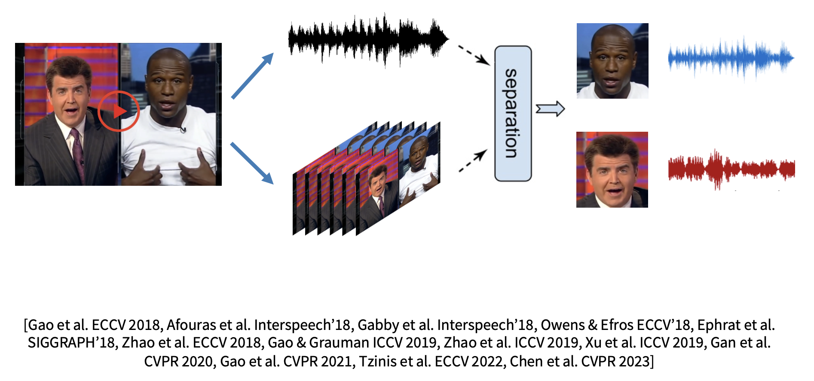
    

=== "乐器源分离(musical instruments source separation)"

    在 100K 个未标记的多源视频剪辑上进行训练，然后在新视频上分离音频。

    

        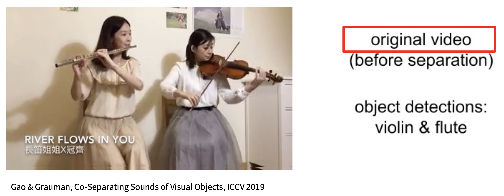
    

=== "音视频理解(audio-visual video understanding)"

    

        
    

=== "有效视频理解(effective video understanding)"

    

        
    

    

        
    

    

        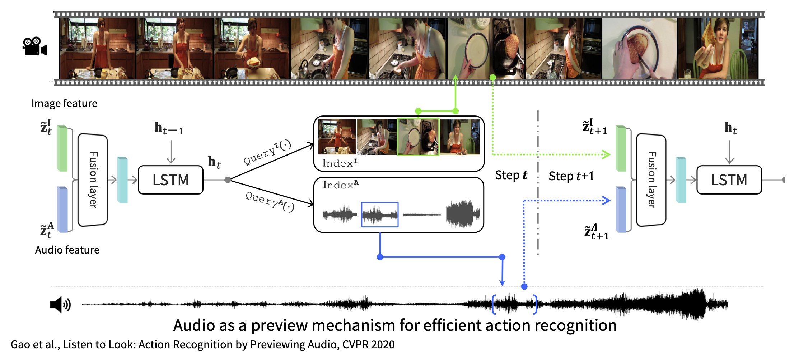
    

=== "多模态自中心视频理解(multimodal egocentric video understanding)"

    

        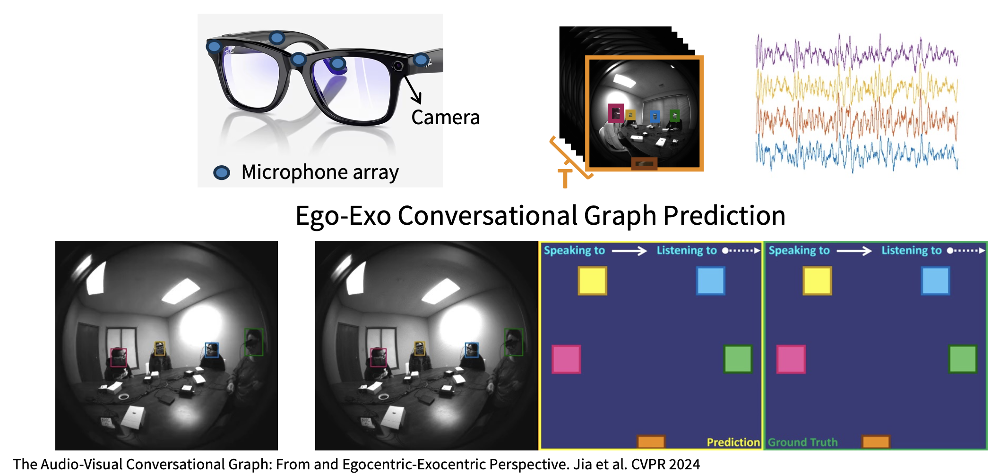
    

=== "视频理解 + LLMs"

    

        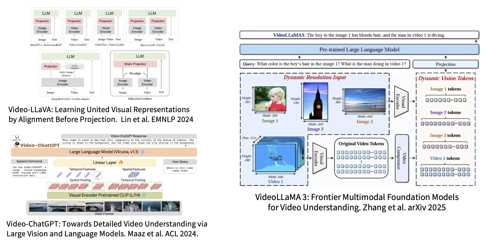
    
