# Large-Scale Distributed Training

要想训练 GPT-4、Llama 等超级大的模型，往往需要成千上万的 GPUs 才能满足要求。所以，模型在训练时会散布在众多 GPUs 上，于是我们称这样的训练为**大规模分布式训练**(large-scale distributed learning)。

在理解如何在多张 GPUs 上训练模型之前，我们先来了解一些有关 GPU 的硬件知识。


## A Bit about GPU Hardware

GPU 全称为**图形处理单元**(graphics processing unit)。顾名思义，它一开始是用于图形学的，不过现在可作为通用的并行处理器使用。它的关键组成部分有（以 Nvidia H100 为例）：

<div style="text-align: center">
    
</div>

- **计算核**(compute cores)（黄框）

    <div style="text-align: center">
        
    </div>

    - 50 MB 的 L2 高速缓存（中间的淡绿色框）
    - 132 个**流式多处理器**(streaming multiprocessor, **SM**s)，内含多个独立的并行核（紫框）
        - 实际上有 144 个，但由于良率，只有 132 个被启用
        - 有点像 CPUs 中支持向量指令的核

        <div style="text-align: center">
            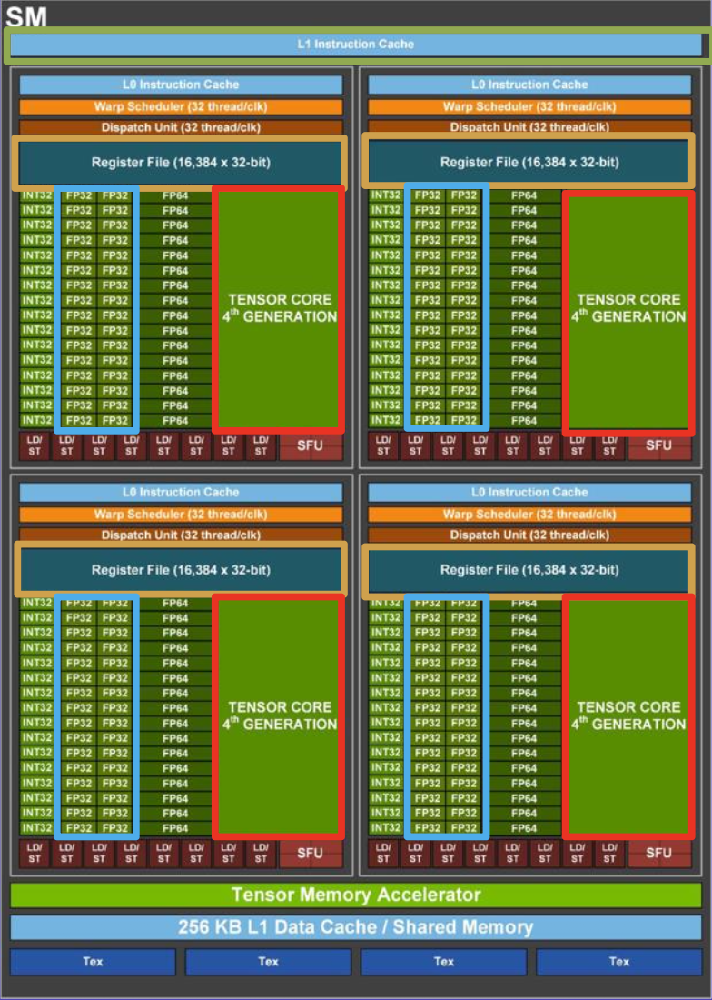
        </div>

        - 256 KB 的 L1 高速缓存（绿框），256 KB 的寄存器（黄框）
        - 128 个 FP32（32 位浮点数）核（蓝框）
            - 每时钟周期计算 ax + b
            - 2 FLOPs(floating point operations)
            - 每个 SM 在每时钟周期执行 256 FLOPs
        - 4 个张量核（红框）
            - 每时钟周期计算 AX + B
            - 矩阵运算：[16x4][4x8] + [16x8] = 16\*4\*8\*2 = 1024 FLOPs
            - 每个 SM 在每时钟周期执行 4096 FLOPs
            - 混合精度：16 位 / 32 位

- 80GB 的 HBM（高带宽，3352 GB/s）**内存**（蓝框）

近十几年 GPUs 的发展速度超级快！

<div style="text-align: center">
    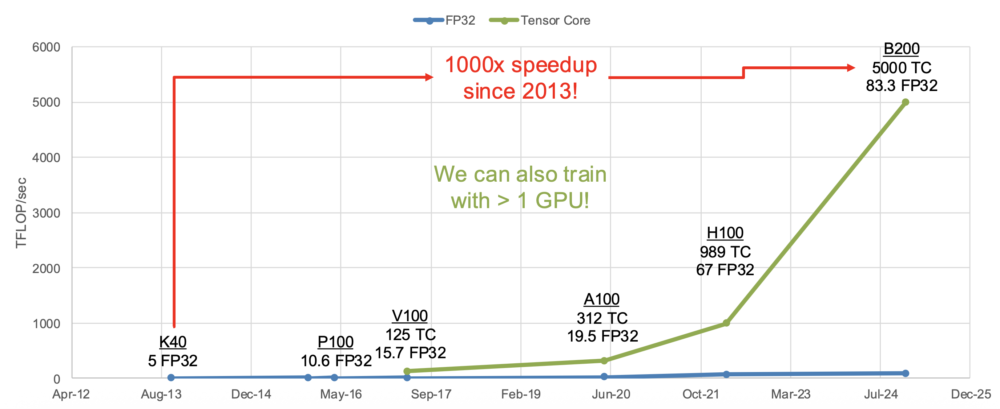
</div>

既然有成千上万个 GPUs，那就很有必要将它们组织起来。以下是 Llama 3 时采用的 GPU 架构：

<div style="text-align: center">
    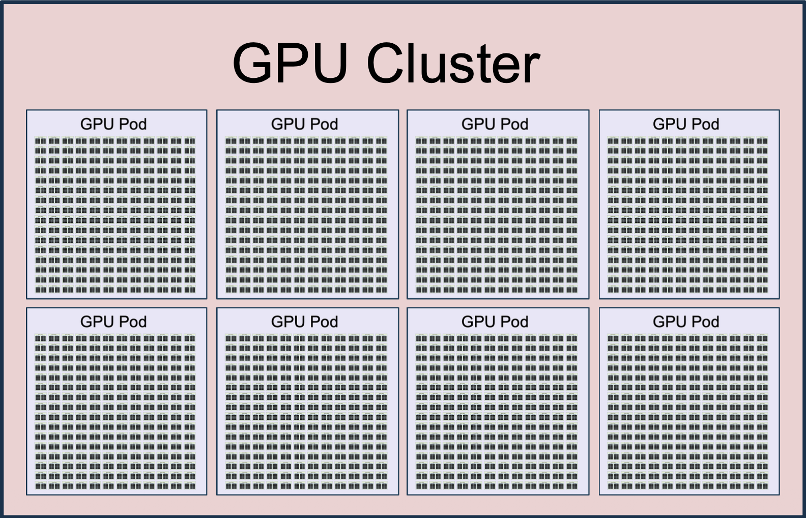
</div>

- H100 GPU：GPU 内部带宽为 3352 GB/s
- **服务器**(server) = 8x GPU，GPUs 之间的带宽为 900 GB/s
- **机架**(rack) = 2 台服务器 = 16 个 GPUs
- **机舱**(pod) = 192 个机架 = 3072 个 GPUs，GPUs 之间的带宽为 50 GB/s
- **集群**(cluster) = 8 个机舱 = 24,576 个 GPUs，GPUs 之间的带宽小于 50 GB/s

总的统计信息：

- 24,576 个 GPUs
- 1.875 PB GPU 内存
- 415M FP32 核
- 13M 张量核
- 24.3 EFLOP/s = 24.3 x 10^18^ FLOP/s

整个 Llama 神经网络需要在这么大一个集群内训练！

---
来看看其他例子：

- Google 的**张量处理单元**(tersonr processing units, **TPU**s)

    <div style="text-align: center">
        
    </div>

    - 由 Google 个性化设计
    - TPU v5p：
        - 每个芯片执行 BF16 运算的速度为 459 TFLOP/s
        - 每个芯片有 96 GB 的内存
        - 一个机舱内排布了 8960 个芯片

- AMD MI325X

    <div style="text-align: center">
        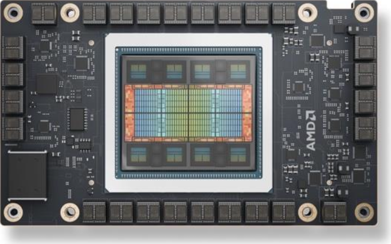
    </div>

    - 执行 BF16 运算的速度为 1300 TFLOP/s
    - 256 GB 内存

- AWS Trainium2

    <div style="text-align: center">
        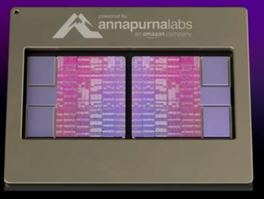
    </div>

    - 执行 BF16 运算的速度为 667 TFLOP/s
    - 96 GB 内存
    - 超服务器(UltraServer)内包含 64 个这样的芯片


## How to Train on Lots of GPUs

假设：一个具有 L 层的模型在形状为 (Batch, Sequence, Dim) 的张量上操作。

由于是在多个 GPUs 上进行训练，因此可以考虑采用不同的并行策略，包括：

- **数据并行**(data parallelism)：按批量(batch)维度划分
- **上下文并行**(context parallelism)：按序列(sequence)维度划分
- **流水线并行**(pipeline parallelism)：按层数（L）维度划分
- **张量并行**(tensor parallelism)：按 Dim 维度划分


### Data Parallelism

回忆一下：损失通常是在 N 个样例的小批量(minibatch)上进行平均值计算。数据并行的思路便是使用 MN 个样例的小批量，并且划分到 M 个 GPUs 上。

由于梯度是线性的，所以每个 GPU 可计算自己的梯度：

- 每个 GPU 计算在 N 个样例上的梯度

    $$
    L = \dfrac{1}{MN} \sum_{i=1}^M \sum_{j=1}^N l(x_{i, j}, W)
    $$

- 计算 M 个 GPUs 上的平均梯度

    $$
    \dfrac{\partial L}{\partial W} = \dfrac{1}{M} \sum_{i=1}^M \left(\frac{1}{N} \sum_{j=1}^N \frac{\partial}{\partial W} l(x_{i, j}, W)\right)
    $$

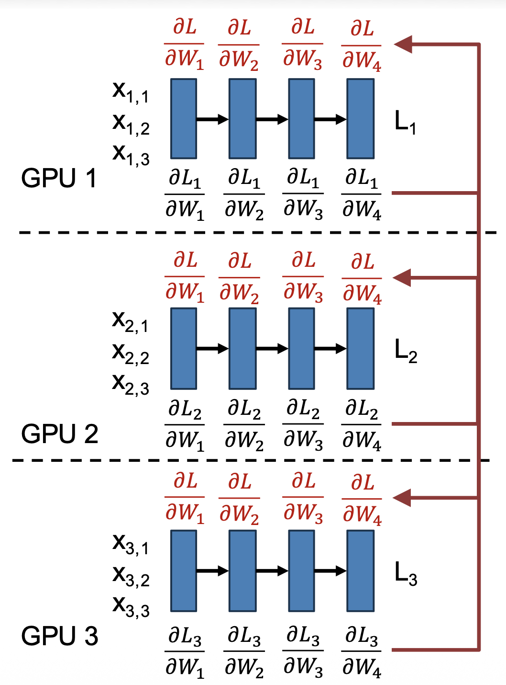{ align=right width=30% }

具体步骤如下：

1. 每个 GPU 有自己的模型 + 优化器的副本
2. 每个 GPU 加载自己批次的数据
3. 每个 GPU 正向运行，以计算损失
4. 每个 GPU 反向运行，以计算梯度
5. 计算所有 GPUs 的平均梯度
6. 每个 GPU 更新自己的权重

注意：4, 5 两步可并行运行！

???+ bug "问题"

    模型大小受限于 GPU 内存：
    
    - 每个权重需要 4 个数字（权重、梯度、Adam 的 $\beta_1, \beta_2$，每个数字占据 2 字节
    - 1B 的参数需要 8GB 空间，10B 参数就能占满 80 GB 的 GPU

解决方案：在多个 GPUs 之间划分模型权重，即下面介绍的方法：**全共享数据并行**(fully sharded data parallelism, FSDP)。


#### Fully Sharded Data Parallelism (FSDP)

全共享数据并行的具体思路为：每个权重 W~i~ 仅为一个 GPU 所有，同时包含梯度和优化信息。

1. 在正向进入第 i 层前，拥有 W~i~ 的 GPU 会将其广播到所有的 GPUs 上

    <div style="text-align: center">
        
        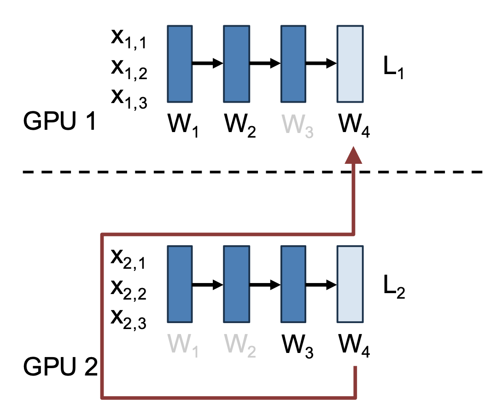
    </div>

2. 所有的 GPU 在第 i 层正向运行，然后删除 W~i~ 的局部副本

>注：在使用 W~i~ 正向计算的同时可以获取 W~i+1~

3. 在反向进入第 i 层前，拥有 W~i~ 的 GPU 会将其广播到所有的 GPUs 上
    - 优化：在正向计算结束时不要删除最后的权重，以避免之后立马再次发送

4. 所有的 GPU 在第 i 层反向运行，计算局部的 $\dfrac{\partial L}{\partial W_i}$，然后删除 W~i~ 的局部副本
5. 在第 i 层反向计算后，所有 GPU 将局部 $\dfrac{\partial L}{\partial W_i}$ 发送到拥有 W~i~ 的 GPU，并删除自己的 $\dfrac{\partial L}{\partial W_i}$

    <div style="text-align: center">
        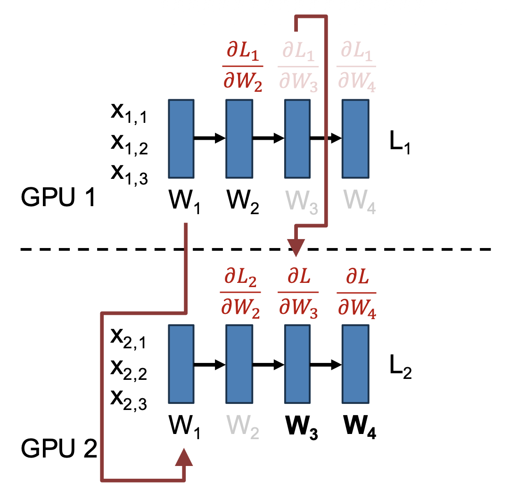
    </div>

6. W~i~ 的拥有者更新梯度

>注：可在计算 W~i+1~ 的同时获取 W~i~，并且可在发送 $\dfrac{\partial L}{\partial W_i}$ 并更新 W~i~ 的同时与 W~i-1~ 进行计算。

对于上图，以下这些计算可同时发生：

- 发送梯度并更新 W~3~
- 在 W~2~ 上反向运行
- 获取 W~1~


#### Hybrid Sharded Data Parallelism (HSDP)

一种更高级的数据并行策略是**混合共享数据并行**(hybrid shared data parallelism)。

<div style="text-align: center">
    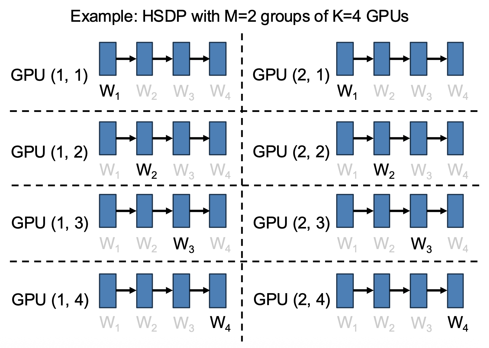
</div>

- 将 N = M*K 个 GPUs 划分到 M 个大小为 K 的组中
- 包含 K 个 GPU 的一组执行 FSDP，将模型权重分配到所有 K 个 GPU 上；K 可以是 O(100) 个 GPU
- 在 M 个组上进行数据并行

上述策略反映了**多维并行性**(multidimensional parallelism)：同时使用不同的并行策略，将 GPU 组织成二维网格。

- 组内的 3x 通信：
    - 正向：W，反向：W + dL/dW
    - 将它们保存在相同的节点/机舱内
- 组间的 1x 通信：
    - 反向：dL/dW
    - 能使用更慢的通信手段

---
通过 FSDP 和 HSDP，我们解决了因 GPU 内存限制模型参数量的问题：假如要训练一个 100B 的大模型

- 原本需要 800GB 的 GPU 内存
- 现在分摊到 80 个 GPU 上，每个 GPU 只需 10 GB 内存就行了

???+ bug "新的问题"

    **模型激活**可能会占用内存。

    - Llama3-405B Transformer 有 126 层，D=16,384，序列长度 4096
    - 仅 FFN 隐藏激活就需要 2\*126\*(4\*16384)\*4096 B = 63GB
    - 另外还有其他的激活

解决方案：不要在内存中保留所有的激活，运行时重新计算。


#### Activation Checkpointing

上述方案的具体实现叫做**激活检查点**(activation checkpointing)。具体思路为：网络中的一个层包含两个函数，分别是：

- **正向**：计算下一层的激活

    $$
    A_{i+1} = F_i^\rightarrow (A_i)
    $$

- **反向**：计算上一层的梯度

    $$
    G_i = F_i^\leftarrow (A_i, G_{i+1})
    $$

???+ question "思考"

    === "问题"

        假设 $F_i^\rightarrow, F_i^\leftarrow$ 的时间和空间复杂度均为 $O(1)$，那么总的时间和空间复杂度是多少呢？

    === "解答"

        === "正向 + 反向"

            - 时间复杂度：$O(N)$
            - 空间复杂度：$O(N)$

            <div style="text-align: center">
                
            </div>

        === "完全重计算"

            思路：在反向传递阶段重新计算激活。

            - 时间复杂度：$O(N^2)$
            - 空间复杂度：$O(1)$

            <div style="text-align: center">
                
            </div>

            !!! bug "问题：$O(N^2)$ 的时间复杂度太糟糕了！"

        === "C 个检查点"

            思路：不要重新计算所有东西；每 C 层保存一个检查点。

            - 时间复杂度：$O(N^2 / C)$
            - 空间复杂度：$O(C)$

        === "$\sqrt{N}$ 个检查点"

            - 时间复杂度：$O(N \sqrt{N})$
            - 空间复杂度：$O(\sqrt{N})$

将 HSDP 和激活检查点方法相结合，我们得到了一套不错的训练方法，其步骤为：

1. 使用多达约 128 个 GPU，以及约 1B 参数量的模型
2. 始终将每个 GPU 批次大小设置得尽可能大，以最大限度地利用 GPU 的内存
3. 若模型参数量 > 1B，考虑用 FSDP
4. 增加激活检查点以适配 GPU 更大的批次
5. 若有 >256 个 GPUs，考虑用 HSDP
6. 若有 >1K 个 GPUs，>50B 参数量的模型或序列长度 > 16K，那么采用更高级的策略（CP, PP, TP）

可以看到，这些步骤中有好多可以调优的地方，那么该怎么设置它们呢？答案是最大化**模型浮点运算利用率**(model FLOP utilization, MFU)。


#### Hardware FLOPs Utilization (HFU)

理论上，H100 能在张量核上以 989.4 TFLOP/s 的速度完成 16 位的矩阵乘法。实际上能看到的吞吐量可以用**硬件浮点运算利用率**(hardware FLOP utilization, HFU)来衡量，它表示实际能到达的理论矩阵乘法性能的比例。

以下代码可作为用于最佳情况的基准测试（仅考虑矩阵乘法）：

```py
h100_tflop_per_sec = 989.4
sizes = [512, 1024, 2048, 4096,
         8192, 16_384, 32_768]
for N in sizes:
    x = torch.rand(N, N, device="cuda"
                   dtype=torch.bfloat16)
    flops = 2 * N * N * N
    times = []
    for i in range(12):
        tO = time.time()
        y = x @ x
        if i > 2: 
            times.append(time.time() - t0)
    sec = np.mean(times)
    tflops_per_sec = flops / sec / 10**12
    hfu = 100 * tflops_per_sec / h100_tflop_per_sec
    print(f"N: {N}, "
          f"TFLOP/sec: {tflops_per_sec: 2f}, "
          f"HFU: {hfu: .2f}%"
    )
```

>注：运行此命令时请设置 `CUDA_LAUNCH_BLOCKING=1`，否则 GPU 内核将异步启动，导致测量结果不正确。

在 H100 上运行此代码，发现在大矩阵乘法上取得约 80% 的 HFU。

<div style="text-align: center">
    
</div>

???+ bug "问题"

    HFD 并没有考虑激活检查点，或者像数据增强、优化器、预处理等辅助计算。


#### Model FLOPs Utilization (MFU)

所以我们引入了“**模型浮点运算利用率**”这一指标。它衡量了用于有效模型计算的 GPU 理论峰值 FLOPs 的比例。

1. 计算 FLOP~theoretical~ = 在正向和反向传递阶段中矩阵乘法的 FLOPs 的总数
    - 反向 ≈ 2x 正向
    - 忽略非线性、归一化和像残差等的逐元素运算，因为它们在 FP32 核上运行
2. 查找 FLOP/sec~theoretical~ = 理论的设备最大吞吐量（H100：989 TFLOP/sec）
3. 计算 t~theoretical~ = FLOP~theoretical~ / FLOP/sec~theoretical~
4. 测量 t~actual~ = 关于数据加载、正向、反向、优化的一次完整迭代所需的实际时间
5. MFU = t~theoretical~ / t~actual~

???+ example "例子"

    较宽的 MLP 使用较大的批量大小能在 H100 上获得约 49% 的 MFU。

    ```py
    L, D, N = 8, 8192, 8192

    flop_fwd = N * L * 2 * D * D
    flop_bwd = 2 * flop_fwd
    flop_theoretical = flop_fwd + flop_bwd
    t_theoretical = flop_theoretical / (989.4 * 10 ** 12)

    layers = []
    for _ in range(L):
        layers += [torch.nn.Linear(D, D), torch.nn.ReLU()]
    model = torch.nn.Sequential(*layers).cuda()
    optimizer = torch.optim.Adam(model.parameters(), lr=1e-4)

    for _ in range(20):
        torch.cuda.synchronize()
        t0 = time.time()
        X = torch.randn(
            N, D, device="cuda",
            dtype=torch.float32
        )

        with torch.autocast(
            device_type="cuda",
            dtype=torch.bfloat16,
        ):
            y = model(X)
            loss = ((X - y) ** 2.0).sum()
            loss.backward()
            optimizer.step()
            optimizer.zero_grad()
        torch.cuda.synchronize()
        t_actual = time.time() - t0
        mfu = t_theoretical / t_actual
        print(f"MFU:{100*mfu:.2f}%")
    ```

优化分布式训练的目标就是最大化 MFU。实际上，当 MFU > 30%，说明效果已经不错了；当 MFU > 40%，说明表现非常优秀。

<div style="text-align: center">
    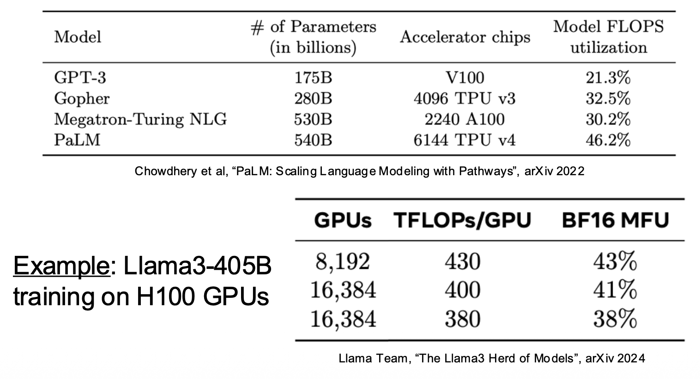
</div>

然而，更现代的设备有时会出现更差的 MFU，这是因为它们的峰值 FLOPs 增长速度远快于它们的内存带宽。

- 比如：A100 => H100，3.1x FLOPs，2.1x 内存带宽


### Context Parallelism

第二种并行策略是**上下文并行**，它通常用在 **Transformer** 上。

<div style="text-align: center">
    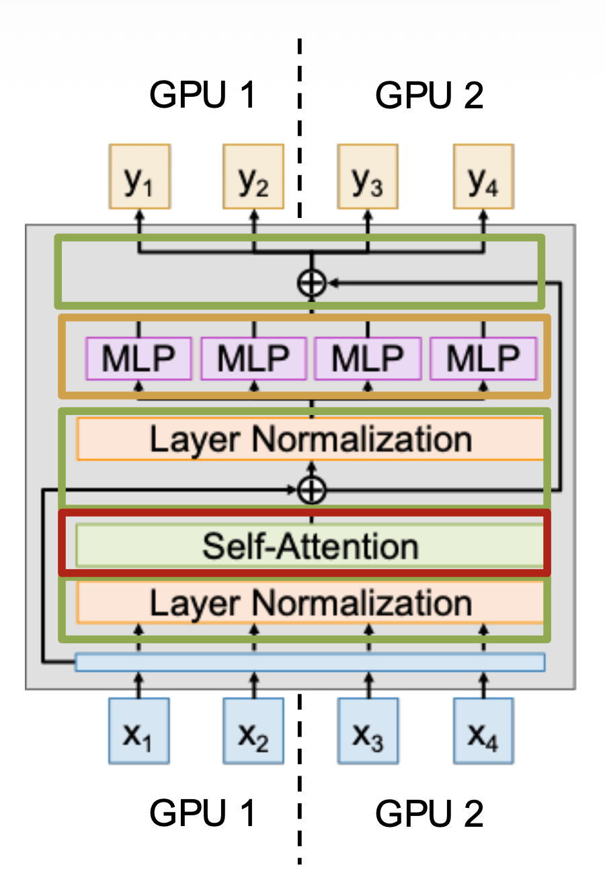
</div>

- 思路：Transformer 在长为 L 的序列上运行，使用多个 GPU 来处理单个长序列
- **正则化**、**残差连接**：它们没有权重，因此很容易并行化
- **MLP**：并行化简单，但有权重；每个 GPU 需要保留一份权重的副本，并且要像在 DP 那样和梯度通信
- **注意力**：更加复杂，需要深挖
    - **QKV 投影**：和 MLP 一样，在序列上并行化，并和梯度同步
    - **注意力算子**：难以并行化，解决方法有：
        - **环注意力**(ring attention)：
            - 将数据分成块，并在 GPU 上分配
            - 内循环遍历键/值，外循环遍历查询
            - 实现复杂，但可扩展到非常长的序列

            <div style="text-align: center">
                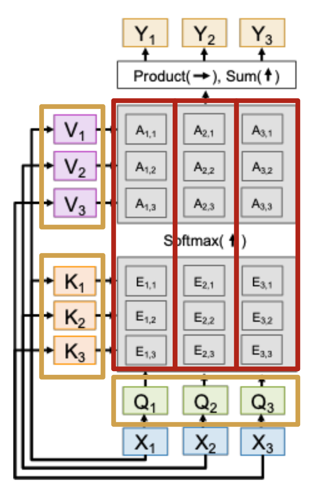
            </div>

        - **Ulysses**：
            - 不要尝试分配注意力矩阵，而是并行处理多头注意力中的头部
            - 更简单，但最大并行度 = 头部数量

            <div style="text-align: center">
                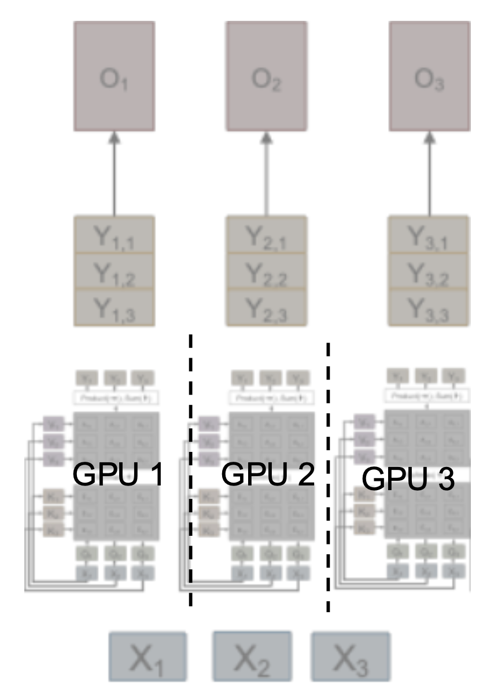
            </div>

???+ example "例子"

    Llama3-405B 的训练：

    - 阶段1：S=8192，无上下文并行
    - 阶段2：S=131072，16 路上下文并行（每个 GPU 分配到长为 8192 的序列）


### Pipeline Parallelism

第三种并行策略是**流水线并行**，其思路是在 GPU 之间拆分模型的层，并在 GPU 边界之间复制激活。

<div style="text-align: center">
    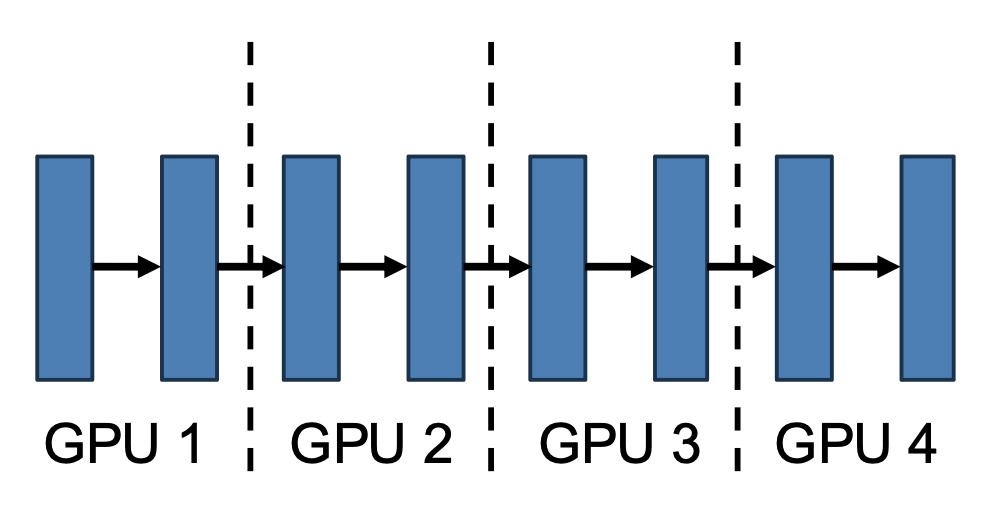
</div>

???+ bug "问题"

    **顺序依赖**，导致大多数 GPU 处于空闲状态。N 路流水线并行的最大 MFU 是 1/N。

    <div style="text-align: center">
        
    </div>

解决方法是同时运行多个**微批次**(microbatches)，通过 GPU 进行流水线处理。

???+ example "例子"

    4 路流水线并行，有 4 个微批次。最大 MFU 从 1/4 = 25% 增长至 16/28 ≈ 57.1%

    <div style="text-align: center">
        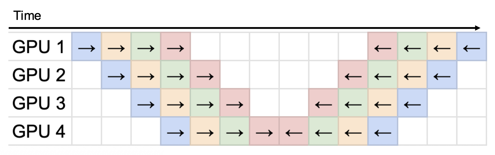
    </div>


### Tensor Parallelism

最后一种要介绍的并行策略为**张量并行**，其思路是将每个线性层的权重分配到 GPU 上，并使用块矩阵乘法。

<div style="text-align: center">
    
</div>

???+ bug "问题"

    需要在正向传递后收集 Y 的部分，不能与通信重叠。

解决技巧：使用两个连续的 TP 层，首先在行上分片(shard)，然后在列上分片，从而避免通信。

<div style="text-align: center">
    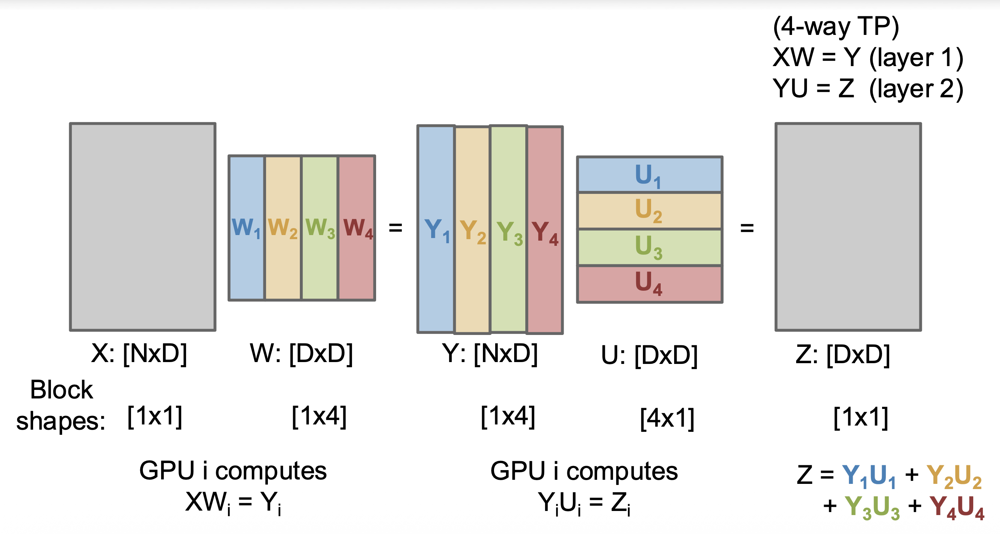
</div>

在 XW=Y 之后无需通信；每个 GPU 计算 Z 的一个项，然后广播给所有其他 GPUs。

---
实际上这 4 种并行技术可以同时使用，即 **ND 并行**。

- 在一个 4D 网格上安排 GPU
- GPU 在网格中的索引给出了其在每个并行维度上的排名
- 优化目标依然是最大化 MFU

<div style="text-align: center">
    
</div>