# Self-Supervised Learning

上一讲介绍的大规模训练（**监督学习**）存在一些问题：

- **需要大量的标注数据**，因而产生高成本
- 监督学习和人类学习方式不一致：婴儿观察世界时没有任何“监督”
  
那么是否存在一种方式，能够在无需大量手工标注的数据集的情况下训练神经网络呢？答案是有的，它便是本讲的主角——**自监督学习**(self-supervised learning)。

自监督学习涉及到的任务分为两类：

    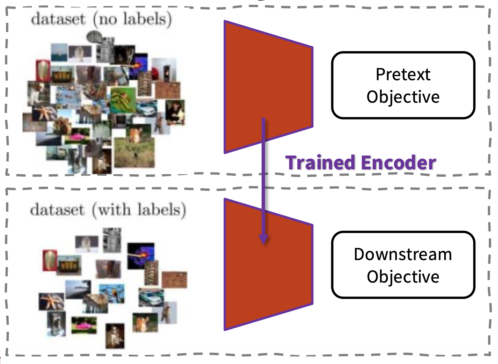

- **预文本任务**(pretext tasks)：
    - 定义一个基于数据本身的任务
    - 无手工标注
    - 可被考虑为一项**无监督**(unsupervised)任务
    - 但要通过监督学习目标来学习，比如分类或回归

    

        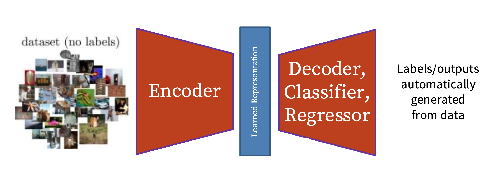
    

    ???+ example "例子"

        学习预测图像变换/完全遭破坏的图像。

        

            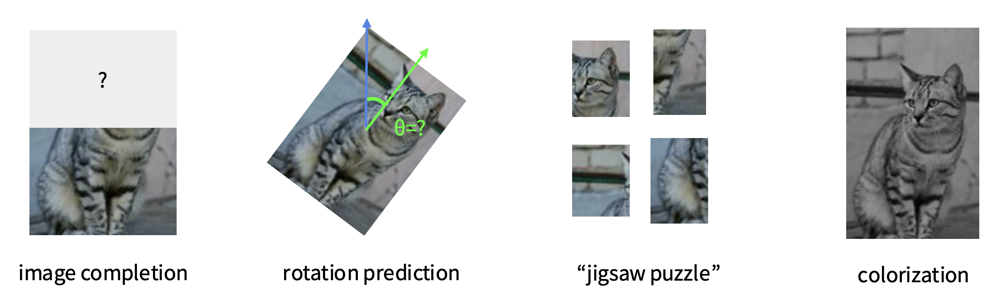
        

    - 学习预文本任务能让模型学得更好的特征
    - 我们能自动生成用于预训练任务的标签

- **下游任务**(downstream tasks)：
    - 模型训练者关心的应用
    - 没有很大的数据集
    - 数据集是标注好的

    

        
    

评估一个自监督学习方法的指标有：

- **预文本任务表现**(pretext task performance)：测量模型在没有标签的情况下训练时在任务上的表现
- **表示质量**(representation quality)：评估学到的表示的质量
    - **线性评估协议**(linear evaluation protocal)：在学到的表示中训练一个线性分类器
    - **聚类**(clustering)：测量聚类表现
    - **t-SNE**：可视化表示，以评估它们的分离性(separability)
- **健壮性和泛化**(robustness and generalization)：测试模型对不同数据集的泛化能力以及其对变化的健壮性
- **计算效率**(computational efficiency)：评估该方法在训练时间和资源需求方面的效率
- **迁移学习和下游任务表现**(transfer learning and downstream task performance)：通过将学习到的表示迁移到下游的监督任务中来评估其效用

???+ example "例子"

    

        
    

    1. 从自监督预训练任务中学习好的特征提取器（比如用于预测图像旋转）
    2. 在特征提取器上附加一个浅层网络；使用少量标记数据在目标任务上训练该浅层网络

虽然本讲只围绕自监督学习在 CV 领域的应用，但事实上这一技术可用于众多和 AI 相关的领域，包括机器人学/强化学习、语言模型、语音合成等等。

    

## Pretext Tasks From Image Transformations

### Image Transformations

#### Rotation

    

在预测旋转的预文本任务中需要做这样的一个假设：一个模型只有在拥有关于物体在未受干扰时应呈现何种外观的“视觉常识”时才能识别物体的正确旋转。

    

- 通过旋转完整的输入图像来进行自监督学习
- 图中所示的模型学会预测应用哪种旋转（本质上是 4 路分类问题）

然后在**半监督学习**(semi-supervised learning)上评估这个模型：

    

- 在 CIFAR10（整个数据集）上进行自监督学习
- 固定 conv1 和 conv2，用标注好的 CIFAR10 数据子集来训练 conv3 和线性层

接下来将习得的特征迁移到自监督学习中：

    

- 在 ImageNet（整个训练集）上使用 AlexNet 进行自监督学习
- 在来自 Pascal VOC 2007 的标注数据上微调

下面展示了习得的视觉注意力的可视化结果：

    

#### Inpainting

第二个预文本任务是预测相对块(patch)位置。

    

更好的做法是将其类比为一个“拼图(jigsaw)”问题来解决。

    

接下来将习得的特征迁移到自监督学习中：

    

- 表中 "Ours" 一行是从解决图像拼图难题中学习到的特征（Noroozi & Favaro，2016）
- Doersch 等人的方法就是具有相对块位置的方法

---
另一个类似的预文本任务是预测缺失的像素，即**图像修复**(inpainting)任务。

    

Pathak 等人于 2016 年提出了解决此问题的模型“**上下文编码器**(context encoder)”。它本质上是一个[**自编码器**](../ml/7.md#auto-encoder)(auto-encoder)，包含了编码器和解码器两部分，用来学习重构缺失的像素。

    

损失 = 重构 + **对抗学习**(adversarial learning)（下一讲介绍）

    

对抗损失位于真实图像和修复图像之间。

图像修复评估：

    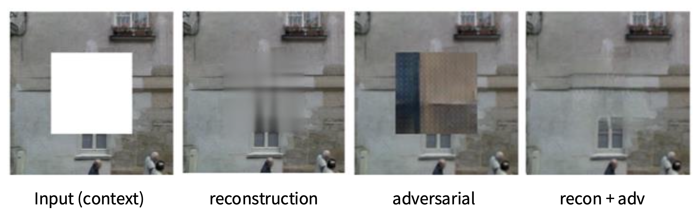

接下来将习得的特征迁移到自监督学习中：

    

在 ImageNet 训练集上进行的自监督学习，迁移到分类（Pascal VOC 2007）、检测（Pascal VOC 2007）和语义分割（Pascal VOC 2012）任务中。

#### Image Coloring

第三个可预测任务是**图像着色**(image coloring)。

    

    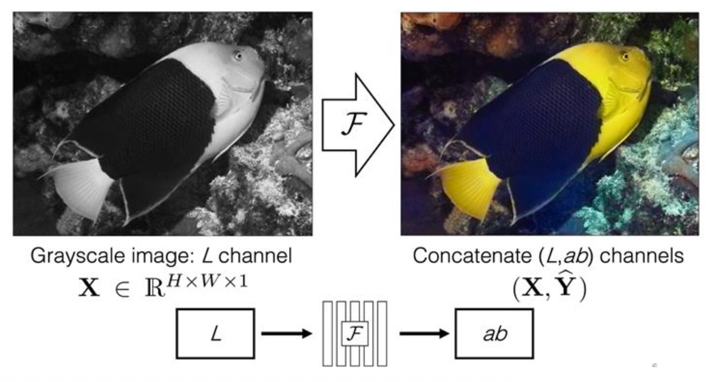

**Split-brain 自编码器**是一种用在该任务上的模型：

    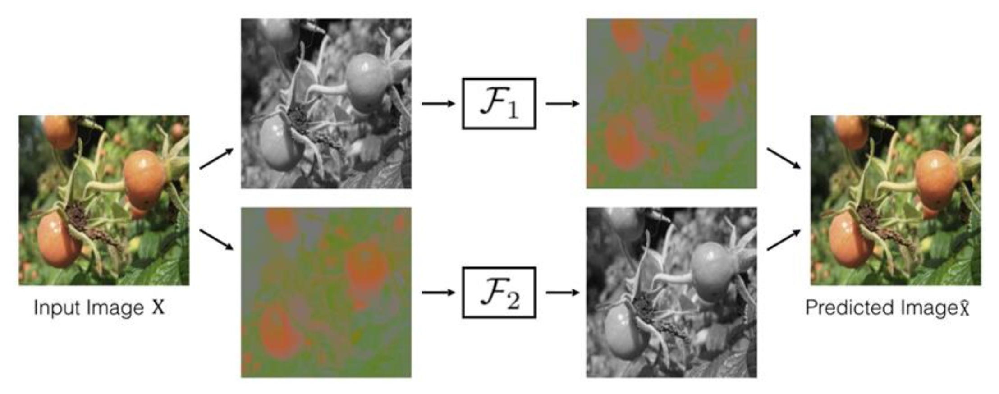

它的思路是**交叉通道预测**(cross-channel prediction)：

    

    

接下来将习得的特征迁移到自监督学习中：

    

- 在 ImageNet（整个训练集）上进行的自监督学习
- 使用来自 F1 和 F2 的连接特征
- 标记数据来自 Places 数据集

???+ example "效果"

    

        
    

    

        
    

#### Video Coloring

同样地我们也可以完成视频着色这一预文本任务。解决该问题的思路是为视频中颜色的时间连贯性(temporal coherence)建模。

    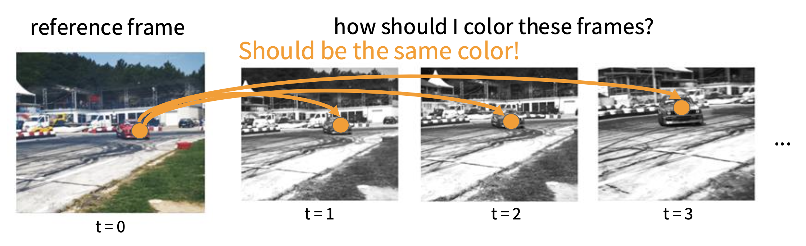

假设：学习为视频帧上色应该可以让模型学会在没有标签的情况下跟踪区域或物体。

学习目标：

    

- 在学到的特征空间映射中建立参考帧和目标帧
- 使用作为“指针”的映射来复制正确的颜色（LAB）

    

- 参考帧上的注意力图(attention map)：$A_{ij} = \dfrac{\exp(f_i^T f_j)}{\sum_k \exp(f_k^T f_j)}$
- 预测颜色 = 参考颜色的权重和：$y_j = \sum\limits_i A_{ij} c_i$
- 预测颜色和真实颜色之间的损失：$\min\limits_\theta \sum\limits_j \mathcal{L}(y_j, c_j)$

???+ example "效果"

    

        
    

    

        
    

???+ example "应用：源自上色的追踪"

    - 使用学习到的注意力传播分割掩码

        

            
        

    - 使用学习到的注意力传播姿态关键点

        

            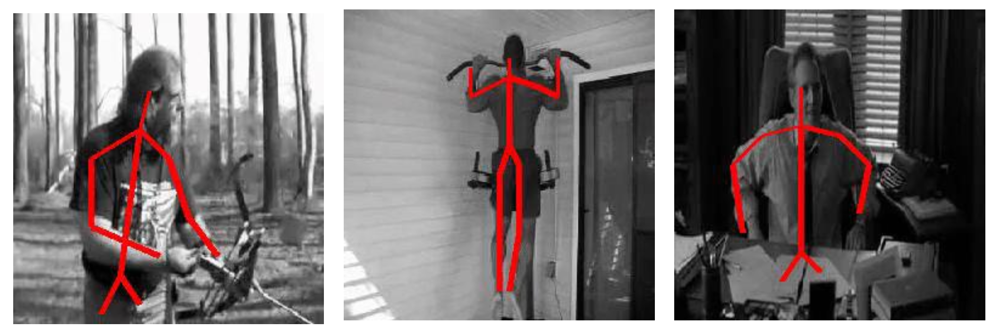
        

### Reconstruction-based learning (MAE)

下面介绍一个更现代的框架，叫做**掩码自编码器**(masked auto-encoder, **MAE**)，它能够在更大的掩码区域上实现重构。

    

MAE 架构图如下：

    

掩码方法论：

- 类似于原始的 ViT，将输入划分为不重叠的块(patches)
- 从这些块中均匀采样很大一部分（75%）进行掩码操作
- **高比例的掩码**使得预测任务具有挑战性和意义
- 此外，不使用掩码标记并选择高抽样比例（掩蔽大部分图像，例如 75%，并抽取一小部分可见区域，例如 25%，以供编码器使用）使得编码器非常庞大

MAE **编码器**：

- 编码器仅对未掩码的块（25%）进行操作
- 通过线性投影将块转化为嵌入（向量）并添加位置嵌入（向量）
- 使用 Transformer 块
- 由于输入块只占输入的一小部分，因此可以选择非常大的编码器（编码器每 token 的计算量可超过解码器的 9 倍）

MAE **解码器**：

- 将编码器的输出与先前掩码位置中的**共享掩码 token** 合并，并向其添加位置编码
- 使用 Transformer 块，随后通过线性投影来完成最终的像素重建
- 解码器仅负责重建，意味着它**不在训练后使用**；因此它独立于编码器设计，十分灵活（与传统 AE 或 UNet 不同）
- 这是一个**非对称的**(asymmetrical)自动编码器设计

关于重构：

- 在输入图像和重建图像之间的像素空间中采用**均方误差损失**（MSE）
- 损失**仅计算掩码块**

???+ info "**线性探测**(linear probing) vs **完整微调**(full fine-tuning)"

    { align=right width=25% }

    - 线性探测
        - **预训练模型是固定的**，在末端**只添加一个线性层**来预测标签（或产生输出）；这种方法用于评估预训练特征提取模型表示的质量
        - 在受限条件下提供预训练表示质量的一个度量

    - 微调
        - **预训练模型进一步训练**（不是固定的），并添加一个或多个层，可能包含非线性
        - 发掘模型接近真实潜力的能力，以适应新任务

**消融研究**(ablation studies)：多种建模/超参数的选择：

- 掩码率
- 解码器深度
- 解码器宽度
- 掩码 token（在编码器中使用/未使用）
- 重建目标
- 数据增强
- 掩码采样方法
- 训练调度

    

MAE 和其他模型比较：

    

???+ abstract "总结：来自图像变换的预文本任务"

    - 预文本任务关注“视觉常识”，例如，预测旋转、修复、重新排列和着色
    - 模型被迫学习关于自然图像的良好特征，例如，对象类别的语义表示，以便解决预文本任务
    - 我们通常不关心（模型在）这些预文本任务的表现，而是关注学习到的特征对下游任务（分类、检测、分割）的实用性
    - 问题：
        - 提出单个预文本任务很繁琐
        - 习到的表示可能不具有普遍性

我们希望构建一个更通用的预文本任务，比如在模型能通过学习关于猫的图像的各种变换后，也能理解其他物体（比如狗）的图像变换。

    

这样的技术便是下面马上要介绍的**对比表示学习**(contrastive representation learning)。

## Contrastive Representation Learning

### Intuition and Formulation

    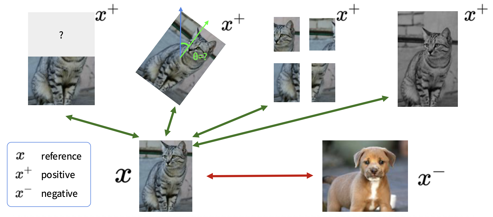

记参考样例、相同（正）样例和不同（负）样例分别为 $x, x^+, x^-$。我们的目标是：
$$
\text{score}(f(x), f(x^+)) \gg \text{score}(f(x), f(x^-))
$$

即给定一个选定的分数函数，我们的目标是学习一个编码器函数 $f$，该函数对正对 $(x, x+^)$ 产生高得分，对负对 $(x, x^-)$ 产生低得分。

假如有 $1$ 个正样例，$N - 1$ 的负样例，那么损失为：

$$
L = - \mathbb{E}_{x} \left[ \log \frac{\textcolor{green}{\exp(s(f(x), f(x^+)))}}{\textcolor{green}{\exp(s(f(x), f(x^+)))} + \textcolor{red}{\sum_{j=1}^{N-1} \exp(s(f(x), f(x_j^-)))}} \right]
$$

    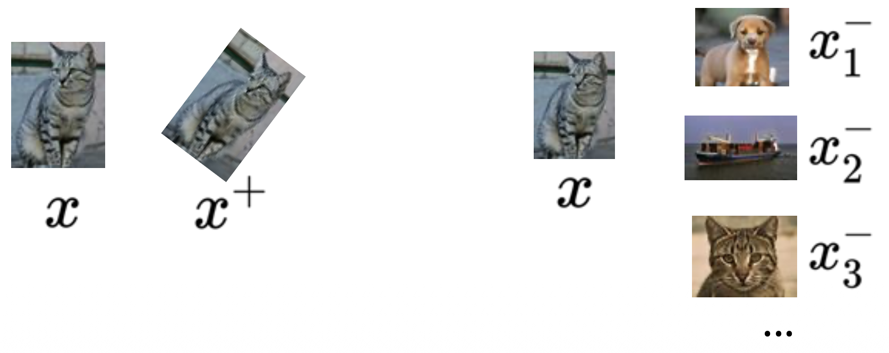

其中绿色部分表示正对，红色部分表示 $N-1$ 个负对。

上述损失公式和 N 路 softmax 分类器的交叉熵损失很像，即从 N 个样本中找出（唯一的）正样本。该损失通常被称为 **InfoNCE 损失**。

$f(x), f(x^+)$ 之间互信息的下界为：
$$
MI[f(x), f(x^+)] - \log(N) \ge -L
$$

负样本大小（$N$）越大，该边界越紧。

### Instance Contrastive Learning: SimCLR and MoCo

#### SimCLR

**SimCLR**（[Chen et al, 2020](https://arxiv.org/pdf/2002.05709.pdf)）是用于对比学习中的一个简易框架。

{ align=right width=30% }

- 将**余弦相似度**(cosine similarity)作为分数函数：

    $$
    s(u, v) = \dfrac{u^T v}{\|u\|\|v\|}
    $$

- 使用**投影网络** $g(\cdot)$ 将特征投影到应用对比学习的空间中
- 通过**数据增强**（随机裁剪、随机颜色扭曲、随机模糊等）生成正样本

    

        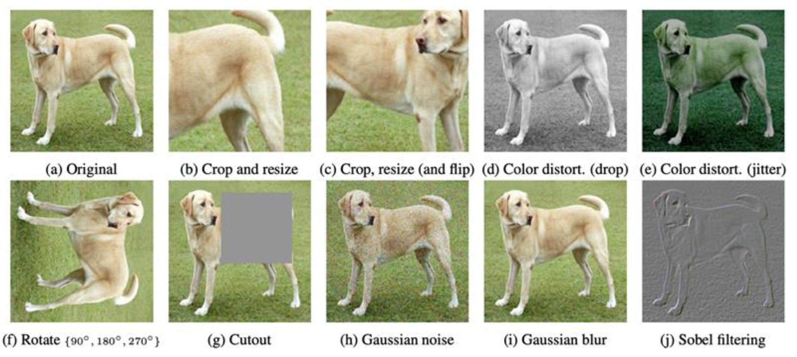
    

其主要学习算法如下：

    

**小批量训练**(mini-batch training)：

    

在 SimCLR 特征上训练**线性分类器**：

    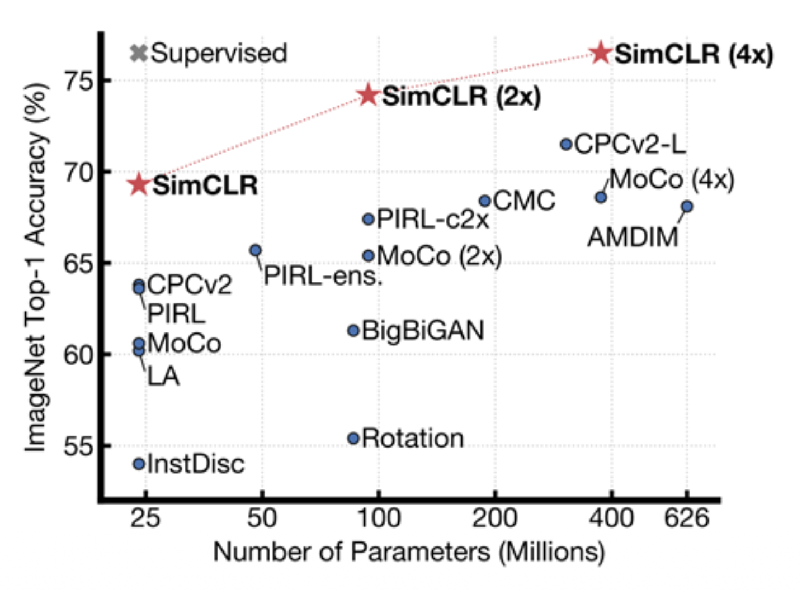

- 在 ImageNet（整个训练集）上使用 SimCLR 训练特征编码器
- 固定特征编码器，在标记数据之上训练一个线性分类器

在 SimCLR 特征上的**半监督学习**：

    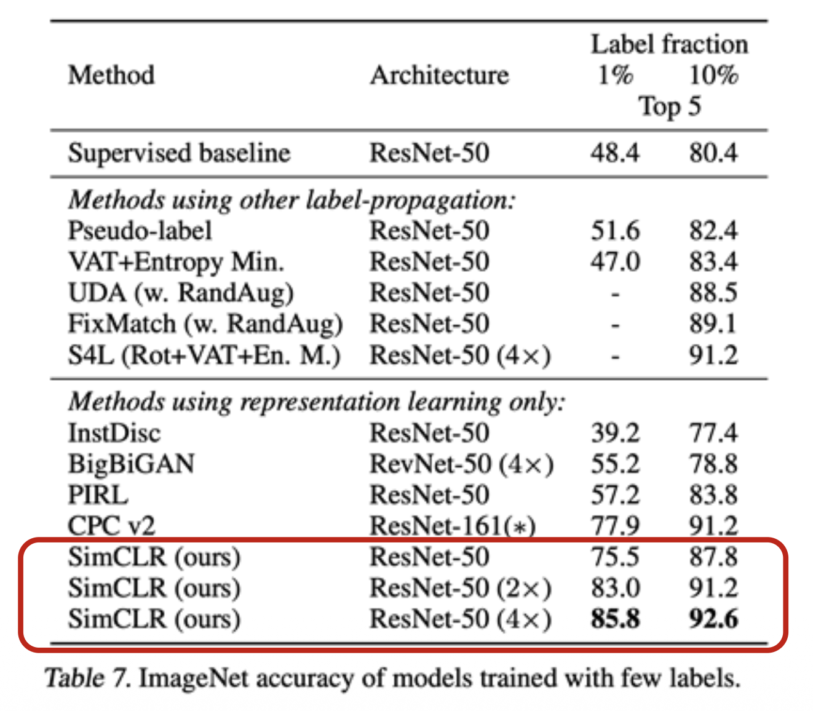

- 在 ImageNet（整个训练集）上使用 SimCLR 训练特征编码器
- 在来自 ImageNet 的 1%/10% 的数据上微调编码器

SimCLR 的设计选择：

{ align=right width=25% }

- **投影头**(projection head)：线性/非线性投影头能够改善表示学习，一种可能的解释为：
    - 对比学习目标可能会丢弃下游任务的有用信息
    - 表示空间 z 被训练成对数据变换保持不变
    - 通过利用投影头 $g(\cdot)$，可以在 $h$ 表示空间中保留更多的信息

- **更大的批次大小**
    - 大的训练批次大小对于 SimCLR 至关重要
    - 但这会导致在反向传播期间的内存占用过大：需要 TPU 上的分布式训练（ImageNet 实验）

    

        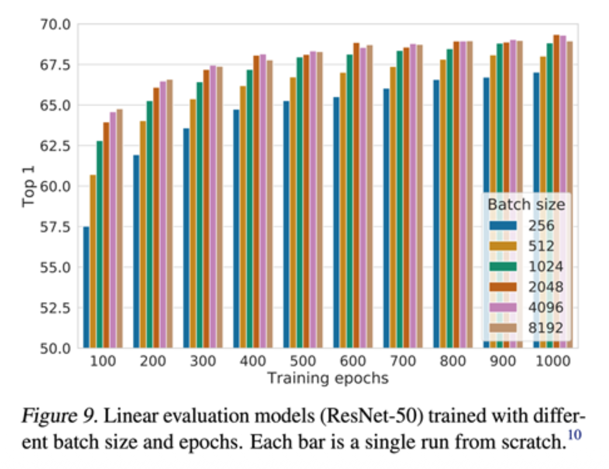
    

#### MoCo

**MoCo**（[He et al, 2019](https://arxiv.org/abs/1911.05722)）和 SimCLR 的关键不同在于：

- 保持键的运行**队列**（负样本）
- **仅通过查询**计算梯度并更新编码器
- 将最小批量大小与键的数量解耦，因而可以支持**大量的负样本**
- 键编码器正通过以下动量更新规则**缓慢进展**：

    $$
    \theta_k \leftarrow m \theta_k + (1 - m) \theta_q
    $$

Moco 算法的伪代码如下：

    

---
**MoCo V2** 结合了 SimCLR 和 Moco 的思想：

- 来自 SimCLR：非线性投影头和强大的数据增强
- 来自 MoCo：动量更新的队列，允许在大量负样本上进行训练（无需 TPU）

关键点：

- 非线性投影头和强大的数据增强对对比学习至关重要

    

        
    

- 将小批量大小与负样本大小解耦，使得 MoCo-V2 在较小的批量大小下（256 vs 8192）超越 SimCLR

    

        
    

- ...所有这些都具有更小的内存占用（"end-to-end" 在这里指的是 SimCLR）

    

        
    

### Sequence Contrastive Learning: CPC

???+ info "实例 vs 序列对比学习"

    - **实例**(instance)级对比学习：基于正负实例的对比学习，代表作有 SimCLR, MoCo

        

            
        

    - **序列**(sequence)级对比学习：基于顺序/时序的对比学习，代表作有 CPC

        

            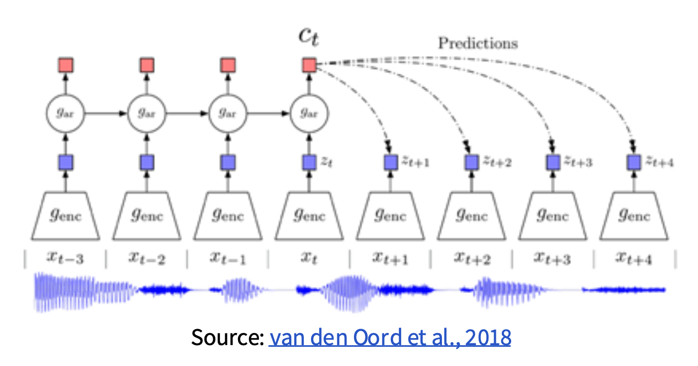
        

**CPC** 全称**对比预测编码**(contrastive predictive coding)，这三个词的含义分别为：

- 对比：使用对比学习区分“正确”和“错误”的**序列**
- 预测：模型必须根据当前的上下文预测**未来的模式**(future patterns)
- 编码：类似于其他的自监督方法，模型学习对用于下游任务而言**有用的特征向量**或“编码”

    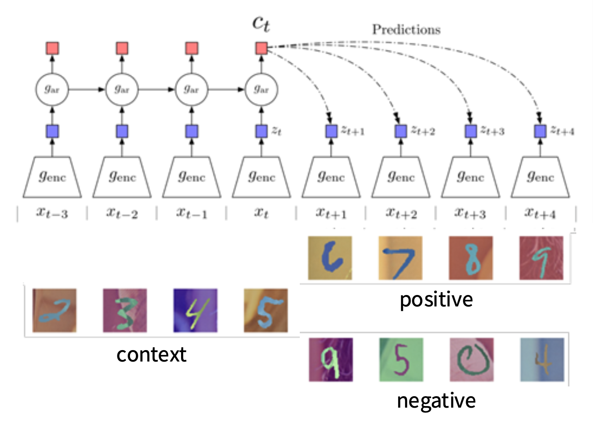

步骤如下：

1. 将所有序列样本编码为向量 $z_t = g_{enc}(x_t)$
2. 使用自回归模型（$g_{ar}$）将上下文（比如一半序列）总结为上下文编码 $c_t$
3. 使用下面给出的**时间依赖的分数函数**计算上下文 $c_t$ 与未来编码 $z_{t+k}$ 之间的 InfoNCE 损失：

    $$
    s_k(z_{t+k}, c_t) = z_{t+k}^T W_t c_t
    $$

    其中 $W_k$ 是可训练的矩阵

???+ example "例子"

    === "例1：为音频序列建模"

        

            
        

        

            
        

    === "例2：为视觉上下文建模"

        想法：将图像分割成块(patch)，从上到下按顺序建模块行，即使用顶部行作为上下文来预测底部行

        

            
        

???+ info "其他例子：MoCo V3"

    

        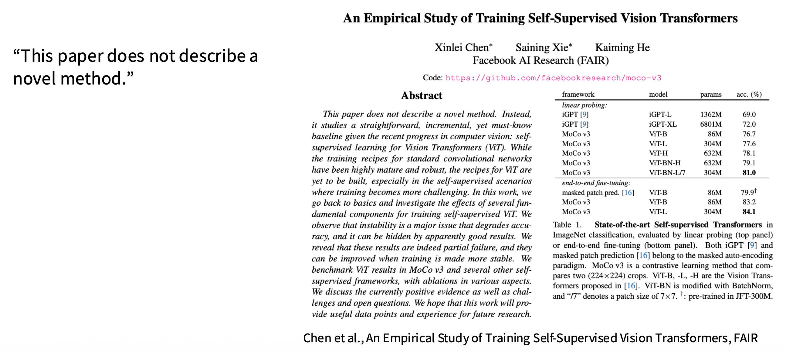
    

### Self-Distillation Without Labels: DINO

**DINO** 是一种无标签的自蒸馏(self-distillation without labels)方法。

    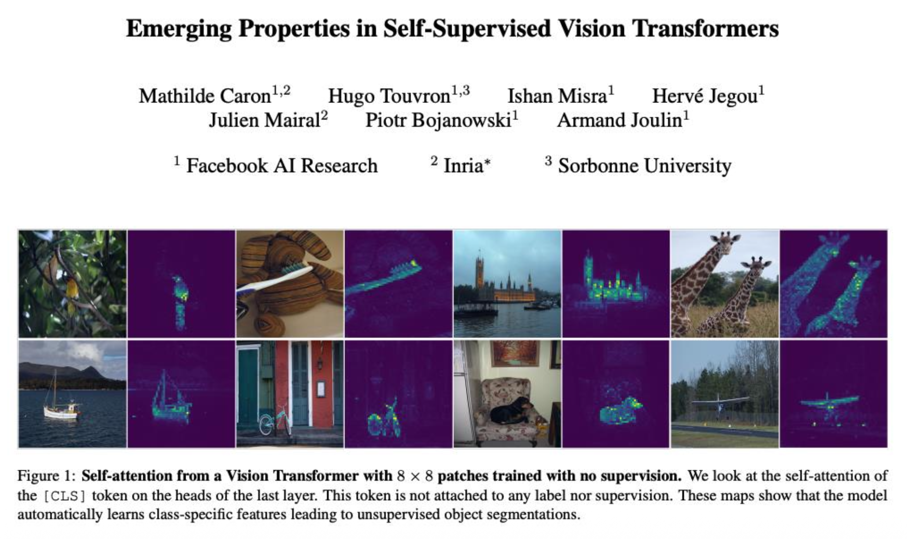

图示：

    

算法的伪代码：

    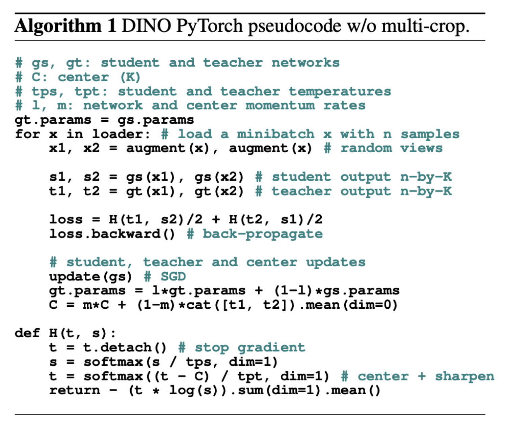

DINO v2：

    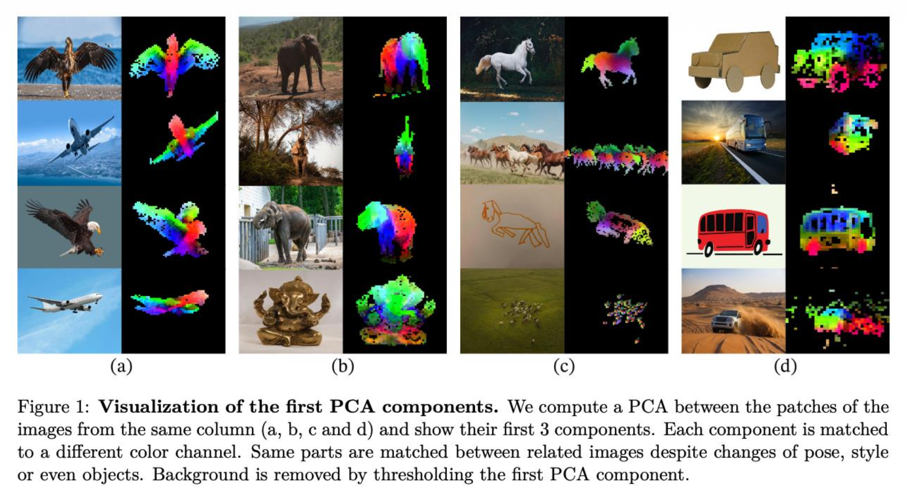

