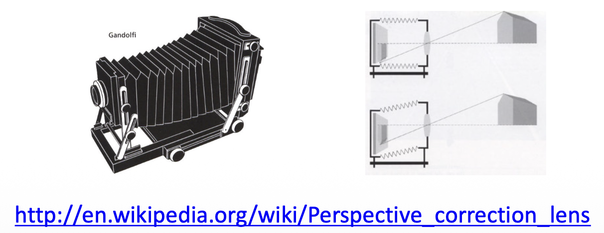

# Image Formation

??? abstract "核心知识"

    比较重要的一讲，涉及很多基础理论。

    - 相机和镜头（透镜）相关的各种概念，比如视场、光圈、景深等
    - 透视投影
        - 齐次坐标
        - 畸变：透视畸变、径向畸变
    - 光度投影：快门、色彩空间、拜耳滤色镜
    - 明确不考的：
        - 正射投影
        - 着色

## Primitives and Transformations

**几何图元**(geometric primitives)是用于描述 3D 形状的基本构建块(basic building blocks)，下面将介绍其中的**点**(points)、**线**(lines)和**面**(planes)，以及一些**最基本的变换**(transformations)。

### 2D Primitives

#### Points

- **非齐次坐标**(inhomogeneous coordinates)形式：$\mathbf{x} = \begin{pmatrix}x \\ y\end{pmatrix} \in \mathbb{R}^2$
- **齐次坐标**(homogeneous coordinates)形式：$\tilde{\mathbf{x}} = \begin{pmatrix}\tilde{x} \\ \tilde{y} \\ \tilde{w}\end{pmatrix} \in \mathbb{P}^2$，其中 $\mathbb{P}^2 = \mathbb{R}^3 \backslash \{(0, 0, 0)\}$ 为**投影空间**(projective space)

注：仅比例不同的齐次向量被认为是相等的，并且它们形成了一个等价类 => 齐次坐标由比例定义

- 非齐次坐标 $\mathbf{x}$ -> 齐次坐标 $\tilde{\mathbf{x}}$

    $$
    \tilde{\mathbf{x}} = \begin{pmatrix}\tilde{x} \\ \tilde{y} \\ \tilde{w}\end{pmatrix} = \begin{pmatrix}x \\ y \\ 1\end{pmatrix} = \begin{pmatrix}\mathbf{x} \\ 1\end{pmatrix} = \bar{\mathbf{x}}
    $$

    其中 $\bar{\mathbf{x}}$ 为**增广向量**(augmented vector)。

- 齐次坐标 -> 非齐次坐标

    $$
    \bar{\mathbf{x}} = \begin{pmatrix}\mathbf{x} \\ 1\end{pmatrix} = \begin{pmatrix}x \\ y \\ 1\end{pmatrix} = \dfrac{1}{\tilde{w}} \tilde{\mathbf{x}} = \dfrac{1}{\tilde{w}} \begin{pmatrix}\tilde{x} \\ \tilde{y} \\ \tilde{w}\end{pmatrix} = \begin{pmatrix}\tilde{x} / \tilde{w}\\ \tilde{y} / \tilde{w}\\ 1\end{pmatrix}
    $$

最后一个元素 $\tilde{w} = 0$ 的齐次坐标被称为**理想点**(ideal points)或**无穷远点**(points at infinity)。这样的点不能被表示成非齐次坐标的形式。

二维齐次坐标和非齐次坐标的几何关系：

    

??? info "额外补充的（为方便复习，隐藏这些不必要的内容）"

    #### Lines

    2D 直线可用齐次坐标表示：$\tilde{\mathbf{l}} = (a, b, c)^T$

    $$
    \{\bar{\mathbf{x}}\ |\ \tilde{\mathbf{l}}^T \bar{\mathbf{x}} = 0\} \quad \Leftrightarrow \quad \{x, y\ |\ ax + by + c = 0\}
    $$

    我们可以**归一化**(normalize) $\tilde{\mathbf{l}}$，使得 $\tilde{\mathbf{l}} = (n_x, n_y, -d)^T = (\mathbf{n}, -d)^T$，其中 $\|\mathbf{n}\|_2 = 1$，其中 $\mathbf{n}$ 是和直线垂直的法向量，$d$ 是到原点的距离。

    一个例外是**无穷远直线**(line at infinity) $\tilde{\mathbf{l}}_\infty = (0, 0, 1)^T$，它经过了所有的理想点。

    ---
    **叉积**(cross product)被表示为斜对称矩阵(skew-symmetric matrix)与向量的乘积。

    $$
    \mathbf{a} \times \mathbf{b} = [\mathbf{a}]_\times \mathbf{b} = \begin{bmatrix}0 & -a_3 & a_2 \\a_3 & 0 & -a_1 \\ -a_2 & a_1 & 0\end{bmatrix} \begin{pmatrix}b_1 \\ b_2 \\ b_3\end{pmatrix} = \begin{pmatrix}a_2b_3 - a_3b_2 \\ a_3b_1 - a_1b_3 \\ a_1b_2 - a_2b_1\end{pmatrix}
    $$

    注：之后我们就约定用方括号表示矩阵，圆括号表示向量。

    ---
    二维直线的算术运算：

    - 齐次坐标下，两条直线的**交**(intersection)为：$\tilde{\mathbf{x}} = \tilde{\mathbf{l}}_1 \times \tilde{\mathbf{l}}_2$
    - 同样地，连接两点的直线可以简写为：$\tilde{\mathbf{l}} = \tilde{\mathbf{x}}_1 \times \tilde{\mathbf{x}}_2$

    ???+ example "例子"

        === "例1"

            

                
            

        === "例2"

            

                
            

    ---
    更复杂的代数对象可以使用**多项式齐次方程**(polynomial homogeneous equations)来表示。例如，**圆锥曲线**()（作为平面与三维圆锥的交线）可以用二次方程来表示：
    $$
    \{\bar{\mathbf{x}}\ |\ \bar{\mathbf{x}}^T \mathbf{Q} \bar{\mathbf{x}} = 0\}
    $$

    

        
    

    这对于多视图几何以及相机校准(camera calibration)很有帮助。

    ### 3D Primitives

    #### Points

    - **非齐次坐标**(inhomogeneous coordinates)形式：$\mathbf{x} = \begin{pmatrix}x \\ y \\ z\end{pmatrix} \in \mathbb{R}^3$
    - **齐次坐标**(homogeneous coordinates)形式：$\tilde{\mathbf{x}} = \begin{pmatrix}\tilde{x} \\ \tilde{y} \\ \tilde{z} \\ \tilde{w}\end{pmatrix} \in \mathbb{P}^3$，其中投影空间 $\mathbb{P}^3 = \mathbb{R}^4 \backslash \{(0, 0, 0, 0)\}$

    #### Planes

    3D 平面可用齐次坐标表示：$\tilde{\mathbf{m}} = (a, b, c, d)^T$

    $$
    \{\bar{\mathbf{x}}\ |\ \tilde{\mathbf{m}}^T \bar{\mathbf{x}} = 0\} \quad \Leftrightarrow \quad \{x, y, z\ |\ ax + by + cz + d = 0\}
    $$

    再次**归一化**(normalize) $\tilde{\mathbf{m}}$，使得 $\tilde{\mathbf{l}} = (n_x, n_y, n_z, -d)^T = (\mathbf{n}, -d)^T$，其中 $\|\mathbf{n}\|_2 = 1$，其中 $\mathbf{n}$ 是和平面垂直的法向量，$d$ 是到原点的距离。

    一个例外是**无穷远平面**(plane at infinity) $\tilde{\mathbf{l}}_\infty = (0, 0, 0, 1)^T$，它经过了所有的理想点。

    

        
    

    #### Lines

    3D 直线的表示不如 2D 直线或 3D 平面优雅。一种可能的表示方法是，将线上的点表示为该线上的两个点 $p$ 和 $q$ 的**线性组合**：

    $$
    \{\mathbf{x}\ |\ \mathbf{x} = (1 - \lambda) \mathbf{p} + \lambda \mathbf{q} \wedge \lambda \in \mathbb{R}\}
    $$

    然而，这种表示法使用了 6 个参数来描述 4 个**自由度**(degree of freedom, **DoF**)（可以自由变化的数据个数）。可行的最小表示法是**双平面参数化**(two-plane parameterization)或[**普吕克坐标**](https://www.wikiwand.com/en/articles/Pl%C3%BCcker_coordinates)(Plücker coordinates)。

    #### Quadrics

    二维圆锥曲线的三维类比是**二次曲面**(quadric surface)。

    $$
    \{\bar{\mathbf{x}}\ |\ \bar{\mathbf{x}}^T \mathbf{Q} \bar{\mathbf{x}} = 0\}
    $$

    

        
    

    这同样在多视图几何研究中非常有用，并且可作为有用的建模基元(modeling primitives)（比如球体、椭球体、圆柱体等）。

    **超二次曲面**(superquadrics)（二次曲面的泛化）用于形状抽象和压缩：

    

        
    

    ### Transformations

    #### 2D Transformations

    

        
    

    - **平移**(translation)：对输入的 2D 平移，2 DoF

        $$
        \mathbf{x}' = \mathbf{x} + \mathbf{t} \quad \Leftrightarrow \quad \bar{\mathbf{x}}' = \begin{bmatrix}\mathbf{I} & \mathbf{t} \\ \mathbf{0}^T & 1\end{bmatrix} \bar{\mathbf{x}}
        $$

        - 使用齐次表示法可以链接/逆转变换
        - 增广向量 $\bar{\mathbf{x}}$ 能始终被替换为一般的齐次形式 $\tilde{\mathbf{x}}$

    - **欧几里得**(Euclidean)变换：2D 平移 + 2D 旋转，3 DoF

        $$
        \mathbf{x}' = \mathbf{Rx} + \mathbf{t} \quad \Leftrightarrow \quad \bar{\mathbf{x}}' = \begin{bmatrix}\mathbf{R} & \mathbf{t} \\ \mathbf{0}^T & 1\end{bmatrix} \bar{\mathbf{x}}
        $$

        - $\mathbf{R} \in SO(2)$ 是一个正交归一旋转矩阵，满足 $\mathbf{RR}^T = \mathbf{I}, \det(\mathbf{R}) = 1$
        - 欧几里得变换保留了欧几里得距离

    - **相似**(similarity)变换：2D 平移 + 可缩放的 2D 旋转，4 DoF

        $$
        \mathbf{x}' = s\mathbf{Rx} + \mathbf{t} \quad \Leftrightarrow \quad \bar{\mathbf{x}}' = \begin{bmatrix}s\mathbf{R} & \mathbf{t} \\ \mathbf{0}^T & 1\end{bmatrix} \bar{\mathbf{x}}
        $$

        - $\mathbf{R} \in SO(2)$ 是一个旋转矩阵，$s$ 是一个任意的缩放因子
        - 相似变换保留了线之间的夹角关系

    - **仿射**(affine)变换：2D 线性变换，6 DoF

        $$
        \mathbf{x}' = \mathbf{Ax} + \mathbf{t} \quad \Leftrightarrow \quad \bar{\mathbf{x}}' = \begin{bmatrix}\mathbf{A} & \mathbf{t} \\ \mathbf{0}^T & 1\end{bmatrix} \bar{\mathbf{x}}
        $$

        - $\mathbf{A} \in \mathbb{R}^{2 \times 2}$ 是一个任意的 $2 \times 2$ 的矩阵
        - 平行线在仿射变换下保持平行

    - **投影**(projective)变换：**单应性**(homography)（一种从一个平面到另一个平面的可逆投影变换），8 DoF

        $$
        \tilde{\mathbf{x}}' = \tilde{\mathbf{H}} \tilde{\mathbf{x}} \quad \left(\bar{\mathbf{x}} = \dfrac{1}{\tilde{x}} \tilde{\mathbf{x}}\right)
        $$

        - $\tilde{\mathbf{H}} \in \mathbb{R}^{3 \times 3}$ 是一个任意的齐次 $3 \times 3$ 的矩阵（按比例指定）
        - 投影变换保留了直线

    ---
    在协变向量(co-vector)上的 2D 变换：考虑任意的 2D 透视变换 $\tilde{\mathbf{x}}' = \tilde{\mathbf{H}} \tilde{\mathbf{x}}$，变换后的 2D 直线方程由 $\tilde{\mathbf{I}'}^T \tilde{\mathbf{x}}' = \tilde{\mathbf{I}'}^T \tilde{\mathbf{H}} \tilde{\mathbf{x}} = (\tilde{\mathbf{H}}^T \tilde{\mathbf{I}'}) \tilde{\mathbf{x}} = \tilde{\mathbf{I}}^T \tilde{\mathbf{x}} = 0$，因此得到
    $$
    \tilde{\mathbf{I}'} = \tilde{\mathbf{H}}^{-T} \tilde{\mathbf{I}}
    $$

    因此，投影变换对一个 2D 直线或 3D 法向量等共向量的作用可以表示为矩阵转置的逆。

    !!! abstract "总结"

        

            
        

        - 这些变换构成嵌套的组集（在复合和逆运算下封闭）
        - 可将变换看成作用于二维齐次坐标上的受限 3×3 矩阵
        - 变换保持相似性（平行关系、直线）不变

    #### 3D Transformations

    将 2D 变换扩展至 3D 上“

    

        
    

    - 3D 变换的定义类比 2D 变换
    - 3×4 的矩阵通过添加第四行 $\begin{bmatrix}\mathbf{0}^T & 1\end{bmatrix}$ 来扩展，以实现齐次变换
    - 变换保持相似性（平行关系、直线）不变

    #### Direct Linear Transform for Homography Estimation

    从一组二维对应关系中估计单应性矩阵的方法为：

    - 令 $\mathcal{X} = \{\tilde{\mathbf{x}}_i, \tilde{\mathbf{x}}_i'\}_{i=1}^N$ 表示一个包含 N 个 2D-to-2D 的关于 $\tilde{\mathbf{x}}' = \tilde{\mathbf{H}} \tilde{\mathbf{x}}$ 对应关系的集合
    - 由于对应向量是齐次的，它们方向相同但大小不同，因此上述方程可表示为 $\tilde{\mathbf{x}}' \times \tilde{\mathbf{H}} \tilde{\mathbf{x}} = \mathbf{0}$
    - 使用 $\tilde{\mathbf{h}}_k^T$ 表示 $\tilde{\mathbf{H}}$ 的第 $k$ 行，这可以被重写为关于 $\tilde{\mathbf{h}}$ 的线性方程：

        $$
        \begin{gathered}\underbrace{\begin{bmatrix}\mathbf{0}^T&-\tilde{w}_i^{\prime}\tilde{\mathbf{x}}_i^T&\tilde{y}_i^{\prime}\tilde{\mathbf{x}}_i^T\\\tilde{w}_i^{\prime}\tilde{\mathbf{x}}_i^T&\mathbf{0}^T&-\tilde{x}_i^{\prime}\tilde{\mathbf{x}}_i^T\\-\tilde{y}_i^{\prime}\tilde{\mathbf{x}}_i^T&\tilde{x}_i^{\prime}\tilde{\mathbf{x}}_i^T&\mathbf{0}^T\end{bmatrix}}_{\mathbf{A}_i}\underbrace{\begin{bmatrix}\tilde{\mathbf{h}}_1\\\tilde{\mathbf{h}}_2\\\tilde{\mathbf{h}}_3\end{bmatrix}}_{\tilde{\mathbf{h}}}=\mathbf{0}\end{gathered}
        $$

        最后一行与前三行线性相关，可以删除。

    - 每个点对应产生两个方程。将所有方程堆叠成一个 $2N \times 9$ 维的矩阵 $A$，从而形成以下**约束的最小二乘问题**(constrained least squares problem)

        $$
        \begin{aligned}\tilde{\mathbf{h}}^{*}&=\underset{\tilde{\mathbf{h}}}{\operatorname*{\operatorname*{argmin}}}\left\|\mathbf{A}\tilde{\mathbf{h}}\right\|_2^2+\lambda(\left\|\tilde{\mathbf{h}}\right\|_2^2-1)\\&=\underset{\tilde{\mathbf{h}}}{\operatorname*{\operatorname*{argmin}}}\tilde{\mathbf{h}}^T\mathbf{A}^T\mathbf{A}\tilde{\mathbf{h}}+\lambda(\tilde{\mathbf{h}}^T\tilde{\mathbf{h}}-1)\end{aligned}
        $$

        其中固定 $\|\tilde{\mathbf{h}}\|_2 = 1$，因为 $\tilde{\mathbf{H}}$ 是齐次的（即仅通过比例定义）且我们不关心平凡解 $\tilde{\mathbf{h}} = 0$。上述优化问题的解是 $\mathbf{A}$ 的最小奇异值对应的**奇异向量**(singular vector)（即分解 $\mathbf{A} = \mathbf{UDV}^T$ 时 $\mathbf{V}$ 的最后一列）。

    上述算法就叫做**直接线性变换**(direct linear transformation)。

    ???+ example "应用：全景拼接(panorama stitching)"

        

            
        

## Camera and Lens

### Pinhole Camera

了解成像的第一步是理解**相机**(camera)的原理，所以我们先来思考一下如何设计一台相机。一种简单的想法是直接把一片薄膜(film)放在物体面前——毫无疑问，该方法以失败告终，因为没法做到物体上一点和薄膜上的点一一映射。

    

于是我们在物体和薄膜之间加一块挡板，以阻挡大多数的光线，由此得到了一台简陋的**针孔相机**(pinhole camera)。中间的开口被称为**光圈**(aperture)。

    
    

>注：针孔相机的基本原理可追溯至墨子和亚里士多德的年代。

??? info "针孔相机的起源追溯"

    

        
    

    

        
    

??? note "注"

    

        
    

    - 在物理针孔相机中，投影在像平面上的图像是颠倒的，此时像平面位于焦点(focal point)的**后方**
    - 之后建模透视投影时，我们假设像平面在焦点**前方**
    - 这两种模型是等价的，只是对图像坐标的合理改变

人们发现，**光圈越小，成像就越清晰**。但我们不会让光圈无止尽地小下去，这是因为：

- 光圈越小，通过的光也就越少，成像就会变得很暗
- **衍射**(diffraction)效应：当光圈尺寸和光的波长相当甚至更小时，通过光圈后会偏离直线传播路径并发生弯曲扩散，自然难以形成清晰的像

    

### Lens

**透镜**(lens)（或镜头）有着和针孔相同的投影原理，但是它能让更多的光进来，并让这些光汇聚起来。

    

高斯成像公式：$\dfrac{1}{i} + \dfrac{1}{o} = \dfrac{1}{f}$，其中 $i, o, f$ 分别为像距、物距和**焦距**(focal length)。

    

当 $o = \infty$ 时（对于下图，物体是太阳，离透镜很远很远，可看作无穷远），$f = i$。

    

透镜可用于**图像放大**(image magnification)，放大率为 $m = \dfrac{h_i}{h_o} = \dfrac{i}{o}$

    

相机通过改变焦距来放大图像：

    

???+ question "思考"

    === "问题"

        为什么 $f$ 越大图像越大（即 $m$ 越大）？

    === "解答"

        $$
        \begin{cases}
        \dfrac{1}{i} + \dfrac{1}{o} = \dfrac{1}{f} \Rightarrow i = \dfrac{of}{o - f} \\
        m = \dfrac{h_i}{h_o} = \dfrac{i}{o}
        \end{cases}
        \Rightarrow m = \dfrac{f}{o - f}
        $$

        因此 $f$ 越大，分子越大，分母越小，$m$ 显然会变大。

从另一个角度看，调整焦距的同时也改变了**视场**(field of view, **FOV**)：焦距越长，视角更窄；焦距越短，视角越宽。

    

???+ example "例子"

    

        
    

除焦距外，FOV 还取决于传感器的大小。

    

---
在相机中，**光圈**是指镜头的受光区域，一般用**镜头直径**区分。可通过增减光圈大小来控制图像亮度。

    

一种更方便的表示光圈的方法是使用一个关于焦距的分数，即 $D = \dfrac{f}{N}$，其中 $N$ 为**焦比**(F-number)。比如对于 50mm 的焦距，当光圈完全打开时，焦比为 1.8（此时光圈直径为 27.8mm）。

---
**镜头失焦**(lens defocus)问题：

- 假设物体位于黄色虚线处时，物体的光线进入透镜后正好在底片处汇聚成一点，因此成像很清晰

    

        
    

- 但如果稍微改变物体的位置，比如靠近些，那么对应的像就会远离镜头（同时也远离底片，符合高斯成像公式的约束），来自物体的光在底片处就会形成一片光斑（**模糊圈**(blue circle)或**弥散圈**(circle of confusion)），如图中加粗的橙色实线部分所示

    

        
    

可利用相似三角形解出光斑直径 $b$：$\dfrac{b}{D} = \dfrac{|i' - i|}{i'} \Rightarrow b = \dfrac{D}{i'}|i' - i|, b \propto D \propto \dfrac{1}{N}$

???+ example "例子"

    

        
    

当物体位置不动时，要想对好焦，可以从以下几方面考虑：

- 只移动底片（右上）
- 只移动镜头位置（左下）
- 两者也可同时移动（右下）

    

**景深**(depth of field, **DoF**)：一种物体距离范围，在范围内（即模糊度 $b$ 小于像素尺寸的范围）的图像能够对好焦。

    

原理图如下：

    

- $c = \dfrac{f^2(o - o_1)}{No_1(o - f)} = \dfrac{f^2(o_2 - o)}{No_2(o - f)}$
- $\text{DoF} = o_2 - o_1 = \dfrac{2of^2cN(o - f)}{f^4 - c^2N^2(o - f)^2}$
- **减小光圈直径（增大焦比）会增加 DoF**

???+ question "如何模糊背景？"

    { align=right width=20% }

    - 更大的光圈
    - 更长的焦距
    - 前景要近
    - 背景要远

??? note "色差(chromatic aberration)"

    

        
    

    - 玻璃的**折射率**(index of refraction)随波长的变化而略有不同
    - 因此，简单透镜存在**色差**问题，这是指不同颜色的光倾向于在略微不同的距离上聚焦（模糊，颜色偏移）
    - 为了减少色差和其他类型的像差，大多数摄影镜头都是由不同玻璃元件（具有不同涂层）组成的复合镜头

    ???+ example "例子"

        

            
        

??? note "暗角(vignetting)"

    

        
    

    **暗角**是亮度向图像边缘衰减的趋势，它由两种效果组成：自然暗角和机械暗角。

    - **自然暗角**(natural vignetting)：物体表面和镜头光圈的缩短
    - **机械暗角**(mechanical vignetting)：光束的阴影部分从未达到图像

    暗角可以进行校准（即撤销）。

    ???+ example "例子"

        

            
        

## Geometric Image Formation

相机模型描述了三维世界和二维图像之间的几何关系。

    

两类投影模型：

- **正射投影**(orthographic projection)
- **透视投影**(perspective projection)

    

    

??? note "为便于复习，隐藏了正射投影的部分"

    ### Orthographic Projection

    3D 点 $\mathbf{x}_c \in \mathbb{R}^3$ 到像素坐标 $\mathbf{x}_s \in \mathbb{R}^2$ 的**正射投影**(orthographic projection)：

    

        
    

    - 相机和图像坐标系的 x, y 轴是共享的
    - 光线与相机坐标系 z 坐标平行
    - 在投影过程中，z 坐标被舍弃，x 和 y 坐标保持不变
    - 注：为清晰起见，此处未显示 y 坐标，但其行为和上图的 x 坐标类似

    正射投影仅将 3D 点在相机坐标 $\mathbf{x}_c$ 中的 **z 分量丢弃**，以获得图像平面（即屏幕）上的对应 2D 点 $\mathbf{x}_s$。

    $$
    \mathbf{x}_s=\begin{bmatrix}1&0&0\\0&1&0\end{bmatrix}\mathbf{x}_c\quad\Leftrightarrow\quad\mathbf{\bar{x}}_s=\begin{bmatrix}1&0&0&0\\0&1&0&0\\0&0&0&1\end{bmatrix}\mathbf{\bar{x}}_c
    $$

    - 对于远心镜头(telecentric lenses)而言，正射投影是精确的；而对于长焦镜头(telephoto lenses)来说，它是一种近似
    - 经过投影后，无法恢复 3D 点到图像的距离

    实际上，世界坐标（可能以米为单位测量尺寸）必须进行缩放以适应图像传感器（以像素为单位测量），因此就有了**比例正射投影**(scaled orthographiy)。

    $$
    \mathbf{x}_s=\begin{bmatrix}s&0&0\\0&s&0\end{bmatrix}\mathbf{x}_c\quad\Leftrightarrow\quad\mathbf{\bar{x}}_s=\begin{bmatrix}s&0&0&0\\0&s&0&0\\0&0&0&1\end{bmatrix}\mathbf{\bar{x}}_c
    $$

    - 备注：$s$ 的单位为 px/m 或 px/mm，用于将公制 3D 点转换为像素
    - 在正交投影下，结构和运动可以通过因子分解方法（比如通过奇异值分解）同时估计

    ???+ example "例子"

        

            
        

### Perspective Projection

**透视投影**(perspective projection)：三维世界坐标 -> 二维图像坐标

    

$$
p = \begin{bmatrix}u \\ v\end{bmatrix} = \begin{bmatrix}\dfrac{fx}{z} \\ \dfrac{fy}{z}\end{bmatrix}
$$

在齐次坐标表示中，透视投影就是一个简单的线性变换（矩阵乘法）：

$$
\begin{bmatrix}f & 0 & 0 & 0 \\ 0 & f & 0 & 0 \\ 0 & 0 & 1 & 0\end{bmatrix} \begin{bmatrix}x \\ y \\ z \\ 1\end{bmatrix} = \begin{bmatrix}fx \\ fy \\ z\end{bmatrix} \cong \begin{bmatrix}\frac{fx}{z} \\ \frac{fy}{z} \\ 1\end{bmatrix}
$$

物体上两点在像平面上的透视投影：

    

<!-- 

    

- 光线穿过相机中心、像素 $\mathbf{x}_s$ 和点 $\mathbf{x}_c$
- 约定：主轴(principal axis)（垂直于图像平面）与 z 轴对齐
- 注：为清晰起见，此处未显示 y 坐标，但其行为类似

在透视投影中，相机坐标系中的三维点通过**除以 z 分量**，并乘以焦距来映射到图像平面。

$$
\begin{pmatrix}x_s\\y_s\end{pmatrix}=\begin{pmatrix}fx_c/z_c\\fy_c/z_c\end{pmatrix}\quad\Leftrightarrow\quad\tilde{\mathbf{x}}_s=\begin{bmatrix}f&0&0&0\\0&f&0&0\\0&0&1&0\end{bmatrix}\bar{\mathbf{x}}_c
$$

在使用**齐次坐标**时，透视投影是**线性的**。投影后无法从图像中恢复三维点的距离。

>注：f 的单位为像素（px）。

为确保像素坐标为正值，通常会增加一个**主点偏移量**(principal point offset) $\mathbf{c}$，这会将图像坐标系移动到图像平面的角落。

    

**完整的透视投影模型**如下：

$$
\begin{gathered}\begin{pmatrix}x_s\\y_s\end{pmatrix}=\begin{pmatrix}f_xx_c/z_c+sy_c/z_c+c_x\\f_yy_c/z_c+c_y\end{pmatrix}\quad\Leftrightarrow\quad\tilde{\mathbf{x}}_s=\begin{bmatrix}\textcolor{red}{f_x}&\textcolor{red}{s}&\textcolor{red}{c_x}&0\\\textcolor{red}{0}&\textcolor{red}{f_y}&\textcolor{red}{c_y}&0\\\textcolor{red}{0}&\textcolor{red}{0}&\textcolor{red}{1}&0\end{bmatrix}\bar{\mathbf{x}}_c\end{gathered}
$$

- 投影矩阵中左半边的 3x3 的子矩阵叫做**校准矩阵**(carlibration matrix) $\textcolor{red}{\mathbf{K}}$
- $\textcolor{red}{\mathbf{K}}$ 的参数叫做**相机内参**(camera intrinsics)（与外部位姿(external pose)相对）
- $f_x, f_y$ 是独立，以允许不同的像素宽高比
- 由于传感器的安装并没有垂直于光轴，因此有偏斜(skew) $s$
- 实际上我们通常设 $f_x = f_y, s = 0$，但模型 $\mathbf{c} = (c_x, c_y)^T$ -->

<!-- #### Chaining Transformations

设 $\mathbf{K}$ 为校准矩阵（内参）和 $[\mathbf{R}|\mathbf{t}]$ 为相机姿态（外参）。我们**将这两个变换链接起来**(chaining)，从而将世界坐标系中的点投影到图像上：

    

$$
\begin{align*}
\tilde{\mathbf{x}}_s & = [\mathbf{K} \quad \mathbf{0}] \\ \bar{\mathbf{x}}_c & = [\mathbf{K} \quad \mathbf{0}]
\begin{bmatrix}
\mathbf{R} & \mathbf{t} \\
\mathbf{0}^T & 1
\end{bmatrix}
\bar{\mathbf{x}}_w = \mathbf{K} [\mathbf{R} \quad \mathbf{t}] \bar{\mathbf{x}}_w = \mathbf{P} \bar{\mathbf{x}}_w
\end{align*}
$$

注：3x4 的投影矩阵 $\mathbf{P}$ 可被预先计算出来。 -->

<!-- #### Full Rank Representation

有时用满秩的 4x4 投影矩阵表示可能更好：

$$
\tilde{\mathbf{x}}_s=\begin{bmatrix}\mathbf{K}&\mathbf{0}\\\mathbf{0}^T&1\end{bmatrix}\begin{bmatrix}\mathbf{R}&\mathbf{t}\\\mathbf{0}^T&1\end{bmatrix}\bar{\mathbf{x}}_w=\tilde{\mathbf{P}}\bar{\mathbf{x}}_w
$$

现在齐次向量 $\tilde{\mathbf{x}}_s$ 是一个 4D 向量且必须相对于其第三个元素进行归一化，以获得非齐次的图像像素：

$$
\bar{\mathbf{x}}_s=\tilde{\mathbf{x}}_s/z_s=(x_s/z_s,y_s/z_s,1,1/z_s)^T
$$

请注意，非齐次的 4D 向量的第4个分量是**逆深度**(inverse depth)。如果已知逆深度，可以通过计算 $\tilde{\mathbf{x}}_w=\tilde{\mathbf{P}}^{-1}\bar{\mathbf{x}}_s$ 并随后对 $\tilde{\mathbf{x}}_w$ 的第四项进行归一化，从其像素坐标中恢复出三维点。 -->

#### Properties

投影可能会很带来一些小麻烦，或者也可以认为是产生一些有意思的错觉。

???+ example "例子"

    === "投影"

        明明是画在地面（二维平面）上的，但这个地球看起来就像个立体的物体。

        

            
        

    === "换个角度看..."

        

            
        

    >视频链接：[Making of 3D sidewalk art](http://www.youtube.com/watch?v=3SNYtd0Ayt0)

一个投影可能对应无数种不同的物体形状：

    

透视投影的性质：

- 保留了直线“**直**”的性质

    

        
    

- 但是**长度**和**角度**关系却被丢失了
    - 长度

        

            
        

    - 角度

        

            
        

由于角度变化，两条在物理世界平行的线会在图像中汇聚于一点（即**灭点**(vanishing point)）。

    
    

性质：

- 任意两条平行线之间都有一个共同的灭点 v
- 来自相机上一点 C 的通过 v 的射线与直线平行
    - 因此 v 能够反映**直线的方向**
    - v 可能在图像外，甚至无穷远处

由于平面上任意两条平行线定义了一个灭点，这些灭点的并集就构成了一条**灭线**(vanishing line)。

    

需要注意的是，不同的平面会产生不同的灭线，因此灭线包含了**平面朝向**的信息。

    

???+ example "例子"

    === "地平线"

        

            
        

    === "透视效应"

        

            
        

#### Perspective Distortion

观察左图这幅建筑照片，不难发现建筑物的垂线是歪斜的，延伸后可汇聚于一点。

    
    

用更一般的说法来表述：这是一种**透视畸变**(perspective distortion)现象，顾名思义是由透视投影引起的。原因便是透视投影会改变物体原有的长度和角度的性质。

    

我们的预期是得到像右图那样的效果，那么该如何实现呢？解决方案就是使用**移轴相机**(view camera)（镜头相对于胶片移动）。

    

???+ example "例子"

    

        
        
    

    

        
    

    可以看到，越远离相机中心，物体在图像上的畸变越明显。

需要注意的是，这一类畸变并**不是**由镜头的瑕疵引起的。

<!-- 线性投影假设（直线保持为“直线”）在实践中因相机镜头特性引入的扭曲而被违背。其中**径向和切向扭曲**(radial and tangential distortion)效应都可以相对容易地建模：

$$
\begin{aligned}\mathbf{x}^{\prime}&=\underbrace{(1+\kappa_1r^2+\kappa_2r^4)}_{\text{Radial Distortion}}\begin{pmatrix}x\\y\end{pmatrix}+\underbrace{\begin{pmatrix}2\kappa_3xy+\kappa_4(r^2+2x^2)\\2\kappa_4xy+\kappa_3(r^2+2y^2)\end{pmatrix}}_{\text{Tangential Distortion}}\\\mathbf{x}_s&=\begin{pmatrix}f_xx^{\prime}+c_x\\f_yy^{\prime}+c_y\end{pmatrix}\end{aligned}
$$

- 图像可以被**去扭曲**(undistorted)，使得透视投影模型适用
- 对于广角镜头(wide-angle lenses)（例如鱼眼镜头），必须使用更复杂的扭曲模型

    

 -->

### Radial Distortion

**径向畸变**(radial distortion)是另一类畸变。和透视畸变明显不同的一点在于物体的直线性质也没在图像上保持，被扭曲成了各种曲线。径向畸变大致可分为：

- **枕形**(pin cushion)畸变 <- **长焦**镜头
- **桶形**(barrel)畸变 <- **广角**镜头

    

- 这类畸变由镜头瑕疵引起
- 对于通过透镜边缘的光线更明显

公式表示：

$$
\begin{aligned}
r^2 &= {x'_n}^2 + {y'_n}^2 \\
x'_d &= x'_n(1 + \kappa_1 r^2 + \kappa_2 r^4) \\
y'_d &= y'_n(1 + \kappa_1 r^2 + \kappa_2 r^4)
\end{aligned}
$$

其中：

- $x'_n, y'_n$：理想情况下透视投影的坐标
- $r$：该点离图像中心的距离
- $\kappa_1, \kappa_2$：和镜头相关的（导致图像畸变的）参数，可以利用标定板计算出来
    - 可以利用这些参数实现对畸变图像的校正

???+ example "例子"

    === "例1"

        

            
        

        照片中的地平线是圆的，不是因为地球是圆的，其实只是因为广角镜头发生了径向畸变（这里是桶形畸变）。

    === "例2"

        

            
        

        这里用长焦镜头拍摄，导致枕形畸变发生。

    === "例3"

        

            
        

        长焦镜头的枕形畸变自带“瘦脸”效果。

    === "例4"

        矫正径向扭曲（利用前面介绍的公式）：

        

            
        

## Photometric Image Formation

**光度成像**(photometric image formation)描述了三维世界的物理性质和二维图像的颜色之间的关系。

    

<!-- **图像感知管道**(image sensing pipeline)分为三个阶段：

    

- 相机镜头/机身中的**物理光传输**
- 传感器芯片上的**光子测量**和转换
- **图像信号处理**(image signal processing, ISP)和图像压缩 -->

图像传感器：

    

CMOS（全称互补金属氧化物半导体(complimentary metal-oxide semiconductor)）（光子 -> 电子 -> 电压）：

    

### Shutter

**快门**(shutter)：

    

- **焦平面快门**(focal plane shutter)位于图像传感器/胶片正前方
- 多数数码相机采用机械与电子快门相结合的方式
- 快门速度**通过控制曝光时间来改变到达传感器的光量**
    - 像素值 = 光强在曝光时间内的积分
- 它决定图像是否过曝、欠曝、模糊或出现噪点

**卷帘快门效应**(rolling shutter effect)：拍摄扇叶或螺旋桨等高速运动的物体时产生的一种图像畸变现象。

    

??? example "例子"

    

        
    

更多内容见这篇[帖子](https://www.lensrentals.com/blog/2021/07/understanding-the-difference-in-global-and-rolling-shutters/)。

<!-- ---
传感器：

    

- **CCD** 通过将电荷从像素间传递并在输出节点转换为电压来工作
- **CMOS** 图像传感器在每个像素内部将电荷转换为电压，并且现在已经成为标准
- 更大尺寸的芯片（全画幅等于35毫米）具有更高的感光度 -> 噪声更小

--- -->
<!-- **滤色镜阵列**(color filter array)

    

- 为测量颜色，像素被排列成色彩阵列，例如：拜耳(Bayer) RGB 模式
- 每个像素缺失的颜色通过邻近像素进行插值（去马赛克）

    

    

- 每个像素根据其光谱灵敏度(spectral sensitivity) $S$，**对光频谱(light spectrum) $L$ 进行积分**：

    $$
    R=\int L(\lambda)S_R(\lambda)d\lambda
    $$

- 光谱响应曲线由相机制造商提供

???+ example "例子"

    

        
    
 -->

### Color Space

**色彩空间**(color space)：

    

- RGB

    

        
    

- HSV

    

        
    

??? note "Gamma 压缩"

    

        
    

    - 人类对较暗区域的光强差异更为敏感
    - 因此，在离散化（左图）之前**非线性地变换**光强或颜色是有益的，并在加载时撤销此变换

??? note "图像压缩"

    

        
    

    - 通常，亮度(luminance)的压缩保真度高于色度(chrominance)
    - 常采用基于（8×8像素）块状的离散余弦或小波变换
    - ***离散余弦变换**(discrete cosine transform, DCT)是对自然图像主成分分析(PCA)的一种近似
    - 系数被量化为整数，可通过哈夫曼编码存储
    - 近年来，人们开发出基于深度网络的压缩算法

### Images in Computer

Python 中的图像：

- 用矩阵表示一个图像
- 假设有一个 NxM 的图像叫做 `im`
    - `im(0, 0, 0)`：左上角的像素在 R 通道的值
    - `im(y-1, x-1, b-1)`：向下 y 个像素，向右 x 个像素的像素在第 b 个通道上的值
    - `im(N-1, M-1, 2)`：右下角的像素在 B 通道的值

    

### Practical Color Sensing: Bayer Filter

使用**拜耳滤色镜**(Bayer filter)实现在单个芯片上的 RGB 感知。

    

可以看到，在一个 2x2 的单元中包含 1 个红色、1 个蓝色和 2 个绿色像素。之所以**绿色更多**些，是因为人眼对绿色（所在波长的光）更敏感，因此用更多的绿色就能让人觉得图像更明亮清晰。

    

### Shading

前面探讨的都是单束光线在空间中的传播，现在就从像素强度和色彩的角度来看图像是如何形成的。光线由一个或多个光源**发出**(emit)，并在场景中物体（或介质）的表面**反射**(reflect)或**折射**(refract)（一次或多次）。

    

后续详细内容见《计算机图形学》“着色”一节的[笔记](../../software/cg/5.md#blinn-phong-reflectance-model)。

