# Generative Models

## Supervised vs Unsupervised Learning

- **监督学习**(supervised learning)：
    - 数据：(x, y)，其中 x 是数据，y 是标签
    - 目标：习得一个 x -> y 的函数

    ???+ example "例子"

        === "分类(classification)"

            <div style="text-align: center">
                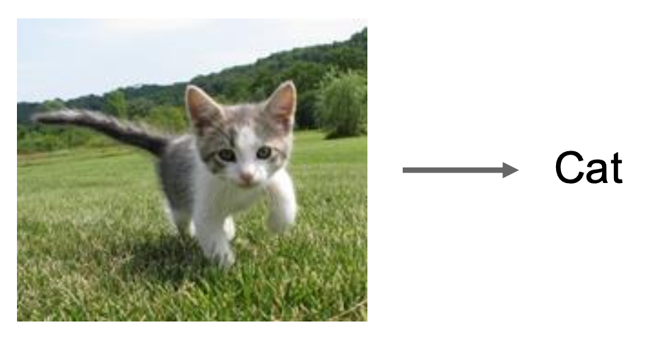
            </div>

        === "图像描述(image captioning)"

            <div style="text-align: center">
                
            </div>

        === "目标检测(object detection)"

            <div style="text-align: center">
                
            </div>

        === "语义分割(semantic segmentation)"

            <div style="text-align: center">
                
            </div>

- **无监督学习**(unsupervised learning)：
    - 数据：x（只有数据，没有标签）
    - 目标：习得数据背后的隐藏结构
    - 例子：聚类、、特征学习、密度估计等

    ???+ example "例子"

        === "K 均值聚类(K-means clustering)"

            <div style="text-align: center">
                
            </div>

        === "主成分分析(principal component analysis)（降维(dimensionality reduction)）"

            <div style="text-align: center">
                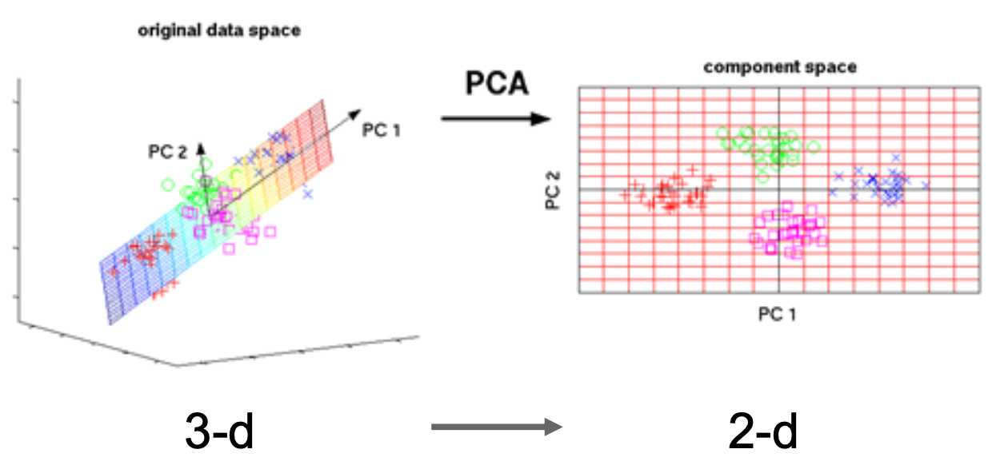
            </div>

        === "密度估计(density estimation)"

            <div style="text-align: center">
                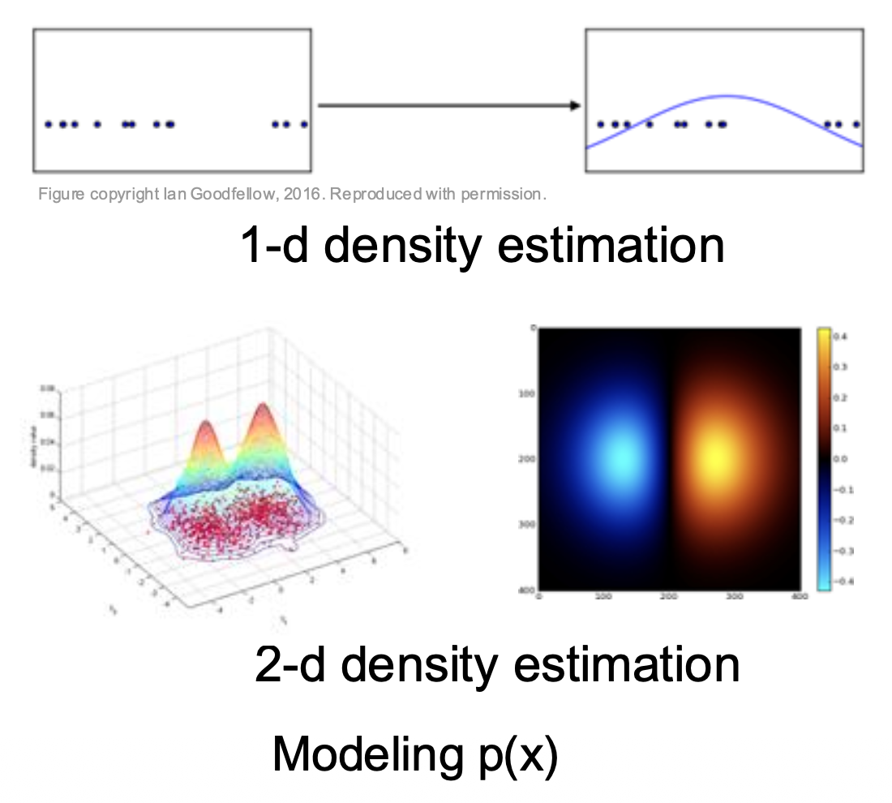
            </div>


## Generative vs Discriminative Models

???+ info "约定"

    - $x$ 为数据， $y$ 为标签
    - 回顾：
        - 概率密度函数的归一化性质：$\int_X p(x) dx = 1$
        - 贝叶斯定理：$P(x|y) = \dfrac{P(y|x)}{P(y)} P(x)$

- **确定型模型**(discrimitive model)：习得概率分布 $p(y|x)$
    - 每张图片的可能标签在概率上相互竞争，而图片之间无竞争

        <div style="text-align: center">
            
        </div>

    - 无法处理不合理的输入，必须为所有可能的输入提供标签的分布

        <div style="text-align: center">
            
        </div>

    - 将标签赋予数据 ->（带标签的）特征学习

- **生成式模型**(generative model)：习得概率分布 $p(x)$
    - 所有可能的图像都将争夺概率
    - 需要对图像有深度的理解：比如狗是坐着还是站着，3 条腿的狗是否比 3 条手臂的猴子更多（？）
    - 通过给定很小的概率值来“拒绝”不合理的输入

    <div style="text-align: center">
        
    </div>

    - 检测异常点 ->（无标签的）特征学习，采样以生成最新的数据

- **条件生成式模型**(conditional generative model)：习得 $p(x|y)$
    - 每个可能的标签在所有可能的图像中引发竞争

    <div style="text-align: center">
        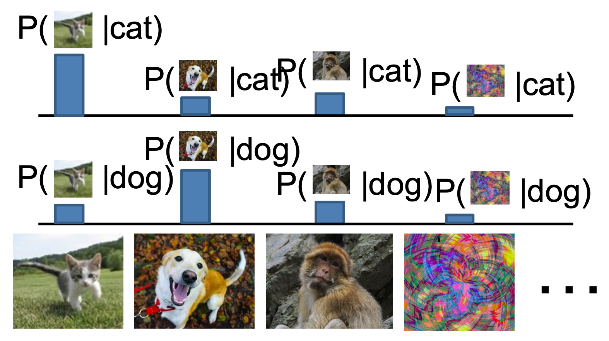
    </div>

    - 根据贝叶斯定理，可以根据上面两个模型构造条件生成式模型，但实际上这种做法并不常见
    - 赋予标签的同时拒绝异常点
    - 采样以根据标签生成数据

后两个模型都属于生成式模型，且后者在实际中最为常用。


## Why Generative Models?

使用生成式模型的主要原因是**建模模糊性**(modeling ambiguity)的特性：对于输入 $y$，有许多可能的输出 $x$（其概率为 $P(x|y)$）。基于这一特性，生成式模型有以下常见应用：

- **语言建模**(language modeling)：根据输入文本 $y$ 输出文本 $x$

    <div style="text-align: center">
        
    </div>

- **文生图**(text to image)：根据输入文本 $y$ 输出图像 $x$

    <div style="text-align: center">
        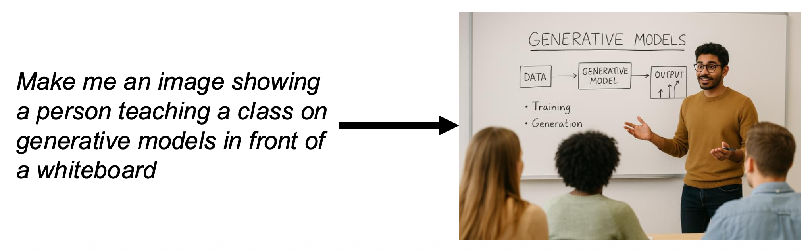
    </div>

- **图生视频**(image to video)：预测接下来发生什么

    <div style="text-align: center">
        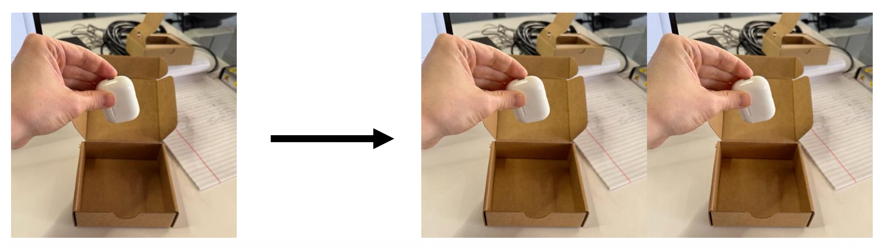
    </div>

???+ abstract "生成式模型的分类(taxonomy)"

    <div style="text-align: center">
        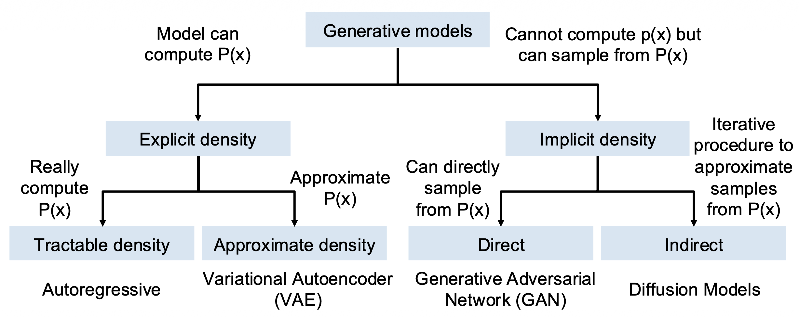
    </div>


## Autoregressive Models

### Maximum Likelihood Estimation

**自回归模型**(autoregressive models)的目标是：写下一个显式函数 $p(x) = f(x, W)$

对于给定数据集 $x^{(1)}, x^{(2)}, \dots, x^{(N)}$，通过解以下方程来训练模型：

$$
\begin{aligned}
W^{*} &= \arg \max_{W} \prod_{i} p(x^{(i)}) \\
&= \arg \max_{W} \sum_{i} \log p(x^{(i)}) \\
&= \arg \max_{W} \sum_{i} \log f(x^{(i)}, W)
\end{aligned}
$$

- 第一行：最大化训练数据的概率（**最大似然估计**(maximum likelihood estimation)）
- 第二行：对数技巧：乘积 -> 求和
- 第三行：最终的损失函数，使用梯度下降将其最大化


### Autoregressive Models

假设 $x$ 是一个序列，即 $x = (x_1, x_2, \dots, x_T)$，那么可以使用概率的链式法则求解：

$$
\begin{aligned}
p(x) &= p(x_{1}, x_{2}, x_{3}, ..., x_{T}) \\
&= p(x_{1}) p(x_{2} \mid x_{1}) p(x_{3} \mid x_{1}, x_{2}) \dots \\
&= \prod_{t=1}^{T} p(x_{t} \mid x_{1}, \dots, x_{t-1})
\end{aligned}
$$

这和 RNN 的思路很像，也和掩码 Transformer 很像。

<div class="grid cards" markdown>

-   RNN

    <figure markdown="span">
        { width=70% }
        <figcaption></figcaption>
    </figure>

-   掩码 Transformer

    <figure markdown="span">
        { width=50% }
        <figcaption></figcaption>
    </figure>

</div>


### Autoregressive Models of Images

{ align=right width=30% }

- 将图像看作一个包含多个 8 位**子像素**(subpixel)值的序列（按扫描顺序）
- 将每个子像素预测为在 256 个值 [0 ... 255] 中的分类
- 使用 RNN 或 Transformer 建模
- 问题：成本太高，比如 1024x1024 的图像就是一个包含 3M 个子像素的序列
- 解决方法：将图像看作由**块**(tile)构成的序列


## Variational Autoencoders (VAEs)

PixelRNN / PixelCNN 明确地用神经网络参数化密度函数，因此我们可以通过训练来最大化训练数据的似然性：
$$
p_W(x) = \prod_{t=1}^T p_W(x_t | x_1, \dots, x_{t-1})
$$

**变分自编码器**(variational autoencoders, VAE)定义了一种**不可处理的**(intractable)**密度**（无法显式计算或优化）。但我们能直接优化密度的**下界**。


### Autoencoders (AEs)

（非变分）**自编码器**的思路是通过无监督方法学习从无标签的输入 x 中提取特征 z。

<div style="text-align: center">
    
</div>

特征应当能提取能被用在下游任务中的有用信息（比如目标身份、外观、场景类型等）。

???+ question "思考"

    === "问题"

        如何在无标签的情况下学习？

    === "解答"

        使用**解码器**(decoder)重建输入数据；解码器可以是 MLP，CNN 或 Transformer。

        <div style="text-align: center">
            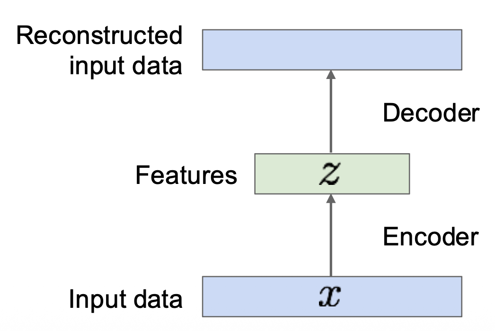
        </div>

损失用输入数据 $x$ 和重建数据 $\hat{x}$ 的 **L2 距离**衡量，即 $\|\hat{x} - x\|_2^2$。

训练后，使用编码器，用于下游任务中：

<div style="text-align: center">
    
</div>

如果能生成新的 $z$，那就能用解码器来生成图像了。

<div style="text-align: center">
    
</div>

但问题是生成新的 $z$ 不会比生成新的 $x$ 容易。解决方案是强迫所有 $z$ 来自一个已知的分布。


### Variational Autoencoders (VAEs)

1. 从原始数据习得**潜在特征**(latent feature) $z$
2. 从模型中采样以得到新的数据

假设训练数据 $\{x^{(i)}\}_{i=1}^N$ 生成自未观察到的（潜在）表示 $z$。直觉上看，若 $x$ 是一张图像，那么 $z$ 就是用于生成 $x$ 的潜在因子，比如属性、方向等。

训练后，像这样采样新的数据：

<div style="text-align: center">
    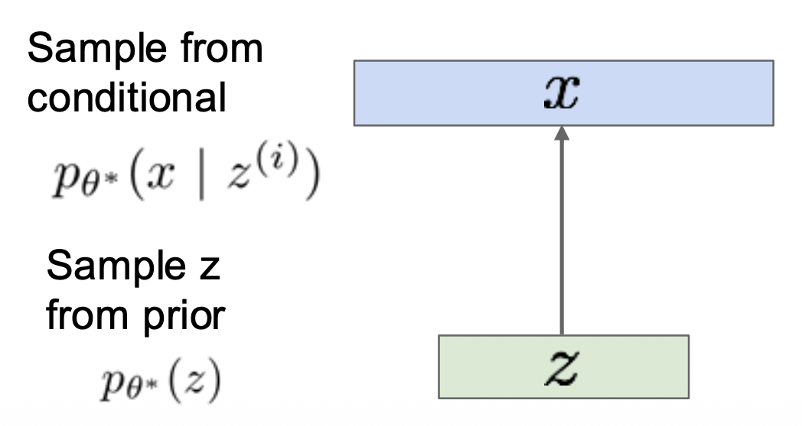
</div>

- 对于下半部分（绿色），假设是简单的先验概率 $p(z)$，比如高斯分布
- 对于上半部分（蓝色）
    - 训练的基本思想依然是**最大似然**
    - 若有关于 $(x, z)$ 的数据集，那么训练一个条件生成式模型 $p(x|z)$
    - 我们没有观察 $z$，因此进行**边缘化**(marginalize)：

        $$
        p_\theta (x) = \int p_\theta (x, z) dz = \int p_\theta (x|z) p_\theta (z) dz
        $$

        - 其中 $p_\theta (x|z)$ 能用解码器计算出来，$p_\theta (z)$ 已经假设为高斯先验概率
        - 问题：我们无法对所有的 $z$ 积分

    - 尝试另一个思路：贝叶斯定理

        $$
        p_\theta (x) = \dfrac{p_\theta (x|z) p_\theta (z)}{p_\theta (z|x)}
        $$

        - 但 $p_\theta (z|x)$ 没法算出来
        - 解决思路：训练另一个网络，得到 $q_\phi (z|x) \approx p_\theta (z|x)$

于是，整个 VAE 分为两个部分：

- **解码器网络**：输入潜在编码 $z$，输出关于数据 $x$ 的分布（左图）
- **编码器网络**：输入数据 $x$，输出关于潜在编码 $z$ 的分布（右图）

<div style="text-align: center">
    
</div>

如果能确保 $q_\phi (z|x) \approx p_\theta (z|x)$，那么我们就能近似表示 $p_\theta (x)$，即：

$$
p_\theta (x) = \dfrac{p_\theta (x|z) p_\theta (z)}{q_\phi (z|x)}
$$

所以现在的思路是：联合训练编码器和解码器。

神经网络是通过输出（对角线）分布的均值（和标准差）来输出概率分布的，因此将上图转变为以下形式：

<div style="text-align: center">
    
</div>

- $p_\theta (x|z) = N(\mu_{x|z}, \sigma^2)$ -> $\log p_\theta (x|z) = -\dfrac{1}{2\sigma^2} \|x - \mu\|_2^2 + C_2$
- $q_\phi (z|x) = N(\mu_{z|x}, \Sigma_{z|x})$

不难发现，最大化 $\log p_\theta (x|z)$ 等价于最小化 $x$ 和网络输出的 L2 距离。

继续计算 $\log p_\theta (x|z)$：

$$
\begin{aligned}
\log p_\theta(x) & = \log\dfrac{p_\theta (x|z) p_\theta (z)}{p_\theta (z|x)} = \log \dfrac{p_\theta (x|z) p_\theta (z) q_\phi (z|x)}{p_\theta (z|x) q_\phi (z|x)} \\
& = \log p_\theta(x|z) - \log \dfrac{q_\phi(z|x)}{p(z)} + \log \dfrac{q_\phi(z|x)}{p_\theta(z|x)} 
\end{aligned}
$$

由于上式不依赖于 $z$，因此可以将其包装成期望的形式，即：
$$
\begin{aligned}
\log p_\theta(x) & = E_{z \sim q_\phi(z|x)}[\log p_\theta (x)] \\
& = E_z[\log p_\theta(x|z)] - E_z \left[\log \dfrac{q_\phi(z|x)}{p(z)}\right] + E_z \left[\log \dfrac{q_\phi(z|x)}{p_\theta(z|x)} \right] \\
& = E_{z \sim q_{\phi}(z|x)}[\log p_{\theta}(x|z)] - D_{KL}(q_{\phi}(z|x), p(z)) + D_{KL}(q_{\phi}(z|x), p_{\theta}(z|x))
\end{aligned}
$$

最后三项分别代表：

- **数据重建**(data reconstruction)：
    - x => 解码器 => 编码器的过程应该能重建 x
    - 计算得到关于高斯分布的封闭形式
- **先验概率**(prior)：
    - 编码器的输出 $q_{\phi}(z|x)$ 需要和关于 z 的先验概率 $p(z)$ 匹配
    - 计算得到关于高斯分布的封闭形式
- **后验近似**(posterior approximation)：
    - 编码器的输出 $q_{\phi}(z|x)$ 需要和 $p_{\theta}(z|x)$ 匹配
    - 无法进行关于高斯分布的计算
    - 解码器的输出 $q_{\phi}(z|x)$ 需要和 $p_{\theta}(z|x)$ 匹配
    - 由于 KL >= 0，所以我们可以删除这项，获取似然的下限

综上，我们的 VAE 的训练目标为：

$$
\log p_{\theta}(x) \geq E_{z \sim q_{\phi}(z|x)}[\log p_{\theta}(x|z)] - D_{KL}(q_{\phi}(z|x), p(z))
$$

像这种共同训练编码器 q 和解码器 p，以最大化数据似然的变分下界，也称为**证据下界**(evidence lower bound, **ELBo**)。


### Training

{ align=right width=30% }

训练步骤如下：

1. 通过编码器运行输入数据，以得到关于 $z$ 的概率分布
2. 先验损失：编码器输出应该是单位高斯（标准正态分布，均值为 0，单位方差）
3. 从编码器输出 $q_\phi (z|x)$ 中采样 $z$（重参数化(reparameterization)技巧）
4. 通过解码器运行 $z$，得到预测的数据均值
5. 重建损失：预测均值需要在 L2 上和 $x$ 匹配

损失项之间处于相互抗争的状态：

- **重建损失**（$E_{z \sim q_{\phi}(z|x)}[\log p_{\theta}(x|z)]$）希望 $\Sigma_{z|x} = 0$ 且 $\mu_{z|x}$ 对每个 $x$ 而言是唯一的，因此解码器能确定得重建 $x$
- **先验损失**（$D_{KL}(q_{\phi}(z|x), p(z))$）希望 $\Sigma_{z|x} = \mathbf{I}$ 且 $\mu_{z|x} = 0$，因此编码器输出始终遵循标准正态分布


### Sampling

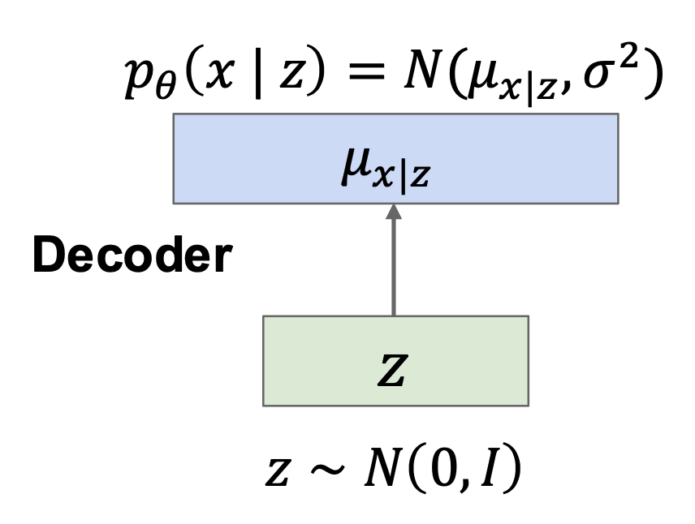{ align=right width=30% }

采样步骤如下：

1. 从先验分布中采样 $z$
2. 运行解码器以获取图像


### Disentangling

- $p(z)$ 的对角先验分布导致 $z$ 的维度相互独立
- “解耦变化因素(disentangling factors of variation)”

<div style="text-align: center">
    
</div>


## Generative Adversarial Networks

???+ info "回顾目前学过的生成式模型"

    - **自回归模型**直接最大化训练数据的似然

        $$
        p_{\theta}(x) = \prod_{i=1}^{N} p_{\theta}(x_i | x_1, \dots, x_{i-1})
        $$

    - **变分自编码器**引入潜在特征 $z$，并最大化下限

        $$
        p_{\theta}(x) = \int_{z} p_{\theta}(x|z)p(z)dz \geq \mathbb{E}_{z \sim q_{\phi}(z|x)}[\log p_{\theta}(x|z)] - D_{KL}(q_{\phi}(z|x), p(z))
        $$

**生成式对抗网络**(generative adversarial network, **GAN**)放弃对 $p(x)$ 建模，而是允许我们根据 $p(x)$ 抽取样本。

- 设置：从分布 $p_{\text{data}}(x)$ 中抽取数据 $x_i$，想从 $p_{\text{data}}$ 中采样
- 思路：
    - 引入潜变量 $z$，它具有简单的先验 $p(z)$（例如单位高斯分布）
    - 从分布 $z \sim p(z)$ 采样，将其传递给**生成器网络**(generator network) $x = G(z)$；此时 $x$ 就是来自**生成器分布** $p_G$ 的一个样本，我们希望 $p_G = p_{\text{data}}$

GAN 的架构图如下：

<div style="text-align: center">
    
</div>

- 训练**生成器网络** $G$，将 $z$ 转换从 $p_G$ 中采样得到的假数据 $x$，用于欺骗判别器 $D$
- 训练**判别器网络**(discriminator network) $D$ 来为数据的真假分类


### Training Objective

$G, D$ 应当共同训练，目标是让 $p_G$ 收敛于 $p_{\text{data}}$，即完成以下**极小极大博弈**(minimax game)（方程中的颜色和上图对应）：
$$
\min_{\textcolor{cornflowerblue}{G}} \max_{\textcolor{red}{D}} \left( E_{x \sim p_{data}} [\log \textcolor{red}{D(}x\textcolor{red}{)}] + E_{\textcolor{yellowgreen}{z \sim p(z)}} [\log(1 - \textcolor{red}{D(}\textcolor{cornflowerblue}{G(}\textcolor{yellowgreen}{z}\textcolor{cornflowerblue}{)}\textcolor{red}{)})] \right)
$$

其中：

- $D(x) = P(x \text{ is real})$
    - $D(x) = 0 \Rightarrow $ 假数据
    - $D(x) = 1 \Rightarrow $ 真数据

- 训练 $D$ 时想象固定 $G$

    $$
    \min_{\textcolor{cornflowerblue}{G}} \max_{\textcolor{red}{D}} \left( \overbrace{E_{x \sim p_{data}} [\log \textcolor{red}{D(}x\textcolor{red}{)}]}^{\textcolor{red}{\substack{\text{Discriminator wants} \\ D(x) = 1\text{ for real data}}}} + E_{\textcolor{yellowgreen}{z \sim p(z)}} [\overbrace{\log(1 - \textcolor{red}{D(}\textcolor{cornflowerblue}{G(}\textcolor{yellowgreen}{z}\textcolor{cornflowerblue}{)}\textcolor{red}{)})}^{\textcolor{red}{\substack{\text{Discriminator wants} \\ D(x) = 0\text{ for fake data}}}}] \right)
    $$

- 训练 $G$ 时想象固定 $D$

    $$
    \min_{\textcolor{cornflowerblue}{G}} \max_{\textcolor{red}{D}} \left( \overbrace{E_{x \sim p_{data}} [\log \textcolor{red}{D(}x\textcolor{red}{)}]}^{\textcolor{cornflowerblue}{\substack{\text{This term oes not} \\ \text{depend on } G}}} + E_{\textcolor{yellowgreen}{z \sim p(z)}} [\overbrace{\log(1 - \textcolor{red}{D(}\textcolor{cornflowerblue}{G(}\textcolor{yellowgreen}{z}\textcolor{cornflowerblue}{)}\textcolor{red}{)})}^{\textcolor{cornflowerblue}{\substack{\text{Generator wants} \\ D(x) = 1\text{ for fake data}}}}] \right)
    $$

具体来说，使用交替的梯度更新来训练 $G, D$。先将方程简写为 $\min\limits_G \max\limits_D V(G, D)$，那么：

```py
while True:
    D = D + alpha_D * dV / dD
    G = G - alpha_G * dV / dG
```

!!! warning "注意"

    我们不是在最小化总体损失，并且没有可参考的训练曲线。

- 在训练开始时，生成器表现非常糟糕，而判别器能够轻松区分数据的真假，因此 $D(G(z))$ 的结果接近 0
- 问题：$G$ 的梯度接近 0，导致训练不起来
    - 解决方案：生成器希望 $D(G(z)) = 1$，那就通过训练生成器以最小化 $-\log D(G(z))$，训练判别器以最大化 $\log (1 - D(G(z)))$，这样生成器在一开始获得很大的梯度

<div style="text-align: center">
    
</div>

???+ question "思考"

    === "问题"

        为何上述方程是一个好的目标函数？

    === "解答"

        - 内在目标通过以下方程最大化（对任何 $p_G$，证明略）：

            $$
            D_G^* (x) = \dfrac{p_{\text{data}}(x)}{p_{\text{data}}(x) + p_G(x)}
            $$

        - 外在目标通过以下方程最小化：$p_G(x) = p_{\text{data}}(x)$

!!! warning "注意"

    具有固定容量的神经网络可能无法表示最优的 $D, G$，这并没有告诉我们关于有限数据解的收敛性的任何信息。


### GAN Architecture

#### DC-GAN

- 生成器和判别器都是神经网络
- 神经网络通常是 CNNs，在 Vit 诞生前 GAN 并不受欢迎
- **DC-GAN** 是第一个在非玩具数据上运行的 GAN 架构

<div style="text-align: center">
    
</div>

>注：作者 Radford 后来参与了 GPT-1 和 GPT-2 的设计。


#### StyleGAN

- **StyleGAN**是一种更复杂的架构，它通过**自适应归一化**(adaptive normalization)来注入噪音
- 在每一层预测一个与 $x$ 相同形状的缩放因子 $w$ 和偏移量 $b$：

    $$
    AdaIN(x, w, b)_w = w_i \dfrac{x_i - \mu(x)}{\sigma(x)} + b_i
    $$

<div style="text-align: center">
    
</div>


### Latent Space Interpolation

- 潜在空间是**平滑的**(smooth)
- 给定潜在向量 $z_0, z_1$，我们能在两者之间做插值：

    $$
    \begin{aligned}
    z_t & = tz_0 + (1 - t)z_1 \\
    x_t & = G(z_t)
    \end{aligned}
    $$

- 结果图像 $x_t$ 可以在样本之间平滑插值

???+ example "效果"

    <div style="text-align: center">
        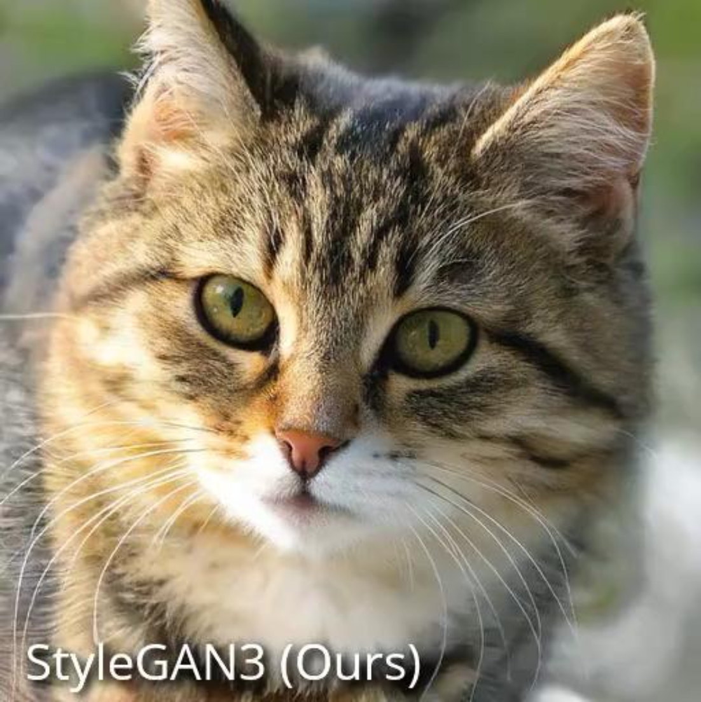
    </div>

    >Karras et al, ”Alias-Free Generative Adversarial Networks”, NeurIPS 2021

???+ abstract "总结"

    GAN 在大约 2016-2021 年是首选的模型。

    - 优点：
        - 形式化简单
        - 非常好的图像质量
    - 缺点：
        - 无法查看损失曲线
        - 训练不稳定
        - 很难扩展到大模型 + 数据


## Diffusion Models

!!! warning "警告"

    该领域的术语和符号没有统一：存在许多不同的数学表达；不同论文的术语和符号存在大量差异。所以下面只介绍现代的“干净”实现（即**校正流**）的基础知识。

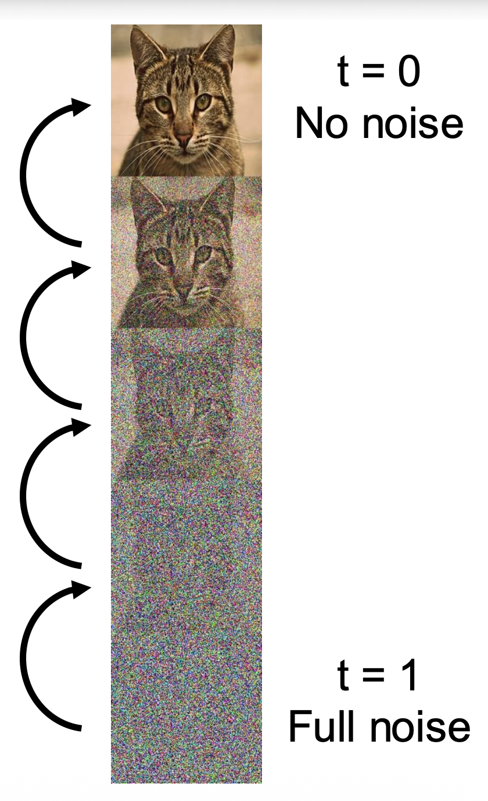{ align=right width=20% }

**扩散模型**(diffusion models)的大致思路如下：

- 选取一个**噪声分布**(noise distribution) $z \sim p_{\text{noise}}$（通常使用单位高斯分布）
- 数据 $x$ 被不同**噪声等级**(noise levels) $t$ 破坏后得到的噪声数据 $x_t$
- 训练一个神经网络 $f_\theta(x_t, t)$，以**移除一些噪声**
- 在推理期间，从 $x_1 \sim p_{\text{noise}}$ 采样并且连续多次应用 $f_\theta$，以生成无噪声的样例 $x_\theta$


### Rectified Flow

{ align=right width=30% }

**校正流**(rectified flow)的思路：

- 假设有来自 $\textcolor{red}{p_{\text{data}}}$ 的一个简单噪声 $\textcolor{cornflowerblue}{p_{\text{noise}}}$（比如高斯分布）和样本
- 在每一次训练迭代中，在以下分布中采样：

    $$
    \textcolor{cornflowerblue}{z} \sim \textcolor{cornflowerblue}{p_{\text{noise}}} \quad \textcolor{red}{x} \sim \textcolor{red}{p_{\text{data}}} \quad t \sim \text{Uniform}[0, 1]
    $$

- 设置 $\textcolor{plum}{x_t} = (1 - t)\textcolor{red}{x} + tz, \textcolor{yellowgreen}{v} = \textcolor{cornflowerblue}{z} - \textcolor{red}{x}$
- 训练一个预测 $v$ 的神经网络：

    $$
    L = \|f_\theta(\textcolor{plum}{x_t}, t) - \textcolor{yellowgreen}{v}\|_2^2
    $$

- 核心的训练循环仅需几行代码：

    ```py
    for x in dataset:
        z = torch.randn_like(x)
        t = random.uniform(0, 1)
        xt = (1 - t) * x + t * z
        v = model(xt, t)
        loss = (z - x - v).square().sum()
    ```

- 采样阶段：
    - 选择迭代次数 $T$（通常 $T = 50$）
    - 从 $\textcolor{cornflowerblue}{x} \sim \textcolor{cornflowerblue}{p_{\text{noise}}}$ 采样

        <div style="text-align: center">
            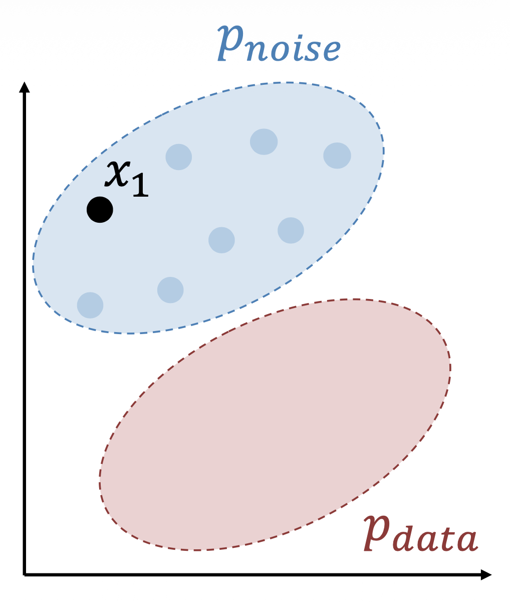
        </div>

    - 对于在 $[1, 1 - \dfrac{1}{T}, 1 - \dfrac{2}{T}], \dots, 0$内的 $t$
        - 求解 $\textcolor{yellowgreen}{v_t} = f_\theta(x_t, t)$

            <div style="text-align: center">
                
            </div>

        - $x = x - \dfrac{v_t}{T}$

            <div style="text-align: center">
                
            </div>

    - 返回 $x$

        <div style="text-align: center">
            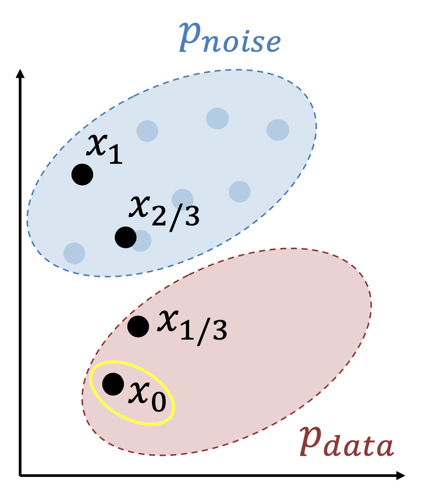
        </div>

    - 对应代码为：

        ```py
        sample = torch.randn(x_shape)
        for t in torch.linspace(1, 0, num_steps):
            v = model(sample, t)
            sample = sample - v / num_steps
        ```


### Conditional Rectified Flow

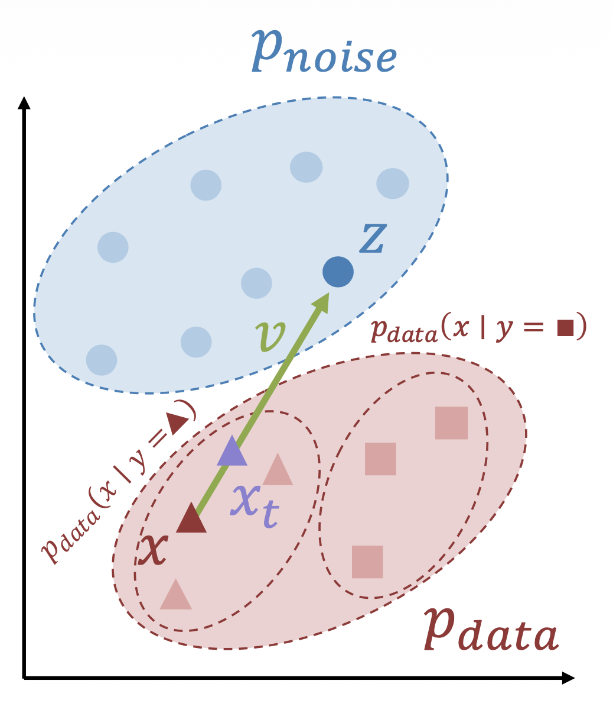{ align=right width=30% }

**条件**校正流在原版基础上有了以下修改：

- 训练：

    ```py hl_lines="1 5"
    for (x, y) in dataset:
        z = torch.randn_like(x)
        t = random.uniform(0, 1)
        xt = (1 - t) * x + t * z
        v = model(xt, y, t)
        loss = (z - x - v).square().sum()
    ```

- 采样：

    ```py hl_lines="1 4"
    y = user_input()
    sample = torch.randn(x_shape)
    for t in torch.linspace(1, 0, num_steps):
        v = model(sample, y, t)
        sample = sample - v / num_steps
    ```


### Classifier-Free Guidance (CFG)

**无分类器指导**(classifier-free guidance, CFG)是在条件校准流的基础上实现对条件 $y$ 强调程度的控制。

{ align=right width=30% }

- 训练：

    ```py hl_lines="5"
    for (x, y) in dataset:
        z = torch.randn_like(x)
        t = random.uniform(0, 1)
        xt = (1 - t) * x + t * z
        if random.random() < 0.5: y = y_null
        v = model(xt, y, t)
        loss = (z - x - v).square().sum()
    ```

    - 在训练过程中随机删除 $y$，此时模型可同时是条件的和无条件的
    - 如右图所示，考虑噪声 $\textcolor{plum}{x_t}$：
        - $\textcolor{orange}{v^{\emptyset} = f_\theta (x_t, y_\emptyset, t)}$ 指向 $p(x)$
        - $\textcolor{yellowgreen}{v^y = f_\theta (x_t, y, t)}$ 指向 $p(x | y)$
        - $\textcolor{cornflowerblue}{v^{cfg}} = (1 + w)\textcolor{yellowgreen}{v^y} - w \textcolor{orange}{v^{\emptyset}}$ 更多指向 $p(x | y)$
        - 在采样过程中，根据 $\textcolor{cornflowerblue}{v^{cfg}}$ 步进

- 采样：

    ```py
    y = user_input()
    sample = torch.randn(x_shape)
    for t in torch.linspace(1, 0, num_steps):
        vy = model(sample, y, t)
        v0 = model(sample, y_null, t)
        v = (1 + w) * vy - w * v0
        sample = sample - v / num_steps
    ```

    - 实际上到处使用，对于高质量的输出而言非常重要
    - 问题：采样成本加倍

>之所以叫做 "classifier-free"，是因为先前的方法使用单独的判别模型 $p(y|x)$ 来计算步进方向 $\dfrac{\partial}{\partial x} \log p(y|x)$ 的。


### Optimal Prediction (Noise Schedules)

上述方法中，存在多个 $(x, z)$ 对给出相同的 $x_t$，网络必须计算它们的平均值

<div style="text-align: center">
    
</div>

- 完全噪声（$t=1$）很容易：最优的 $v$ 是 $p_\text{data}$ 的均值

    <div style="text-align: center">
        
    </div>

- 没有噪声（$t=1$）也很容易：最优的 $v$ 是 $p_\text{noise}$ 的均值

    <div style="text-align: center">
        
    </div>

- 中间的噪声是最困难也是最模糊的，但问题是我们为所有的噪声等级赋予了相同的权重

    <div style="text-align: center">
        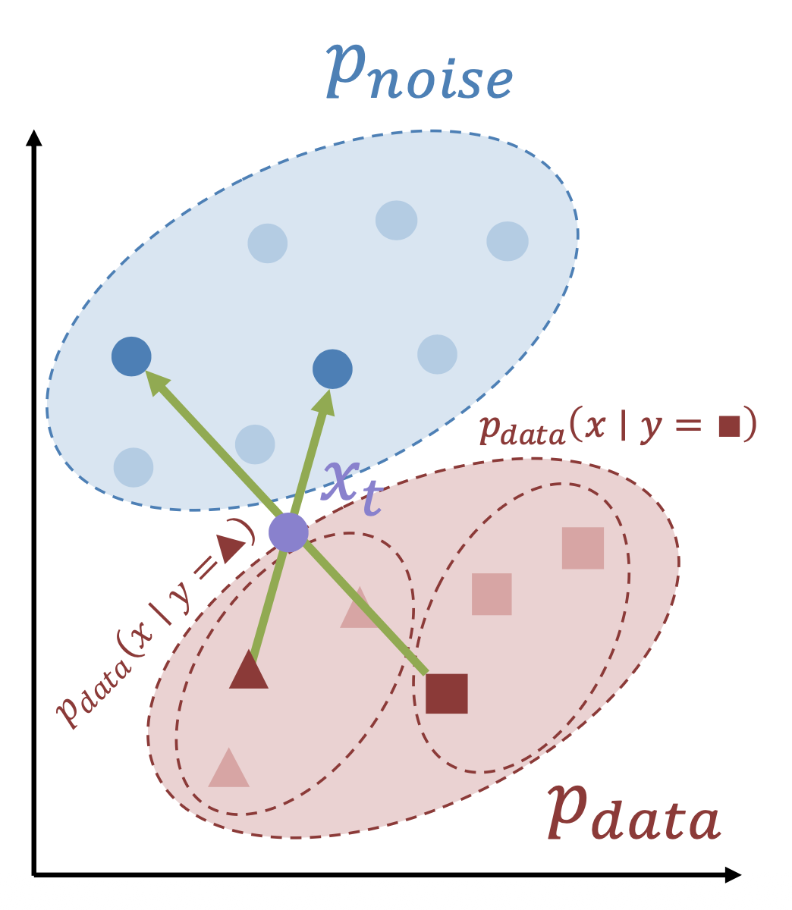
    </div>


解决方法：使用非均匀**噪声调度**(noise schedule)。

- 在中间多放置一些噪声
- 常用方法：**对数正态采样**(logit normal sampling)

    <div style="text-align: center">
        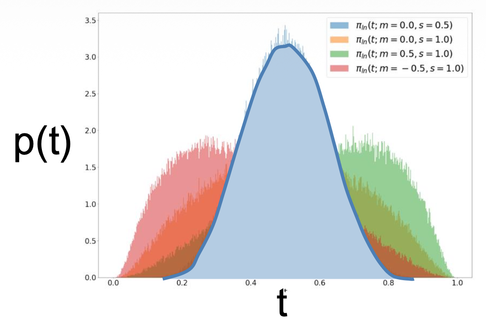
    </div>

- 对于高分辨率区域，考虑像素相关性，通常**转向更高的噪声**

    <div style="text-align: center">
        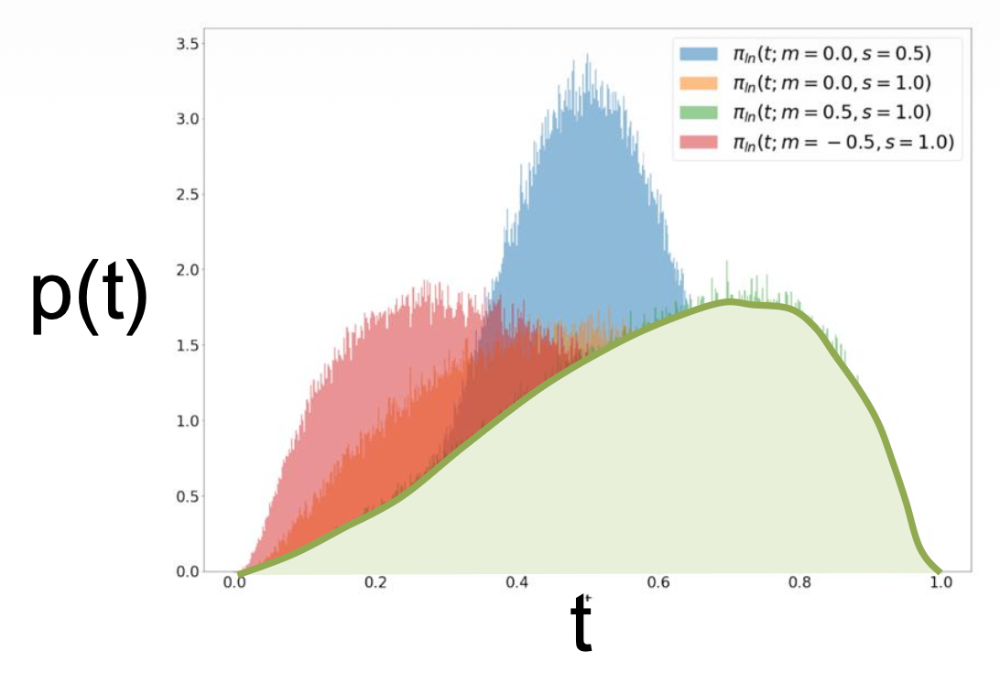
    </div>

对应代码如下：

```py hl_lines="3"
for (x, y) in dataset:
    z = torch.randn_like(x)
    t = torch.randn(()).sigmoid()
    xt = (1 - t) * x + t * z
    if random.random() < 0.5: y = y_null
    v = model(xt, y, t)
    loss = (z - x - v).square().sum()
```

- 优点：对于多数生成式建模问题而言是简单且可扩展的设置
- 缺点：无法在高分辨率数据上简单工作


### Latent Diffusion Models (LDMs)

**潜扩散模型**(latent diffusion models, **LDM**s)的思路为：

- 训练**编码器** + **解码器**，将图像转换为**潜变量**(latent)

    <div style="text-align: center">
        
    </div>

    - 常用设置：D=8, C=16
    - 图像（256x256x3）=> 潜变量（32x32x16）
    - 编码器和解码器是带注意力的 CNNs

- 训练扩散模型，以移除潜变量的噪声（编码器被固定住）

    <div style="text-align: center">
        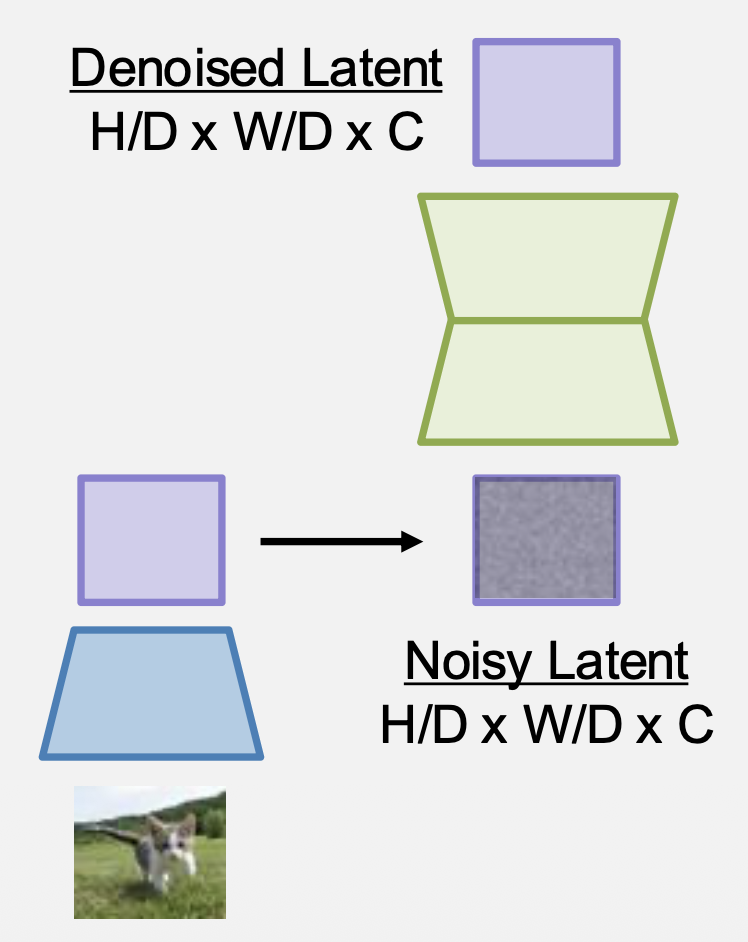
    </div>

- 训练后：
    - 采样随机潜变量
    - 迭代应用训练模型以移除噪声
    - 运行解码器以获得图像

    <div style="text-align: center">
        
    </div>

潜扩散是目前最常用的形式。

不难发现，这种架构也是一种 **VAE**，而且带有很小的 KL 先验权重。所以就按 VAE 的训练方式来训练编码器和解码器。

但有一个问题：解码器的输出不确定(blurry)。解决方案是加一个**判别器**，形成类似 **GAN** 的架构。

综上，现代的 LDM 流水线是 VAE + GAN + 扩散的结合。


### Diffusion Transformer (DiT)

扩散模型采用标准的 Transformer 块。

主要问题：如何注入条件（时间步 t，文本...）：

<div style="text-align: center">
    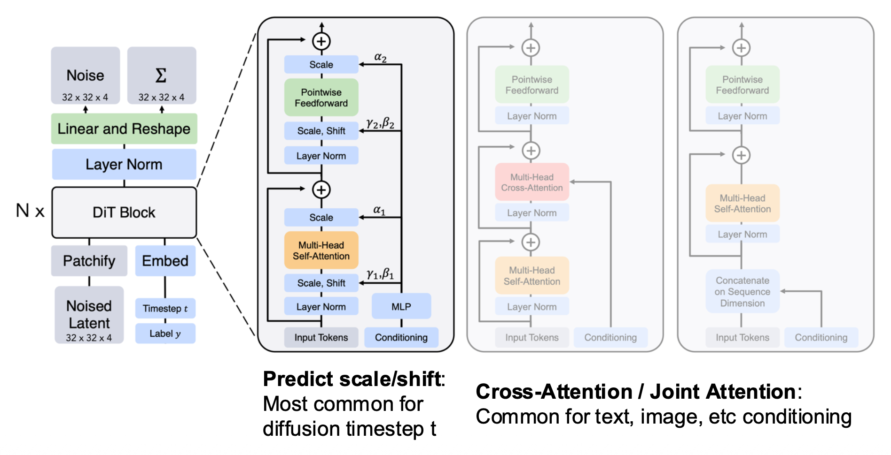
</div>

- 预测尺度/偏移：常用于扩散时间步 t
- 交叉注意/联合注意：常用于文本、图像等条件


#### Text-to-Image

<div style="text-align: center">
    
</div>


#### Text-to-Video

<div style="text-align: center">
    
</div>

视频扩散模型的时代：

<div style="text-align: center">
    
</div>


### Diffusion Distillation

???+ bug "问题"

    在采样过程中，我们需要多次运行扩散模型（在校正流中大约是 30-50 次）。显然速度非常慢。

解决方案：使用**蒸馏算法**(distillation algorithms)，减少步数。该方法也可在 CFG（无分类器指导）中烘培。

??? info "相关论文"

    - Salimans and Ho, “Progressive Distillation for Fast Sampling of Diffusion Models”, ICLR 2022
    - Song et al, “Consistency Models”, ICML 2023
    - Sauer et al, “Adversarial Diffusion Distillation”, ECCV 2024
    - Sauer et al, “Fast High-Resolution Image Synthesis with Latent Adversarial Diffusion Distillation”, arXiv 2024
    - Lu and Song, “Simplifying, Stabilizing and Scaling Consistency Models”, ICLR 2025
    - Salimans et al, “Multistep Distillation of Diffusion Models via Moment Matching”, NeurIPS 2025


### Generalized Diffusion

**广义扩散**(generalized diffusion)模型的数学公式如下图右侧所示（和校正流对应）：

<div style="text-align: center">
    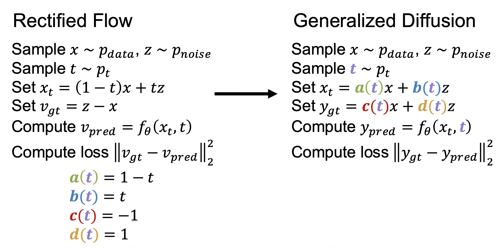
</div>

各种变体：

- **方差保留**(variance preserving, VP)：
    - $a(t) = \sqrt{\sigma(t)}$
    - $b(t) = \sqrt{1 - \sigma(t)}$
    - 若 $x, z$ 独立且方差为 1，那么 $x_t$ 的方差也为 1

- **方差爆炸**(variance exploding, VE)：
    - $a(t) = 1$
    - $b(t) = \sqrt{\sigma(t)}$
    - $\sigma(1)$ 需要足够大，以抽取在 $x$ 中的全部信号

- $x$-预测

    $$
    y_{gt} = x \quad [\textcolor{red}{c(}\textcolor{plum}{t}\textcolor{red}{)} = 1; \textcolor{orange}{d(}\textcolor{plum}{t}\textcolor{orange}{)} = 0]
    $$

- $\varepsilon$-预测

    $$
    y_{gt} = \bm{z} \quad [\textcolor{red}{c(}\textcolor{plum}{t}\textcolor{red}{)} = 1; \textcolor{orange}{d(}\textcolor{plum}{t}\textcolor{orange}{)} = 0]
    $$


- $v$-预测

    $$
    y_{gt} = \textcolor{cornflowerblue}{b(}\textcolor{plum}{t}\textcolor{cornflowerblue}{)} z - \textcolor{yellowgreen}{a(}\textcolor{plum}{t}\textcolor{yellowgreen}{)} x \quad [\textcolor{red}{c(}\textcolor{plum}{t}\textcolor{red}{)} = \textcolor{cornflowerblue}{b(}\textcolor{plum}{t}\textcolor{cornflowerblue}{)}; \textcolor{orange}{d(}\textcolor{plum}{t}\textcolor{orange}{)} = -\textcolor{yellowgreen}{a(}\textcolor{plum}{t}\textcolor{yellowgreen}{)}]
    $$

通常通过一些数学形式主义(mathematical formalism)来选择上述函数。


### Miscellaneous

- 扩散是一个潜变量模型
    - 前向过程：增加高斯噪声

        <div style="text-align: center">
            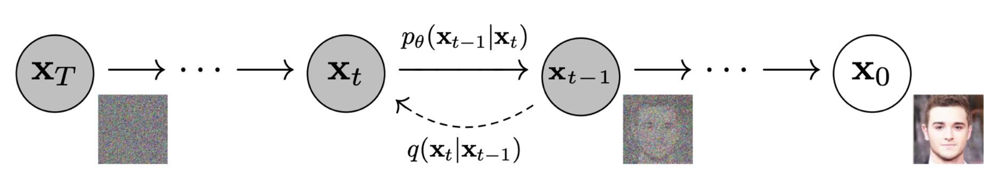
        </div>

    - 学习一个用于近似后向过程的网络
    - 优化变分下界（和 VAE 一样）

- 扩散习得一个分数函数
    - 对于任意在 $x \in \mathbb{R}^N$ 上的分布 $p(x)$，**分数函数**

        $$
        s: \mathbb{R}^N \rightarrow \mathbb{R}^N \quad s(x) = \dfrac{\partial}{\partial x} \log p(x)
        $$

        是一个指向高概率密度区域的向量场

    - 扩散习得一个用于逼近关于 $p_\text{data}$ 的分数函数的神经网络

- 扩散能解出随机微分方程(stochastic differential equations, SDE)
    - 我们能以 SDE 形式描述一个连续的增加噪声过程

        $$
        d\bm{x} = f(\bm{x}, t) dt + g(t) d\bm{w}
        $$

    - 上式给出了数据 $x$、时间 $t$ 和噪声 $w$ 之间的无穷小(infinitesimal)变化关系
    - 扩散习得一个用于近似求解该 SDE 的神经网络

- 扩散的不同视角：

    <div style="text-align: center">
        
    </div>

    >截图来自 Sander Dieleman 的[博客](https://sander.ai/2023/07/20/perspectives.html)。