# 3D Deep Learning

## 3D Reconstruction

### Feature Mapping

使用网络直接从图像预测姿态？

    

但效果不佳！

    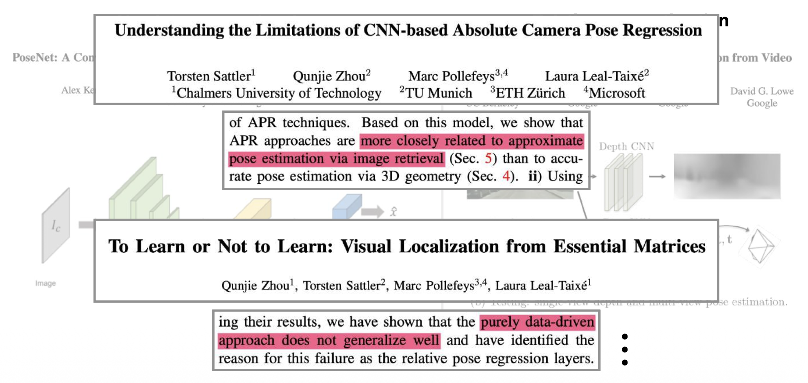

使用深度学习来提升特征匹配：

    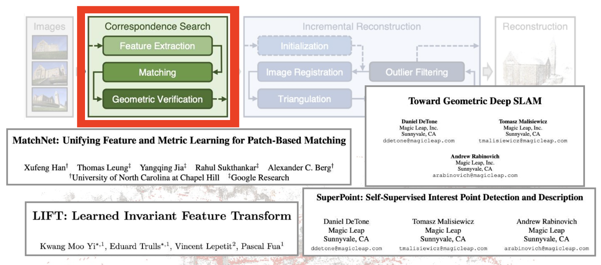

为什么使用深度学习？

- 传统的特征检测器和描述器是手工制作的（比如 DoG, SIFT, ORB...）
- 局限：
    - 仅考虑几何，不涉及语义
    - 无法处理纹理较差的情况
    - 对以下改变不够鲁棒
        - 视点(viewpoint)变化
        - 光照(illumination)变化
        - 运动模糊(motion blur)
        - ...

???+ example "例子"

    === "例1：深度学习 + SIFT"

        

            
        

    === "例2：SuperPoint"

        

            
        

#### Training Detector

用**热图**(heatmap)表示特征点的位置

    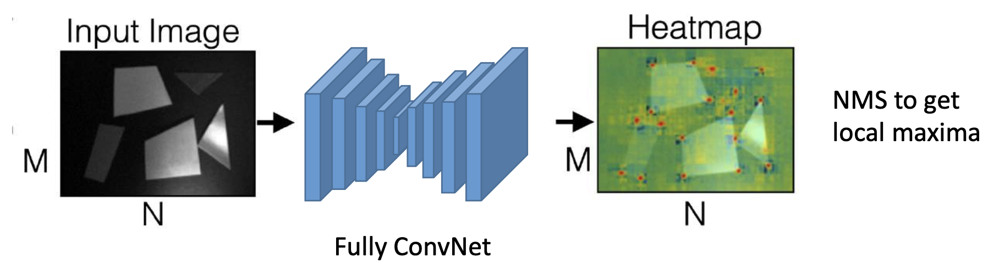

训练能够检测角的 **CNN**：

    

训练 CNN 以强制**可重复性**(repeatability)：

1. **扭曲**(warp)图像
2. 强制**等变性**(equivariance)

    $$
    \min_{f} \frac{1}{n} \sum_{i=1}^{n} \|f(g(I)) - g(f(I))\|^2
    $$

    

#### Training Descriptor

从 CNN 特征图中提取描述器：

    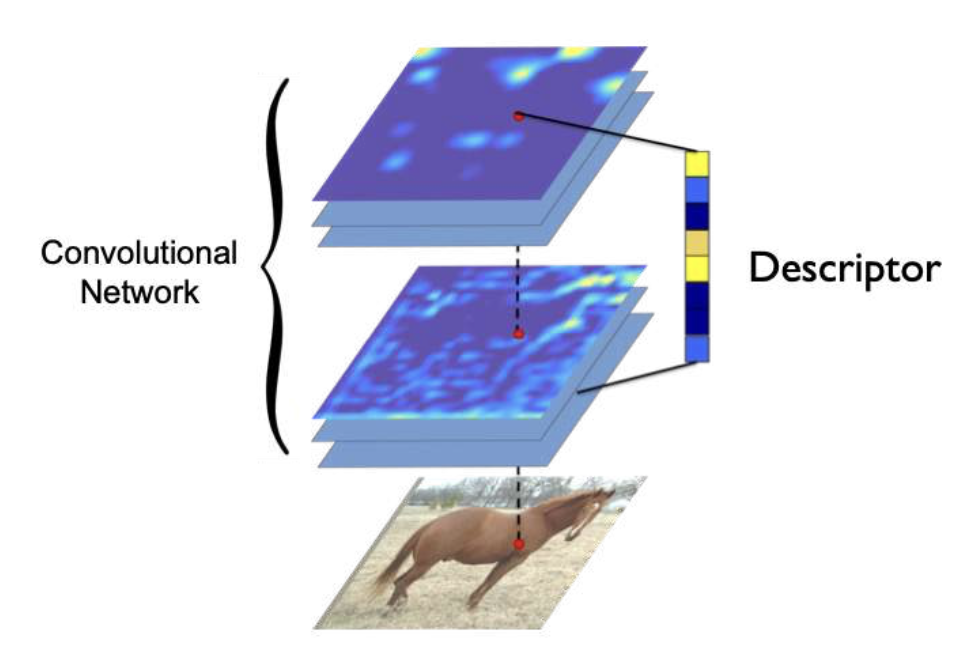

通过**度量学习**(metric learning)训练描述器：

    

对比损失(contrastive loss)：

$$
\begin{aligned}
L_{pos} &= \frac{1}{N} \sum_{i=1}^{N} \|F_{I}(A) - F_{I'}(P)\|^2 \\
L_{neg} &= \frac{1}{N} \sum_{i=1}^{N} \max(0, m - \|F_{I}(A) - F_{I'}(N)\|)^2
\end{aligned}
$$

    

三元组损失(triplet loss)：

$$
L_{tri} = \frac{1}{N} \sum_{i=1}^{N} \max(0, m + \|F_{I}(A) - F_{I'}(P)\| - \|F_{I}(A) - F_{I'}(N)\|)^2
$$

    

训练数据的来源：

- 合成数据

    

        
    

- 使用 MVS（多视图立体）

    

        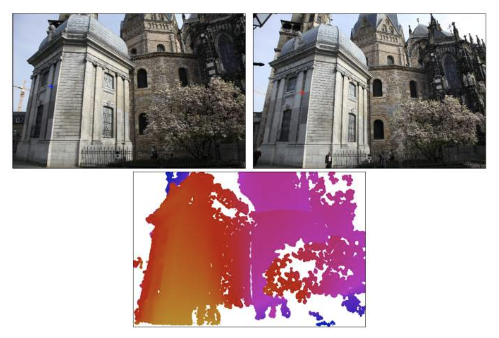
    

### Object Pose Estimation

**目标姿态估计**(object pose estimation)是指估计物体相对于相机坐标系的三维位置和方向。

    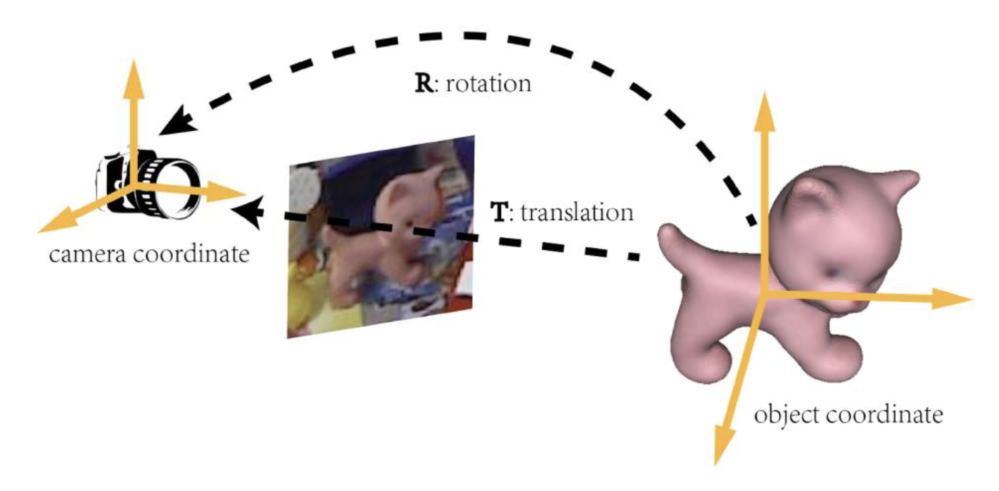

???+ example "应用"

    === "机器人抓取(robot grasping)"

        

            
        

    === "无人驾驶(autonomous driving)"

        

            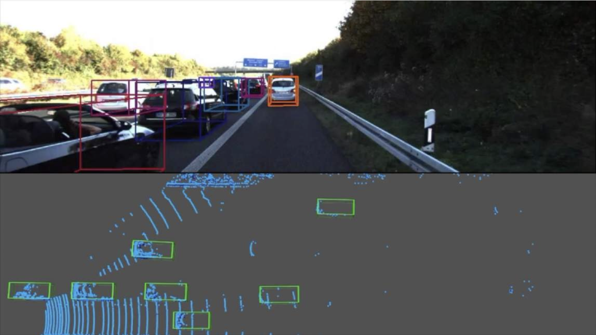
        

    === "增强现实(augmented reality)"

        

            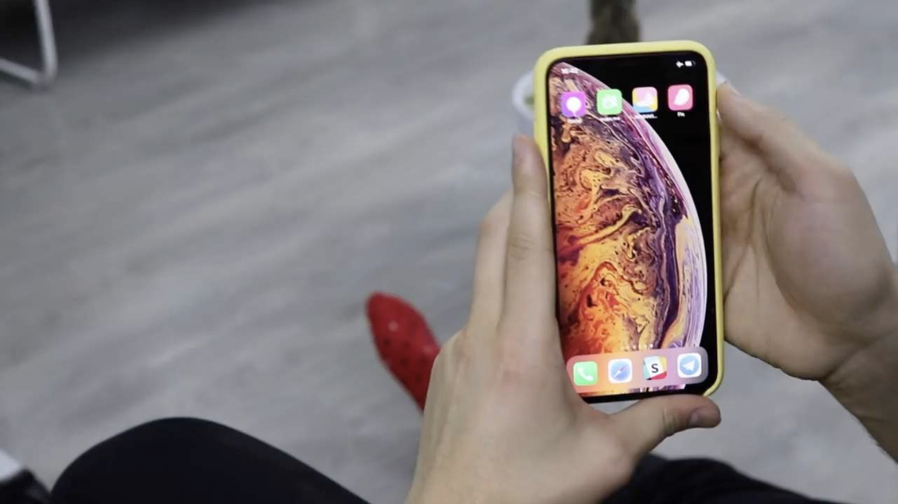
        

类似视觉定位：

1. 寻找 3D-2D 对应关系
2. 通过**透视 n 点（PnP）**算法求解 R 和 t

    

对于第一步，我们有以下方法：

- **基于特征匹配的方法**
    1. 根据输入多视图图像来重新构造目标 SfM 模型

        

            
        

    2. 然后通过提升 2D-2D 匹配到 3D 来获得 2D-3D 对应关系

        

            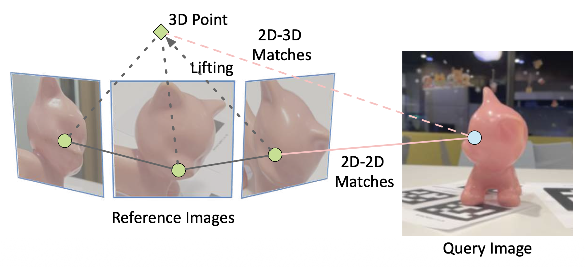
        

    3. 通过 PnP 求解查询图像的目标姿态

        

            
        

    ??? info "延伸阅读"

        

            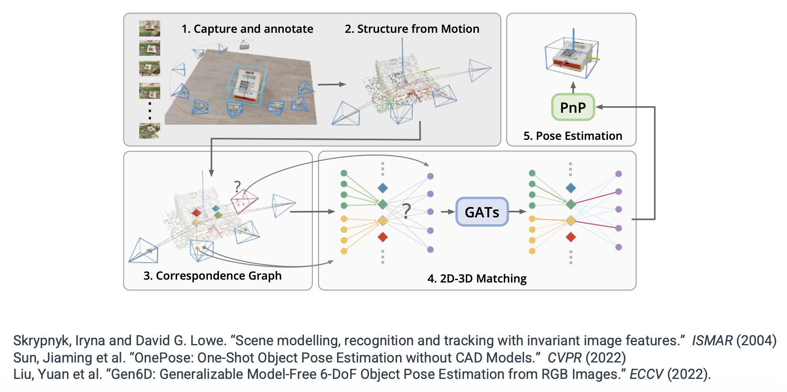
        

- **直接姿态回归方法**(direct pose regression methods)
    - 直接使用神经网络回归查询图像的对象姿态
    - 需要渲染大量图像进行训练

    

        
    

- **关键点检测方法**(keypoint detection methods)：
    - 使用 CNN 检测预定义的关键点
    - 需要渲染大量图像进行训练

    

        
    

### Human Pose Estimation

- 2D 人类姿态估计：在图像中定位人体关节（关键点包括肘部、腕部等）
- 3D 人类姿态估计：估算每个关节的 3D (x, y, z) 坐标

    

        
    

    ??? example "例子"

        

            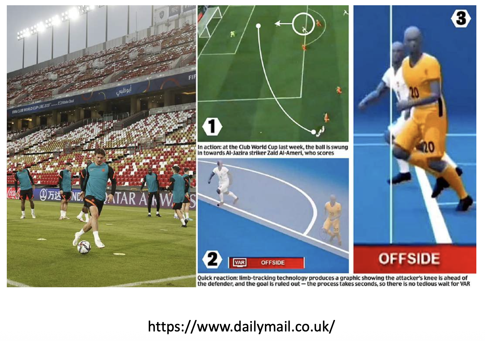
        

方法：

- **基于标记(marker)的 MoCap 系统**
    - MoCap：光学动作捕捉(optical motion capture)

    

        
    

    >视频：<https://www.youtube.com/watch?v=x-nIJ0mYghQ>

- **无标记 MoCap**：多视图 3D 人类姿态估计

    

        
    

    

        
    
 

- **单目(monocular) 3D 人体姿态估计**
    - 使用单个相机来估计 3D 人体姿态

        

            
        
 

    - 使用单张 RGB 图像来估计 3D 人体姿态

        

            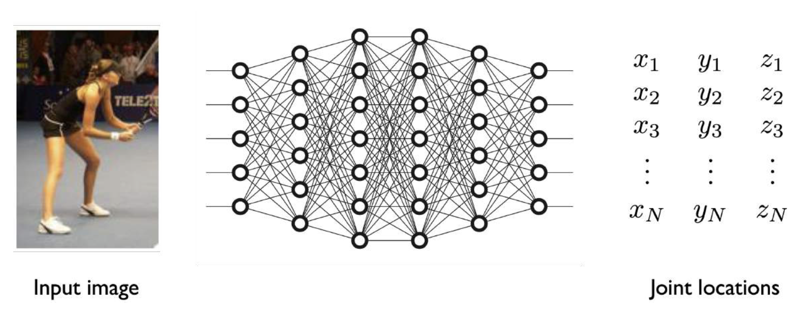
        
 

        

            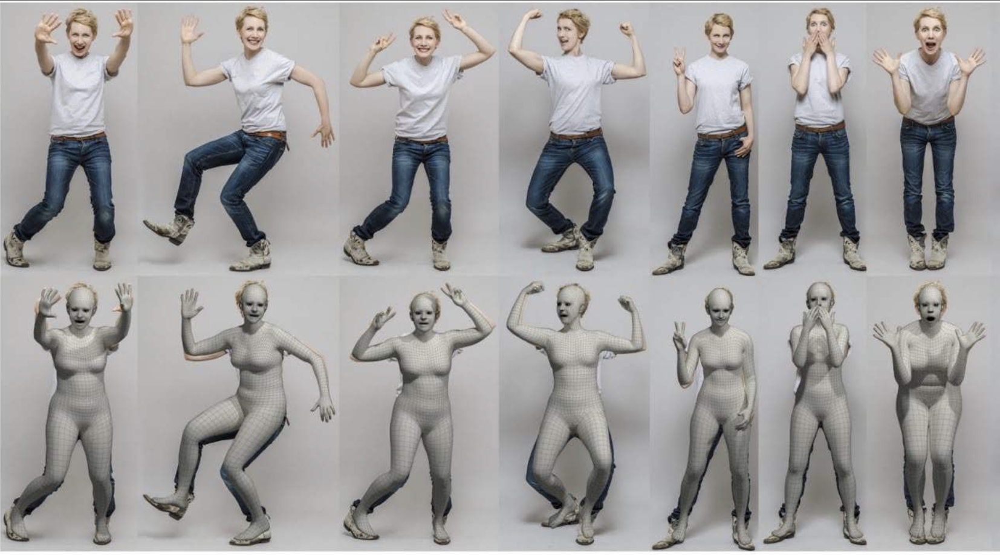
        
 

        

            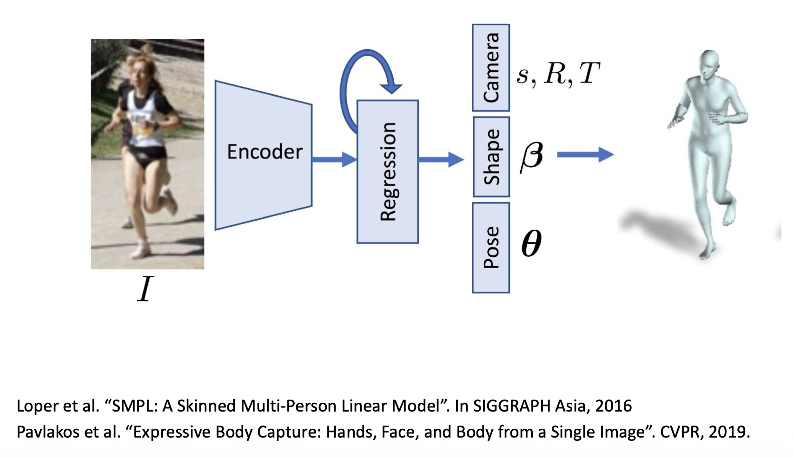
        
 

        

            
        
 

### Dense Reconstruction

**稠密重构**(dense reconstruction)的传统管线：

- 每张图像计算深度图（**多视图立体**）
- 将深度图融合成 3D 表面（**泊松重建**）
- **纹理映射**

??? info "回顾：多视图立体（MVS）"

    计算参考图像中每个点的每个深度值的误差。

    

        
    
 

    成本体积是一个存储了所有深度下所有像素的误差的三维数组。

    

        
    
 

在传统的 MVS 方法中，会遇到以下挑战：

    

 

**MVSNet**：从 CNN 特征预测成本体积

    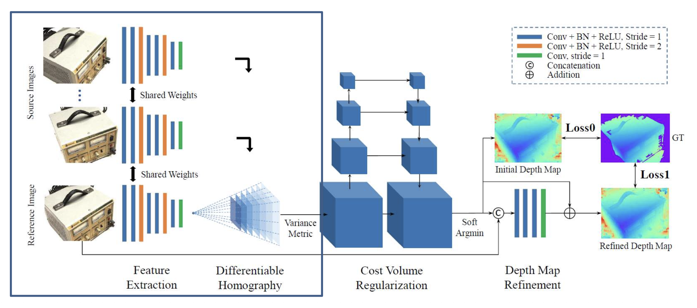

???+ example "例子"

    

        
    

虽然可以通过比较渲染图像与输入图像来提高网格质量，但这并不容易，因为：

- 渲染过程不可微
- 网格表示不是优化中的良好表示

#### Implicit Representation

    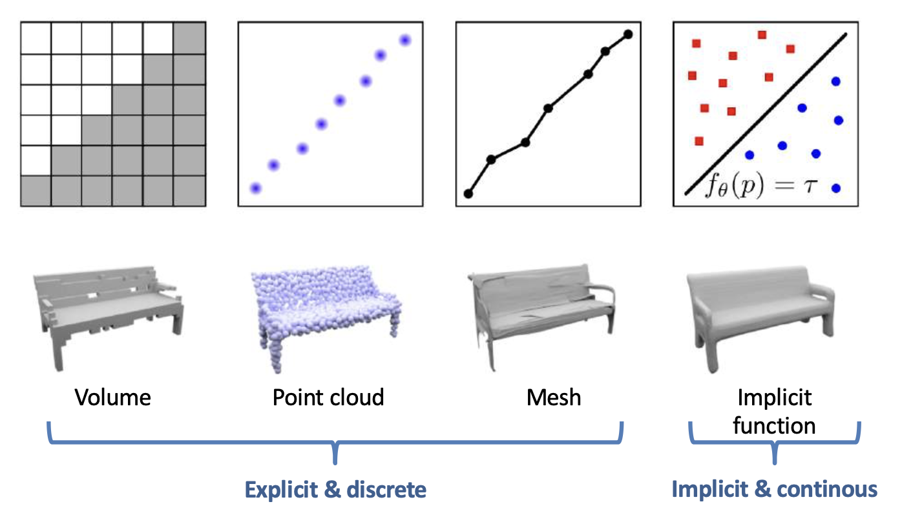

一个简单的例子是，当 $f(p) = p_1^2 + p_2^2 + p_3^2$ 时，$f(p) = 1$ 表示一个球体。

    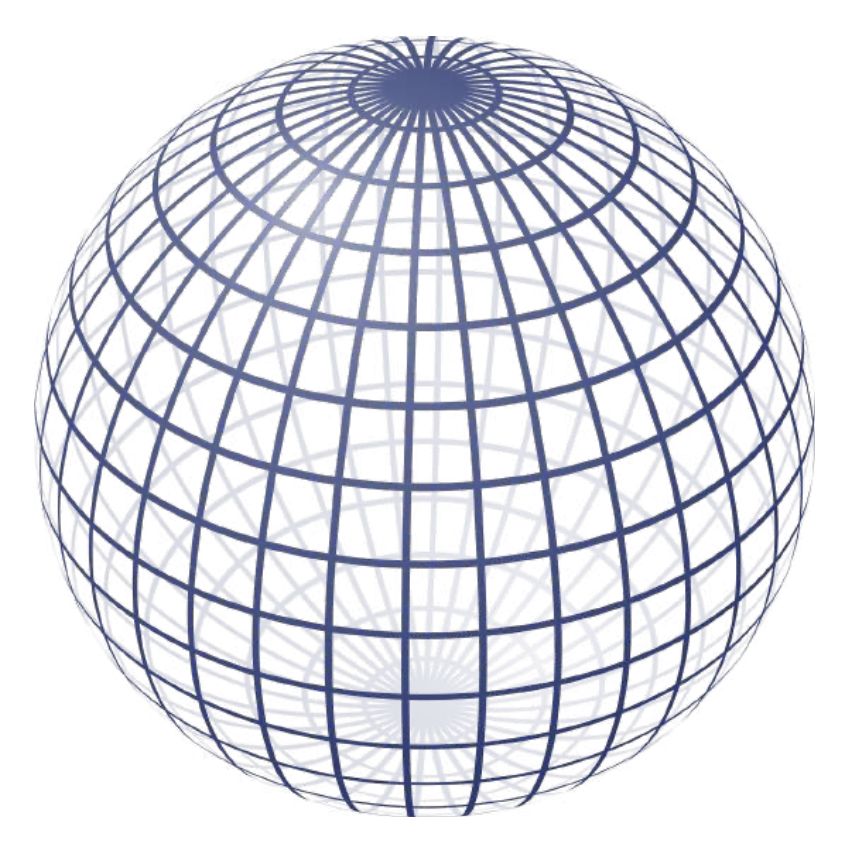

一般来说，隐式函数可以是：

    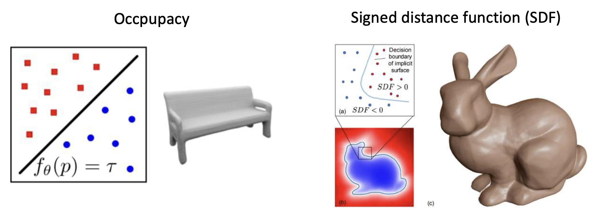

实际上，我们很难定义 $f_\theta(p)$ 的形式。

隐式神经表示：

    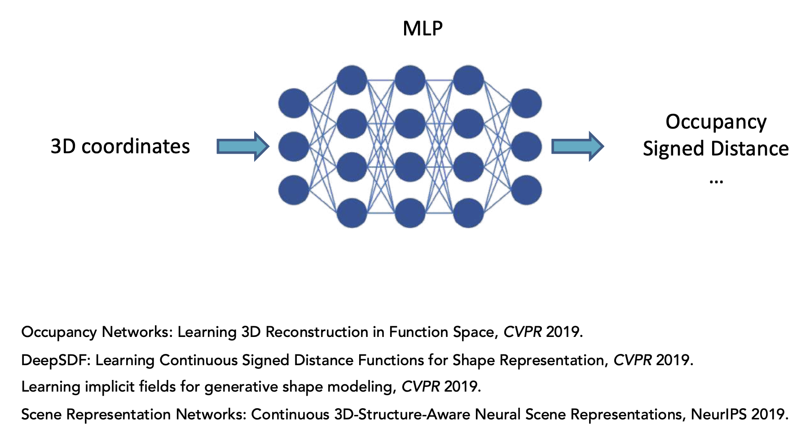

#### Neural Radiance Fields (NeRF)

**神经辐射场**(neural radiance fields, **NeRF**)：将场景表示为**辐射场**(radiance field)。

- 辐射度(radiance) = 密度 + 颜色

    

辐射场可以通过体渲染转换为图像，这是可微分的。

    

通过最小化渲染损失重建 NeRF：

    

???+ example "效果"

    

        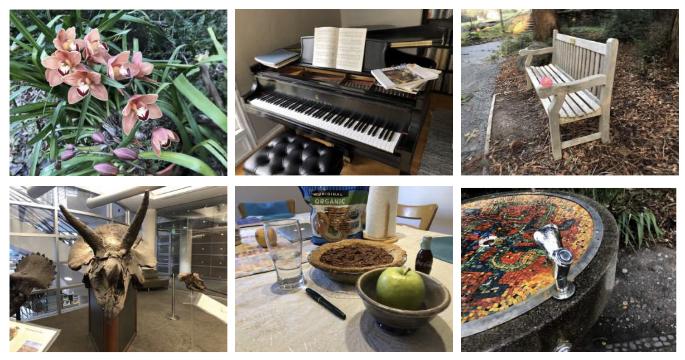
    

但是 NeRF 的**表面重构质量较差**：

    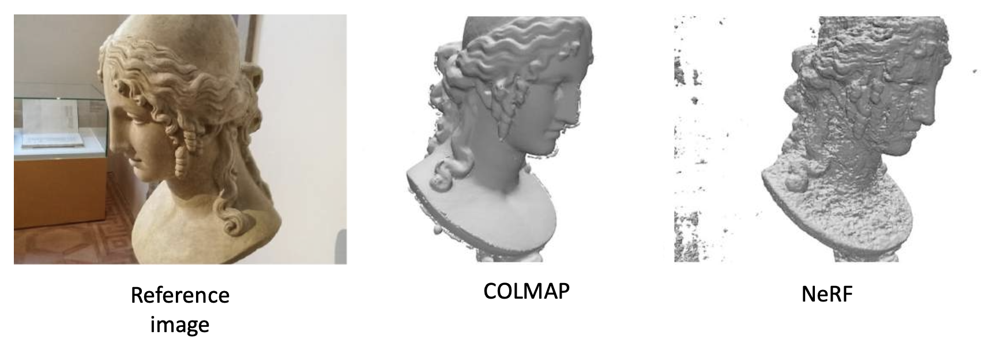

#### NeuS

**NeuS**：用 **SDF** 替换密度场。

    

???+ example "效果"

    

        
    

    

        
    

---
{ align=right width=30% }

仅从**单张**图像推断 3D 表示

- 深度
- 点云
- 网格
- 体积

#### Monoculer Depth Estimation

**单目深度估计**(monoculer depth estimation)：

- 使用网络从单张图像中**猜测**深度

    

        
        
    

- **尺度模糊**(scale ambiguity)：不同大小和深度的同一物体给出相同的图像

    

        
    

- 损失函数：**尺度不变**(scale-invariant)深度误差
    - 标准 L2 误差

        $$
        D_{L2}(y, y^*) = \frac{1}{n} \sum_{i=1}^{n} (\log y_i - \log y^*_i)^2
        $$

    - 尺度不变误差

        $$
        \begin{aligned}
        D_{SI}(y, y^*) = \frac{1}{n} \sum_{i=1}^{n} &\left(\log y_i - \log y^*_i + \alpha(y, y^*)\right)^2 \\
        & \text{with } \alpha(y, y^*) = - \frac{1}{n} \sum_{j=1}^{n} (\log y_j - \log y^*_j)
        \end{aligned}
        $$

- 训练数据来源：

    

        
    

    - **MegaDepth 数据集**：> 130k 对（RGB，深度图）

        

            
        

        - 来自互联网上的图像
        - 由世界 200 多个地标生成
        - 使用 **COLMAP** 的 SfM + MVS 重建

#### Single-View Shape Estimation

    

    

3D 生成（来源：<https://github.com/threestudio-project/threestudio>）：

    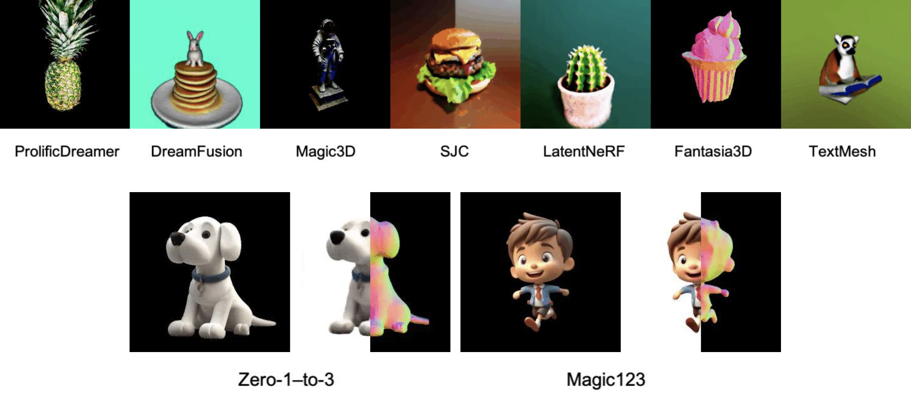

>内容过时了，现在的技术明显强很多...

## 3D Understanding

3D 分类：

    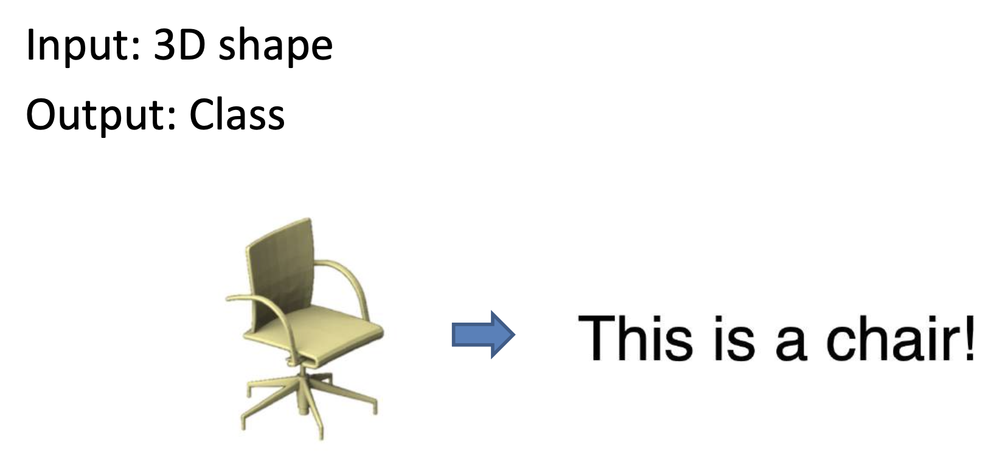

3D 数据表示：

    

### Multi-View CNN

1. 给定一张输入图像

    

        
    

2. 使用多台虚拟相机渲染

    

        
    

3. 将渲染图像传给 CNN

    

        
    

4. 所有图像特征都被池化过后，通过 CNNs 进行处理，以生成最终预测

    

        
    

### 3D ConvNets

**三维体数据**(3D volumetric data)：

    

可以用三维卷积处理这类数据：

    

挑战：时间/空间复杂度相当高（$O(N^3)$）

    

解决思路：利用三维形体的**稀疏性**(sparity)。

    

- 存储**稀疏**表面信号（**八叉树**(octree)）
- 限制**表面附近**的计算

    

        
    

- **稀疏卷积**(sparse convolution)：仅在活跃位置（非零条目）计算内积
    >网址：<https://github.com/facebookresearch/SparseConvNet>

    

        
    

    

        
    

### PointNet

接下来看如何用神经网络处理**点云**(pointcloud)数据。会遇到的挑战有：

- 点云是**未光栅化的**(unrasterized)数据
- 无法应用卷积

    

**PointNet** 是一种多任务（分类、检测、分割、配准等）点云处理架构。

    

其中，点云是 N 个**无序**(orderless)点，每个点用 D 维坐标表示

    

PointNet 分类和分割架构：

    

挑战：

- 点集是无序的

    

        
    

    - 输出需要对于 N! 种排列保持不变
    - 解决方案：利用**最大池化**，使输出对输入点的顺序不变

        

            
        

- 输出不应该受到点的刚体变换(rigid transformation)的影响

    

        
    

    - 解决方案：使用另一个网络（**T-Net**）估计变换

        

            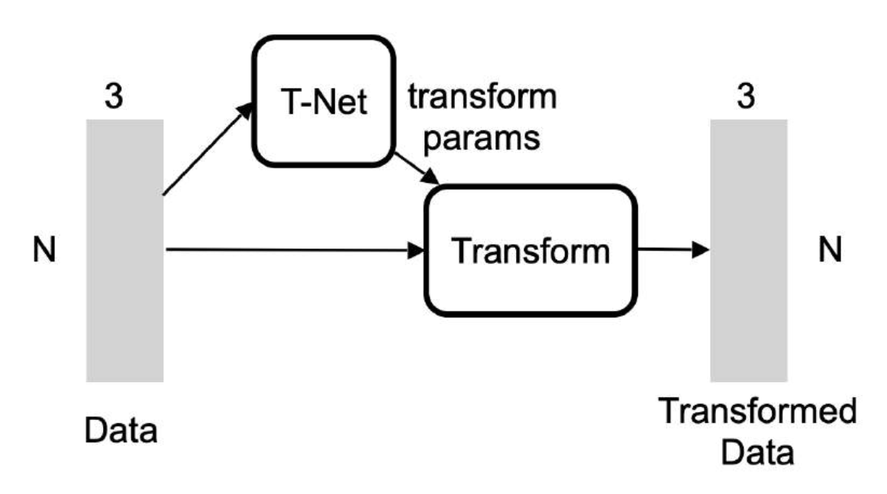
        

???+ example "效果"

    

        
    

### PointNet++

PointNet 的局限：每个点缺少**局部上下文**(local context)信息。

    

改进方法是 PointNet++，它是一种多尺度的 PointNet。

    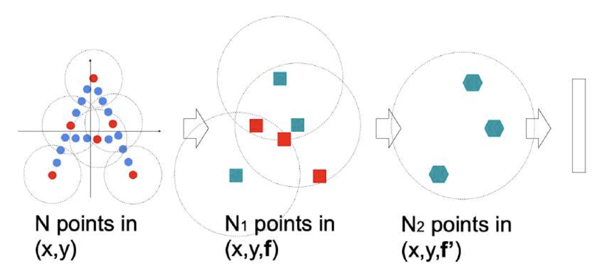

整个过程分为三部分：

- 采样：通过**最远点采样**(farthest point sampling, FPS)采样锚点
- 分组：找到锚点的**邻域**(neighborhood)
- 在每个邻域中应用 **PointNet** 以模拟卷积

    

### 3D Semantic Segmentation

- 输入：3D 场景的传感器数据（RGB / 深度 / 点云 ...）
- 输出：将点云中的每个点用类别标签标注

可能的解决方案：

- 直接分割点云

    

        
    

- 融合 2D 分割结果到 3D

    

        
    

### 3D Object Detection

检测 3D 数据中的 3D 物体

    

3D 包围盒：

    

尝试用滑动窗口分类：

    

- 缺点：3D CNN 在时间和内存上的成本都很高

解决方案：

- **PointRCNN**：用于点云的 RCNN

    

        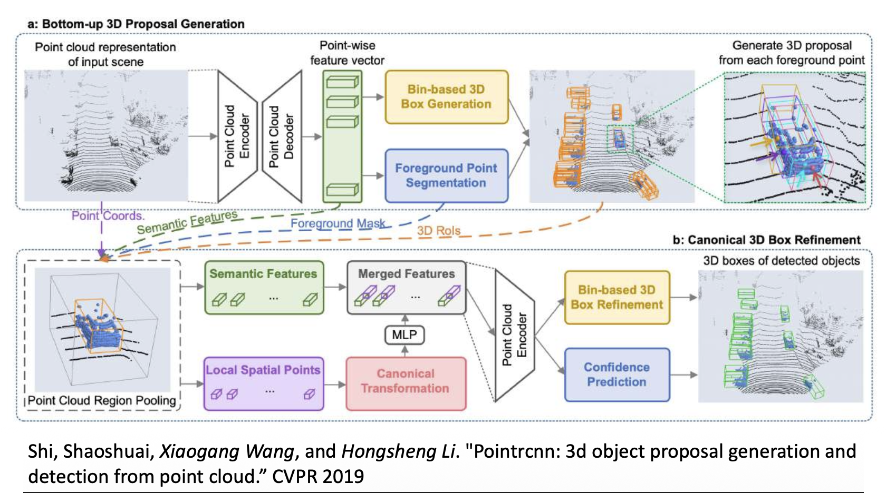
    

- **视锥 PointNet**：使用 2D 检测器生成 3D 建议

    

        
    

### 3D Instance Segmentation

- 输入：3D 点云
- 输出：每个 3D 点的实例标签

    

**自顶向下**的方法：

1. 运行 3D 检测

    

        
    

2. 在每个 3D 包围盒中运行分割

    

        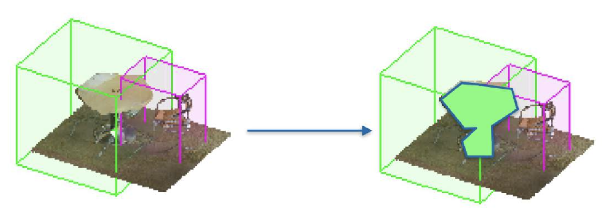
    

**自底向上**的方法：将（聚类(cluster)）点分组到不同的对象中

    

### Dataset

3D 目标的数据集：

- **ShapeNet**：大规模的合成数据

    

        
    

- **PartNet**(ShapeNetPart2019)：细粒度部分
    - 细粒度(fine-grained)（面向移动性(mobility)）
    - 实例级(instance-level)
    - 分层(hierarchical)

    

        
    

室内 3D 场景：

- **SceneNet**：大规模合成场景
    - 3D 网格
    - 5M 张逼真图像

    

        
    

- **ScanNet**：大规模扫描真实场景
    - 在 1500 次 RGBD 扫描中的 2.5M 次观看
    - 3D 相机姿态
    - 表面重构
    - 实例级语义分割

    

        
    

室外 3D 场景：

    

