# Multi-Modal Foundation Models

前面提到的模型大都是针对某一特定任务的**专用**(specialized)模型。而本讲会重点关注**基座模型**(foundation models)：一种经过预训练的模型，作为多种不同任务的基座。

    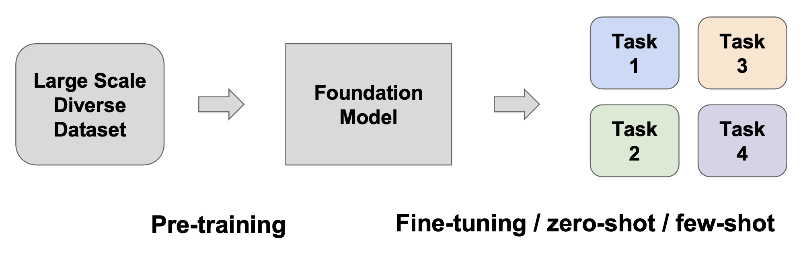

??? example "例子：语言模型（GPT）"

    

        
    

判断一个模型是否是基座模型的方法：

- 基座模型始终具有的特点：在多种不同任务中表现出通用性/鲁棒性
- 常见于基座模型的特点：参数量很大、数据量很大，以及自监督的预训练目标

基座模型有很多，我们将其划分为多个类别：

    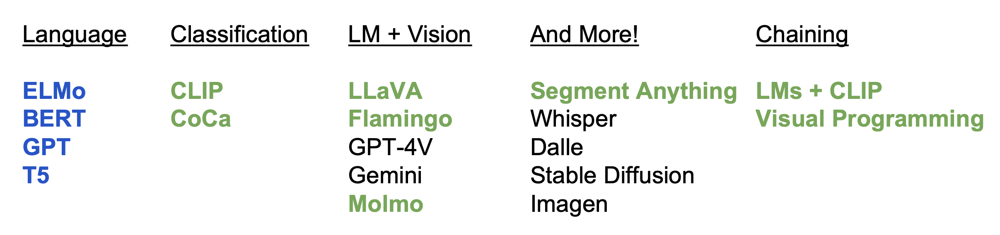

其中语言模型超出了我们的讨论范围。下面只专注于讨论**多模态**(multimodal)（视觉）的基座模型（标绿的模型）。

## Classification

### CLIP

{ align=right width=30% }

回忆 [SimCLR](19.md#simclr) 的**自监督**目标：

- 使用自监督学习习得图像特征
- 使用监督学习，在这些特征上训练小型分类器

可以看到，主要思路是在没有标签的情况下学习概念（即自监督学习的目标）。

    

我们希望习得的表征(representation)能够泛化到新的实例上。进一步地，我们甚至想将表征泛化到图像之外的形式，比如语言。于是像句子、短语之类的东西也可以嵌入到表征空间中。

    

>如图所示，带有 "cat" 的句子的表征离猫的图片对应的表征更接近，带有 "dog" 的句子的表征离狗的图片对应的表征更接近。

**CLIP** 模型正是这样一种结合了图像和文本的模型。它有一个**图像编码器**(image encoder)和**文本编码器**(text encoder)，分别输出图像和文本的表征（向量）。每个图像都对应一个文本描述，因此一个图像表征应当只和其中一个文本表征很接近（图中绿色线段），并且远离其他文本表征（图中红色线段）。

    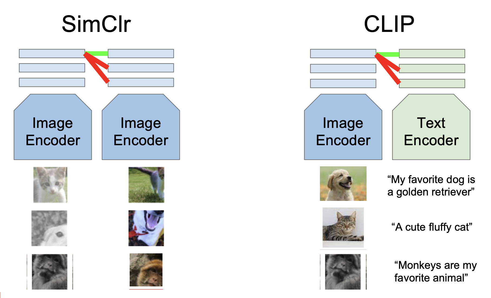

CLIP 采用和 SimCLR 类似的对比目标函数训练：

$$
\sum\limits_{i=1}^n -\log\left(\dfrac{e^{\langle u_i, v_i \rangle}}{\sum_{j=1}^ne^{ \langle u_i, v_j \rangle}}\right) + \sum\limits_{i=1}^n -\log\left(\dfrac{e^{\langle u_i, v_i \rangle}}{\sum_{j=1}^ne^{ \langle u_j, v_i \rangle}}\right)
$$

训练数据是从互联网上的图片及其关联的替换文本（HTML `img` 标签的 `alt` 属性）大规模抓取得到的。

训练结束后，我们会得到一个能给出图像和文本之间的相似度分数。

    

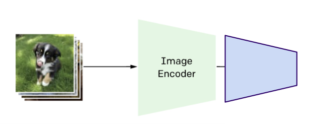{ align=right width=30% }

接下来对于上一步预训练得到的网络，通过**线性分类器**将编码器迁移到下游任务上，比如图像分类、目标检测、语义分割等任务。

下面是实验结果，可以看到 CLIP 的表现是最出色的。并且随着训练图像的增多，CLIP 的表现会越来越好。

    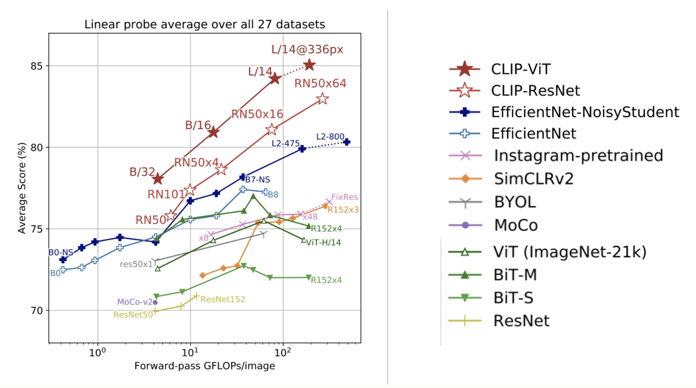

但事情还没结束。语言模型和 CLIP 这样的视觉-语言模型的一个很大的区别是：LLMs 可以在**零样本**(zero-shot)学习的情况下用于新的下游任务中，也就是说 LLMs 是“开箱即用的”。

    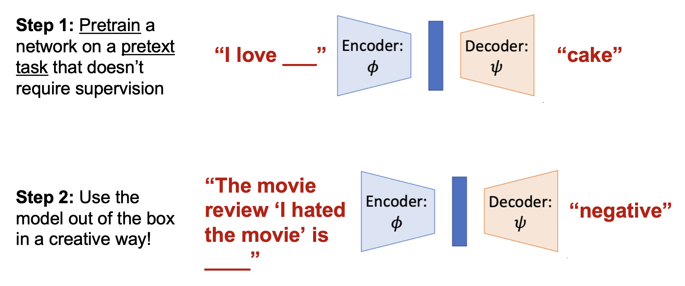

所以我们希望 CLIP 也能做到零样本学习，比如在没有微调的情况下完成分类任务。一个聪明的技巧是使用文本编码器来创建分类器

- 为每个类别创建一个向量表征
- 然后让图像匹配最相似的向量
- 可以把这看作一个 1-NN（最近邻）算法，其中向量作为训练数据使用

    

        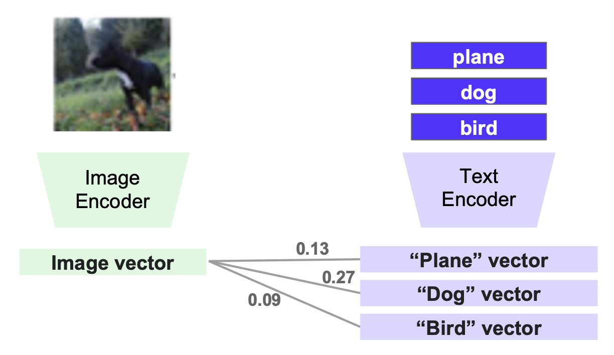
    

- 因为 CLIP 是用短语训练的，所以可通过采用形如 "a photo of a [catagory]" 来提升性能

    

        
    

- 一个问题是单个短语可能过于片面(biased)；解决方案就是使用多个短语

    

        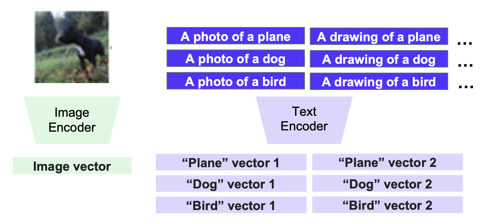
    

- 使用跨短语的平均向量作为每个类别的表征

    

        
    

现在，我们可以将 CLIP 作为一个在任意数据集上的图像分类任务的基座模型了！

    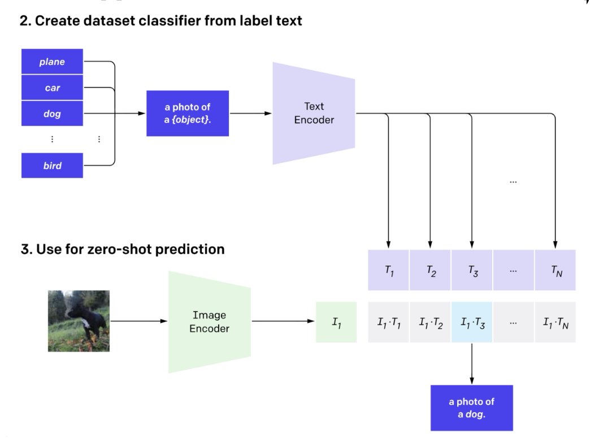

可以看到，CLIP 在各种数据集上均取得优异的表现（~~几乎全方位吊打 ResNet 101~~）

    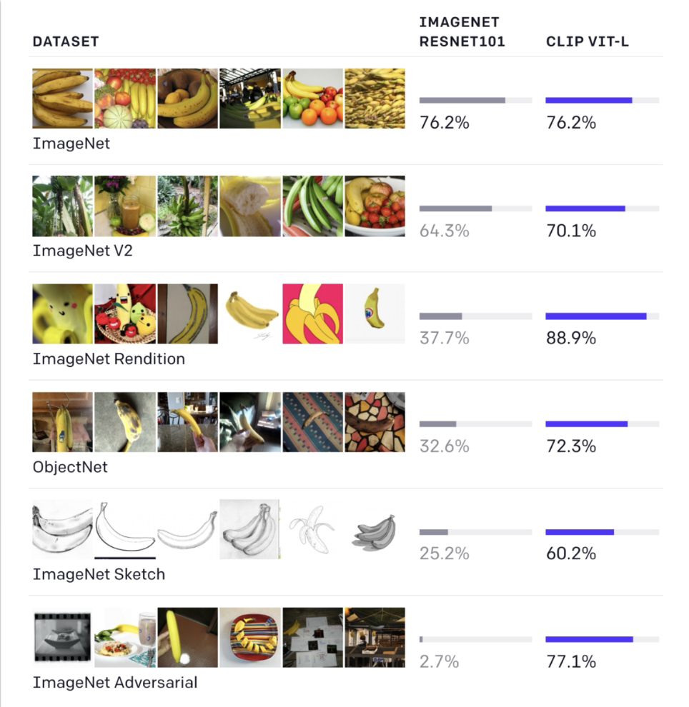

- CLIP 在 ImageNet 上训练时没有用到标注，这和 ResNet 101 不太一样
- 由于仅在 ImageNet 上训练无法很好地泛化到其他数据集上，ObjectNet 就是为了解决这一问题的；它包含了 ImageNet 一样的图像类别，但是拍摄视角会更怪一些

下图则比较了零样本 CLIP 和线性探测 ResNet50 的表现：

    

之所以 CLIP 能取得这么好的成绩，主要原因是 CLIP 不仅通过 Transformer 架构**扩大了**(scale up)**模型参数**，还通过从互联网上爬取图像-文本对**扩大了训练数据量**。

    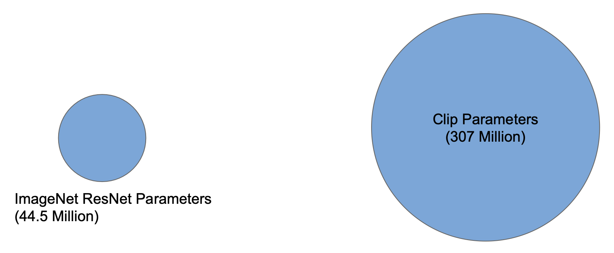
    

### CoCa

**CoCa** 在 CLIP 的基础上通过增加一个生成目标(generative objective)来进一步提升表现。具体来说，这是通过增加一个带描述损失的解码器(decoder with captioning loss)实现的。

    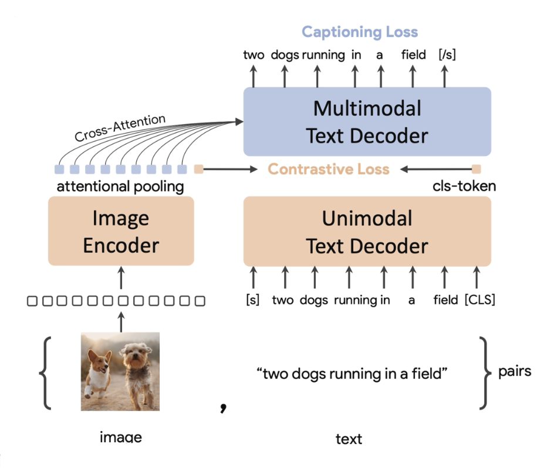

下表列出了实验结果。可以看到 CoCa 成功在各个数据集上击败了 CLIP。

    

像这种分类器基座模型在 ImageNet 上击败了其他所有的模型。

    

---
???+ recommend "CLIP 风格的模型的优点"

    - 点积运算超级高效
        - 易于训练（能够扩展）
        - 更快的推理，比如在 5B 张图像上检索
    - 开放词汇(open-vocabulary)（零样本泛化(zero-shot generalization)）
    - 能够和其他模型链接(chain)起来使用（比如后面将会介绍的 CuPL）

???+ bug "CLIP 风格的模型的缺点"

    - 学习概念时重度依赖**批次大小**
        - 增加批次大小有助于理解更加细粒度(fine-grained)的概念

            

                
            

        - 但是我们能够达到的粒度是有限的
        - 即便批次大小为 32K，模型可能还是没法区别有关“草中的马克杯”和“马克杯内的一些草”的图像

            

                
            

        - 研究发现，CLIP 无法理解**组合性**(compositionality)的概念，也就是说图像中多个物体间的关系没能很好地在 CLIP 的表征中体现出来

            

                
            

        - 一种可能的解决方法是**硬负微调**(hard negative fine-tuning)

            

                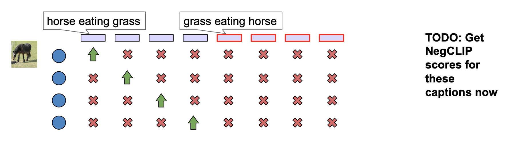
            

            - 但这个方法会带来新的问题，会导致模型没有学会很多该学的语义

                

                    
                

    - 图像级的描述(captions)提供的监督不足

        

            
        

        - 解决方法：使用**包围盒**(bounding box)进行进行**区域**性的图像描述训练

            

                
            

    - 我们无法得知超大规模的数据集（比如 5B 张图像）内的每个数据
        - 因此数据收集和过滤是相当重要的工作

## LM + Vision

???+ info "动机"

    语言模型的下一个 token 预测的能力可以应用到更为广泛多样的推理(inference)任务上，比如数学、语义分析、符号推理等。

**视觉-语言模型**(vision-language models)接受图像和文本输入，并输出文本。

最早的视觉-语言模型是 2019 年的 **ViLBERT**。然而，该模型必须为每个任务单独微调，并采用不那么简单的任务特定的方法，比如 RefCOCO 的 Mask-RCNN 包围盒重排序(re-ranking)。

    

### LLaVA

**LLaVA** 利用了 LLMs 的自回归本质：

    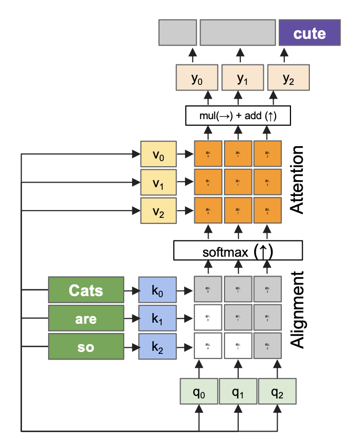

LLaVA 背后的关键思路是向 LLM 增加视觉信息：

    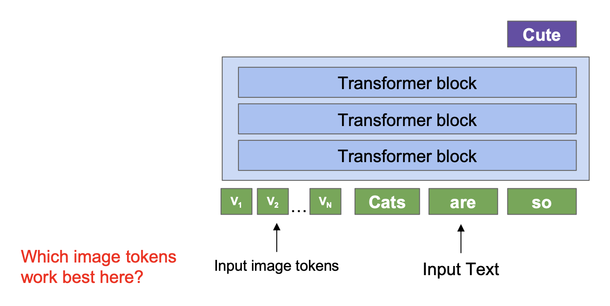

要想生成图像的 token，采用 **CLIP 编码器**是一个不错的选项。

    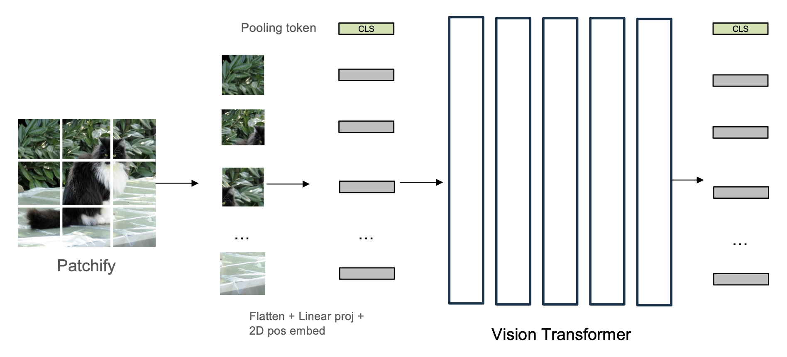

- 从 CLS（分类）token 提取图像特征用于对比学习
- 但剩余的 tokens 是未监督的（可能是随机的，损失没有改变，所以不一定包含有效信息）

实际上，我们会使用倒数第二(penultimate)层的 tokens，因为它们保留了最适合 LLMs 的空间和语言信息。此时可以删除 CLS token 以获得轻微的收益。

    

LLaVA 的总体架构如下：

    

训练步骤为：

1. 初始化用于 LLM 解码器的预训练语言模型（比如 LLaMA）和预训练图像编码器（比如 CLIP）
2. 训练一个新的**线性层**，将 CLIP 特征连接到 LLM 的输入空间中
3. 一起微调 LLM 和线性层

当样本（包括输入图像、输入指令和输出文本）数在 100,000 以上时，该模型能取得合理的表现。

### Flamingo

>这个单词的意思是「火烈鸟」。

**Flamingo** 采用了一种新的融合视觉特征的方法。

=== "预训练部分"

    

        
    

=== "两个学习部分"

    

        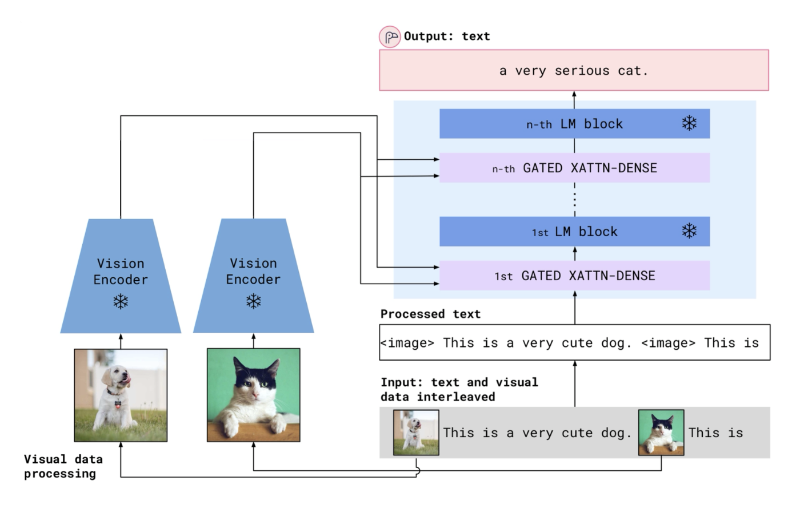
    

=== "感知采样器"

    将可变大小的图像 token 转换为固定大小的 token

    

        
    

Flamingo 的门交叉注意部分的细节如下：

    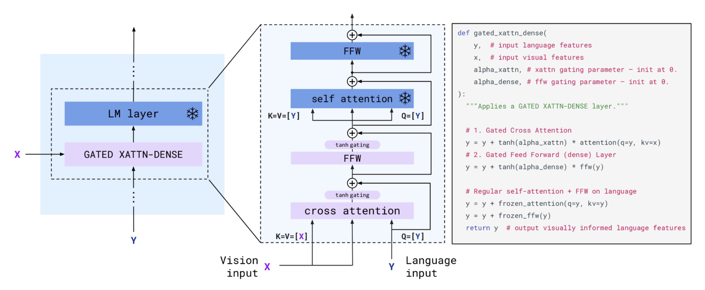

这一组件的作用是查看图像特征，然后决定图像特征
的哪些部分要保留，哪些内容对语言模型有用。

Flamingo 安排训练数据，使其和语言模型的类似。具体来说，它通过特殊标签 \<image\>, \<eos\> 分别来指示图像何时出现或文本何时结束。

    

Flamingo 采用掩码注意力，让模型在训练时只关注图像的特定特征。

    

???+ example "结果"

    

        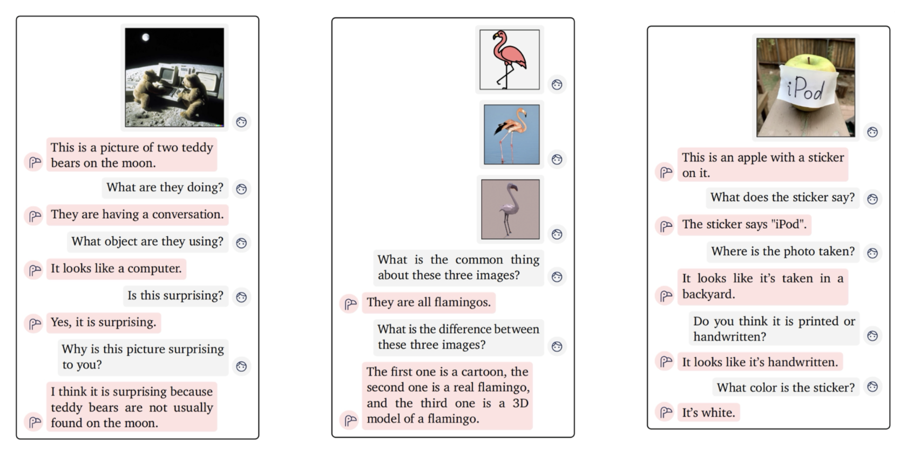
    

Flamingo 还支持**情境学习**(in-context learning)。

???+ example "结果"

    

        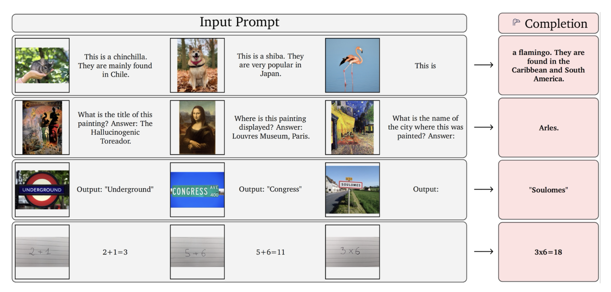
        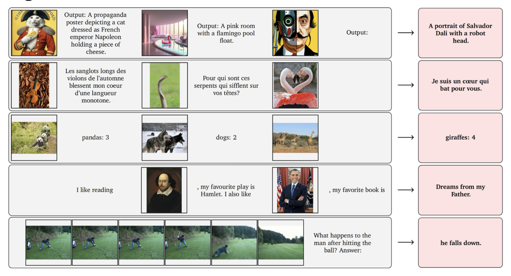
    

下表给出了实验结果，可以看到 Flamingo 在零样本和少样本上表现出色。

    

### Molmo

下面列举了一些知名 LLMs 在 11 个视觉理解基准测试上的平均表现：

    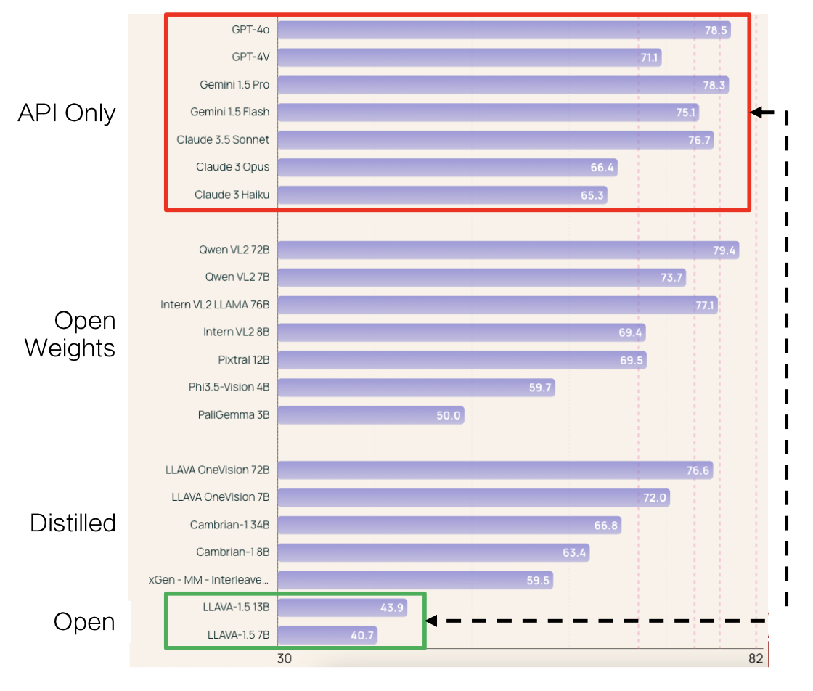

- 可以看到开放模型（绿框）和专有模型（红框）表现间的鸿沟
- 那些开放权重(open-weight)模型虽然表现不错，但它们是从 GPT 这样的模型中蒸馏出来的

而 **Molmo** 模型的出现成功在不依赖这些专有模型的情况下弥补开放模型和专有模型的巨大差距。

    

下面是来自其中一个关于 VLMs 的最大的人类偏好评估（325k 对比较 + 870 位人类标注员）的结果：

    
    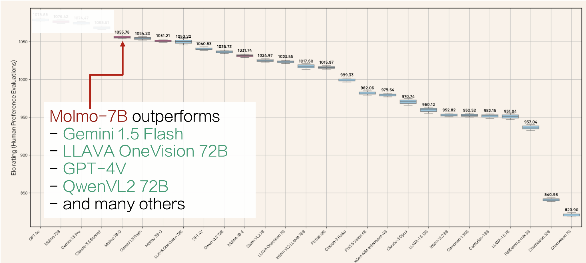

Molmo 将推理直接建立在像素上，因此它能完成计数等任务。

    

Molmo 的成功给我们的一个启示是：数据很重要，且质量比数量更重要。

    

互联网数据是**偶然的**(incidental)（关于图像的描述往往是上传者的主观感受，而很少谈论图像本身的内容），而人类标注数据是**有意的**(intentional)（对图像的真正内容进行更密集的描述，比如一般不会谈论的常识信息）。

    
    

然而，收集密集描述是很困难的一件事，需要精心设计一些能让人类标注员从图像中提取有意义的视觉信息的问题，比如：

- 第一眼看到的图像是什么？
- 物体有哪些，它们的数量是多少？
- 文本内容是什么？
- 物体的位置在哪里？
- 有哪些细微的细节值得注意？
- 背景中有什么？
- 风格和颜色是什么？

由于人们更喜欢说话而不是打字（真的吗？），所以要求标注员在大约 60-90s 的时间内描述一幅图片，然后将口头描述自动转化为文本作为预训练数据。

下图展示了 Molmo 模型架构。可以看到架构本身没有什么特殊之处，关键就在于先前精心准备的数据。

    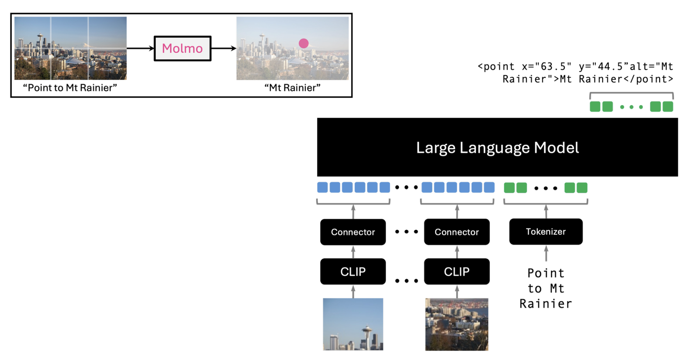

???+ example "应用"

    === "例1"

        从感知到行动：

        

            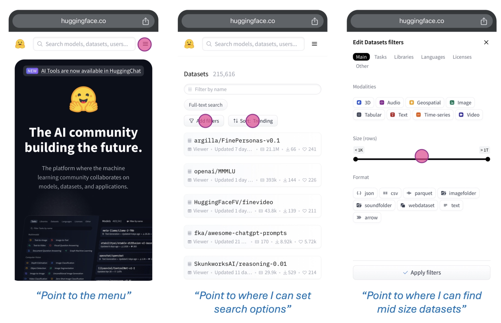
        

    === "例2"

        

            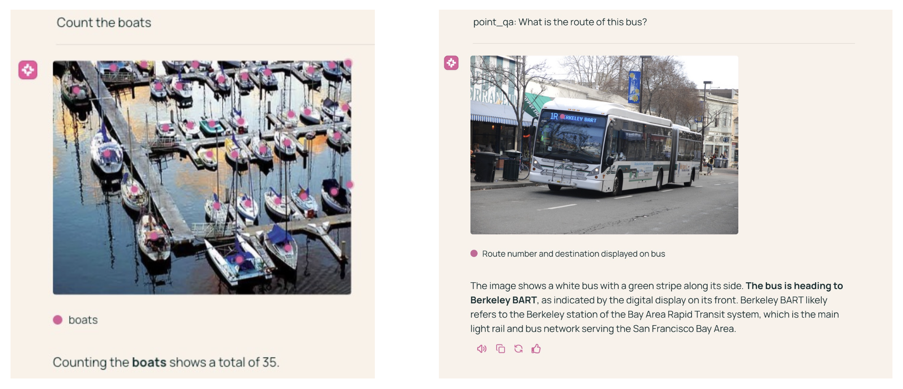
        

    === "例3"

        

            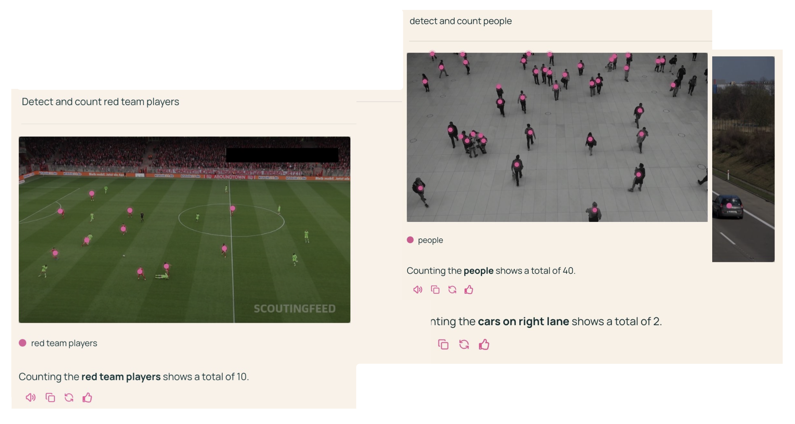
        

    === "例4"

        将 Molmo 和 SAM 2 链接起来：

        

            
        

未来也许能用于具身智能领域（导航和操纵）。

Demo：<https://molmo.allenai.org/>

## Segment Anything Model (SAM)

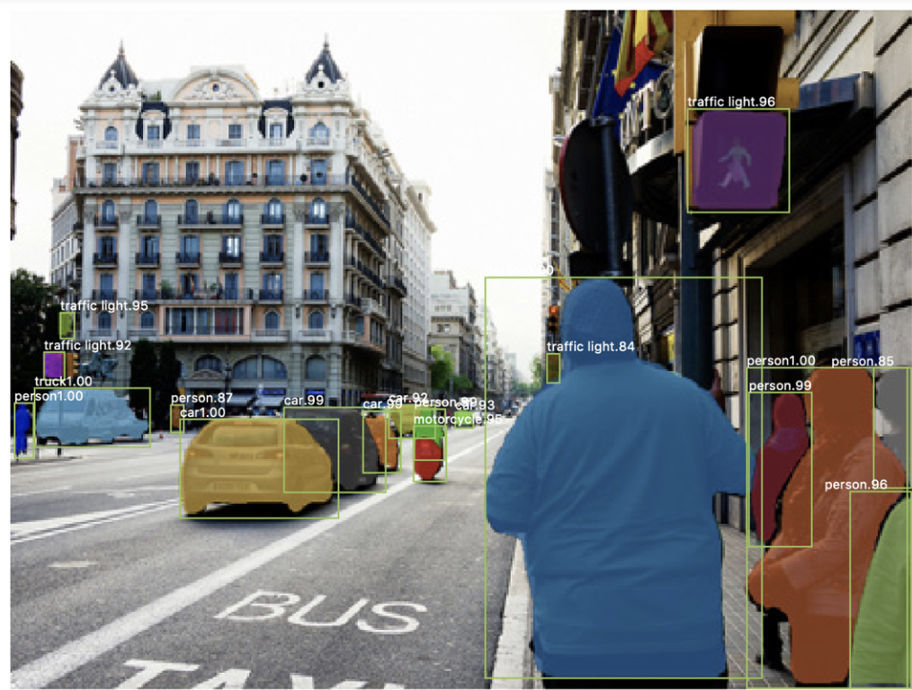{ align=right width=20% }

先来看一个经典的用于分割任务的模型——**掩码 R-CNN**：

- 在特定数量目标的数据集上（COCO 中的 80 个目标）训练的掩码模型
- 模型输出该图像中所有属于感兴趣类别的对象的掩码

{ align=right width=30% }

接下来我们介绍一个用于分割任务的基座模型——**万物分割模型**(segment anything model, **SAM**)：

- 在一个包含大量类别的数据集上训练的掩码模型
- 模型输出用户关心的任何对象的掩码

基本的 SAM 架构：

    

架构细节：

    

正确提示词中的歧义问题(ambiguity)：

    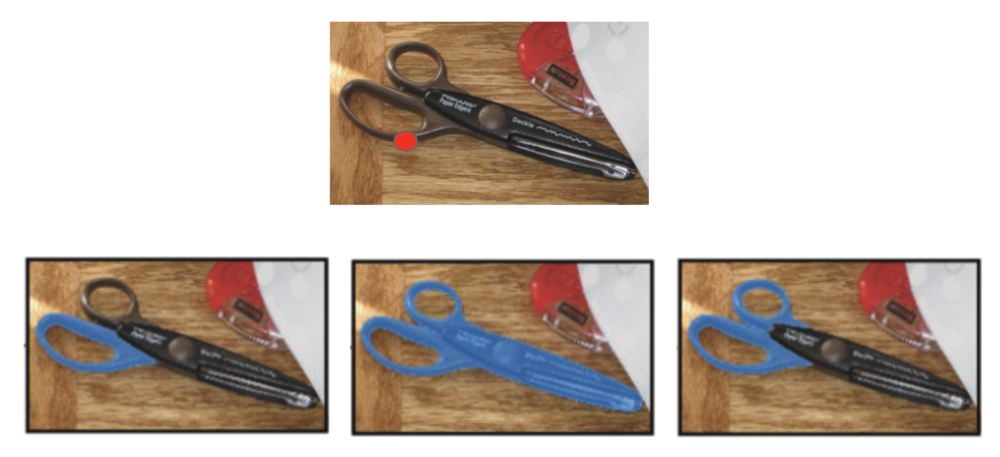

解决方案：

- 损失仅在最佳掩码上计算
- 训练模型输出每个掩码的置信分数

当时数据集的图像数量和掩码数量都很少，而这篇论文的作者们将这些数量分别增长了 6 倍和 400 倍。

    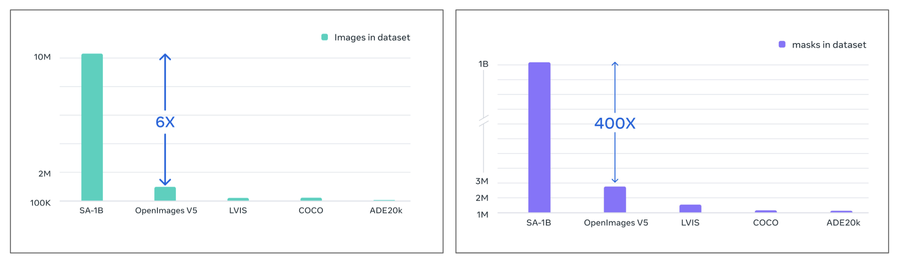
    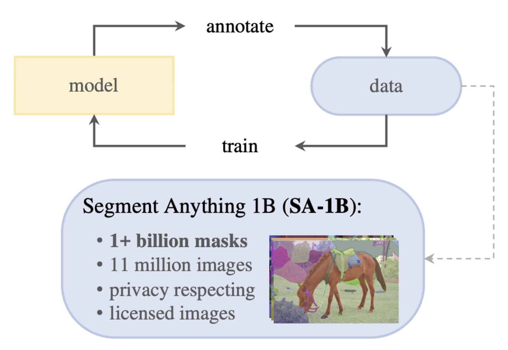

???+ example "结果"

    

        
    

    

        
    

???+ example "零样本 SAM 的结果"

    

        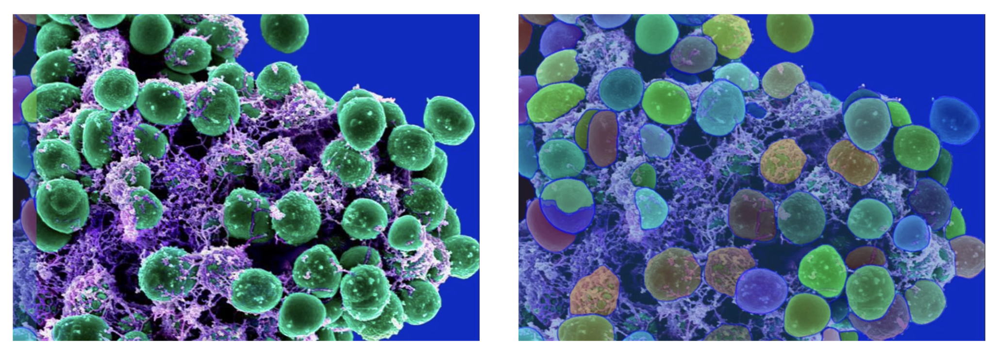
    

    

        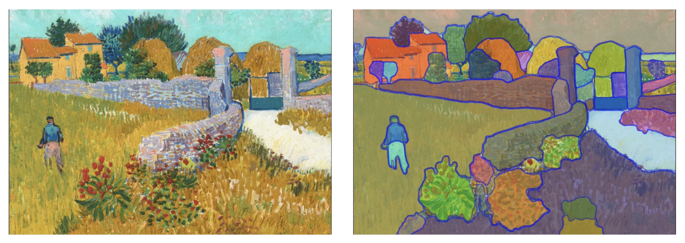
    

## Chaining

当模型被要求在从未见过的图像上分类时，大概率会翻车的。解决方案是采用**链**(chaining)：

1. 让 LLM 生成一段图像描述
2. 基于描述分类

### LMs + CLIP

**CuPL**（通过语言模型的定制化提示词(customized prompts via language model)）就是其中一个典例：

    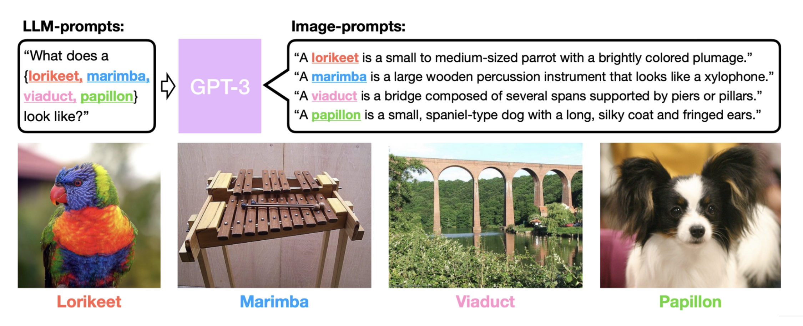

实验结果如下：

    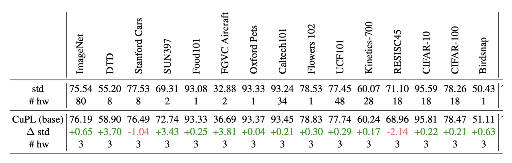

### Visual Programming

现在我们尝试将这一链式方法推广到所有的视觉任务中。**VisProg**（视觉编程(vision programming)）便是这样的一个模型。它的思路是：

- 训练一个用于某一任务的新模型
- 编写 Python 脚本，调用已有模型来判断答案

    

    

我们可以为 Python 脚本给予各种来自其他模型的函数，从而具备目标检测、人脸识别等功能，并且可以将这些功能链接起来，以完成不同类型的任务。

    

???+ example "结果"

    === "例1"

        

            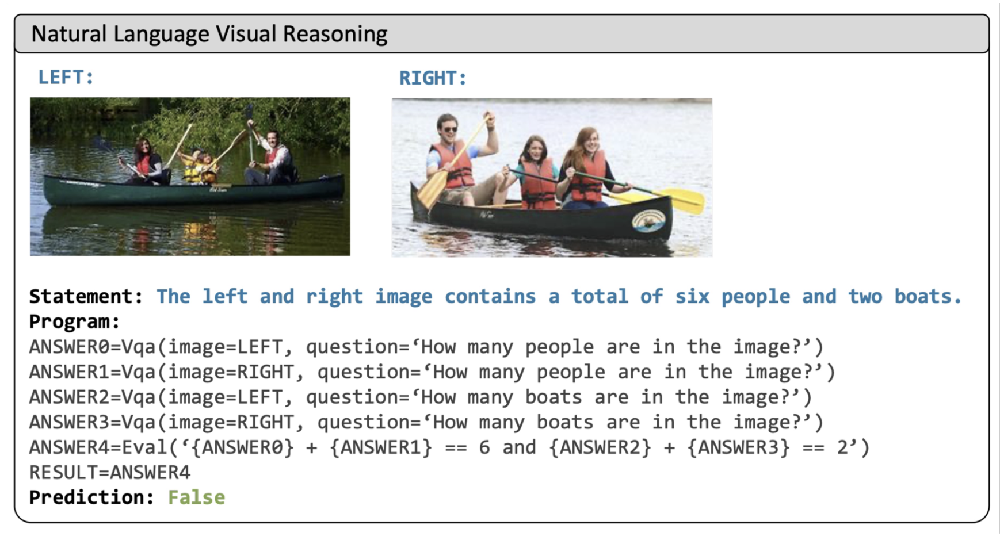
        

    === "例2"

        

            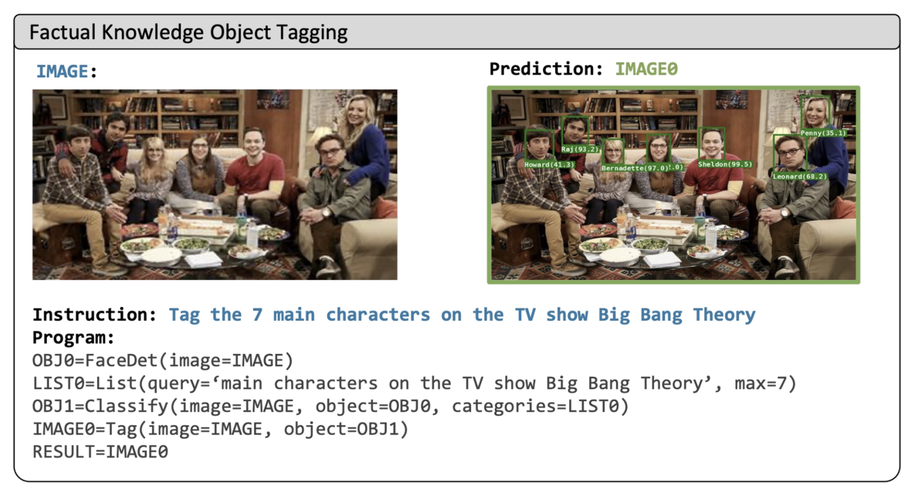
        

    === "例3"

        

            
        
