# Robot Learning

机器人学习是指让智能体在**环境**(environment)中执行**行动**(actions)，并获得**奖励**(rewards)的问题。其目标是学会采取能够最大化奖励的行动。

    

这是一个快速增长的领域：

    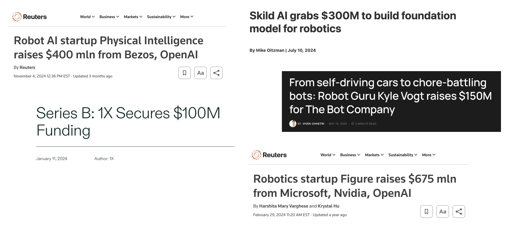

    

## Problem Formulation

下图展示了机器人学习问题的整个过程和形式化表述：

    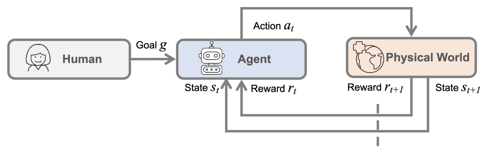

???+ example "例子"

    === "车-杆问题(cart-pole problem)"

        

            
        

    === "机器人运动(robot locomotion)"

        

            
        

    === "[雅达利](https://en.wikipedia.org/wiki/Atari?useskin=vector)(Atari)出品的电子游戏"

        

            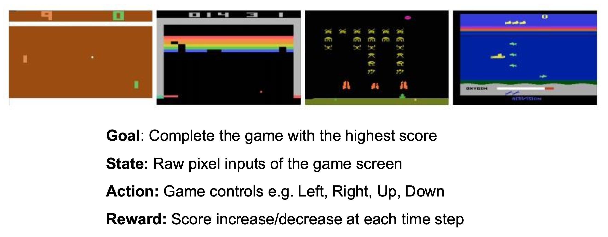
        

    === "围棋"

        

            
        

    === "文本生成"

        

            
        

    === "聊天机器人"

        

            
        

    === "叠衣服机器人"

        

            
        

## Robot Perception

机器人的**感知**(perception)是指让机器人理解非结构化的现实世界，对应上面流程图中的状态 $s_t$。

- 机器人从环境中获得的观察结果只包含关于物体和场景的**不完整的知识**
- **不完美的行动**可能导致失败
- 环境是**动态变化的**，并且**其他智能体**的存在也会影响到环境

机器人的感知系统应当应对上述所有变化，因此我们会为机器人添加尽可能多的**传感器**(sensors)，考虑多样的感觉，从而理解和世界的交互。

    

相比一般的计算机视觉，**机器人视觉**(robot vision)具有以下特点：

- **具身**(embodied)：机器人具有实体，能够直接体验世界；它们的行为是世界动态的一部分，并且它们对自身感知有即时的反馈
- **主动**(active)：机器人是主动的感知者；它知道为什么想要感知，并选择要感知的内容，以及如何、何时何地实现这种感知
- **环境定位**(environment situated)：机器人位于世界之中；它们不处理抽象描述，而是直接与影响系统行为的“此时此地”("here" and "now")打交道

机器人学习中的一个关键挑战是闭合**感知-行动循环**(perception-action loop)。

    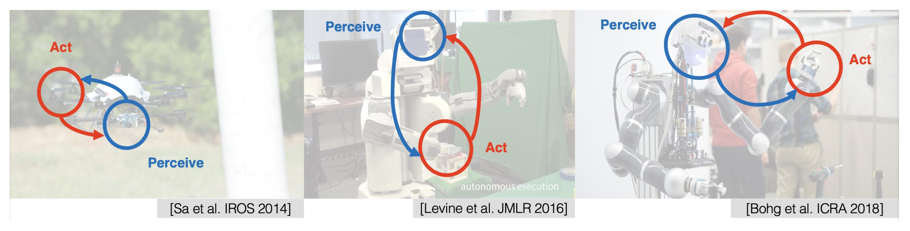

## Reinforcement Learning

我们采用**强化学习**(reinforcement learning, **RL**)的方式训练与环境交互的智能体，并使其学会最大化奖励（**试错**(trial and error)）。

    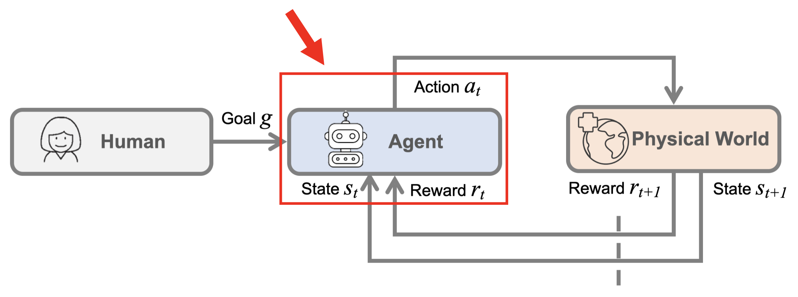

=== "强化学习"

    

        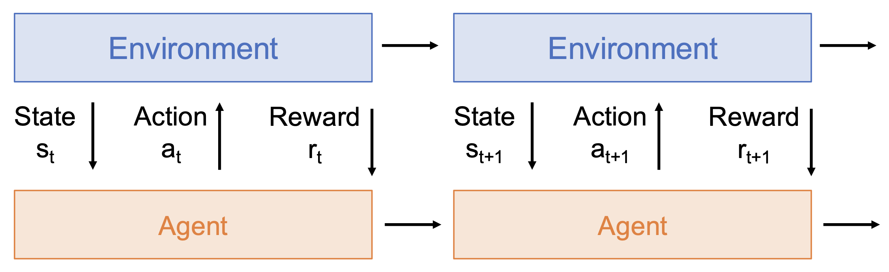
    

=== "监督学习"

    

        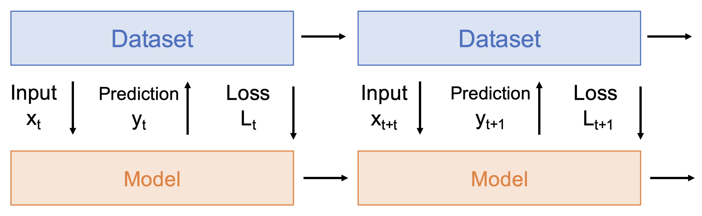
    

看起来强化学习和监督学习是十分相似的，但实际上两者还是有很大差异的，具体体现在以下几方面：

- **随机性**(stochasticity)：奖励和状态转移可能是随机的

    

        
    

- **信用分配**(credit assignment)：奖励 $r_t$ 并不直接取决于行动 $a_t$

    

        
    

- **不可微分**(nondifferentiable)：无法计算 $d r_t / d a_t$，因而无法反向传播

    

        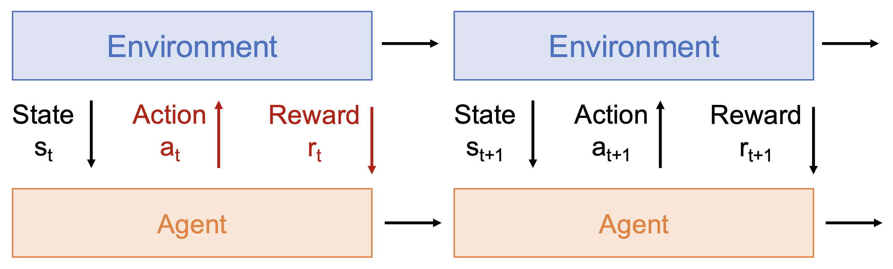
    

- **非平稳**(nonstationary)：智能体所经历的取决于它的行动

    

        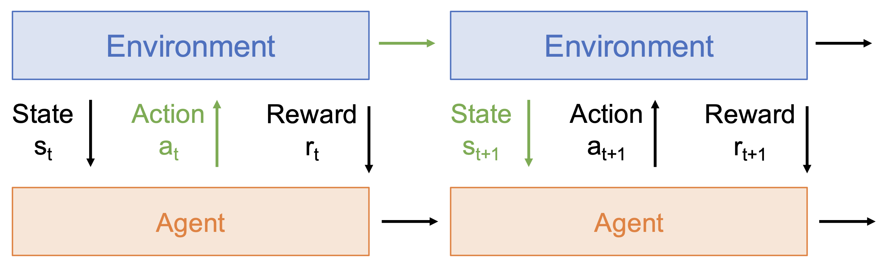
    

???+ example "例子"

    === "电子游戏"

        

            
        

        结果：<https://www.youtube.com/watch?v=V1eYniJ0Rnk/>

    === "围棋"

        

            
        

    === "更复杂的游戏"

        

            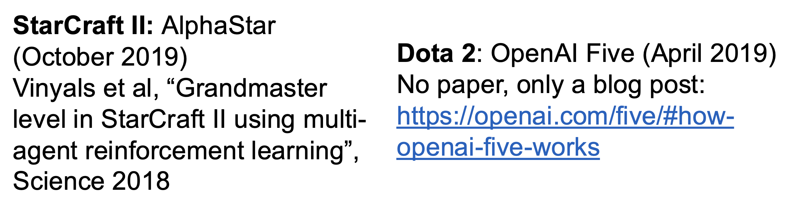
        

    === "机器人学"

        运动(locomotion)：

        

            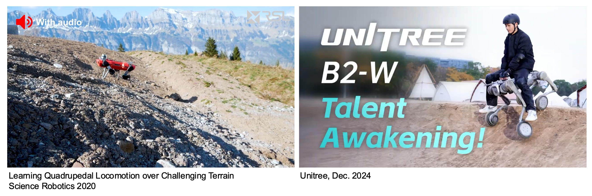
        

        灵巧操作(dexterous manipulation)：

        

            
        

???+ bug "（无模型(model-free)）强化学习的问题"

    - 从试错中学习需要大量的交互
        - 例子：训练 AlphoGo Zero 时，超级计算机花费 40 天学习了 3000 年的人类知识
    - 对安全的担忧
    - 有限的可解释性(interpretability)
    - 人类维持着对世界的直观模型
        - 广泛适用
        - 样本效率高

## Model Learning & Model-Based Planning

**模型学习**(model learning)和**基于模型的规划**(model-based planning)是指学习世界状态转移函数 $P(s_{t+1} | s_t, a_t)$，然后通过模型进行**规划**以做出决策。

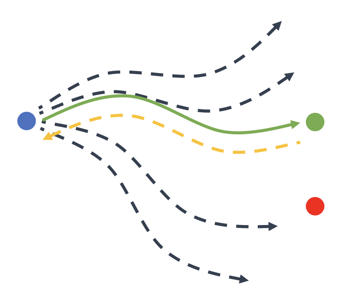{ align=right width=30% }

具体过程为（模型可能不够精确）：

1. 执行第一次行动
2. 获得新状态
3. 使用梯度下降重新优化行动序列

关键在于支持并行采样/梯度下降的 **GPU**。

一个关键问题是：$s_t$ 的形式应当是什么样的？多年来，关于这一问题有多种探索，下面列举其中一些具有代表性的研究：

???+ example "例子"

    === "像素(pixels)"

        仅使用 2D 图像作为状态表征，尝试学习像素的动态变化。

        

            
        

    === "关键点(keypoints)"

        跟踪物体关键点在三维空间中的运动，并且基于这些关键点为机器人的动作建模。这样就可以让机器人基于这种前向预测模型来规划自身的行为。

        

            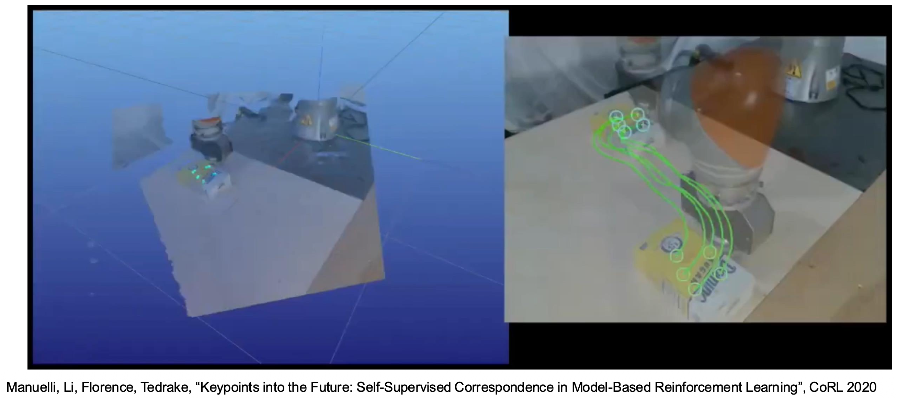
        

        

            
        

    === "粒子(particles)"

        用一组粒子表示物体，尝试预测当应用特定行动时，粒子将会如何移动。

        

            
        

        处理不同大小的颗粒状物体。

        

            
        

        

            
        

        包饺子机器人：

        

            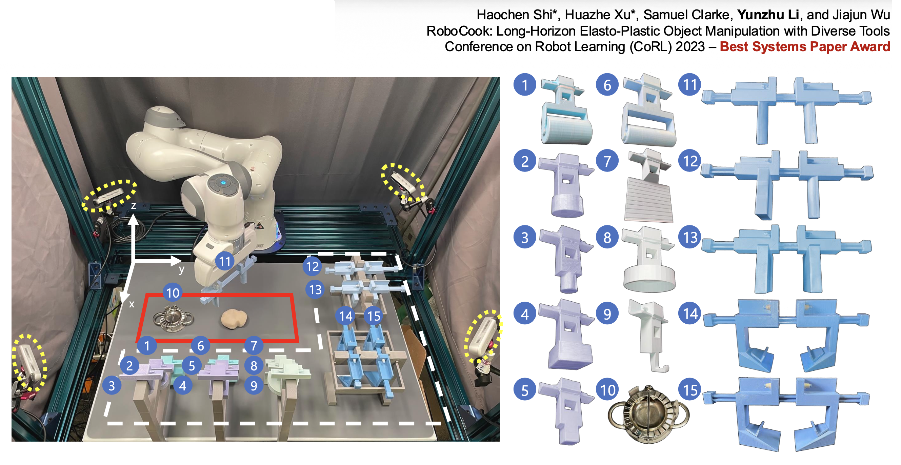
        

        >视频演示：<https://www.youtube.com/watch?v=rpfxhkh1nS4/>

        

            
        

        

            
        

        

            
        

## Imitation Learning

**模仿学习**(imitation learning)：从演示数据集中进行监督学习。

**行为克隆**(behavior cloning, BC)：

    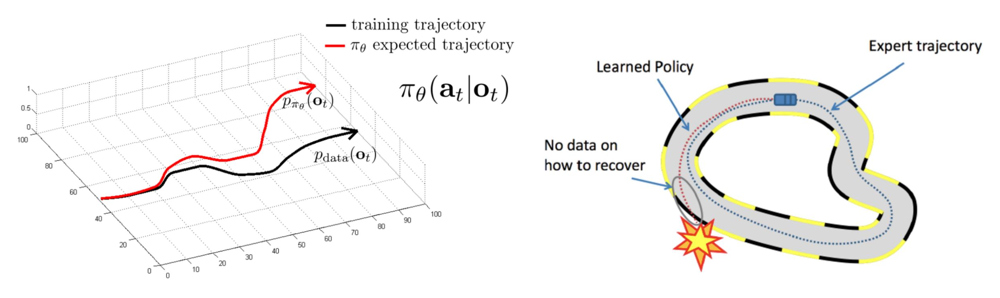

BC 的一个关键问题是级联错误(cascading error)：一开始犯的小错误会导致之后输出的轨迹和演示轨迹有很大的偏离。

专家演示的迭代收集：

    

通过上述生命周期，数据集中不仅包含初始演示，还包含那些纠错行为（重回正轨）。

**逆强化学习**(inverse reinforcement learning, IRL)：从演示中总结奖励，然后将这个奖励用在常规的强化学习中来学习算法。

    

**隐式行为克隆**(implicit behavior cloning, IBC)：不会学习显式的策略，而是直接建立从观察到行动的映射（灵感来源于基于能量的模型）。

    

**扩散策略**(diffusion policies)：将扩散模型作为策略函数，使得智能体继承扩散模型的优势和属性。

    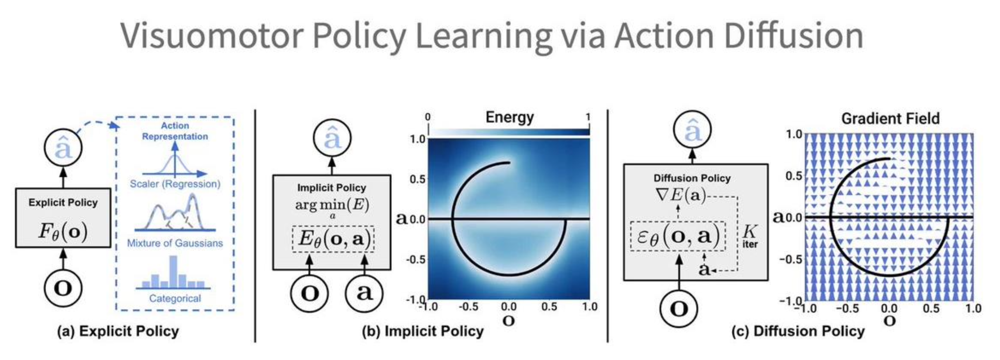

## Robotic Foundation Models

**机器人基座模型**(robotic foundation models)的特点：

- 没有显式的状态/转移函数
- 采用将（观察/状态、目标）映射到行动的策略

    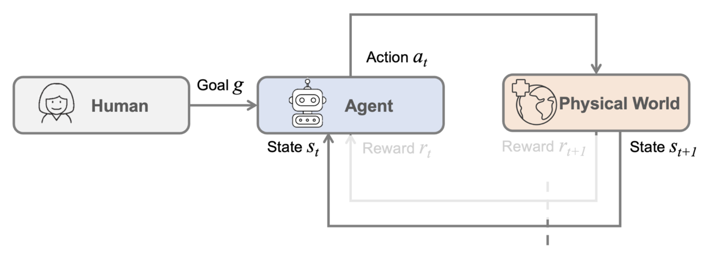

关于当前的基座视觉-语言模型：

- 输出可能**不够完美**
- 总是能生成一些**合理**的东西

对应到机器人基座模型：

- 合成动作可能**不是最优的**
- 生成的轨迹总是**优美且合理的**

不同的名称：视觉-语言-行动模型(vision-language-action models, VLAs)、大行为模型(large behavior models, LBMs)。

发展历程：

    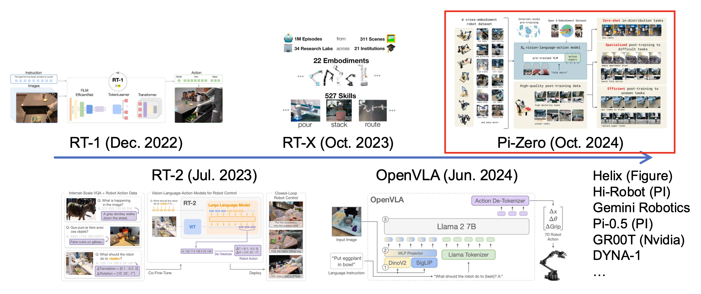

下面重点介绍 **Pi-Zero**（由 [Physical Intelligence](https://www.pi.website/) 开发）。

???+ example "结果"

    

        
    

架构图：

    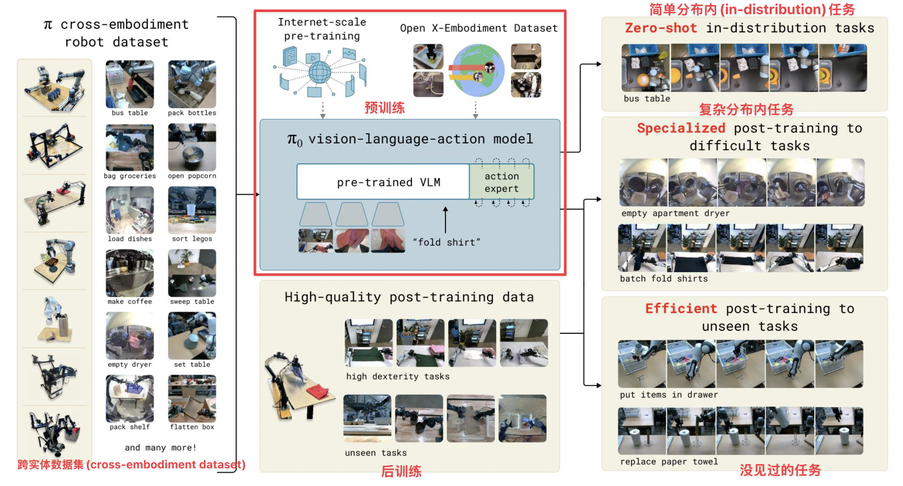

## Remaining Challenges

### Evaluation of the Robot Learning Models

**评估**(evaluation)主要在现实世界中执行。

- 但现实实际的评估是昂贵且嘈杂的
    - ~~不过也许有足够多的预算支持研究取得进展~~
- 训练损失和现实世界的成功率是弱相关的
    - 训练目标 vs 任务特定的指标，训练 vs 测试视野

既然现实世界的评估不那么容易，于是很自然地想到通过**模拟**(simulation)进行评估。

- 模拟与现实之间的差距：刚性 / 可变形 / 布料
- 高效资产生成
- 真实世界的数字化
- 逼真且多样场景的程序生成
- 模拟与现实之间的关联

    

### Foundation World Models

「**世界模型**(world models)」的一种可能定义：行动条件下的未来预测(action-conditioned future prediction)。

    

???+ example "例子"

    

        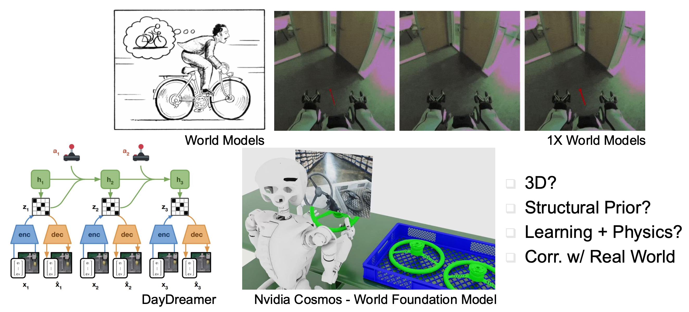
    

### Foundation Models for Embodied Agents

当前的基座模型并未针对具身智能体(embodied agents)进行定制。

- LLM/VLM 在与具身相关的任务中可能会失败
- 对几何/具身/物理交互的理解有限
- 从人类反馈中进行强化学习（RL）-> 从**具身反馈**(embodied feedback)中进行强化学习

    

### Adaptation / Life-Long Learning

- 适应新场景
- 适应人类偏好
- 自我提升/终身学习(life-long learning)

    

### Practical Considerations of Foundation Models

- 每个机器人工作都是一个**系统**工作
- 系统级考虑：延迟/计算/模块之间的通信

    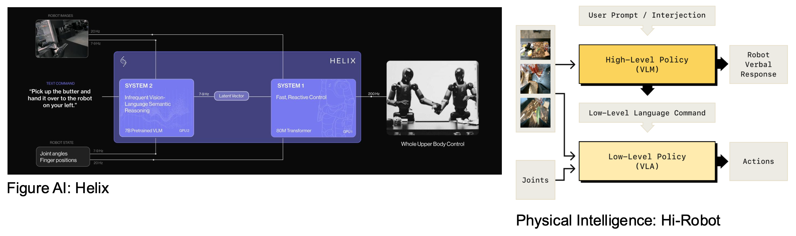

