# Computational Photography

??? abstract "核心知识"

    - HDR
        - 曝光 = 增益（ISO）* 辐照度（光圈）* 时间（快门速度）
        - 动态范围
        - 实现思路：曝光包围 + 合并
    - 去模糊
        - 非盲图像反卷积（NBID）：逆滤波器 + 维纳滤波器
        - 优化：添加关于原图像的 L1 正则化项
        - 盲图像反卷积（BID）：再添加关于核的 L1 正则化项
    - 明确不考的：上色、超分辨率

**计算摄影学**(computational photography)

- 传感器记录的数据并非最终图像
- 对最终图像进行一定计算，从而达到我们想要的效果

    

## High Dynamic Range Imaging (HDR)

???+ example "例子"

    

        
    

**曝光**(exposure)：粗略地说，就是给定固定场景下捕获图像的“亮度(brightness)”，可以用以下式子表示：
$$
\text{Exposure} = \text{Gain} \times \text{Irradiance} \times \text{Time}
$$

- **增益**(gain)由 **ISO**（感光度）控制

    

        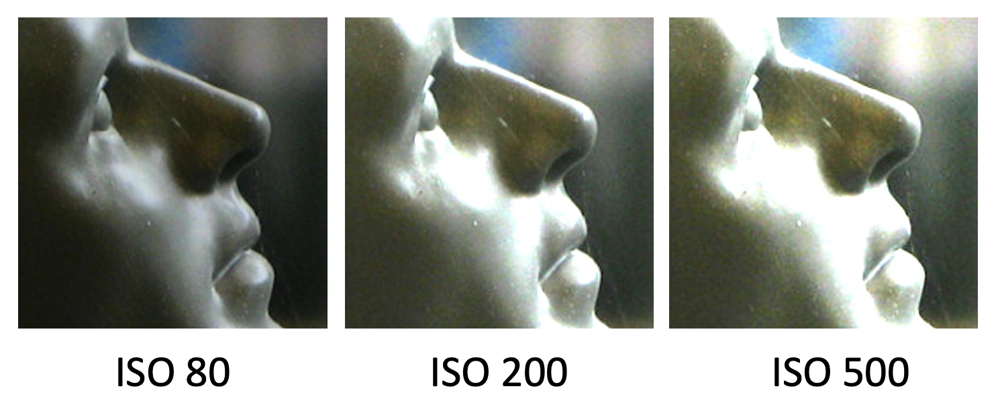
        
    

    - ISO 的副作用：随着 ISO 的增大，图像会变得非常粗糙，因为噪音被放大了

- **辐照度**(irradiance)由**光圈**(aperture)控制

    

        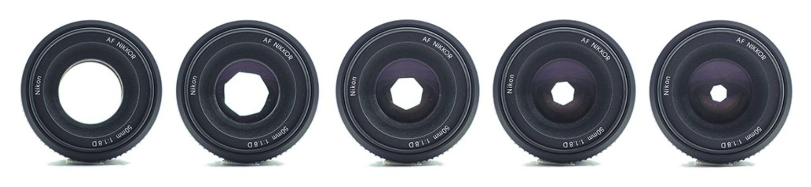
    

- **时间**(time)由[**快门速度**](2.md#shutter)(shutter speed)控制

    

        
    

拍照时，**平均曝光**(averaged exposure)应位于**传感器测量范围的中间**。这样照片既有亮部也有暗部，且细节丰富。

    

**动态范围**(dynamic range)：某一定量（通常是**亮度**）的最大值和最小值之间的比例。

???+ example "例子"

    - 10:1 -> 打印的照片（在光泽纸张上比例更高）
    - 256:1 -> 8 位 RGB 图像
    - 1000:1 -> LCD 显示器
    - 4096:1 -> 数码单反相机(digital SLR)（12 位）
    - 100000:1 -> 现实世界

!!! warning "挑战"

    - 传感器的测量范围与世界的动态范围不匹配

        

            
        

    - 因为量化，图像的动态范围更低（8 位 -> 256）

        

            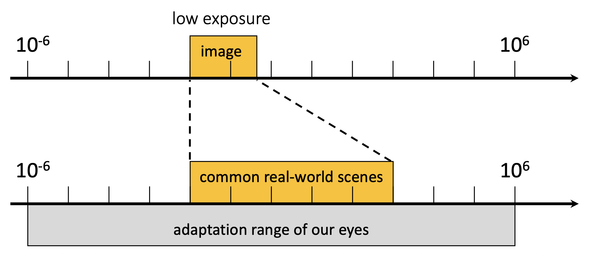
        

        

            
        

???+ example "比对"

    === "无 HDR"

        

            
        

    === "有 HDR"

        

            
        

关键思路：

1. **曝光包围**(exposure bracketing)：在不同曝光下捕捉多个 LDR 图像

    

        
    

    - 假设对于图像像素 $(x, y)$，其场景辐射率(radiance)为 $L(x, y)$
    - 不同曝光时间下拍摄的图像：

        

            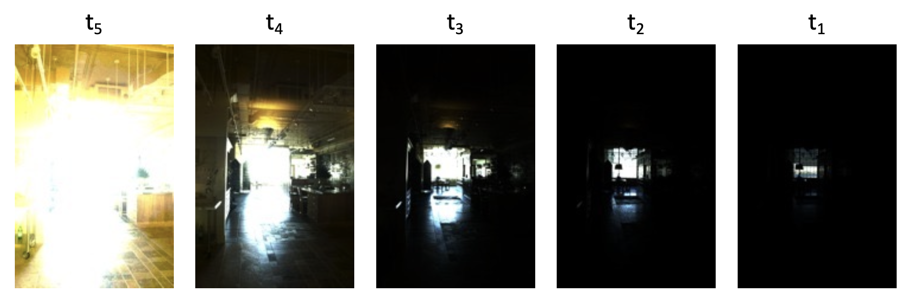
        

    - 作为关于 $L(x, y)$ 的函数，图像 $I(x, y)$ 的表达式为：

        $$
        I(x, y) = \text{clip}[t_i \cdot L(x, y) + \text{noise}]
        $$

        >注：$\text{clip}$ 函数限制像素值在合法范围内，比如超过最大值就强制设置为最大值

2. **合并**(merging)：将它们合并成一张单张 HDR 图像

    

        
    

    - 对每个像素：
        1. 寻找每张图像上的“**有效像素**”（（噪声）0.05 < 像素 < 0.95（裁剪(clipping)））

            

                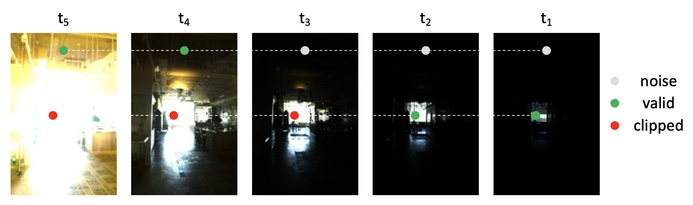
            

        2. 为有效像素值进行适当加权（像素值 / t~i~）
        3. 形成一个新的像素值，作为有效像素值的加权平均

    - 合并结果：

        

            
        

        
## Deblurring

图像**模糊**(blurring)的原因：

- **失焦**(defocus)：拍摄对象不在景深范围内

    

        
    

- **运动模糊**(motion blur)：物体移动或相机不稳定

    

        
    

下面我们用数学建模来描述图像模糊：

- 模糊的过程可以通过**卷积**来描述
- 模糊后的图像称为**卷积核**(convolution kernel)

    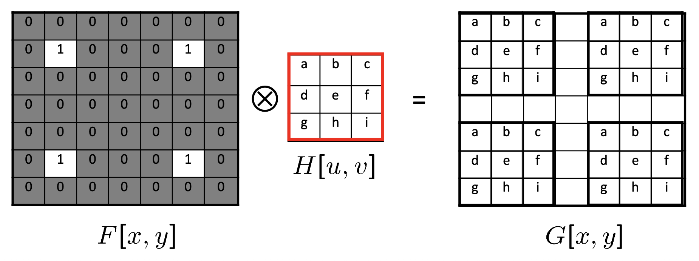

    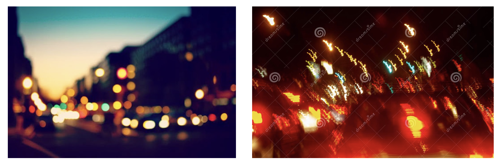

- **失焦**模糊的模式取决于**光圈形状**
- **抖动**(shaking)模糊的模式取决于**相机轨迹**

???+ example "例子"

    

        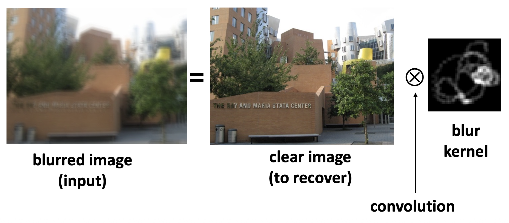
    

因此，**去模糊**(deblurring)的操作等同于**反卷积**(deconvolution)。下面给出具体的实现方法：

### Non-Blind Image Deconvolution (NBID)

**非盲图像反卷积**(non-blind image deconvolution, **NBID**)

    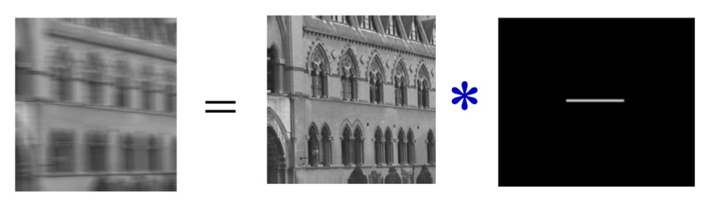

$$
G = F \otimes H
$$

- $G$：捕获图像（已知）
- $F$：待求解图像（未知）
- $H$：卷积核（已知）

频域(frequency domain)反卷积：

- 空间域中的卷积 = 频率域中的乘积

    $$
    FFT(G) = FFT(F \otimes H) = FFT(F) \times FFT(H)
    $$

- 那么，空间反卷积 = 频域中的除法

    $$
    F = IFFT(FFT(G) \div FFT(H))
    $$

- 通常称为**逆滤波器**(inverse filter)

    

        
    

???+ example "例子"

    高斯模糊：

    

        
    

    逆滤波的结果：

    

        
    

模糊核通常是一个低通滤波器，而**逆滤波器会放大高频成分**。

    

因此逆滤波器有可能会放大噪声：

$$
\begin{align*}
G(u,v) &= H(u,v) F(u,v) + N(u,v) \\
\hat{F}(u,y) &= G(u,v) / H(u,v) = F(u,v) + N(u,v) / H(u,v)
\end{align*}
$$

---
**维纳滤波器**(Wiener filter)：在逆滤波时抑制高频。

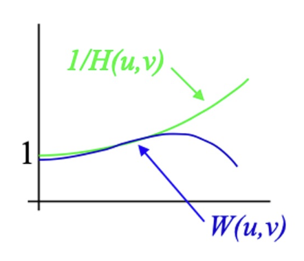{ align=right width=20% }

$$
\begin{align*}
\hat{F}(u,v) &= \textcolor{cornflowerblue}{W(u,v)} G(u,v) \\
W(u,v) &= \frac{H^{*}(u,v)}{|H(u,v)|^{2} + K(u,v)}
\end{align*}
$$

- 若 $K = 0$，那么 $W(u, v) = 1 / H(u, v)$，即逆滤波器
- 若 $u, v$ 很大时，$K \gg |H(u, v)|$，那么高频将会衰减(attenuated)
- $K$ 是一个**常量**标量，根据经验设置

???+ example "例子"

    

        
    

???+ example "应用"

    === "例1"

        

            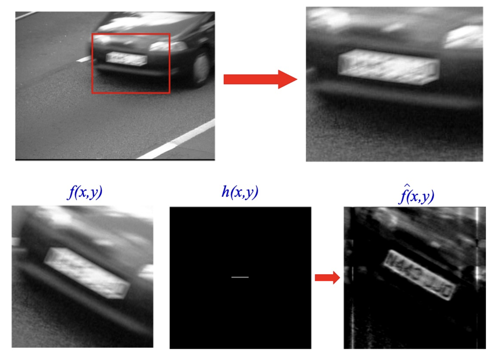
        

    === "例2：哈勃太空望远镜"

        

            
        

        

            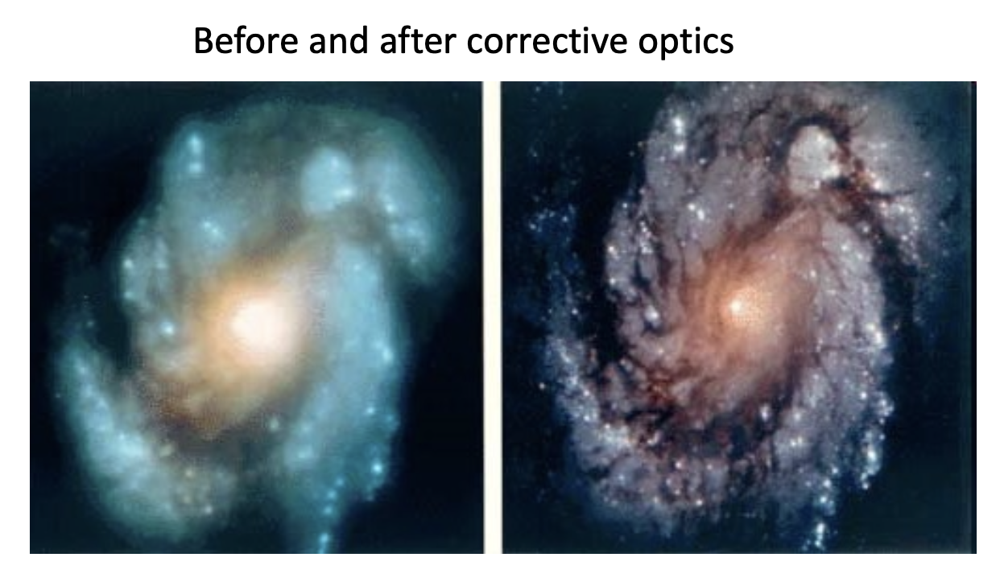
        

### Optimization

还可以通过**优化**(optimization)来实现反卷积。

- 优化的变量就是要被恢复的图像
- 目标函数
    - 模糊图像与给定模糊图像的相似度（可能性）
    - 恢复的图像看起来很真实（先验）

模糊图像生成过程：
$$
G = F \otimes H + N
$$

假设噪声 $N$ 是高斯噪声，可能性可以通过均方误差（**MSE**）来衡量：

$$
MSE = \| G - F \otimes H \|_{2}^{2} = \sum_{i,j}(G_{i,j} - [F \otimes H]_{i,j})^{2}
$$

???+ bug "问题：反卷积是**病态的**(ill-posed)"

    换句话说就是存在多解：

    

        
    

    可以看到，两个不同的解可以得到相同的 MSE。

因此需要解的**先验信息**(prior information)。

- 自然图像在片段(segments)上通常平滑
- 梯度图是稀疏的
- 添加 **L1 正则化**使图像梯度稀疏

    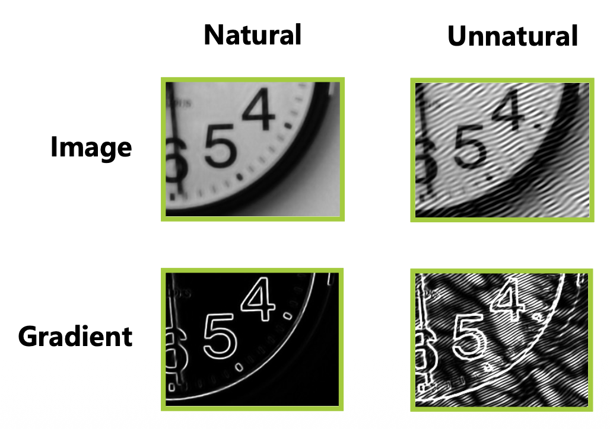

带先验信息的反卷积：目标函数 = 可能性函数 + 正则化项
$$
\min\limits_F \|G - F \otimes H \|_2^2 + \|\nabla F\|_1
$$

    

### Blind Image Deconvolution (BID)

**盲图像反卷积**(blind image deconvolution, **BID**)

- **卷积核也是未知的**
- 这显然更难，因此需要更多的先验知识

    

**核先验**(kernel prior)：

- 模糊核是非负且稀疏的
- 优化目标函数

$$
\min_{F,H} \| G - F \otimes H \|_2^2 + \lambda_1 \| \nabla F \|_1 + \lambda_2 \| H \|_1 \\ s.t. H \ge 0
$$

??? example "例子"

    以下是来自论文 *Removing Camera Shake from a Single Photograph*, SIGGRAPH 2006 的例子：

    === "原始照片"

        

            
        

    === "输出和模糊核"

        

            
        

## Colorization

直到 1970 年，彩色照片仍然非常罕见，人们只能通过黑白照片回顾历史。如今，利用技术将黑白照片转换为彩色照片是一件轻而易举的事。

**上色**(colorization)指借助计算机为单色图片或视频添加颜色的过程。

有两种主要的为灰度图像上色的方法：

- **基于样本**的上色(sample-based colorization)：使用样本图像

    

        
    

    扫描目标图像，对每个像素：

    - 在样本中找到最佳匹配点（比如考虑亮度与相邻像素的标准差(standard deviation)）
    - 将匹配点的颜色分配给像素

- **交互式**上色：用画笔交互式地绘制

    

        
    

    - 对于两个相邻的像素，如果亮度相似，那么颜色也应该保持相似
    - 基于这个假设，着色问题被转化为一个优化问题，相应的目标函数如下：

        $$
        J(U) = \sum\limits_r \left(U(r) - \sum\limits_{s \in N(r)} w_{rs} U(s)\right)^2
        $$

        - $U(r), U(s)$：像素 $r, s$ 的 RGB 颜色
        - $N(r)$：像素 $r$ 的邻居像素
        - $w_{rs}$：测量 $r, s$ 相似度的权重

    - 约束条件：用户指定的笔刷像素颜色保持不变

    ???+ example "例子"

        === "例1"

            

                
            

        === "例2：视频上色"

            

                
            

            

                
            

### Modern Approach

    

CNN（链接：<http://richzhang.github.io/colorization/>）：

    

{ align=right width=20% }

用于图像合成的损失函数：

- 重构损失：$L(\Theta) = \|F(X; \Theta) - Y\|^2$
- 问题：
    - 无法处理多解的情况
    - 无法测量图像的真实性

我们可以学习一个衡量图像是否真实的损失函数——利用**生成式对抗网络**(generative adversarial network, **GAN**)：

    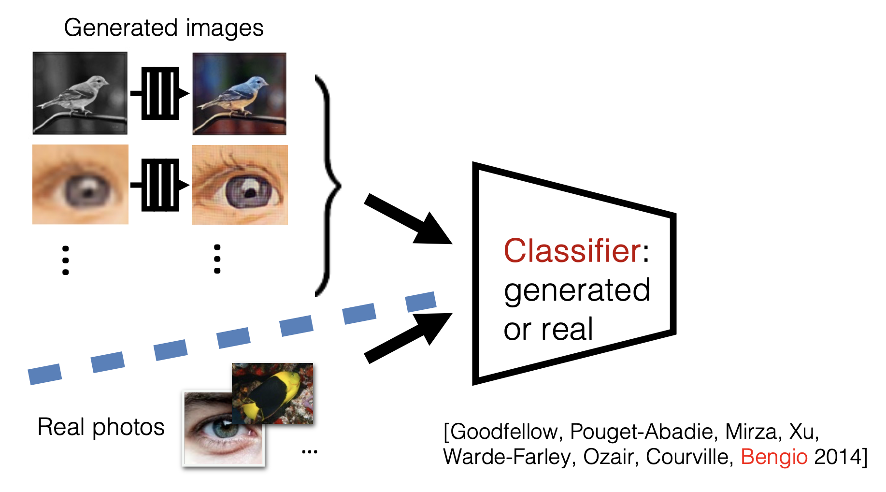

    

- G 尝试合成能够欺骗 D 的假图像
    - 而且是最好的 D

    $$
    \arg\min_{G} \max_D \mathbb{E}_{\mathbf{x},\mathbf{y}} \left[ \log D(G(\mathbf{x})) + \log(1 - D(\mathbf{y})) \right]
    $$

- D 尝试识别出假图像

    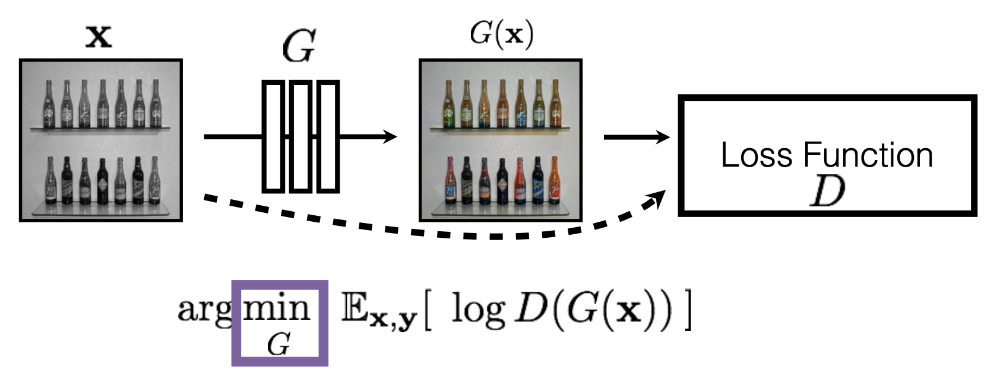

可以把 D 看做用于训练 G 的损失函数

- 称为**对抗损失**(adversarial loss)
- 通过学习而非手工设计
- 可应用于任何图像合成任务

???+ example "更多的图像合成任务"

    === "图生图"

        

            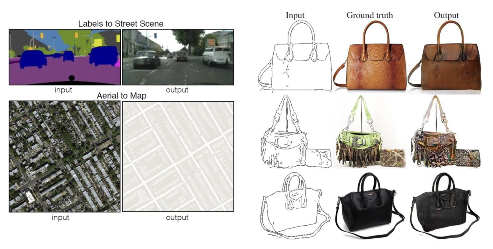
        

        

            
        

    === "风格迁移"

        

            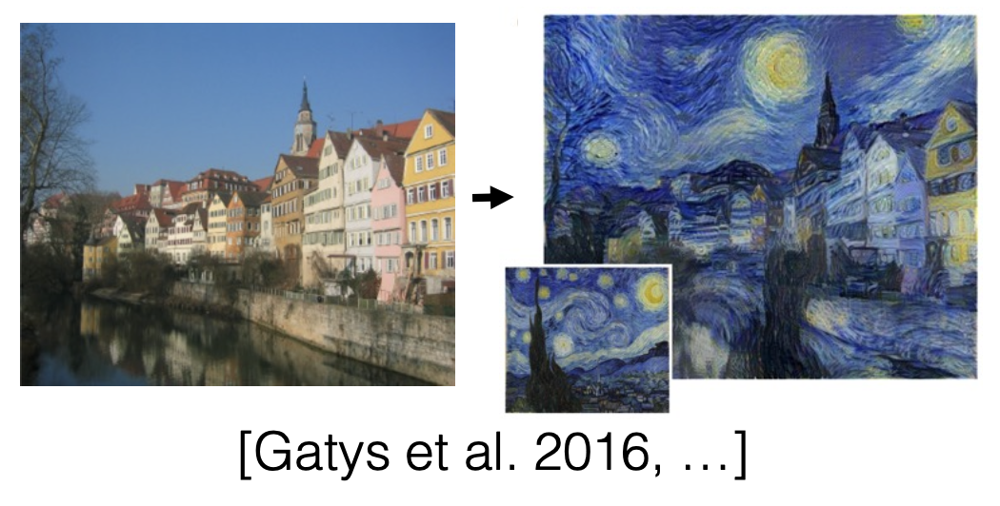
        

    === "文生图"

        

            
        

    === "图像去雾"

        

            
        

## Super Resolution

**超分辨率**(super resolution)：

    

利用 GAN 实现超分辨率：

    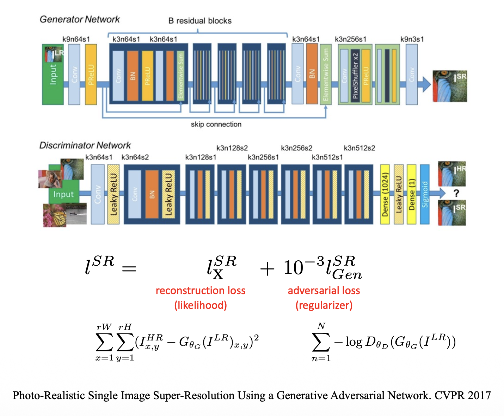

效果：

    

