# Image Processing

??? abstract "核心知识"

    - 基本图像处理操作：
        - 增加对比度、颜色反转
        - 模糊：盒滤波、**高斯滤波**、~~双边滤波~~
            - 数学原理：**卷积**
        - 锐化：垂直/水平边缘检测
    
    - 图像缩放
        - 保持宽高比
            - 缩小（降采样）：**反走样**（先模糊再采样）
            - 放大（升采样）：**插值**
        - 改变宽高比
            - 缩小：接缝裁剪
            - 放大：接缝插入

    - 明确不考的：双边滤波器

## Basics

常见的一些图像处理操作有：

- 增加**对比度**(contrast)

    

        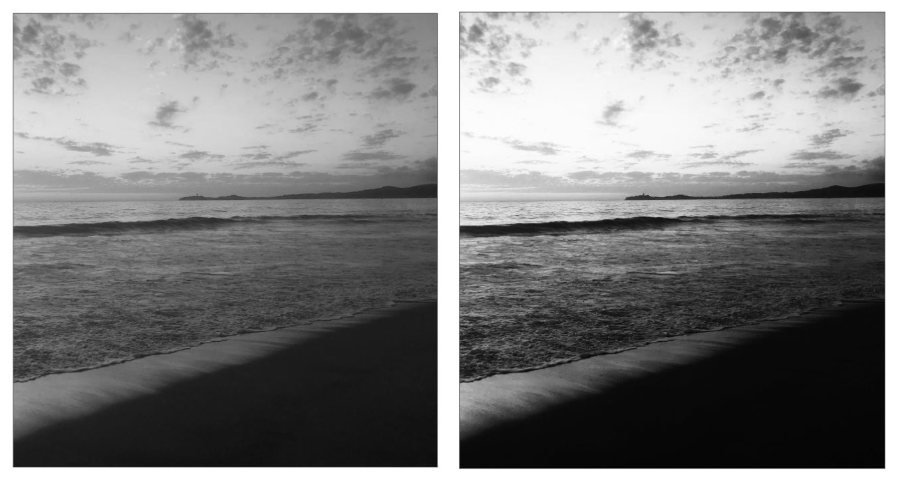
    

    - 通过 **S 曲线**，对每个像素做这样的转换：output(x, y) = f(input(x, y))

        

            
        

- 图像（颜色）**反转**(invert)

    

        
    

    - 对每个像素的处理位：out(x, y) = 1 - in(x, y)

- **模糊**(blur)

    

        
    

    - 利用**边缘检测**(edge detection)技术，我们可以实现更“聪明”的模糊（即不会模糊整张图，仍然保留物体边缘特征）

        

            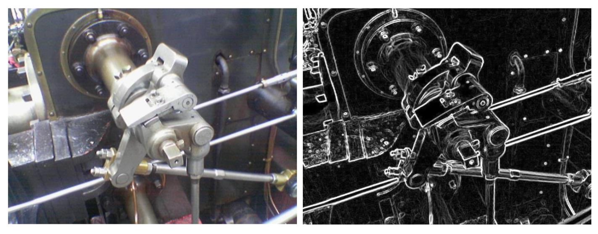
        

        ??? example "例子"

            

                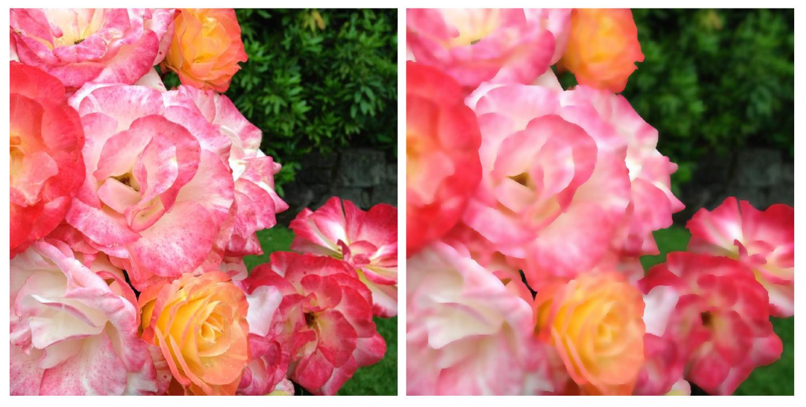
            

- **锐化**(sharpen)

    

        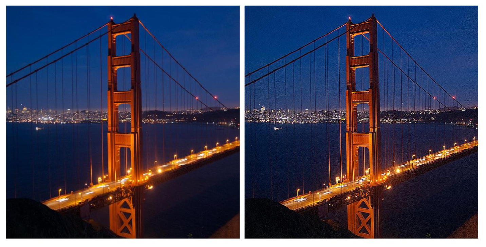
    

下面主要介绍模糊这一操作。在此之前，我们得先理解它的数学基础——**卷积**(convolution)。

### Convolution

卷积公式如下：

    

考虑最简单的情况——单位面积的盒状函数 $f(x)$——有助于我们理解卷积操作：

    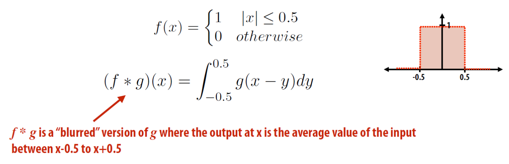

$g(x)$ 是输入图像，得到的输出图像上的每个像素是 $[x - 0.5, x + 0.5]$ 范围内像素的均值，从而起到模糊效果。

下面从一维角度看这个求均值的过程，可能更好理解些：

=== "第1个位置"

    

        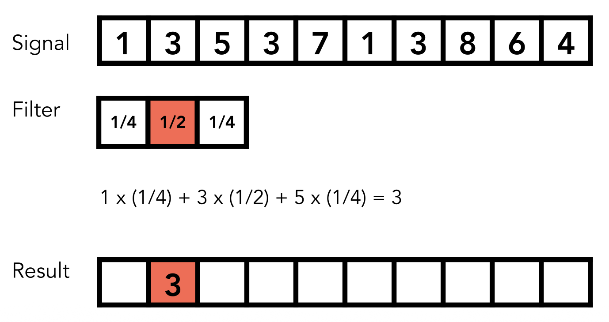
    

=== "第2个位置"

    

        
    

前面给出的卷积公式是连续的。不过对于图像处理，我们只要考虑**离散**(discrete)的二维卷积公式就行了，所以公式中的积分可以用累加替换，即：

    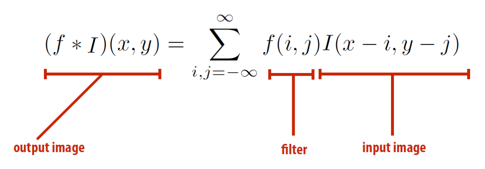

为方便操作，我们将**滤波器**(filter) $f(i, j)$ 限制在 $-1 \le i, j \le 1$ 的范围内，于是：
$$
(f*I)(x,y)=\sum_{i,j=-1}^1f(i,j)I(x-i,y-j)
$$

此时 $f(i, j)$ 可以用一个 $3 \times 3$ 的矩阵表示，每一个元素的值记作 $f(i, j) = \mathbf{F}_{i, j}$（通常称为**滤波权重**(filter weight) / **滤波核**(filter kernel)）。

下图更加形象地展示离散 2D 卷积的过程：

    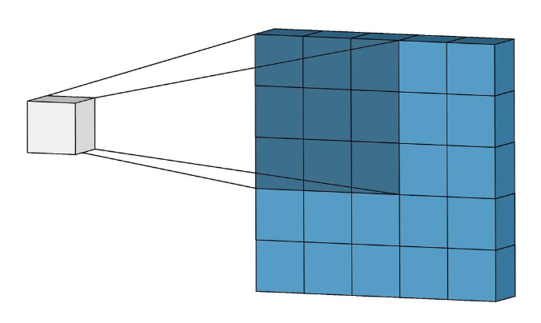

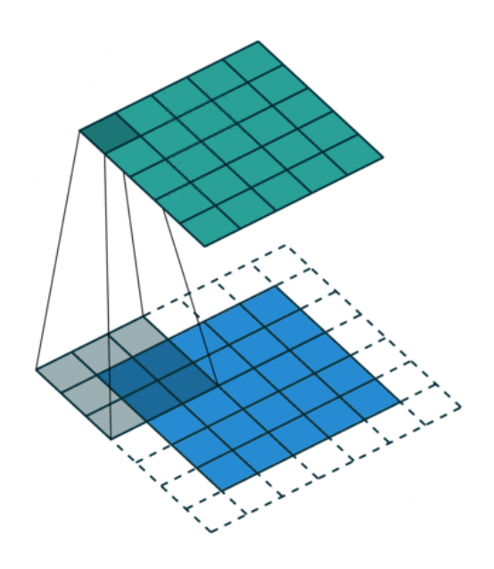{ align=right width=20% }

我们需要考虑滤波器扫描到图像边界上的特殊情况，因为此时滤波器的一部分不在图像内。一般有以下几种**填充**手段(padding)：

- 零值
- 边值
- 对称
- ...

### Blur

#### Box Blur

最简单的**盒模糊**(box blur)（（均值）滤波器大小：7x7）

    

#### Gaussian Blur

通过 **2D 高斯函数**获取滤波器的系数：

$$
f(i,j)=\frac{1}{2\pi\sigma^2}e^{-\frac{i^2+j^2}{2\sigma^2}}
$$

输出图像的每个像素就是滤波器范围内像素值的加权和，这些**邻近像素的贡献随距离增加而衰减**（想想正态曲线）。虽然理论上正态曲线会无限接近但不等于 0，但是实际操作时出于效率，超出一定距离外的像素就不给予考虑。

    

滤波器大小为 7x7 的**高斯模糊**效果如下，可以看到模糊后的图像不会真的糊成一团，图像的原特征还是得到一定保留的（比如砖头间的缝隙等）。

    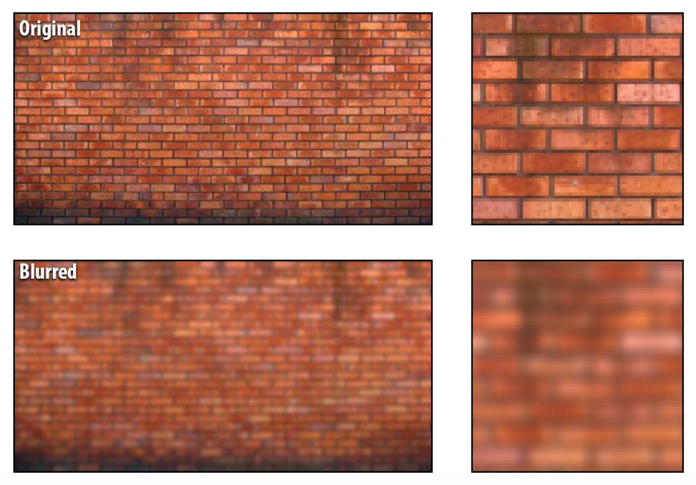

### Sharpening

（3x3）**锐化**的滤波器大致长这样：

$$
\begin{bmatrix}
0 & -1 & 0 \\
-1 & 5 & -1 \\
0 & -1 & 0
\end{bmatrix}
$$

效果：

    

锐化操作的本质是向图像**增加高频信号**。

- 令 I 为原图像
- 图像中的高频信号：I' = I - Blur(I)
- 锐化后的图像：I = I + I'

???+ example "例子"

    === "I"

        

            
        

    === "Blur(I)"

        

            
        

    === "I - Blur(I)"

        

            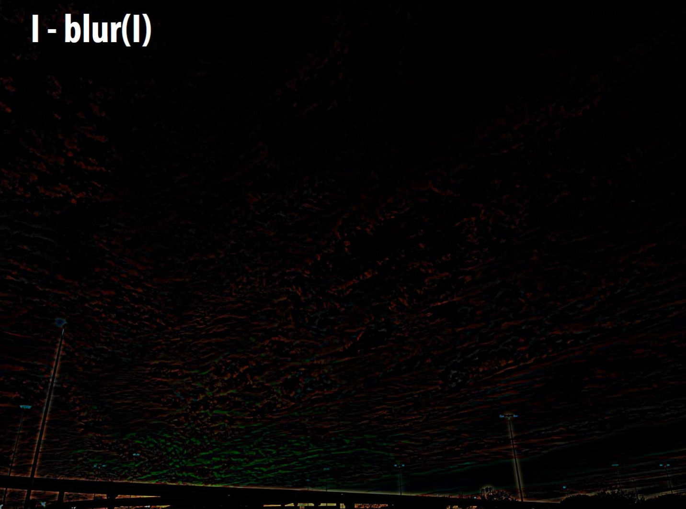
        

    === "I + (I - Blur(I))"

        

            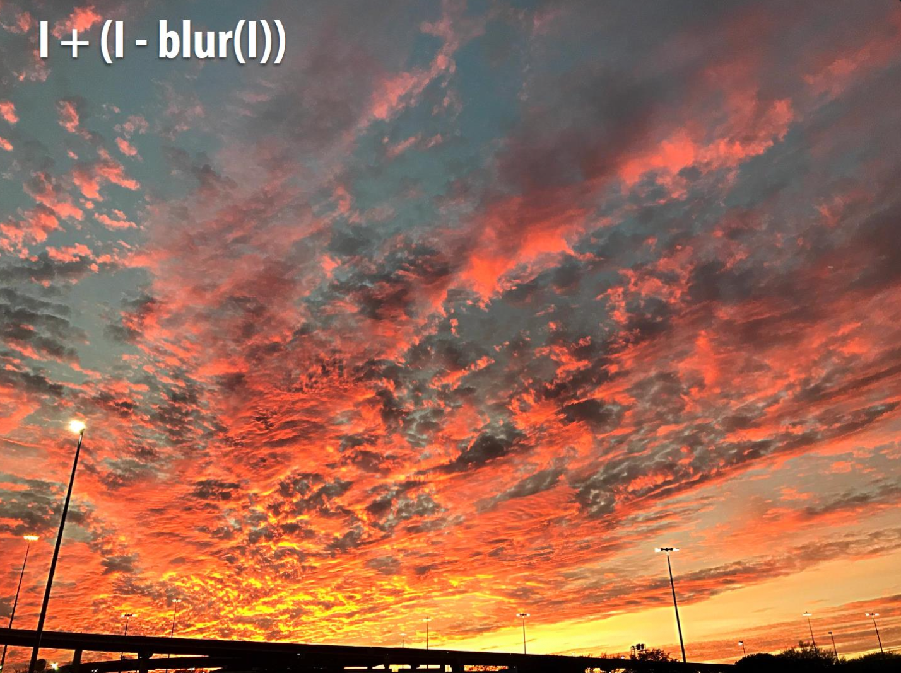
        

### Edge Detection

以下两个矩阵分别对应检测**垂直**和**水平**边（但分别对应**水平梯度**和**垂直梯度**）的滤波器：

$$
\begin{bmatrix}
-1 & 0 & 1 \\
-2 & 0 & 2 \\
-1 & 0 & 1
\end{bmatrix}
\quad
\begin{bmatrix}
-1 & -2 & -1 \\
0 & 0 & 0 \\
1 & 2 & 1
\end{bmatrix}
$$

这些滤波器统称为**梯度检测滤波器**(gradient detection filter)。以下是这些滤波器的使用效果：

=== "水平梯度"

    

        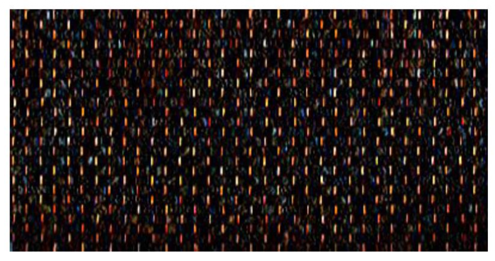
    

=== "垂直梯度"

    

        
    

!!! note "注"

    我们可以将滤波器视为一种模式的“**探测器**”(detector)，输出图像中的像素值 = 滤波器对输入图像中每个像素周围区域的“响应”（这也是 CV 中的常见解释）。

### Bilateral Filter

一种更强大但复杂的滤波（模糊）手段叫做**双边滤波**(bilateral filter)，它的作用是在去除图像噪声的同时保留图像原有的边缘特征。

???+ example "例子"

    

        
    

双边滤波的原理图：

    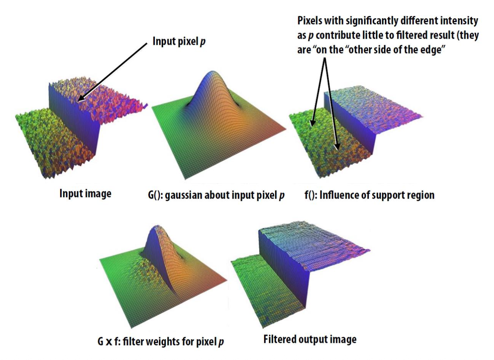

滤波核的内容取决于图像内容。

    

## Image Sampling

一种对图像的常用操作是**缩放**(resize)。

    

缩放操作涉及到对图像的**采样**(sampling)，比如缩小图像就是一个**降采样**(down-sampling)的过程：

    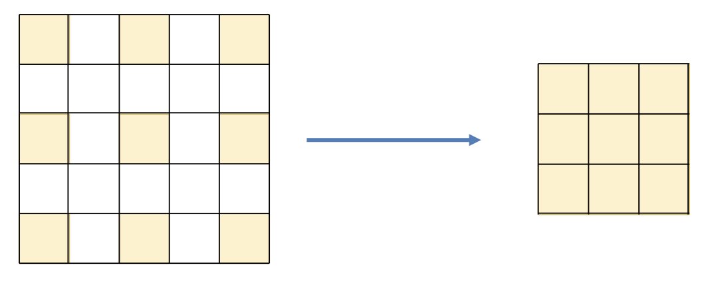

后续内容参见我的 CG 笔记中关于[反走样](../../software/cg/4.md#antialiasing)的介绍。

## Image Maginification

另一种对图像的缩放就是**图像放大**(image magnification)。

    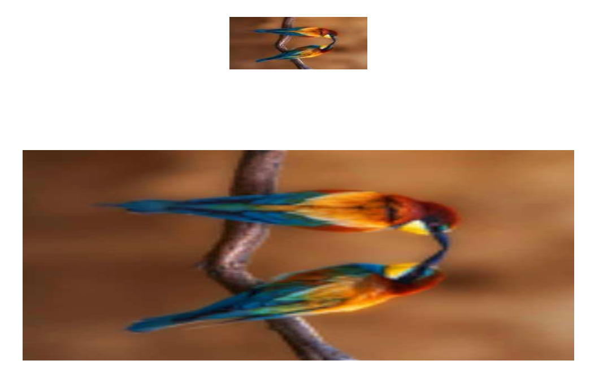

而图像放大的过程本质上是**升采样**(up-sampling)。

    

这显然会遇到一个问题：如何插入这些原本不存在的像素呢？解决方案就是**插值**(interpolation)。

### Interpolation

下面列举一些常用的插值方式：

- **最近邻插值**(nearest-neighbor interpolation)：不够连续和平滑

    

        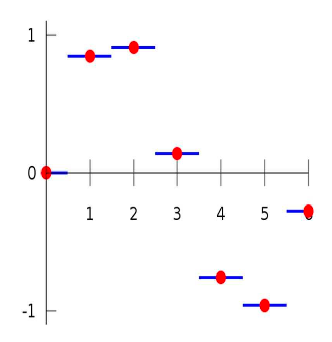
    

- **线性插值**(linear interpolation)：连续但不平滑

    

        
    

- **三次插值**(cubic interpolation)：连续且平滑

    

        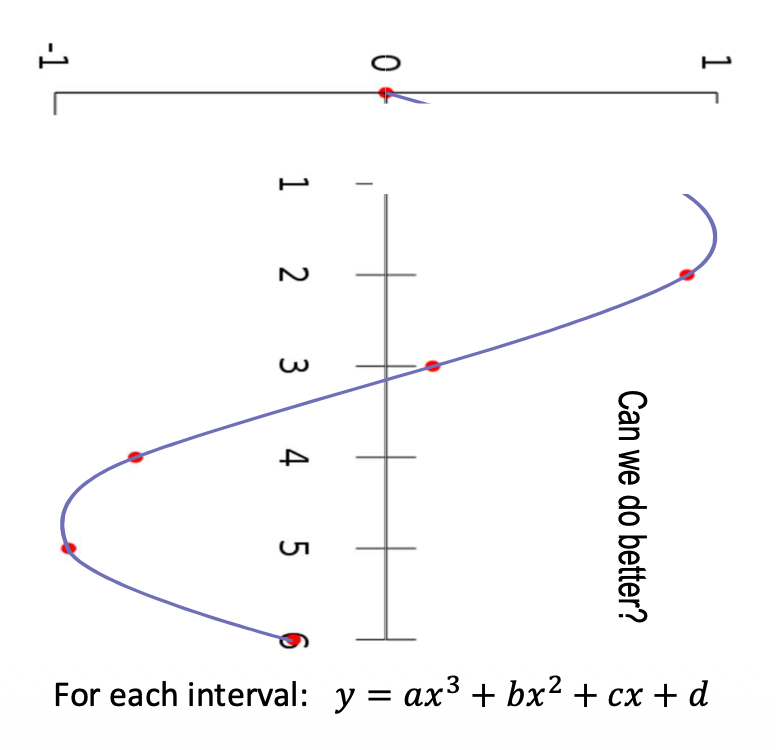
    

- [**双线性插值**](../../software/cg/5.md#bilinear-interpolation)(bilinear interpolation)（点击链接后阅读详细内容）

???+ example "例子：超分辨率(super-resolution)"

    

        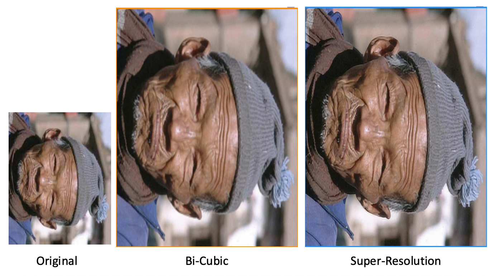
    

### Changing Aspect Ratio

有时我们会通过缩放图像（不是剪切(cropping)）来改变图像**宽高比**(aspect ratio)。但如果处理不当的话可能会导致图像内容的畸变。

    

这篇论文给出了解决方案：

    

下面就来阐述其中的思想。

- 问题陈述：我们需要移除图像每行的 n 个像素
- 基本思路：移除“不重要”的像素

    

那么如何衡量一个像素的重要性呢？

- 一种简单的思路是：构成边缘的像素就是重要像素
- 使用**边缘能量**(edge energy)作为衡量指标：$E(I) = \left|\dfrac{\partial I}{\partial x}\right| + \left|\dfrac{\partial I}{\partial y}\right|$
    - 对图像而言，可利用**卷积**来求导

    

**接缝裁剪**(seam carving)：自顶向下寻找一条使像素边缘能量最小化的连接路径。

    

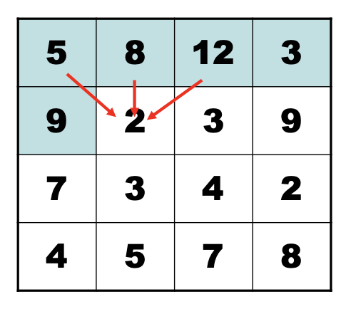{ align=right width=20% }

若 $\mathbf{M}(i, j) = $ 经过像素 $(i, j)$ 的接缝的最小边缘能量，那么
$$
\mathbf{M}(i,j){=}E(i,j)+\min(\mathbf{M}(i-1,j-1),\mathbf{M}(i-1,j),\mathbf{M}(i-1,j+1))
$$

该计算可通过**动态规划**完成。

 

???+ example "结果"

    === "例1"

        

            
        

    === "例2"

        

            
        

---
还可通过**接缝插入**(seam insertion)来**放大**图像：

    

思路：以同样的方法寻找若干条接缝，然后在上面进行插值。
