# Model Fitting and Optimization

??? abstract "核心知识"

    - 模型拟合 -> 最小化 MSE
    - 数值方法
        - 最陡下降法
        - 牛顿法
        - 高斯-牛顿法
    - 鲁棒估计
        - RANSAC
        - 过拟合和欠拟合
        - L1 / L2 正则化
    - 明确不考的：
        - 最小二乘法的统计解释（最大似然估计）
        - 约束优化

## Optimization

??? example "一些优化问题相关的例子"

    === "例1"

        $$
        \begin{aligned}
        \text{minimize} \quad & f_0(x) \\
        \text{subject to} \quad & f_i(x) \le 0, i = 1, \dots, m \\
        & g_i(x) = 0, i = 1, \dots, p
        \end{aligned}
        $$

        - $x \in \mathbb{R}^n$ 是被选中的（向量）变量
        - $f_0$ 是要被最小化的目标函数
        - $f_1, \dots, f_m$ 是不等式约束函数
        - $g_1, \dots, g_p$ 是等式约束函数

    === "例2"

        <div style="text-align: center">
            
        </div>

    === "例3"

        图像去模糊

        <div style="text-align: center">
            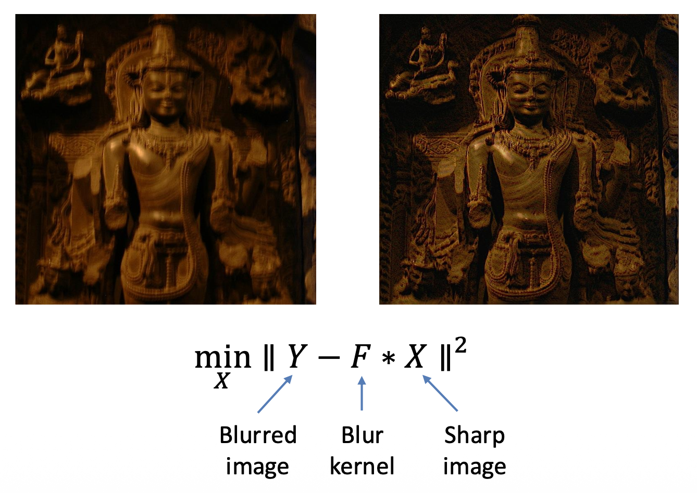
        </div>


### Model Fitting

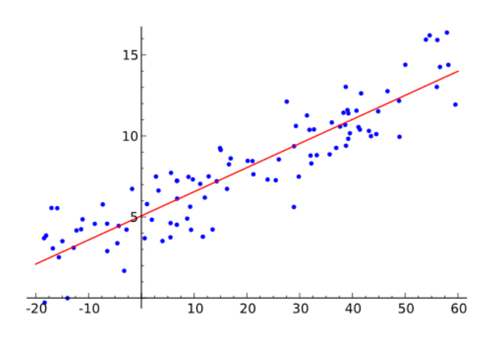{ align=right width=30% }

数学模型 $b = f_x(a)$ 描述了输入 $a$ 和输出 $b$ 之间的关系，其中 $x$ 为模型参数。

例子：线性模型 $b = a^T x$（如右图所示）

那么如何根据数据估计模型参数（这一过程通常称之为**学习**(learning)）呢？一种典型的方法是最小化**均方差**(mean square error, **MSE**)，即：

$$
\hat{x} = \arg \min\limits_x \sum_i (b_i - a_i^T x)^2
$$


### Maximum Likelihood Estimation

假设数据带有高斯噪音，即：
$$
b_i = a_i^T x + n, n \sim G(0, \sigma)
$$

对于给定 $x$，观察到 $(a_i, b_i)$ 的可能性为：
$$
P[(a_i, b_i)|x] = P[b_i - a_i^T x] \propto \exp \left(-\dfrac{(b_i - a_i^T x)^2}{2 \sigma^2}\right)
$$

如果这些数据点都是独立的，那么：

$$
\begin{aligned}
& P[(a_1, b_1)(a_2, b_2)\dots|x] \\
= & \prod_i P[(a_i, b_i)|x] \\
= & \prod_i P[b_i - a_i^T x] \\
\propto & \exp \left(-\dfrac{\sum_i(b_i - a_i^T x)^2}{2 \sigma^2}\right) = \exp \left(-\dfrac{\|Ax - b\|_2^2}{2 \sigma^2}\right)
\end{aligned}
$$

**最大似然估计**(maximum likelihood estimation, **MLE**) = 最大化找到最佳 $x$ 的可能性，即：

$$
\begin{aligned}
\hat{x} & = \arg \max\limits_x P[(a_1, b_1)(a_2, b_2)\dots | x] \\
& = \arg \max\limits_x \exp \left(-\dfrac{\|Ax - b\|_2^2}{2 \sigma^2}\right) \\
& = \arg \min\limits_x \|Ax - b\|_2^2
\end{aligned}
$$

所以 MSE 就是带有**高斯噪音**假设的 MLE。


## Numerical Methods

一些问题是有**解析解**(analytical solution)的，比如对于**线性 MSE**（$\hat{x} = \arg \min\limits_x \|Ax - b\|_2^2$），$\hat{x}$ 的解可通过以下方程得出（最小值 -> 导数 = 0；矩阵求导较复杂，具体推导过程可上网查阅）：
$$
A^T Ax = A^T b
$$

但有些问题没有解析解，比如寻找满足以下条件的路径：$F(x_0) > F(x_1) > \dots > F(x_k) > \dots$。

<div style="text-align: center">
    
</div>

对于这类问题，我们一般采用以下数值方法求解：

```py
x <- x_0                            # initialization
while not converge
    h <- descending_direction(x)    # determine the direction
    alpha <- descending_step(x, h)  # determine the step
    x <- x + alpha * h              # update the parameters
```

现在的问题就变成了如何寻找最佳的 $\bm{h}, \alpha$（即确定每一步下降的方向和步长）了。下面将介绍一些常见的算法，它们的大致流程基本遵循上述伪代码，区别就在于 $\bm{h}$ 和 $\alpha$ 的计算。

??? note "背景知识：泰勒展开"

    - 一阶近似

        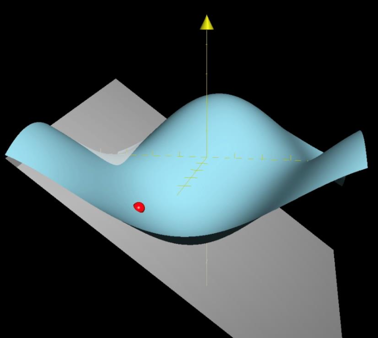{ align=right width=30% }

        $$
        F(x_k + \Delta x) \approx F(x_k) + J_F \Delta x
        $$

        其中 $\mathbf{J} = \begin{bmatrix}\dfrac{\partial \mathbf{f}}{\partial x_1} \dots \dfrac{\partial \mathbf{f}}{\partial x_n}\end{bmatrix}$ 为**雅可比矩阵**(Jacobian matrix)（一阶导数）

    - 二阶近似

        { align=right width=30% }

        $$
        \begin{aligned}F(x_k+\Delta x)\approx F(x_k)+J_F\Delta x+\frac{1}{2}\Delta x^TH_F\Delta x\end{aligned}
        $$

        其中 $\mathbf{H}=\begin{bmatrix}\frac{\partial^2f}{\partial x_1^2}&\frac{\partial^2f}{\partial x_1\partial x_2}&\cdots&\frac{\partial^2f}{\partial x_1\partial x_n}\\\\\frac{\partial^2f}{\partial x_2\partial x_1}&\frac{\partial^2f}{\partial x_2^2}&\cdots&\frac{\partial^2f}{\partial x_2\partial x_n}\\\\\vdots&\vdots&\ddots&\vdots\\\\\frac{\partial^2f}{\partial x_n\partial x_1}&\frac{\partial^2f}{\partial x_n\partial x_2}&\cdots&\frac{\partial^2f}{\partial x_n^2}\end{bmatrix}$ 为**黑塞矩阵**(Hessian matrix)（或称为海森矩阵）（二阶导数）

### Steepest Descend Method

第一种方法是**梯度下降**(gradient descent)，它就是通过泰勒展开的一阶近似来确定方向的。

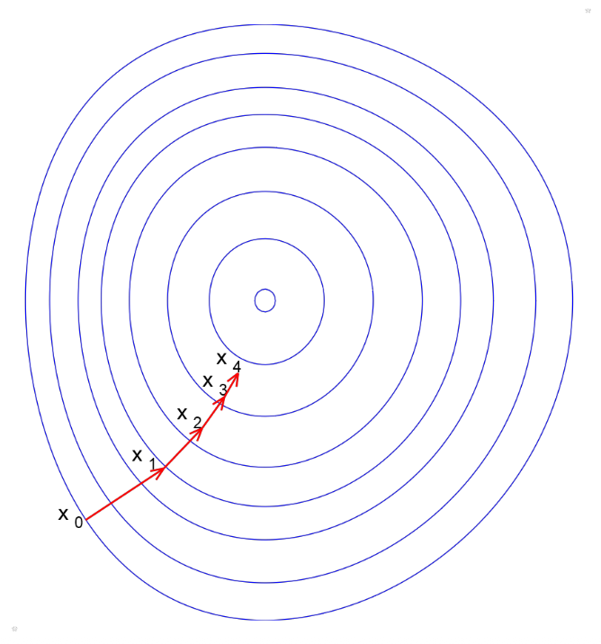{ align=right width=30% }

- 在 $x_0$ 处的泰勒展开

    $$
    F(x_{0}+\Delta x)\approx F(x_{0})+J_{F}\Delta x
    $$

- 当 $J_F \Delta x < 0$ 时，目标函数就会下降
    - 当 $\Delta x$ 的方向和 $-J_F^T$ 一样时，目标函数下降幅度最大（即**最陡**(steepest)）

**步长**(step size)的影响：

<div style="text-align: center">
    
</div>


{ align=right width=30% }

确定步长（其中 $\varphi(\alpha) = F(\bm{x}_0 + \alpha \bm{h})$，由于 $\bm{h}$ 固定下来了，所以这个函数只是一个关于 $\alpha$ 的一元函数，如右图所示）：

- $\alpha$ 太小，$\varphi(\alpha)$ 的改变也很小 -> 增大 $\alpha$
- $\alpha$ 太大，$\varphi(\alpha) > \varphi(0)$ -> 减小 $\alpha$
- $\alpha$ 和 $\varphi(\alpha)$ 接近 -> 可接受的

<br/>

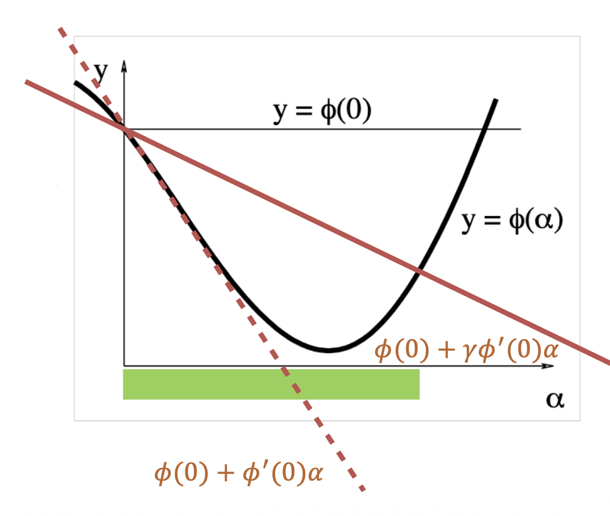{ align=right width=30% }

可能的下降策略：

- 精确的直线搜索
- **回溯算法**(backtracking algorithm)
    - 使用一个很大的 $\alpha$ 值初始化
    - 减小 $\alpha$，直到 $\phi(\alpha)\leq\phi(0)+\gamma\phi^{\prime}(0)\alpha$
        - 其中参数 $0 < \gamma < 1$

<br/>

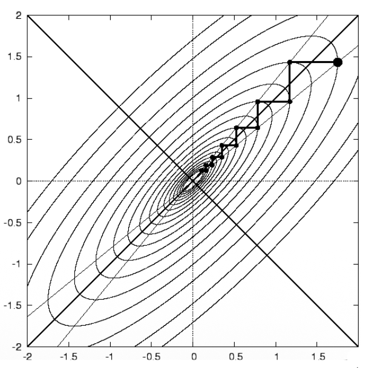{ align=right width=30% }

**最陡下降法**(steepest descent method)的优缺点分析：

- 优点
    - **易于实现**
    - 在离最小值较远时表现不错
- 缺点
    - 接近最小值时**收敛很慢**
        - 原因：只使用一阶导数，没用到曲率
    - 浪费大量计算

---
- 梯度下降法只能找到**局部最小值**(local minimum)
- 但对一些函数而言，局部最小就是全局最小

<div style="text-align: center">
    
</div>


### Newton Method

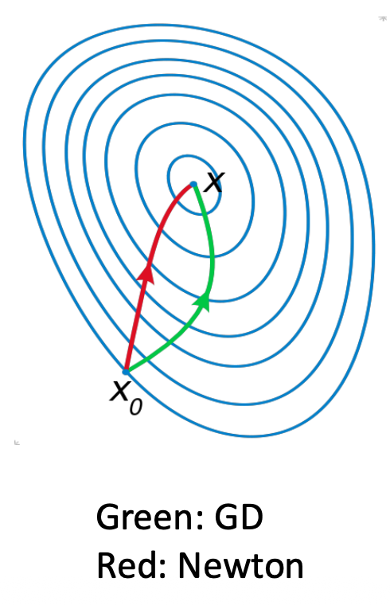{ align=right width=20% }

第二种方法是**牛顿法**(Newton method)：

- 采用二阶泰勒展开

    $$
    F(x_k + \Delta x) \approx F(x_k) + J_F \Delta x + \dfrac{1}{2} \Delta x^T H_F \Delta x
    $$

- 找到最小化 $F(x_k + \Delta x)$ 的 $\Delta x$，满足：

    $$
    H_F \Delta x + J_F^T = 0
    $$

    这个方程是通过对前一个方程关于 $\Delta x$ 求导得到（最小值 -> 导数 = 0）。

- 最优方向（牛顿步）为 $\Delta x = -H_F^{-1} J_F^T$
- 优点：在最小值附近**快速收敛**
- 缺点：在黑塞矩阵上要**花费大量计算**
- 改进思路：**近似**计算黑塞矩阵？


### Gauss-Newton Method

牛顿法的改进方法叫做**高斯-牛顿法**(Gauss-Newton method)。

- 对求解**非线性最小二乘**很有用
    - 非线性最小二乘

        $$
        \begin{aligned}
        \hat{x} & = \arg \min\limits_x F(x) \\
        & = \arg \min\limits_x \| R(x) \|_2^2
        \end{aligned}
        $$

        其中 $R(x) = \begin{bmatrix}b_1 - f_x(a_1) \\ b_2 - f_x(a_2) \\ \dots \\ b_n - f_x(a_n)\end{bmatrix}$ 是**残差向量**(residual vector)

        - 我们不展开 $F(x)$，而去展开 $R(x)$

            $$
            \begin{aligned}
            \|R(x_k + \Delta x)\|_2^2 & \approx \|R(x_k) + J_R \Delta x\|_2^2 \\
            & = \|R(x_k)\|_2^2 + 2R(x_k)^T J_R \Delta x + \Delta x^T J_R^T J_R \Delta x
            \end{aligned}
            $$

            其中 $J_R$ 是 $R(x)$ 的雅可比矩阵

        - 优化 $\Delta x$，满足（依旧对前一个方程求导 = 0 得到）

            $$
            J_R^T J_R \Delta x + J_R^T R(x_k) = 0
            $$

- 因此优化方向 $\Delta x = -(J_R^T J_R)^{-1} J_R^T R(x_k)$
- 和牛顿法相比
    - 牛顿步：$\Delta x = -H_F^{-1} J_F^T$
    - 可以看到，高斯-牛顿法使用 $J_R^T J_R$ 近似表示 $H_F$

- 优点：
    - **计算量小**（无需计算黑塞矩阵）
    - **收敛快**
- 缺点：如果 $J_R^T J_R$ 是奇异的，那算法就会**不稳定**


### Levenberg-Marquardt

**Levenberg-Marquardt 法**（以下简称 **LM**）在高斯-牛顿法的基础上引入**正则化**(regularization)，因此
$$
\Delta x = -(J_R^T J_R \textcolor{red}{+ \lambda I})^{-1} J_R^T R(x_k)
$$

其中 $\forall \lambda > 0$，$J_R^T J_R + \lambda I$ 必须是**正定矩阵**(positive-definite matrix)。

$\lambda$ 的影响：

- $\lambda \rightarrow \infty$：梯度下降法，且步长很小
- $\lambda \rightarrow 0$：高斯-牛顿法

优点：

- 启动快（$\lambda \uparrow$）
- 收敛快（$\lambda \downarrow$）
- 不会退化（$J_R^T J_R + \lambda I$ 必定是正定的）
- LM 法 = 梯度下降法 + 高斯-牛顿法


### Constrained Optimization

**约束优化**(constrained optimization)：目标(objective) + 约束(constraints)

不同的方法有不同的约束类型：

<div style="text-align: center">
    
</div>

???+ info "凸优化(convex optimization)"

    <div style="text-align: center">
        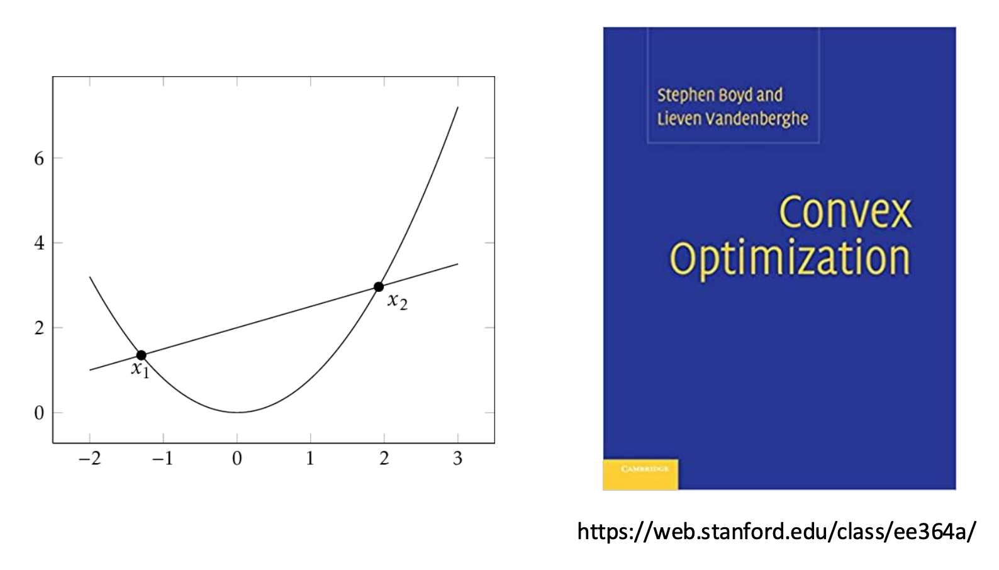
    </div>


## Robust Estimation

- **内点**(inlier)：遵循模型假设的数据点
- **异常点**(outlier)：和假设有显著差异的数据点

<div style="text-align: center">
    
</div>

对于以下情况，MSE 失效了：

<div style="text-align: center">
    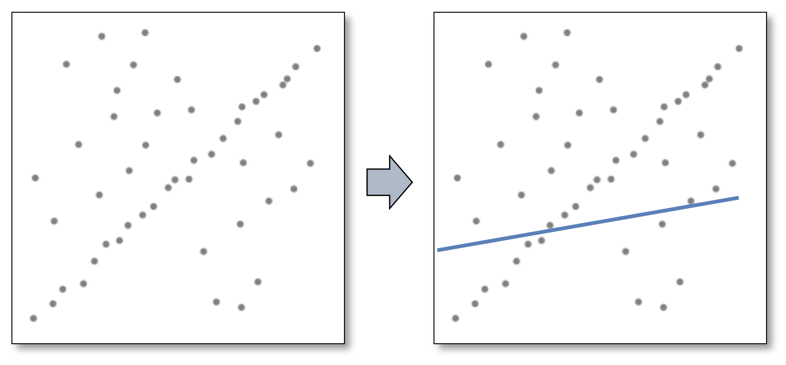
</div>

原因：

- MSE 与残差平方成正比
- 受大量异常点影响

<div style="text-align: center">
    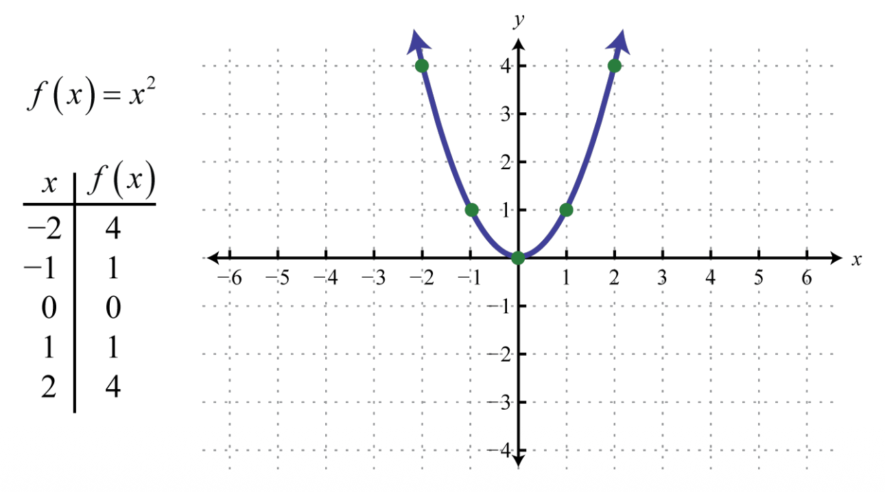
</div>


### RANSAC

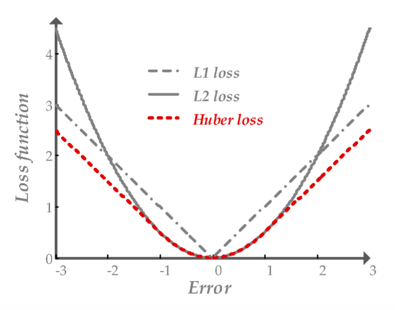{ align=right width=30% }

为减小异常点对估计带来的影响，我们需要用别的损失函数来替代 MSE，比如 L1，Huber 等。像这些函数被称为**鲁棒函数**(robust function)。

其中，最强大的处理异常点的方法是 **RANSAC**（**随机抽样一致**(random sample concensus)），其关键思想为：

- 内点的分布是相似的，而**外点之间的差距很大**
- 使用数据点对进行**投票**

???+ example "例子"

    <div style="text-align: center">
        
    </div>


### Overfitting and Underfitting

<div style="text-align: center">
    
</div>

- **过拟合**：模型太复杂，把数据里的噪声和随机波动也记下来了（比如右下图）
- **欠拟合**：模型太简单，无法捕捉数据的基本特征（比如左上图）

过拟合会导致**不适定问题**(ill-posed problem)，即解的数量不为 1 个（0 个或大于 1 个）或者解不稳定（数据的微小变化会引起解的剧烈变化）的现象。

- 比如对于 $\min_x \|Ax - b\|^2$ 方程数少于变量数的时候
- 可通过利用先验知识增加更多约束来获得唯一解

解决不适定问题的方法是引入**正则化**(regularization)。下面介绍了常用的两类正则化方法。


### L2 Regularization

{ align=right width=25% }

- **L2 范数**(norm)：$\|x\|_2 = \sqrt{\sum_i x_i^2}$
- **L2 正则化**：

    $$
    \begin{aligned}
    & \min_x \|Ax - b\|_2^2 \\
    & \text{s.t. } \|x\|_2 \le 1
    \end{aligned}
    $$

    - 令 $x \rightarrow 0$
    - 抑制冗余变量


### L1 Regularization

{ align=right width=25% }

- **L1 范数**(norm)：$\|x\|_1 = \sum_i x_i$
- **L2 正则化**：

    $$
    \begin{aligned}
    & \min_x \|Ax - b\|_2^2 \\
    & \text{s.t. } \|x\|_1 \le 1
    \end{aligned}
    $$

    - 令 $x$ 稀疏