# Image Matching and Motion Estimation

??? abstract "核心知识"

    - 图像匹配
        - 检测：
            - 检测角点的基本方法
            - 哈里斯角检测器：不变性、自动尺度选择
            - 斑点检测：拉普拉斯滤波器、LoG、DoG
        - 描述：SIFT（不变性）
        - 匹配：度量、检测歧义（比例测试、相互最近邻）

    - 运动估计：
        - 基本概念
        - LK 方法：
            - 三个假设：亮度持续性、空间一致性、运动量不大

    - 明确不考的：基于深度学习的特征匹配，Lucas-Kanade 方法的推导

## Image Matching

**特征匹配**(feature matching)：寻找两图像之间点到点的对应关系。

    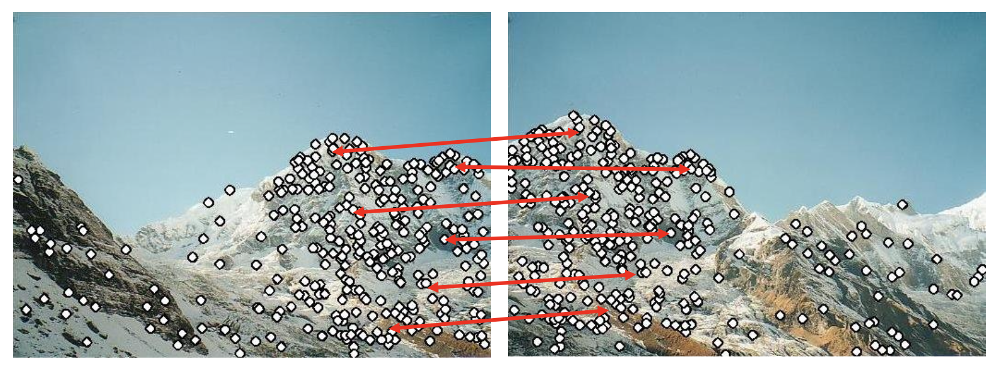

??? example "应用"

    - 图像对齐(image alignement)/拼接(stitching)

        

            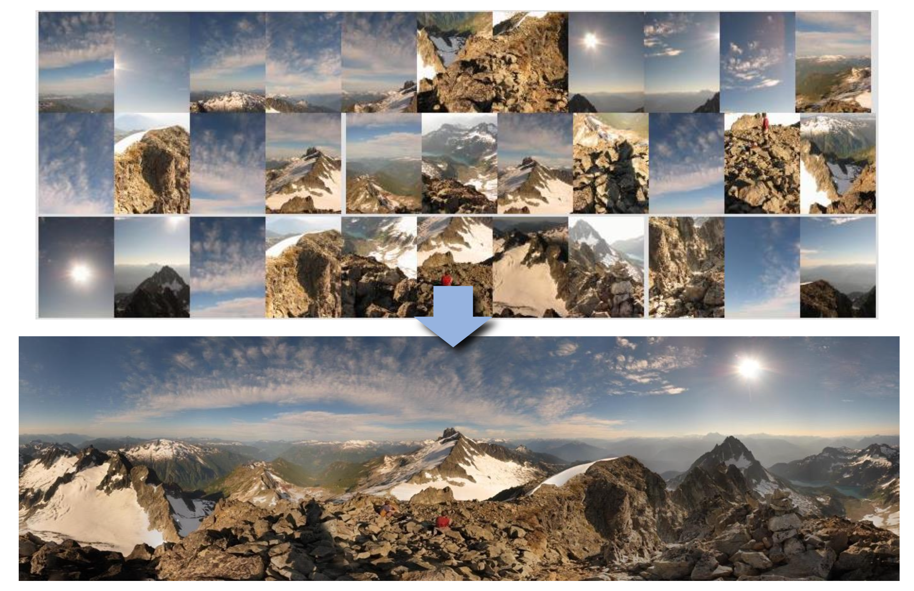
        

    - 3D 重构

        

            
        

    - 运动追踪(motion tracking)
    - 物体识别

        

            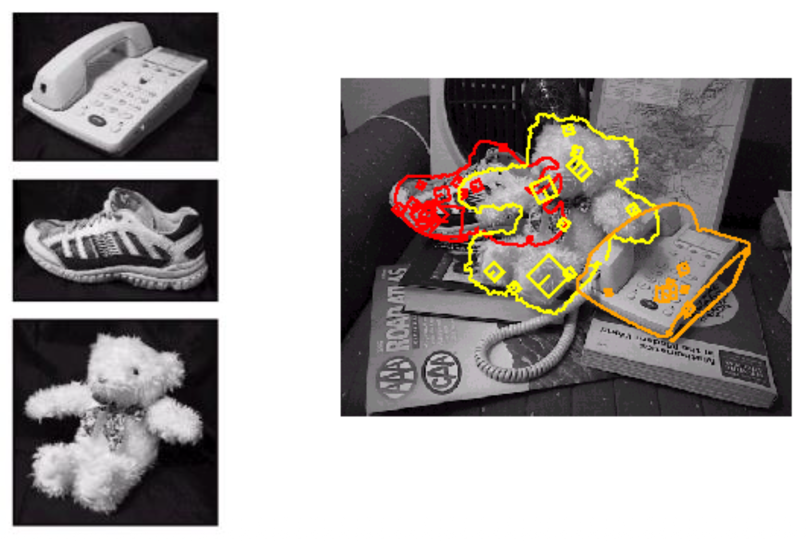
        

    - 索引和数据库检索
    - 机器人导航
    - ...

特征匹配的步骤：

1. **检测**(detection)：识别图像上的**兴趣点**(interest point)/特征点
2. **描述**(description)：围绕每个兴趣点，提取向量特征描述符(descriptor)
3. **匹配**(matching)：确定两个视图下描述符间的对应关系

    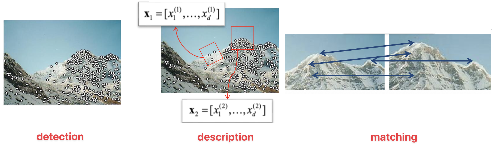

### Detection

我们对图像上独一无二的部分更感兴趣，这些部分将和其他图像形成无歧义的匹配。那么这个“**唯一性**(uniqueness)”该如何定义呢？一种对唯一性的局部测量方法是在图像上选取一个窗口区域，以任意方向移动这个窗口，找到窗口内像素变化较大的地方。

    

- **平滑**(flat)区域：沿任意方向都不会改变
- **边**(edge)：沿着边的方向不会改变
- **角**(corner)：沿任意方向都会有显著变化

我们可以根据区域附近像素的梯度分布来大致判断出当前区域属于上述三种情况中的哪一种：

    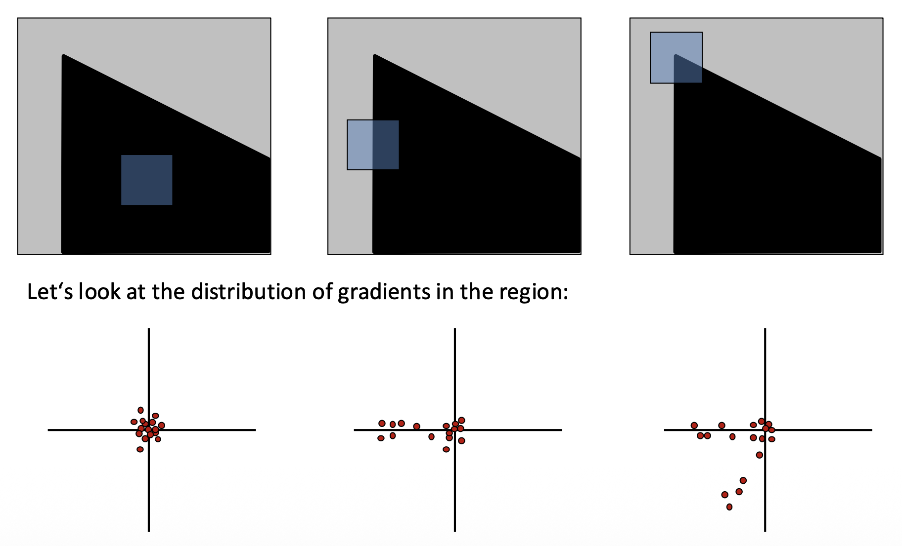

基于梯度分布，我们可利用**主成分分析**(principal component analysis)进行更准确的定量判断：

- 第一主成分是**方差最大**（数据分布最分散）的方向
- 第二主成分是与前一个成分**正交**，且具有方差最大的方向（捕获剩余信息中最分散的方向）

    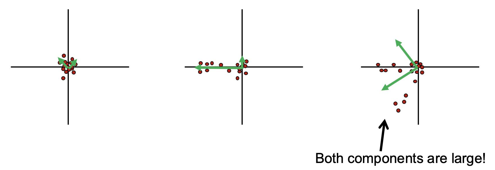

- 平滑区域：两个主成分都很小
- 边：第一主成分大，第二主成分小
- 角：两个主成分都很大

角检测的步骤：

1. 计算每个点的协方差矩阵

    $$
    H=\sum_{(u,v)}w(u,v)\begin{bmatrix}I_x^2&I_xI_y\\I_xI_y&I_y^2\end{bmatrix}\quad I_x=\frac{\partial f}{\partial x},I_y=\frac{\partial f}{\partial y}
    $$

    - 其中 $w(x, y)$ 一般为**高斯权重**(Gaussian weights)
    - 导数 $I_x, I_y$ 可通过水平梯度和垂直梯度上的**卷积**得到（具体见第 3 讲的“[边缘检测](3.md#edge-detection)”一节）

2. 计算特征值（二维矩阵有两个特征值，对应数据在主成分方向（特征向量）上的方差大小）

    $$
    H=\begin{bmatrix}a & b\\c & d\end{bmatrix}\quad\lambda_{\pm}=\frac{1}{2}\left((a+d)\pm\sqrt{4bc+(a-d)^2}\right)
    $$

3. 使用 $H$ 的特征值对点分类

    

        
    

#### Harris Detector

尽管算出 $\lamnda_1, \lambda_2$ 并不难，但要想用这两个值判断是否存在角，需要设置各种约束条件，这个过程就有些麻烦。一种更简洁的做法是使用**哈里斯角检测器**(Harris corner detector)计算以下响应函数：
$$
f=\frac{\lambda_1\lambda_2}{\lambda_1+\lambda_2}=\frac{determinant(H)}{trace(H)}
$$

$f$ 被称为**角响应值**(corner response)。

计算过程如下：

1. 计算每个像素的导数
2. 计算每个像素周围高斯窗口内的协方差矩阵 $H$
3. 计算角响应函数 $f$
4. 为 $f$ 设置阈值
5. 寻找响应函数的局部极大值（**非最大值抑制**(nonmaximum suppression)）
    - 因为角的邻近区域计算出来的 $f$ 值都很大，但我们只需要其中 $f$ 值最大的那一个像素点作为角点

???+ example "例子"

    === "原图"

        

            
        

    === "计算角响应值 $f$"

        

            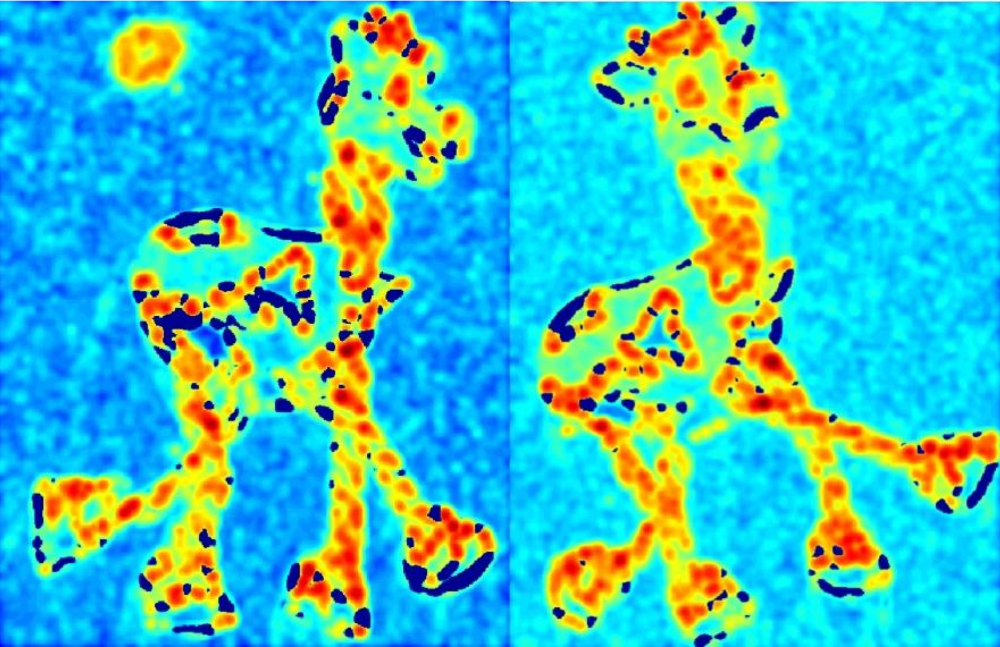
        

    === "只取 $f$ 的局部极大值点"

        

            
        

    === "结果"

        

            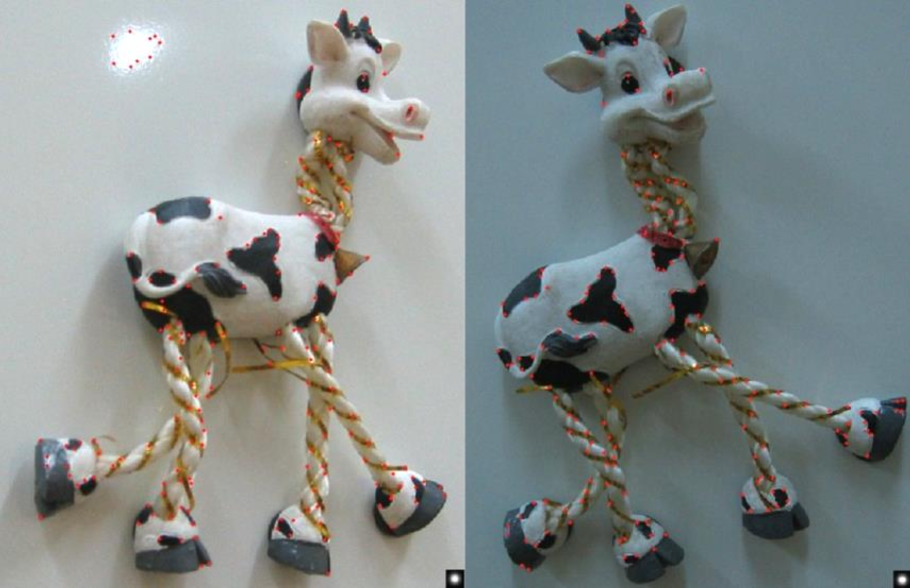
        

#### Invariance Properties

从上例可以看到，哈里斯角检测器确实能帮我们精确找到图中的特征点（角点）。但一个好的检测器还需要具备另一个性质：确保这些点是**可重复的**(repeatable)，也就是说要确保两张图像（图片内容对应的是同一物体或场景，但图片的颜色、物体的位置姿态等可能会不同）得到的检测点能在之后匹配得上。

现在我们从数学层面定义这种可重复性：两张图对应像素上的响应值在**图像变换**(image transformation)的过程中保持**不变**(invariant)。

图像变换包括：

- 光度(photometric)（可简单理解为图像的颜色）：
    - **光强**(intensity)改变

        

            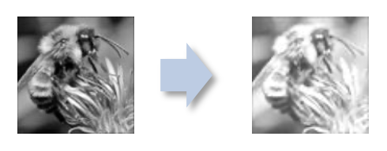
        

        假设原图像光强为 $I$，改变后的光强为 $aI + b$

        - 光强**移动**(shift)（$I \rightarrow I + b$）是**不变的**(invariant)
        - 光强**缩放**(scaling)（$I \rightarrow aI$）是**变化的**(not invariant)

        

            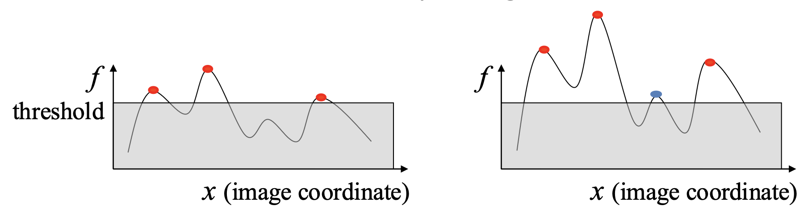
        

        - 综上，角响应值相对光强变化具有**部分的不变性**

- 几何：
    - **平移**(translation)：角响应值相对平移具有不变性

        

            
        

    - **旋转**(rotation)：角响应值相对旋转具有不变性

        

            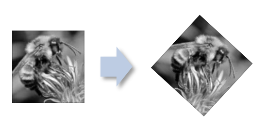
        

        下图用**椭圆**表示像素点的协方差矩阵，其方向和大小分别对应矩阵的特征向量和特征值。可以看到，将角旋转后，椭圆的朝向发生了变化，但其形状（即**特征值**）保持不变。

        

            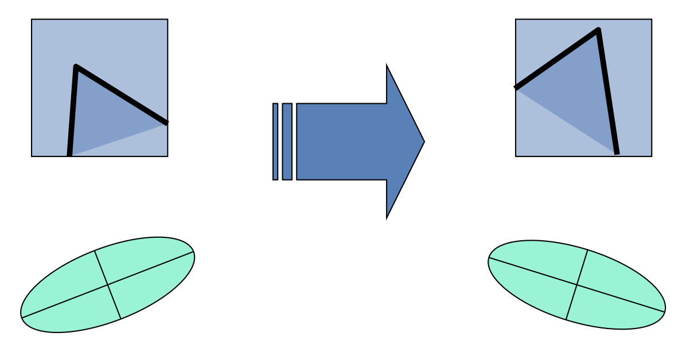
        

    - **缩放**(scaling)：角响应值相对缩放**不具有**不变性

        

            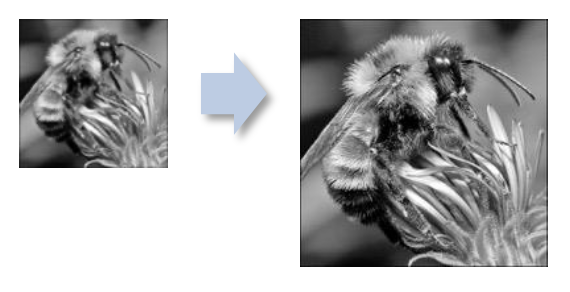
        

        这很好理解：比如图像放大，但窗口大小不变，那么窗口看到的东西就发生了变化，自然就无法保持不变性。

        

            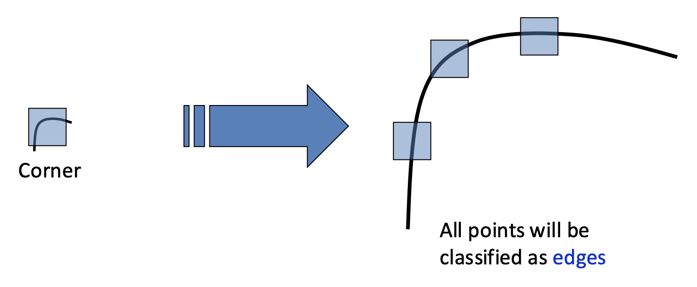
        

        如果窗口能跟随图像等比例缩放的话，结果应该和原来差不多。

#### Automatic Scale Selection

在图像上寻找角点时，我们希望确定一种合适的尺度（即窗口大小）呢，使对应的 $f$ 值最大。对于一幅图像的两种缩放，针对同一点的尺度尺度是不同的，但最佳尺度下的 $f$ 值应当是一样的。寻找最佳尺度的一种方案是**自动尺度选择**(automatic scale selection)，通过给定的 $f$ 的局部最大值找出尺度：

    

???+ play "步骤演示"

    === "Step 1"

        

            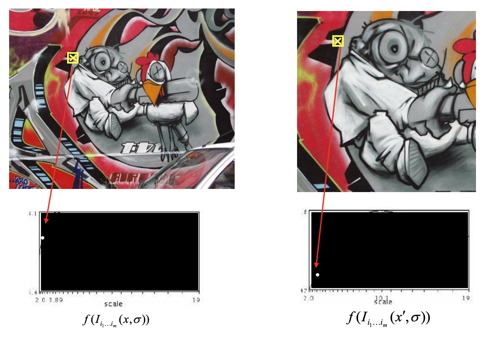
        

    === "Step 4"

        

            
        

    === "Step n"

        

            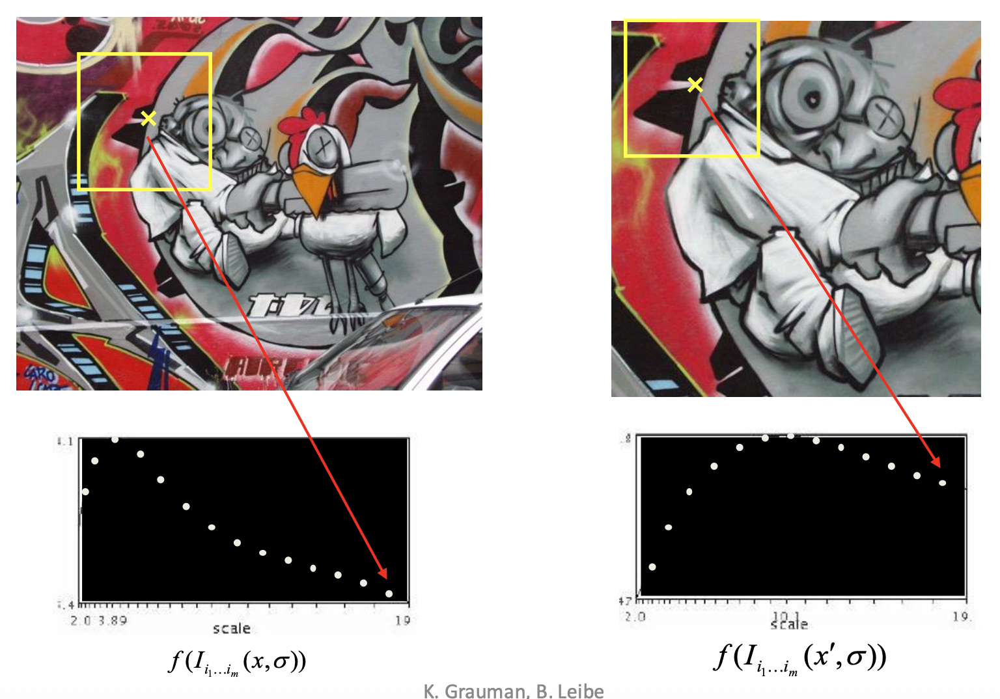
        

    === "绘制曲线"

        

            
        

但在实际实现时，我们并不是像上面那样用逐渐放大的窗口来确定，而是采用固定的窗口大小，并结合**图像金字塔**(image pyramid)（对图像进行缩放）的方法来计算 $f$。

    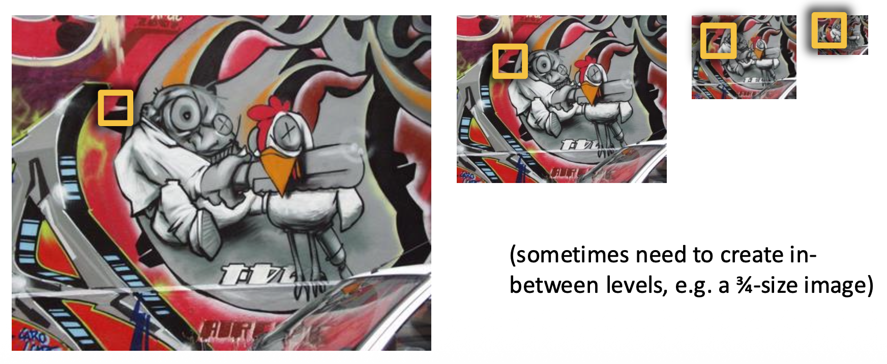

#### Blob Detector

**斑点**(blob)是一种不错的图像特征。它在图像光强上有着较大的二阶导数值。因此可通过计算图像的**拉普拉斯函数**，找到其中的最小值和最大值，从而找到斑点。

    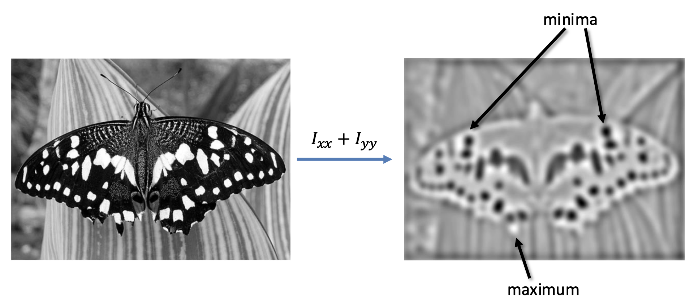

**拉普拉斯算子**(Laplacian operator)如下：

$$
\nabla^2=\frac{\partial^2}{\partial x^2}+\frac{\partial^2}{\partial y^2}
$$

还是利用**卷积**（滤波）计算图像导数：

$$
\begin{aligned}&\frac{\partial^{2}f}{\partial x^{2}}=&&f\left(x+1\right)+f\left(x-1\right)-2f\left(x\right)\quad\to\quad\begin{bmatrix}1&-2&1\end{bmatrix} \quad (\text{x kernel})
\\&\frac{\partial^{2}f}{\partial y^{2}}=&&f\left(y+1\right)+f\left(y-1\right)-2f\left(y\right)\quad\to\quad\begin{bmatrix}1\\-2\\1\end{bmatrix}  \quad (\text{y kernel})\end{aligned}
$$

最后将这两个二阶导数相加，得到**拉普拉斯滤波器**(Laplacian filter)：

$$
\begin{bmatrix}
0 & 0 & 0 \\
1 & -2 & 1 \\
0 & 0 & 0
\end{bmatrix}
+
\begin{bmatrix}
0 & 1 & 0 \\
0 & -2 & 0 \\
0 & 1 & 0
\end{bmatrix}
= \begin{bmatrix}
0 & 1 & 0 \\
1 & -4 & 1 \\
0 & 1 & 0
\end{bmatrix}
$$

---
由于拉普拉斯滤波器对噪音敏感，因此通常我们会将其和高斯滤波器结合起来一起用，构成了**拉普拉斯-高斯滤波器**(Laplacian of Gaussian, **LoG**)。

{ align=right width=30% }

- 先使用高斯滤波器平滑图像
- 然后再计算拉普拉斯值

利用结合律，可先算出高斯函数的二阶导来实现 LoG 的高效计算：

    

- LoG 的比例受高斯函数的 $\sigma$ 控制

???+ example "例子"

    

        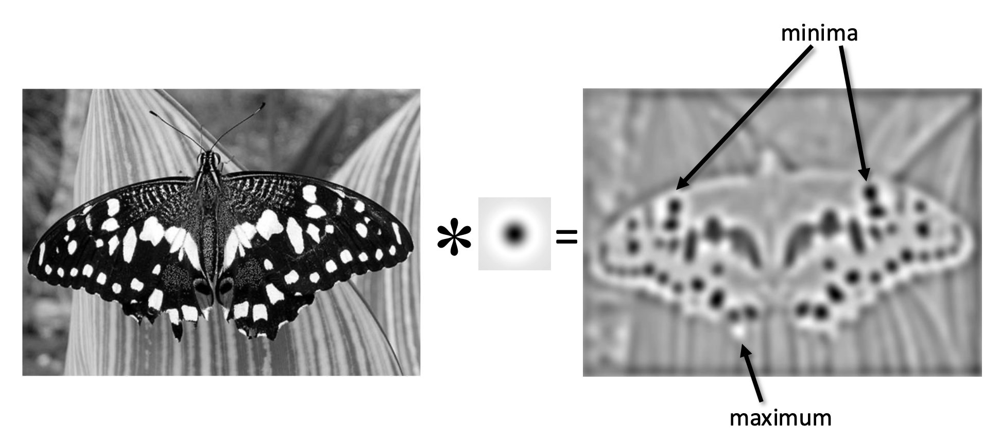
    

特征点同时是位置和比例的局部最大值（所以依旧可以利用图像金字塔寻找最大值）：

    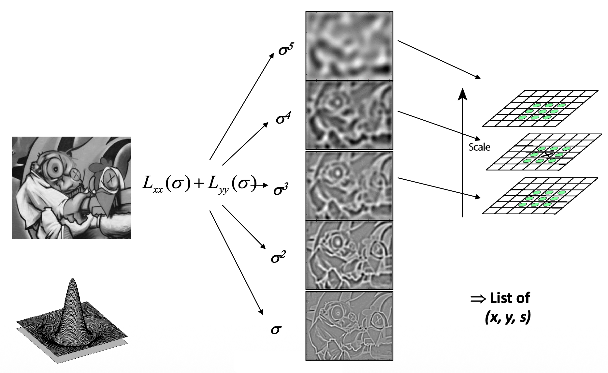

???+ example "例子"

    

        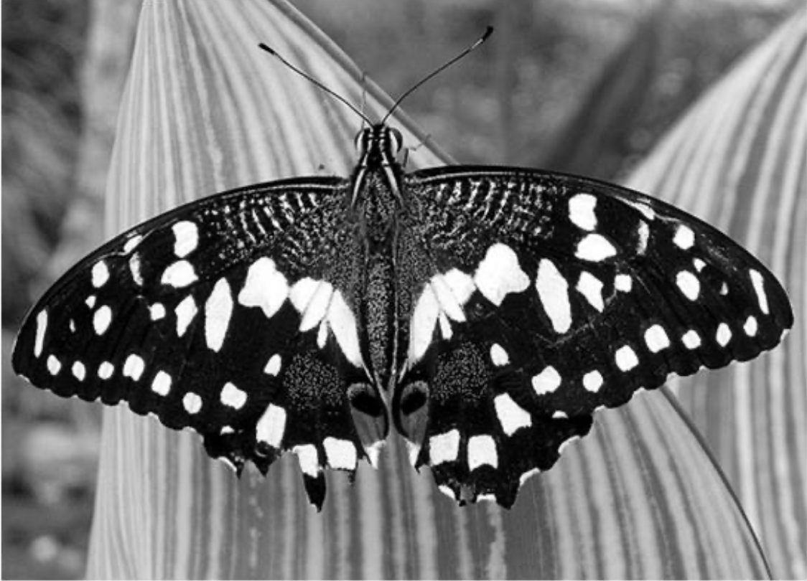
        
        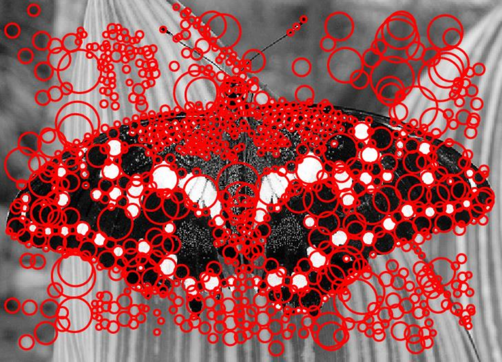
    

---
LoG 可用两个**高斯函数差**(difference of Gaussian, **DoG**)近似（右图蓝线是两个高斯函数之差，黑线是 LoG 的结果）：

    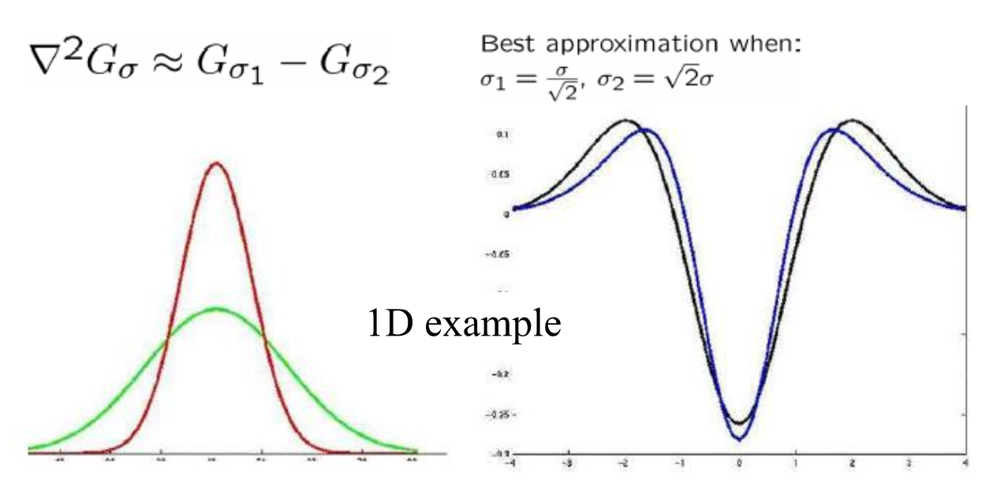

使用 DoG 滤波：

- 使用两个高斯滤波器滤波
- 计算两个滤波后图像之差

    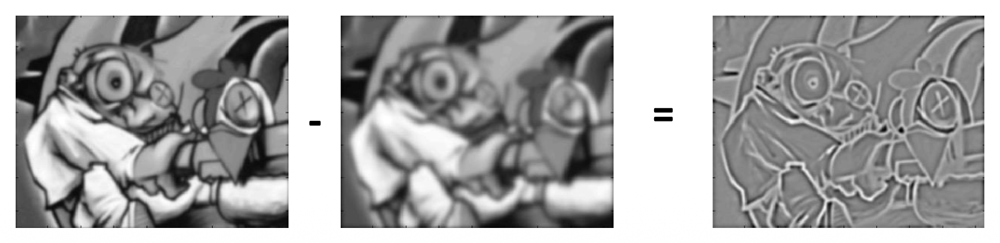

### Description

相近内容的图像块(patch)应具有相近的描述符(descriptor)。

    

描述兴趣点周围区域的最简单方法是记录一个光强值列表，用于构建**特征向量**。但这样做会遇到的一个问题是：即便对微小的移动或旋转也很敏感（即不是不可变的）。比如稍微移一下图像，对人类而言是微不足道的，但向量表示就会发生显著变化。

    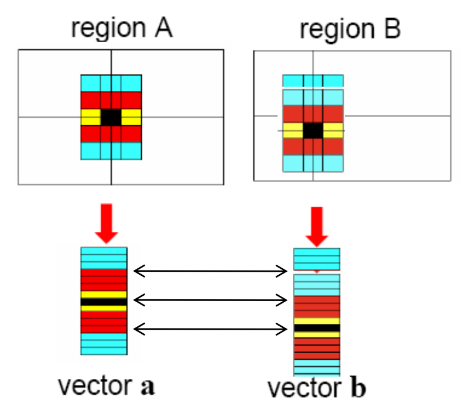

常用的解决方案是 **SIFT**（**尺度不变特征变换**(scale invariant featrue transform)）描述符。

- 它有一个关于方向梯度的直方图（以角度为横坐标（范围为 $[0, 2\pi]$）），其中捕捉了重要的纹理信息
- 对微小平移和仿射形变(affine deformation)具有鲁棒性

    

显然，SIFT 对**旋转**具有不变性。但是旋转后对应的方向梯度直方图发生了平移。要想将两张图像的直方图匹配起来，需要采用**方向归一化**(orientation normalization)的方法：找出主方向（即直方图中值最大的角度），然后以该方向为基准旋转图像，直到两张图的朝向匹配为止。

    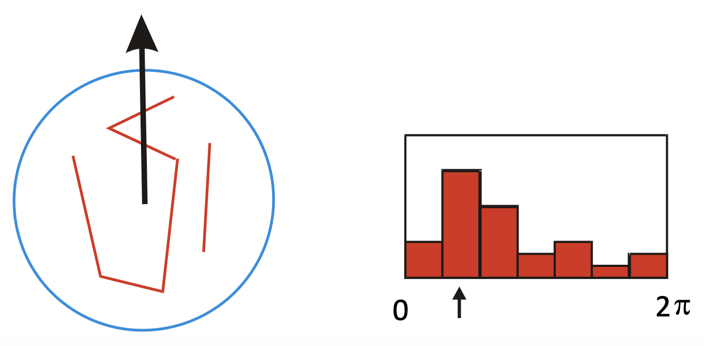

值得注意的是，虽然 SIFT 叫做“尺度不变”，但这个尺度不变并不是靠 SIFT 保证的，而是**在检测阶段中确定窗口的尺度**。

其中一种算法是 **Lowe's SIFT 算法**，它的大致流程为：

- 运行 DoG 检测器（寻找位置/尺度空间的最大值）
- 寻找主方向
- 对于每一对（x，y，尺度，方向），创建描述符

??? example "例子"

    === "例1"

        

            
        

    === "例2"

        

            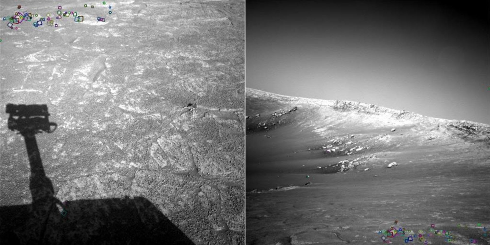
        

SIFT 是一种非常鲁棒的匹配技术：

- 能处理视图上的变化，理论上具备对旋转和尺度上的不变性
- 能处理照明上的巨大变化，有时甚至能应对白天 v.s. 夜晚的变化
- 快速且高效，能够实时运行
- 大量可用代码

??? abstract "其他检测器和描述符"

    

        
    

### Matching

特征匹配：对于图像 $I_1$ 的特征，如何找到对应图像 $I_2$ 上的最佳匹配？

- 定义一个用于比较两个描述符的距离函数
- 测试 $I_2$ 上的所有特征，找出其中距离最小的那个

    

一般用 **L2 距离**或 $\|f_1 - f_2\|$ 来衡量距离（假设特征为 $f_1, f_2$）：

    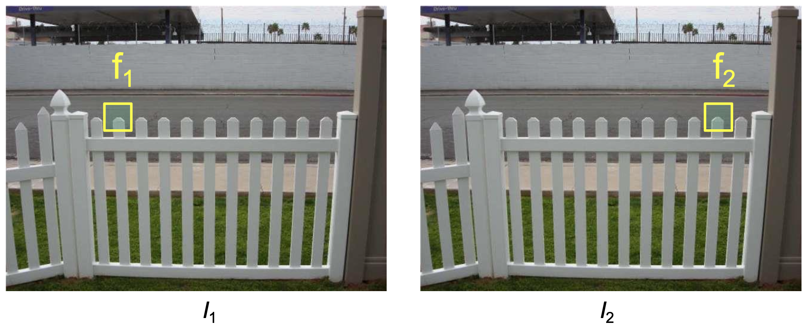

一个问题是：小距离带来了歧义（不正确）的匹配（比如下图不同位置栅栏部位的匹配）。下面给出一些解决方案：

- **比例测试**(ratio test)
    - 比例分数 = $\dfrac{\|f_1 - f_2\|}{\|f_1 - f_2'\|}$，其中
        - $f_2$ 是 $I_2$ 中对应 $f_1$ 的最佳匹配
        - $f_2'$ 是 $I_2$ 中对应 $f_1$ 的次最佳匹配

    - 取值范围为 $(0, 1]$，值越大说明歧义问题越严重（说明 $f_2, f_2'$ 的值很接近），找到的点越不可靠
    - 因此这起到了滤除歧义的作用

    

        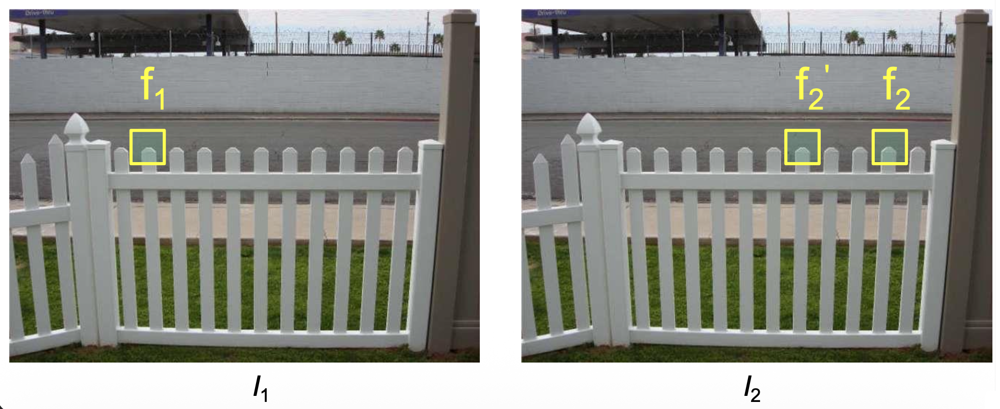
    

- **相互最近邻**(mutual nearest neighbor)
    - $f_2$ 是 $I_2$ 中对应 $f_1$ 的最近邻居
    - $f_1$ 是 $I_1$ 中对应 $f_2$ 的最近邻居
    - 如果匹配可靠的话，图像上匹配的两点应互为最近邻

    

        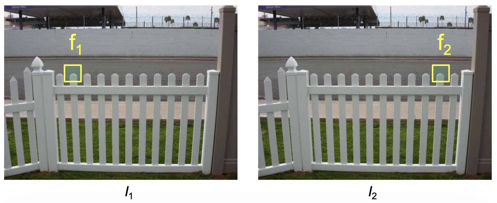
    

???+ example "例子"

    

        
    

??? info "基于深度学习的特征匹配"

    

        
    

    基于学习的局部特征

    

        
    

## Motion Estimation

我们生活在**运动**(motion)的世界里，因此观察、理解、预测运动是我们日常生活中的重要组成部分。

??? example "例子：一些有意思的错觉现象"

    盯着这些图案看，感觉它们好像在动，但实际上都是静止的图片。

    

        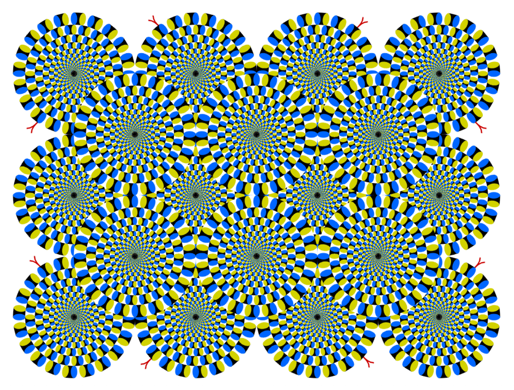
    

    

        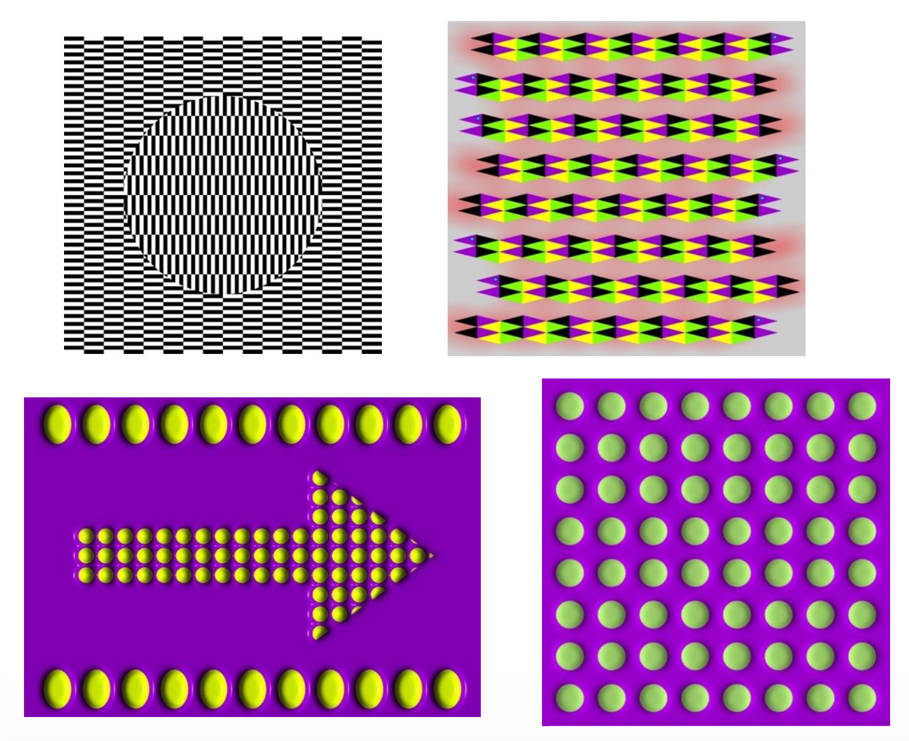
    

    这些现象背后真正的机制有待探究。不过 FMRI 数据显示，这些错觉与**眼球运动**的某些组成部分有关。

运动的成因：

- 相机静止，场景移动

    

        
    

- 相机移动，场景静止

    

        
    

- 相机和场景都移动

    

        
    

- 相机静止，场景移动，光源也移动

    

        
    

运动估计相关的任务有：

- **特征追踪**(feature tracking)：提取特征点，并在多帧间追踪它们，输出这些（稀疏）点的位移(displacement)
- **光流**(optical flow)：逐像素还原图像运动，输出密集位移场（光流）

上述两个问题可用一个方法解决，那就是 **Lucas-Kanade 方法**。使用该方法时，需要先做出以下假设：

    

- **亮度持续性**(brightness constancy)：相同点（的亮度/颜色）在每一帧上看起来应当是相同的
    - 亮度持续方程：$I(x, y, t) = I(x + u, y + v, t + 1)$

        

            
        

    - 由于假设运动量不大，我们可以对方程进行泰勒展开，得到：

        $$
        \begin{aligned}
        I(x + u, y + v, t + 1) \approx I(x, y, t) + I_x \cdot u + I_y \cdot v + I_t \\
        I(x + u, y + v, t + 1) - I(x, y, t) = I_x \cdot u + I_y \cdot v + I_t \\
        I_x \cdot u + I_y \cdot v + I_t \approx 0 \quad \rightarrow \quad \boxed{\nabla I \cdot \begin{bmatrix}u & v\end{bmatrix}^T + I_t = 0}
        \end{aligned}
        $$

    - 不过目前已知方程只有一个，但有两个未知数 $(u, v)$；要想得到更多方程，请看下一条假设——

- **空间一致性**(spatial coherence)：点的移动应当和它的邻居们一致
    - 假设像素的邻居们有相同的 $(u, v)$
    - 如果用 5x5 的窗口，那么每个像素就能得到 25 个方程了

        $$
        \begin{bmatrix}I_x(\mathbf{p_1}) & I_y(\mathbf{p_1}) \\ I_x(\mathbf{p_2}) & I_y(\mathbf{p_2}) \\ \vdots & \vdots \\ I_x(\mathbf{p_{25}}) & I_y(\mathbf{p_{25}})\end{bmatrix} \begin{bmatrix}u \\ v\end{bmatrix} = -\begin{bmatrix}I_t(\mathbf{p_1}) \\ I_t(\mathbf{p_2}) \\ \vdots \\ I_t(\mathbf{p_{25}})\end{bmatrix}
        $$

        简化表示为 $Ad = b$。现在方程比变量多了！

    - 目标是求解 $\min\limits_d \|Ad - b\|^2$，即**关于 $d$ 的最小二乘问题**（优化问题）。以下方程的解即为最终要求的 $d$：

        $$
        \begin{aligned}
        (A^T A) d & = A^T b \\
        \underbrace{\begin{bmatrix}\sum I_x I_x & \sum I_x I_y \\ \sum I_x I_y & \sum I_y I_y\end{bmatrix}}_{A^TA}\begin{bmatrix}u \\ v\end{bmatrix}&=-\underbrace{\begin{bmatrix}\sum I_x I_t \\ \sum I_y I_t\end{bmatrix}}_{A^Tb}
        \end{aligned}
        $$

    - 该方程何时能解：$A^TA$ **可逆**(invertible)且是**良态的**(well-conditioned)
        - 它的特征值 $\lambda_1, \lambda_2$ 不应过小
        - 这和[哈里斯角检测器](#harris-detector)类似（所以 LK 方法更适合用在**强纹理区域**，而不是弱纹理或边缘区域）

        === "弱纹理区域(low texture region)"

            

                
            

        === "边"

            

                
            

        === "强纹理区域(high texture region)"

            

                
            

    - **孔径问题**(aperture problem)：平行于边缘的运动分量无法测量。

        

            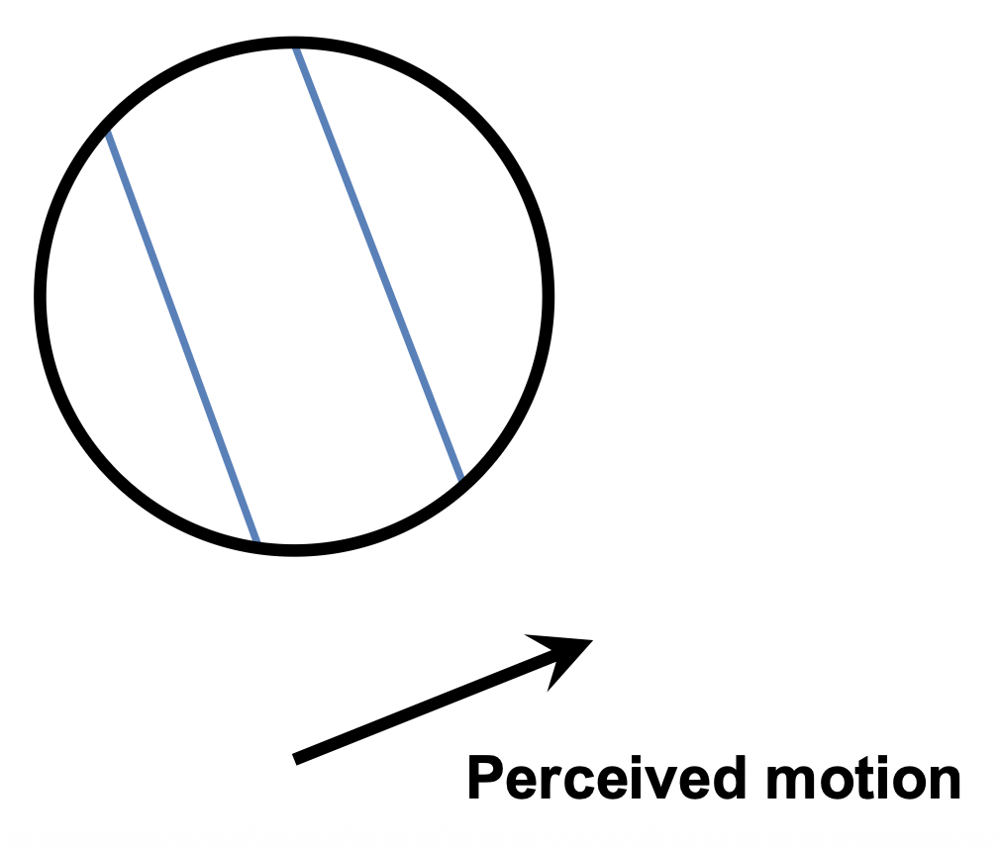
            
        

        - 例子：[理发店三色柱错觉](https://en.wikipedia.org/wiki/Barberpole_illusion?useskin=vector)

- **运动量不大**(small motion)：点不能移动太远
    - 如果移动量太大（比如远超一个像素），那么可以考虑通过**降低分辨率**的方式来缓减影响

        

            
        

    - 具体实现：**从粗到精的光流估计**(coarse-to-fine optical flow estimation)：

        

            
        

导致 Lucas-Kanade 方法存在误差的潜在原因有：

- 假设 $A^TA$ 是容易可逆的
- 假设图像上没有太多噪声
- 以及违背前面三个假设的任何一条

???+ example "例子"

    === "例1"

        **流质量评估**(flow quality evaluation)

        === "原图"

            

                
            

        === "移动后"

            

                
            

        ---
        

            
        

        Middlebury flow page：<http://vision.middlebury.edu/flow/>

    === "例2"

        用于光流的深度学习

        

            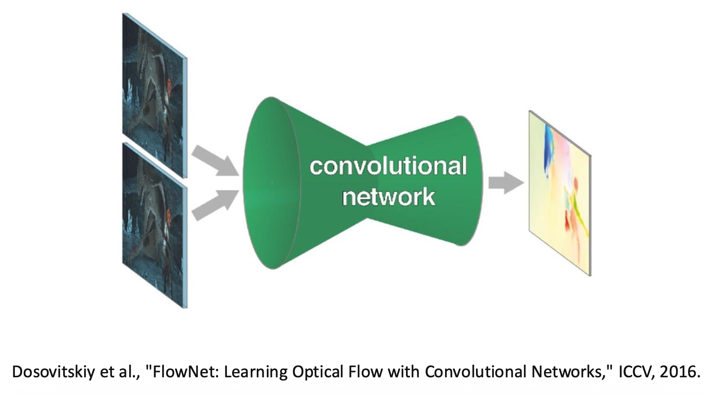
        

    === "例3"

        视频稳定化(video stabilization)

        

            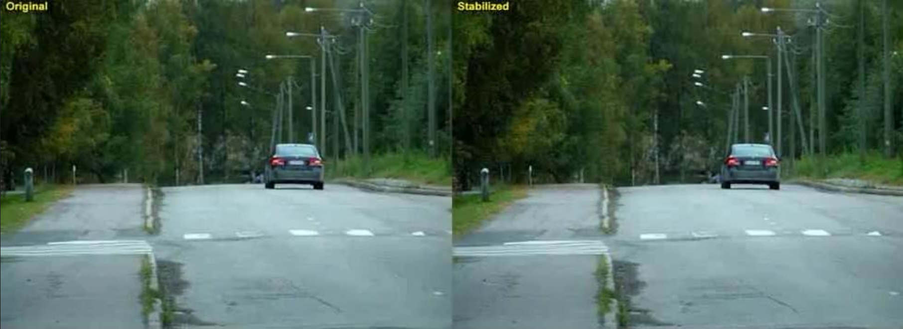
        

    === "例4"

        视频去噪(video denoising)

        

            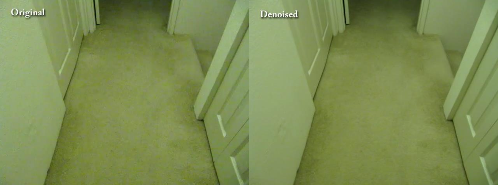
        

