# Image Stitching

??? abstract "核心知识"

    - 图像变形
        - 各种变换，重点是投影变换（单应变换）
        - 插值（前面介绍过了）
    - 图像缝合
        - RANSAC
        - 全景图：圆柱投影

??? example "例子"

    === "例1：全景图"

        

            
        

    === "例2：360° VR"

        

            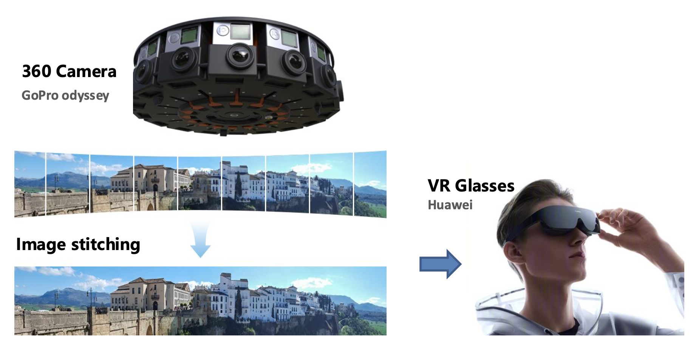
        

## Image Warping

**图像变形**(image warping)旨在改变图像的**形状**(shape)。

    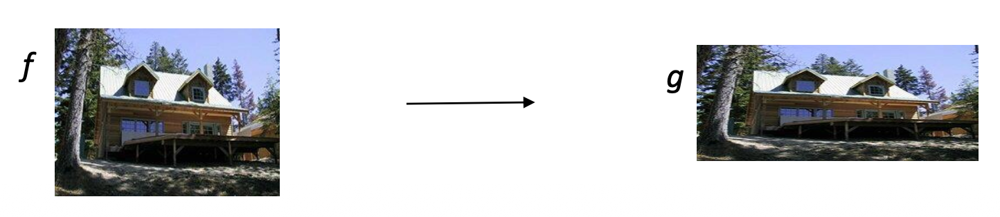

**参数化**(parametric)（**全局**(global)）**变形**：

    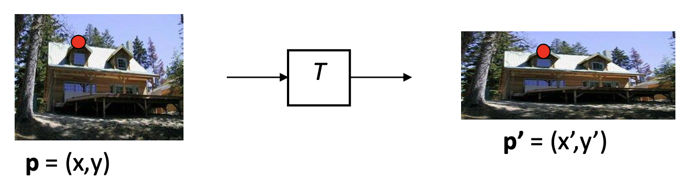

- 变换(transformation) $T$ 是一种坐标变换：$p' = T(p)$
- 例子：

    

        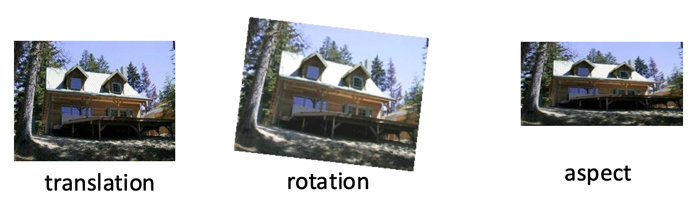
    

各种变换的知识在我的 [CG 笔记](../../software/cg/3.md#2d-transformations)中介绍过了，可点击链接阅读相关内容。下面仅介绍**投影变换**（因为比较重要）。

### Projective Transformation

投影变换（**单应变换**(homography)）：

$$
\begin{bmatrix}x_i^{\prime}\\y_i^{\prime}\\1\end{bmatrix}\cong\begin{bmatrix}h_{00}&h_{01}&h_{02}\\h_{10}&h_{11}&h_{12}\\ h_{20} &h_{21}&h_{22}\end{bmatrix}\begin{bmatrix}x_i\\y_i\\1\end{bmatrix}
$$

解得：

$$
\begin{gathered}x_{i}^{\prime}\begin{aligned}=\frac{h_{00}x_i+h_{01}y_i+h_{02}}{h_{20}x_i+h_{21}y_i+h_{22}}\end{aligned}\\y_i^\prime=\frac{h_{10}x_i+h_{11}y_i+h_{12}}{h_{20}x_i+h_{21}y_i+h_{22}}\end{gathered}
$$

- 单应矩阵具有**尺度不变性**（可以乘除任意标量），因此它的自由度为 8（9 - 1）
- 我们通常将向量 $\begin{bmatrix}h_{00} & h_{01} & \dots & h_{22}\end{bmatrix}$ 的长度限制为 1
- [仿射变换](../../software/cg/3.md#affine-transformations)是单应变换的子集（仿射变换要求第三行前两个元素均为 0）

可以这样理解投影变换：在保证投影中心不变（相机位置不动）的情况下，通过改变投影平面，可以生成任意的合成相机视角。

    

???+ example "例子"

    === "例1"

        

            
        

    === "例2"

        

            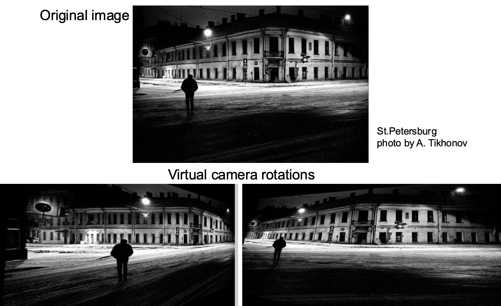
        

???+ abstract "总结"

    

        
    

    旋转矩阵的自由度：

    - 2D：1 个自由度（旋转角）
    - 3D：3 个自由度（旋转角 + 旋转轴的方位角和仰角）

### Implementing the Warping

对于给定的坐标变换 $(x', y') = T(x, y)$ 和源图像 $f(x, y)$，如何计算变换后的图像 $g(x', y') = T(f(x, y))$？我们有以下几种方法：

    

- **正向变形**(forward warping)：将 $f(x, y)$ 的每个像素发送至对应在 $g(x', y')$ 上的位置 $(x', y') = T(x, y)$

    

        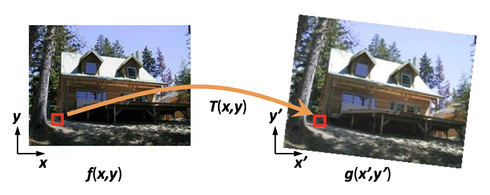
    

- **逆向变形**(inverse warping)：从对应 $f(x, y)$ 上的位置 $(x, y) = T^{-1}(x, y)$ 上获取 $g(x', y')$ 的每个像素

    

        
    

无论何种采用方法，都会遇到一个问题：如果对应于另一张图像上的像素落在一些像素的中间而非恰好落在某一个像素上，那么该如何处理呢？答案是根据邻居像素**插值**(interpolate)得到颜色值。

### Interpolation

插值方法有（具体可见[第 3 讲](3.md#interpolation)）：

- **最近邻**：拷贝来自最近整数坐标上的像素值

    

        
    

- 四个邻居像素的加权和

    

        
    

- **双线性**(bilinear)
- **双三次**(bicubic)
- sinc

## Image Stitching

???+ info "背景知识"

    - 仿射变换和投影变换（课件上有关于单应变换的求解过程，这一块不需要掌握）
    - **离群点**(outliers)：

        

            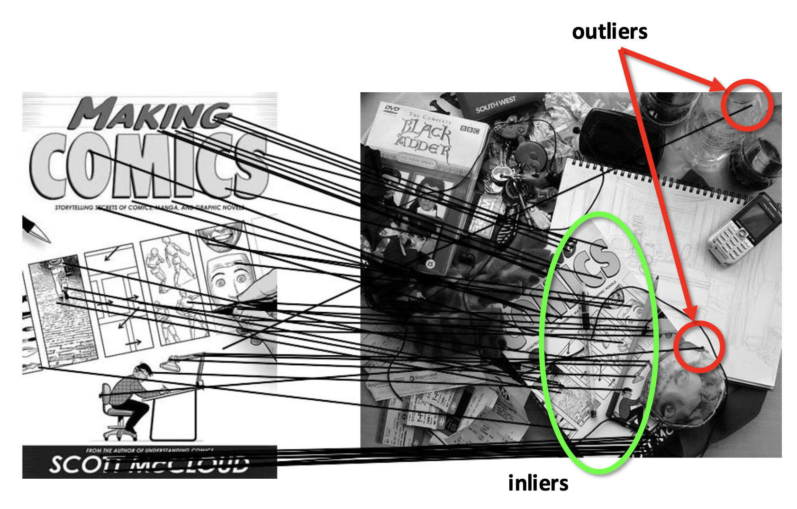
        

### RANSAC

**RANSAC** 的思路是：

- 所有内点将在平移向量上达成一致
- 离群点之间彼此不一致
    - RANSAC 只保证当离群点占比小于 50% 时正常工作

>“幸福的家庭都是相似的，不幸的家庭各有各的不幸。”
>
——列夫·托尔斯泰

具体过程如下：

1. 选择 s 个样本点（通常 s 为拟合模型所需的最小采样点数）
2. 将模型（例如变换矩阵）拟合到这些样本点上
3. 计算大致拟合模型的内点(inliers)数量
4. 重复 N 次
5. 选择**内点数量最多**的模型

???+ example "例子"

    图中每个箭头表示一种模型：

    

        
    

最后一步：**最小二乘拟合**(least square fit)。对于上述例子就是：

    

???+ example "例子"

    === "例1"

        

            
        

    === "例2"

        

            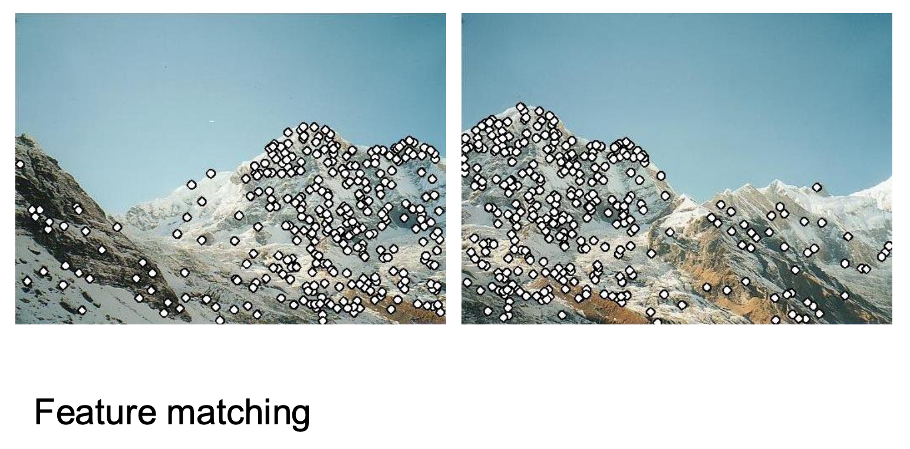
        

    === "例3"

        

            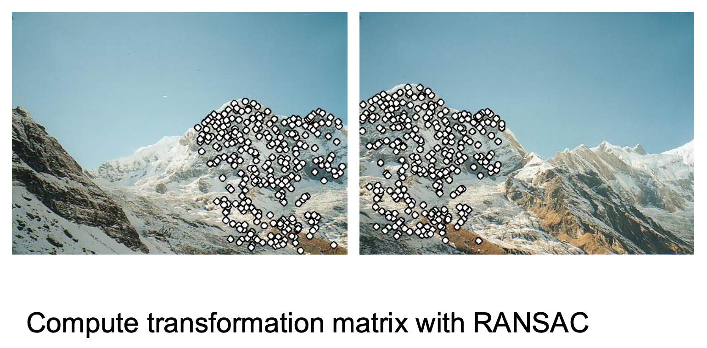
        

    === "例4"

        

            
        

### Panoramas

创建**全景图**(panoramas)的步骤：

1. 将所有图像变形至参考图像
2. 将它们合并起来

    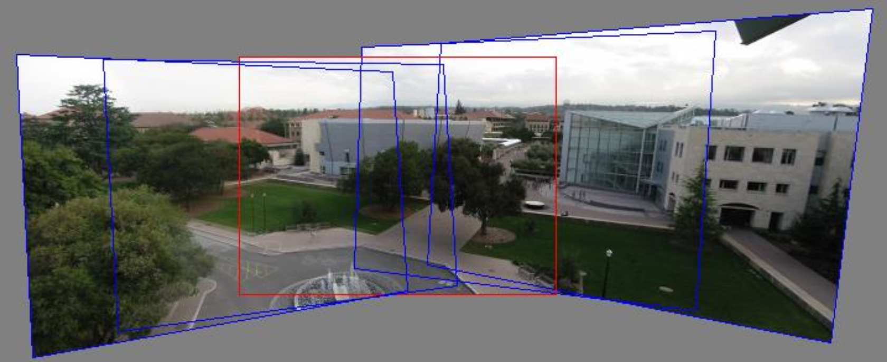

然而，我们是否一定要将所有图像投影到一个平面上吗？

    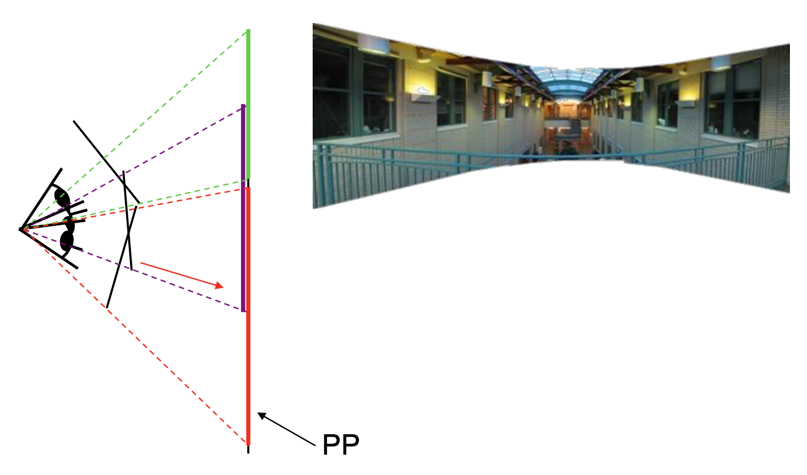

有时，我们可能希望构建 360° 的视野范围（完整的全景图），那么前面介绍的方法就失效了。

    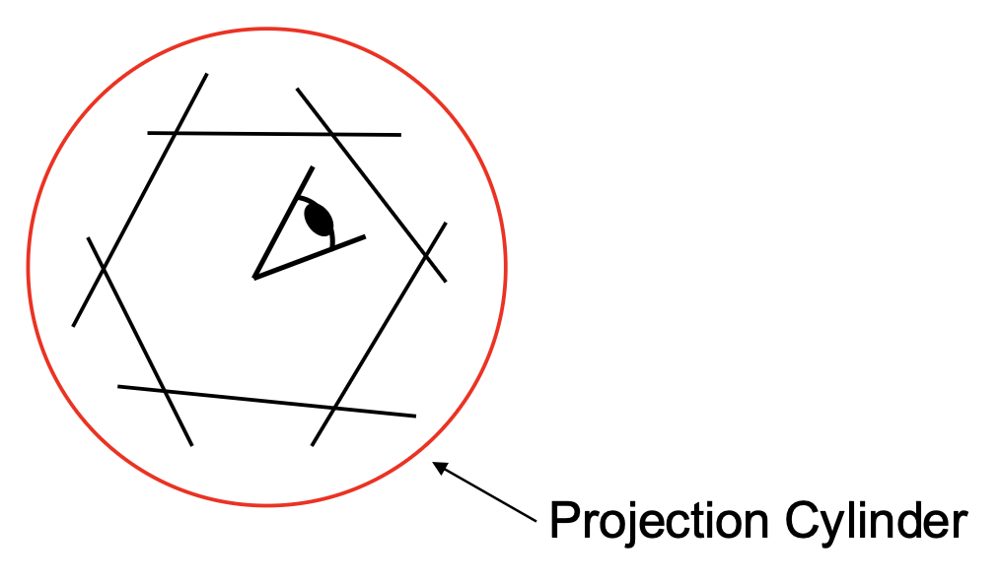

为此，我们引入一种新方法——**圆柱投影**(cylinderical projection)

    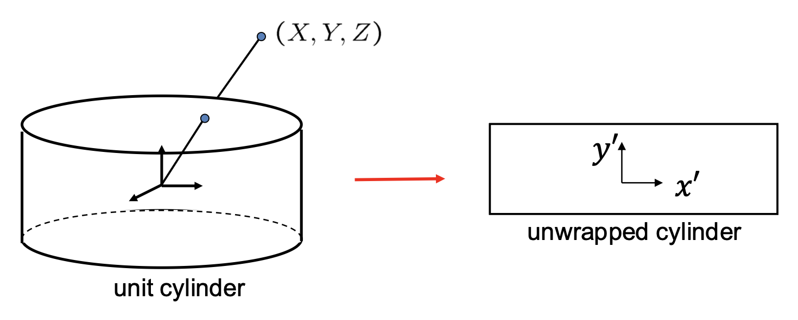

$$
\begin{aligned}&x^{\prime}=r\tan^{-1}(\frac{x}{f})\\&y^{\prime}=\frac{ry}{\sqrt{x^2+f^2}}\end{aligned}
$$

其中 $(x', y')$ 为圆柱坐标，$(x, y)$ 为图像坐标（原点位于图像中心），$r$ 是圆柱半径，$f$ 是焦距。

???+ example "例子"

    

        
    

圆柱全景图的创建步骤如下：

1. 将图像重新投影到圆柱上
2. 混合(blend)

    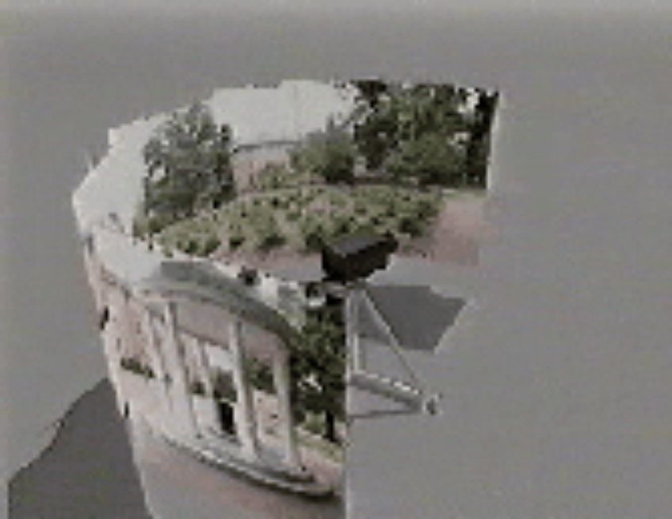

那么如何计算圆柱上的变换呢？一个重要发现是：相机的旋转就是在圆柱上的**平移**。

组装全景图：将配对缝合在一起，混合，然后裁剪。

    

这一过程存在**漂移**(drift)的问题：

    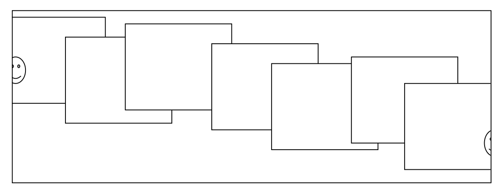

- 小误差会随时间积累
- 应用纠正，使得总和 = 0（对于 360° 全景图）

???+ example "例子：360° 全景图"

    === "例1"

        

            
        

    === "例2"

        

            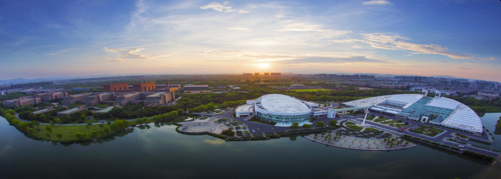
        
