# Structure from Motion

**运动恢复结构**(structure from motion, SfM)：从图像中恢复场景的**相机姿态**和**三维结构**。

    

SfM 扩展：

- 多视角立体(multi-view stereo)

    

        
    

- 视觉定位(visual localization)

    

        
    

- SLAM（同时定位与地图构建(simultaneous localization and mapping)）

    

        
    

下面我们分别来解决以下问题：

- **相机模型**：相机如何将世界中的三维点映射到图像平面上
- **相机标定与姿态估计**(camera calibration and pose estimation)：如何计算相机相对于世界坐标系的位置和方向
- **运动恢复结构**：如何从图像中重建未知的三维结构

## Camera Model

### Image Formation

成像步骤：

1. 将相机放置在某处（**坐标变换**）
2. 按下快门（**透视投影**）
3. 通过光子到电子的转换，一张照片就诞生了（图像平面到图像传感器的映射）

    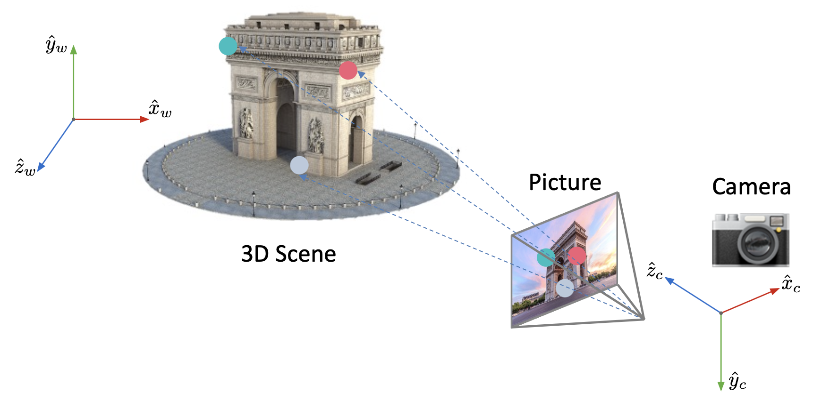

其中第一步涉及到**外参矩阵**(extrinsic matrix)，后两步用到**内参矩阵**(intrinsic matrix)。

### Coordinate Transformation

坐标变换的过程如图所示：

    

相机在世界坐标系 $W$ 中的**位置**(position) $c_w$ 和**朝向**(orientation) $R$ 是相机的**外参**(extrinsic parameters)。

$$
R = 
\begin{bmatrix}
r_{11} & r_{12} & r_{13} \\
r_{21} & r_{22} & r_{23} \\
r_{31} & r_{32} & r_{33}
\end{bmatrix}
\begin{array}{l}
\rightarrow\ \text{Row 1: Direction of } \hat{x}_c \text{ in world coordinate frame} \\
\rightarrow\ \text{Row 2: Direction of } \hat{y}_c \text{ in world coordinate frame} \\
\rightarrow\ \text{Row 3: Direction of } \hat{z}_c \text{ in world coordinate frame}
\end{array}
$$

其中旋转矩阵 $R$ 是**标准正交的**(orthonormal)。

对于给定的相机外参 $(R, c_w)$，点 $P$ 在相机坐标系中的位置为：

$$
\bm{x}_c=R(\bm{x}_w-\bm{c}_w)=R\bm{x}_w-R\bm{c}_w=R\bm{x}_w+\bm{t} \quad \bm{t} = -R\bm{c}_w \\
\bm{x}_C=\begin{bmatrix}x_C\\y_C\\z_C\end{bmatrix}=\begin{bmatrix}r_{11}&r_{12}&r_{13}\\r_{21}&r_{22}&r_{23}\\r_{31}&r_{32}&r_{33}\end{bmatrix}\begin{bmatrix}x_w\\y_w\\z_w\end{bmatrix}+\begin{bmatrix}t_x\\t_y\\t_z\end{bmatrix}
$$

将上述方程重写为齐次坐标的形式：

$$
\tilde{\bm{x}}_C=\begin{bmatrix}x_c\\y_c\\z_c\\1\end{bmatrix}=\begin{bmatrix}r_{11}&r_{12}&r_{13}&t_x\\r_{21}&r_{22}&r_{23}&t_y\\r_{31}&r_{32}&r_{33}&t_z\\0&0&0&1\end{bmatrix}\begin{bmatrix}x_w\\y_w\\z_w\\1\end{bmatrix}
$$

**外参矩阵** $M_{ext}=\begin{bmatrix}R_{3\times3}&\bm{t}\\\bm{0}_{1\times3}&1\end{bmatrix}=\begin{bmatrix}r_{11}&r_{12}&r_{13}&t_x\\r_{21}&r_{22}&r_{23}&t_y\\r_{31}&r_{32}&r_{33}&t_z\\0&0&0&1\end{bmatrix}$

### Perspective Projection

透视投影的示意图如下：

    

### Image Plane to Image Sensor Mapping

    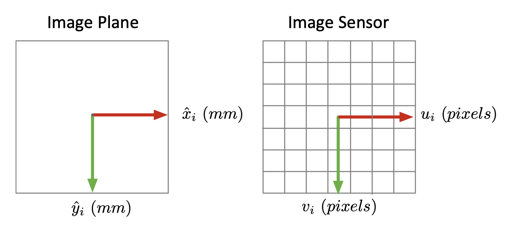

>像素也有可能是矩形的。

若 $m_x, m_y$ 分别表示 $x, y$ 方向上的像素密度（pixels/mm），那么像素坐标为：

$$
u=m_xx_i=m_xf\frac{x_c}{z_c} \quad \quad v=m_yy_i=m_yf\frac{y_c}{z_c}
$$

我们通常将图像传感器的左上角作为原点（这样便于索引）。若像素 $(c_x, c_y)$ 是光轴穿过传感器的主点(principle point)，那么：

$$
u=m_xf\frac{x_c}{z_c}+c_x \quad \quad v=m_yf\frac{y_c}{z_c}+c_y
$$

转换为齐次坐标形式：

$$
\begin{bmatrix}u\\v\\1\end{bmatrix}=\begin{bmatrix}f_x&0&c_x\\0&f_y&c_y\\0&0&1\end{bmatrix}\begin{bmatrix}x_c\\y_c\\z_c\end{bmatrix}=\begin{bmatrix}f_x&0&c_x&0\\0&f_y&c_y&0\\0&0&1&0\end{bmatrix}\begin{bmatrix}x_c\\y_c\\z_c\\1\end{bmatrix}
$$

其中 $f_x = m_x f, f_y = m_y f$。

---

    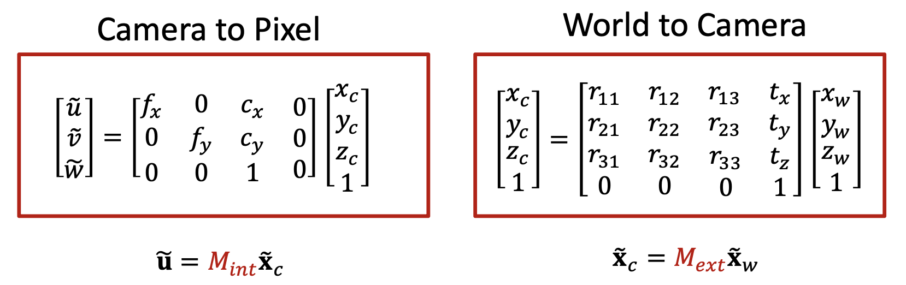

有了上述铺垫，我们可以得到完整的投影矩阵 $P$ 了：
$$
\widetilde{\bm{u}}=\textcolor{red}{M_{int}M_{ext}}\tilde{\bm{x}}_w=\textcolor{red}{P}\tilde{\bm{x}}_w
$$

即：

$$
\begin{bmatrix}\tilde{u}\\\tilde{v}\\\tilde{w}\end{bmatrix}=\begin{bmatrix}p_{11}&p_{12}&p_{13}&p_{14}\\p_{21}&p_{22}&p_{23}&p_{24}\\p_{31}&p_{32}&p_{33}&p_{34}\end{bmatrix}\begin{bmatrix}x_w\\y_w\\z_w\\1\end{bmatrix}
$$

## Camera Calibration

**相机校准**(camera calibration)是一个寻找内部参数和外部参数的过程。大多数时候用到的是一些知名的校准目标，比如图像、棋盘等。

### Procedure

现在的问题是：如何寻找上述方程中的内部参数和外部参数呢？下面给出详细的流程：

1. 拍摄一个已知几何形状的物体图像（比如一块校准板(calibration board)）

    

        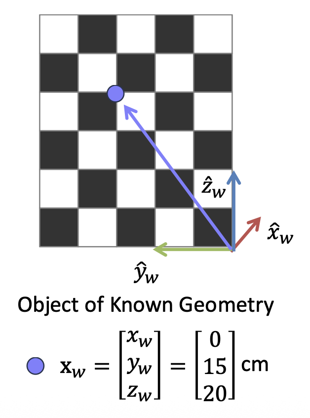
    

    - 有时可能需要以不同姿态拍摄同一个校准目标：

        

            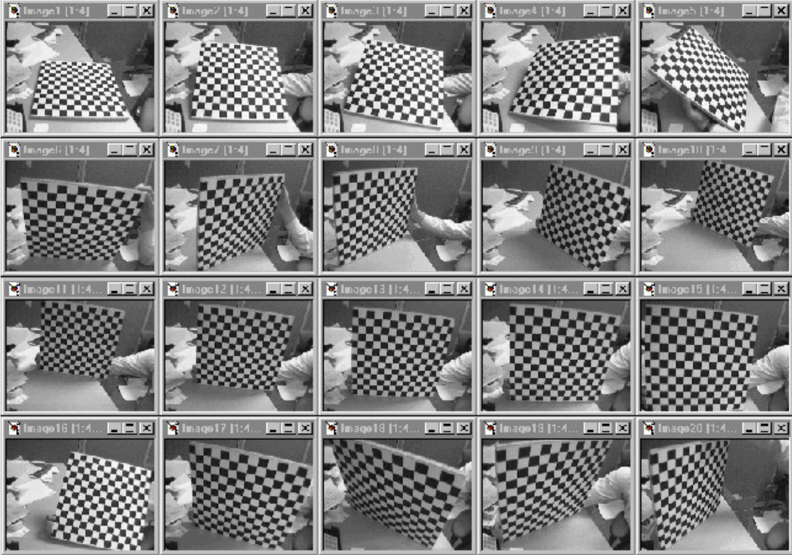
        

2. 识别三维场景点和图像点之间的对应关系

    

        
    

3. 对于场景和图像中每一个对应点 $i$，有方程：

    $$
    \underbrace{
    \begin{bmatrix}
    u^{(i)} \\
    v^{(i)} \\
    1
    \end{bmatrix}
    }_{\text{Known}}
    \equiv
    \underbrace{
    \begin{bmatrix}
    p_{11} & p_{12} & p_{13} & p_{14} \\
    p_{21} & p_{22} & p_{23} & p_{24} \\
    p_{31} & p_{32} & p_{33} & p_{34}
    \end{bmatrix}
    }_{\text{Unknown}}
    \underbrace{
    \begin{bmatrix}
    x_w^{(i)} \\
    y_w^{(i)} \\
    z_w^{(i)} \\
    1
    \end{bmatrix}
    }_{\text{Known}}
    $$

    成立。将矩阵乘法扩写为线性方程：

    $$
    u^{(i)} = \frac{p_{11}x_w^{(i)} + p_{12}y_w^{(i)} + p_{13}z_w^{(i)} + p_{14}}{p_{31}x_w^{(i)} + p_{32}y_w^{(i)} + p_{33}z_w^{(i)} + p_{34}} \\
    v^{(i)} = \frac{p_{21}x_w^{(i)} + p_{22}y_w^{(i)} + p_{23}z_w^{(i)} + p_{24}}{p_{31}x_w^{(i)} + p_{32}y_w^{(i)} + p_{33}z_w^{(i)} + p_{34}}
    $$

4. 重新安排矩阵元素：

    $$
    \underbrace{
    \begin{bmatrix}
    x_w^{(1)} & y_w^{(1)} & z_w^{(1)} & 1 & 0 & 0 & 0 & 0 & -u_1x_w^{(1)} & -u_1y_w^{(1)} & -u_1z_w^{(1)} & -u_1 \\
    0 & 0 & 0 & 0 & x_w^{(1)} & y_w^{(1)} & z_w^{(1)} & 1 & -v_1x_w^{(1)} & -v_1y_w^{(1)} & -v_1z_w^{(1)} & -v_1 \\
    \vdots & \vdots & \vdots & \vdots & \vdots & \vdots & \vdots & \vdots & \vdots & \vdots & \vdots & \vdots \\
    x_w^{(i)} & y_w^{(i)} & z_w^{(i)} & 1 & 0 & 0 & 0 & 0 & -u_ix_w^{(i)} & -u_iy_w^{(i)} & -u_iz_w^{(i)} & -u_i \\
    0 & 0 & 0 & 0 & x_w^{(i)} & y_w^{(i)} & z_w^{(i)} & 1 & -v_ix_w^{(i)} & -v_iy_w^{(i)} & -v_iz_w^{(i)} & -v_i \\
    \vdots & \vdots & \vdots & \vdots & \vdots & \vdots & \vdots & \vdots & \vdots & \vdots & \vdots & \vdots \\
    x_w^{(n)} & y_w^{(n)} & z_w^{(n)} & 1 & 0 & 0 & 0 & 0 & -u_nx_w^{(n)} & -u_ny_w^{(n)} & -u_nz_w^{(n)} & -u_n \\
    0 & 0 & 0 & 0 & x_w^{(n)} & y_w^{(n)} & z_w^{(n)} & 1 & -v_nx_w^{(n)} & -v_ny_w^{(n)} & -v_nz_w^{(n)} & -v_n \\
    \end{bmatrix}
    }_{A\ (\text{Known})}
    \underbrace{
    \begin{bmatrix}
    p_{11} \\ p_{12} \\ p_{13} \\ p_{14} \\ p_{21} \\ p_{22} \\ p_{23} \\ p_{24} \\ p_{31} \\ p_{32} \\ p_{33} \\ p_{34}
    \end{bmatrix}}_{p\ (\text{Unknown})} = \begin{bmatrix}
    0 \\ 0 \\ 0 \\ 0 \\ 0 \\ 0 \\ 0 \\ 0 \\ 0 \\ 0 \\ 0 \\ 0
    \end{bmatrix}
    $$

5. 解出 $p$

    $$
    A \bm{p} = 0
    $$

### Property of Projection Matrices: Scale

已知 $\begin{bmatrix} \tilde{u} \\ \tilde{v} \\ \tilde{w} \end{bmatrix} \equiv k \begin{bmatrix} \tilde{u} \\ \tilde{v} \\ \tilde{w} \end{bmatrix}$，即：

$$
\begin{bmatrix}
p_{11} & p_{12} & p_{13} & p_{14} \\
p_{21} & p_{22} & p_{23} & p_{24} \\
p_{31} & p_{32} & p_{33} & p_{34}
\end{bmatrix}
\begin{bmatrix}
x_w \\
y_w \\
z_w \\
1
\end{bmatrix}
\equiv k
\begin{bmatrix}
p_{11} & p_{12} & p_{13} & p_{14} \\
p_{21} & p_{22} & p_{23} & p_{24} \\
p_{31} & p_{32} & p_{33} & p_{34}
\end{bmatrix}
\begin{bmatrix}
x_w \\
y_w \\
z_w \\
1
\end{bmatrix}
$$

因此投影矩阵 $P$ 和 $kP$ 产生相同的齐次像素坐标。由此我们发现性质：投影矩阵 $P$ 的定义仅取决于**尺度**(scale)。

### Solving P

有以下选择：

1. 设置好尺度，使得 $p_{34} = 1$
2. 设置好尺度，使得 $\|\bm{p}\|^2 = 1$

我们希望 $A \bm{p}$ 尽可能接近 0，且 $\|\bm{p}\|^2 = 1$，即：

$$
\min_{\bm{p}} ||\bm{A}\bm{p}||^2 \quad \text{such that} \quad ||\bm{p}||^2 = 1
$$

可以证明：矩阵 $A^TA$ 中对应**最小特征值** $\lambda$ 的特征向量 $\bm{p}$ 就是方程的解。

最后，重新排列解 $\bm{p}$ 以形成投影矩阵 $P$。

### Decomposition

已知：

$$
P = 
\begin{bmatrix}
p_{11} & p_{12} & p_{13} & p_{14} \\
p_{21} & p_{22} & p_{23} & p_{24} \\
p_{31} & p_{32} & p_{33} & p_{34}
\end{bmatrix}
= \begin{bmatrix}
f_x & 0 & o_x & 0 \\
0 & f_y & o_y & 0 \\
0 & 0 & 1 & 0
\end{bmatrix}
\begin{bmatrix}
r_{11} & r_{12} & r_{13} & t_x \\
r_{21} & r_{22} & r_{23} & t_y \\
r_{31} & r_{32} & r_{33} & t_z \\
0 & 0 & 0 & 1
\end{bmatrix}
$$

已知 $K$ 是一个上右三角矩阵，而 $R$ 是标准正交矩阵，可以通过 **QR 分解**从它们的乘积中唯一地**解耦**(decouple)出 $K$ 和 $R$。

$$
\begin{bmatrix}
p_{11} & p_{12} & p_{13} \\
p_{21} & p_{22} & p_{23} \\
p_{31} & p_{32} & p_{33}
\end{bmatrix}
= \begin{bmatrix}
f_x & 0 & o_x \\
0 & f_y & o_y \\
0 & 0 & 1
\end{bmatrix}
\begin{bmatrix}
r_{11} & r_{12} & r_{13} \\
r_{21} & r_{22} & r_{23} \\
r_{31} & r_{32} & r_{33}
\end{bmatrix} = KR
$$

对于 $P$ 的最后一列：

$$
\begin{bmatrix}p_{14}\\p_{24}\\p_{34}\end{bmatrix}=\begin{bmatrix}f_x&0&o_x\\0&f_y&o_y\\0&0&1\end{bmatrix}\begin{bmatrix}t_x\\t_y\\t_z\end{bmatrix}=K\bm{t}
$$

因此：

$$
\bm{t}=K^{-1}\begin{bmatrix}p_{14}\\p_{24}\\p_{34}\end{bmatrix}
$$

### Visual Localization Problem

1. 寻找三维-二维对应关系

    

        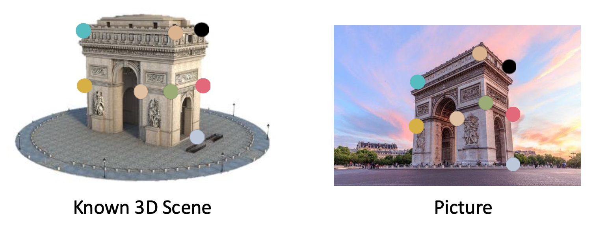
    

2. 对于给定关系，确定相机位置

    

        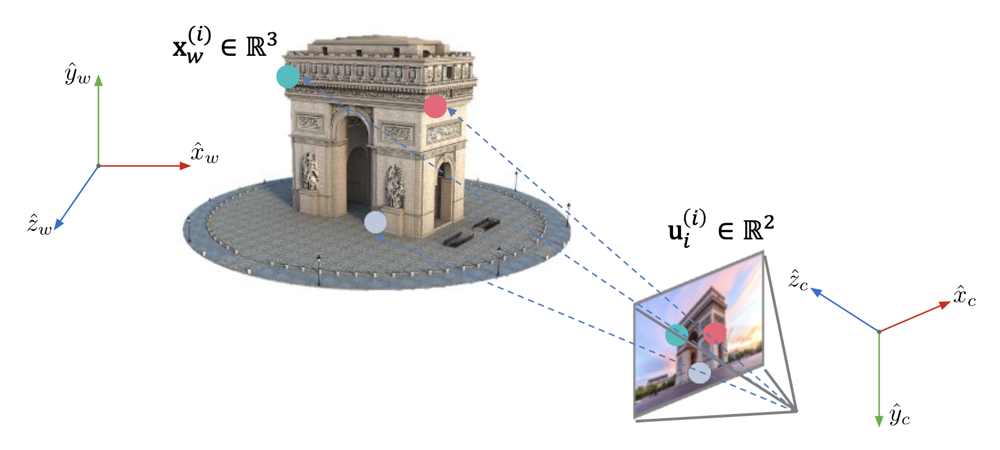
    

这被称为 **PnP**(perspective-n-point) 问题（若内参已知）。其中有 6 个未知数：3 个关于旋转，3 个关于平移，因此通常称为**六自由度估计**(6DoF estimation)。

### P3P

下面使用最小数量的点来求解相机姿态。

    

1. 根据余弦定理

    $$
    \begin{aligned}OA^2+OB^2-2OA\cdot OB\cdot\cos\langle a,b\rangle&=AB^2\\OB^2+OC^2-2OB\cdot OC\cdot\cos\langle b,c\rangle&=BC^2\\OA^2+OC^2-2OA\cdot OC\cdot\cos\langle a,c\rangle&=AC^2\end{aligned}
    $$

2. 除以 $OC^2$，令 $x=\frac{OA}{OC},y=\frac{OB}{OC}$

    $$
    \begin{gathered}\begin{aligned}x^2+y^2-2xy\cos\langle a,b\rangle=AB^2/OC^2\end{aligned}\\\begin{aligned}y^2+1^2-2y\cos\langle b,c\rangle=BC^2/OC^2\end{aligned}\\\begin{aligned}x^2+1^2-2x\cos\langle a,c\rangle=AC^2/OC^2\end{aligned}\end{gathered}
    $$

3. 令 $v=\frac{AB^2}{OC^2},u=\frac{BC^2}{AB^2},w=\frac{AC^2}{AB^2}$

    $$
    \begin{aligned}x^2+y^2-2xy\cos\langle a,b\rangle-v&=0\\y^2+1^2-2y\cos\langle b,c\rangle-uv&=0\\x^2+1^2-2x\cos\langle a,c\rangle-wv&=0\end{aligned}
    $$

使用 $v$ 重新组织上述方程，得到：

$$
\begin{aligned}(1-u)y^2-ux^2-\cos\langle b,c\rangle y+2uxy\cos\langle a,b\rangle+1&=0\\(1-w)x^2-wy^2-\cos\langle a,c\rangle x+2wxy\cos\langle a,b\rangle+1&=0\end{aligned}
$$

现在已知量为 $\cos\langle a,b\rangle,\cos\langle b,c\rangle,\cos\langle a,c\rangle,u,w$，未知量为 $x, y$，所以问题已经转为求解一个二元二次方程(binary quadratic equation)。

由于二元二次方程有**四种可能解**，我们利用**一个额外的点**来确定最可能的那一个。

### PnP

对于 PnP 问题，一种通用解如下：

$$
\min_{R, t} \sum_i || \underbrace{p_i}_{\text{Given 2D points}} - \underbrace{K(RP_i + t)}_{\text{3D points projected to 2D}} ||^2
$$

- 能够最小化**重投影误差**(reprojection error)
- 用 P3P 初始化，随后用高斯-牛顿法优化

## Structure from Motion

求解 SfM 问题的步骤：

1. 假设对每台相机而言内参矩阵 $K$ 是已知的
2. 寻找一些可靠的对应关系
3. 寻找相对相机位置 $\bm{p}$ 和朝向 $R$
4. 寻找场景的三维点

### Epipolar Geometry

???+ question "思考"

    以下对应特征点之间有什么几何关系吗？

    

        
    

    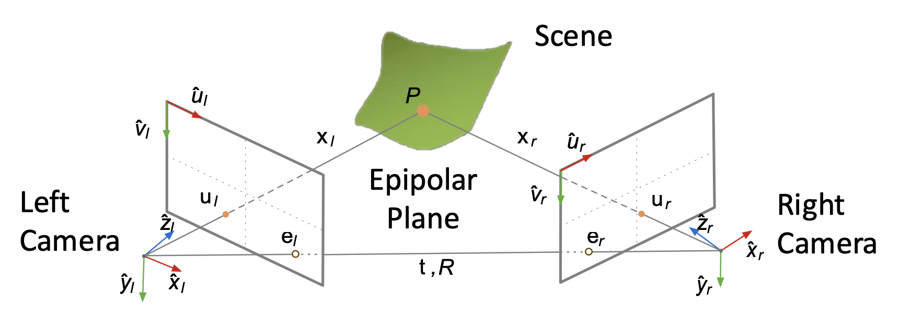

- **极线几何**(epipolar geometry)描述了三维点在两个视图中的二维投影（$u_l$ 和 $u_r$）之间的几何关系
- 并且告诉我们如何通过几对二维对应点来求解平移向量 $\bm{t}$ 和旋转矩阵 $R$
- **极点**(epipole)：一个相机的原点/针孔在另一个相机视角下的图像点
    - $e_l, e_r$ 即为极点
    - 对于给定的相机对，$e_l, e_r$ 是唯一的
- 场景点 $P$ 的**极平面**(epipolar plane)：由相机原点（$O_L, O_r$）、极点（$e_l, e_r$）以及场景点 $P$ 共同构成的平面
    - 每个场景点都位于一个**唯一**的极平面上

- 极平面**法向量**为 $\bm{n} = \bm{t} \times \bm{x}_l$
    - $\bm{n}$ 和 $\bm{x}_l$ 的点乘为 0，即：$\bm{x}_l \cdot (\bm{t} \times \bm{x}_l) = 0$
    - 写成矩阵形式为：

        $$
        \begin{align*}
        \begin{bmatrix} x_l & y_l & z_l \end{bmatrix}
        \begin{bmatrix}
        t_y z_l - t_z y_l \\
        t_z x_l - t_x z_l \\
        t_x y_l - t_y x_l
        \end{bmatrix} &= 0 \\
        \begin{bmatrix} x_l & y_l & z_l \end{bmatrix}
        \underbrace{
        \begin{bmatrix}
        0 & -t_z & t_y \\
        t_z & 0 & -t_x \\
        -t_y & t_x & 0
        \end{bmatrix}
        }_{T_\times}
        \begin{bmatrix} x_l \\ y_l \\ z_l \end{bmatrix} &= 0
        \end{align*}
        $$

        由于已知 $\bm{x}_l = R\bm{x}_r + \bm{t}$，代入极线约束条件得到：

        $$
        \begin{align*}
        \begin{bmatrix} x_l \\ y_l \\ z_l \end{bmatrix}^{\intercal}
        \begin{bmatrix}
        0 & -t_z & t_y \\
        t_z & 0 & -t_x \\
        -t_y & t_x & 0
        \end{bmatrix}
        \begin{bmatrix}
        r_{11} & r_{12} & r_{13} \\
        r_{21} & r_{22} & r_{23} \\
        r_{31} & r_{32} & r_{33}
        \end{bmatrix}
        \begin{bmatrix} x_r \\ y_r \\ z_r \end{bmatrix}
        +
        \begin{bmatrix}
        0 & -t_z & t_y \\
        t_z & 0 & -t_x \\
        -t_y & t_x & 0
        \end{bmatrix}
        \begin{bmatrix} x_r \\ y_r \\ z_r \end{bmatrix} &= 0 \\
        \begin{bmatrix} x_l & y_l & z_l \end{bmatrix}
        \underbrace{
        \begin{bmatrix}
        e_{11} & e_{12} & e_{13} \\
        e_{21} & e_{22} & e_{23} \\
        e_{31} & e_{32} & e_{33}
        \end{bmatrix}
        }_{\text{Essential Matrix }E}
        \begin{bmatrix} x_r \\ y_r \\ z_r \end{bmatrix} &= 0
        \end{align*}
        $$

### Essential Matrix

可以将**基本矩阵**(essential matrix) $E$ 分解为：$E = T_\times R$，即：

$$
\begin{bmatrix}
e_{11} & e_{12} & e_{13} \\
e_{21} & e_{22} & e_{23} \\
e_{31} & e_{32} & e_{33}
\end{bmatrix}
= \begin{bmatrix}
0 & -t_z & t_y \\
t_z & 0 & -t_x \\
-t_y & t_x & 0
\end{bmatrix}
\begin{bmatrix}
r_{11} & r_{12} & r_{13} \\
r_{21} & r_{22} & r_{23} \\
r_{31} & r_{32} & r_{33}
\end{bmatrix}
$$

由于 $T_\times$ 是斜对称(skew-symmetric) $(a_{ij} = a_{-ji})$ 且 $R$ 是标准正交矩阵，所以有可能通过**奇异值分解**(singular value decomposition)从它们的积中解耦出 $L_\times$ 和 $R$。

若 $E$ 已知，便可计算 $\bm{t}, R$，所以接下来的问题是如何找到 $E$。

解决思路：将场景点相对于左侧相机的三维位置 $(x_l, y_l, z_l)$ 与其相对于右侧相机的三维位置 $(x_r, y_r, z_r)$ 联系起来，得到：

$$
\begin{aligned}
& \bm{x}_l^T E \bm{x}_r = 0 \\
\begin{bmatrix} x_l & y_l & z_l \end{bmatrix} &
\begin{bmatrix}
e_{11} & e_{12} & e_{13} \\
e_{21} & e_{22} & e_{23} \\
e_{31} & e_{32} & e_{33}
\end{bmatrix}
\begin{bmatrix} x_r \\ y_r \\ z_r \end{bmatrix} = 0
\end{aligned}
$$

目前我们还不知道 $\bm{x}_l, \bm{x}_r$，但我们知道在图像坐标中的对应点，即：

- 左侧相机

    $$
    z_l
    \begin{bmatrix}
    u_l \\
    v_l \\
    1
    \end{bmatrix}
    = \underbrace{\begin{bmatrix}
    f_x^{(l)} & 0 & o_x^{(l)} \\
    0 & f_y^{(l)} & o_y^{(l)} \\
    0 & 0 & 1
    \end{bmatrix}}_{K_l}
    \begin{bmatrix}
    x_l \\
    y_l \\
    z_l
    \end{bmatrix}
    $$

    解得：

    $$
    \bm{x}_l{}^T=\begin{bmatrix}u_l&v_l&1\end{bmatrix}\mathrm{z}_l{K_l^{-1}}^T
    $$

- 右侧相机

    $$
    z_r
    \begin{bmatrix}
    u_r \\
    v_r \\
    1
    \end{bmatrix}
    = \underbrace{\begin{bmatrix}
    f_x^{(r)} & 0 & o_x^{(r)} \\
    0 & f_y^{(r)} & o_y^{(r)} \\
    0 & 0 & 1
    \end{bmatrix}}_{K_r}
    \begin{bmatrix}
    x_r \\
    y_r \\
    z_r
    \end{bmatrix}
    $$

    解得：

    $$
    \bm{x}_r=K_r^{-1}z_r\begin{bmatrix}u_r\\v_r\\1\end{bmatrix}
    $$

代入前面的方程，得到：

$$
\begin{bmatrix}u_l&v_l&1\end{bmatrix}\cancel{z_l}K_l^{-1^T}\begin{bmatrix}e_{11}&e_{12}&e_{13}\\e_{21}&e_{22}&e_{23}\\e_{31}&e_{32}&e_{33}\end{bmatrix}K_r^{-1}\cancel{z_r}\begin{bmatrix}u_r\\v_r\\1\end{bmatrix}=0
$$

所以场景的深度不影响极线约束。将上述方程写为：

$$
\begin{aligned}
\begin{bmatrix} u_l & v_l & 1 \end{bmatrix} &
\begin{bmatrix}
f_{11} & f_{12} & f_{13} \\
f_{21} & f_{22} & f_{23} \\
f_{31} & f_{32} & f_{33}
\end{bmatrix}
\begin{bmatrix} u_r \\ v_r \\ 1 \end{bmatrix}= 0 \\
E &= K_l^T F K_r
\end{aligned}
$$

中间这个矩阵叫做**基础矩阵**(fundamental matrix) $F$。

基础矩阵作用齐次坐标上：

$$
\begin{bmatrix}u_l&v_l&1\end{bmatrix}\begin{bmatrix}f_{11}&f_{12}&f_{13}\\f_{21}&f_{22}&f_{23}\\f_{31}&f_{32}&f_{33}\end{bmatrix}\begin{bmatrix}u_r\\v_r\\1\end{bmatrix}=0=\begin{bmatrix}u_l&v_l&1\end{bmatrix}\begin{bmatrix}kf_{11}&kf_{12}&kf_{13}\\kf_{21}&kf_{22}&kf_{23}\\kf_{31}&kf_{32}&kf_{33}\end{bmatrix}\begin{bmatrix}u_r\\v_r\\1\end{bmatrix}=0
$$

可以看到，基础矩阵 $F, kF$ 描述相同的极限几何，也就是说 $F$ 的定义仅取决于尺度。所以通常会给 $F$ 添加一个约束：$\|f\|^2 = 1$。

### Relative Camera Pose Estimation

**相对相机位置估计**(relative camera position estimation)是指在左右图像中寻找一组对应的特征点（至少 8 个）（比如使用 SIFT 方法或手动选取）。步骤如下：

1. 对于每一个对应关系 $i$，写出极线约束
2. 重新排列项，构成线性方程组

    $$
    \underbrace{
    \begin{bmatrix}
    u_l^{(1)}u_r^{(1)} & u_l^{(1)}v_r^{(1)} & u_l^{(1)} & v_l^{(1)}u_r^{(1)} & v_l^{(1)}v_r^{(1)} & v_l^{(1)} & u_r^{(1)} & v_r^{(1)} & 1 \\
    \vdots & \vdots & \vdots & \vdots & \vdots & \vdots & \vdots & \vdots & \vdots \\
    u_l^{(i)}u_r^{(i)} & u_l^{(i)}v_r^{(i)} & u_l^{(i)} & v_l^{(i)}u_r^{(i)} & v_l^{(i)}v_r^{(i)} & v_l^{(i)} & u_r^{(i)} & v_r^{(i)} & 1 \\
    \vdots & \vdots & \vdots & \vdots & \vdots & \vdots & \vdots & \vdots & \vdots \\
    u_l^{(m)}u_r^{(m)} & u_l^{(m)}v_r^{(m)} & u_l^{(m)} & v_l^{(m)}u_r^{(m)} & v_l^{(m)}v_r^{(m)} & v_l^{(m)} & u_r^{(m)} & v_r^{(m)} & 1 \\
    \end{bmatrix}
    }_{A\ (\text{Known})}
    %
    \underbrace{
    \begin{bmatrix}
    f_{11} \\ f_{12} \\ f_{13} \\ f_{21} \\ f_{22} \\ f_{23} \\ f_{31} \\ f_{32} \\ f_{33}
    \end{bmatrix}
    }_{f\ (\text{Unknown})}
    = \begin{bmatrix}
    0 \\ 0 \\ 0 \\ 0 \\ 0 \\ 0 \\ 0 \\ 0 \\ 0
    \end{bmatrix}
    $$

    即 $A\bm{f} = 0$

3. 寻找基础矩阵 $F$ 的最小二乘解：$A\bm{f}$ 尽可能接近 0 且 $\|\bm{f}\|^2 = 1$，即（约束为线性最小二乘问题）

    $$
    \min_{\bm{f}}\|A\bm{f}\|^2\text{ such that }\|\bm{f}\|^2=1
    $$

    >类似相机校准中求解投影矩阵或图像拼接中的单应性矩阵

    之后将解 $\bm{f}$ 重新组织，构成基础矩阵 $F$

4. 从已知的左右内参相机矩阵和基础矩阵 $F$ 计算基本矩阵 $E$

    $$
    E = K_l^T F K_r
    $$

5. 从 $E$ 中提取 $R, \bm{t}$（使用奇异值分解）

    $$
    E = T_\times R
    $$

### Triangulation

对于给定的二维特征点和相机参数，如何寻找场景点的三维坐标呢？

    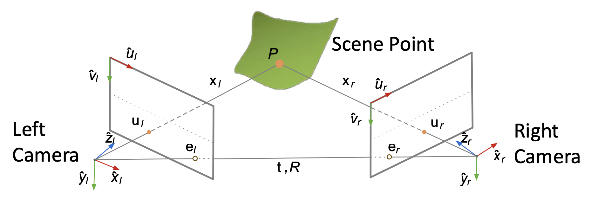

$$
\underbrace{
\begin{bmatrix}u_l\\v_l\\1\end{bmatrix}\equiv\begin{bmatrix}f_x^{(l)}&0&o_x^{(l)}&0\\0&f_y^{(l)}&o_y^{(l)}&0\\0&0&1&0\end{bmatrix}\begin{bmatrix}x_l\\y_l\\z_l\\1\end{bmatrix}
}_{\text{Left Camera Image Equation}}
\quad
\underbrace{
\begin{bmatrix}u_r\\v_r\\1\end{bmatrix}\equiv\begin{bmatrix}f_x^{(r)}&0&o_x^{(r)}&0\\0&f_y^{(r)}&o_y^{(r)}&0\\0&0&1&0\end{bmatrix}\begin{bmatrix}x_r\\y_r\\z_r\\1\end{bmatrix}
}_{\text{Right Camera Image Equation}}
$$

并且我们已知两台相机的相对位置和朝向：

$$
\begin{bmatrix}
x_l \\
y_l \\
z_l \\
1
\end{bmatrix}
= \begin{bmatrix}
r_{11} & r_{12} & r_{13} & t_x \\
r_{21} & r_{22} & r_{23} & t_y \\
r_{31} & r_{32} & r_{33} & t_z \\
0 & 0 & 0 & 1
\end{bmatrix}
\begin{bmatrix}
x_r \\
y_r \\
z_r \\
1
\end{bmatrix}
$$

可以得到：

- 左相机图像方程

    $$
    \begin{align*}
    \begin{bmatrix}
    u_l \\
    v_l \\
    1
    \end{bmatrix}
    &\equiv
    \begin{bmatrix}
    f_x^{(l)} & 0 & o_x^{(l)} & 0 \\
    0 & f_y^{(l)} & o_y^{(l)} & 0 \\
    0 & 0 & 1 & 0
    \end{bmatrix}
    \begin{bmatrix}
    r_{11} & r_{12} & r_{13} & t_x \\
    r_{21} & r_{22} & r_{23} & t_y \\
    r_{31} & r_{32} & r_{33} & t_z \\
    0 & 0 & 0 & 1
    \end{bmatrix}
    \begin{bmatrix}
    x_r \\
    y_r \\
    z_r \\
    1
    \end{bmatrix} \\
    \tilde{\bm{u}}_l &= P_l \tilde{\bm{x}}_r
    \end{align*}
    $$

- 右相机图像方程

    $$
    \begin{align*}
    \begin{bmatrix}
    u_r \\
    v_r \\
    1
    \end{bmatrix}
    &\equiv
    \begin{bmatrix}
    f_x^{(r)} & 0 & o_x^{(r)} & 0 \\
    0 & f_y^{(r)} & o_y^{(r)} & 0 \\
    0 & 0 & 1 & 0
    \end{bmatrix}
    \begin{bmatrix}
    x_r \\
    y_r \\
    z_r \\
    1
    \end{bmatrix} \\
    \tilde{\bm{u}}_r &= M_{int_r} \tilde{\bm{x}}_r
    \end{align*}
    $$

图像方程：

$$
\widetilde{\bm{u}}_{\bm{r}}=M_{r}\tilde{\bm{x}}_{\bm{r}}\quad\widetilde{\bm{u}}_{\bm{l}}=P_{l}\tilde{\bm{x}}_{\bm{r}}\\\begin{bmatrix}u_r\\v_r\\1\end{bmatrix}\equiv\begin{bmatrix}m_{11}&m_{12}&m_{13}&m_{14}\\m_{21}&m_{22}&m_{23}&m_{24}\\m_{31}&m_{32}&m_{33}&m_{34}\end{bmatrix}\begin{bmatrix}x_r\\y_r\\z_r\\1\end{bmatrix}\quad\begin{bmatrix}u_l\\v_l\\1\end{bmatrix}\equiv\begin{bmatrix}p_{11}&p_{12}&p_{13}&p_{14}\\p_{21}&p_{22}&p_{23}&p_{24}\\p_{31}&p_{32}&p_{33}&p_{34}\end{bmatrix}\begin{bmatrix}x_r\\y_r\\z_r\\1\end{bmatrix}
$$

重新组织项：

$$
\underbrace{
\begin{bmatrix}u_rm_{31}-m_{11}&u_rm_{32}-m_{12}&u_rm_{33}-m_{13}\\v_rm_{31}-m_{21}&v_rm_{32}-m_{22}&v_rm_{33}-m_{23}\\u_lp_{31}-p_{11}&u_lp_{32}-p_{12}&u_lp_{33}-p_{13}\\v_lp_{31}-p_{21}&v_lp_{32}-p_{22}&v_lp_{33}-p_{23}\end{bmatrix}}_{A_{4 \times 3}\ (\text{Known})}
\underbrace{
\begin{bmatrix}x_r\\y_r\\z_r\end{bmatrix}
}_{\bm{x}_r\ (\text{Unknown})}
= \underbrace{\begin{bmatrix}m_{14}-m_{34}\\m_{24}-m_{34}\\p_{14}-p_{34}\\p_{24}-p_{34}\end{bmatrix}}_{\bm{b}_{4 \times 1}\ (\text{Known})}
$$

从以下方程得到最小二乘解：

$$
\bm{x}_r=\left(A^TA\right)^{-1}A^T\bm{b}
$$

---
一般情况下，光线 $\bm{x}_l, \bm{x}_r$ 不会精确相交：

    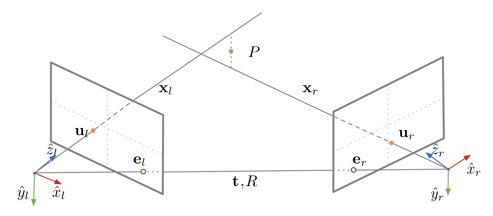

所以需要最小化重投影误差：

$$
cost(\bm{P})=||\bm{u}_l-\widehat{\bm{u}}_l||^2+||\bm{u}_r-\widehat{\bm{u}}_r||^2
$$

    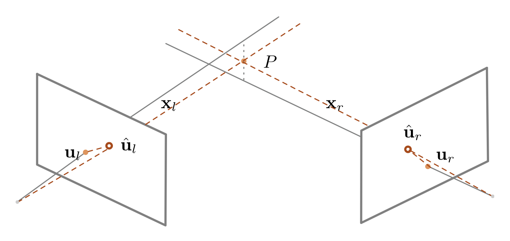

我们是否也能优化 $R, \bm{t}$

### Multi-frame Structure from Motion

    

给定 $m$ 张包含 $n$ 个三维点的图像：

$$
\bm{u}_j^{(i)}=P_{proj}^{(i)}\bm{P}_j \quad (i = 1,...,m \text{ and } j = 1,...,n)
$$

从 $mn$ 个对应的二维点 $\bm{u}_j^{(i)}$ 估计 $m$ 个投影矩阵 $P_{proj}^{(i)}$ 和 $n$ 个三维点 $P_j$。

### Sequential Structure from Motion

1. 初始化相机运动和场景结构

    

        
    

2. 对于每个额外的视角
   - 确定新相机的投影矩阵，使用其图像中所有可见的已知三维点

        

            
        

   - 优化并扩展结构：计算新的三维点，重新优化该相机也能观察到的现有点

        

            
        

3. 优化结构与运动：**光束法平差**(bundle adjustment)

    

        
    

    - 光束法平差：通过最小化所有帧的**重投影误差**来优化三维点和相机参数

        $$
        E(P_{proj},\bm{P})=\sum_{i=1}^m\sum_{j=1}^n||u_j^{(i)}-P_{proj}^{(i)}\bm{P}_j||^2
        $$

        使用 [Levenberg-Marquardt 算法](https://en.wikipedia.org/wiki/Levenberg%E2%80%93Marquardt_algorithm)，例如 Google 的 [Ceres-Solver](https://github.com/ceres-solver/ceres-solver)

### COLMAP

[**COLMAP**](https://colmap.github.io) 是一个通用的**运动恢复结构**（SfM）和**多视图立体**（MVS）管道，具有图形和命令行界面。它为有序和无序图像集合的重建提供了一系列功能。

    

    

增量 SfM 管线：

    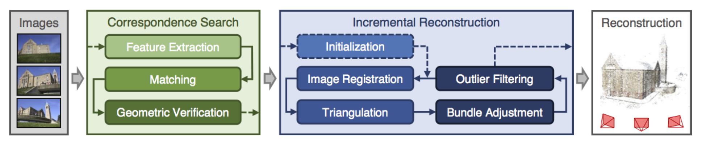

