# Depth Estimation and 3D Reconstruction

??? abstract "核心知识"

    - 深度估计：计算深度图
        - 立体匹配
        - 立体重建步骤：校准相机 -> 矫正图像 -> 计算视差 -> 估计深度
        - 多视图立体（MVS）
            - 块匹配
    
    - 三维重建
        - 深度图（前面算过了）
        - 三维表面：泊松重建 + 行进立方体
        - 纹理映射（不考，因为课上没讲过）

## Depth estimation

### Introduction

深度估计任务的目标是计算**深度图**(depth map)：

    

这一任务很重要，因为对于很多 CV 应用而言，**深度**(depth)是一个关键线索，包括：

    

**深度感知**(depth sensing)分为：

- **主动深度感知**(active depth sensing)：通过向被感知环境主动发起信号来感知深度

    

        
    

    - LiDAR（**激光雷达**/光探测与测距(Light Detection And Ranging)）（例子：Velodyne）
        - 基于**飞行时间**(time of flight, **ToF**)
        - 开销大
        - 能获取极其精确的深度信息
        - 高分辨率
        - 360°视角

        

            
        

    - **结构光**(structured light)（例子：Kinect 1）
    - 主动立体(active stereo)（例子：Intel RealSense）

- **被动深度感知**(passive depth sensing)

    

        
    

### Stereo Matching

#### Stereo Vision

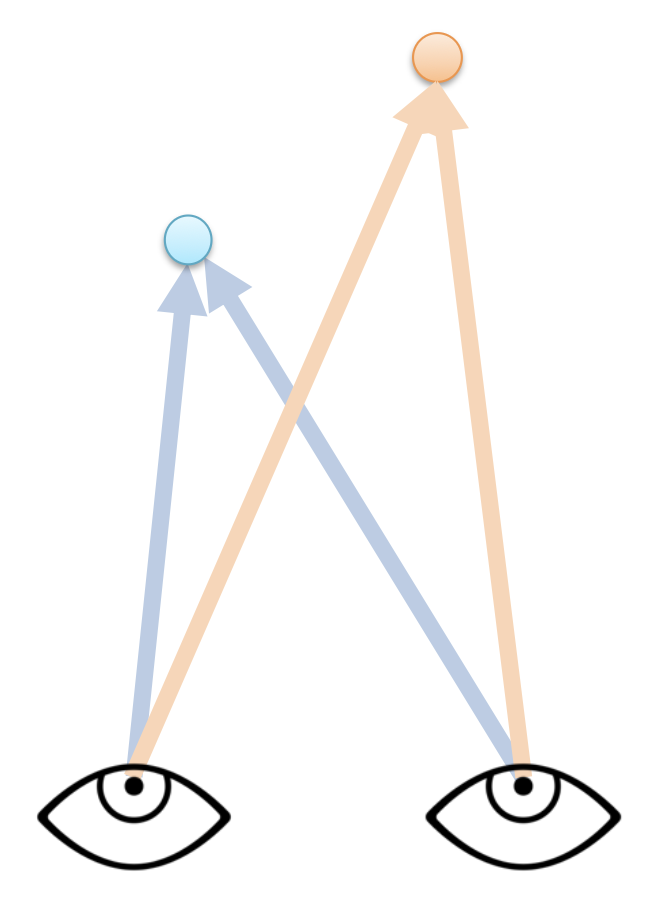{ align=right width=20% }

- 物体上的某个点可被投影到图像上一点
- 该图像点对应于世界中的某条射线
- 两条射线相交于一点；因此若要在三维空间中定位点，就需要两只眼睛

**立体视觉**(stereo vision)的问题是指假设给定相对的相机位姿，计算图像中**每个点**的深度。具体步骤为：

1. 找到 2D-2D 点对点的对应关系（两张图的匹配）
2. 三角化(triangulate)

要想高效匹配所有的像素，我们可以采用**立体匹配**(stereo matching)方法。

??? info "对极几何(epipolar geometry)"

    >这块知识[上节课](7.md#epipolar-geometry)刚介绍过，这里只是简单回顾一下。

    

        
    

    - 基线(baseline)：连接两个相机中心的线（$OO'$）
    - 极点(epipolar point)：像平面和基线的交点（$e, e'$）
    - 极面(epipolar plane)：包含 $(XOO')$ 的平面
    - 极线(epipolar line)：极面和像平面的交线（$l, l'$）

    给定 $X_L$，它在另一个图像 $X_R$ 上的匹配必定落在极线（下图的红线）上。

    

        
    

#### Basic Algorithm

基本的立体匹配算法为：对于第一幅图像的每个像素，

    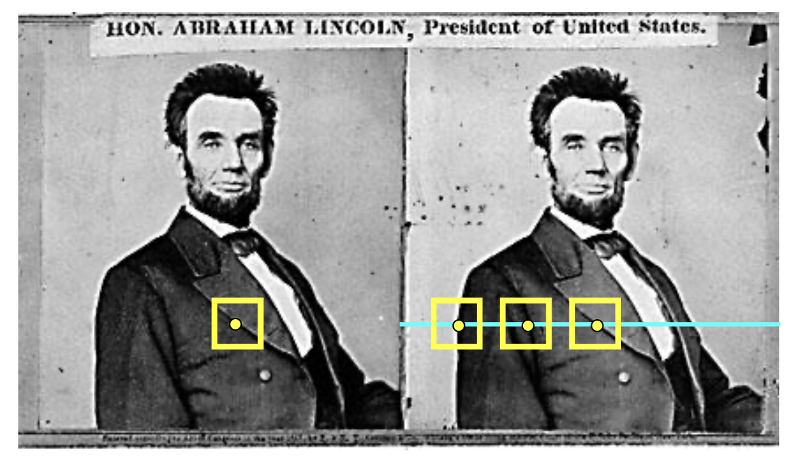

- 寻找在右侧图像上对应的极线
- 沿着极线搜索，找到最佳匹配

{ align=right width=20% }

在最简单的情况下，极线是**水平的扫描线**，此时

- 相机的**像平面相互平行**，并且也和基线平行
- 两台相机中心的**高度相等**
- 焦距相等
- 因而极线落在像之间的水平扫描线上

>注：双目相机一定满足这种情况。

#### Depth from Disparity

对于满足这一简单情况的两张图像，左图中的某个像素 $(x_1, y_1)$ 的**视差**(disparity)为 $x_2 - x_1$。

    

接下来就可以利用视差计算深度了：

    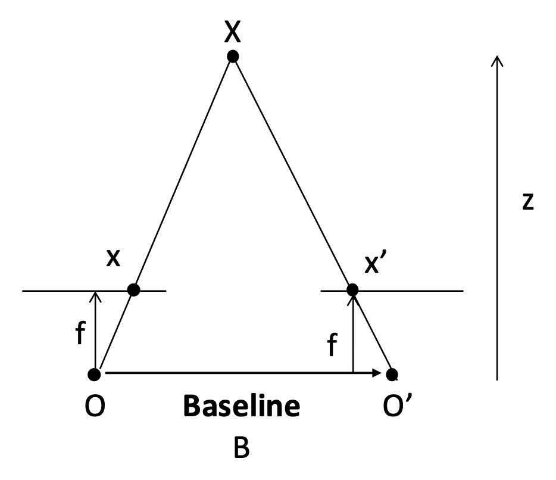

>注：图中标红的线段相加即为视差。

$$
\text{disparity} = x - x' = \dfrac{B \cdot f}{z}
$$

其中 

- $x$ 和 $x'$ 分别是相对于图像中心的图像坐标
- $B$：**基线**(baseline)长度（即两台相机的间距）
- $f$：焦距
- $z$：深度

{ align=right width=25% }

不难发现相机视差与深度成**反比**。

#### Stereo Image Rectification

假如极线不是扫描线，那么需要进行**立体图像矫正**(stereo image rectification)，即将图像平面重新投影到一个与相机中心之间的线平行的公共平面上。这一操作需要**两个[单应变换](6.md#projective-transformation)**（3x3），每个变换对应一个输入图像重投影操作。

 

???+ example "例子"

    

        
    

#### Stereo Matching Algorithms

立体匹配算法的思路是：在共轭(conjugate)极线中匹配像素（假设亮度恒定）。这是一个具有挑战性的问题。目前已提出了数百种方法；这个链接给出了一项相关调查和评估：<http://www.vision.middlebury.edu/stereo/>。

基础的立体匹配算法就是找到能够最小化差异(dissimilarity)的最佳匹配。

    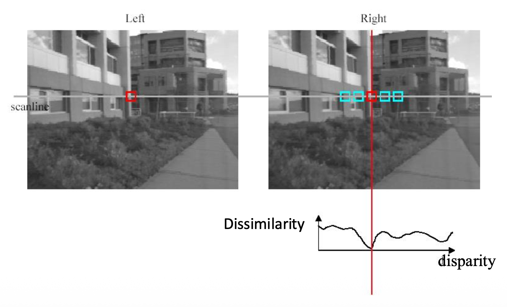

常用的匹配分数有：

- **SSD**（平方差之和(sum of squared differences)）$\sum\limits_{x,y}|W_1(x,y)-W_2(x,y)|^2=$
- **SAD**（绝对差之和(sum of absolute differences)）$\sum\limits_{x, y}|W_1(x,y)-W_2(x,y)|$
- **ZNCC**（零均值归一化互相关(zero-mean normalized cross correlation)）$\dfrac{\sum_{x,y}(W_1(x,y)-\overline{W_1})(W_2(x,y)-\overline{W_2})}{\sigma_{W_1}\sigma_{W_2}}$，其中
    - $\overline{W_i}=\frac{1}{n}\sum_{x,y}W_i\quad\sigma_{W_i}=\sqrt{\frac{1}{n}\sum_{x,y}(W_i-\overline{W_i})^2}$
    - 优点：TBD

#### Window Size

    

窗口搜索的结果：

    

存在更好的方法（基于图割(graph cuts)的方法）：

    

#### Stereo as Energy Minimization

$$
E(d)=E_d(d)+\lambda E_s(d)
$$

- 变量：每个像素的视差 $d$
- $E_d(d)$：**匹配**（希望每个像素能在另一张图像上找到良好匹配）成本，可以用前面介绍的各种匹配分数计算

    $$
    E_d(d)=\sum_{(x,y)\in I}C(x,y,d(x,y))
    $$

- $E_s(d)$：**平滑度**(smoothness)（相邻像素（通常）要移动相同的量）成本

    $$
    E_s(d)=\sum_{(p,q)\in\mathcal{E}}V(d_p,d_q)
    $$

    - $\mathcal{E}$：邻近像素的集合

        

            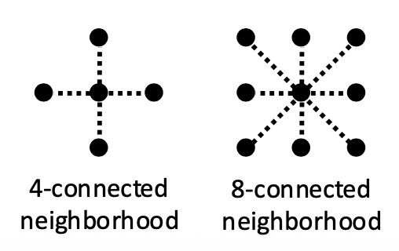
        

    
    { align=right width=20% }

    - $V$ 的选择：
        - L1 距离：$V(d_p,d_q)=|d_p-d_q|$
        - Potts 模型：$V(d_p,d_q)=\begin{cases}0&\mathrm{if~}d_p=d_q\\1&\mathrm{if~}d_p\neq d_q&\end{cases}$

### Stereo Reconstruction Pipeline

完整的立体重建步骤如下：

1. **校准相机**：选择立体基线
    - 太小会导致较大的深度误差
    - 太大则让搜索问题变得困难

    

        
    

2. **矫正图像**
3. **计算视差**
4. **估计深度**

误差的来源包括：

- 相机校准误差
- 图像分辨率低
- 遮挡
- 亮度不恒定（镜面反射）
- 无纹理区域

#### Active Stereo with Structured Light

将**结构红外光模式**("structured" infared light pattern)投射到物体上

- 简化了图像点的对应问题
- 是一些设备上（如 Kinect 和 iPhone X（使用红外(IR)））的主动深度传感器(active depth sensors)的基础

???+ example "例子"

    

        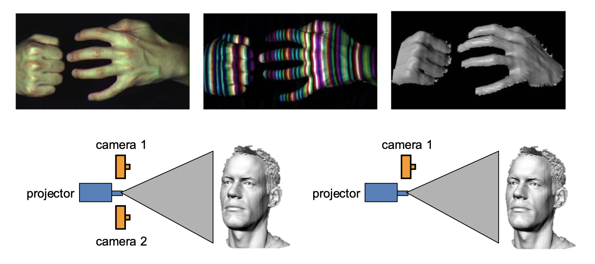
    

    

        
    

### Multi-View Stereo

之前我们只基于两张图像实现立体匹配，但实际上可以参考多个视图下的图像，即**多视图立体**(multi-view stereo, **MVS**)。它的优势在于：

- 可以使用多个邻居来匹配窗口，提供**更强的约束**
- 如果有很多潜在邻居，可以**选择**每个参考图像的**最佳邻居子集**进行匹配
- 可以为每个参考帧重建深度图，并合并成一个**完整的 3D 模型**

基本思路如下：

- 正确的深度能给出一致的投影

    

        
    

- 错误的深度给出不一致的投影

    

        
    

- 计算参考图像中每个点的每个深度值的误差，寻找能给出最小误差的深度值

    

        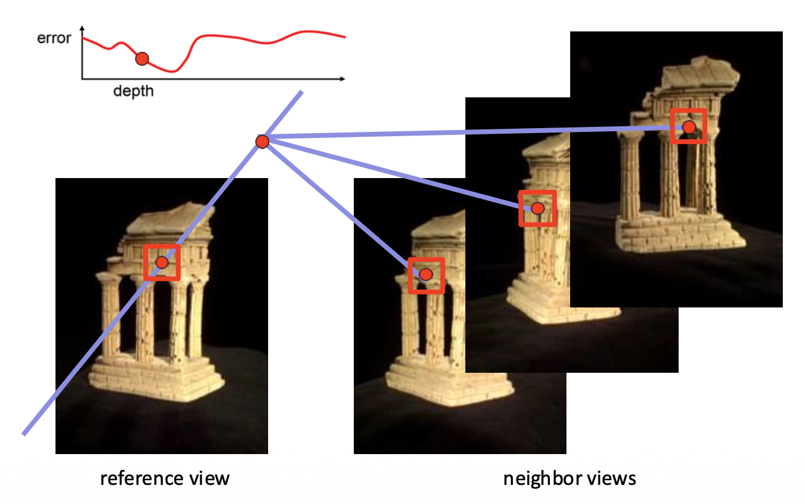
    

???+ example "例子"

    

        
    

#### PatchMatch

{ align=right width=20% }

**块匹配**(PatchMatch)一个用于**解决对应问题**的有效算法。假设：

- 大量随机采样将产生一些好的猜测
- 邻居具有相似的偏移(offset)

步骤：

    

1. **随机初始化**(random intialization)：每个像素都被赋予一个随机的块偏移量，作为初始化
2. **传播**(propagation)：每个像素检查采用邻近块的偏移量后是否能得到更好的匹配块（损失更小），若是则采用该偏移量
3. **局部搜索**(local search)：
    - 每个像素在当前偏移量周围的同心半径内搜索更好的块偏移量
    - 搜索半径从图像大小开始，每次减半，直到达到 1
4. 回到步骤2，直至收敛

在 MVS 中，将上述算法中的块偏移量替换为**深度值**。

## 3D Reconstruction

**三维重建**(3D reconstruction)的步骤（管线(pipeline)）：

1. 为每张图像计算**深度图**
2. 将深度图融合成**三维表面**
3. **纹理映射**

### 3D Representation

常见的三维结构表示方式有：

    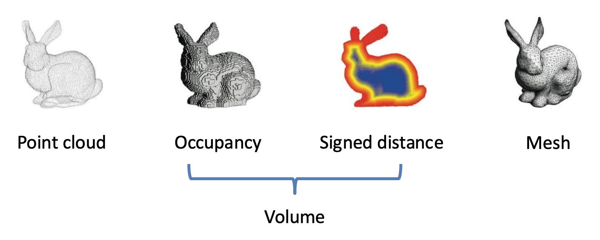

- **点云**(point cloud)：一组三维点

    

        
    

- **体**(volume)
    - **占用体**(occupancy volume)：由**体素**(voxel)构成的三维体

        $$
        V_{ijk} = \begin{cases}1 & \text{if occupied} \\ 0 & \text{if empty}\end{cases}
        $$

        

            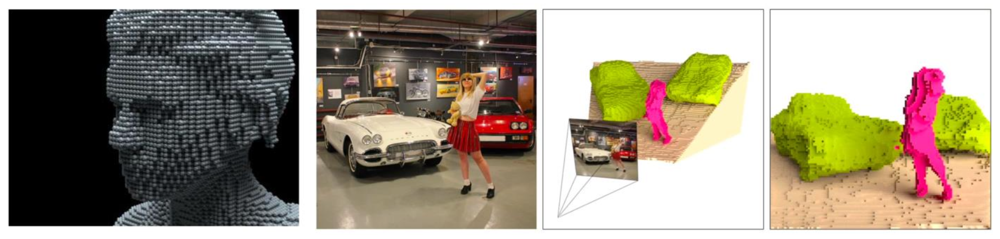
        

    - **SDF 体**
        - **符号距离函数**(signed distance function, **SDF**)：点到**形状边界**的距离（通常用欧几里得距离度量）
        - **截断符号距离函数**(truncated signed distance function, **TSDF**)：将 SDF 值限制在 [-1, 1]

        

            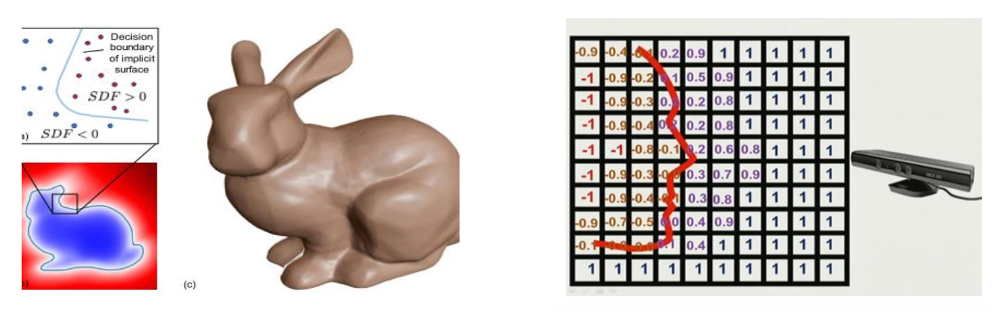
        

- **网格**(mesh)：由顶点和边组成的多边形网格，网格形状通常是**三角形**

    

        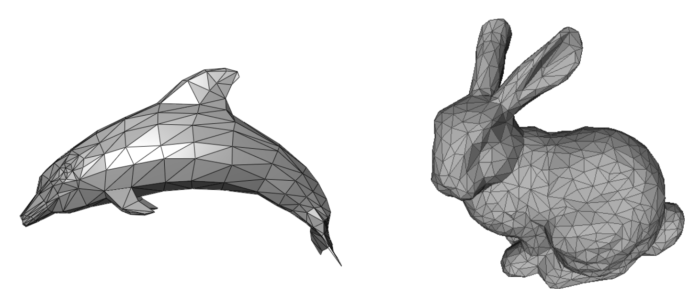
    

### 3D Surface Reconstruction

将深度图融合成完整的三维网格的步骤：

1. 深度图 -> 占用体：**泊松重建**(Poisson reconstruction)
2. 占用体 -> 网格：**行进立方体**(marching cube)

之所以加入构建占用体这一中间步骤，是因为这样做**转换网格更容易**，并且占用体更适合**去噪**。

#### Poisson Reconstruction

泊松重建的步骤：

1. 将深度图转换为点云

    

        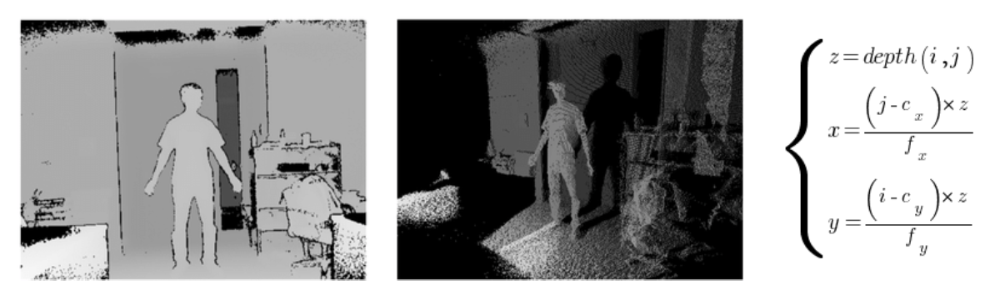
    

2. 计算每个点的法向量

    

        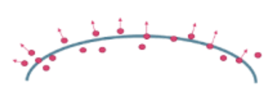
    

3. 通过**指示（占用）函数**(indicator(occupancy) function) $\chi_M$ 表示表面

    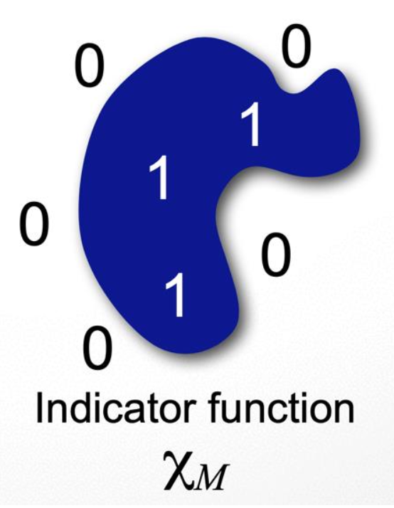{ align=right width=15% }

    $$
    \chi_M(p)=\begin{cases}1&\mathrm{if~}p\in M\\0&\mathrm{if~}p\notin M&\end{cases}
    $$

构建指示函数的关键在于梯度关系：

- 点的**法线**与指示函数的**梯度**之间存在关系
- 用**向量场**(vector field) $\overrightarrow{V}$ 表示有向点
- 通过对以下式子最小化，来寻找梯度最佳**近似** $\overrightarrow{V}$ 的函数 $\chi$：

    $$
    \min\limits_{\chi} \|\nabla \chi - \overrightarrow{V}\|
    $$

- 用[泊松方程](https://en.wikipedia.org/wiki/Poisson%27s_equation?useskin=vector)求解

#### Marching Cubes

在了解行进立方体之前，为便于理解，先来看二维的**行进正方形**(marching squares)。对于每个有**符号变化**的网格单元：

- 在每个网格边缘上创建一个具有符号变化的顶点
- 通过线条连接顶点
    - 这些线**不应该相交**
    - 使用预先计算好的**查找表**(look-up table)
- 顶点的位置可以通过 **SDF**（符号距离函数）值的**线性插值**来确定

    
    

>注：图中白色顶点表示在表面内（1），黑色顶点表示在表面外（0）。

回到三维的情况——对于每个有符号变化的网格单元：

- 在每个网格边缘创建一个具有符号变化的顶点
- 通过**三角形**连接顶点
    - 三角形**不应该相交**
    - 显然比二维情况复杂得多

    

        
        
    

**查找表**：

- 2^8^ = 256 种符号配置；对于每个符号配置，它存储了构成三角形的顶点所对应的网格边的索引
- 考虑到对称的话，实际上只需考虑以下 **15 种配置**

    
    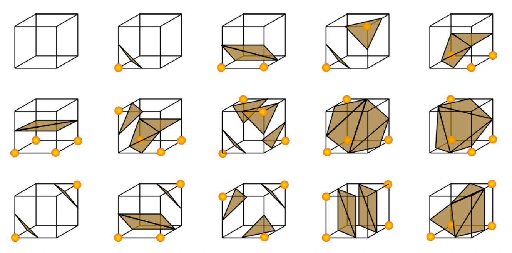

???+ example "示例：表面提取结果"

    

        
    

### Texture Mapping

见 CG 笔记「[Texture Mapping](../../software/cg/5.md#texture-mapping)」一节。