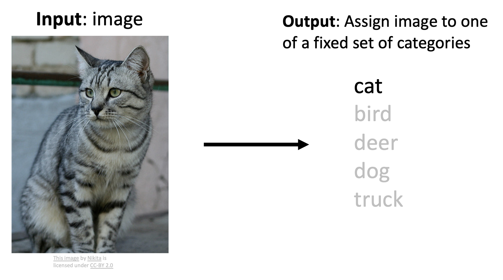

# Image Classfication with Linear Classifiers

**图像分类**(image classification)是 CV 领域的一项核心任务，它要做的是：对于给定的一张图像，从已有的一组标签(label)中为该图像匹配一个最合适的标签。

<div style="text-align: center">
    
</div>

!!! warning "图像分类的挑战"

    === "语义鸿沟(semantic gap)"

        对计算机而言，它“眼中”的图像只是一串数字。更准确地说，图像是一个由范围在 [0, 255] 内的整数构成的**张量**(tensor)，也就是包括宽、高和通道(channel)的三维数组。比如这张猫的图像就是一个 800x600x3 的张量（三通道的 RGB）。

        <div style="text-align: center">
            
        </div>

    === "视角差异(viewpoint variation)"

        从不同的视角看同一个物体，对应的图像像素值会随相机位置（观察视角）的改变而全部改变。

        <div style="text-align: center">
            
        </div>

    === "光照(illumination)"

        对同一类物体，光照也会有不小的影响。

        <div style="text-align: center">
            
        </div>

    === "背景杂乱(background clutter)"

        目标物体可能与周围环境混在一起，难以识别。

        <div style="text-align: center">
            
        </div>

    === "遮挡(occlusion)"

        直接遮挡物体本身也是一种不小的干扰。

        <div style="text-align: center">
            
        </div>

    === "变形(deformation)"

        因为各种原因导致物体的变形也会对机器的判断产生影响。

        <div style="text-align: center">
            
        </div>

    === "类内差异(infraclass variation)"

        即便是同一类的物体，物体之间也可能存在不小的差异。

        <div style="text-align: center">
            
        </div>

    === "上下文(context)"

        如下图所示，机器误把栏杆附近的狗看作是老虎了，因为光照下来栏杆的条状阴影正好落在黄色的狗身上，远看起来就像老虎的斑纹一样。因此对物体的判别还要考虑特定的上下文环境。    

        <div style="text-align: center">
            
        </div>

???+ info "图像分类的应用"

    === "例1"

        <div style="text-align: center">
            
        </div>

    === "例2：作为其他任务的构建块"

        - 物体检测(object detection)

            <div style="text-align: center">
                
            </div>

        - 图像描述(image captioning)

            <div style="text-align: center">
                
            </div>

        - 下围棋

            <div style="text-align: center">
                
            </div>

从 ImageNet 数据集为分水岭，已经涌现了诸多现代意义上的计算机视觉算法。

<div style="text-align: center">
    
</div>

??? info "知名的图像分类数据集"

    === "MNIST"

        <div style="text-align: center">
            
        </div>

    === "CIFAR-10"

        <div style="text-align: center">
            
        </div>

    === "CIFAR-100"

        <div style="text-align: center">
            
        </div>

    === "ImageNet" 

        <div style="text-align: center">
            
        </div>

        - 测试标签保密！
        - 图像大小可以有所不同，但在训练时都会被调整为 256x256 的大小
        - ImageNet 还有一个 22k 个分类的版本，但用的相对少一些

    === "MIT Places"

        <div style="text-align: center">
            
        </div>

    === "Omniglot"

        <div style="text-align: center">
            
        </div>

    ---
    下图展示了分类数据集规模的演变：

    <div style="text-align: center">
        
    </div>

假如读者还没学过深度学习相关的任何知识，如果仅凭前面的介绍，也许在你的眼里，**图像分类器**(image classifier)可能就是这样的一个“黑箱”：

```py
def classify_image(image):
    # Some magic here?
    return class_label;
```

遗憾的是，虽然外观看上去如此简单，但实际上图像分类算法可完全不像对数字排序那样，能够用硬编码(hard-code)式的算法直白地表示出来。

???+ failure "先辈的努力"

    <div style="text-align: center">
        
    </div>

    上古时期的人们曾尝试通过边缘检测的方式来识别图像，最终以失败告终——毕竟图像太复杂了，我们很难对某一标签下的图像找出其共同的边缘特征，而且也会存在不同类的图像但边缘相似度很高的情况，所以这种方法不太现实。

现在我们讲到的图像分类器都是基于**机器学习**(machine learning)，即一种**数据驱动下的方法**(data-driven approach)（向机器提供每个类别的许多示例，然后开发学习算法让机器观察这些示例并学习每个类别的视觉外观）。搭建一个图像分类器的大致步骤如下：

1. **输入**：由 N 张图像组成，每张图像都标记为 K 个不同类别中的一个，我们将这些数据称为**训练集**(training set)

    <div style="text-align: center">
        
    </div>

2. **学习**(learning)/**训练**(training)：使用机器学习算法来训练一个分类器

    ```py
    def train(images, labels):
        # Machine learning!
        return model
    ```

3. **评估**(evaluation)：通过让分类器预测一组它从未见过的新图像的标签来评估分类器的质量，然后将比较这些图像的真实标签与分类器预测的标签，我们希望有尽可能多的预测结果与真实答案（我们称之为真实标签）相匹配

    ```py
    def predict(model, test_images):
        # Use model to predict labels
        return test_label;
    ```

下面就来具体介绍几个经典的图像分类器。


## K-Nearest Neighbor Classifier

>注：虽然这玩意儿实际用的很少，但它有助于我们理解图像分类的基础方法。

第一个要介绍的分类器是**最近邻居**(nearest neighbor)分类器。它的大致思路是：

- 训练阶段：记住所有的数据和标签
- 预测阶段：预测出（和测试图像）最像的训练用图像的标签

<div style="text-align: center">
    
</div>

我们需要一种手段来定义与衡量这个“最像”的程度（或者说**距离**(distance)），从而能够让机器算出来。最简单的计算方法是采用 **L1 距离**，计算公式为：
$$
d_1(I_1,I_2)=\sum_p|I_1^p-I_2^p|
$$

用人话来讲就是：计算测试图像和训练图像每个像素的绝对值之差，然后再做个累加，累加的结果就是 L1 距离。下面给出一个例子：

<div style="text-align: center">
    
</div>

最近邻居分类器的代码如下：

```py hl_lines="6-10 18-24"
import numpy as np
class NearestNeighbor:
    def __init__(self):
        pass

    def train(self, X, y) :    # (1)
        """ X is N x D where each row is an example. Y is 1-dimension of size N """
        # the nearest neighbor classifier simply remembers all the training data
        self.Xtr = X
        self.ytr = y

    def predict(self, X):
        """ X is N x D where each row is an example we wish to predict label for """
        num_test = X. shape[0]
        # lets make sure that the output type matches the input type
        Ypred = np.zeros(num_test, dtype = self.ytr.dtype)

        # loop over all test rows
        for i in xrange(num_test):    # (2)
            # find the nearest training image to the i'th test image
            # using the Ll distance (sum of absolute value differences)
            distances = np.sum(np.abs(self.Xtr - X[i,:]), axis = 1)
            min index = np.argmin(distances) # get the index with smallest distance
            Ypred[i] = self.ytr[min_index] # predict the label of the nearest example

        return Ypred
```

1.  记住所有的训练数据
2.  对于每个测试图像，找到“最近”的训练图像，将对应的标签作为预测标签

假如有 N 个样例，训练和预测的速度分别是：

- 训练：$O(1)$
- 预测：$O(N)$

这很不好——因为预测速度有些慢；虽然训练速度快，但没必要。我们更希望预测的速度能快一些，毕竟预测才是面向用户的功能。

>注：还有很多用于加速或近似采用最近邻居的方法，不过这些内容超出课程范围，若感兴趣读者可自行搜索。
>一个不错的实现：<https://github.com/facebookresearch/faiss>

下图是关于最近邻居算法的**决策边界**(decision boundary)图：

<div style="text-align: center">
    
</div>

其中：

- 每个点代表一张图像，而点的颜色表示相应的类别
- 而背景颜色表示测试点在该位置上会被分类器赋予的类别
- 决策边界就是两个分类区域的边界

可以看到这张图上存在一个问题：观察黑圈标出的地方，它们是决策边界中比较嘈杂的地方，因为它们受到异常点(outlier)的影响（比如周围都是绿色点的地方中间出现了个黄色的点）。那么该如何使边界更平滑呢？可以考虑将多个邻居作为判断依据

令 K 为最近点（图像）的数量（此时这个算法就叫做 **K 最近邻居**，简称 **KNN**），我们可以通过增大 K（即考虑多个邻居点）来解决上述问题，让分类器给出更稳定的结果。可以看到，随着 K 增大，

- 决策边界变得更平滑

    <div style="text-align: center">
        
    </div>

- 异常点的影响更小了

    <div style="text-align: center">
        
    </div>

但白色区域变多了，而这些区域表示通过多个邻居投票反而无法归类的地方，所以 K 也不能一直大下去。

<div style="text-align: center">
    
</div>

---
在 K-最近邻居算法中，除了 L1 距离这样的度量外，另一种（可能更常用的）度量是 **L2 距离**。其实读者可能早在中学时就已经知道了 L1 距离和 L2 距离的定义——它们分别对应**曼哈顿距离**(Manhattan distance)和**欧几里得距离**(Euclidean distance)。

- L1 距离：沿格子（坐标轴）移动的距离之和
    - 依赖于坐标轴的选定

- L2 距离：直线距离

    $$
    d_2(I_1, I_2) = \sqrt{\sum\limits_p (I_1^p - I_2^p)^2}
    $$

    - 不随坐标轴变化（旋转不变性）
    - 相比两个点在多个维度上有较小的差异，在一个维度上有较大差异可能会让 L2 距离变得更大些

<div style="text-align: center">
    
</div>

>左图对应 L1 距离，右图对应 L2 距离

比对两种距离度量的结果，发现两者的效果差距并不大。

<div style="text-align: center">
    
</div>

实际上 L1 和 L2 距离也确实没有明显的优劣之分，所以可根据具体情况选择更合适的度量。可参考的标准如下：

- L1 距离：对图像上的某个特征更在意，将这些特征作为 L1 距离的“坐标轴”
- L2 距离：当没有特殊原因或任何对图像的先验知识时，可优先采用 L2 距离

当选择了正确的距离度量后，我们可以将 KNN 应用到任何类型的数据上，比如使用 tf-idf 相似度比较论文之间的相似程度。

<div style="text-align: center">
    
</div>

??? info "可动手尝试的 demo"

    链接：<http://vision.stanford.edu/teaching/cs231n-demos/knn/>

    可以手动调整 K，距离度量等参数，来观察分类结果的变化。

    <div style="text-align: center">
        
    </div>


## Hyperparameters

通过上面的学习，我们知道没有对任何情况都最好的 K，也没有这样的距离度量。一般称这样的参数为**超参数**(hyperparameters)，它们的选择和具体问题或数据集强依赖，所以我们只能一个个去试，找出表现最好的那组超参数。

设置超参数的几种思路：

- 选择在训练数据上表现最好的超参数

    <div style="text-align: center">
        
    </div>

    - 反例：K = 1 时在训练数据上的表现始终是最好的，但在测试数据上就不好说了

- 选择在测试数据上表现最好的超参数

    <div style="text-align: center">
        
    </div>

    - 要是我换一批新的测试数据，阁下又当如何应对呢？
    - 从另一个角度看，这么做就相当于把这个测试集当做另一个训练集看待
    - 所以千万不要这么做！所以在设计机器学习算法时，你应该将测试集视为一种非常宝贵的资源，理想情况下直到最后一次才让其和测试集接触

- 将已知数据划分为训练集和验证集，选择在验证集上表现最好的超参数，用于在测试集上评估

    <div style="text-align: center">
        
    </div>

    - 看起来就很科学，比前两个馊主意肯定更好——实际上也确实如此

- 更严谨的方法——**交叉验证**(cross validation)
    - 思路：将数据分成若干份(folds)，每次取其中一份作为验证集，其余作为训练集，轮流进行并平均结果

    <div style="text-align: center">
        
    </div>

    - 对小数据集而言很有用，但在深度学习中用的不是很多，因为计算成本可能会很高
    - 人们通常使用的划分比例是 50%-90% 的训练数据用于训练，其余用于验证；常见的份数为 3 份、5 份或 10 份

???+ example "例子：CIFAR-10 数据集"

    <div style="text-align: center">
        
    </div>

假设我们采用 5 份的交叉验证，来看不同超参数 K 对 K 最近邻居分类器准确度的影响：

<div style="text-align: center">
    
</div>

其中每个点表示单个的结果，折线穿过各个 K 下准确率的均值，而竖着的直线表示同一个 K 下准确率的标准差。可以看到对于这批数据而言，大概在 K=7 左右分类器的效果是最好的。

!!! note "通用逼近(universal approximation)"

    当训练样例数量趋近于无穷大时，最近邻居可表示为**任意**函数！

    === "5 个训练点"

        <div style="text-align: center">
            
        </div>

    === "10 个训练点"

        <div style="text-align: center">
            
        </div>

    === "20 个训练点"

        <div style="text-align: center">
            
        </div>

    === "100 个训练点"

        <div style="text-align: center">
            
        </div>

???+ bug "KNN 分类器的缺陷"

    === "维度诅咒(curse of dimensionality)"

        为了均匀覆盖空间，所需的训练点数量随维度的增加呈指数级增长。

        <div style="text-align: center">
            
        </div>

        <div style="text-align: center">
            
        </div>

    === "像素级的 KNN"

        <div style="text-align: center">
            
        </div>

        如图所示，左侧一列表示各个类别（的代表图像），右侧的图像表示分类器得到的结果。我们只看右侧的第一列，发现红框标出的是分类错误的图像，而绿框标出的是正确分类的图像，所以这种分类器的准确率并不高。

        尤其是采用像素级距离作为度量的情况下，KNN 表现更糟糕。如下图所示，右边三张图与左边这张图的像素距离都是一样的，但它们对应的是三种不同的变化（遮挡、移动和染色）。由此可见，像素距离包含的信息量很少，所以我们从来不会在实际中这么用。

        <div style="text-align: center">
            
        </div>
    
    === "其他"

        - 分类器必须记住所有训练数据并将其存储起来，以便将来与测试数据进行比较，显然这样做空间效率很低
        - 对测试图像进行分类成本较高，因为需要与所有训练图像进行比较

??? info "KNN + ConvNet"

    >~~这就是我们热血沸腾的组合技口牙！~~

    使用带卷积神经网络特征的最近邻居算法表现很好。

    <div style="text-align: center">
        
    </div>

    <div style="text-align: center">
        
    </div>

???+ abstract "总结"

    - 图像分类始于由图像和标签构成的训练集，并且必须在测试集上预测标签
    - KNN 分类器基于 K 个最近的训练样例来预测标签
    - 距离度量和 K 都是超参数
    - 利用验证集来选择合适的超参数
    - 仅在最后对测试集运行一次！
  
??? note "kNN 的实际应用"

    如果要在实践中运用 kNN，请按照以下步骤进行：

    1. 预处理数据：将数据中的特征（例如图像中的像素）归一化，使其具有零均值和单位方差。前面没提到这件事，是因为图像中的像素通常是同构的，并且分布差异不大，从而减轻了数据归一化的需求。
    2. 如果数据维度非常高，可以考虑使用降维技术，如 [PCA](https://en.wikipedia.org/wiki/Principal_component_analysis)、[NCA](https://en.wikipedia.org/wiki/Neighbourhood_components_analysis)，甚至[随机投影](https://scikit-learn.org/stable/modules/random_projection.html)。
    3. 将训练数据随机分成训练集/验证集。一般来说，70-90% 的数据通常用于训练集。这个设置取决于有多少超参数，以及预期它们会产生多大影响。如果有很多超参数需要估计，应该倾向于设置更大的验证集来有效地估计它们。如果担心验证数据的大小，最好将训练数据分成多份并进行交叉验证。如果有足够的计算预算，使用交叉验证总是更安全（份数越多越好，但成本也越高）。
    4. 在验证数据（如果执行交叉验证，则针对所有折）上使用多种 k 值（例如，越多越好）和不同的距离类型（L1 和 L2 是很好的候选者）来训练和评估 kNN 分类器。
    5. 如果你的 kNN 分类器运行时间过长，可以考虑使用近似最近邻库(library)（例如 [FLANN](https://github.com/flann-lib/flann)）来加速检索（以牺牲一些精度为代价）。
    6. 注意那些给出最佳结果的超参数。有一个问题是：是否应该使用最佳超参数与完整训练集，因为如果将验证数据放到训练集中（因为数据量会更大），最优超参数可能会改变。在实践中，最后在分类器中我们不使用验证数据，认为它在估计超参数时已被用掉。随后在测试集上评估最佳模型。报告测试集准确率，并宣布在你所选的数据上 kNN 分类器性能的结果。


## Linear Classifier

**线性分类器**(linear classifier)是一种参数化的方法(parametric approach)，具体来说是以图像 $x$ 以及一组参数（或权重）$W$ 作为函数 $f$ 的输入，输出 $f(x, W)$，表示为所有类别打的分数，最后取最高分为图像 $x$ 所属类别。在线性分类器中，这个函数的形式为：
$$
f(x, W) = Wx + b
$$

- 假设图像规模为 32x32x3，那么它将被展平(flatten)为个 32x32x3 = 3072 维的向量
- 另外规定只有 10 个类别，那么输出的就是一个 10 维向量，每一维对应每一个类别的分数
- 权重部分是一个矩阵，规模为 10x3072
- 最后的 b 是一个偏移量（向量），规模同输出

<div style="text-align: center">
    
</div>

!!! note "注"

    - 这个矩阵乘法实际上是在并行评估 10 个不同的分类器（每个类别一个），其中每个分类器是 $W$ 的一行。
    - 我们认为输入数据 $(x_i, y_i)$ 是给定且固定的，但我们能控制参数 $W, b$ 的设置。目标就是设置这些参数，使得计算出的分数在整个训练集中与真实标签相匹配。之后会详细地探讨如何做到这一点，但直观上我们希望正确类别的分数高于错误类别的分数。
    - 这种方法的优点是，训练数据用于学习参数 $W, b$，但一旦学习完成，我们可以丢弃整个训练集，只保留学习到的参数。这是因为新的测试图像可以简单地通过函数传递，并根据计算出的分数进行分类。
    - 而且对测试图像进行分类仅涉及一次矩阵乘法和加法，这比将测试图像与所有训练图像进行比较要快得多。

线性分类器是神经网络架构中常用的（可能也是最简单的）一个组件。类比搭积木，整个神经网络是由众多积木块构建而成的作品，而线性分类器就是其中某一个（或某一些）积木块。

<div style="text-align: center">
    
    
</div>

接下来仍然以我们的老朋友 CIFAR-10 数据集为例。

<div style="text-align: center">
    
</div>

为方便讨论，我们对图像做一步简化——假定图像是一个 2x2x1 的张量（仅有 4 个像素）。在分类前先将张量展平为一个向量。

<div style="text-align: center">
    
</div>

下面将从多个视角来看线性分类器的原理：

- 代数视角：就是一个矩阵和向量间的乘法与加法运算

    <div style="text-align: center">
        
    </div>

    - 我们可以将偏差向量看成是权重矩阵的最后一列，然后在输入向量后再增加一维，其值设为 1，从而简化计算

        <div style="text-align: center">
            
        </div>

    - 线性分类器的预测是“线性的”

        <div style="text-align: center">
            
        </div>

- 视觉视角：
    - 将一个完整的分类器（大矩阵）看成几个单独为某一类分类的分类器（小矩阵），它们的规模和图像一致，且只会计算各自负责的类的分数
    - 这些小的分类器可看作是一张张图像（或者说**模板**）（图片底部的一排很模糊的图像），线性分类器要做的就是将图像匹配到与其最接近的模板（通过内积计算）

        <div style="text-align: center">
            
        </div>

        - 一个模板需要匹配多个特征，因此“马”的模板中有朝左和朝右两个马头

- 几何视角：
    - 将线性分类器的公式 $f(x, W) = Wx + b$ 看作是高维空间中的一条直线，而图像就是这个高维空间上的点
    - 于是问题被转化为一个类似线性规划的问题——每一个类别就是用不同高维空间直线约束的一块区域

        <div style="text-align: center">
            
        </div>

    - 这个高维空间又称为**超平面**(hyperplane)

        <div style="text-align: center">
            
        </div>

    - 既然是“线性”，自然有许多非线性的情况困扰着线性分类器，比如下面这些情况很难用线性分类器做分类：

        <div style="text-align: center">
            
        </div>

!!! note "图像数据预处理(preprocessing)"

    前面我们直接用图像的原始像素值（范围在 [0, 255] 内）进行计算。但在实际的机器学习中，对输入特征进行**归一化**(normalization)是一种非常常见的做法（对于图像，每个像素被视为一个特征）。特别是，通过从每个特征中减去均值来对数据进行中心化非常重要。对图像来说，这对应于计算训练图像的均值图像，并从每个图像中减去它，以获得像素值范围大约在 [-127, 127] 的图像。
    
    进一步常见的预处理是对每个输入特征进行缩放，使其值范围在[-1, 1]。在这些方法中，零均值中心化可能更为重要，但要等到学习梯度下降后才能对其合理性进行解释。


### Loss Function

{ align=right width=30% }

构建一个线性分类器的关键在于选择一个好一点的 $W$。一般我们会用这样的方法来寻找：

- 定义一个**损失函数**(loss function)，用于量化我们对训练集上预测结果的不满程度
    - 损失越低，分类器越好
    - 损失函数又称为**目标函数**(objective function)或**成本函数**(cost function)
    - 而负的损失函数又称为**奖励函数**(reward function)/**利润函数**(profit function)/**效用函数**(utility function)/**适应度函数**(fitness function)等
- 想出一种能够高效寻找最小化损失函数值的参数（**优化**(optimization)）

先来看损失函数的定义。对于给定的一个数据集 $\{(x_i, y_i)\}_{i=1}^N$，其中 $x_i$ 表示图像，$y_i$ 表示对应的标签（整数）。整个数据集的损失就是每个样例的损失的平均值，即：
$$
L = \dfrac{1}{N} \sum\limits_i L_i(f(x_i, W), y_i)
$$


### Softmax Classifier

第一种常用的线性分类器是 **Softmax 分类器**（又称**多项逻辑回归**(multinomial logistic regression)），它的大致思想是将分类器给出的分数解释为**概率**。令 $s = f(x_i; W)$ 表示原来分类器为图像 $x_i$ 打的分数，那么图像 $x_i$ 被归类为标签 $k$（注意标签被映射为整数）的概率是：
$$
P(Y = k|X = x_i) = \dfrac{e^{s_k}}{\sum\limits_j e^{s_j}}
$$

上述函数就是 **Softmax 函数**。它实现了将原本未归一化的(unnormalized)分数（或者说对数概率(log-probability)/逻辑值(logit)）转化为**归一化的**(normalized)概率。之所以叫“归一化”，是因为对于一张图像，它对所有类别的概率之和为1。

<div style="text-align: center">
    
</div>

损失函数就是 Softmax 函数经过对数运算后的相反数，即 $L_i = - \log P(Y = y_i | X = x_i)$（这实际上在计算**交叉熵**(cross-entropy)）。之后的优化过程就是一个**最大似然估计**(maximum likelihood estimation)，即选择能够使观测数据（在线性分类器中就是图像应该对应的类别）出现概率最大化的一组权重。

除了可以用交叉熵计算损失，另一种等价的计算手段是 **KL 散度**(Kullback–Leibler divergence)，计算公式如下：
$$
D_{KL}(P \| Q) = \sum\limits_y P(y) \log \dfrac{P(y)}{Q(y)}
$$

其中 $P(y)$ 是分类器预测出来的概率分布，而 $Q(y)$ 是真实的概率分布（一种**独热编码**(one-hot encoding)的形式：只有一个维度是1，其余维度都是0）。而交叉熵又可以写为：
$$
H(P, Q) = H(p) + D_{KL}(P \| Q)
$$

???+ question "思考"

    === "问题1"

        === "题目"

            最小/最大的可能的 Softmax 损失 $L_i$ 是什么？

        === "解答"

            - 当 $P(Y = y_i | X = x_i) = 1$，即分类器能百分百肯定 $x_i$ 属于正确类别 $y_i$ 时，最小损失 $L_i = 0$
            - 反之，若 $P(Y = y_i | X = x_i) = 0$，即分类器从不认为 $x_i$ 属于正确类别 $y_i$ 时，最小损失 $L_i \rightarrow +\infty$

    === "问题2"

        === "题目"

            在初始化阶段，所有的 $s_j$ 都近似相等。假设有 $C$ 个类别，此时的 Softmax 损失 $L_i$ 是什么？

        === "解答"

            $$
            L_i = -\log(\dfrac{1}{C}) = \log(C)
            $$

            假如 $C = 10$，那么 $L_i = \log (10) \approx 2.3$


### Multiclass SVM Loss

另一种计算损失的方式是**多类 SVM 损失**(multiclass SVM loss)（SVM 是**支持向量机**(support vector machine)的意思）（又称为**铰链损失**(hinge loss)）。对此类损失函数的通俗理解是：SVM “希望”每个图像的正确类别的得分比错误类别高出一定的固定间隔 $\Delta$。后面为方便讨论，我们就假定 $\Delta = 1$（实际应用中通常也是这样做的）。

<div style="text-align: center">
    
</div>

令 $(x_i, y_i)$ 为一组表示（图像，标签）样例，对应的分数为 $s = f(x_i, W)$，那么 SVM 损失的形式如下：

$$
\begin{aligned}L_{i}&=\sum_{j\neq y_i}\begin{cases}0&\mathrm{if}s_{y_i}\geq s_j+1\\s_j-s_{y_i}+1&\mathrm{otherwise}&\end{cases}\\&=\sum_{j\neq y_i}\max(0,s_j-s_{y_i}+1)\end{aligned}
$$

{ align=right width=30% }

我们可以这样理解这个函数：令 $s_{y_i} - s_j$（正确类别和不正确类别之间的分差）为横坐标，损失值为纵坐标。根据上述函数可以得到这样的一条折线（累加中的某一项），如右图所示。当分差在 [0, 1] 之间时，损失值会随 $s_{y_i}$ 与 $s_j$ 分差的拉大而减小；当分差 >= 1 时，损失就降至0了。

同样地，将每张图像的损失求平均就是整个数据集的损失，即 $L = \dfrac{1}{N} \sum_{i=1}^N L_i$。

???+ example "例子"

    <div style="text-align: center">
        
    </div>

???+ question "思考"

    === "问题1"

        === "题目"

            如果“汽车”这个类别的分数降低了 0.5，对于上述例子，损失会有什么变化？

        === "解答"

            损失仍然是 0，因为原本汽车的分数是 4.9，其他两个类别分别是 1.3 和 2.0。所以降低 0.5 分后分差仍然大于 1，那么损失仍然是 0。

    === "问题2"

        === "题目"

            最小/最大的可能的 SVM 损失 $L_i$ 是多少？

        === "解答"

            - 最小：0，这是显而易见的，只要正确类别的分数比其他类别均大于 1 就行了
            - 最大：理论上可以无穷大，要求其他类别的分数比正确类别的分数大很多

    === "问题3"

        === "题目"

            在初始化阶段，$W$ 很小（$\approx 0$）。假设有 $N$ 个样例和 $C$ 个类别，损失 $L_i$ 是多少？

        === "解答"

            $C - 1$。因为 $\max(0, s_j - s_{y_i} + 1) = 1$，且累加时要去掉正确类别，所以 $L_i = (C - 1) \times 1 = C - 1$

    === "问题4"

        === "题目"

            计算损失时，假如将所有类别（包括 $j = y_i$）累加时会怎么样？

        === "解答"

            每一个 $L_i$ 都会多个 1（$j = y_i$ 时，$\max$ 函数的值为1），最后求 $L$ 时也要多加个1。所以我们平时计算时为了避免不必要的计算，就不会考虑在累加时算上正确类别。

    === "问题5"

        === "题目"

            用均值替代累加和会怎么样？

        === "解答"

            这样的损失函数也能用于找出最优权重，但就是计算量会更大些（多了一步除法），所以平时我们用累加计算。

    === "问题6"

        === "题目"

            假如 SVM 损失计算公式变成 $\sum_{j\neq y_i}\max(0,s_j-s_{y_i}+1)^2$ 会怎么样？

        === "解答"

            和问题5类似，但是这个损失函数对分数差异的变化会更敏感——分数差的太大，损失值就会增长得很快。

            <div style="text-align: center">
                
            </div>

多类 SVM 损失的代码实现如下：

```py
def L_i_vectorized(x, y, W):
    scores = W.dot(x)                                  # First calculate scores
    margins = np.maximum(0, scores - scores[y] + 1)    # Then calculate the margins s_j - s_y_i + 1
    margins[y] = 0                                     # only sum j is not yi, so when j = y_i, set to zero
    loss_i = np.sum(margins)                           # sum across all j
    return loss_i
```

???+ note "比较 Softmax 和 SVM"

    <div style="text-align: center">
        
    </div>

    在两种情况下，我们都计算相同的得分向量 f，而差异在于对 f 中得分的解释：
    
    - SVM 将这些得分解释为类别得分，其损失函数鼓励正确类别（蓝色类别 2）的得分比其他类别得分高出一个间隔
    - Softmax 分类器则将得分解释为每个类别的（未归一化）对数概率，然后鼓励正确类别的（归一化）对数概率较高（等效地，其负值较低）
  
    此示例中，SVM 的最终损失为 1.58，Softmax 分类器的最终损失为 1.04，但请注意，这些数字不可比较；它们仅在相同分类器和相同数据计算出的损失中才有意义。

    ??? question "思考"

        <div style="text-align: center">
            
        </div>

        === "问题1"

            === "题目"

                Softmax 损失和 SVM 损失分别是多少呢？

            === "解答"

                笔者偷懒了，让 Gemini 写了个 Python 程序，计算结果如下：

                ```
                得分: [10. -2.  3.] | Softmax Loss: 0.0009 | SVM Loss: 0.0000
                --------------------
                得分: [10.  9.  9.] | Softmax Loss: 0.5514 | SVM Loss: 0.0000
                --------------------
                得分: [  10. -100. -100.] | Softmax Loss: 0.0000 | SVM Loss: 0.0000
                ```

        === "问题2"

            === "题目"

                将分数列表中的第一列的 10 全部改成 20，对应的 Softmax 损失和 SVM 损失又分别是多少呢？

            === "解答"

                同样用 Python 程序计算，得到结果为：

                ```
                得分: [20. -2.  3.] | Softmax Loss: 0.0000 | SVM Loss: 0.0000
                --------------------
                得分: [20.  9.  9.] | Softmax Loss: 0.0000 | SVM Loss: 0.0000
                --------------------
                得分: [  20. -100. -100.] | Softmax Loss: 0.0000 | SVM Loss: 0.0000
                ```

    在实践中，SVM 和 Softmax 之间的性能差异通常非常小。与 Softmax 分类器相比，SVM 是一个更局部的目标，这既可算作一个缺点，也会被看成是优点。而 Softmax 分类器对其产生的分数永远不会完全满意：正确类别总是可能具有更高的概率，错误类别总是具有更低的概率，而损失总是可以得到改善。然而，SVM 一旦满足边界条件就会感到满意，并且不会在这一点之外微观管理确切的分数。
        