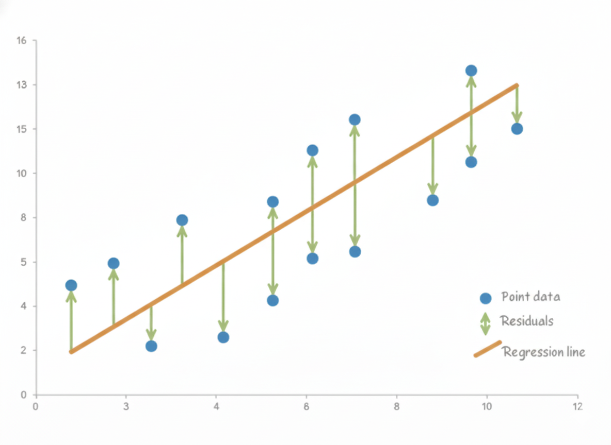

# Deep Learning

??? abstract "核心知识"

    - 机器学习的基本概念
    - 图像分类，尤其是线性分类器的原理（损失函数：Softmax）
    - 基本的神经网络：激活函数
    - 卷积神经网络（CNN）：卷积 + 池化
    - 各种训练技术：
        - 反向传播
        - 随机梯度下降
        - 选取超参数：数据分割
        - 阻止过拟合：
            - 正则化
            - Dropout
            - 数据增强
        
        - 批归一化
    
    - 明确不考的：最后「网络架构」一节，并且不用记公式，重在理解概念
        - 唯一要记的公式是神经网络的公式：

            $$
            f = \sigma(W_3 \textcolor{yellowgreen}{\sigma(W_2} \textcolor{cornflowerblue}{\sigma(W_1 x + b)} \textcolor{yellowgreen}{+ b_2)} + b_3)
            $$

???+ info "说明"

    一开始笔者想的是用 CS231n 来替代课内只用一节课介绍的内容。但到了期末发现这样做不太方便复习，于是笔者决定还是乖乖根据第 9 讲的课件做一下笔记吧。读者可将这份笔记看作期末复习特供版，所以建议在为 ZJU《计算机视觉导论》课程备考时阅读，平时学习的话还是阅读本笔记之后的笔记。

    整理的时候发现很多内容还是笔者已有的笔记更完整些，所以笔者就贴上这些内容的链接，不另外撰写了。

## Machine Learning

- 传统编程
    - 例子：图像分割

    

        
    

- **机器学习**(machine learning)：能够访问数据并用于自身学习的程序

    

        
    

机器学习中的重要概念：

- **模型**(model)：解释输入 $x$ 和输出 $y$ 之间关系的数学描述

    

        
    

    - 模型被定义为一个函数 $y = f_w(x)$，其参数记作 $w$
    - 问题类型：
        - **回归**(regression)：$y$ 为实数
        - **分类**(classification)：$y$ 为离散标签

- **监督学习**(supervised learning)：从标注数据中寻找 $f_w$
    - **标注数据**(labeled data)：现存的 $(x, y)$ 对，又称为**训练数据**(training data)

    

        
    

- 两个阶段：
    - **训练**(training)：对于给定的标注数据，寻找 $f_w$（**模型拟合**(model fitting)）
    - **测试**(testing)：对于给定的 $f_w$ 和新的 $x$，寻找 $y$（又称为**推理**(inference)）

### General Pipeline

机器学习的一般流程如下：

1. 定义问题：确定什么是 $x, y$
2. 收集训练数据（$(x, y)$ 对）
3. 设计模型（或网络）：确定 $f_W$ 的形式
4. 模型训练
    - 定义损失函数 $l(w)$
    - 使用某些优化算法，找到能够最小化 $l(w)$ 的最优 $w$（深度学习框架负责执行）
5. 测试（应用）：对于新数据 $x$，根据习得的 $f_W$ 预测 $y$

### Regression

最简单的回归形式是**线性回归**(linear regression)。

- 模型：$y = Wx$
- 为何是回归：输出 $y$ 为实数
- 训练算法：最小化 MSE（具体见第 4 讲的「[模型拟合](4.md#model-fitting)」）

    

### Classification

具体内容见笔记「[使用线性分类器的图像分类](9.md)」开头部分（到「k 最近邻分类器」一节之前）。

## Linear Classifier

具体内容见笔记「使用线性分类器的图像分类」中「[线性分类器](9.md#linear-classifier)」（到「多类 SVM（支持向量机）损失」之前的部分）。

## Neural Networks

具体内容见笔记「神经网络和反向传播」中「[神经网络](11.md#neural-networks)」一节（到「实现」小节之前 +「和生物神经网络比较」小节）。

## Convolutional Neural Networks

具体内容见笔记「[采用 CNNs 进行图像分类](12.md)」中「[归一化](12.md#normalization)」之前的部分，以及笔记「CNN 架构」的 [AlexNet](13.md#alexnet) 和 [VGGNet](13.md#vggnet) 部分。

## Training Neural Networks

具体内容见笔记：

- 「神经网络和反向传播」中的「[反向传播](11.md#backpropagation)」一节（矩阵形式之前）
- 「正则化和优化」中「[随机梯度下降](10.md#stochastic-gradient-descent)」一节
- 「使用线性分类器的图像分类」中「[超参数](9.md#hyperparameters)」一节（“交叉验证”之前的部分）
- 「正则化和优化」中「[正则化](10.md#regularization)」一节
- 「CNN 架构」中「[Dropout](13.md#regularization-dropout)」、「[数据增强](13.md#data-augmentation)」小节
- 「采用 CNNs 进行图像分类」中「[批归一化](12.md#batch-normalization)」一节

如何选取超参数：

- 训练原始模型
- 验证并寻找超参数
- 测试以理解泛化性(generalizability)

如何阻止过拟合：

- 交叉验证和早停止(early stop)
- 正则化或 Dropout
- 数据增强

**深度学习框架**支持深度学习算法的快速开发，比如 [Caffe](https://caffe.berkeleyvision.org/)、[TensorFlow](https://www.tensorflow.org/)、[PyTorch](https://pytorch.org/) 等。它们往往提供了

- 构建网络的各种模块
- 使用 CPU/GPU/多 GPUs 训练的各种优化器

## Network Architectures

- 一些历史
- ResNet 见笔记「CNN 架构」的 [ResNet](13.md#resnet) 一节