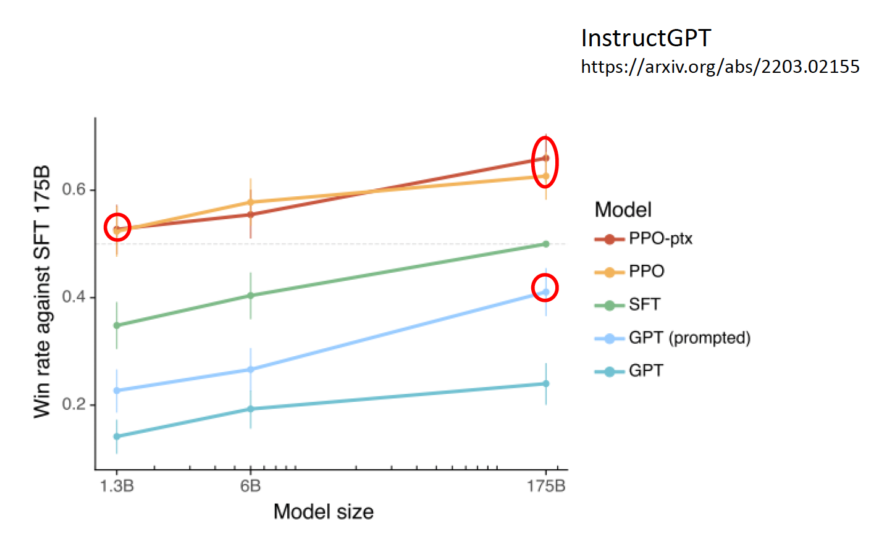

# Introduction

## AI & Genarative AI

在了解什么是生成式人工智能之前，不妨想想我们耳熟能详的“**人工智能**”(artificial intelligence, AI)到底是什么？简言之，人工智能就是让机器展现“智能”。但不同的人对人工智能的理解不尽相同：有人认为像 ChatGPT 那样就是人工智能，但也有人认为那种用到机器人的才算人工智能。正因为这些不同的声音，所以和 AI 相关的论文不会直接提到“人工智能”这个概念，以避免混淆。但不论我们如何定义这个词，“人工智能”可以说是一个**目标**，而不是单一的技术。

而**生成式人工智能**(generative AI)的含义是机器产生**复杂的、有结构的**对象，比如文本、图像、语音等。概念中的“复杂”具体指无法穷举的可能性，比如让 AI 生成 1 篇 100 字的文章，假设中文常用字有 1000 个，那么就有 $1000^{100} = 10^{300}$ 种组合，但宇宙中的原子数也就在 $10^{80}$ 的量级左右。所以生成式 AI 要做的就是从近乎无穷的可能性找出适当的组合。

需要注意的是，像**分类**(classification)（从有限的选项中做选择）这种传统机器学习里面的任务不属于生成式 AI。

人工智能和生成式人工智能属于包含关系，因此生成式 AI 也是我们想要实现的目标之一。

    

## Machine Learning & Deep Learning

说到 AI，一个避不开的话题便是**机器学习**(machine learning)，我们可简单理解为：让机器自动地从数据中找出一个函数。下图展示了机器学习的大致流程：

    

那么具体该如何寻找函数呢？一种常见技术叫做**深度学习**(deep learning)，它通过一个叫做**神经网络**(neural network)的东西来寻找合适的参数。网络的一般架构如下所示：

    

将机器学习和深度学习加到前面的维恩图中，如下所示。注意到机器学习和深度学习不是目标，而是我们达成目标采用的手段。

    

!!! info "注"

    这里对机器学习和深度学习的介绍只是浮光掠影，蜻蜓点水。若对这些内容感兴趣的话，可阅读我的另一篇笔记“[机器学习](../ml/index.md)”。

实际上，看似很 nb 的 ChatGPT 仍然符合前面机器学习的流程，只是它的底层模型更加强大，比如它借助了 [Transformer](../ml/5.md) 这一强大的神经网络。而 ChatGPT 本身就是机器学习要找的那个“函数”罢了。

    

再比如 AI 画图（比如 [Stable Diffusion](https://stablediffusionweb.com), [Midjourney](https://www.midjourney.com/imagine), [DALL·E](https://openai.com/index/dall-e-3/) 等）也是可通过机器学习找到的一类“函数”。

    

## Language Model

生成式 AI 的挑战在于我们要求机器能够产生在训练时从来没有看过的东西，也就是说让机器具备“创造力”。具体的做法会在之后的课程中详细介绍，这里先简单介绍其中一种思路——让机器做“**文字接龙**”。它的思想是：将原本的训练任务（文生文）拆解成一连串的文字接龙，也就是说让机器每次只输出有限长度的答案，之后将得到的答案附加在下一次的输入中，让机器接着输出之后的答案。以此类推，直至机器认为可以结束的时候，输出一个特殊符号（比如 `[END]`）表示结束。

    

其实上述模型就是我们常听说的**语言模型**(language model)。文字接龙的做法将原本无法穷举的可能压缩到有限个答案的选择，也就是转化成一系列的分类问题。而且语言模型正是生成式 AI 的一个门类。

    

---
除了文字接龙的方法外，还有各种各样的生成策略，比如**自回归生成**(autoregressive generation)，其原理为：将复杂的对象划分为一个个较小的单元，模型依照某种固定的顺序依次生成答案。这种方法既可用于文本（以词为单位），也可用在图像中（以像素为单位）。

    

其实在 ChatGPT 之前，OpenAI 就已经开发过图像版的 GPT，只是没有火过（原因会在之后的课程中说明）。

    

---
实际上，生成式 AI 并不是近几年才刚出现的——早在十年前就有类似的研究，比如当时的**结构化学习**(structured learning)和现在的生成式 AI 本质上并没有太大差别。另外，机器翻译实际上也是一种生成式 AI，而众所周知的 Google Translate 早在 2006 年就诞生了。

    

但现在的生成式 AI 有什么特别厉害的地方吗？这正是之后要讨论的话题——未完待续！

## Overview of ChatGPT

GPT 的全称为**生成式(generative)预训练(pre-trained) [Transformer](../ml/5.md)**，由 [OpenAI](https://openai.com/) 开发。而 [ChatGPT](https://chatgpt.com/) 正是基于 GPT 模型的聊天机器人，它的诞生掀起了 LLM 的热潮。

### Language Model

GPT 本质上也是一个语言模型，所以它也会以文字接龙的形式呈现答案。实际上 GPT 不会马上一个 token 一个 token 地输出，它首先会给出一个关于 token 概率分布，然后从中随机采样一个 token 作为输出，所以 ChatGPT 每次给出的答案不一定相同。

    

GPT 以 **token** 作为处理文本的最小单位。注意 token 不等同于英文中的单词或中文的汉字，而且不同语言的 token 往往是不同的。要想知道 GPT 是如何区分文本中的 token 的话，可以用用 OpenAI 的[**分词器**](https://platform.openai.com/tokenizer)(tokenizer)。

    

之所以 GPT 要随机采样，是因为不这么做的话，它就有可能因为不够“灵活”而陷入怪圈，如下所示。

    

GPT 文字接龙的特性使得 ChatGPT 能够实现多轮对话的功能。

    

但正因为这一特性，ChatGPT 有时会胡言乱语，编造出不存在的东西，比如不存在的台大玫瑰花节：

    

>注：现在的模型应该不会犯这么离谱的错误，至少 GPT-4o 是没问题的...

那么像 GPT 这样的语言模型是如何学会文字接龙的呢？对模型而言，任何文本资料都可以作为它学习的教材。得益于互联网的广泛普及，现在互联网上已经有巨量的文本资料，这也正是 GPT 训练数据的主要来源之一。

    

要想了解 GPT 模型的内部结构，请阅读笔者的[机器学习笔记](../ml/index.md)。

### History

回顾 ChatGPT 诞生前的 GPT 系列（模型大小对应函数的参数量（AI 的天赋），数据大小对应拿来学文字接龙的数据量（后天的努力））：

|模型|时间|模型大小|数据大小|
|:-:|:-:|:-:|:-:|
|GPT-1|2018|117M|1GB|
|GPT-2|2019|1542M|40GB|
|GPT-3|2020|175B|580GB|

#### GPT-2

其中 GPT-2 开始就可以回答问题了！

    

但它在问答题（CoQA）上的表现不太理想...

    

#### GPT-3

从 GPT-3 开始，模型就可以输出代码了。

    

从实验结果上看，GPT-3 貌似也没有多大进步：

    

其实并不是 GPT-3 不够聪明，而是它的训练数据大部分来源于网络。例如它学到了很多考试题目，所以它根据给定题目输出一些供人选择的选项而不是自己作答。

    

像 GPT 从互联网文本中学习的方式叫做**预训练**(pre-train)，又称**自监督学习**(self-supervised learning)。要想让模型输出正确的答案，需要人类明确指出什么是正确的答案，这样模型就知道该如何学习下去了。我们称这样的学习方式为**监督学习**(supervised learning)。自监督学习的模型继续通过监督学习训练的过程叫做**微调**(fine-tune)。

    

加上监督学习后，GPT-3 的表现得到了不小的进步（图中的黄色和红色曲线，蓝色为最原始的 GPT-3）！也就是说监督学习对 GPT-3 起到了画龙点睛的作用。

    

从另一个角度看，有了预训练后，监督学习就无需大量的数据了。比如在多种语言上做预训练后，只要之后教模型某一个语言上的某一个任务，模型就会知道如何解决其他语言的同种任务。

    

    

---
在预训练后，GPT 还会再经过一轮[**强化学习**](11.md)(reinforcement learning, RL)。强化学习有时又称为**来自人类反馈的强化学习**(reinforcement learning from human feedback, RLHF)，它不是直接给出正确答案，而是根据模型的答案给出评价，让模型知道什么样的答案是好的，什么答案又是不好的。对于人类而言，强化学习相比监督学习更轻松，因为不需要再花力气准备正确答案。

    

>注：这里不会详细介绍强化学习的原理，感兴趣的读者可点击上方“强化学习”的链接。

之所以把 RL 放在最后一步，是因为模型要具备一定的能力才能进入 RLHF。

在 GPT 中，RL 大致分为以下两步：

1. 模仿人类老师的喜好

    

        
    

2. 向模拟老师学习

    

        
    

我们一般将监督学习和强化学习两个步骤合称为**对齐**(alignment)，意思就是让模型输出尽可能接近正确答案的过程。加入对齐后的 GPT-3 便是 GPT-3.5 了。

#### GPT-4

[GPT-4 的报告链接](https://openai.com/index/gpt-4-research/)

- 报告内的作者列表长达三页
- 但是报告内几乎没涉及什么技术细节，唯一有关技术上的描述可能就只有这段话：

    

        
    

好消息是：GPT-4 支持将图像作为输入了！

>注：截止到本笔记撰写完毕时，本该早已发布的 GPT-5 还在延期...

### Tips

虽然语言模型已经努力跟人类的需求“对齐”，但有时模型给出的答案仍然差强人意。这可能不是模型的问题，而是需要我们弥补这“最后一公里”的差距。下面将介绍一些方法，让我们更好地发挥出 ChatGPT 的威力。

- 把需求说清楚
    - 如果没讲清楚需求，模型就可能会擅作主张，画蛇添足
- 提供（背景）数据
    - 让模型基于你的真实经历生成内容
- 提供范例
    - 在让模型生成可能模型自己从来都没见过的东西前，应当给模型一些参考样例
- 鼓励 ChatGPT 思考
    - 不过现在的大模型都有了手动开启思考功能的能力
- 让 AI 自己寻找合适的提示词
    - ~~笔者在科研时就是这么干的~~
- 上传文档
- 使用[基于 GPT 开发的小应用](https://chatgpt.com/gpts)
    - 当然自己也可以动手开发（但目前如果要在 ChatGPT 官网开发的话，需要将账号升级到 Plus）
- 拆解任务
    - 同样适用于人类学习
- 让 ChatGPT 自己规划
    - 适用于要完成的任务连人类自己都难以规划清楚的情况
- 让 ChatGPT 反省
    - GPT-3.5 还是不具备反省能力，GPT-4 才有
- 跟真实环境互动

## Power of Current Generative AI

前面提到过，生成式 AI 的概念不是最近才提出来的，只是现在火起来罢了。这也从侧面反映了当今生成式 AI 的威力，那么这个“威力”到底体现在哪里呢？先来看以前的生成式 AI（比如机器翻译等），它们往往只专注于做好一件事，比如机器翻译的 AI 就是只能做好翻译这件事，其他事情并不会做。但现在像 ChatGPT 这样的生成式 AI，它们除了会做翻译外，还可以写代码，做数学题等等任务。所以，我们可以将这两个“世代”的生成式 AI 归纳为：

- 过去的生成式 AI：专才、工具
- 现在的生成式 AI：通才、工具人（在某些领域上能力上和人类不相上下，甚至超过人类）

所以现在不要问 ChatGPT 能为你做什么（不要以为 ChatGPT 是一个只有固定功能的工具），要问你想要 ChatGPT 帮你做什么（只要你下对指示，ChatGPT 就有可能帮你做任何事）。

现在市面上有各种各样的生成式 AI，除了 ChatGPT 外还有 Google 的 Gemini，Anthropic 的 Claude 等。不过之后对生成式 AI 的介绍都是以 ChatGPT 为例。

???+ example "使用 ChatGPT 的一个例子"

    下面是李宏毅老师用 ChatGPT 绘制的关于 ChatGPT 能够干什么的词云：

    

        
    

    不过这个过程不是一帆风顺的，这是首次交互的结果：

    

        
    

    

        
    

    可以看到，ChatGPT 确实能总结出30个能做的事情，但是给出的词云却是一篇乱码。将这个问题反馈给 ChatGPT，它的回答是：

    

        
    

    尽管它能指出问题所在，但它还是没能解决问题，理由是它的系统里没有中文字体文件。

    

        
    

    但我们可以主动给 ChatGPT 中文字体文件。现在它就能成功输出正常的词云了。

    

        
    

也许读者会好奇，这些 AI 到底在“想”什么呢？下面是一些相关例子：

??? example "例子"

    === "例1"

        看看 LLaMA 认为世界上每个州在地图上的分布：

        

            
        

    === "例2"

        类似的实验做在台湾上，但每个点代表的是一个里（相当于大陆中的社区或村）。

        

            
        

---
由于现在的生成式 AI 是专才，在每个领域上都能有所作为。所以要想对这样的模型全面评估并不容易，毕竟使用者的要求千奇百怪，而且同一种要求可以有截然不同的解法。比如说现在让模型完成这样的任务：“请说‘哈哈哈’一百次。”这样的任务对模型而言应该是比较奇葩的，所以各家模型都给出了不同的回应，结果如下（下面是我自己测试的结果，日期 2025.8.4）：

- Gemini 2.5 Flash：

    

        
    

- GPT-4o：

    

        
    

- GPT-4.1-mini：

    

        
    

- o4-mini：

    

        
    

- Grok 3：

    

        
    

- QWen3-235B-A22B-2507：

    

        
    

- Deepseek-V3：

    

        
    

- Kimi-K2：

    

        
    

可谓百家齐放，百家争鸣啊～

### Preventing Harmful Contents

过去我们不用担心 AI 会说错话，因为过去的 AI 做的只是像分类那样没什么创造性的任务，只能从既定的选项中给出答案。但现在的生成式 AI 在不加限制的前提下可以说任何话了，包括脏话、抄袭、歧视等有害内容。所以开发者往往会给这些模型限制，无论你怎么千方百计地引诱模型，模型基本都不会吐出任何有害内容。

不过前几年还可以通过角色扮演的手法骗过 GPT-3.5，下面给出例子：

???+ example "例子"

    

        
    

    

        
    

### Improvement

既然现在的生成式 AI 已经从“工具”演化至“工具人”的地位，~~我们连工具人都做不成了~~，那我们还能做什么呢？事实上，现在的生成式 AI 还没有发展到全知全能的程度，那么它仍然有改进的空间。不过提供给我们的模型都是黑箱的，我们没法直接修改参数，所以能够努力的方向就有：

- 我改变不了模型，那我改变我自己

    

        
    

    这种改变提升输入质量的技巧就是**提示工程**(prompt engineering)，具体内容将在下一讲介绍。

    

        
    

- 训练自己的模型

    

        
    
