# Voice Mode of GPT-4o

!!! warning "改编自课件的免责声明"

    - 本讲的主要目的是讨论技术，没有要对任何人或群体造成伤害的意图
    - 录制这门课的时候还没有正式公布 GPT-4o，所以以下对 GPT-4o 的理解完全来自 OpenAI 的 [demo](https://openai.com/index/hello-gpt-4o/)
    - OpenAI 至今并没有发表 GPT-4o 相关的论文或技术报告（~~不愧是 CloseAI~~），所以以下内容完全是根据李宏毅老师所知的技术进展进行推测的
        - 若发现实际技术与下面内容有所差异，还请读者见谅，如果可以的话最好指出其中的错误之处，在此万分感谢！

从 demo 中可以看出，GPT-4o 的语音模式(voide mode)具有以下特点：

- 丰富的语音风格
- 理解语音内容之外的信息（“察言观色”），比如可以讲快一些，也可以轻声细语
- 发出非语言性的声音，比如笑声
- 自然而实时的互动

    

        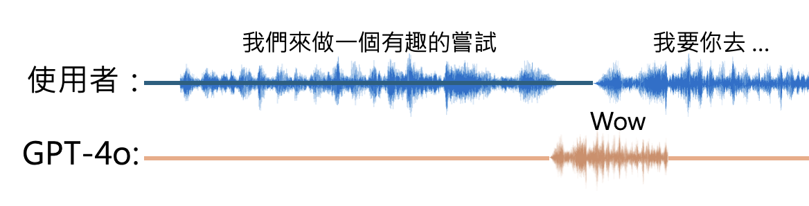
    

实际上，在推出 GPT-4o 之前，ChatGPT 就自带语音功能了。但当时的 ChatGPT 还不能直接理解语音——它要先将语音转化为文字后（语音识别），再输出文字，最后通过合成后的语音来实现和用户的对话。也就是说，这样的 ChatGPT 只能理解语音内的语言内容，而无法感知语音内包含的情绪等特色，也没法输出不同风格的声音。

    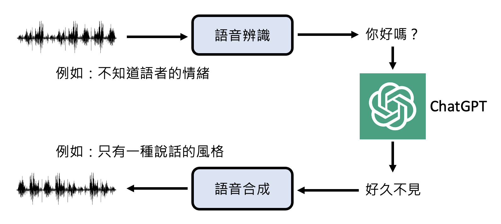

在看完 GPT-4o 的 demo 后，李宏毅老师认为 GPT-4o 下的 ChatGPT 可能是在原来的基础上加了一些额外的模块，从而解决上述问题。

- 在对用户语音做识别的同时，还会检测声音事件以及情绪等等
    - 相关研究：
        - <https://arxiv.org/abs/2402.12786/>
        - <https://arxiv.org/abs/2312.15316/>

- 输出时也能改变语气和说话风格
    - 相关研究：
        - <https://audiobox.metademolab.com/>
        - <https://arxiv.org/abs/2309.14324/>
        - <https://arxiv.org/abs/2211.12171/>
        - <https://github.com/suno-ai/bark/>

    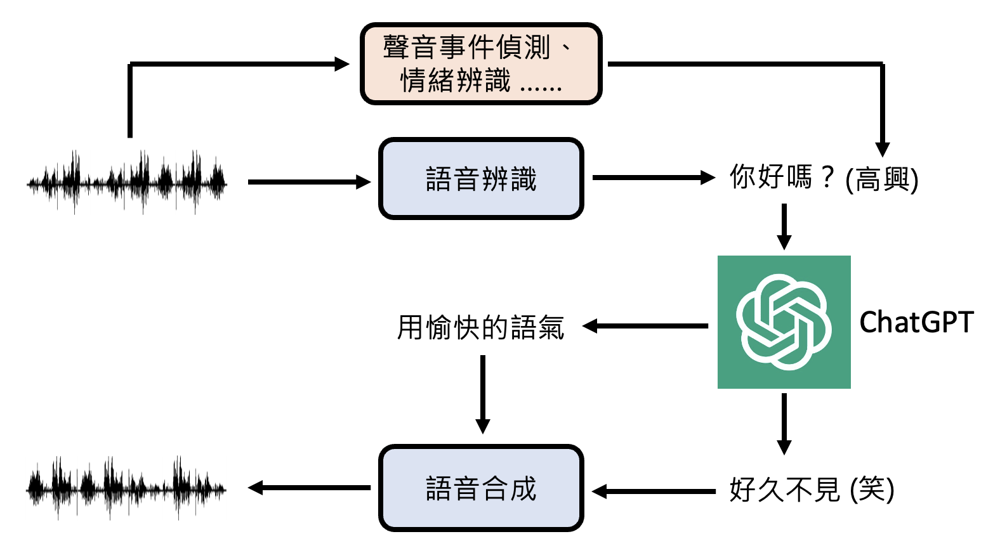

据 OpenAI 的博客所言，GPT-4o 的语音模型是一个端到端的模型，也就是说它能直接处理语音，并输出语音。

    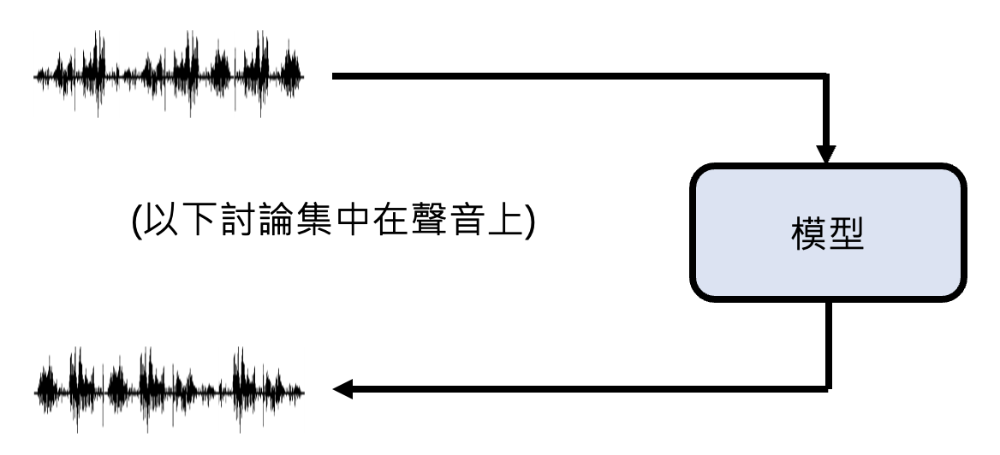

## Principles

语音版语言模型不能像一般的语言模型直接处理文本那样来直接处理语音。在前面的学习中，我们知道对于 1s 的语音，若采样率为 16 kHz，那么就有 16k 的采样。那么做“语音接龙”时就要拼接大量的采样，要解决这么大的计算量显然是不现实的。因此，语言模型不会直接接触语音本身，它能接受的是经过编码器加工过的**编码**(code)，里面包含了语音信息。我们称所有可能的编码构成的集合为**编码簿**(code book)，而这些编码又被称为**语音单元**(speech unit)。

    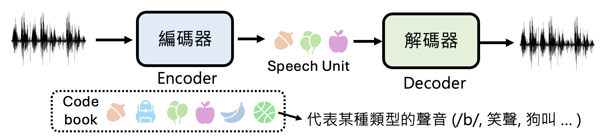

如上图所示，我们还会训练一个叫做解码器的模型，用于将编码重新还原为语音。

相关研究：

    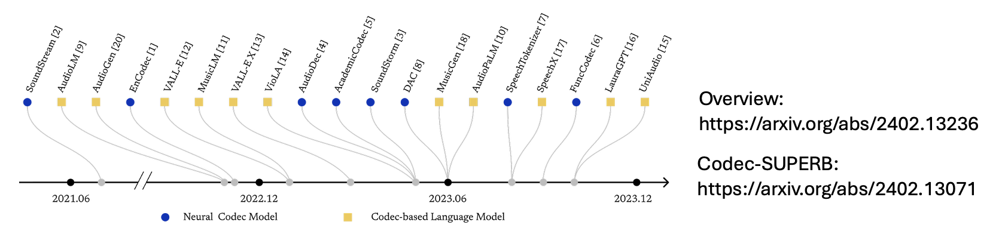

以下是加入编码器和解码器后，语音版语言模型处理语音的流程：

    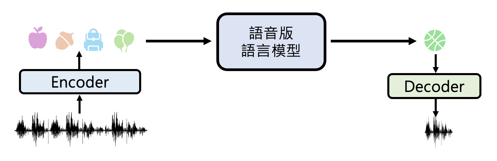

相关研究：

- [GSLM](https://arxiv.org/abs/2102.01192)
- [Audio LM](https://arxiv.org/abs/2209.03143)

李宏毅老师猜测：GPT-4o 可能将编码器和语音识别结合，让模型同时理解语音内容和语音中无法用文字传达的信息；另外还将解码器和语音合成结合起来，让输出的语音“更有感情”。

    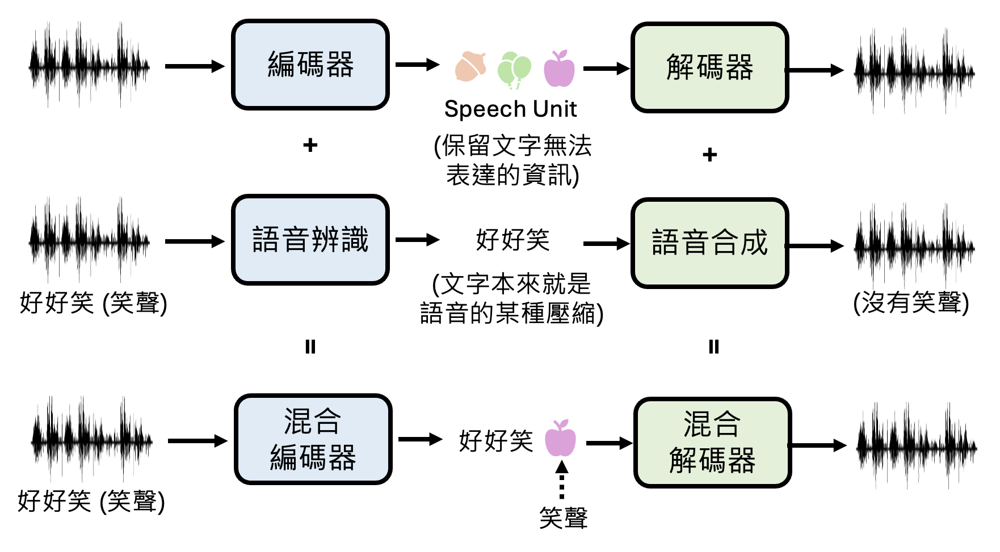

此外，GPT-4o 可能还有一个用于自动分段标记说话者的模块，能够从语音中区分出不同的说话者。

    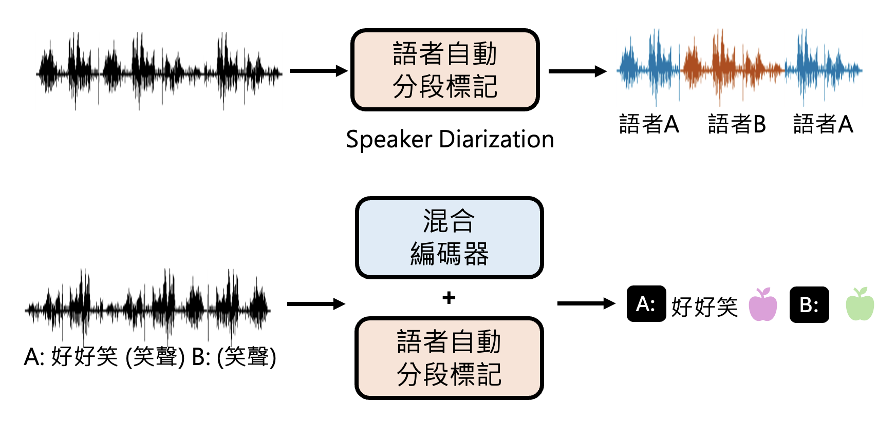

## Pre-training

就像一般的语言模型需要大量的文本作为训练数据，语言版的语言模型也需要大量的声音作为训练数据。比如，据《纽约时报》称，OpenAI 用了超 100 万小时的 Youtube 视频作为训练数据（[相关报道](https://www.nytimes.com/2024/04/06/technology/tech-giants-harvest-data-artificial-intelligence.html)）。

不过网络上的影片五花八门，不全是干净的语音，所以模型在训练时也许会把背景音乐给学进去了。如果真学进去的话，那这可能不是一个 bug，而是一种特色（说话自带 BGM）。

??? example "例子"

    

---
过去，语音合成系统往往只会“棒读”，也就是毫无感情地念一段文本。但在有大量的训练数据的时候，模型可以理解文本内容，从而对要输出的语音做些许变化，比如读到 whisper 时说话就会变得小声。

相关研究：

- [BASE TTS: Lessons from building a billion-parameter Text-to-Speech model on 100K hours of data](https://arxiv.org/abs/2402.08093)
    - [一些例子](https://www.amazon.science/base-tts-samples/)

---
如果只用语音数据来训练，模型很难学到足够的知识。举例来说，假如有 100 万小时的语音数据，并假设每分钟包含 100 个文字 token，那么这些数据的总 token 数为 60 亿左右。但是 LLaMA 3 的预训练文本数据有 15 兆个文字 token，是前者的 250 倍。

因此一种可能的训练方式是：用一般只看文本的语言模型作为语音版语言模型的初始化参数，之后通过语音数据来调整参数。而它看到的语音单元可以看作是一种独特的符号，来自一门全新的语言体系。

    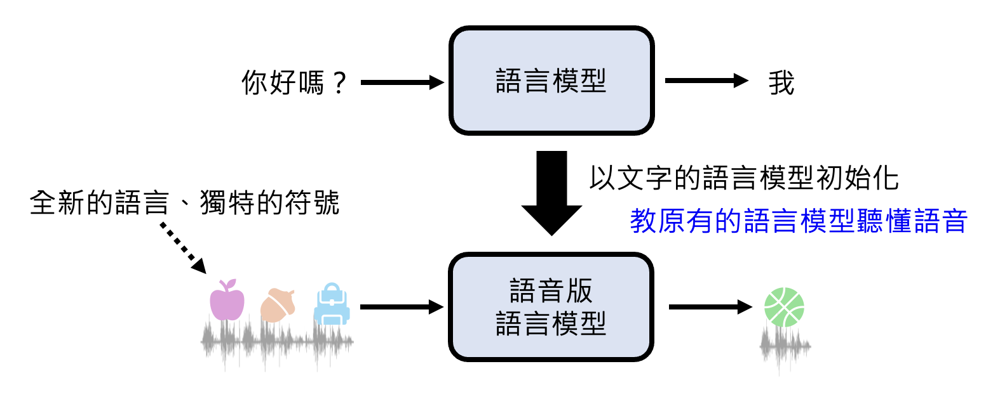

    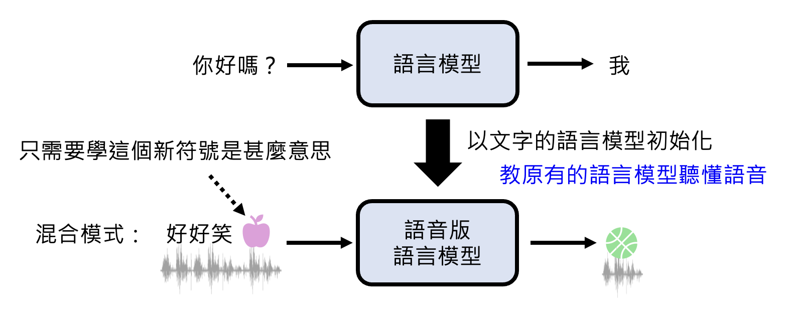

下面是一些其他利用文字来训练语音版语言模型的方式：

- <https://arxiv.org/abs/2310.08715/>
- <https://arxiv.org/abs/2402.05755/>

## Alignment

对于语音版的语言模型，**对齐**(alignment)这个过程可简单理解为让 AI 的回答和人类的问题相匹配。

    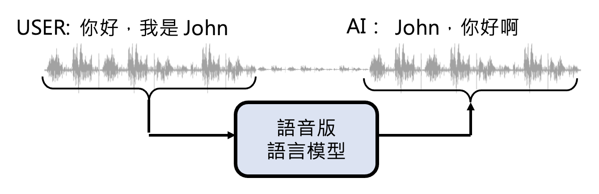

在 ChatGPT 中，我们可以让它以不同的声音回答问题。其中一种声音叫做 Sky（不过现在（2025.8.26）的 ChatGPT 没有了hh），选中它之后，ChatGPT 就会一直以这种音色和用户对话。那么是否需要录制很多 Sky 音色的语音呢？

- 也许不用，因为模型预训练过了？
- 也许可以用语音转换的技术把对话中的任何音色转换为 Sky 的音色

>[相关研究](https://openai.com/index/navigating-the-challenges-and-opportunities-of-synthetic-voices/)

## Listening, Speaking and Seeing at Same Time

ChatGPT 的文本界面（左图）和语音界面（右图）是不一样的，如下所示（截屏于 2025.8.26）：

    
    

如果在文本界面的话，我们可以随时中断 ChatGPT 的输出（只要点击圆形中间带方形的按钮即可）。但是在语音界面下，就没有为用户准备这样的按钮，因为 ChatGPT 可根据用户的语音内容决定何时停止说话，即便还在说话，用户仍然可以随时打断。这就意味着 ChatGPT 具备同时听和说的能力。

???+ play "演示"

    === "stage 1"

        

            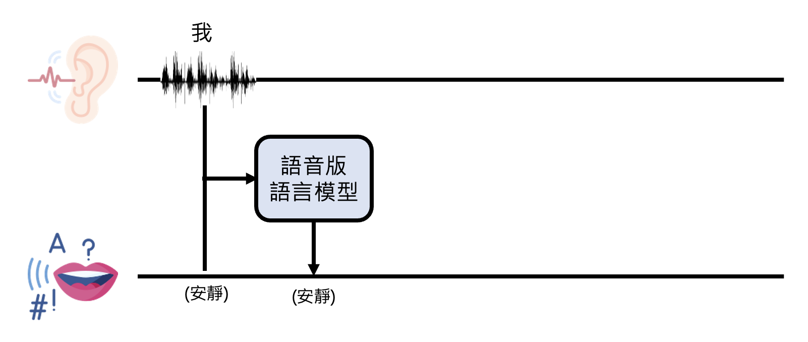
        

    === "stage 2"

        

            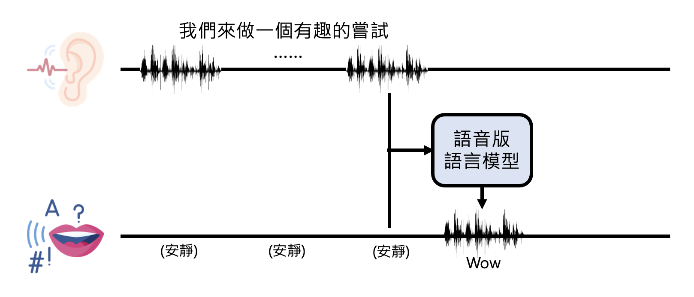
        

    === "stage 3"

        

            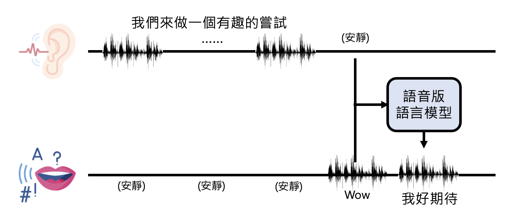
        

    === "stage 4"

        

            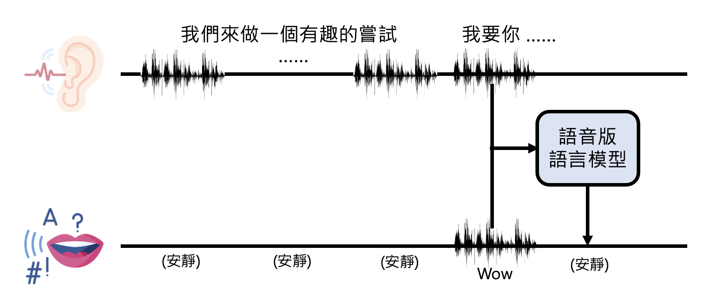
        

相关研究：[Dialogue GSLM](https://arxiv.org/abs/2203.16502)

---
GPT-4o 还同时具备了听、说、看的能力。

    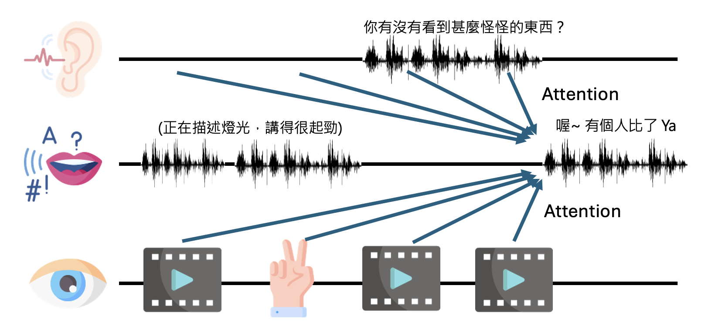

Google Project Astra 的 demo 也展现了这样的能力：

    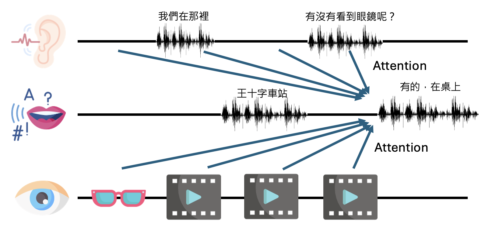

更多有关语音版语言模型的论文：[🔗链接](https://github.com/ga642381/speech-trident)

    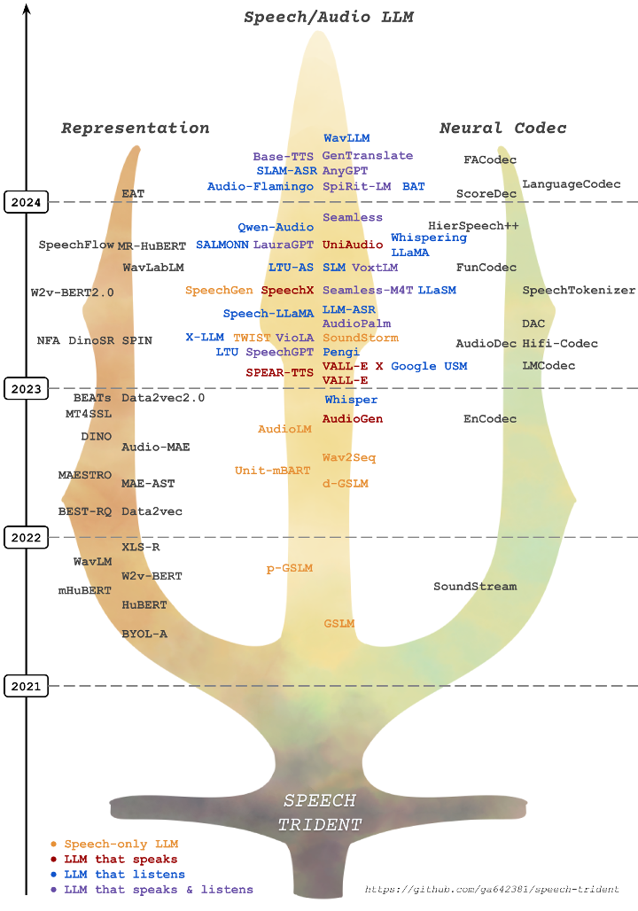

