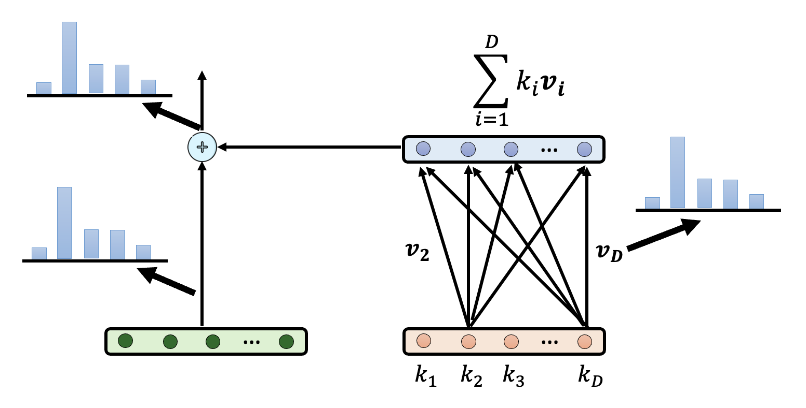

# Inner Workings of Transformer-based LM

虽然前面几讲，包括《机器学习》课程中已经学到了不少模型底层原理的知识，但这些都是许多年前的研究成果，在 AI 领域短短一年就已是沧海桑田了。所以本讲的目的是补充近些年（直至 2025 年年初）来人们对语言模型的新的认知。在阅读以下内容前，读者请确保对下面的知识有所了解，否则下面的内容理解起来会很吃力。

- [Transformer](../ml/5.md)
- [Explainable Machine Learning](../ml/8.md)
- [Explainability of LM](5.md)

## One Neuron

首先回顾一下：基于 Transformer 的网络架构要做的就是根据一排已知的输入 token，得出一个关于 token 的分布，并从中随机采样作为最终输出的 token。网络内包含了一层层的**神经元**(neuron)，其中的每个神经元会将前一层的输出作为输入，先做加权和，然后丢给一个激活函数（通常是 ReLU）得到一个输出。

    

“神经元”一词来自神经科学，所以用人脑中的神经元类比网络中的神经元是一件很自然的事。比如莱特文教授曾在授课时提出了祖母神经元的假想：大脑中有专门负责辨认家庭成员的神经元，如果移除这个神经元的话，我们就记不起自己的祖母了。该假设用于反驳当时流行的一个观点——多个神经元负责完成同一项任务。

现在我们想知道，一个神经元到底在做什么样的事呢？我们又该如何了解呢？下面举了一些例子：

???+ example "例子"

    === "脏话神经元"

        - 假如某个神经元激活时，语言模型就会说脏话，这并不意味着这个神经元决定了模型说脏话的能力，只能说明该神经元和模型说脏话是有一定的相关性

            

                
            

        - 如果移除该神经元后，语言模型说不出脏话，那么这个神经元就和模型说脏话有一定的因果关系
            - 那么什么叫“移除”神经元呢？即便让神经元的输出恒为0，它还是会对其他神经元产生影响

            

                
            

        - 也许神经元不同的激活程度，会让模型说出不同“等级”的脏话

            

                
            

    === "川普神经元"

        有人发现，CLIP 模型中有一个神经元对特朗普的反应比较大，即便对于部分出现特朗普的照片，以及特朗普相关的政客和艺术画，该神经元也给出了很高的分数。

        

            
        

        

            
        

        [报告来源](https://distill.pub/2021/multimodal-neurons/)

    === "和语法单复数有关的神经元"

        有[研究](https://arxiv.org/abs/2405.02421)发现，移除某些位置上特定的神经元会影响和单复数相关的单词出现的概率。

        

            
        

        不过即便移除这样的神经元，总体的分布情况还是没有太大的变化。如下图所示，移除管复数的神经元后，尽管 this, that 出现的频率大幅提高，而 these, those 出现的频率明显下降，但 these 仍然是出现频率最高的那个词。

        

            
        

实际上，我们往往很难解释单一神经元的功能，其中一个原因是一个神经元可能会同时负责很多任务。[有人](https://transformer-circuits.pub/2023/monosemantic-features/vis/a-neurons.html)研究了一个小型语言模型上的某个神经元，并记录让这个神经元激活的语句，如右图所示（颜色越深表示激活程度越高）。由于这些句子看起来非常随机，所以让 GPT-4.5 解释一下，如左图所示，可以看到它的功能很多，但看起来毫无关联，莫名其妙。

    

上述方法就是一种用 AI 解释 AI 的实例，这在[之前的课程](5.md#ai-explained-by-ai)中有提到过。

---
那么为什么不是一个神经元负责一个任务呢？一种合理的解释是一组神经元可以形成更多可能的功能。假设网络中有 4096 个神经元，如果一个神经元负责一个任务，那也就只有 4096 个任务；但假如它们一起工作，且仅有激活和不激活两种状态，那么一共有 $2^{4096}$ 种可能。所以接下来让我们来看一组，或者说一层神经元是如何工作的。

## One Layer of Neuron

现在假设网络中的某一层神经元的工作是负责拒绝用户请求（比如拒绝回答“如何制作炸药”这类危险的话题），那么这一层的目标就是输出一个向量表示，和表示拒绝请求的向量表示越接近越好。

    

但这层神经元实际的输出向量表示是很复杂的，不过我们将它拆分为表示拒绝的那部分向量和其他向量：

    

为了提取出适用于所有情况的拒绝向量，我们可以尝试发起各种语言模型应该拒绝的请求，并将那层神经元给出的向量表示拆分为拒绝和其他两部分，然后算个平均值：

    

接着输入各种无需拒绝的请求，那层神经元输出的向量表示都属于“其他向量”，然后同样做个平均。最后在拒绝情况和不拒绝情况下同一层的两个向量表示相减，得到的向量差就是拒绝向量。

    

还需要验证一下这个拒绝向量的有效性：把拒绝向量加在那一层神经元的输出向量上，看模型最终是否会拒绝作答。

    

下面便是这项[研究](https://arxiv.org/abs/2406.11717)的实验结果，可以看到，加了拒绝向量后（蓝色柱子），各类模型都会有强烈的拒绝回答的倾向。

    

另一个实验是：减去拒绝向量后，模型是否会回答那些本该拒绝回答的问题。根据下面给出的实验结果，确实如此。

    

上面的例子其实和《机器学习》课程的“自监督学习”一课中的[多语言 BERT](../ml/7.md#multi-lingual-bert)很像，感兴趣的读者可点击链接进入阅读。

类似的例子还有很多，之后我们将这些特殊向量统称为**功能向量**。

???+ example "例子"

    === "谄媚向量"

        

            
        

    <https://arxiv.org/abs/2312.06681/>

    === "真实性向量"

        

            
        

        - 灰色表示原来的回答，这里涉及到英国的一个谚语：“Find a penny, pick it up, all day long you'll have good luck.”
        - 绿色表示加了真实性向量后的回答，可以看到它的回答更加实事求是
        - 红色表示减掉真实性向量后的回答，此时模型开始胡言乱语了

        相关研究：

        - <https://arxiv.org/abs/2402.17811/>
        - <https://arxiv.org/abs/2306.03341/>

    === "上下文向量"

        如下图所示，先求一组反义词的例子中最后一个（冒号）向量表示做平均，作为上下文向量，然后加到另外的以一个词+冒号构成的例子的后面，这时模型就知道要在后面补充反义词，无需额外训练模型。

        

            
        

        实验结果如下。每行表示一个模型，每列表示一个任务，每张图的横轴表示模型层数。共同的特征是上下文向量集中出现在前面的层中，最后几层很少出现。

        

            
        

        研究还发现通过对不同上下文向量做加减，可以合成出新的上下文向量。

        

            
        

        相关研究：

        - <https://arxiv.org/abs/2310.15213/>（上面几张图片的来源）
        - <https://arxiv.org/pdf/2310.15916/>
        - <https://arxiv.org/abs/2311.06668/>

我们还可以同时找出一层中所有这样的功能向量：对于某个输入，我们将这一层的向量表示看作多个功能向量的线性组合。尝试不同的输入，得到多个用线性组合表示的向量。

    

那些无法用功能向量表示的误差向量 $e$ 要越小越好。总体的误差 $L = \sum\limits_{n=1}^N \|e_n\|_2 + \lambda \sum\limits_{n=1}^N \sum\limits_{k=1}^K |\alpha_k^n|$，其中 $\alpha_k^n$ 是第 $n$ 个向量表示中第 $k$ 个功能向量的系数，我们希望这个值尽可能是 0，即用到的功能向量越少越好。$L$ 可以用稀疏自编码器(sparse auto-encoder, SAE)来求解。

??? example "例子：Claude 3 Sonnet 的功能向量"

    >注：以下内容出自这份[报告](https://transformer-circuits.pub/2024/scaling-monosemanticity/)。

    >注2：#xxx 表示的是编号为 xxx 的功能向量。

    - \#31164353：遇到和“金门大桥”相关的文本（无论什么语言）和图片，激活程度都会明显提高

        

            
        

        加上这个功能向量后，问模型的物理形式是什么样的，它就会把自己看作是金门大桥。

        

            
        

    - \#1013764：和调试相关的功能向量
        - 加上这个功能向量后，原本正常的输出反而报错

            

                
            

        - 减去这个功能向量后，原本报错的输出反而正常了

            

                
            

            又或者会自动纠错

            

                
            

        - 元素周期表的很多元素也有各自的功能向量，不过太后面的元素没有功能向量了。其中最后一个元素是铽

            

                
            

        - \#80001：把自己看做是人的功能向量

            

                
            

        - \#847723：谄媚向量

            

                
            

## One Cluster of Neuron

接下来将从一层神经元扩展到一群神经元，以理解一个语言模型完成一项任务时，从输入到输出的过程中到底经历了什么。这类研究早在过去就已是汗牛充栋的，比如：

- <https://arxiv.org/abs/2304.14767/>

    

        
    

- <https://arxiv.org/abs/2305.15054/>

    

        
    

不过这里想跟读者介绍的是一个更加通用的想法。我们可以这样理解一个语言模型在完成某一项任务时的运作机制：利用语言模型的模型。第二个“模型”是指用一个简单的事物表示另一个事物，并且还要保持原来事物的特征。

    

这么讲可能有些抽象，所以下面就举一个具体的例子：一个抽取知识的模型（语言模型的参数内其实蕴含了大量的“知识”）。对于一个语言模型，如果输入 "The Taipei 101 is located in"，那它应当输出 "Taipei"。在语言模型内部，这件事大致是这样做到的：

- 先将句子中的主语（"The Taipei 101"）通过一系列的层转换为一个向量表示 $x$
- 再从句子中表示主语和宾语关联性的部分（"is located in"）得到一个线性函数。该函数将 $x$ 作为输入，输出内容经过转换后就是模型最终的输出

下面两张图分别展示了改变主语（对应的输入向量 $x \Rightarrow x'$）和改变主宾语关联部分（线性函数参数 $W_l, b_l \Rightarrow W_h, b_h$）的结果：

    
    

训练模型时，我们将语言模型的答案 $y$ 作为标准答案，再考虑线性函数的输入 $x$，得到线性函数的参数 $W_l, b_l$。然后再给模型看一组训练时没看到过的输入，看线性函数的输出是否和语言模型的答案一致。这样做确保语言模型的**诚实性**(faithfulness)。

    

实验结果如下：

    

我们可以根据语言模型的“模型”得到的预测来改变真正的语言模型的结果。比如还是对 "The Taipei 101 is located in" 这个问题，我们想让“模型”输出 "Kaohsiung" 而不是 "Taipei"，在不改变参数的情况下，我们可以尝试找到一个输入的改变量 $\Delta x$ 来影响最终的输出。之后将这个 $\Delta x$ 加在真正语言模型的向量表示中，从而让它也产生预期中的结果。

    

以下是有关这一尝试的实验结果，可以看到在不少情况下是能做到成功修改的。

    

>[相关论文](https://arxiv.org/abs/2308.09124)

前面的方法看起来像是一个灵光乍现的想法。接下来将介绍一种系统化构建语言模型的“模型”的方法：在原有语言模型的基础上进行重复的剪枝(pruning)，直到模型结构变得很简单（？）为止，但同时保证剪枝后的模型还能产生相同的答案。在很多文献中，会称这样的“模型”为**电路**(circuit)。这个方法类似《机器学习》课程中介绍过的[网络压缩](../ml/12.md)。

    

相关研究：

- [Interpretability in the Wild: a **Circuit** for Indirect Object Identification in GPT-2 small](https://arxiv.org/abs/2211.00593)
- [Towards Automated **Circuit** Discovery for Mechanistic Interpretability](https://arxiv.org/abs/2304.14997)
- [Does **Circuit** Analysis Interpretability Scale? Evidence from Multiple Choice Capabilities in Chinchilla](https://arxiv.org/abs/2307.09458)
- [Attribution Patching Outperforms Automated **Circuit** Discovery](https://arxiv.org/abs/2310.10348)
- [Sparse Feature **Circuits**: Discovering and Editing Interpretable Causal Graphs in Language Models](https://arxiv.org/abs/2403.19647)
- [Knowledge **Circuits** in Pretrained Transformers](https://arxiv.org/abs/2405.17969)

## Let LMs Express Thoughts Directly

既然语言模型会说话，所以要想知道模型是怎么想的，直接问就行了。

??? example "例子"

    

        
    

    

        
    

前面我们把网络的每一层简单理解为：输入一排向量，输出另一排向量。但每层的输出实际上还会加上对应的输入，这叫做[**残差连接**](https://arxiv.org/abs/1512.03385)(residual connection)（早在 15 年就提出了）。采用这种技术后，模型就变得更容易训练了。

    

左图是原来加上残差连接后的结构图，右图是和左图等价的结构图。但是透过右图不难发现，最终的输出实际上是对输入向量的不断更新，每经过一层就会加一些东西。这条路径被称为**残差流**(residual stream)。

    

我们可以提前让残差流上的向量进入 unembedding layer，得到一个概率分布，这种技术叫做**对数几率透镜**(logit lens)。通过检查模型中的每一层 logit，我们能够理解模型是如何思考的，所以语言模型的思维是“透明的”。下面列出一些相关研究：

???+ example "例子"

    === "例1"

        

            
        

        <https://arxiv.org/abs/2001.09309/>

    === "例2"

        

            
        

        从第 15 层的 logit 开始，Porland 出现的概率最大；而到了第 19 层，Warsaw（正确答案）的概率最大，并且此后一直保持第一，说明模型在第 19 层的时候已经思考出最终的答案了。

        如果前面已经给出了相关的背景知识，那么模型可以更快知道正确答案，比如右边的表格所示，模型在第 16 层就知道要输出 Warsaw 了。

        

            
        

        <https://arxiv.org/pdf/2305.16130/>

    === "例3"

        研究：[Do Llamas Work in English? On the Latent Language of Multilingual Transformers](https://arxiv.org/abs/2402.10588)

        

            
        

        从右边每层的 logit 可以看出，LLaMA 2 会先把法语的“花”翻译成英语的“花”，然后再翻译成汉语的“花”。

有研究（[Transformer Feed-Forward Layers Are Key-Value Memories](https://arxiv.org/abs/2012.14913)）探索了在残差连接中，每一层到底向残差流加入了什么东西。

    

研究发现，每一层加的东西是对前一层向量的加权和（权重记作 $\bm{v}_i$），而这些权重做过 unembedding 后可转换为一个分布，而一些模型的部分分布确实包含了一些意思，比如下表总结的东西：

    

还有研究（[Knowledge Neurons in Pretrained Transformers](https://arxiv.org/abs/2104.08696)）发现，可通过修改权重 $\bm{v}_i$ 来影响模型输出。假如想让模型在回答“谁是世界上最帅的人”时，将答案替换成自己的名字，那么可以先在权重向量上减去原答案的向量，再加上表示自己名字的向量，从而提高输出自己名字的概率。

    

---
logit lens 技术的一个致命缺陷是只能把一个向量表示转换为 token。另外，很多语言模型实际上做的就是预测下一个 token，所以中间的向量表示并不一定包含了输入中的信息，也许只包含了要预测的 token。

有一个叫做 [Patchscopes](https://arxiv.org/pdf/2401.06102) 的方法，它的原理是：对于某个文本，在模型对它预测的过程中提取相应的向量表示。然后将这个向量表示加在另一段需要该文本的文本中的对应向量表示上，从而让模型根据第二段文本的背景知识，预测和第一段文本相关的信息。

    

    

下面是一个真实的实验用例：

    

受上述研究启发，另一个更新的研究对神经网络背后的运作机制提出了新的看法——它要研究的是，对于多步问题(multi-hop questions)，语言模型是如何回答的。在做完分析后，作者提出了让 LM 在这类任务上表现更好的方法。多步问题一般包含三个实体(entity)，在下图的例子中，

- $e_1$ 明确出现在问题中，在这个例子中是 "Imagine"（约翰·列侬的专辑）
- $e_2$ 是 "the performer of Imagine"
- $e_3$ 是 "the spouse of the performer of Imagine"（小野洋子(Yoko Ono)）

    

下面的折线图就是分析后的结果。发现 $e_2$ 在开头几层就已经得出来了，而 $e_3$ 是在 21 层左右才开始出来的。

    

但有时 LM 无法得出正确答案，这可能是因为 $e_2$ 被分析出来的时间晚于 $e_3$，此时就没法在预期时间内分析出 $e_3$ 了。解决方案是把后面几层的向量表示直接加到前面，然后再重跑一次。结果如下表所示，那些原来答不对的题目现在有 40-60% 左右的概率被答对。

    

