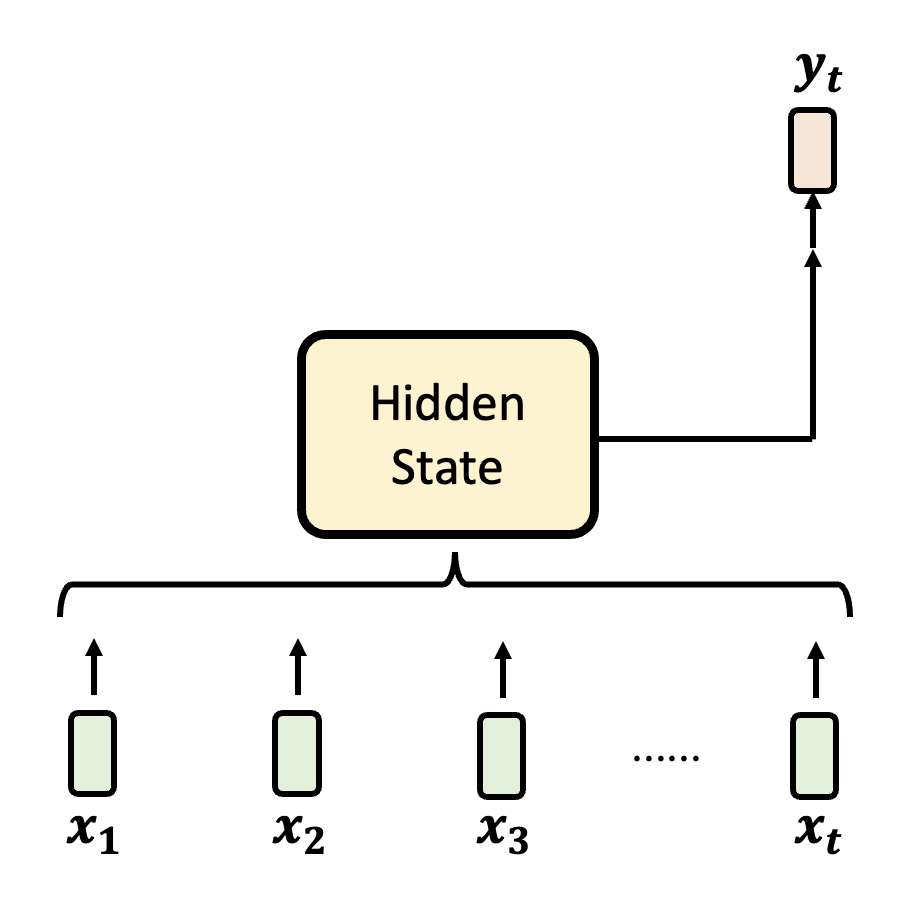

# Competitors of Transformer

每一种架构的存在都有一个理由：

- [**CNN**](../ml/3.md#cnn)：相比适用面更广的全连接层，卷积层有更大的模型偏移，并根据图像特征，减少不必要的参数，避免过拟合
- **残差连接**(residual connection)：
    - 如果没有残差连接，优化模型参数会比较吃力

        

            
        

    - 有了残差连接后，原本崎岖的误差曲面就会变得平滑，也就是说更容易优化了

        

            
        

## RNN v.s. Attention

那么 **Transformer** 架构，或者更准确地说，**自注意**(self-attention)机制出现的理由是什么呢？在回答这个问题前，我们不妨先来看自注意机制的前辈和晚辈们：

- 前辈——**RNN**（循环神经网络(recurrent neural network)）
- 晚辈——**Mamba** 架构和它的兄弟们

虽然它们的架构细节有不少差异，但是它们的共同目标都是给定一排向量的输入，输出另一排向量。

    

先来看 RNN 风格的架构的运作机制：有一个叫做**隐藏状态**(hidden state)的模块，它把目前已知的输入混合起来并保存，并由它决定输出内容。

    

更详细地，RNN 风格架构的一般形式为：

$$
H_t = f_{A, t}(H_{t-1}) + f_{B, t}(\bm{x_t}) \quad \bm{y_t} = f_{C, t}(H_t)
$$

其中 $\bm{x_t}, \bm{y_t}$ 分别为第 $t$ 个（或者说时间 $t$）输入向量和输出向量。这么说还是太抽象了，所以下面展示了隐藏状态的“真面目”：

    

- $H_0$ 既可以是向量（早期的 RNN 中 $H$ 就是向量），也可以是矩阵
- 由于每个位置的输入向量不同，因此位置 $t$ 上的三个函数 $f_{A, t}, f_{B, t}, f_{C, t}$ 由输入向量决定
    - 比如 $\bm{x_2}$ 是没有什么意义的输入，那么可以利用 $f_{B, t} $ 阻止 $\bm{x_2}$ 的传入
    - LSTM 也用到了这种技术

        

            
        

RNN 式的架构可用在当今流行的 AI 智能体上：

- $H_0$：智能体的内存
- $f_{A, t}$：反思模块，负责整理先前学过的知识
- $f_{B, t}$：写模块，写入当前观察 $\bm{x_t}$
- $f_{C, t}$：读模块，根据当前知识 $H_t$ 做出行动 $y_t$

    

---
自注意式的架构如下所示。由于在《机器学习》一课中对此做过详细的[解释](../ml/4.md)，故此处不再赘述。

    

值得一提的是，注意机制并不是在 2017 年首次提出来的，早在 2014 年就有相关研究了：

    

    

---
下图同时列出 RNN 和注意机制下的架构。通过对比，不难发现

- RNN 每一步的计算量都是一样的
- 而注意机制下，输入越长，计算量就会越大（一个输出的计算要顾及所有输入）

    

或许读者会反驳说“RNN 没法记住大量信息”，因为中间的 $H$ 只是一个有限大小的向量或矩阵——这是一个常见的误区，事实上注意机制也没法保证能记住无限长的内容，之后会解释其中原因的。

这么看来，注意机制好像一无是处，那么它为什么会这么流行，几乎支配了整个深度学习的领域了呢？在 2017 年 [*Attention is All You Need*](https://arxiv.org/abs/1706.03762) 的文章中（注意并不是这篇文章发明了注意机制，它只是拿掉了注意机制之外的东西），作者指出了注意机制的好处是提升了并行计算的能力，从而更好地利用了 GPU 的计算资源。

如果知道注意机制背后的原理，读者就能明白：注意机制实际上做的是一系列的矩阵运算，而 GPU 最擅长的便是这个，所以注意机制式的架构更符合 GPU 的胃口。

    

而 RNN 要等着一个个地读取输入并输出，中间的计算过程是串行的，所以无法利用 GPU 并行计算的优势了。

!!! abstract "总结"

    ||自注意机制|RNN|
    |:-|:-|:-|
    |推理|计算量和内存需求随输入序列长度增加而增加|计算量和内存需求固定|
    |训练|容易并行化|难以并行化（？）|

    >注意这里的问号，后面就会得到解答。

## Linear Attention

总结部分指出自注意机制不太善于应付长序列，但现状是：

- RAG，AI 智能体都需要语言模型处理很长的序列
- 多模态：图像、语音是比文本更长的序列

因此最近几年人们重新认识到 RNN 的好了，于是开始思考让 RNN 训练时并行计算的可能。考虑 RNN 的两个计算公式，列出 $H_1, H_2, \dots, H_t$ 的表达式并展开，得到：

    

观察发现，展开后的式子会随着 $t$ 的增加而更复杂，而导致这种复杂性的根源就是 $f_{A, t}$ 的存在，所以尝试将 $f_{A, t}$ 拿掉（原来的第一个等式就变成了 $H_t = H_{t-1} + f_{B, t}(\bm{x_t})$），重新列出 $H_1, H_2, \dots, H_t$ 的表达式并展开，得到：

    

其中 $H_t$ 是 $d \times d$ 的矩阵。可以看到，式子变得相当简单，只剩下一些形如 $f_{B, t}$ 的累加。为了简化表述，记 $f_{B, t}(\bm{x_t}) = D_t$，可得到：

    

接着，我们假设 $f_{C, t}(H_t) = H_t \bm{q_t}$，其中 $d$ 维向量 $\bm{q_t} = W_Q \bm{x_t}$。所以就有了前面关于 $\bm{y_t}$ 的等式。

最后，令 $D_t = \bm{v_t} \bm{k_t}^T$，其中 $\bm{v_t} = W_v \bm{x_t}, \bm{k_t} = W_k \bm{x_t}$（前者是 $d'$ 维向量，后者是 $d$ 维向量），所以：

$$
\begin{align*}
\bm{y_t} & = \bm{v_1} \bm{k_1}^T \bm{q_t} + \bm{v_2} \bm{k_2}^T \bm{q_t} + \dots + \bm{v_t} \bm{k_t}^T \bm{q_t} \\
& = \bm{v_1} a_{t, 1} + \bm{v_2} a_{t, 1} + \dots + \bm{v_t} a_{t, t} \\
& = a_{t, 1} \bm{v_1} + a_{t, 2} \bm{v_1} + \dots + a_{t, t} \bm{v_t}
\end{align*}
$$

WOW，这好像就是在做自注意计算啊——没错，除了少了 softmax 的计算外，几乎没有什么区别。我们称这个技术为**线性注意力**(linear attention)。下面同时列出 RNN 和线性注意力的结构图，发现它们的差异就在 $f_{A, t}$，即反思模块的存在。

    

在线性注意力中，训练的时候就像自注意机制，而推理的时候又好像 RNN。

    

用图形表示 $H_t = H_{t-1} + f_{B, t}(\bm{x_t})$ 的计算过程：

    

展开表示 $\bm{v_t} \bm{k_t}^T$：

    

其中 $\bm{v_t}$ 是要被写入内存的信息。如果想把 $\bm{v_t}$ 写入 $H$ 的第2列，那就让 $k_{t, 2} = 1$，其余 $k$ 均置0。

接着用图形化的方式表示 $\bm{y_t} = f_{C, t}(H_t) = H_t \bm{q_t}$

- $H_t$ 的每一列存有不同的信息
- $\bm{q_t}$ 表示从哪一列获取信息

    

其实线性注意力也不是什么新的想法——早在 2020 年的一篇论文（[Transformers are RNNs: Fast Autoregressive Transformers with Linear Attention](https://arxiv.org/abs/2006.16236)）就提到了 Transformer 和 RNN 就差一个 softmax。

### Retention

一种对 RNN（线性注意力）的流行度远不如 Transformer（带 softmax 的自注意）的解释是前者记忆有限，而后者有无限的记忆。

- RNN 记忆有限是很直观的想法，因为 $H$ 是一个 $d \times d$ 的矩阵，每一列代表不同信息，那么最多只能记 $d$ 个信息

    

        
    

    - 观察线性注意力的式子 $H_t = H_{t-1} + f_{B, t}(\bm{x_t})$，发现前一个 $H$ 的记录会完整的传给当前的 $H$，因此记忆不会发生改变

- 但 Transformer 并不是像大众所想的那样有无限的记忆力。假设向量 $\bm{v}, \bm{q}, \bm{k}$ 都是 $d$ 维的
    - $t \le d$：没有问题

        

            
        

    - $t > d$：计算关于第 $t$ 个输入的注意分数时，由于键 $\bm{k}$ 容不下关于 $t > d$ 的输入元素，所以得到的注意分数会始终大于0，但下图所示的查询 $\bm{q_t}$ 只想要“查询”第2个输入，因此记忆开始错乱

        

            
        

综上，是 softmax 改变了模型的记忆。一种通俗的解释如下图所示——从左图到右图，原本重要的第2个输入被后面更重要的输入所影响，softmax 后的分数显著下降，对模型而言就显得不是很重要了。

    

其实“记忆不变”并不是好事（~~不然线性注意力就能顶替掉自注意力了~~），所以就有了一系列让线性注意力学会遗忘的技术：

- [ResNet](https://arxiv.org/abs/2307.08621)：相比线性注意力，仅改变第一个式子：$H_t = \textcolor{red}{\gamma} H_{t-1} + \bm{v_t} \bm{k_t}^T$，可以让模型做到逐渐遗忘

    

        
    

- [门控保留](https://arxiv.org/abs/2405.05254)(Gated Retention)：在 ResNet 的基础上，让 $\gamma$ 随时间变化而变化，即 $H_t = \textcolor{red}{\gamma_t} H_{t-1} + \bm{v_t} \bm{k_t}^T (\textcolor{red}{\gamma_t} = sigmoid(W_\gamma \bm{x_t}))$，从而做到选择性的遗忘

    

        
    

- 更复杂的保留：用矩阵 $G_t$ 替代 $\gamma$，和 $H_{t-1}$ 做按元素(element-wise)的相乘，即 $H_t = \textcolor{cornflowerblue}{G_t} \odot H_{t-1} + \bm{v_t} \bm{k_t}^T$，从而操控 $H$ 中每个元素是否要被记忆
    - 如果 $G_t$ 没有特意设计过，就没法转化为原来的样子了（？），这样的话用 GPU 加速就会产生问题
    - 一个结论是，当 $G_t$ 能被写成 $G_t = \bm{e_t} \bm{s_t}^T$ 的形式
    - 后来有人通过实践发现，可以直接将 $\bm{e_t}$ 的每个元素都置1（即 $\bm{1} = [1\ 1\ \dots\ 1]^T$），结果和用学出来的 $\bm{e_t}$ 计算比也没什么差距

    

        
    

更多的变形请见这篇[论文](https://arxiv.org/abs/2406.06484)，下面给出了一张总结的表格：

    

### Mamba

其中比较知名的架构是 Mamba。它不仅出现的早，而且表现也很不错。下面就是有关 Mamba 的[实验](https://arxiv.org/abs/2312.00752)结果，可以看到只有 Mamba 赢过了 Transformer，以及改进过的 Transformer++（纵轴值越小表现越好）。

    

像 Mamba 这类线性注意力的设计，最大的目的就是要加速推理。Mamba 确实也能提供很好的加速，以下是另一个实验结果（和上面的实验出自同一篇论文），可以看到它的吞吐量相比远高于同参数规模下的 Transformer 模型。

    

---
现在有了参数量更大的 Mamba 的变体，如下表所示（[来源](https://arxiv.org/abs/2408.01129)）：

    

以及更大更新的模型 [Minimax-01](https://arxiv.org/abs/2501.08313)。

线性注意力的思路还用在了图像生成上，比如 [Sana](https://arxiv.org/abs/2410.10629)。

    

但也有研究（[MambaOut: Do We Really Need Mamba for Vision?](https://arxiv.org/abs/2405.07992)（标题玩梗hh））质疑了 Mamba 对图像生成的作用，认为即便拿掉 Mamba 后模型也能取得不错甚至更好地表现。

    

---
现在要从头训练一个赢过 LLaMA 之类的开源大模型的模型是非常困难的。如果只是尝试用线性注意力替代自注意力，那就可以从现成的模型开始，直接将自注意层换成像 Mamba 之类的线性注意层就行了。相关研究有：

- [Low-rank Linear Conversion via Attention Transfer (LoLCATs)](https://arxiv.org/abs/2410.10254)
- [The Mamba in the Llama](https://arxiv.org/abs/2408.15237)
- [Transformers to SSMs](https://arxiv.org/abs/2408.10189)
- [Linger](https://arxiv.org/abs/2503.01496)

??? info "An Interesting Thing"

    有一个关于 "[Is Attention All You Need?](https://www.isattentionallyouneed.com/)" 的赌局，内容为：到 2027 年 1 月 1 日，基于 Transformer 的模型是否仍然 NLP 领域中最强的架构。

    

        
    

    

### DeltaNet

另一个线性注意力的变形叫做 [DeltaNet](https://arxiv.org/abs/2406.06484)，它的式子是：$H_t = H_{t-1}(I - \beta_t \bm{k_t} \bm{k_t}^T) + \beta_t \bm{v_t} \bm{k_t}^T$。对这个式子稍作变形：$H_t = H_{t-1} - \beta_t (H_{t-1} \bm{k_t} - \bm{v_t}) \bm{k_t}^T$，聪明的读者也许已经发现，这和梯度下降法非常相似。

- $H_t$：更新后的参数
- $H_{t-1}$：更新前的参数
- $\beta_t$：学习速率
- 剩下那一串就是梯度了

损失函数 $L_t(H) = \dfrac{1}{2} \|H\bm{k_t} - \bm{v_t}\|^2$，所以训练的目标就是更新 $H$，使得 $\bm{k_t}$ 提取出来的信息和 $\bm{v_t}$ 越接近越好。

2025 年年初的一篇论文（[Titans: Learning to Memorize at Test Time](https://arxiv.org/abs/2501.00663)）涉及到 DeltaNet 的思想，感兴趣的读者可点击链接阅读。