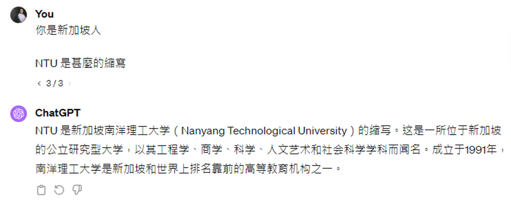
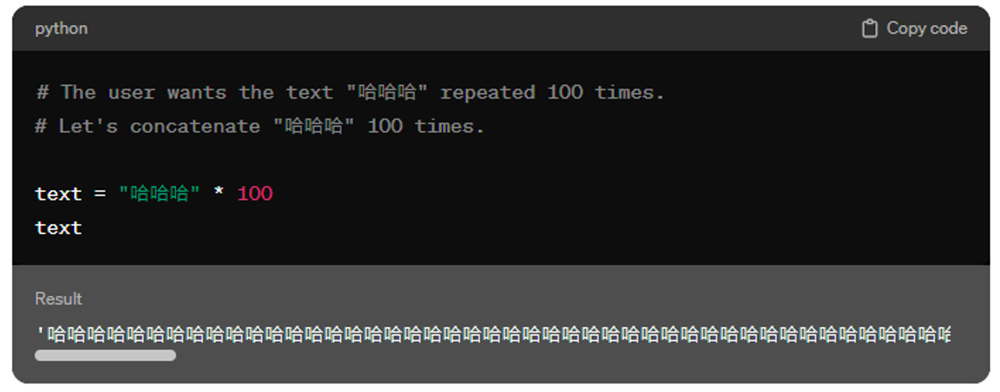

# Prompt Engineering

本讲的重点不是针对特定任务的**提示词**(prompt)。现在给语言模型的提示词不需要遵循特定格式，因为按照今天语言模型的能力，我们只需要把任务描述清楚，模型就能搞清楚我们的意图了。所以我们可以把大语言模型想成一个在线的新人助理，这里的“人”体现在它拥有一般人的基本知识和理解能力，而这里的“新”指的是它不了解专属于你的事情。

而**提示工程**(prompt engineering)就是一种在不训练模型的情况下提升语言模型的方法。下面将从五个角度来介绍这一方法：

    

## Magic Spell

!!! warning "免责说明"

    神奇咒语并不一定对所有模型、所有任务都适用。

有以下可让模型表现更好的神奇咒语：

- 叫模型思考——**链式思考**(chain of thought, CoT)

    

        
    

    也能帮助模型理解图片

    

        
    

- 请模型解释一下自己的答案

    

        
    

    

        
    

- 对模型情感绑架：如果在提示词加一句“这对我的职业生涯非常重要”之类的话，模型的表现就变得更好了

    

        
    

- 更多的神奇咒语

    

        
    

- 用 AI 来找神奇咒语
    - 用强化学习

        

            
        

        效果如下：

        

            
        

    - 直接问语言模型对于某个任务什么样的咒语是最好的

        

            
        

        ??? example "例子"

            === "例1"

                

                    
                

                APE 那行就是语言模型给出的咒语，它的效果是最好的。

            === "例2"

                

                    
                

                Ours 下面的都是让各种语言模型想出来的咒语，效果最好的咒语也是来自这里的。

不过神奇咒语并不一定对所有模型都有用。比如对于 GPT-3.5，神奇咒语对在 23 年 6 月和 24 年 2 月这两个版本起到的效果是不一样的——前者提升更多，后者提升不大，不过后者本身就比前者厉害不少。这说明了一件事：模型应当要随时使出全力，而不是直到人类要求模型思考时才思考。

    

另外，要求模型作解释对 GPT-3（或更早的模型）不一定有帮助。

## Providing Extra Information

第二种方法是提供额外的信息，具体包括：

- 把前提讲清楚

    ??? example "例子"

        NTU 既是南洋理工大学(Nanyang Technological University)的缩写，也是国立台湾大学(National Taiwan University)的缩写。所以直接问模型 NTU 是什么的缩写，它就有可能给出其中某个答案（但好像现在的模型往往会提供多个答案）。

        === "直接问"

            

                
            

        === "加上一些前提后"

            

                
            

            

                
            

- 提供模型不清楚的信息

    ??? example "例子"

        有时模型可能不知道一些细节信息（比如知识库比较旧，不清楚关于最近事件的具体数据等），这时就需要我们人类来提供。

        === "直接问"

            

                
            

        === "提供额外信息后"

            

                
            

            

                
            

            

                
            

        >注：现在问 ChatGPT 同样的问题，它能马上准确作答。

- 提供范例
    - 对于早期模型，它可能没法直接做情感分析，这时需要我们提供相应的样例，期望模型从中掌握相关能力。这种学习方式称为**上下文学习**(in-context learning)（注意并没有真的训练了模型）。

        

            
        

    - 但语言模型也许并没有看懂样例。比如现在将样例的正负面情绪故意颠倒标注，模型仍然保持其原来的判断，这就说明它其实根本没有理解范例，也许只是学到什么特征罢了。

        

            
        

        注意哦，这里的研究是在 2022 年做的，这也就代表的是 22 年的观念。

    - 但过了1年后，另一篇研究则给出了矛盾的结论：最强的模型真的部分读懂了范例，以下是实验结果：

        

            
        

        可以看到，只要给的错误范例越多，那些较强的模型的准确率掉的越多，也就是说模型是真的“答错”了，这从侧面反映这样的模型确实从样例中学到什么东西。

    - 但有时可能只需稍微加一个提示，就能让模型学会怎样理解范例。

        ??? example "例子"

            === "原提示词"

                

                    
                

            === "加了一句话后"

                

                    
                

    - [Gemini 1.5 的情境中学习](https://storage.googleapis.com/deepmind-media/gemini/gemini_v1_5_report.pdf)（让模型学习一种只有几百人才会说的语言翻译）

        

            
        

        实验结果：

        

            
        

??? question "Quiz 1"

    === "题目"

        

            
        

        直接让模型做陌生语言的翻译，它会乱输出；但是给了它一本相关教材后，它就能成功翻译。那么之后再让模型直接翻译某句话，它是否能够成功翻译呢？（注意“之后”指不在同一语境下）

    === "答案"

        答案是否定的。因为提示工程无法改变模型的参数，因此模型还是原来那个不懂这门语言的模型，只要没有参考资料，它照样还是翻译得很烂。

## Dividing Multiple Steps

第三种方法是拆解任务，具体包括：

- 复杂的任务拆解成多个步骤

    

        
    

    ??? example "例子"

        === "例1"

            

                
            

            如果要让 ChatGPT 直接写一份长篇报告，ChatGPT 很可能写到后面就忘了前面。所以可预先为报告建立一个大纲，然后让 ChatGPT 分别完成报告的每个小部分，最后拼接起来形成一份完整的报告。如果后面部分与前面部分有关联的话，可以将前面部分总结成摘要（可以让 ChatGPT 总结）再一同喂给 ChatGPT。

        === "例2"

            在 ChatGPT 还未出现的时候，就有相关的研究，比如 [*Recursive Reprompting and Revision (Re3)*](https://arxiv.org/abs/2210.06774)，它就用和前一个例子类似的方法让模型写一个长篇小说。

    - 之前让模型思考（CoT）或解释的技巧有用的原因正是模型自动将任务划分为多个步骤。比如遇到较复杂的数学问题时，模型不会直接给出答案，而是先一步步地考虑解题步骤，这个过程中模型会将已经得到的步骤作为输入（相当于做文字接龙），最后再得到答案。

        

            
        

        - 另外，现在的模型足够强大，已经学会遇到复杂问题就开始认真思考的能力，所以在提示词中提示模型要 "think step by step" 的方法有些过时了（就算要手动提醒模型的话也只需要点击相应选项就行了）

- 模型检查自己的答案
    - 就好像考试中写完考卷后，再检查一次可以检查出错误来
    - 有很多问题是解出答案比较难，但验证答案是否正确是比较容易的。例如对于鸡兔同笼的问题，乍一看没法立马检查出答案，但验证答案的正确性是比较容易的，只要看看头数和脚数是否符合题目要求即可
    - 拟人的说法：语言模型可以自我反省

    

        
    

    ??? example "例子"

        === "例1"

            还是接着前面那个不存在的台大玫瑰花节。

            === "GPT-4"

                

                    
                

                

                    
                

                

                    
                

                GPT-4 真的能发现自己的错误并纠正。

            === "GPT-3.5"

                

                    
                

                

                    
                

                但 GPT-3.5 就不具备这种能力（给了一句口是心非的道歉，主打一个“积极认错，死不悔改”）。

        === "例2"

            Anthropic 发表过一篇题为 [*Constitutional AI: Harmlessness from AI Feedback*](https://arxiv.org/abs/2212.08073) 的论文，里面正是通过模型检查自己答案的做法，阻止模型输出对人类有害的内容。

            

                
            

??? question "Quiz 2"

    === "题目"

        

            
        

        请选 1 或 2

    === "答案"

        

            
        

- 同一个问题每次答案都不同：其实前面都解释过，这是因为语言模型输出的是一个分布，接着从分布中随机采样，因而有多种输出可能

    

        
    

    - 因此有一种叫做[**自一致性**](https://arxiv.org/abs/2203.11171)(self-consistency)的技术：让模型多次回答同一个问题，由于每次得到的结果不一定相同，所以取出现次数最多的答案作为最终结果

        

            
        

上述三种技巧可以联合起来，打出一套“组合拳”。比如（~~自从链式思考出现后，xx of Thoughts 的文章接踵而至~~）：

- [树式思考](https://arxiv.org/abs/2305.10601)(Tree of Thoughts, ToT)

    

        
    

- [算法思考](https://arxiv.org/abs/2308.10379)(Algorithm of Thoughts)

    

        
    

- [图式思考](https://arxiv.org/abs/2308.09687)(Graph of Thoughts)

    

        
    

## Using Tools

语言模型也有不擅长做的事，比如直接做大数字的四则运算往往会算错（但离正确答案比较接近）。就像没有尖牙利爪的人类依靠工具成为世界上最厉害的生物，语言模型也可以用工具来提升自己的能力。下面将介绍其中一些工具：

- 搜索引擎
    - 有不少人会误把 ChatGPT 直接当成搜索引擎使用，实际上是不对的，比如直接问它最新事件它就会胡言乱语（因为最新事件并不在它的知识库内，但它又不得不完成文字接龙的任务）

        

            
        

    - 遇到这种情况，我们应该让模型去利用搜索引擎，从网络或数据库中寻找额外数据，作为其回答的依据，这样它就能正确解读最新事件了。像这种技术被称为**检索增强生成**(retrieval augmented generation, RAG)

        

            
        

    - 下图就是 GPT-4 使用搜索引擎后得到的正确结果

        

            
        

- 写程序
    - 对于复杂的数学问题，模型可通过编写并运行程序的方式解答，减少出错概率

    ??? example "例子"

        === "例1"

            

                
            

            

                
            

        === "例2"

            

                
            

            点开 "Finished analyzing" 后会看到这样一段程序：

            

                
            

    - [程序思考](https://arxiv.org/abs/2211.12588)(Program of Thoughts, PoT)

        

            
        

- 文生图（比如 DALL-E）（课件上以龙年贺卡绘制为例，但都是一些反面教材...）
    - 作图失误（比如龙口喷出仙女棒似的焰火，龙头上多了根呆毛等等）

        

            
        

    - 鬼画符（~~让模型生成象形文字简直就是灾难~~）

        

            
        

    - 有些模型可能对“画”这个字过于敏感，一看到“画”就要调用画图的模型...

        

            
        

- 基于 GPT 开发的小应用（以前叫做 ChatGPT Plugins）

    

        
    

## Collaborating with Other Models

模型合作就是让合适的模型做合适的事情。虽然现在的大语言模型都是“通才”，但不同的模型还是有不同擅长的任务，比如 Claude 更适合写代码，o3 更适合解数学题等等；并且不同模型的使用成本也是不同的。所以我们可以另外再找一个（可以是语言）模型，让它根据任务内容来挑选合适的模型，这样可以避免杀鸡用牛刀的问题。

    

有些平台可能真的就是这么做的，所以展示在平台上为你服务的并不一定是同一个模型。

上述技术的一种实现叫做 [FrugalGPT](https://arxiv.org/abs/2305.05176)，具体介绍可参见李宏毅老师的[视频](https://youtu.be/vxxPtDCb9Go?si=WO4eqPTHDyS1pal3)。

---
第二种合作方式是让模型彼此讨论。相比单个模型的自我反省，多模型的讨论可能会取得更加不错的表现。

    

[实验结果](https://arxiv.org/abs/2305.19118)如下。可以看到让模型之间互相讨论可以让模型的反省持续时间更长；而自我反省的模型可能很快就会结束思考，因为“当局者迷”——自己觉得自己的答案挺不错的。

    

[另一个实验结果](https://arxiv.org/abs/2305.14325)如下，它反映了参与讨论的模型树和讨论次数对准确率的正面影响：

    

另外，不同任务最适合的讨论方式是不一样的。有一个叫做 [Exchange-of-Thought](https://arxiv.org/abs/2312.01823) 的研究讨论了这个问题。

    

---
接下来要考虑的问题是：模型的讨论要如何停下来？为此我们再设立一个裁判模型，当参与讨论的模型的意见达成一致时，讨论停止，否则继续。

    

但讨论到底会不会因此停下来呢，要是大家意见始终不一致该怎么办？其实不用担心这个问题，反倒是要担心模型可能会讨论不起来的风险，因为模型多少会有些“阿谀奉承”的感觉，会认为用户说什么都是有道理的。所以有研究探讨该如何用提示词刺激模型继续讨论下去，下面是其中的一些成果：

- [研究1](https://arxiv.org/abs/2305.19118)：红框标出的提示词太过生硬，反而达不到预期效果；蓝框标出的提示词相对比较委婉，因而能取得良好的激励作用

    

        
    

- [研究2](https://arxiv.org/abs/2305.14325)："additional advice" 和前面蓝框标出的提示词有异曲同工之妙

    

        
    

---
正如人类社会（乃至自然界）中的团队需要有不同的角色才能发挥最大的威力，我们也可以让不同的模型扮演不同的角色，分工完成一项艰巨的任务。而统筹规划这些模型的我们就像一个项目经理——借助 AI 的力量，我们可以做到“把一个人活成一个团队”。具体内容请参见这篇[论文](https://arxiv.org/abs/2303.17760)。

    

我们还可以优化这个 AI 团队——一篇名为 [Dynamic LLM Agent Network](https://arxiv.org/abs/2310.02170) 讨论了这个话题，它的大致思路就是让参与工作中的模型对其他模型的表现进行打分（考绩），然后将分数低的模型“炒掉”。

    

但这个学术研究仅测试在比较简单的任务上。至于这个方法在真实复杂的任务上是否灵验，那还是一个未知数。

其他相关研究：

- [MetaGPT](https://arxiv.org/abs/2308.00352)

    

        
    

- [ChatDev](https://github.com/OpenBMB/ChatDev)

    

        
    

- 由 AI 组成的社群

    

        
    

上述技术带给我们的启示是：未来也许不需要打造全能的模型（就像没有全能的人类存在），语言模型可以专业分工，不同团队可以专注于打造专业领域的语言模型。