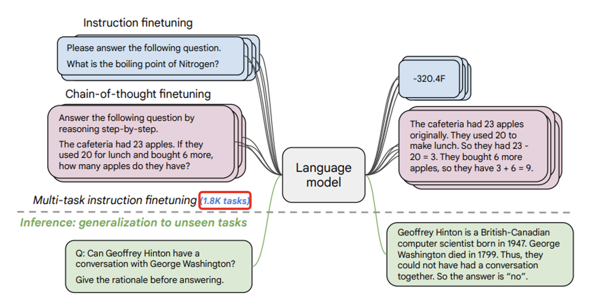

# LLM Training

本讲将详细介绍大语言模型训练的三个阶段（其实已经在[前面](1.md#gpt-3)简单提过一点了）：

1. 自我学习，累积实力——**预训练**(pre-train)（**自监督学习**(self-supervised learning)）
2. 名师指点，发挥潜力——**指令微调**(instruction fine-tuning)（**监督学习**(supervised learning)）
3. 参与实战，打磨技巧——**来自人类反馈的强化学习**(reinforcement learning from human feedback, RLHF)

不要被这些看似高大上的名词唬住了——对语言模型而言，所有的这些阶段都是在学文字接龙，只是训练数据有所不同。

## Pretrain

### Challenge from Parameters

我们知道，训练的过程就是对模型的**优化**(optimization)，而优化的目标就是找到一组好的参数。但有时训练可能会失败（根据已有的训练数据无法找到更好的参数），此时就要重新设定**超参数**(hyperparameter)（即无法通过训练得到，只能人为设置的参数；人们常说的“调参”中的“参”指的是超参数），然后再次训练。由于训练的时候难免会换多组超参数，不断尝试训练，所以**算力**的支持在优化中至关重要。

    

但即便找到了让模型训练成功的超参数，模型在测试中也有失败的可能。这种现象就是机器学习中常见的“**过拟合**”(overfitting)。比如对于下图的猫狗分类器，在训练数据中是 OK 的，但是一做测试就寄了。这是因为分类器从训练数据中学到了错误的参数——把黑色的动物当做猫，把黄色的动物当做狗。所以它在测试中看到黄色的猫时，就将其误判成狗了。

    

所以我们不要想当然地将人类的思维类比到机器学习上——机器学习只管找到的参数有没有符合训练数据，不管学到的参数（对人类而言）是否合理。

要想让模型找到比较“合理”的参数，一种方法是增加训练数据的多样性（比如**数据增强**）。对于上面的例子，就可以往训练数据中放黄色的猫和黑色的狗，这样至少不会让分类器把颜色作为区分猫狗的唯一标准。

    

另一种方法是设置好**初始参数**（注意不是超参数，这些参数会在训练过程中不断更新）。由于模型会基于初始参数的配置来看待训练数据，所以优化后的模型参数可能和初始参数比较接近。通常我们不清楚该如何设置初始参数，所以一种常见做法是随机设置初始参数，这种方法叫做**从头训练**(train from scratch)。

    

但我们也可以自己找到比较好的初始参数，让优化后的参数是比较合理的。我们把这样的初始参数当做给模型的“先验知识”。现在的问题就变成了到哪里去找“好”的参数呢？这便是 LLM 训练的第一阶段。

### Self-Supervised Learning

我们知道语言模型的训练就是让模型学会做文字接龙。那么模型到底需要多少数据才能学会这一本领呢？看模型是否掌握文字接龙的本领，除了看它是否理解**语言知识**外，还要看它是否理解**世界知识**（比如是否符合自然规律等等）。下面便是有关这一标准的[研究](https://arxiv.org/abs/2011.04946)结果：

    

可以看到，相比语言知识，要学到复杂有层次的世界知识，就需要大量的训练数据。我们可以拿任何的文字数据作为训练数据使用，而网络正是大量文字资料的主要来源。根据网上爬下来的大量数据对模型训练的时候，人工的干涉很少，因此我们称这种学习方式为**自监督学习**(self-supervised learning)。

    

虽说“人工的干涉很少”，但这不代表我们不对来自网络的数据做任何处理。在将网络数据作为训练数据前，我们要对数据进行清理，具体包括（这些方法来自 DeepMind 的一项[研究](https://arxiv.org/abs/2112.11446)）：

- **内容过滤**：过滤有害内容
- **文本提取**：去除像 HTML 标签这样对模型训练无意义的符号
- **质量过滤**：去除“低质量”的数据
    - 质量的高低可以用专门的“数据质量”分类器来区别，像 GPT-3，The Pile，PaLM 等模型正是这样做的
    - 可参考的一个标准：高质量的语句在数据训练时会被多次复用

- **数据去重**
    - 因为网络中有很多重复的数据，比如一篇题为 [*Deduplicating Training Data Makes Language Models Better*](https://arxiv.org/abs/2107.06499) 论文指出，像以下这个文段在网络数据中出现了六万多次

        

            
        

- **测试-设置过滤**：为了实验的严谨性

需要注意的是，并不是所有网络数据都能直接拿来作为训练数据使用。随意爬取网络数据可能会涉及到法律问题。

    

### Problem

回顾一下 GPT-1 到 GPT-3 的[发展史](1.md#history)，读者会发现尽管模型的规模和训练数据量翻了好几个量级，但是模型的表现也没有明显提升。而这样的问题在其他大模型中同样存在，如下图所示：

    

那为什么语言模型就不能好好回答我们的问题呢？我们不能怪罪模型，因为训练的时候我们也没有教它回答问题啊。所以语言模型从网络数据中学到很多东西，却不知道使用方法；就好像一个人修炼了上乘内功，却不知道如何运用出来。这个时候，就要进入训练的第二阶段——名师指点，发挥潜力！

## Instruction Fine-tuning

模型接收大量网络数据的洗礼后，接下来应该接收人类老师的教导了——我们提供问题和答案，让模型学会在接收用户提问后能够准确作答的能力。

    

我们称这种学习方式为**监督学习**(supervised-learning)。它的一个缺点是数据标注（为每个问题配对一个正确答案）需要耗费大量人力成本。

也许细心的读者会注意到，图片中的输入输出都包含了 "USER"，"AI"。之所以要特别标注出来，是因为如果不标注的话，训练起来就好像模型自问自答一样，并不是为用户问题而作答。也许读者会想，我们平时用 ChatGPT 的时候怎么没看到这样的标注呢？实际上可能存在这样的标注，只是平台将这种标注设为不可见罢了（下图的 "USER" 和 "AI" 标注是自己写上去的）。

    

---
如果只靠人类老师来教模型的话（即仅使用监督学习），由于人力贵，无法收集很多数据，因此模型可能很容易从训练数据中学到错误的参数（在训练数据中是没有问题，但一测试就露馅了）。

    

    

所以用到第一阶段的参数作为初始参数就相当关键了：先让模型在大量网络数据中做训练（称为**预训练**(pre-train)），用训练得到的参数作为初始参数；再用人类标注好的数据（数量相对较少）来优化模型，这样得到的参数不会和第一阶段的参数相差很多，并且模型不会仅凭简单的规则来做文字接龙。因此，第二阶段被叫做**指令微调**(instruction fine-tuning)。

    

    

为了让两个阶段最终得到的参数相差不大，人们发明了一种叫做**适配器**(adapter)的技术，比如 LoRA。它的做法是保留第一阶段得到的参数，但增加少量额外的参数；第二阶段的训练只更新新增的参数，固定原参数不变。这样两阶段的参数就比较相近了。

    

除 LoRA 外，还有其他不同的适配器（固定或插入不同的参数），下面仅列举一些，不再细讲。

    

由于预训练后的模型参数里蕴含了非常复杂的规则，能做非常复杂的事情，所以再对模型做好优化后就有可能让模型具备很强的“举一反三”能力。比如模型在多种语言上做预训练后，只要教它某一种语言的特定任务后，它就能自动学会其他语言的相同任务（这个例子讲过很多遍了...）。

    

    

### Different Paths of Fine-tuning

微调的路线可分为两类：

- 路线一：打造多个专才模型

    

        
    

    ??? example "例子"

        === "例1"

            

                
            

        === "例2"

            基于 BERT 微调出用于不同任务的模型

            

                
            

            各个 BERT 变体的表现：

            

                
            

- 路线二：直接打造一个通才

    

        
    

    ??? example "例子"

        === "例1"

            李宏毅老师团队早在 19 年就做过相关的[研究](https://arxiv.org/abs/1909.03329v2)（当时只有 GPT-2）。为了让模型成为通才，他们采用的方式是让模型一个任务一个任务地学（[终身学习](../ml/13.md)(life-long learning)）。但这样做的一个问题是模型可能会忘记之前学过的任务。所以这个研究的一大贡献是设计了一种有趣的方法，让模型能够复习它学过的知识。

            

                
            

        === "例2"

            Google 在 21 年尝试打造过一个通才模型，叫做 [FLAN](https://arxiv.org/abs/2109.01652)(Finetuned Langauge Net)，包含了以下训练任务。

            

                
            

            >注：一个月后，Hugging Face 也开发了一个类似的模型 [T0](https://arxiv.org/abs/2110.08207)。

            下图展示了 FLAN 的表现，可以看到它在各项任务中优于 GPT-3：

            

                
            

        === "例3"

            之后，Google 更进一步，用更多的任务（1.8K个任务）来训练模型（研究名为 [*Scaling Instruction-Fine-tuned Language Models*](https://arxiv.org/abs/2210.11416)）。

            

                
            

            实验结果如下：

            

                
            

        === "例4"

            OpenAI 也发表了相关文章 [Instruct GPT](https://arxiv.org/abs/2203.02155)。它在 GPT-3 上做微调后（绿色柱子）的表现比 FLAN 还好。

            

                
            

            之所以微调后的 GPT-3 表现更好，是因为 FLAN 训练数据产生的方式比较死板——采用自然语言推理的前提、假设的模板；而 GPT-3 是一个线上的服务，有真实用户，因此它可以拿真实用户使用语言模型的数据来训练。

            

                
            

            ---
            该研究还揭示了一个道理：指令微调起到画龙点睛的作用。实际上指令微调无需大量数据，比如在这个研究中他们只用了一万多份数据：

            

                
            

            之后也有类似的发现：

            - [LLaMA2](https://arxiv.org/abs/2307.09288)

                

                    
                

            - [LIMA: Less Is More for Alignment](https://arxiv.org/abs/2305.11206)：只用 1k 样例，在 43% 的情况下其表现不低于 GPT-4

---
接着例4的发现——我们能否自己做指令微调呢？答案是不能，因为虽然这些研究表明数据量可以不大，但我们手边可没有高质量的训练数据啊。所以有些人想到了另一个办法：以 ChatGPT 为师，即对 ChatGPT 做逆向工程。下面是 [Self-Instruct](https://arxiv.org/abs/2212.10560)给出的具体步骤：

    

当然，这种方法不一定有效，也有相关研究（[The False Promise of Imitating Proprietary LLMs](https://arxiv.org/abs/2305.15717)）对其提出质疑。

另外，以 ChatGPT 为师还有一定的风险——你也许违背了 OpenAI 的用户使用条款。

    

### Open Source Models

现在即便有了来自 ChatGPT 的高质量的数据用于指令微调，但我们仍然没有自己的初始参数，因为 OpenAI 和 Google 的模型基本上是闭源的（~~不过最近 OpenAI 公布了[开源模型](https://github.com/openai/gpt-oss)，时隔 6 年终于 open 了~~）。这便是开源模型登场的时候了。下面就以 Meta 的 LLaMA 为例展开介绍（~~课程开设于24 年上半年，当时国内开源模型可能还没那么知名~~）（[LLaMA 1](https://arxiv.org/abs/2302.13971)，[LLaMA 2](https://arxiv.org/abs/2307.09288)）。

    

下面是一些基于 LLaMA 微调后的模型：

- [Alpaca](https://crfm.stanford.edu/2023/03/13/alpaca.html)
- [Vicuna](https://lmsys.org/blog/2023-03-30-vicuna/)

    

还有更多！

    

>[图片来源](https://arxiv.org/abs/2303.18223)

## RLHF

第三阶段是让模型进入实战，用到的技术是**来自人类反馈的强化学习**(RLHF)。这里的“人类反馈”就是我们在用大模型时看到模型输出下面的👍和👎。收集到足够多的反馈后，未来再对模型参数进行微调。

    

RL 大致要做的就是通过微调参数，让输出正确答案的概率更高。具体原理可阅读笔者之前的[强化学习笔记](../ml/11.md)。

    

### Insturction Fine-tuning v.s. RLHF

从人类产生训练数据的角度看，RLHF 相比指令微调更省力，因为后者需要大量标注数据，很耗人力；而前者只需对模型的输出提供反馈即可，相对比较轻松。

    

并且有时人类不容易构造正确答案，但是容易判断答案的好坏，这也是 RLHF 的一大优势。

    

---
另外，从机器学习的角度看：

- 指令微调
    - 模型要学的就是如何接下一个字
    - 假设每次接龙都是对的，那么模型生成的结果就会好
    - 所以到目前为止，模型对于生成的结果没有全局的考虑
- RLHF
    - 模型进入新的“思考模式”
    - 学习对生成结果做全局考虑
    - 此时，即便每次接龙都是对的，结果也不一定是最好的

### Language Model v.s. AlphaGo

将语言模型和 AlphaGo 做比较，你会发现两者有不小的相似性。

    

展开来看：

    

>注：为了简化说明，此处不考虑多轮对话。

所以，就从它们一连串的输出结果来看，两者看起来还是很像的。虽然 AlphaGo 下围棋的每一步是分类问题，但整体上看也是一种生成式学习。

    

语言模型和 AlphaGo 之所以有这些相似性，是因为：

- AlphaGo 根据棋谱学习，人类老师下哪里就跟着下哪里

    

        
    

- 语言模型在第一阶段（预训练）和第二阶段（指令微调）的时候，也是跟着人类老师说的做

AlphaGo 如果仅凭棋谱学习的话，那也只能打赢一般的选手。如果需要击败顶尖高手的话，需要借助 RL 的力量。具体来说：

- 如果 AlphaGo 完成“棋局接龙”后发现自己赢了，那就会得到正反馈，之后就要提高产生这些走法的概率
- 如果输的话就降低这些走法的概率

>可直接从围棋规则中判断输赢。

    

语言模型的 RL 也是类似的过程。不过反馈机制和下围棋很不一样，需要模型产生多个答案后，再由人类对答案的好坏做个排序，这也是比较常用的方式。之所以要模型产生多个答案，是因为仅看单个答案，人类很难判断其好坏。

    

 
### Reward Model

不过人类的时间精力有限，能提供的反馈也是有限的。所以对语言模型而言，如何有效利用人类反馈是一个关键的议题。一种做法是根据人类的反馈，创建一个虚拟的人类，语言模型在 RL 时就直接问这个虚拟的人类，而不是真的人类。这种“虚拟的人类”就是**奖励模型**(reward model)。

训练奖励模型的过程为：先取得一些人类的反馈；然后奖励模型将语言模型的答案作为输入，其输出应满足人类反馈的约束（比如答案 A 的分数大于答案 B 的分数）。

    

训练好奖励模型后，人类就只采纳那个能在奖励模型中得分最高的那个答案。

    

---
但现在奖励模型更常见的用法是让语言模型直接根据奖励模型学习，即直接将语言模型的输出丢给奖励模型，看奖励模型给出什么样的分数。如果分数高，通过微调参数让语言模型输出这个答案的概率变大，反之则变小。

    

    

---
回到前面 [Instruct GPT](https://arxiv.org/abs/2203.02155) 的研究，当时我们没有考虑最高的那根柱子，它对应的就是 RL 后的模型表现。而右图的曲线图表明，即便是参数量较少的模型，在 RL 后其表现仍能胜过参数量大的模型。

    

不过也有[研究](https://arxiv.org/abs/2009.01325)表明，模型过度向“虚拟人类”（奖励模型）学习是有害的（准确率不升反降）。右图展示的是过度向“虚拟人类”学习后模型给出的摘要，可以看到输出的内容乱七八糟，且经常出现 "???"，"pls" 等符号（可能是奖励模型给出现这些符号的摘要打高分了）。

    

事实上，今天 ChatGPT 很多不尽人意的表现，也有可能是过度跟“虚拟人类”学习的结果。John Schulman（OpenAI 的联合创始人）在 ICML 2023 上的讲话指出了这个问题。

    

由于向“虚拟人类”学习方法的缺陷，因此有人尝试新的思路，发明了新的算法。下面是其中的一些研究成果，其有效性还尚待时间的验证。

- [DPO](https://arxiv.org/abs/2305.18290)

    

        
    

- [KTO](https://arxiv.org/abs/2402.01306)

    

        
    

---
未来（也许现在就可以），当 AI 足够强大时，我们可以将 RLHF -> RLAIF，也就是让 AI 代替人类对语言模型提供反馈。

    

这里的 AI 也可以就是要进行 RL 的语言模型自身，因为语言模型具备反省的能力（[上一讲](2.md#magic-spell)介绍过）。

相关研究：

- <https://arxiv.org/abs/2212.08073/>
- <https://arxiv.org/abs/2304.03277/>
- <https://arxiv.org/abs/2309.00267/>
- <https://arxiv.org/abs/2401.10020/>

### Difficulty

强化学习的一大难题是：什么是“好”这件事没有一个标准的答案。“好”的概念是多层次的，它既可以指有用性，也可以指安全性，还可以是其他的含义。

    

[LLaMA 的做法](https://arxiv.org/abs/2307.09288)就是同时考虑有用性和安全性——训练了两个模型，分别考虑这两个指标。但不同的模型有不同的评估标准。

    

事实上有时人类自己也都无法判断好坏的状况。

    

