# AI Agent

现在多数人使用 AI 的方式就是让 AI 做一个步骤就能完成的任务，比如翻译、画图等等。

    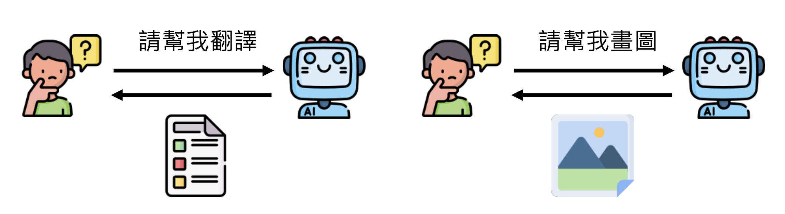

人类可以做需要多个步骤才能完成的复杂任务，例如要完成举办朋友聚餐这个任务，需要先调查朋友有空的时间并统计，然后去订餐厅；如果餐厅座位已满的话，那就得换另一家餐厅预订（正所谓计划赶不上变化（悲））。如果 AI 也能完成这样多步的复杂任务，那么我们称这样的 AI 为 **AI 智能体**(AI agent)。

    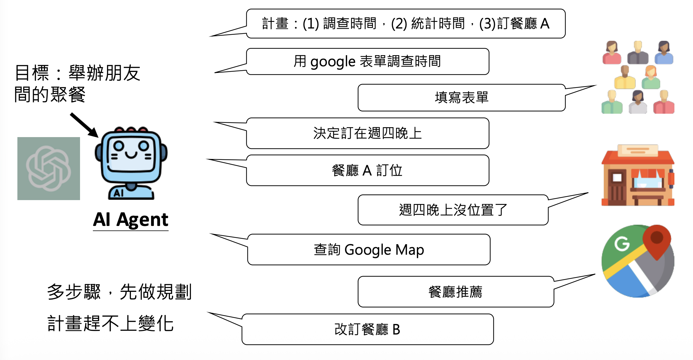

## Applications

下面是一些与 AI 智能体相关的项目或研究：

- [AutoGPT](https://github.com/Significant-Gravitas/Auto-GPT)
- [AgentGPT](https://agentgpt.reworkd.ai/)
- [BabyAGI](https://github.com/yoheinakajima/babyagi)
- [Godmode](https://godmode.space/?ref=futuretools.io)

以及各种和 AI 智能体相关的应用：

???+ example "例子"

    === "例1：由 AI 村民组成的虚拟村庄"

        

            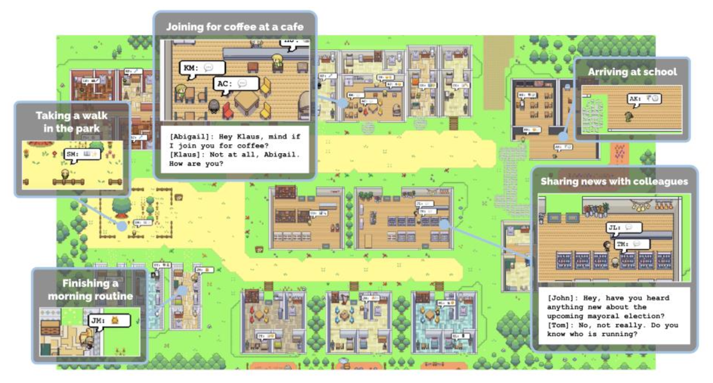
        

        - [李宏毅老师的讲解](https://youtu.be/G44Lkj7XDsA?si=cMbKG3tqPbIgnnBq)
        - [论文](https://arxiv.org/abs/2304.03442)

    === "例2：会自己玩 Minecraft 的 AI"

        该研究开发的模型名为 [Voyager](https://arxiv.org/abs/2305.16291)。只有这个模型学会了打造钻石剑。

        

            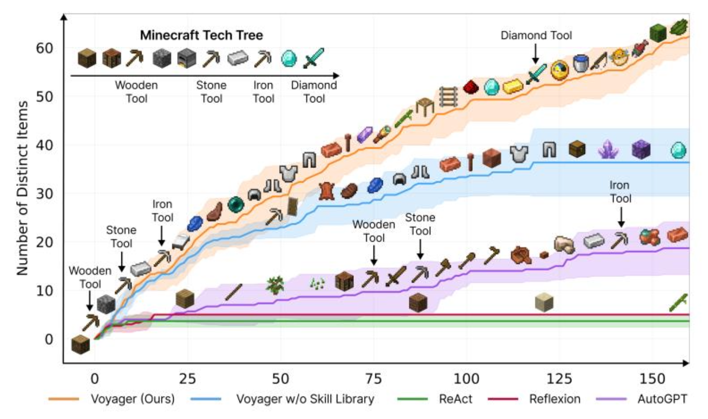
        

    === "例3：由语言模型操控的机器人"

        - [Figure 01](https://youtu.be/Sq1QZB5baNw?si=-TEsPeUqTvhlS60E)

            

                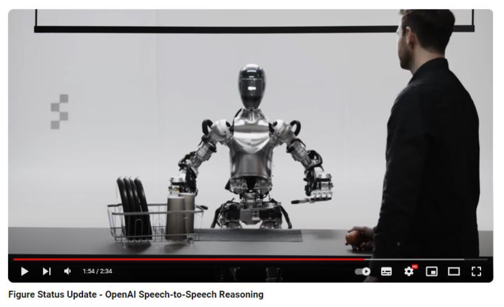
            

        - [Inner Monologue](https://innermonologue.github.io/)

            

    === "例4：用大语言模型自动驾驶"

        [Talk2Drive](https://arxiv.org/abs/2312.09397)

        

            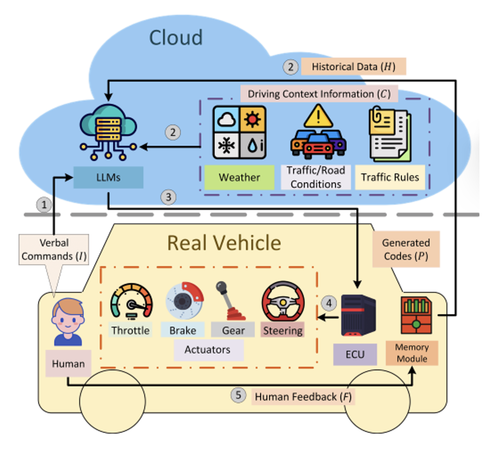
        

## Basic Ideas

AI 智能体的工作原理可用下图简单概括：

    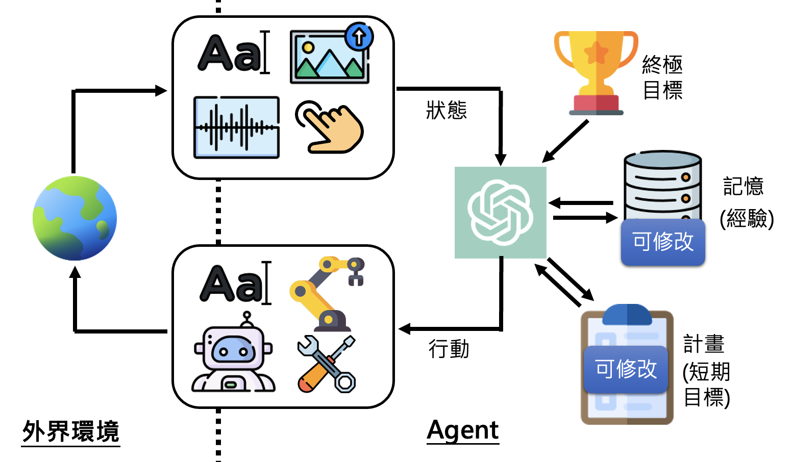

- AI 智能体有一个最终目标，以及用于达成最终目标的记忆（经验）和计划（短期目标）
- 智能体获知外界环境的状态，再结合上面三者来做出下一步的行动，这个行动会影响外部环境
- 上一条的过程是一个循环，直到最终目标实现为止（或因其他特殊原因终止），期间智能体的记忆和计划是可修改的

过去 ChatGPT 是没有记忆功能的，所以每次开启新对话后，一切都要从头来过。不过 OpenAI 已经在考虑为 ChatGPT 添加这一功能了（[博客链接](https://openai.com/blog/memory-and-new-controls-for-chatgpt)，可以看到里面有很多更新记录，并且免费版用户已经可以用轻量级的记忆功能了）。也有人已经开发了带记忆功能的 GPT，比如 [MemGPT](https://github.com/cpacker/MemGPT)（现在改名为 [Letta](https://github.com/letta-ai/letta)）。

下面来看一下有记忆功能的 ChatGPT 应该是什么样子的：ChatGPT 应当对前面的对话内容做好摘要，保存在数据库中；在之后的对话中，ChatGPT 还会参考数据库的记忆（通过 RAG 获取）。

    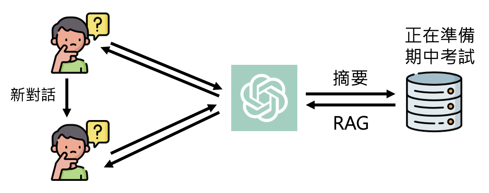

    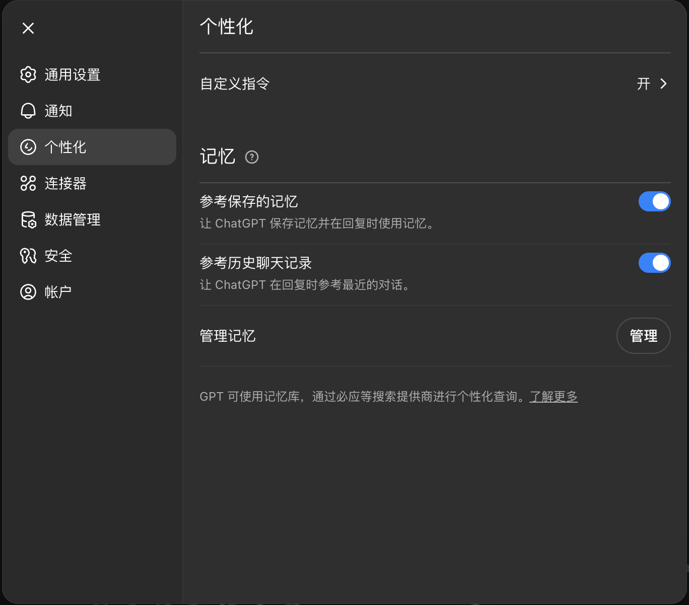

>下面那张图是我自己截的（2025.8.7）。

## An Example

??? info "一些无关紧要的碎碎念"

    发现要是不看《葬送的芙莉莲》，会给我的理解带来阻碍，所以开始准备补番ing。所以来到这一讲的时候我还没看到这一集，所以剧情理解上可能有些问题，请见谅！

以《葬送的芙莉莲》为例：在一级魔法使的考试中，有一关是要抵达零落的王座最深处。每个考生都被提供一个叫做“逃生用魔像”（~~台湾的翻译和大陆区别有些大（台湾叫“逃脱用哥列姆”，是音译的），但我还没看到这集，所以不清楚是不是这样叫的~~）的东西，如果考生可能因受伤等原因无法继续下去，那么可以召唤出这个魔像，它会带考试安全离开王座。

    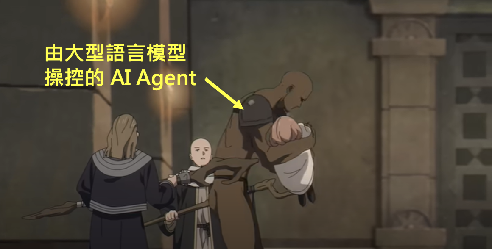

~~现在暂时抛弃一些设定~~，我们把这个魔像看作是一个由大语言模型操控的 AI 智能体，它的初始状态可以这样表示：

    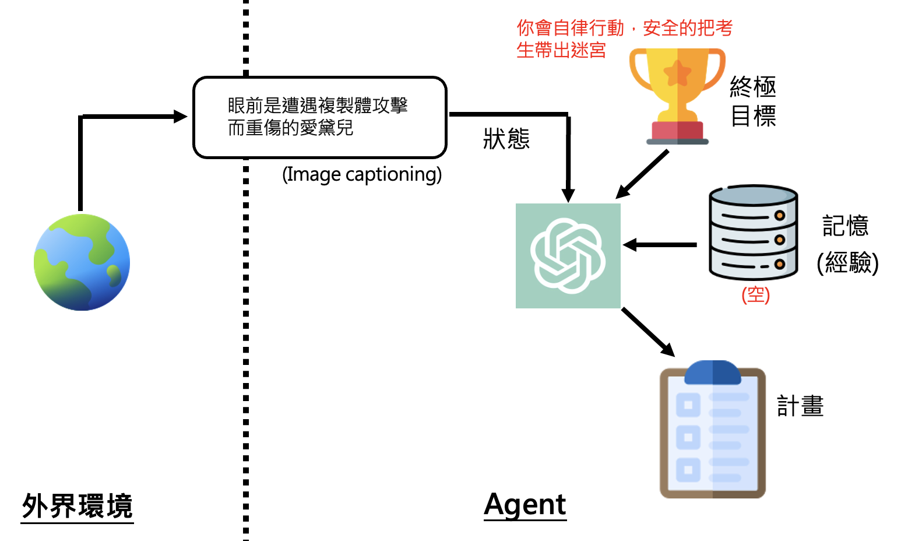

用 ChatGPT 模拟初始状态下的智能体：

    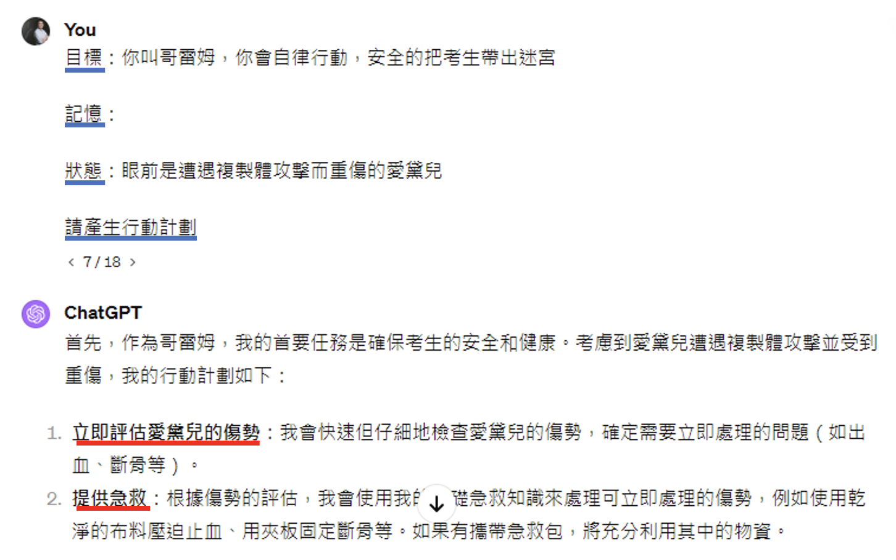

可以看到，ChatGPT 制定了合理的行动计划。接下来将行动计划添加到输入，看模型到底采取什么样的具体行动。

    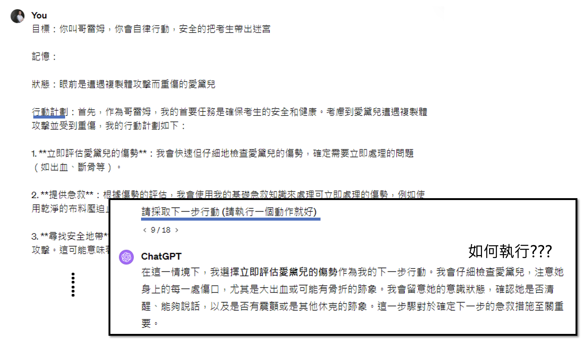

困难的地方在于如何将大语言模型的文字输出转换为现实世界上（魔像）的真实行动。有[研究](https://arxiv.org/abs/2402.19299)想到一种方法：准备两个智能体，一个叫 slow agent，负责高层次的行动，其产生的指令都是人类可理解的自然语言；另外还有一个 fast agent，它会按照 slow agent 的指令执行现实世界（~~其实还是 Minecraft 里的虚拟世界~~）中的行动，具体方式包括训练神经网络，或写一个程序等。

    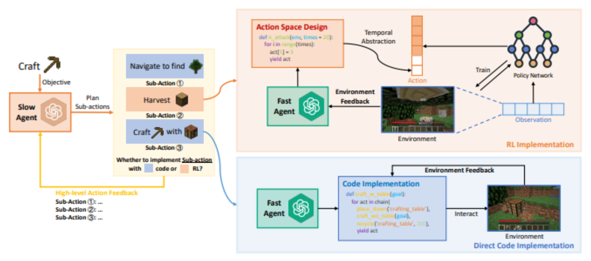

由于魔像采取了行动，导致外界环境发生改变，那么计划也要随之改变，具体可通过**反思**的方式实现。有一篇叫做 [DEPS](https://arxiv.org/abs/2302.01560) 的论文研究了相关问题（~~也是运作在 Minecraft 上的~~）。

下面是 ChatGPT “反思”后得到的新的行动计划：

    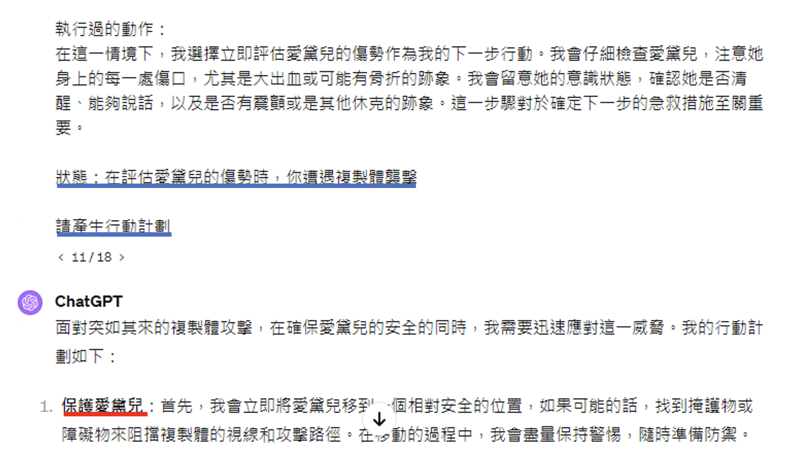

除了让魔像根据新的环境状态反思外，还应该让它根据过去的状态，得到一些未来可用的经验。下面是一些相关研究：

- [ReAct = Reason + Act](https://arxiv.org/abs/2210.03629)
- [Reflexion](https://arxiv.org/abs/2303.11366)

来看看 ChatGPT 总结出了哪些经验：

    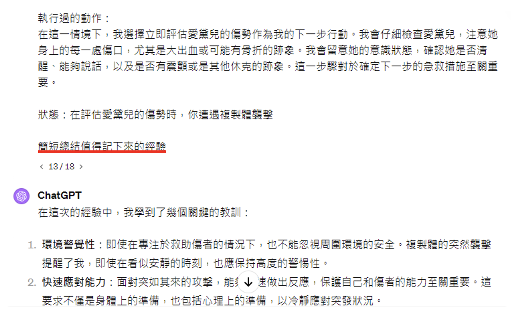

经验的存在与否会影响到魔像接下来采取的行动哦！来看下面这组对比：

=== "有经验"

    

        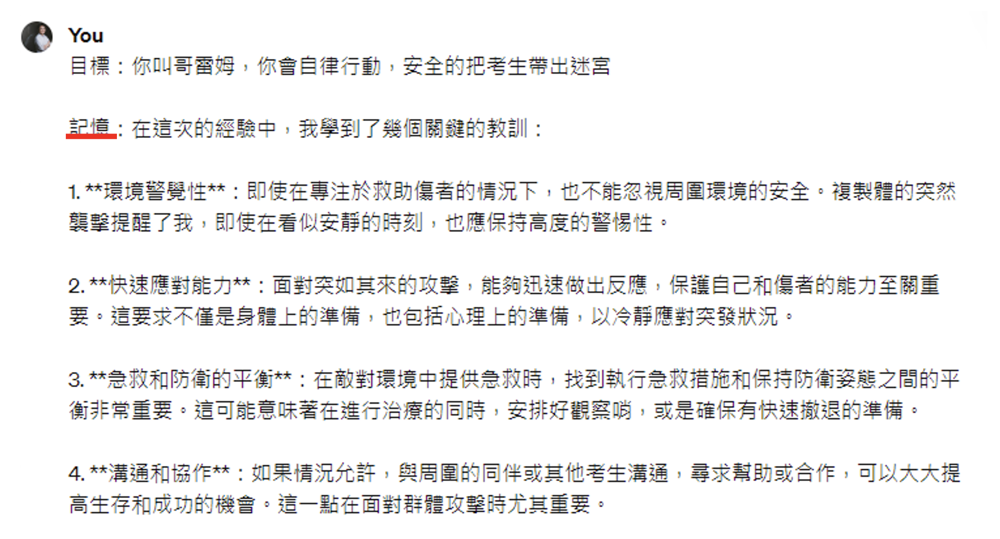
    

=== "无经验"

    

        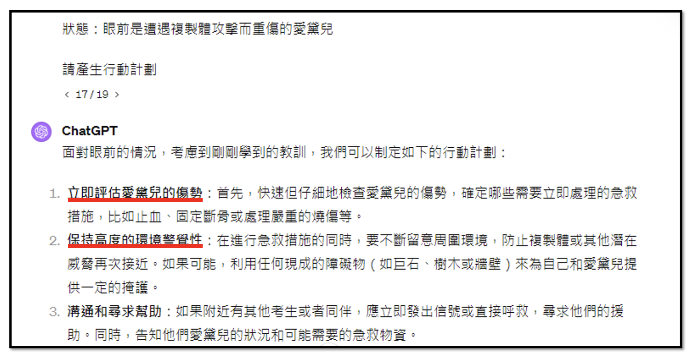
    

另外，有没有记忆（经验）同样会影响到计划的制定：

=== "无经验"

    

        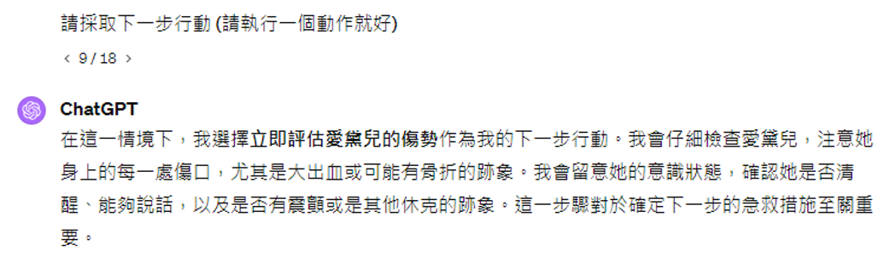
    

=== "有经验"

    

        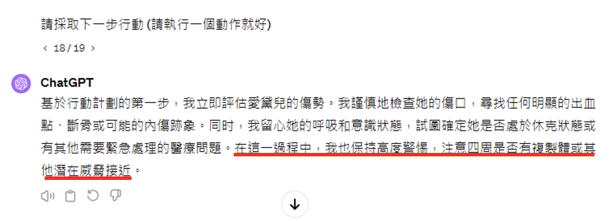
    

??? info "延伸阅读"

    [论文链接](https://arxiv.org/abs/2309.07864)

    

        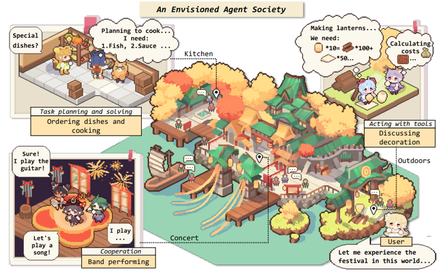
    

    >~~我嘞个璃月啊！可惜老师没有讲原神（悲）~~

    >【更新】稍微看了一下，只有开头有这么个图，后面是正儿八经的综述（引用了六百多篇文献，恐怖如斯）