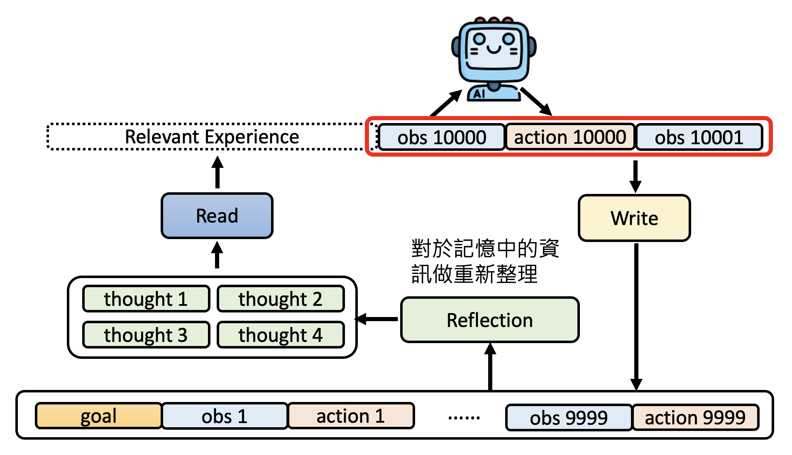

# AI Agent

现在多数人使用 AI 的方式就是让 AI 做一个步骤就能完成的任务，比如翻译、画图等等。

    

人类可以做需要多个步骤才能完成的复杂任务，例如要完成举办朋友聚餐这个任务，需要先调查朋友有空的时间并统计，然后去订餐厅；如果餐厅座位已满的话，那就得换另一家餐厅预订（正所谓计划赶不上变化（悲））。如果 AI 也能完成这样多步的复杂任务，那么我们称这样的 AI 为 **AI 智能体**(AI agent)。

    

## Basic Ideas

AI 智能体的工作原理可用下图简单概括：

    

- AI 智能体有一个最终目标，以及用于达成最终目标的记忆（经验）和计划（短期目标）
- 智能体获知外界环境的状态，再结合上面三者来做出下一步的行动，这个行动会影响外部环境
- 上一条的过程是一个循环，直到最终目标实现为止（或因其他特殊原因终止），期间智能体的记忆和计划是可修改的

这个过程和[**强化学习**](../ml/11.md)(reinforcement learning)是类似的（比如下图所示的 AlphaGo）。但强化学习的局限性在于它只能让模型学会完成一项特定的任务，不具备泛化能力。

    

基于 LLM 的 AI 智能体实际上做的也是某种“接龙”：目标 -> 观察1 -> 行动1 -> 观察2 -> 行动2 -> ...

    

相比传统的智能体，基于 LLM 的智能体的优势是能创造出近乎无限的可能（是不局限在某个特定任务上），并且可以使用各类工具来辅助自己完成任务。比如面对一个编译错误，传统的智能体只能得到一个负反馈，至于为什么得到负反馈是无法理解的；而 LLM 智能体能够直接阅读日志，从而发现问题所在。

    

## Applications

下面是一些与 AI 智能体相关的项目或研究：

- [AutoGPT](https://github.com/Significant-Gravitas/Auto-GPT)
- [AgentGPT](https://agentgpt.reworkd.ai/)
- [BabyAGI](https://github.com/yoheinakajima/babyagi)
- [Godmode](https://godmode.space/?ref=futuretools.io)

以及各种和 AI 智能体相关的应用：

???+ example "例子"

    === "例1：由 AI 村民组成的虚拟村庄"

        

            
        

        

            
        

        - [李宏毅老师的讲解](https://youtu.be/G44Lkj7XDsA?si=cMbKG3tqPbIgnnBq)
        - [论文](https://arxiv.org/abs/2304.03442)

    === "例2：会自己玩 Minecraft 的 AI"

        该研究开发的模型名为 [Voyager](https://arxiv.org/abs/2305.16291)。只有这个模型学会了打造钻石剑。

        

            
        

        ---
        还有人让 AI 操控 Minecraft 里的 NPC：

        

            
        

        [视频链接](https://www.youtube.com/watch?v=2tbaCn0Kl90)

    === "例3：由语言模型操控的机器人"

        - [Figure 01](https://youtu.be/Sq1QZB5baNw?si=-TEsPeUqTvhlS60E)

            

                
            

        - [Inner Monologue](https://innermonologue.github.io/)

            

    === "例4：用大语言模型自动驾驶"

        [Talk2Drive](https://arxiv.org/abs/2312.09397)

        

            
        

    === "例5：让 AI 操控电脑"

        

            
        

        - OpenAI 的 Operator（现在叫做 [ChatGPT Agent](https://openai.com/index/introducing-chatgpt-agent/)）

            

                
            

        - World of Bits: An Open-Domain Platform for Web-Based Agents (ICML, 2017)
            - 早在 2017 年就有这样的探索了，但当时的智能体只能在布局简单的网页上进行操作

            

                
            

        - [Mind2Web](https://arxiv.org/abs/2306.06070)

            

                
            

        - [WebArena](https://arxiv.org/abs/2307.13854)

            

                
            

        - [VisualWebArena](https://arxiv.org/abs/2401.13649)

            

                
            

    === "例6：用 AI 训练 AI"

        

            
        

        相关研究：

        - [AIDE: The Machine Learning Engineer Agent](https://arxiv.org/abs/2502.13138)
        - [AutoKaggle: A Multi-Agent Framework for Autonomous Data Science Competitions](https://arxiv.org/abs/2410.20424)

    === "例7：用 AI 做研究"

        

            
        

        [链接](https://research.google/blog/accelerating-scientific-breakthroughs-with-an-ai-co-scientist/)

一般的 LLM 智能体做的都是目标 + 观察 + 行动的接龙，或者说是一种回合制的互动。为了迈向更加真实的互动环境，智能体应该学会实时互动，即能随时根据当前的观察调整行动。

    

???+ example "例子：语音对话"

    

        
    

    有[论文](https://arxiv.org/abs/2503.04721v1)对现有的具备互动能力的语音模型做了一个比较完整的综述，感兴趣的读者可点击链接阅读。

    

        
    

## Important Capabilities

### Adjusting Actions by Experience

智能体在行动前，除了遵守最终目标和观察当前环境外，还会参考过往的历史行动，以采取更合理的行动。

    

如果行动次数少倒还好，如果行动次数太多的话，智能体可能因为记得太多，反而不知道该怎么行动了。这就像某些得了[超忆症](https://zh.wikipedia.org/zh-hans/%E8%B6%85%E5%BF%86%E7%97%87)(hyperthymesia)的人群（不到百人），他们往往陷入过去的回忆，而难以进入抽象的思考。

    

为避免这种情况发生，我们将智能体过去的行为存放在专门的内存中（或叫做数据库）。在下次采取行动时，智能体借助一个**读模块**，仅读取和即将要采取的行动相关的经验，并将其放在当前观察之前，再做“接龙”。实际上这个读模块采用的技术就是一种 **RAG**（检索增强生成(retrieval augmented generation)）。

    

??? example "相关研究：[StreamBench](https://arxiv.org/abs/2406.08747)"

    [官网](https://stream-bench.github.io/)

    

        
    

    LLM 智能体采取行动的方法和前面讲的是类似的：

    

        
    

    实验结果如下（横轴表示智能体要回答的问题数，一共 1750 个问题）：

    

        
    

    - Zero-shot 的意思是回答每个问题都是独立的（也就是说不会参考之前回答过的问题），可以看到此时正确率明显偏低
    - Few-shot 的意思是让智能体至多看 5 个固定的随机问题，此时正确率稍微提高些
    - 剩下两条曲线都是作者自行设计的。智能体利用 RAG 挑选最有价值的问题作为参考，因此正确率显著提高。具体原理请参见论文原文

    这篇论文还有一个发现：给智能体负反馈是没有帮助的。以下是相关实验结果，可以看到负反馈反而会降低智能体表现，而有正有负的反馈也不一定能提升智能体表现。反倒是全部给正反馈的智能体表现最好，所以这带给我们的启示是，要讲清楚让智能体“做什么”，而不是“不做什么”。

    

        
    

另外，并不是所有行动都是有意义的，一些鸡毛蒜皮的小事就没有记录下来的必要。因此我们可以引入一个**写模块**，专门记录有意义的行动及其观察。

    

我们还可以再引入一个**反思(reflection)模块**（文献上没有固定的名称，这里权且叫做“反思”吧）。它负责对内存中的数据做重新整理，之后智能体在行动前还会参考反思模块给出的思考。

    

相关研究：

- [GraphRAG](https://arxiv.org/abs/2404.16130)
    - 反思模块的产出形式是一种**知识图谱**(knowledge graph)

- [HippoRAG](https://arxiv.org/abs/2405.14831)
    - Hippo 取自海马体(hippocampus)（人脑上负责记忆的地方）的英文

??? example "例子"

    过去 ChatGPT 是没有记忆功能的，所以每次开启新对话后，一切都要从头来过。不过 OpenAI 已经在考虑为 ChatGPT 添加这一功能了（[博客链接](https://openai.com/blog/memory-and-new-controls-for-chatgpt)，可以看到里面有很多更新记录，并且免费版用户已经可以用轻量级的记忆功能了）。也有人已经开发了带记忆功能的 GPT，比如 [MemGPT](https://github.com/cpacker/MemGPT)（现在改名为 [Letta](https://github.com/letta-ai/letta)）。

    下面来看一下有记忆功能的 ChatGPT 应该是什么样子的：ChatGPT 应当对前面的对话内容做好摘要，保存在数据库中；在之后的对话中，ChatGPT 还会参考数据库的记忆（通过 RAG 获取）。

    

        
    

    

        
    

    >下面那张图是我自己截的（2025.8.7）。

更多研究：

- [MemGPT](https://arxiv.org/abs/2310.08560)

    

        
    

- [Agent Workflow Memory](https://arxiv.org/abs/2409.07429)

    

        
    

- [A-MEM: Agentic Memory for LLM Agents](https://arxiv.org/abs/2502.12110)

    

        
    

### Using Tools

使用工具时，只需知道工具怎么用，而无需了解内部运作原理。而在遇到无法直接解决的问题时，智能体可以借助各种工具来完成，包括搜索引擎、脚本程序，甚至其他 AI（相比智能体所用的 LLM 具备不同能力，也许规模更庞大，成本更高）。我们可以将这些工具看作是一个个函数，智能体使用这些工具时就是在“**调用函数**”(function call)。

下面给出其中一种使用工具的流程：提示词分为**系统提示词**(system prompt)和**用户提示词**(user prompt)，其中前者要告诉 LLM 如何使用工具以及特定工具的使用方式，之后 LLM 每次输出前都会参考这段提示词；而后者仅存在一场对话中，是用户的直接诉求。

    

不过提示词只是一串文字，不能真的调用函数，具体的函数还得智能体开发者自己设置。

    

智能体最常用的工具之一是搜索引擎，本质上也是一种 RAG。

    

还可以把其他 AI 作为工具使用，比如用在语音领域中。

    

??? example "例子"

    左边是智能体可用的和语音相关的工具，而右图展示了模型使用各类语音工具解决问题的表现。

    

        
    

    借助工具，智能体给出了正确的回答：

    

        
    

    在 Dynamic SUPERB 上的结果如下，可以看到使用语音工具的模型能够吊打其他专门处理语音的模型。

    

        
    

    >[论文链接](https://arxiv.org/abs/2407.09886)

如果可选的工具非常多，智能体可能不知道该如何选择。这时我们可采取和前面类似的方法：把关于各类工具的描述存储在智能体的内存中，之后智能体在行动前，会借助一个工具选择模块，负责挑选和当前任务相关的工具。

    

相关研究：

- <https://arxiv.org/abs/2310.03128/>
- <https://arxiv.org/abs/2502.11271/>

我们甚至还可以让模型自己打造合适的工具。

    

相关研究：

- [TroVE](https://arxiv.org/pdf/2401.12869)
- [LATM](https://arxiv.org/abs/2305.17126)
- [CREATOR](https://arxiv.org/abs/2305.14318)
- [CRAFT](https://arxiv.org/abs/2309.17428)

---
但有时过度相信工具反而会导致犯错，比如 Google 搜索的 AI Overview 就是 Gemini 利用 RAG 得到的结果，其中包含的信息不一定是对的：

    

因此，智能体不应该完全相信工具，而要有自己的判断力。实际上，现在强大的 LLM 多数都具备一定的判断力。如果看到太过离谱的结果，LLM 会发现其中的异常之处并指出。

    

LLM 在做 RAG 时，模型的内部知识(internal knowledge)和来自外界的外部知识(external knowledge)处在一个相互竞争的状态，那么什么样的外部知识比较容易说服 LLM 呢？下面是一些相关研究：

- <https://arxiv.org/abs/2404.10198v1/>

    

        
    

    - 当原来的上下文改动不是很大的时候，LLM 更容易推翻它先前的想法
    - LLM 认可在上下文中呈现的检索到的信息的可能性和 LLM 对回答的自信程度呈负相关，也就是说它对自己的答案越不自信，越容易相信 RAG 给出的信息

- <https://arxiv.org/abs/2401.11911/>

    

        
    

    - 假如让一个 LLM 只能从另外的 LLM 和人类回答中选择一个答案的话，LLM 倾向于选择另一个 LLM 的答案
    - 但如果不强求 LLM 给出这两个答案中的一个，那么它就会给出第三个答案

- <https://aclanthology.org/2024.blackboxnlp-1.24/>
    - 文档的元数据也能影响 LLM 的判断：LLM 更相信新文章，但来源没有影响

        

            
        

    - 文档的布局也会影响 LLM 的判断，比如 Claude 3 更相信下面的文章，尽管两者文本内容完全一致

        

            
        

        - 根源不一定是布局的美观程度，也许是 Claude 更喜欢绿色（这些都只是猜测罢了，具体原因尚待探究）

不过，就算工具是可靠的，也难以保证 LLM 不会犯错，比如早些年的 ChatGPT 可能会将所有相关资料生硬地整合在一起，反而形成了错误的信息：

    
    

综上，我们需要把握好使用工具和模型本身能力之间的平衡。用工具解决问题不一定总是有效率的，比如做简单的四则运算，小学生都能做到心算，用计算器做反而不见得更快。

### Making Plans

如果不加任何干涉，LLM 智能体做出的行动也许只是一种反射性的输出，没有对未来的规划。但我们可以明确让模型做计划

    

相关研究：[Plan-and-Solve Prompting: Improving Zero-Shot Chain-of-Thought Reasoning by Large Language Models](https://arxiv.org/abs/2305.04091)

但天有不测风云，计划往往赶不上变化，智能体亦是如此。比如在下围棋时，当对手的出招超出智能体的预期时，原来的计划就都作废了，需要根据当前环境重新制定计划。

    

现在的 LLM 基本上都有制定计划的能力，下面就举了一些例子：

- 让 GPT-4o 制定成为百万粉 Youtuber 的计划

    

        
    

- <https://arxiv.org/abs/2201.07207/>：让模型将任务拆解成多个步骤来完成

    

        
    

- PlanBench：模型做计划的基准测试
    - 论文链接：<https://arxiv.org/abs/2206.10498/>，<https://arxiv.org/abs/2305.15771/>
    - 简单的测试，但也许模型在根据网络数据训练时就已经学会怎么做了

        

            
        

    - 所以里面还包含了一些变态难的测试，其中一个叫做“神秘方块世界”的测试，首先给出一系列复杂的规则：

        

            
        

        然后给出模型要达成的目标：

        

            
        

        下面是实验结果。整个表格被分为四部分，第一部分是正常方块世界的结果，此时 GPT-4 还有 34% 左右的正确率；第三部分是神秘方块世界的结果，此时 GPT-4 的正确率显著降低。

        

            
        

        不过这是 2023 年的结果。到了 2024 年，o1 的出现打破了大多数主流模型都无法逾越的阻碍，取得了很好的成绩：

        

            
        

        >[论文链接](https://arxiv.org/abs/2409.13373)

- [TravelPlanner](https://osu-nlp-group.github.io/TravelPlanner/)：顾名思义，这是一个关于 LLM 做旅游规划的基准测试

    

        
    

    - 实验结果（~~非常的惨~~）如下，其中上半部分是让模型自己调用工具的结果，下半部分是把所有数据提供给模型后的结果

        

            
        

    - 这是其中两个失败案例，一个是在飞机上参观了多个景点，一个是预算压不下来

        

            
        

    - [有人](https://arxiv.org/abs/2404.11891)想出了一种解决方案：让一个现成的解决者(solver)（受程序操控）来约束 LLM，迫使 LLM 遵守规则

        

            
        

        最新的实验结果如下。可以看到，模型有机会做出不错的行程规划。

        

            
        

---
我们还可以强化 AI 智能体做计划的能力，具体来说可以让智能体在做规划之前，和实际环境做做互动看，尝试所有可能的行为（类似算法中的暴力搜索）。

    

但有时这棵搜索树的路径太长，全部都试一遍太耗时间了。所以对于那些没机会走下去的路径，就不必做徒劳的尝试，通过这种剪枝来减少不必要的开支。

    

相关研究：[Tree Search for Language Model Agents](https://arxiv.org/abs/2407.01476)

    

这种暴力搜索的另外一个缺点是：有些行动一旦触发了，就没法再走回头路了，在树上的表现就是没法回溯了。所以智能体不要采取实际行动，而是通过模拟的方式预演一遍各种行动的可能，等发现最合适的路径后再采取行动。

    

但在这个模拟过程，智能体需要了解环境会发生何种变化，所以还需要有一个**世界模型**(world model)，负责模拟环境的变化。这个世界模型可以是其他的 AI，也可以就是智能体本身（比如下围棋）。

相关研究：[Is Your LLM Secretly a World Model of the Internet? Model-Based Planning for Web Agents](https://arxiv.org/abs/2411.06559)

    

---
现在让我们从智能体的角度来看模型的**推理**(reasoning)能力——用户看到的模型思考过程也许就是前面提到的智能体“脑内”的模拟世界。

    

??? example "例子"

    

        
    

但有[研究](https://arxiv.org/abs/2502.08235)指出，有时过度推理反而会影响模型的表现（~~思考的巨人，行动的矮子~~）。

## An Example

??? info "一些无关紧要的碎碎念"

    发现要是不看《葬送的芙莉莲》，会给我的理解带来阻碍，所以开始准备补番ing。所以来到这一讲的时候我还没看到这一集，所以剧情理解上可能有些问题，请见谅！

以《葬送的芙莉莲》为例：在一级魔法使的考试中，第二关是要抵达零落王座最深处。每个考生都被提供一个叫做“逃生用魔像”的东西，如果考生可能因受伤等原因无法继续下去，那么可以召唤出这个魔像，它会带考试安全离开王座。

    

~~现在暂时抛弃一些设定~~，我们把这个魔像看作是一个由大语言模型操控的 AI 智能体，它的初始状态可以这样表示：

    

用 ChatGPT 模拟初始状态下的智能体：

    

可以看到，ChatGPT 制定了合理的行动计划。接下来将行动计划添加到输入，看模型到底采取什么样的具体行动。

    

困难的地方在于如何将大语言模型的文字输出转换为现实世界上（魔像）的真实行动。有[研究](https://arxiv.org/abs/2402.19299)想到一种方法：准备两个智能体，一个叫 slow agent，负责高层次的行动，其产生的指令都是人类可理解的自然语言；另外还有一个 fast agent，它会按照 slow agent 的指令执行现实世界（~~其实还是 Minecraft 里的虚拟世界~~）中的行动，具体方式包括训练神经网络，或写一个程序等。

    

由于魔像采取了行动，导致外界环境发生改变，那么计划也要随之改变，具体可通过**反思**的方式实现。有一篇叫做 [DEPS](https://arxiv.org/abs/2302.01560) 的论文研究了相关问题（~~也是运作在 Minecraft 上的~~）。

下面是 ChatGPT “反思”后得到的新的行动计划：

    

除了让魔像根据新的环境状态反思外，还应该让它根据过去的状态，得到一些未来可用的经验。下面是一些相关研究：

- [ReAct = Reason + Act](https://arxiv.org/abs/2210.03629)
- [Reflexion](https://arxiv.org/abs/2303.11366)

来看看 ChatGPT 总结出了哪些经验：

    

经验的存在与否会影响到魔像接下来采取的行动哦！来看下面这组对比：

=== "有经验"

    

        
    

=== "无经验"

    

        
    

另外，有没有记忆（经验）同样会影响到计划的制定：

=== "无经验"

    

        
    

=== "有经验"

    

        
    

??? info "延伸阅读"

    [论文链接](https://arxiv.org/abs/2309.07864)

    

        
    

    >~~我嘞个璃月啊！可惜老师没有讲原神（悲）~~

    >【更新】稍微看了一下，只有开头有这么个图，后面是正儿八经的综述（引用了六百多篇文献，恐怖如斯）