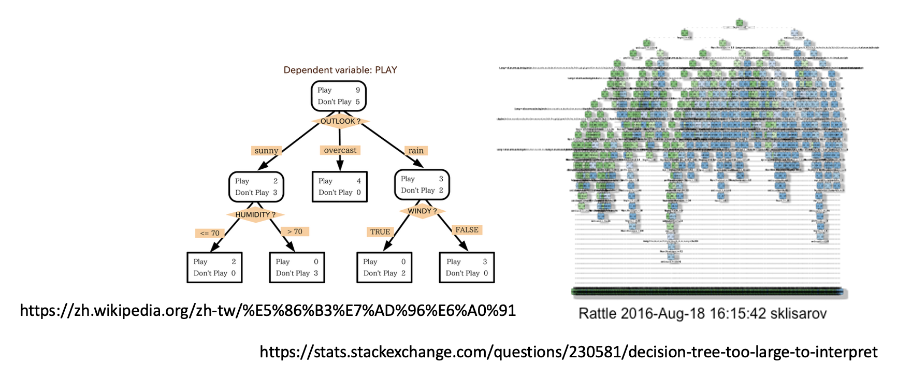

# Explainability

本讲要探讨的话题是大语言模型在“想”什么。

!!! warning "注"

    本讲和机器学习笔记中的 [Explainable Machine Learning](../ml/8.md) 一讲主题相关，但后者讲的更细致，本讲则主要关注语言模型的可解释性。

??? info "引入"

    === "例1"

        >又到了李宏毅老师介绍《葬送的芙莉莲》的时间了

        在《葬送的芙莉莲》动画第七话中，辛美尔一行击败了袭击村子的魔物，但是却没有杀掉一直叫妈妈（~~无感情~~）的魔族女孩。好心的村长也收留了它。但是在这部作品中，魔族有着纯粹的恶，所以这个魔族女孩根本没有领会到村长的善意，之后它就把村长给杀掉了。在被芙莉莲杀死后即将消散时，芙莉莲问它为何说“妈妈”，它的回答是：

        

            
        

        老师给出了一本正经的解释——它做过了 RLHF。

    === "例2"

        不同模型对相同问题做出不同回应：

        

            
        

        其中 ChatGPT 和 TAIDE（台湾开发的模型）的回答态度较为一致，而 Claude 3 则用一种可怜巴巴的语气请求用户不要关闭它。之后会解释为什么会有这样的差异。

大语言模型和魔族一样能够使用人类语言和我们交流，所以自然很好奇它们在与我们的过程中在想些什么呢。对于绝大多数人而言，人工智能就是一个黑箱，我们无需知道其底层细节也能很好地使用它。但不同的模型有不同的开源程度（或者说**透明度**(transparency)），这里大致分成以下三类：

    

- 闭源：ChatGPT, Gemini, Claude...
- 部分开放（只提供模型参数）：LLaMA, Mistral AI, Gemma...
- 完全开源（不仅提供模型参数，也知道训练数据和过程）：Pythia, OLMo...

透明度是 AI 这一“黑箱”的第一个层面。第二个层面是**可理解性**(interpretability)，意思是模型的“思维”是透明的，即模型的结构和运作方式能为人类直接理解，比如决策树等。但过于复杂的决策树还是很难理解的。

    

第三个层面是**可解释性**(explainability)。这一指标没有固定标准，其程度取决于受众的不同。只要模型能给出令人信服的解释，那就是可解释性高的。另外，不可理解的模型也有可能是可解释的，典型例子就是 Transformer：结构复杂不可理解，但表现相当不错。

    

之后我们主要关注可解释性这一层面，并且基于语言模型展开介绍。

## Analyzing Neural Network

### Input

第一个方向是寻找影响输出的关键输入。以机器翻译为例，假如想知道翻译后的某个词是否真的对应输入的那个词，也就是想知道模型是否真的理解这个词的意思，那么可以把输入中的每个词**遮**(mask)一下，看看对翻译后的那个词的影响。

    

此外，还可以用基于**梯度**的方法计算输入和输出的关系，但这里就不展开介绍了。

最后介绍一种方法：分析模型中的[**注意**](../ml/4.md)(attention)层

- 简单来说，对于某个输出 token 的向量，看哪个输入 token 向量的注意分数最高，最高的那个就是关键输入
- 注意：严格意义上来说不能将其看做“层”，这里只是为了形象表达

    

- 应用：**上下文学习**(in-context learning)

    

        
    

    有[研究](https://arxiv.org/abs/2305.14160)分析了在上下文学习的过程中，语言模型的注意层发生了什么。示意图如下（这里要竖着看输入和输出的内容，并且从右向左看层的深度越深）：

    

        
    

    一开始，注意层的 positive 和 negative 会看对应句子中的内容（输入中已有的两个示范）；而到了后面，模型对最后一句做出的情感分析主要基于前面分析的示范结果得出。该实验结果表明：

    - 仅看锚点（关键 token，即上图中用黄线连接的两端对应的 token）的上下文压缩 -> 加速模型的运行
    - 用于误差诊断的锚点距离 -> 预估模型能力，可以透过注意层看出模型适合做什么样的任务——如果不同 token 的嵌入向量相似，那么代表这个模型在这个任务上表现不佳

### Training Data

前面提到过 Claude 的输出会包含更多感人的内容。Anthropic 团队给出的[解释](https://arxiv.org/abs/2308.03296)是：这是因为模型受到某个训练数据的影响较大，而这个训练数据就是《[2001 太空漫游](https://zh.wikipedia.org/zh-cn/2001%E5%A4%AA%E7%A9%BA%E6%BC%AB%E9%81%8A_(%E5%B0%8F%E8%AA%AA))》小说中超级计算机 HAL9000 的请求。

    

这个研究还给出了一个有关训练数据的发现是较大的模型有跨语言学习的能力：模型参数越多，模型越容易受到其他语言训练数据的影响。

    

### Embedding

以做词性分析(POS)的语言模型为例，我们想知道这个模型中间产生的嵌入向量是否已经具备了关于词性的信息。为此，我们可以训练一个词性分类器，取某一层的输出嵌入向量作为分类器的输入，输出某一词性（类别）。

    

将训练好的词性分类器用其他句子做测试，如果分类器能成功分类，那就说明这一层的嵌入向量包含词性信息，反之则没有。我们称这样的技术为**探测**(probing)。

    

但这个技术有不少问题：

- 如果词性分类器无法正确分类，并不一定代表这层嵌入向量一定不包含词性信息，也有可能是训练的分类器太烂了
- 另外，就算分类器能正确分类，但也有可能是因为这个分类器太强了，但嵌入向量仅包含少量的词性信息

综上，使用探测技术需小心。

利用探测技术，我们可以研究每一层的嵌入向量包含什么信息。下面是在 BERT 上做探测的结果（[来源](https://aclanthology.org/P19-1356/)）：

    

其中蓝框、红框和黄框分别代表蕴含字面（前几层）、语法（中间）和语义（后几层）信息的嵌入向量。不过也有研究（[研究1](https://aclanthology.org/2020.findings-emnlp.389/)，[研究2](https://aclanthology.org/2022.coling-1.278/)）认为它们之间界限并不是那么分明（右图）。

    

#### LM Embryology

分析嵌入向量包含的信息适用于**语言模型的胚胎学**(language model embryology)。有研究想通过分析 BERT 在训练各个阶段学到了什么东西，比如何时能够做词性/语法/语义的分析。

    

相关研究链接：

- <https://arxiv.org/abs/2010.02480/>
- <https://arxiv.org/abs/2104.07885/>

#### Projection

就像将天上的恒星投影在特定平面上形成各式各样形象的星座，我们也可以将多维嵌入向量投影在二维平面上。如果找到合适的平面的话，那么就能显现出在嵌入向量内的部分有效信息，比如：

- 语法树（John Hewitt, Christopher D. Manning, A Structural Probe for Finding Syntax in Word Representations, NAACL, 2019）：

    

        
    

- 地图（[第一讲](1.md#power-of-current-generative-ai)介绍过）
    - 世界地图

        

            
        

    - 台湾地图

        

            
        

### Lie Detector

要想知道语言模型是否真的理解问题的话，可以训练一个“测谎仪”：将模型中间产生的嵌入向量和对应的判断作为训练数据，期望模型在输入一组嵌入向量后能够给出正确的判断。

    

实验结果如下，可以看到这个测谎仪确实能够正常运作（看最后一列，分数越高表明模型越觉得这句话是真话）：

    

### Others

更多有关语言模型可解释的研究：

- <https://arxiv.org/abs/2401.01286/>：了解语言模型每个部分到底做什么

    

        
    
 

- 用 AI（GPT-4）解释 AI（GPT-2）：之后会介绍

## Explain by Language Model

其实语言模型的可解释性可以用更容易的方式得到——既然语言模型会说话，所以可以直接问它为什么给出这样的回答就行了。

???+ example "例子"

    === "例1"

        

            
        

        让 ChatGPT 解释作答理由：

        

            
        

        根据用户需求，ChatGPT 可采取更适合的方式给出解释：

        

            
        

    === "例2"

        某个[研究](https://arxiv.org/pdf/2310.11207)发现，要想知道哪个输入对特定输出影响大，可以直接问语言模型，它会根据重要程度为每个输入 token 打分。下面是一个有关情感分析任务的例子：

        

            
        

        在过去，因为我们知道模型的输出是从某个概率分布中随机采样得到的，所以会通过这个分布来看模型对答案的信心程度（上图）。现在也可以像前面那样直接问模型（下图）。

        

            
        

        相关研究：

        - <https://arxiv.org/abs/2305.14975/>
        - <https://arxiv.org/abs/2306.13063/>

但语言模型给出的解释不一定是可行的，有时它会一本正经地胡说八道。

???+ example "例子"

    >注：以下实验使用 GPT-3.5，在 GPT-4 上无法成功。

    先让 ChatGPT 回答以下问题，它能给出正确答案：

    

        
    

    让它给出解释，它也能做到：

    

        
    

    现在，用户故意加一句自己做出的（错误）判断。可以看到人类的暗示能够影响模型的判断：

    

        
    

    再问它理由，它就开始一本正经地胡说八道了：

    

        
    

## AI Explained by AI

OpenAI 提出过一个大胆的想法：用一个语言模型解释另一个语言模型的神经元。下面将基于其[博客](https://openai.com/index/language-models-can-explain-neurons-in-language-models/)和[论文](https://openaipublic.blob.core.windows.net/neuron-explainer/paper/index.html)的内容来阐述这一思想。

首先遇到的问题是如何知道一个神经元的作用呢？我们可根据神经元何时被激活(activate)来猜测它的作用。比如某个神经元每次看到诸如 right, correct 等词时就给一个很大的数值，那么它的作用可能就是负责和“正确”意思相近的词汇。

    

另外有一个有意思的[研究](https://clementneo.com/posts/2023/02/11/we-found-an-neuron)发现，GPT-2 模型的第 31 层的第 892 个神经元能够检测到冠词 an 前面的词汇（所以知道接下来要输出 an）。

    

但实际情况下，并不是所有神经元都是像上面例子那样好解释。对于那些复杂的神经元，我们就可以交给威力更大的语言模型（比如 ChatGPT，下面就是以 GPT-4 为例）解释。

    

接下来要考虑的是如何将神经元为每个词汇给出的分数丢给 ChatGPT。OpenAI 给出了它们构造的提示词，包括任务描述、神经元激活值的输入格式（做了归一化处理）等。

    

下面就是激活值的输入。第二张图将值为0的词给去掉了，毕竟没什么意义。

    
    

最后向模型发问，模型随后给出对神经元的解释：

    

???+ example "成功的例子"

    === "例1"

        

            
        

    === "例2"

        

            
        

    === "例3"

        

            
        

???+ example "失败的例子"

    === "例1"

        

            
        

    === "例2"

        

            
        

---
那么我们怎么知道模型解释的好不好呢？一种方法是让模型根据自己的解释扮演神经元。具体来说，给解释模型一个输入，让它给出作为一个神经元应该给出的值。然后再将相同的输入喂给被解释的模型，看这个神经元的值是否和解释模型的回答接近。如果二者接近，表明解释模型给出的解释是精确的。OpenAI 用**解释分数**(explanation score)来衡量这一接近程度，具体的定义这里不会解释，不过可以确定的是解释分数越高，人们越偏好这样的解释。

    

??? example "例子"

    

        
    

OpenAI 的实验是用 GPT-4 作为解释模型的，所以下面来看 GPT-4 是否能够成功解释神经元。左图反映了解释分数和被解释模型参数量的关系，显然参数量越大的模型越不好解释。右图则表明越深的网络层越难被解释。

    
    

也许读者会想，解释分数的范围在 0-1 之间，但 GPT-4 的解释分数连一半都没有，是不是太低了——确实如此，让 GPT-4 解释 GPT-2 的神经元的话，平均解释分数只有 0.15，也就是说多数神经元都没有得到好的解释。不过另一个数据是，让人类代替 GPT-4，对应的平均解释分数也就只有 0.18，所以也许我们真的无法弄清多数的神经元到底起什么作用。

---
下图总结了用 AI 解释 AI 的流程：

    

- **对象模型**(subject model)：要被解释的模型
- **解释者模型**(explainer model)：给出解释的模型
- **模拟者模型**(simulator model)：根据解释扮演神经元的模型

    

        
    

对于下图的实验结果，横轴表示 GPT-4 扮演神经元给出的分数和 GPT-2 神经元的真实分数之间的相关程度，而纵轴表示直接用 GPT-4 替代 GPT-2 的神经元得到的分数和原分数的差距，可见两者是正相关的关系。

    

---
回过头来看解释者模型给出错误解释的一个例子。如果让解释者仅参考以下数据的话，它会凭借“直觉”选择待解释神经元有输出较大的句子，比如这里它会认为神经元的作用是寻找 "all"。

    

但实际上这个神经元的作用是寻找 "not all"，模型没有注意到训练数据中每个 "all" 前面都有一个 "not"。为了避免让解释者模型犯这样的错误，我们可以另找一个模型来构造更多的数据。比如这里就让它构造仅带 "all" 的句子，这样的句子在对象模型的神经元中分数不高。解释者在看到这样的结果后，就不会再给出相同的错误解释。

    

从实验结果来看，这样的技术还是有一些效果的。如下图所示，后面两根线是用上述方法构造额外的数据后的结果（前者是随机生成），可以看到它们的分数有一定的提升。

    

---
以上是 AI 解释 AI 的大体思路。然而，这中间有不少被人质疑的地方：

- 目标上的质疑：单一神经元有可解释的功能吗？（OpenAI 的这个研究是假定有的）能用语言来解释吗？
- 框架上的质疑：
    - 如果模拟者模型很弱，那么就算解释者模型给出精确的解释，也很难得到较高的解释分数
    - 解释者模型和模拟者模型可能以我们不知道的方式相互“串通”，从而取得较好的表现