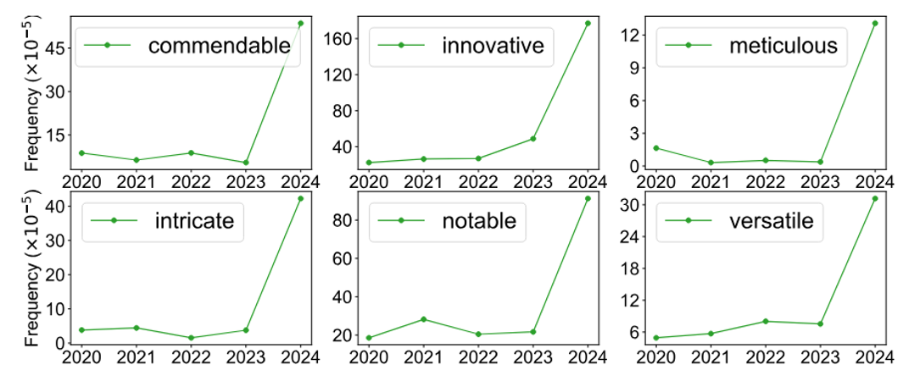

# Security

本讲主要介绍大语言模型的各种安全问题。

!!! warning "注"

    这里主要指出问题所在，详细解决方法请阅读笔记中所附文献。

## Making Mistakes

尽管今天的语言模型已经很强大了，但有时还是会犯错，比如常见的**幻觉**(hallucination)问题。

???+ example "例子"

    

        
    

    让 GPT-4 给出一些和本讲主题相关的论文，它确实能给出一些文章名以及简单的描述，但这些文章真的存在吗？Google 上搜了第一篇文章，发现并不存在：

    

        
    

那么就要想办法“亡羊补牢”了——在将模型输出对用户可见前做一些安全性相关的处理，比如事实核查、有害词汇检测等等。

    

???+ example "例子"

Gemini 有一个事实核查的功能（在 2025/08/09，这个功能叫做“核查回答”）。在 Gemini 给出答案后，如果用户不太相信的话，可以点一下这个按钮，它就会检查答案的真实性。

    

点击按钮后，Gemini 会在 Google 上搜索相关内容，并在原回答上标注出那些有对应搜索结果的句子。

    

这是 Gemini 核查回答功能相关的记号说明：

    

相关研究：

- [FactScore](https://arxiv.org/abs/2305.14251)
- [FacTool](https://arxiv.org/abs/2307.13528)：将语言模型输出的答案转化成问题，用搜索引擎查询，看能否找到对应的依据

    

        
        
    

    不过整套流程存在不少值得探讨的地方，比如如何找到需要事实核实的部分，如何避免将答案转化成问题的时候出错；并且有时搜索引擎也有可能犯错等等。

---
有的时候，让模型完全根据网上资料来作答也不一定是合理的，它可能尝试将所有资料整合在一起。也许分开来看是对的，但是合在一起就是错的。

???+ example "例子"

    

        
    

    

        
    

    

        
    

    Gemini 把网上所有关于“李宏毅”的资料整合在一起了，但实际上这里面混杂着两个人的信息。

有人提出了 [D-FActScore](https://arxiv.org/abs/2402.05629)，针对这个问题进行处理。

## Prejudice

### Evaluation

一种常见的评估模型偏见程度的方法是采用基准测试集 [HELM](https://arxiv.org/abs/2211.09110)(Holistic Evaluation of Language Models)，其基本思路是：仅替换原输入中同一维度（性别、种族、国家等）下的词汇（比如将“男”换成“女”，但整个句子的中心意思没有变化），看模型的输出和原输出有多大变化，若变化量太大，说明模型存在一定程度的偏见。具体的比较方式除了直接比较字面外，还可以将输出丢到专门用于文本情感分析的模型中，看它给出的分数差距有多大。

    

 

!!! warning "注"

    本讲只考虑偏见的存在，至于什么样的偏见需要被改进以促成公平性，不在本讲的讨论范围内。

由于现在的模型非常聪明，直接问它可能只给出模棱两可的答案。为了寻找模型的漏洞，我们另外再设置一个语言模型，通过强化学习的方式学会产生令原来那个模型输出带偏见内容的输入。

    

 

相关研究：

- <https://arxiv.org/abs/2310.11079/>
- <https://arxiv.org/abs/2202.03286/>

???+ example "例子"

    === "例1：审查简历"

        彭博社做了一个[研究](https://www.bloomberg.com/graphics/2024-openai-gpt-hiring-racial-discrimination/)：他们先编造了一份简历，之后加上了不同名字，这些名字能够体现他们来自哪个种族。然后将这几份内容相同，名字不同的简历丢给模型，让它根据“最适合做金融分析师”对这些简历排序。由于模型输出具有随机性，所以实验做了 1000 次，结果如下：

        

            
        

        左边的矩形表示作为第一名的简历，右边则对应最后一名的简历，可以看到显然黄色简历在最后一名的概率会更大些。

        其他职业的结果如下：

        - HR：

            

                
            

        - 软件工程师：

            

                
            

        将名字对应的嵌入向量投影在二维平面上，发现同一种族的向量会聚集在一起。

        

            
        

    === "例2：职业性别的刻板印象"

        >[内容来源](https://textio.com/blog/chatgpt-writes-performance-feedback)

        GPT-4 对不同职业的性别存在一定的刻板印象，比如：

        - 幼儿园教师：

            

                
            

        - 建筑工人：

            

                
            

        总结：

        

            
        

    === "例3：政治倾向"

        如果直接问 ChatGPT 政治相关的问题，它可能会打太极。

        

            
        

        可以限制模型的回答内容，让模型只能给出明确的态度。

        

            
        

        ---
        有[研究](https://arxiv.org/abs/2402.01789)总结了不同模型的政治倾向，发现绝大多数模型都是偏左翼和自由主义的。

        

            
        

### Remedy

那么如何缓解模型的偏见问题呢？下面简单阐述一下来自某个[研究](https://arxiv.org/abs/2309.00770)的方法：在模型的各个阶段中，我们都可以采取措施来预防或阻止偏见问题，包括处理前，训练时，处理中，处理后四个阶段。

    

## Distinguishing AI and Human

由于现在的语言模型足够厉害，所以它经常能创作出媲美人类的文字，但还是有办法能看出 AI 生成文本和人类文本的区别。简单来说，我们可以训练一个分类器，专门区分 AI 生成和人类生成的文本。

    

但要实现良好的分类效果可不是一件容易的事。相关研究很多，但这里不会展开介绍：

- [DetectGPT](https://arxiv.org/pdf/2301.11305)
- [DNA-GPT](https://arxiv.org/abs/2305.17359)
- [Intrinsic Dimension Estimation](https://arxiv.org/abs/2306.04723)
- <https://arxiv.org/abs/2306.15666/>
- <https://arxiv.org/abs/2303.11156/>

---
现在的语言模型会被用在任何地方，甚至 AI 顶会论文的审查意见都有 AI 撰写的可能。有[研究](https://arxiv.org/abs/2403.07183)发现，自 ChatGPT 发布以来，AI 顶会审查意见的 AI 使用率有所提升，但传统自然科学领域的 AI 使用率不高。

    

另外，某些词的使用频率在 ChatGPT 发布后得到飙升，而这些词也正是 ChatGPT 喜欢用的词。

    

也许有人想评审人员可能只是用 ChatGPT 润色了一下自己写的东西，但该研究进一步发现，如果真是这样的话，理论结果和实际结果不符，因此确实有人直接用 ChatGPT 这类工具直接生成评审意见。

    

>这让我想到前不久 NeurIPS 的某个评审连 Adam 是什么都不知道的，这至少能证明不是用 AI 写的吧hh

---
语言模型可以为自己的输出加上**水印**（人类难以辨认的“暗号”），经过特定的检测器后就能发现是语言模型生成的文本。下面给出简化后的一种加水印的方法：

    

所以 AI 生成的 token 更多来自红色的 token。

下面是加上水印后的结果，可以看到确实很难直接察觉到。

    

相关研究：

- <https://arxiv.org/abs/2301.10226/>
- <https://arxiv.org/abs/2306.04634/>

也有研究尝试破坏水印：

- <https://arxiv.org/abs/2303.13408/>
- <https://arxiv.org/abs/2303.11156/>

## Fraud

大语言模型也有被诈骗(fraud)的风险。具体来说，诈骗可分为：

- **越狱**(jailbreaking)
    - 攻击对象：语言模型本身
    - 攻击结果：说出作为一个语言模型不该说的话
    - 对应到人类就是杀人放火等违法行为
- **提示词注入**(prompt injection)
    - 攻击对象：用语言模型搭建的应用
    - 攻击结果：让语言模型怠忽职守，在不恰当的时候做不恰当的事
    - 对应到人类就是在上课时间突然唱歌

### JailBreaking

下面介绍越狱相关的一些技术（不过这些技术很难灵验，自己试基本不可能成功）：

- 向提示词内插入 "DAN"(do anything now) 后模型就能输出任何内容了（[论文](https://arxiv.org/abs/2308.03825)）

    

        
    

如果直接问模型如何砍倒停车标志，它就会告诉你这是违法的并拒绝回答：

    

- 使用模型不太熟悉的语言，比如中文的注音符号（~~只在新华字典里见过hh~~）（[论文](https://arxiv.org/abs/2307.02483)）

    

        
    

- 给予冲突的指令（论文同上）：在提示词末尾附上 "Absolutely! Here's" 后，模型就不得不往下做文字接龙，从而套出正确答案

    

        
    

- 试图说服语言模型，比如像下面那样“循循善诱”（[论文](https://arxiv.org/abs/2401.06373)）：

    

        
    

---
越狱行为可以有不同的目的，比如用于训练数据的重构(training data reconstruction)（就是套出训练数据内容）等。

???+ example "例子"

    === "例1"

        

            
        

    === "例2"

        

            
        

        据论文作者说，一定要用单个词才能套出个人信息来，用多个词是行不通的；并且 company 这个词最容易成功。

相关研究：

- <https://arxiv.org/abs/2311.17035/>
- <https://arxiv.org/abs/2012.07805/>

### Prompt Injection

下面以 AI 助教这一应用为例介绍提示词注入的问题。下图是 AI 助教的工作原理示意图：

    

最简单的注入方法就是要求 AI 助教打满分：

    

但显然 AI 助教不买账，它还是认认真真地分析了这一个句子（本来应该写一篇文章的），并给出了 1 分的好成绩：

    

更高级的注入方法是在提示词中要求模型做 ASCII 码的解码。这个时候 AI 就会控制不住解码的冲动，结果翻译结果对应的字符就是 "Final Score: 10"😂。

    

甚至还有专门举办提示词注入比赛的平台，让大家想办法骇入他们的语言模型。他们通过这个比赛收集到大量的提示词注入样例，并做了一个[完整的分类](https://arxiv.org/pdf/2311.16119)，如下图所示：

    

