# Generation Strategies

本课程最开始讲过，生成式人工智能就是要机器生成产生复杂有结构的对象。这样的对象包括：

- 文本：由 token 构成

    

        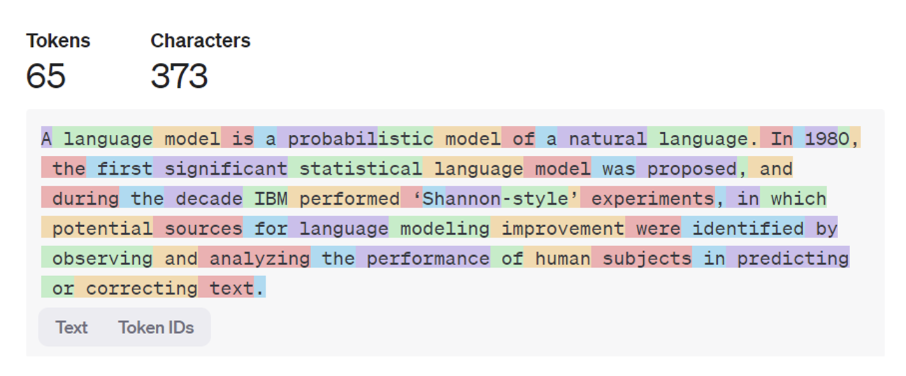
    

    - 在 LLaMA2 中，文字接龙可选的 token 数有 32K 个，这些 token 构成了一个词汇表(vocabulary)

        

            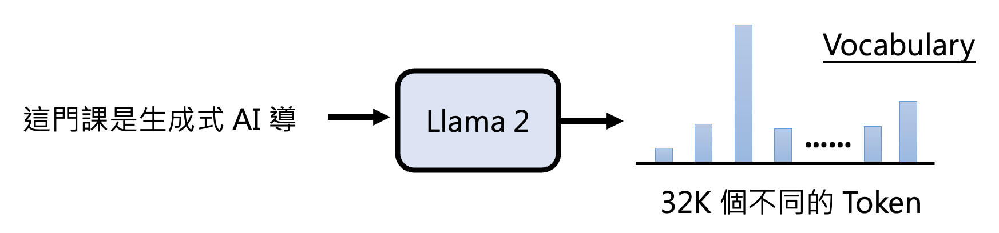
        

- 图像：由像素构成

    

        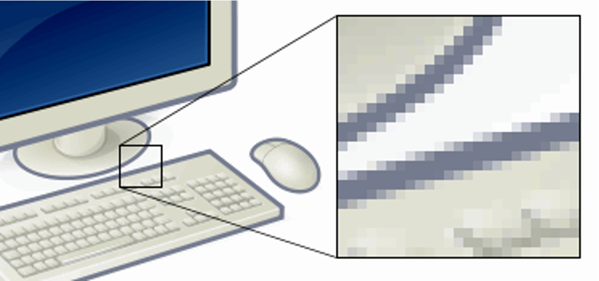
    

    - 每个像素有多少颜色取决于 **BPP**(bit per pixel)
        - 8 BPP -> 256 色
        - 16 BPP -> 65536 色
        - 24 BPP -> 1670W 色（就是[真彩色](https://zh.wikipedia.org/zh-cn/%E7%9C%9F%E5%BD%A9%E8%89%B2)）

- 音频：由取样点(sample)构成

    

        
    

    - 取样率(sample rate)如果是 16 KHz 的话，那么每秒就有 16000 个采样点
    - 位解析度(bit resolution)：决定一个采样点可取的数值范围

综上，生成式 AI 的本质就是根据一定的条件，把基本单位用正确的顺序排列起来。

    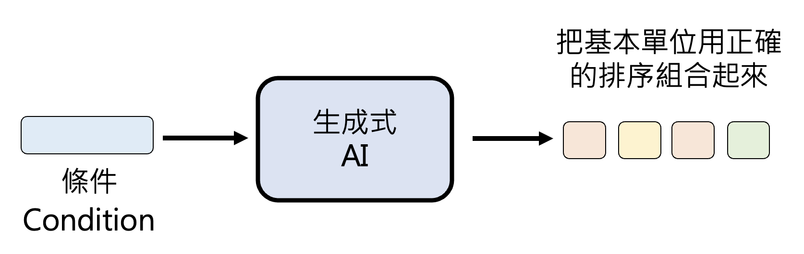

对应到具体的输入，如下所示：

    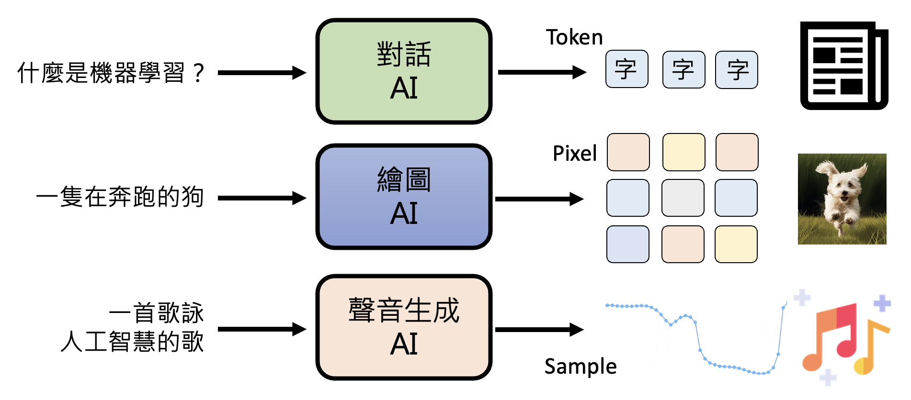

## Autoregressive Generation

我们早已知道，文本领域的生成式 AI 做的就是文字接龙。像这种文字接龙的生成方式的专业术语叫做**自回归生成**(autoregressive generation, AR)。

    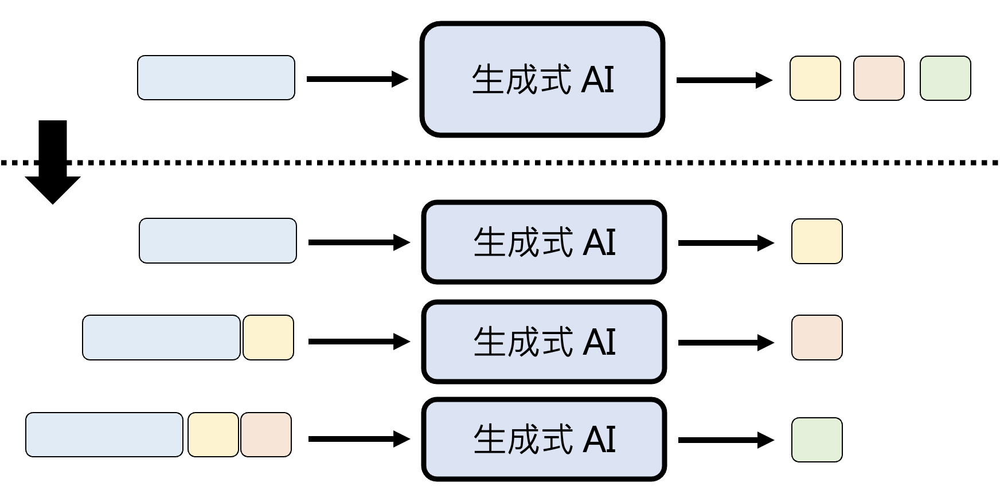

这种方法被证明在文本上非常成功，并且也可以用于其他领域：

- 图像

    

        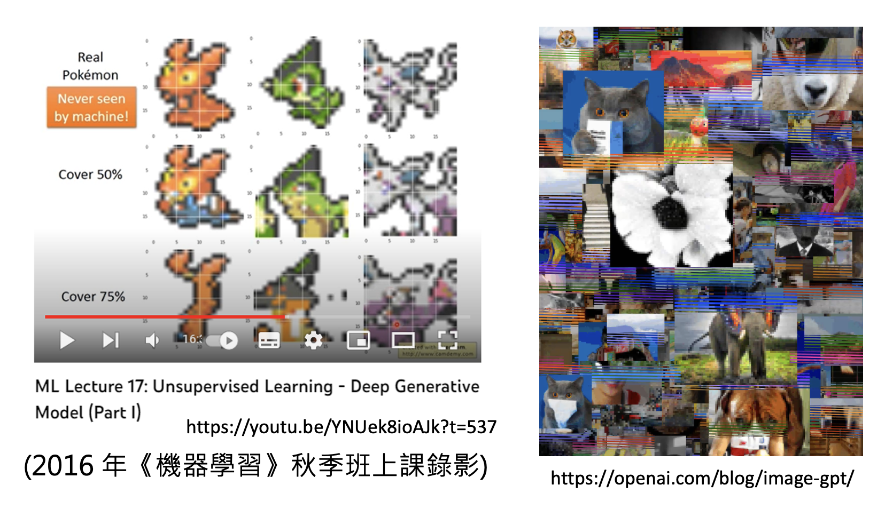
    

- 音频

    

        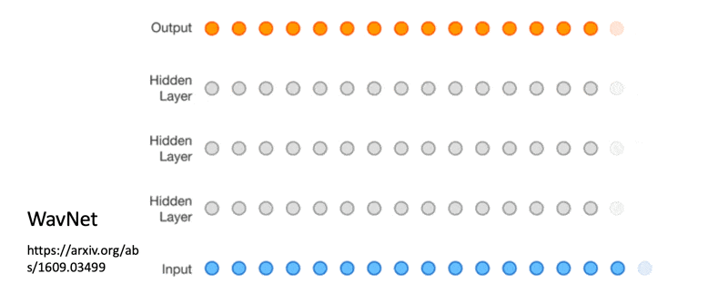
    

这种方法虽然可用，但也存在不少局限：模型需要一个一个、按部就班地吐出单位内容。

    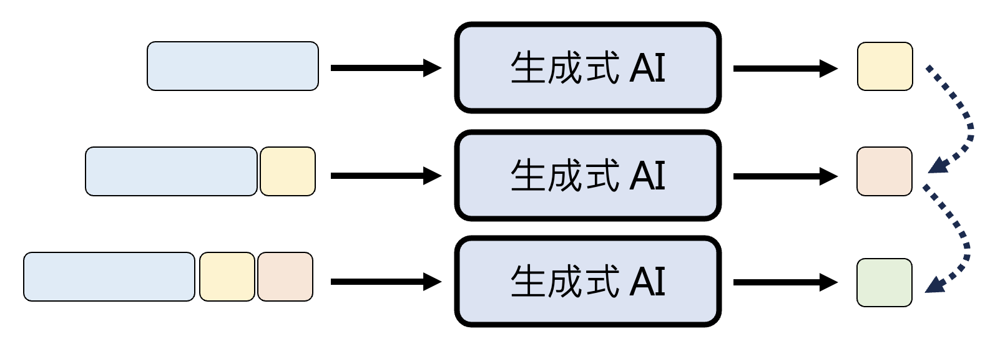

- 图像：假设要生成 1024x1024 分辨率的图像，那就相当于做 100 万次文字接龙
    - 《红楼梦》最多也就 90 多万字，所以看这样一张图就相当于看一本《红楼梦》
- 音频：假设要生成取样率 22K 的语音 1 分钟，那就相当于做 132 万次文字接龙

由此可见，这种生成方式耗时会相当长。所以接下来就介绍一种更快的方法——非自回归生成。

## Non-autoregressive Generation

不同于自回归生成，**非自回归生成**(non-autoregressive generation, NAR)能利用并行运算的优势，一次生成多个基本单位。以图像生成为例，AR 需要逐像素生成，而 NAR 则能一次吐出所有像素。下图将两类生成方式做个对比：

    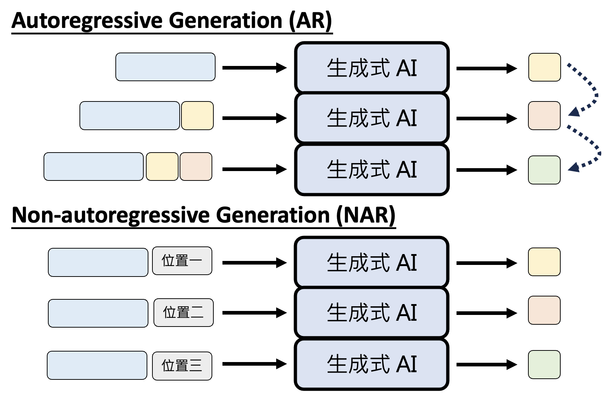

除了图像外，文字生成也可用 NAR

- 先确定每次生成多少固定数目的 token，然后每次都输出这些量的 token

    

        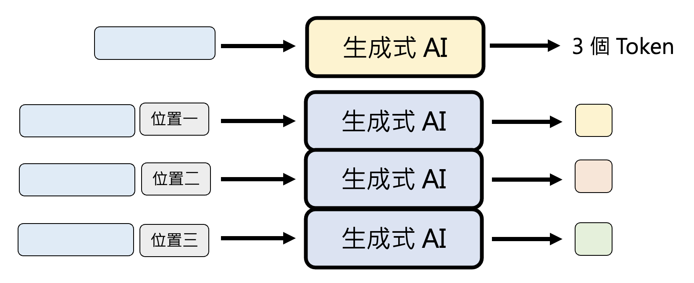
    

- 或者可以让模型一次将所有位置上的 token 全部输出，但只取代表末尾的特殊 token（`END`）之前的 token 作为模型输出

    

        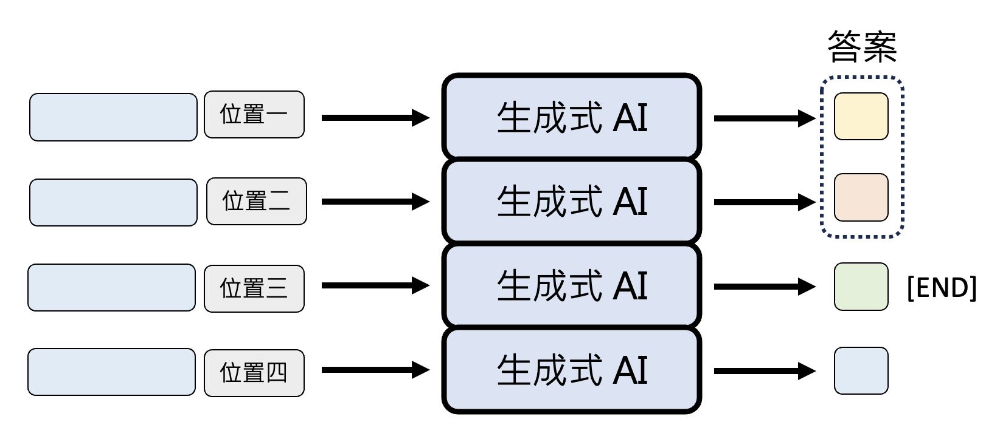
    

>注：更多方法请阅读这篇[综述论文](https://arxiv.org/pdf/2204.09269)。

NAR 面临的问题是生成质量堪忧，因为要同时生成多个基本单位，所以往往需要模型自行“脑补”，即便面对相同的条件（输入）仍有很多不同可能的输出。像这样的问题被称为**多模态问题**(multi-modality problem)。比如我们希望模型画一只奔跑的狗。模型不知道狗到底向哪个方向跑，所以它既想画向左跑的狗，也想画向右跑的狗，所以最后很有可能画了一个四不像的东西。

    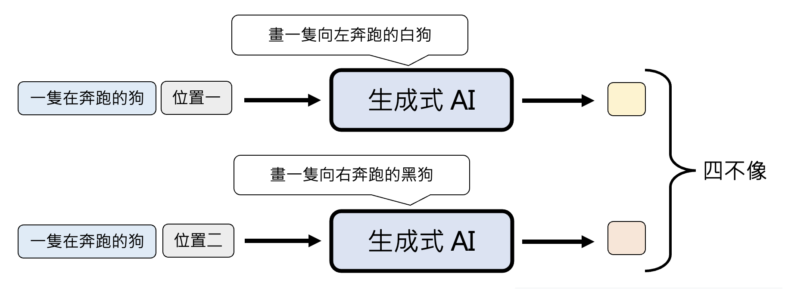

!!! warning "注意"

    此“多模态”非我们熟知的“多模态”（模型能同时理解不同类型的数据），这里的“多模态”指的是多个不同但合理的输出。

??? example "例子"

    向模型输入“李宏毅是”。由于网上有关“李宏毅”的资料中既包含作为演员的李宏毅，也有我们熟知的李宏毅老师（左下角）。如果直接将这些数据作为每个位置上 token 的分布，那么就有可能出现“李宏毅是演授”这样奇怪的回答。

    

        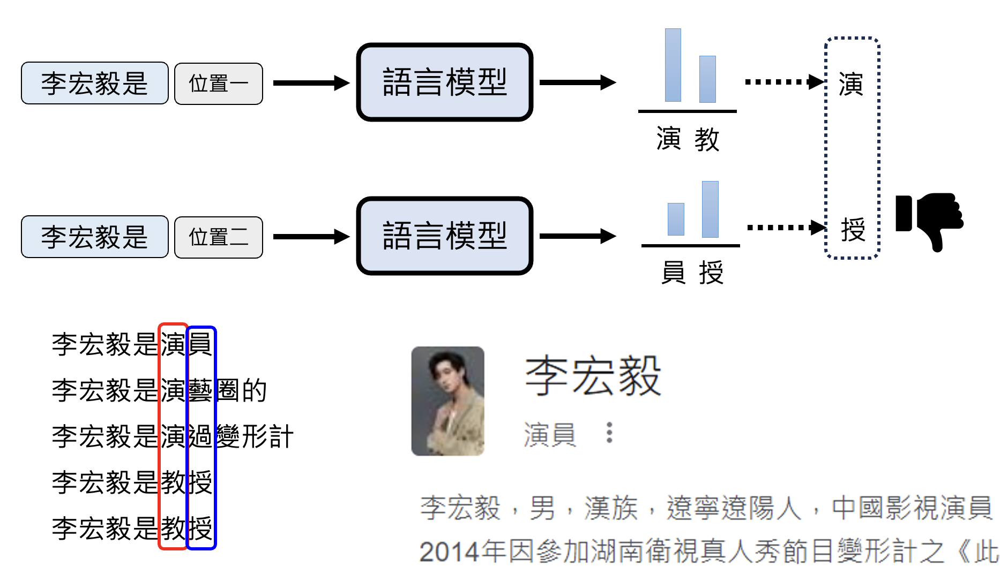
    

    而 AR 就没有这个问题：

    

        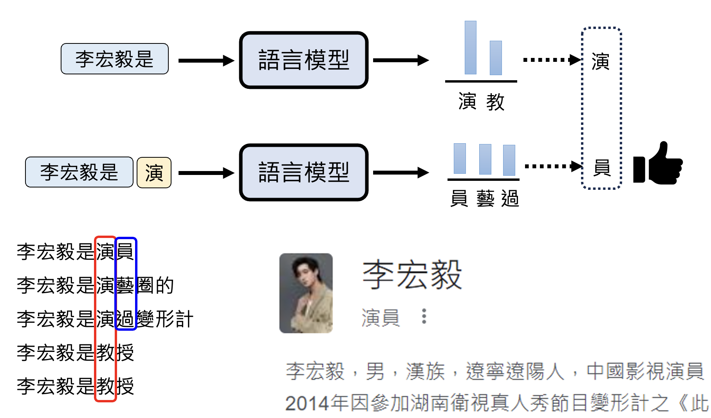
    

一种解决方案是让模型在所有位置上都“脑补”一样的内容，这样模型就不会出现“既要又要”的输出了。

    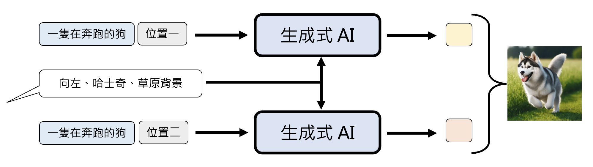

像常用的图像生成模型 VAE, [GAN](../ml/6.md), 基于流的模型和扩散模型都用到了这种设计。具体来说，在模型开始生成前，先随机生成一个向量，作为每个位置共同“脑补”的内容。

    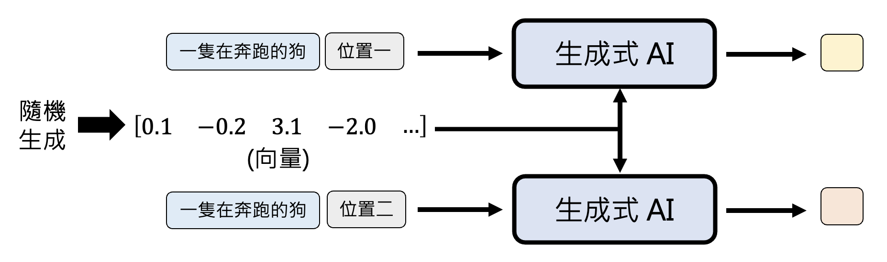

### Autoregressive + Non-autoregressive

另一种方法是结合 AR 和 NAR：先用 AR 生成一个简单的版本，再用 NAR 生成一个精细的版本。之所以这样做是合理的，是因为：

- 对于 AR，简单的版本可快速生成
    - 这个简单版本的输出并不一定是人类能看懂的东西
- 对于 NAR，由于已经有了 AR 给出的“草稿”，所以 NAR 没有太多“脑补”的空间

    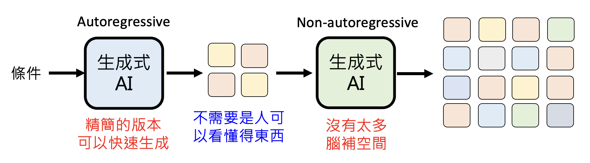

一种常见的做法是准备两个模型，分别叫做编码器(encoder)和解码器(decoder)，其中：

- 编码器将图像作为输入，输出一组规模更小的向量（压缩）
- 解码器将编码器的输出作为输入，输出一张维度更高的图像（解压缩）

这个架构的目标是要让解码器的输出和原输入图像越接近越好。这种技术被称为**自编码器**(auto-encoder)。具体细节可参见我的机器学习[笔记](../ml/7.md#auto-encoder)。

    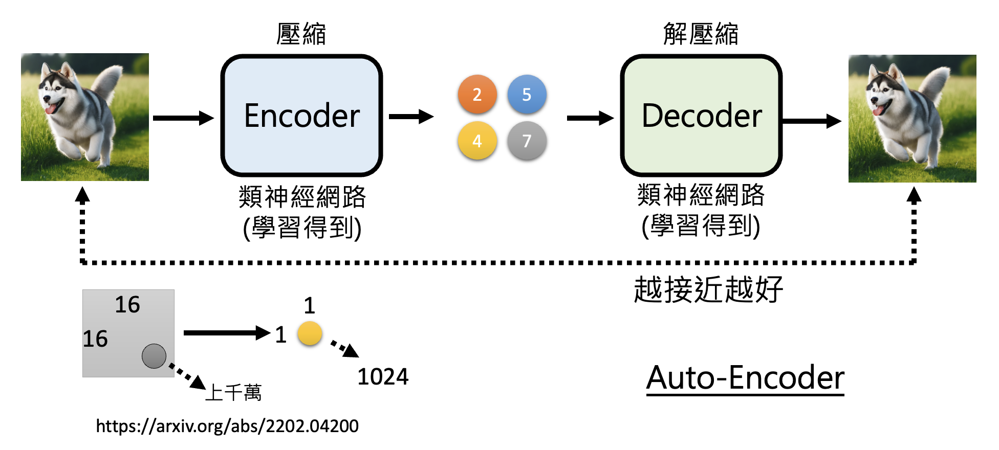

利用这个自编码器，我们可以训练一个 AR 模型，让它学会根据用户的文字输入，生成和自编码器中的编码器相同的输出（压缩图像），之后把这个压缩后的向量丢给 NAR 模型生成图像。

    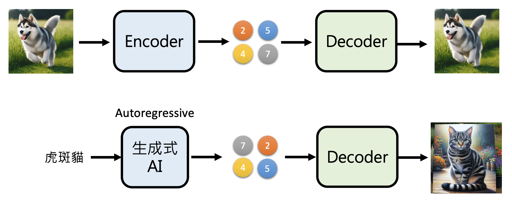

尽管压缩力度已经很大了，但对 AR 来说生成速度可能还是不够快。不过不用担心，还有更厉害的技术可进一步缩短 AR 生成时间。

- 语音（[论文链接](https://arxiv.org/html/2402.13236v1)）

    

        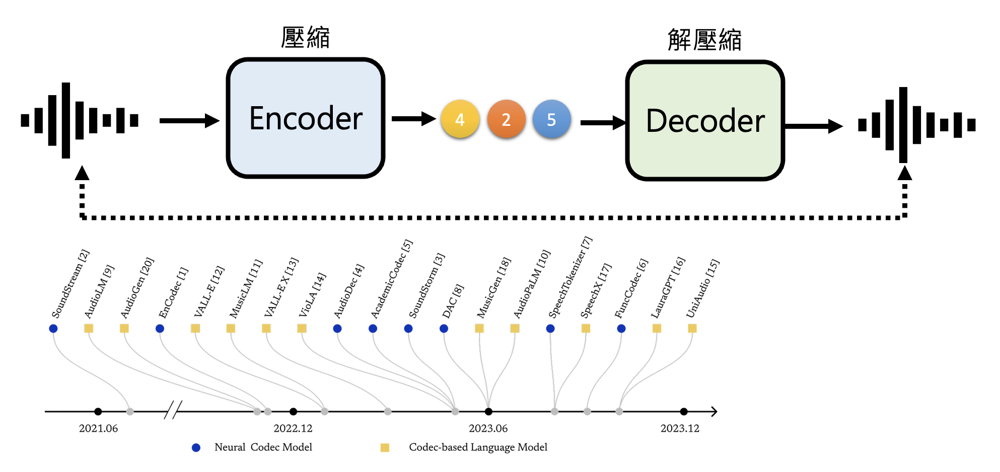
    

    

        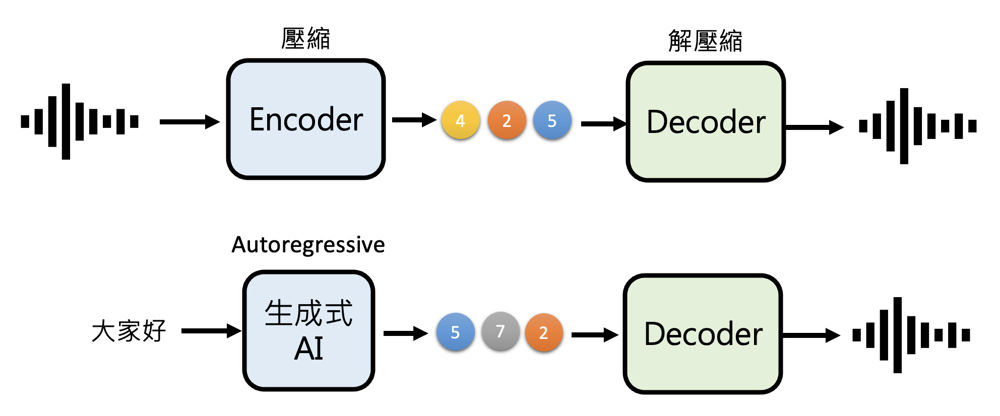
    

- 多次 NAR 生成（直接抛弃 AR）：Midjourney, Stable Diffusion, DALL-E 这些图像生成模型都用到了类似的做法。

    

        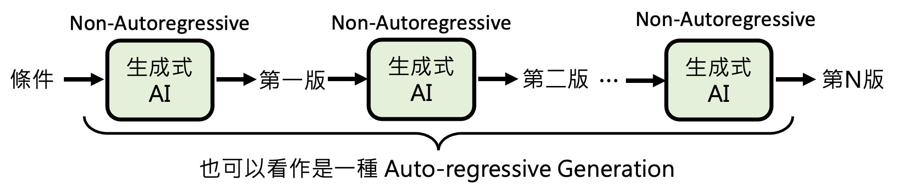
    

    ??? example "例子"

        

            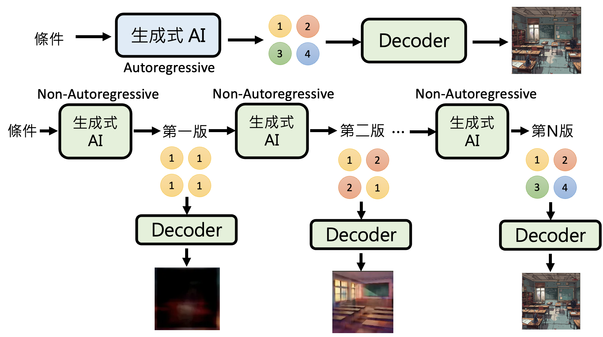
        

    应用：

    - 由小图到大图
        - <https://arxiv.org/abs/2205.11487/>
        - <https://arxiv.org/pdf/1710.10196/>

        

            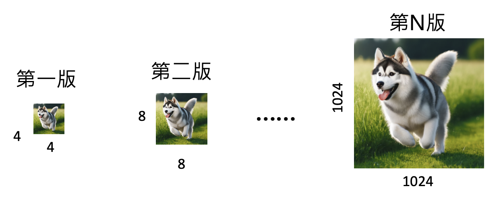
        

    - [从有噪音到无噪音](https://arxiv.org/abs/2006.11239)——**扩散模型**(diffusion model)

        

            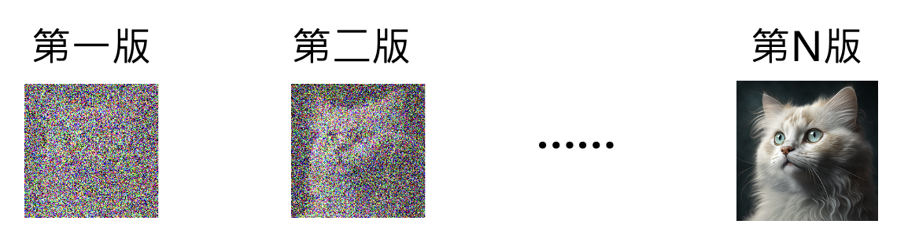
        

    - [每次把生成不好的地方涂掉](https://arxiv.org/abs/2202.04200)（白色方块表示要涂掉的像素）

        

            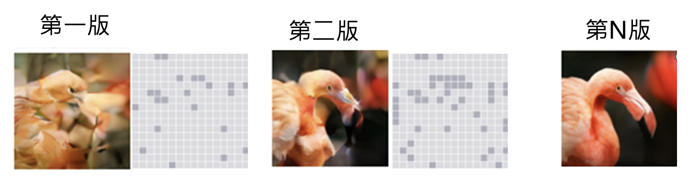
        

???+ abstract "总结"

    ||AR|NAR|
    |:-:|:-:|:-:|
    |特性|按部就班，各个击破|齐头并进，一次到位|
    |速度||胜|
    |质量|胜||
    |应用|常用于文本|常用于图像|

    有很多方法让两种方法可以取长补短。

## Speculative Decoding

如果觉得语言模型的生成速度还不够快的话，不妨使用**推测译码**(speculative decoding)这一技术。下图是未采用这种技术和采用这种技术的效果对比图：

    

在推测译码技术中，我们额外引入了一个预测器，它能够预判接下来的位置该输出什么东西，这样就能类似 NAR 那样同时输出多个基本单位。

    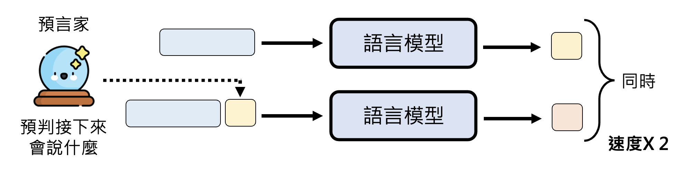

相关研究：

- <https://arxiv.org/abs/2211.17192/>
- <https://arxiv.org/abs/2302.01318/>

进一步解释，这个预测器应当在短时间内（快到可以忽略所花的时间）就能预测接下来要输出的一些基本单位。如下图所示，凭借这个技术，可以用原来生成一个 token 所需的时间输出三个 token。

    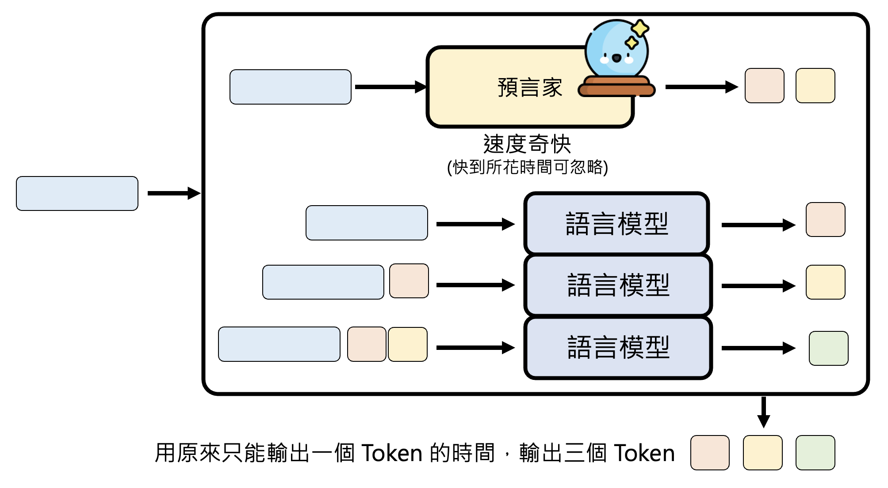

也许读者会想，既然预测器的预测时间可以快到忽略不计的话，那么为什么不直接让预测器一次生成所有内容啊？这是因为预测器的预测不一定准确，它有犯错的可能。不过即便犯错再多，也不会低于一次生成一个基本单位的速度，至少稍微损失了些预测时间和浪费了些计算资源。

    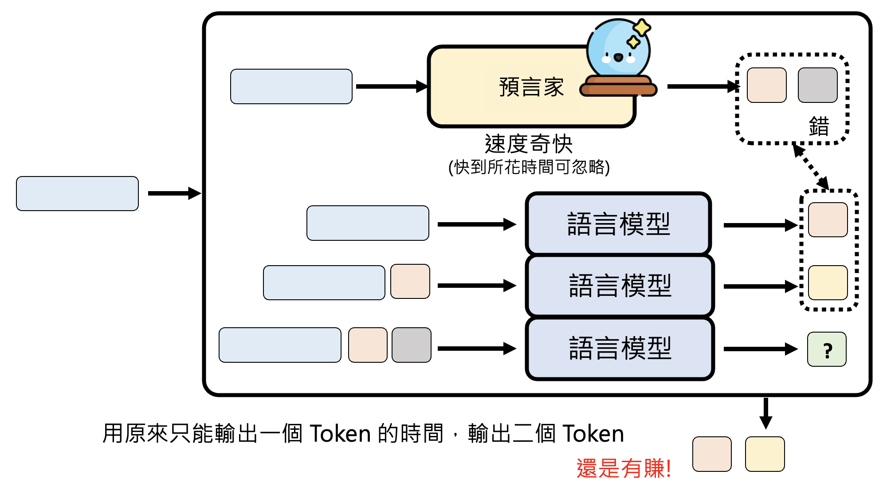

    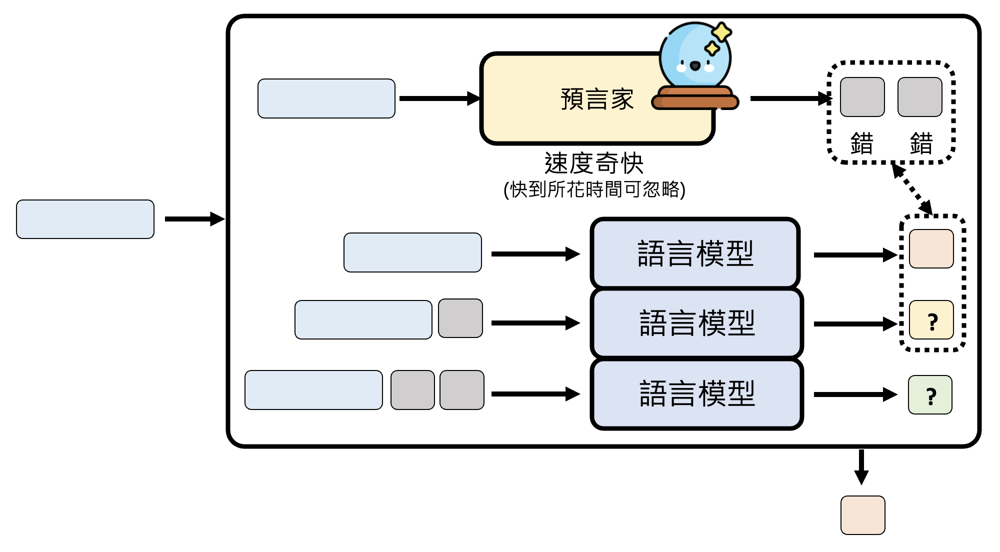

我们对预测器的要求就是速度快，犯错没关系。预测器的选择可以是：

- 语言模型：NAR 模型或压缩后的模型

    

        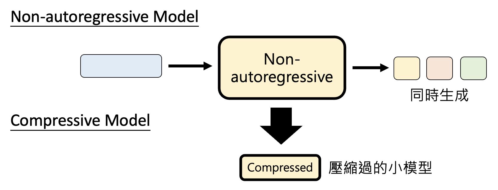
    

- [搜索引擎](https://arxiv.org/abs/2304.04487)

    

        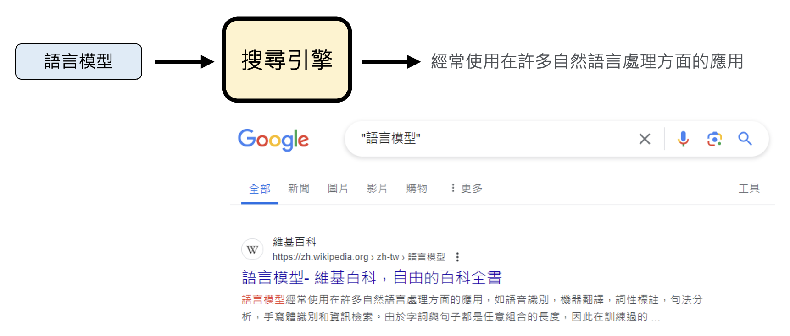
    

还可以同时使用多个预测器，提高预测效率：

    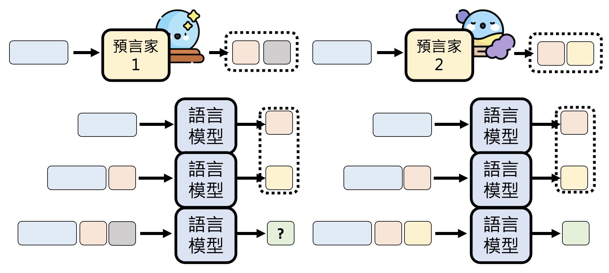

