# Image&Video Generation

和影像有关的生成式 AI 包括：

    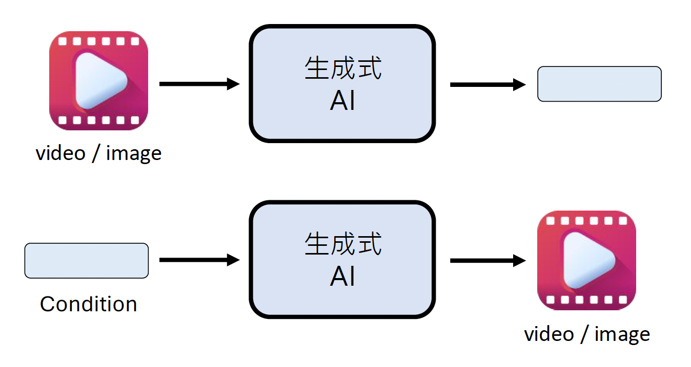

> 当然还有图生图的架构，不过这里没有列出来。

其中第一种形式（“看图说话”）在前面已多次介绍过，而且现在的模型基本具备阅读和理解图像的能力了，所以这里不再赘述了。那么接下来就直接看第二种形式——文生图了。24 年年初 OpenAI 爆出的 [Sora](https://sora.chatgpt.com/) 就是一种文生图的模型，下面展示了一些使用 Sora 的例子：

<!-- ??? example "例子"

    === "例1"

        

        Prompt: Animated scene features a close-up of a short fluffy monster kneeling beside a melting red candle. The art style is 3D and realistic, with a focus on lighting and texture.

    === "例2"

        

        Prompt: New York City submerged like Atlantis. Fish, whales, sea turtles and sharks swim through the streets of New York.

    这里生成的都是一些现实世界中不存在的东西。不过这些视频还都有些小瑕疵，比如例1小怪兽没动，后面的墙壁却移动了；例2的龟变成了鱼等等。

    ---
    下面 2 个例子的 bug 还要多

    === "例3"

        

        Prompt: Five gray wolf pups frolicking and chasing each other around a remote gravel road, surrounded by grass. The pups run and leap, chasing each other, and nipping at each other, playing.

    === "例4"

        

        Prompt: Archeologists discover a generic plastic chair in the desert, excavating and dusting it with great care. -->

第三种没列出来的形式是影像生影像，它的具体应用包括：

- 影片补全
- 风格转换
- 画质提升（分辨率 ⬆️）
- ...

    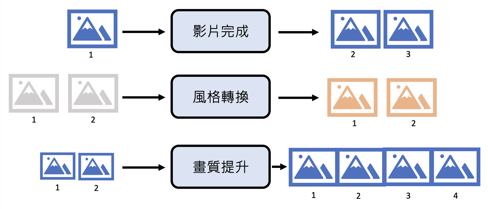

此外，还有通过其他输入生成图像的方式，比如 Talking Head 模型将一段语音和一张图像作为输入，生成基于这些输入的视频。

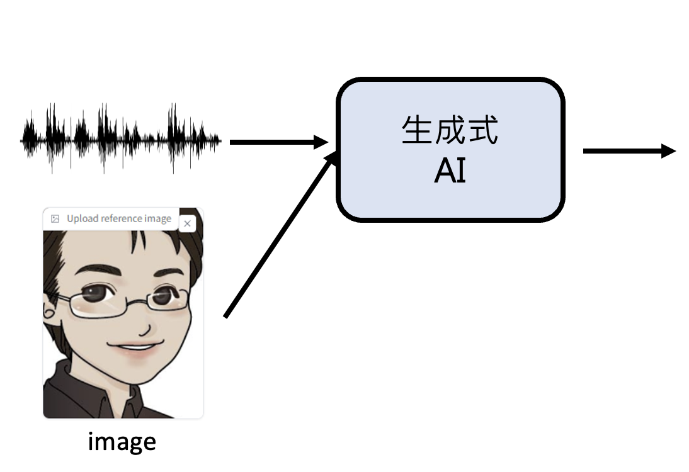{ align=left width=45% }

<!-- {: style='width: 30%'} -->

- [论文](https://arxiv.org/abs/2403.17694)
- [Demo](https://huggingface.co/spaces/ZJYang/AniPortrait_official)

另一个例子是根据简笔画生成具体的图像（[ControlNet](https://arxiv.org/abs/2302.05543)）：

    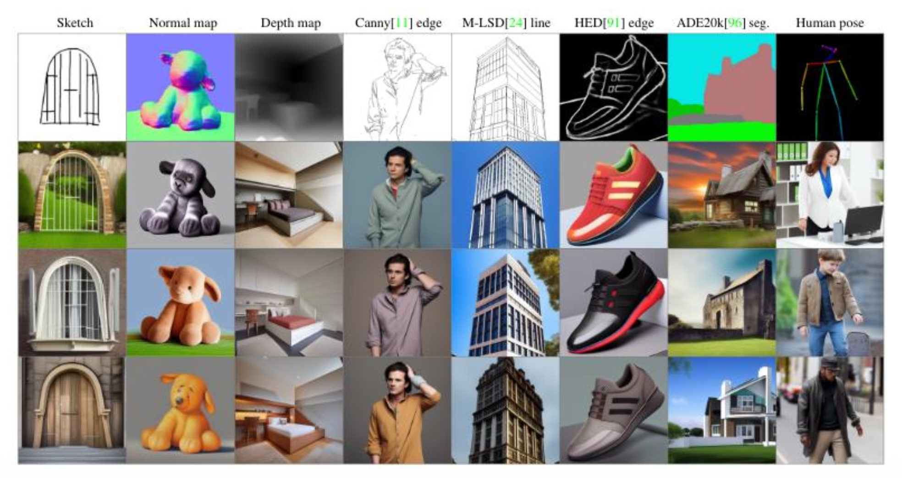

---

在正式了解 AI 生成图像/视频的原理前，先来认识一下它们的基本单位：

- 图像由像素构成

    

        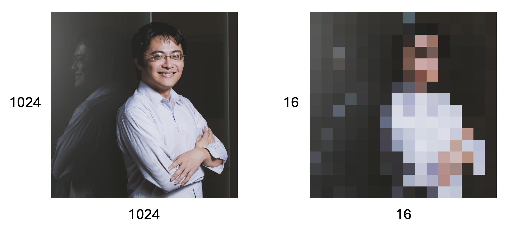
    

- 视频实际上由多张图像构成

  - 每张图像被称作**帧**(frame)
  - 对应的基本单位为 **FPS**（帧每秒，frame per second），显然 FPS 越高视频越流畅

    

        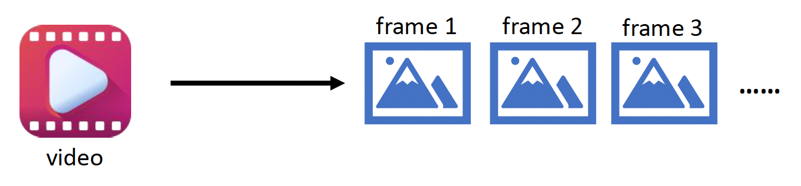
    

AI 理解图像时会把图像划分为多个**块**(patch)。经过一个叫做**编码器**(encoder)的模型后，每个块的所有像素就会被转换为一个值。随后这些值排成一行，被丢到另一个叫做**解码器**(decoder)的模型中，它的任务是根据这些值尽可能还原图像。

    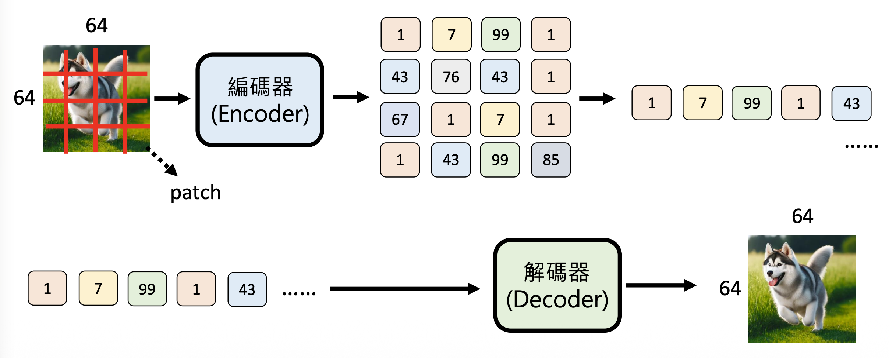

> [相关资料](https://arxiv.org/abs/2111.06377)

AI 理解视频的方法是类似的，只是现在要理解多张图像。相应地，编码器会输出多组向量值（一个向量对应一帧的编码）。之后还要再用一个编码器，从时间维度上对视频进行编码，简单来说即相邻的向量会被合并成一个向量。经过第二个编码器得到的一组向量最后会被放在一排，丢给解码器做后续处理。

    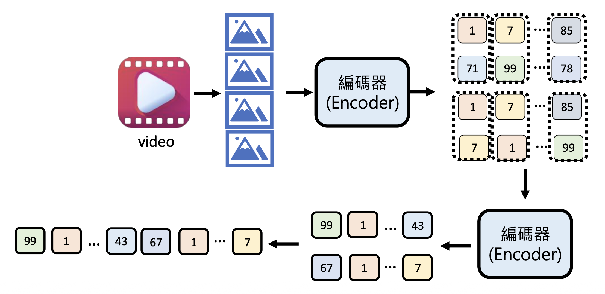

> [相关资料](https://arxiv.org/abs/2103.15691)

- Sora 也用到了类似的技术

    

        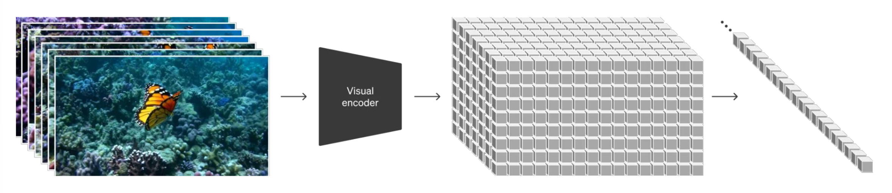
    

## Images

### Text-to-Image

对于文生图模型，训练用的标注数据应当是成对的文本描述和对应的图像。

    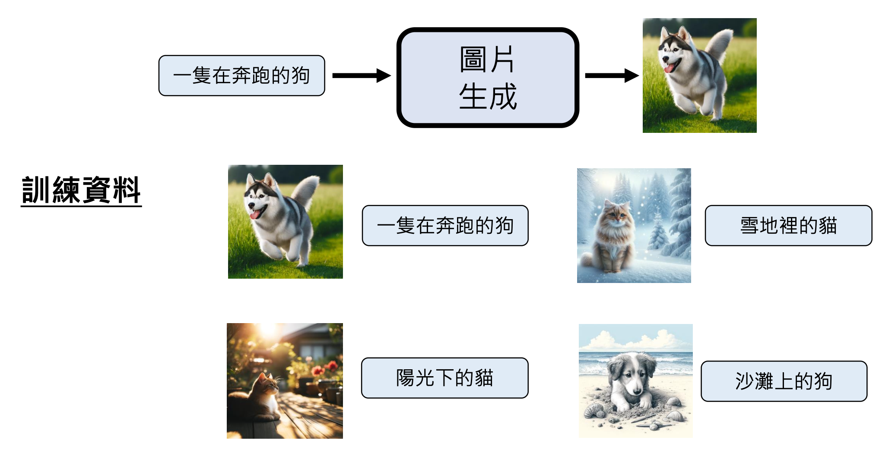

有一个知名的训练数据集叫做 [LAION](https://laion.ai/blog/laion-5b/)，里面收集了 5.85B 左右的图像。

    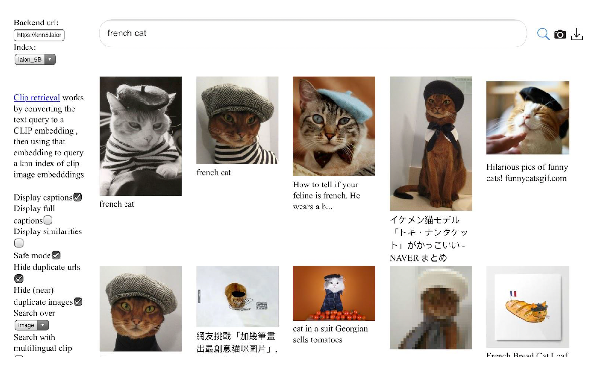

现在来看文生图模型的具体训练过程。与文本模型的“文字接龙”训练类似，这里的训练方式是块(patch)接龙。开始训练时，对于原始文本输入，模型要输出一个块，之后训练的时候将这个块加入到输入文本中。接下来模型根据文本和第一个块，输出第二个块，之后将第二个块加到输入中用于后续生成，以此类推。

    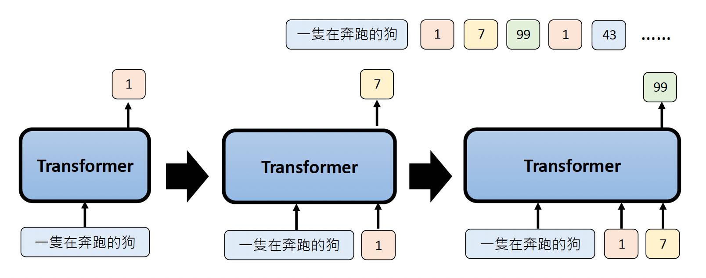

当然，这样一个个生成块的方式太慢了，所以也存在一种能够并行生成所有块的方式，如图所示：

    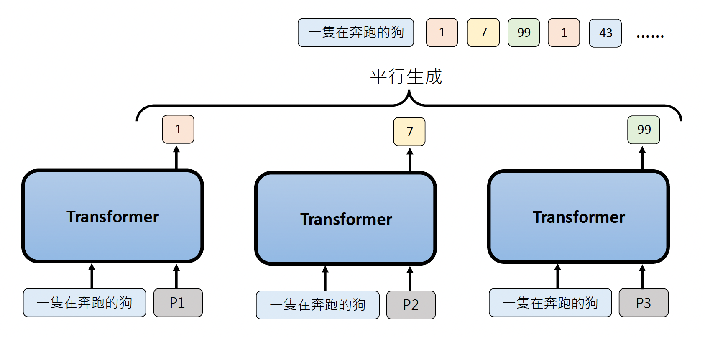

既然要用到相同的 Transformer 架构，那么干脆让一个 Transformer 同时考虑所有位置上的块。虽然还是独立生成每个位置上的块，但 Transformer 的注意机制会在生成每个位置的块的时候考虑到其他位置，这样得到的图像质量可能更高。

    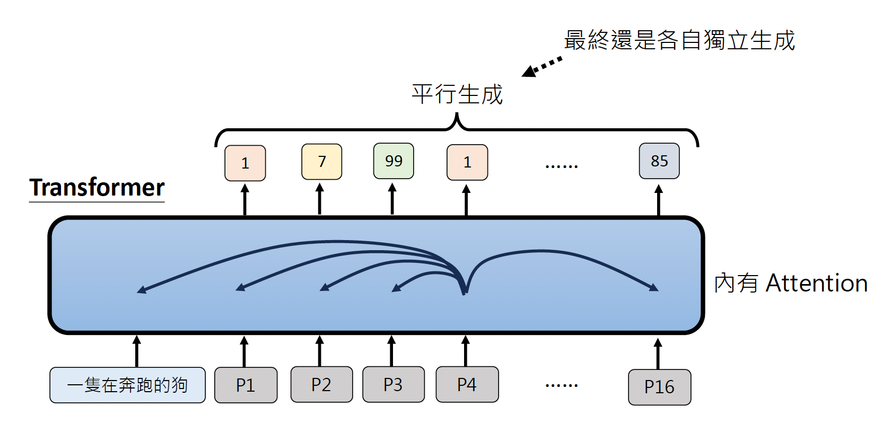

### Evaluation

下面考虑如何评估生成图像质量的好坏。这里介绍的方法不是由人类完成的，而是让另一个模型负责评估。其中比较著名的一个模型叫做 [CLIP](https://arxiv.org/abs/2103.00020)，它将一段文本描述和一幅图像作为输入，输出一个表明两者相关程度的分数，分越高表明生成图像质量越高。

    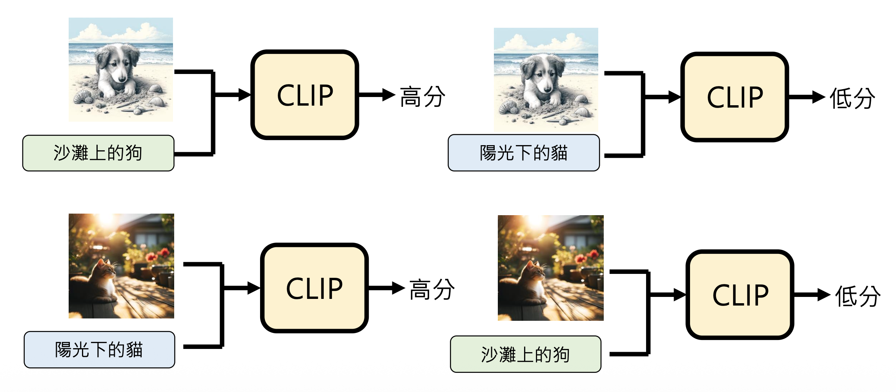

    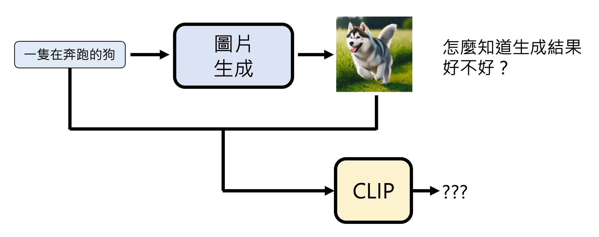

### Customization

我们还可以对文生图做一些操作，以实现个性化的图像生成。具体方法为：先让模型阅读一张图像，记作 $S_*$（之后模型就要基于这张图像生成其他图像）。为了让模型更深入理解 $S_*$ 对应的图像，我们还可以在原图像的基础上加一些噪音，得到一些与原图像类似的图像。对模型而言，这些图像需均被视为 $S_*$。

    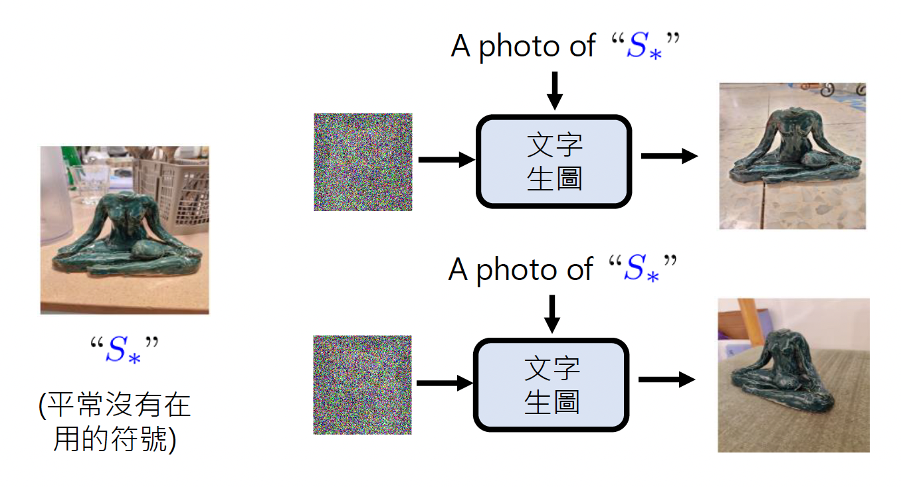

接下来，模型根据 $S_*$ 和用户的文本输入，输出基于 $S_*$，又符合文本描述的图像。

    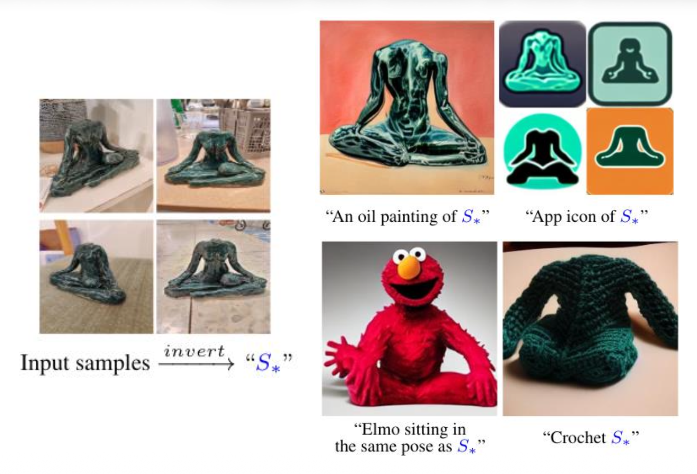

>[相关研究](https://arxiv.org/abs/2208.01618)

## Videos

### Challenge

也许读者想将训练文生图模型的思路应用在文本生视频的模型的训练中，但这是不切实际的。试想一下：假如一个视频为 24 FPS，且每一帧有 64x64 的块。那么一分钟的视频就有 1440 个帧（约六百万的块）如果这些块都丢给 Transformer 且每两个块都要计算注意分数，那么就要做 36 兆次注意计算——这么庞大的计算量显然是我们无法承受的。

    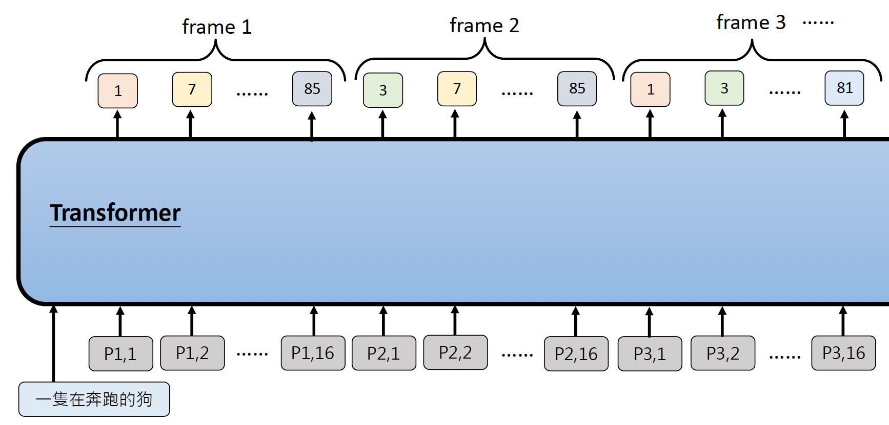

于是

### Approaches

#### VAE and Flow-based

#### Diffusion

#### GAN