# Image and Video Generation

和影像有关的生成式 AI 包括：

    

> 当然还有图生图的架构，不过这里没有列出来。

其中第一种形式（“看图说话”）在前面已多次介绍过，而且现在的模型基本具备阅读和理解图像的能力了，所以这里不再赘述了。那么接下来就直接看第二种形式——文生图了。24 年年初 OpenAI 爆出的 [Sora](https://sora.chatgpt.com/) 就是一种文生图的模型，下面展示了一些使用 Sora 的例子：

??? example "例子"

    === "例1"

        

        Prompt: Animated scene features a close-up of a short fluffy monster kneeling beside a melting red candle. The art style is 3D and realistic, with a focus on lighting and texture.

    === "例2"

        

        Prompt: New York City submerged like Atlantis. Fish, whales, sea turtles and sharks swim through the streets of New York.

    这里生成的都是一些现实世界中不存在的东西。不过这些视频还都有些小瑕疵，比如例1小怪兽没动，后面的墙壁却移动了；例2的龟变成了鱼等等。

    ---
    下面 2 个例子的 bug 还要多

    === "例3"

        

        Prompt: Five gray wolf pups frolicking and chasing each other around a remote gravel road, surrounded by grass. The pups run and leap, chasing each other, and nipping at each other, playing.

    === "例4"

        

        Prompt: Archeologists discover a generic plastic chair in the desert, excavating and dusting it with great care.

第三种没列出来的形式是影像生影像，它的具体应用包括：

- 影片补全
- 风格转换
- 画质提升（分辨率 ⬆️）
- ...

    

此外，还有通过其他输入生成图像的方式，比如 Talking Head 模型将一段语音和一张图像作为输入，生成基于这些输入的视频。

{ align=left width=45% }

{: style='width: 30%'}

- [论文](https://arxiv.org/abs/2403.17694)
- [Demo](https://huggingface.co/spaces/ZJYang/AniPortrait_official)

另一个例子是根据简笔画生成具体的图像（[ControlNet](https://arxiv.org/abs/2302.05543)）：

    

---

在正式了解 AI 生成图像/视频的原理前，先来认识一下它们的基本单位：

- 图像由像素构成

    

        
    

- 视频实际上由多张图像构成

  - 每张图像被称作**帧**(frame)
  - 对应的基本单位为 **FPS**（帧每秒，frame per second），显然 FPS 越高视频越流畅

    

        
    

AI 理解图像时会把图像划分为多个**块**(patch)。经过一个叫做**编码器**(encoder)的模型后，每个块的所有像素就会被转换为一个值。随后这些值排成一行，被丢到另一个叫做**解码器**(decoder)的模型中，它的任务是根据这些值尽可能还原图像。

    

> [相关资料](https://arxiv.org/abs/2111.06377)

AI 理解视频的方法是类似的，只是现在要理解多张图像。相应地，编码器会输出多组向量值（一个向量对应一帧的编码）。之后还要再用一个编码器，从时间维度上对视频进行编码，简单来说即相邻的向量会被合并成一个向量。经过第二个编码器得到的一组向量最后会被放在一排，丢给解码器做后续处理。

    

> [相关资料](https://arxiv.org/abs/2103.15691)

- Sora 也用到了类似的技术

    

        
    

## Images

### Text-to-Image

对于文生图模型，训练用的标注数据应当是成对的文本描述和对应的图像。

    

有一个知名的训练数据集叫做 [LAION](https://laion.ai/blog/laion-5b/)，里面收集了 5.85B 左右的图像。

    

现在来看文生图模型的具体训练过程。与文本模型的“文字接龙”训练类似，这里的训练方式是块(patch)接龙。开始训练时，对于原始文本输入，模型要输出一个块，之后训练的时候将这个块加入到输入文本中。接下来模型根据文本和第一个块，输出第二个块，之后将第二个块加到输入中用于后续生成，以此类推。

    

当然，这样一个个生成块的方式太慢了，所以也存在一种能够并行生成所有块的方式，如图所示：

    

既然要用到相同的 Transformer 架构，那么干脆让一个 Transformer 同时考虑所有位置上的块。虽然还是独立生成每个位置上的块，但 Transformer 的注意机制会在生成每个位置的块的时候考虑到其他位置，这样得到的图像质量可能更高。

    

### Evaluation

下面考虑如何评估生成图像质量的好坏。这里介绍的方法不是由人类完成的，而是让另一个模型负责评估。其中比较著名的一个模型叫做 [CLIP](https://arxiv.org/abs/2103.00020)，它将一段文本描述和一幅图像作为输入，输出一个表明两者相关程度的分数，分越高表明生成图像质量越高。

    

    

### Customization

我们还可以对文生图做一些操作，以实现个性化的图像生成。具体方法为：先让模型阅读一张图像，记作 $S_*$（之后模型就要基于这张图像生成其他图像）。为了让模型更深入理解 $S_*$ 对应的图像，我们还可以在原图像的基础上加一些噪音，得到一些与原图像类似的图像。对模型而言，这些图像需均被视为 $S_*$。

    

接下来，模型根据 $S_*$ 和用户的文本输入，输出基于 $S_*$，又符合文本描述的图像。

    

>[相关研究](https://arxiv.org/abs/2208.01618)

## Videos

### Challenge

也许读者想将训练文生图模型的思路应用在文本生视频的模型的训练中，但这是不切实际的。试想一下：假如一个视频为 24 FPS，且每一帧有 64x64 的块。那么一分钟的视频就有 1440 个帧（约六百万的块）如果这些块都丢给 Transformer 且每两个块都要计算注意分数，那么就要做 36 兆次注意计算——这么庞大的计算量显然是我们无法承受的。

    

所以近些年来的一些研究致力于减少计算量，下面展示了相关方法：

- **时空注意**(spatial-temporal attention)（3D）：对于某一帧的块，仅考虑与该帧相邻的一些帧

    

        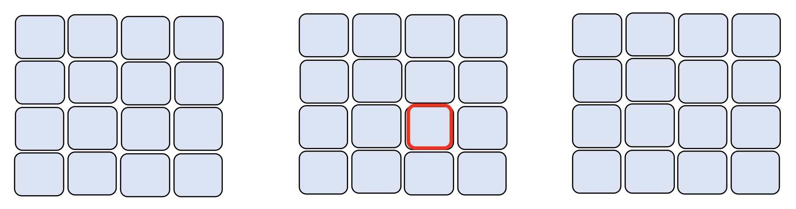
    

    - 但现在很少有人采用这种方法，因为计算量太大

- **空间注意**(spatial attention)（2D）：仅考虑块所在帧的所有快

    

        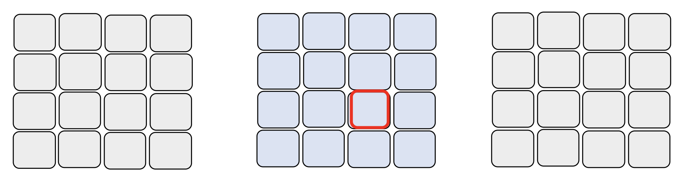
    

- **时间注意**(temporal attention)（1D）：仅考虑与该块在其他帧上的相同位置上的块

    

        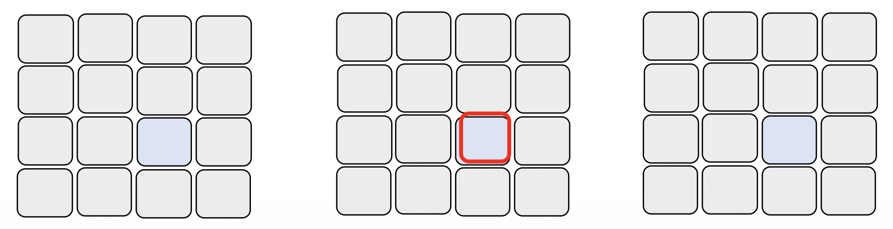
    

但是后两者方法都具有一定的局限性（仅考虑时间或空间），不过我们可以将两者结合起来使用，构成一种伪 3D 的注意计算。

    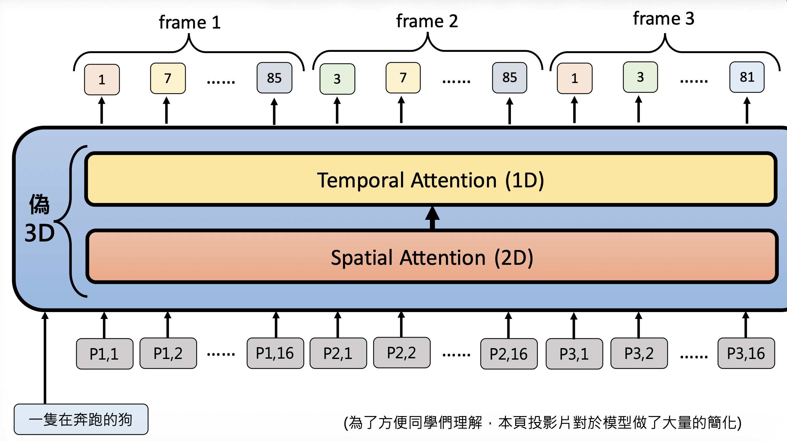

??? example "例子"

    

        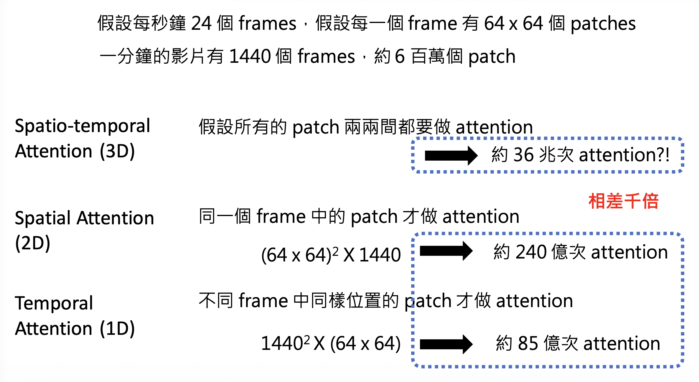
    

---
另一种减小计算量的思路是生成视频不必一步到位——将生成的过程拆分成多个阶段完成。

    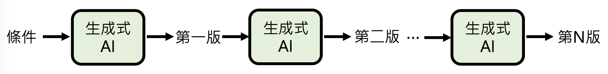

前一版和后一版的差别可以是：

- 后一版的图像分辨率更高

    

        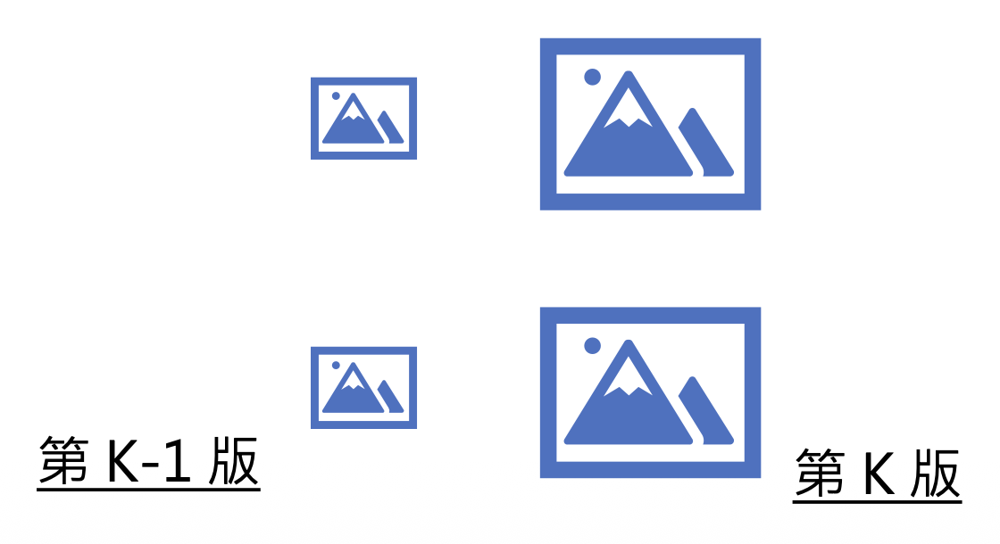
    

- 后一版的帧数更高

    

        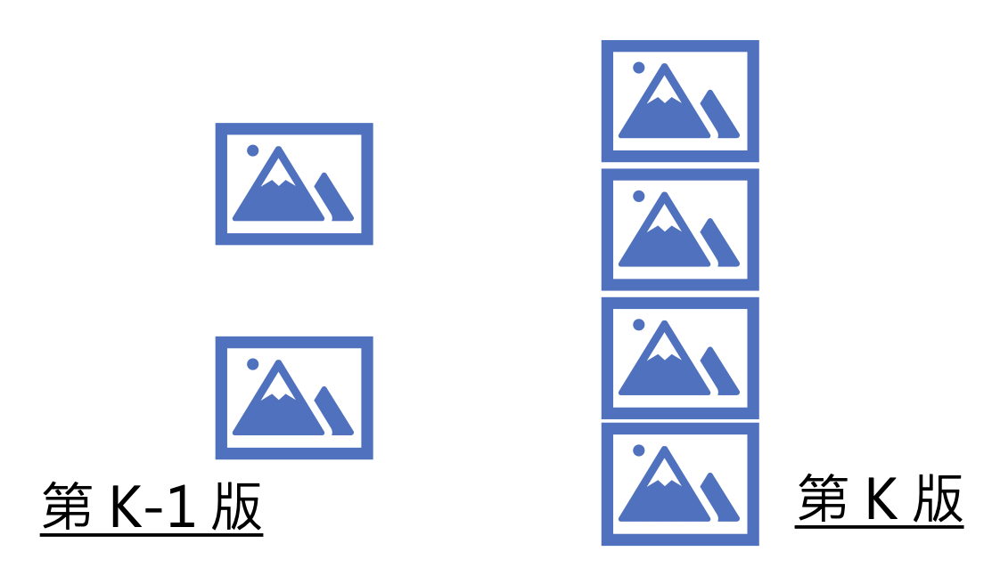
    

???+ example "例子"

    Google 的 [Imagen](https://arxiv.org/abs/2210.02303) 模型采用了这种思路。视频生成的过程如下所示：

    

        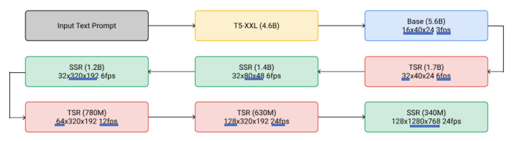
    

## Approaches

下面将介绍一些经典的图像/视频生成方法：

- **变分自编码器**(variational auto-encoder, **VAE**)
- **基于流的方法**(flow-based method)
- **扩散法**(diffusion method)
- **生成式对抗网络**(generative adversarial network, **GAN**)

### VAE and Flow-based

其实上一讲有提到过：对于相同的描述，模型可能有多种生成的可能。比如对于“一只奔跑的狗”的描述，模型既可以画一张在草原奔跑的哈士奇，也可以画一张在都市行走的柴犬。这种“既要又要”的局面可能会让模型绘制出四不像的东西，所以我们需要为图像生成的模型增加额外“脑补”的内容。具体做法为：

- 训练：采用[**自编码器**](../ml/7.md#auto-encoder)的架构，其中解码器就是图像生成的模型，而编码器负责从图像中提取有用信息，作为图像生成模型“脑补”的内容。

    

        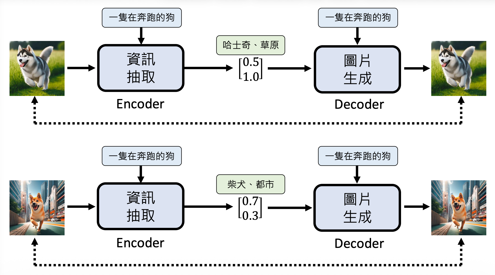
    

- 测试：脑补的内容随机生成，而不是来自编码器的输出

    

        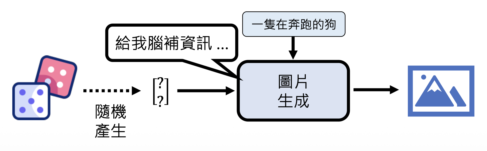
    

VAE 和基于流的方法均以该思路作为基础：

- VAE

    

        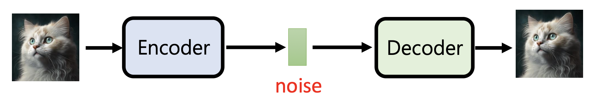
    

- 基于流的方法：解码器是一个可逆的函数，而编码器就是解码器的反函数

    

        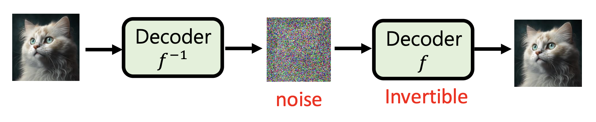
    

虽然中间产物叫做**噪音**(noise)，但实际上它包含了关于图像的有用信息（只是人类无法直接看出来）。

???+ example "例子"

    给编码器看一组人脸图像，它会提取关于面部表情相关的信息。

    

        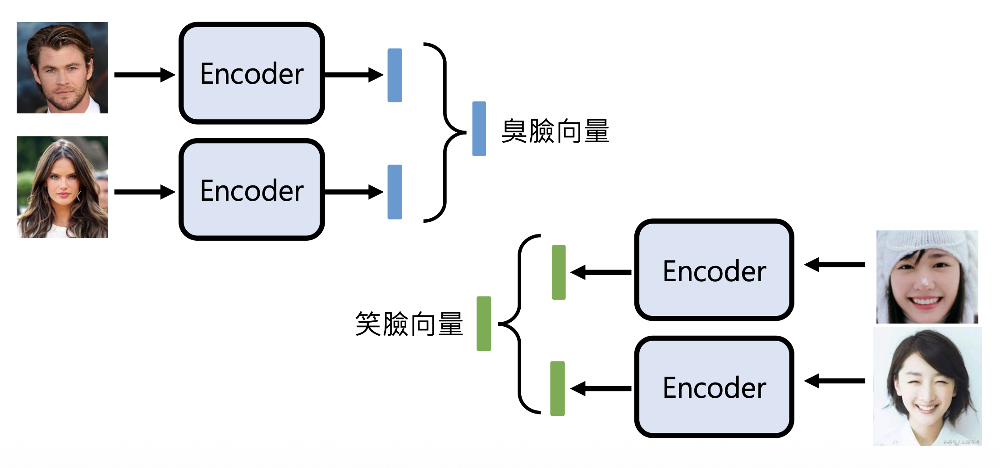
    

    利用前面训练的结果，我们可提取出通用的臭脸和笑脸向量。这样，对于一张模型从未见过的图像，我们可以先将其编码为向量，然后减去臭脸向量，再加上笑脸向量，最后用解码器还原为图像，这样图像上的人脸就会笑的更加灿烂。

    

        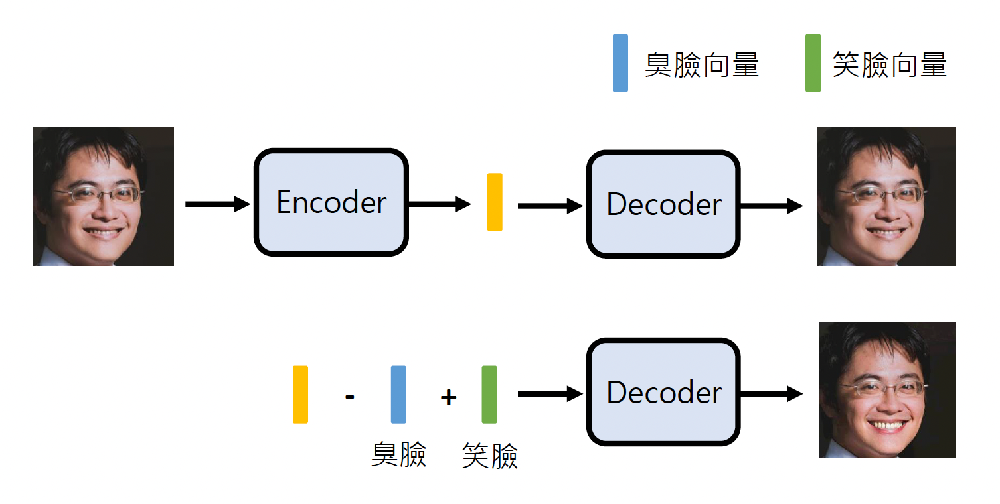
    

    >[相关研究](https://openai.com/blog/glow/)

#### Flow-based Generative Model

??? bug "在基于流的模型出现前，其他生成模型的问题"

    - 自回归模型：
        - 什么样的顺序是最佳的生成顺序？（不同的顺序可能会影响生成质量）
        - 生成速度太慢
    - VAE：只能优化下界，不能直接优化函数本身
    - GAN：训练不稳定

    基于流的模型能够解决上述痛点。

基于流的模型的核心部分是一个叫做**生成器**(generator)的网络，记作 $G$，它定义了一个概率分布 $p_G$。其输入是一个来自正态分布 $\pi(z)$ 的值 $z$，对应的输出记作 $x = G(z)$，而输出的分布就是 $p(G)$。训练的目标就是让生成器的输出分布 $p_G$ 和标准答案（也是一个分布）$p_{data}$ 越接近越好。

    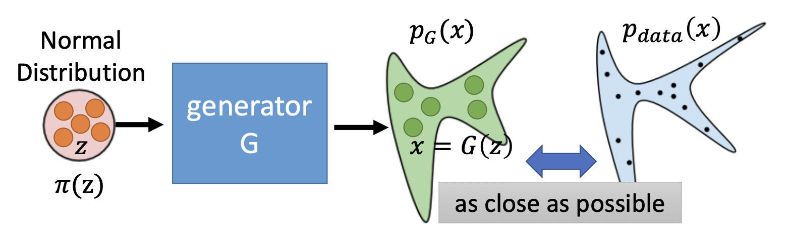

从定量角度看，训练的优化目标就是找到合适的生成器参数 $G^* = \arg \max\limits_G \sum_{i=1}^m \log P_G (x^i)$，其中 $\{x^1, x^2, \dots, x^m\}$ 来自分布 $P_{data}(x)$。所以基于流的方法能够直接优化目标函数本身。

要想进一步了解该模型的原理，首先得具备以下数学背景知识：

- **雅可比矩阵**(Jacobian matrix)
    - 假设 $x = f(z), z = f^{-1}(x)$（即 $f$ 是可逆的），$\bm{z} = \begin{bmatrix}z_1 \\ z_2\end{bmatrix}, \bm{x} = \begin{bmatrix}x_1 \\ x_2\end{bmatrix}$
    - 那么雅可比矩阵 
    
        $$
        J_f = \begin{bmatrix}\frac{\partial x_1}{\partial z_1} & \frac{\partial x_1}{\partial z_2} \\ \frac{\partial x_2}{\partial z_1} & \frac{\partial x_2}{\partial z_2}\end{bmatrix}, J_{f^{-1}} = \begin{bmatrix}\frac{\partial z_1}{\partial x_1} & \frac{\partial z_1}{\partial x_2} \\ \frac{\partial z_2}{\partial x_1} & \frac{\partial z_2}{\partial x_2}\end{bmatrix}
        $$

        - 以 $J_f$ 为例，同一行的输入是一样的，同一列的输出是一样的

    - 不难发现 $J_f J_{f^{-1}} = I$（单位矩阵）

    ??? example "例子"

        

            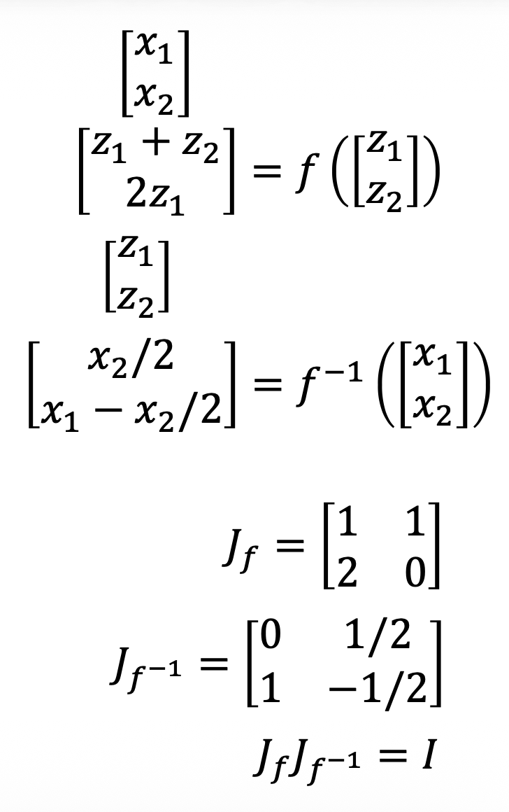
        

- **行列式**(determinant)：仅考虑 2x2 和 3x3 的方阵
    - 2x2

        

            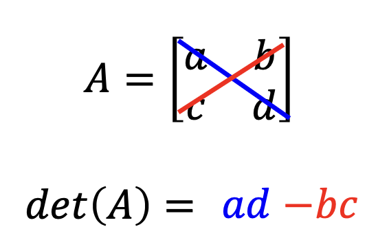
        

        从几何角度看，行列式的**绝对值**为一个平行四边形的面积

        

            
        

    - 3x3

        

            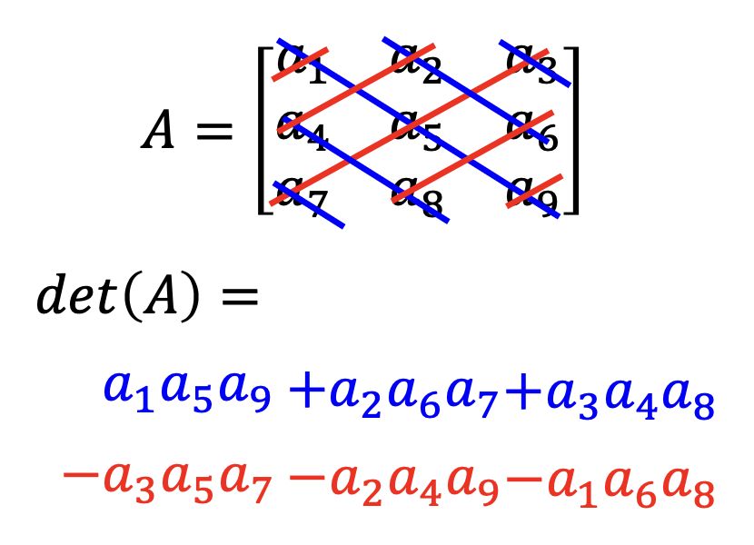
        

        从几何角度看，行列式的**绝对值**为一个平行六面体的体积

        

            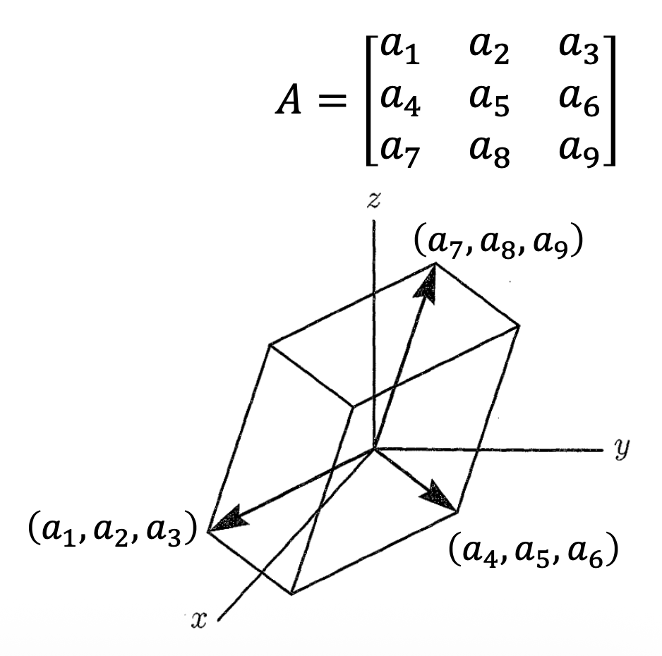
        

    - 因为 $\det(A) = \dfrac{1}{\det(A^{-1})}$，所以 $\det(J_f) = \dfrac{1}{\det(J_{f^{-1}})}$

- **变量替换定理**(change of variable theorem)
    - 这里想要探讨的是：对于输入分布 $\pi(z)$ 上的一点 $z'$，输出 $x' = f(z')$ 的分布 $p(x')$ 和 $\pi(z')$ 之间有什么样的关系
    - 先从最简单的均匀分布为例。假如 $\pi(z)$ 是 $[0, 1]$ 之间的均匀分布，而 $p(x)$ 是 $[1, 3]$ 之间的均匀分布。令 $x = f(z) = 2z + 1$，那么 $p(x') = \dfrac{1}{2}\pi(z')$ 

        

            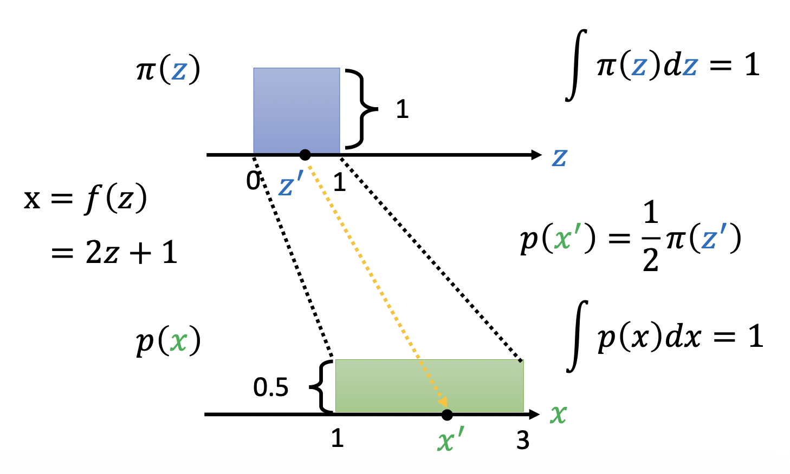
        

    - 扩展到一般情况，我们可以取两个分布中面积相等且变化不大的部分，将它们近似看作矩形。

        

            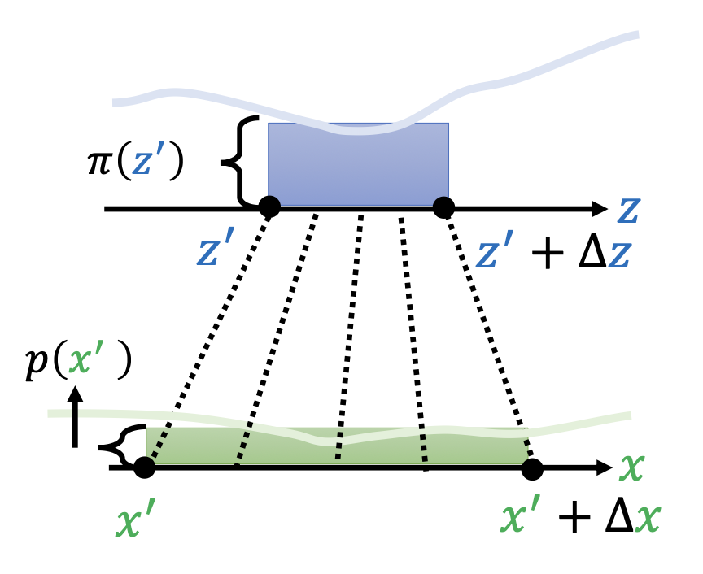
        

        - 由于面积相等，可以得到等式 $p(x') \Delta x = \pi(x') \Delta z$。两边同时除以 $\Delta x$，转化为 $p(x') = \pi(x') \dfrac{\Delta z}{\Delta x}$
        - 如果 $\Delta z, \Delta x$ 的值很小的话，可以用导数来代替，即 $p(x') = \pi(x') \dfrac{d z}{d x}$
        - 由于导数可正可负，因此导数要取绝对值，即 $p(x') = \pi(x') \Big|\dfrac{d z}{d x}\Big|$

    - 进一步扩展到二维的分布

        

            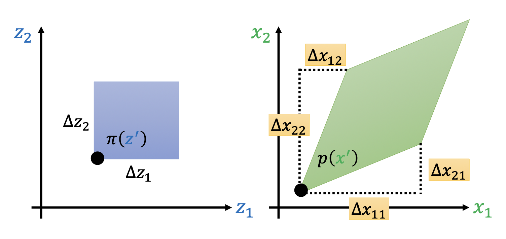
        

        - 计算公式：$p(x') \left|\det\begin{bmatrix}\Delta x_{11} & \Delta x_{12} \\ \Delta x_{21} & \Delta x_{22}\end{bmatrix}\right| = \pi(z') \Delta z_1 \Delta z_2$
        - 其中 $\Delta x_{ij}$ 表示 $z_j$ 变化的时候，$x_i$ 的改变量
        - 让我们将这个式子转化到能用雅可比矩阵表示出来的形式

            $$
            \begin{align*}
            p(x') \left|\det\begin{bmatrix}\Delta x_{11} & \Delta x_{12} \\ \Delta x_{21} & \Delta x_{22}\end{bmatrix}\right| & = \pi(z') \Delta z_1 \Delta z_2 \\
            p(x') \left| \dfrac{1}{\Delta z_1 \Delta z_2} \det\begin{bmatrix}\Delta x_{11} & \Delta x_{12} \\ \Delta x_{21} & \Delta x_{22}\end{bmatrix}\right| & = \pi(z') \\
            p(x') \left|\det\begin{bmatrix}\Delta x_{11} / \Delta z_1 & \Delta x_{12} / \Delta z_1 \\ \Delta x_{21} / \Delta z_2 & \Delta x_{22} / \Delta z_2\end{bmatrix}\right| & = \pi(z') \\
            p(x') \left|\det\begin{bmatrix}\partial x_1 / \partial z_1 & \partial x_2 / \partial z_1 \\ \partial x_1 / \partial z_2 & \partial x_2 / \partial z_2\end{bmatrix}\right| & = \pi(z') \\
            p(x') \left|\det\begin{bmatrix}\partial x_1 / \partial z_1 & \partial x_1 / \partial z_2 \\ \partial x_2 / \partial z_1 & \partial x_2 / \partial z_2\end{bmatrix}\right| & = \pi(z') \\
            p(x') |\det(J_f)| & = \pi(z') \\
            p(x') & = \pi(z') |\det(J_{f^{-1}})|
            \end{align*}
            $$

---
有了上面的数学基础后，我们可以进一步理解下面形式化的解释。回顾一下，训练目标是找到 $G^* = \arg \max\limits_G \sum_{i=1}^m \log P_G (x^i)$。根据变量替换定理，$p_G(x^i) = \pi(z^i) |\det(J_{G^{-1}})|$，其中 $z_i = G^{-1}(x^i)$。所以 $\log P_G (x^i) = \log \pi (G^{-1}(x^i)) + \log |\det(J_{G^{-1}})|$。要想确定这样的式子，就要满足：

- $\det(J_G)$ 能被计算出来
- 知道 $G^{-1}$，所以输入和输出的维度应当是一样

所以 $G$ 是有限制的，不能是任意的网络，那么这也意味着 $G$ 的能力也可能是有限的。所以为了提高生成质量，可以将多个生成器连在一起，前一个生成器的输出作为另一个生成器的输入，将最后一个输出作为最终输出。这也正是 "flow-based" 的由来。

    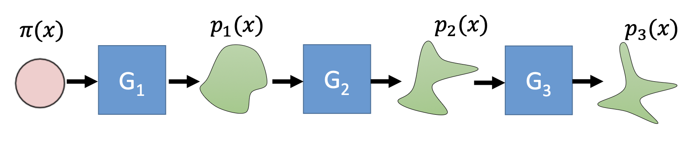

假如有 $K$ 个生成器，输出分布为：$p_K(x^i) = \pi(z^i) (|\det(J_{G_1^{-1}})|) \dots (|\det(J_{G_K^{-1}})|)$。两边取对数，可得 $\log p_K(x^i) = \log \pi(z^i) + \sum\limits_{h=1}^K \log (|\det(J_{G_h^{-1}})|)$。

回过头来看，$\log P_G (x^i) = \log \pi (G^{-1}(x^i)) + \log |\det(J_{G^{-1}})|$ 这个式子中出现的是 $G^{-1}$ 而非 $G$，所以实际上我们要训练的是 $G^{-1}$，但生成的任务还是要拿 $G$ 来做。

    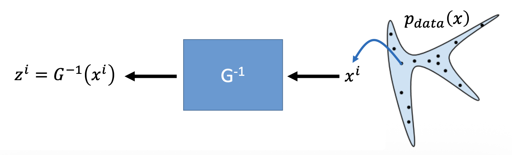

- $\log \pi (G^{-1}(x^i))$
    - 令 $z^i = G^{-1}(x^i)$
    - 要让这一项最大化，就要让 $z^i$ 尽可能接近零向量（因为（标准）正态分布中零向量的概率最大）
- $\log |\det(J_{G^{-1}})|$：
    - 但如果 $z^i$ 接近零向量，$J_{G^{-1}}$ 就会接近零矩阵，那么这一项就会越接近负无穷
    - 所以实际训练时不会让所有的 $z$ 都接近零向量

---
实际上，生成器对应的网络叫做**耦合层**(coupling layer)，在比较知名的基于流的模型 [NICE](https://arxiv.org/abs/1410.8516) 和 [Real NVP](https://arxiv.org/abs/1605.08803) 中均有应用。对于 $\bm{z} = [z_1 \dots z_D]^T$，

    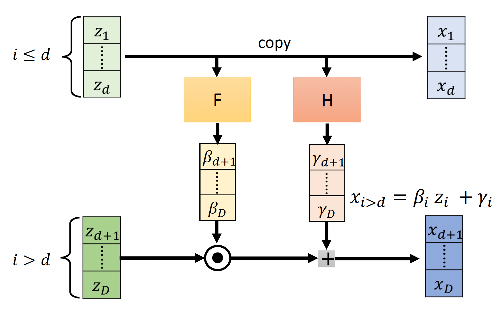

- 若 $i \le d$，$x_i = z_i$
- 否则 $x_{i > d} = \beta_i z_i + \gamma_i$
    - 其中 $\beta_i, \gamma_i$ 来自函数 $F, H$。它们以 $z_1, \dots, z_d$ 为输入，分别输出 $\beta_{d+1}, \dots, \beta_D;\ \gamma_{d+1}, \dots, \gamma_D$。$F, H$ 要多复杂都可以，并且不需要是可逆函数
    - 之所以不必可逆，是因为我们可以从 $[x_1, \dots, x_D]^T$ 反推 $[z_1, \dots, z_D]^T$
        - $z_{i \le d} = x_i$
        - $z_{i > d} = \dfrac{x_i - \gamma_i}{\beta_i}$

下面考虑耦合层下的雅可比矩阵：

    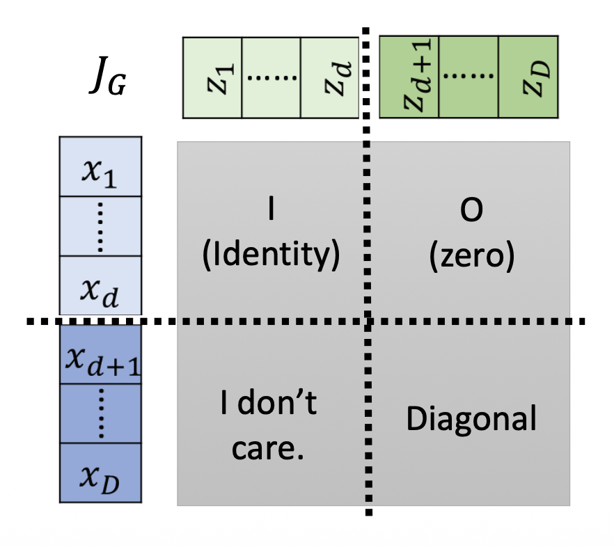

- 左上：因为 $x_i = d_i$，所以这里的矩阵是一个单位矩阵
- 右上：$i > d$ 时 $z$ 的计算和 $i \le d$ 的 $x$ 毫无关系，所以是一个零矩阵
- 左下：计算行列式时，由于右上是一个零矩阵，因此这里无论是什么都不会被算进去，所以无需考虑
- 右下：对角矩阵，因为 $d_i$ 仅和 $x_i$ 有关

综上，$\det(J_G) = \dfrac{\partial x_{d+1}}{\partial z_{d+1}} \dfrac{\partial x_{d+2}}{\partial z_{d+2}} \dfrac{\partial x_D}{\partial z_D} = \beta_{d+1} \beta_{d+2} \dots \beta_D$。

由于基于流的模型会用到不止一个生成器，所以如果不做任何改变的话，那么输入向量的前半部分就会被一直复制，直接作为最终输出向量的前半部分（上图），这显然是不合理的。所以还要采用一种叫做**堆叠**(stacking)的技术，将当前层中不是直接复制过来的元素直接复制到下一个耦合层的输出（下图），这样就可以避免某部分元素从未改变的情况。

    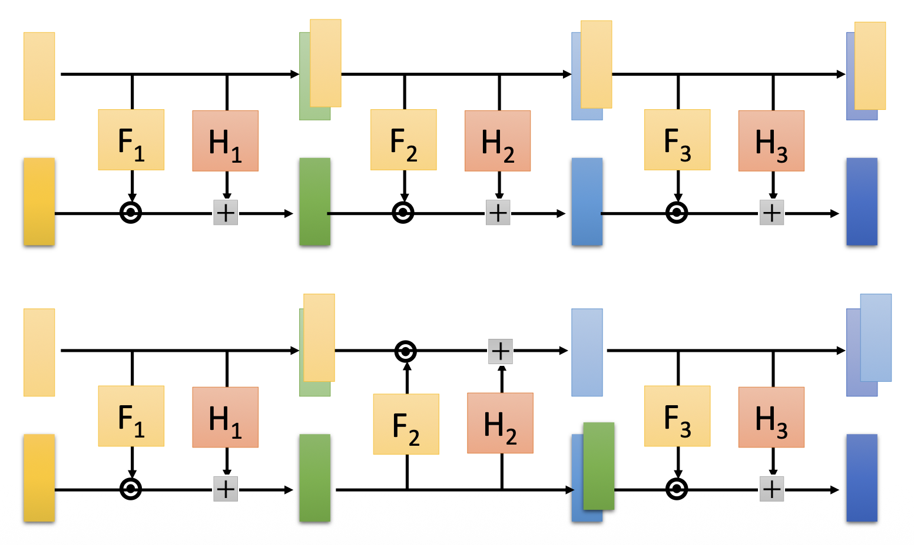

更具体地，如果要做图像生成的话，我们可以这样做：先直接复制索引和为奇数的元素作为耦合层的输出，并计算索引和为偶数的元素。到了下一层就反过来做，以此类推。

    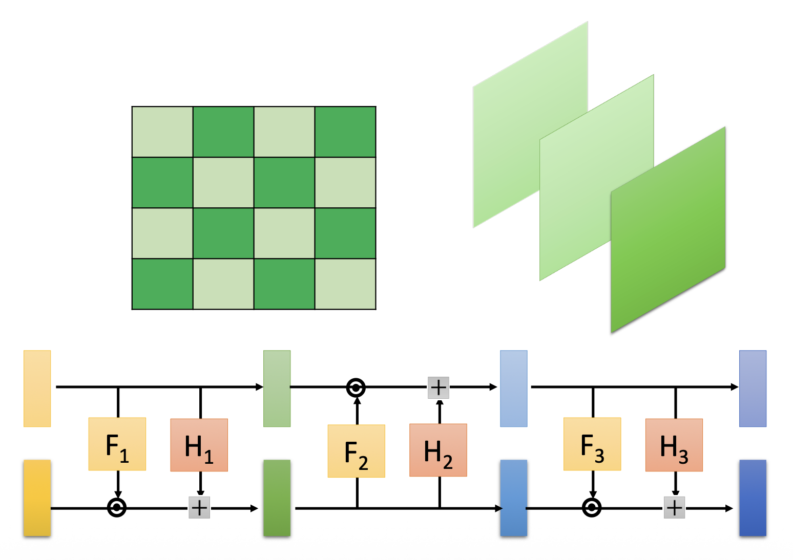

---
第二种可作为生成器的网络是 **1x1 卷积**(1x1 convolution)。具体做法是：让图像中的每个像素（包含3个通道，即三维向量）$\bm{z}$ 乘上一个 3x3 的矩阵 $W$，得到向量 $\bm{x}$。

    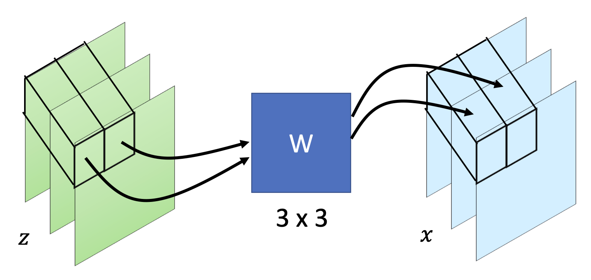

- $W$ 是通过机器学习学出来的
- $W$ 能够打乱像素点的通道值
- 如果 $W$ 是可逆的（？），那么计算 $W^{-1}$ 比较容易

令 $\bm{x} = f(\bm{z}) = W\bm{z}$。实际上，$W$ 就是雅可比矩阵 $J_f$，即：

$$
J_f = \begin{bmatrix}\partial x_1 / \partial z_1 & \partial x_1 / \partial z_2 & \partial x_1 / \partial z_3 \\ \partial x_2 / \partial z_1 & \partial x_2 / \partial z_2 & \partial x_2 / \partial z_3 \\ \partial x_3 / \partial z_1 & \partial x_3 / \partial z_2 & \partial x_3 / \partial z_3\end{bmatrix} = \begin{bmatrix}w_{11} & w_{12} & w_{13} \\ w_{21} & w_{22} & w_{23} \\ w_{31} & w_{32} & w_{33}\end{bmatrix} = W
$$

假如图像大小为 dxd，考虑所有像素的权重矩阵 $W$，可得到：

    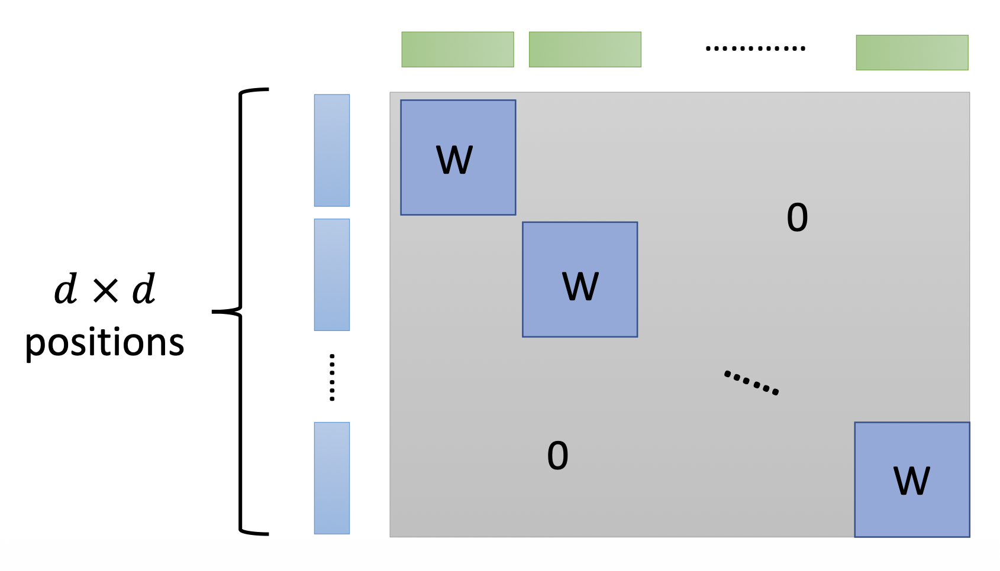

这个大矩阵的行列式值为 $(\det(W))^{d \times d}$。由于 $W$ 是 3x3 的矩阵，因此 $\det(W)$ 的值很容易算出来。

???+ example "应用"

    以下两个例子均来自 OpenAI 的 [GLOW](https://openai.com/blog/glow/) 模型，它就用到了 1x1 卷积的思路。

    === "例1"

        

            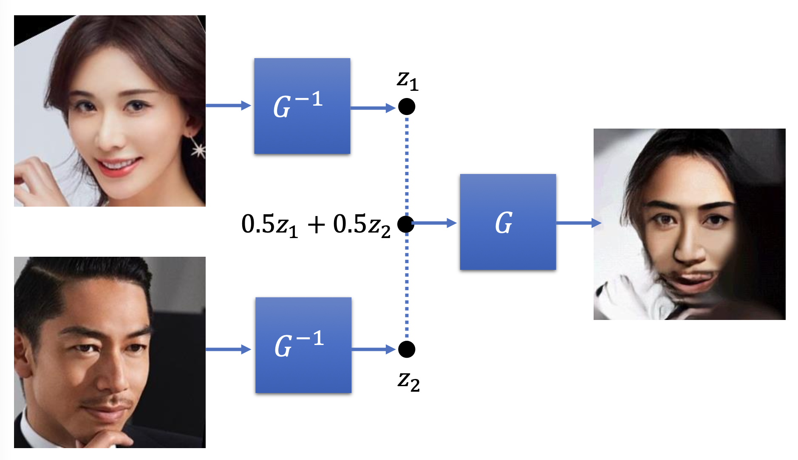
        

    === "例2"

        

            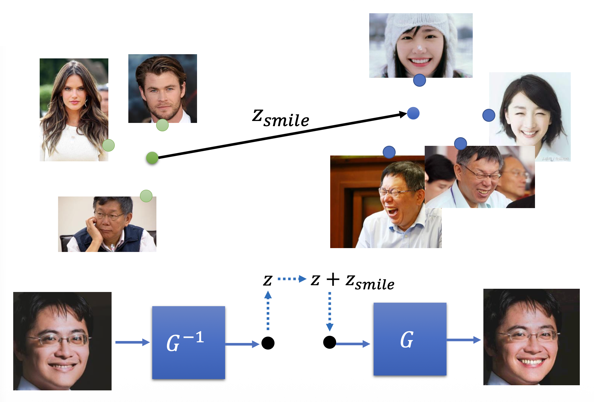
        

    ---
    除此之外，GLOW 还可用于语音领域：

    - [Parallel WaveNet](https://arxiv.org/abs/1711.10433)

        

            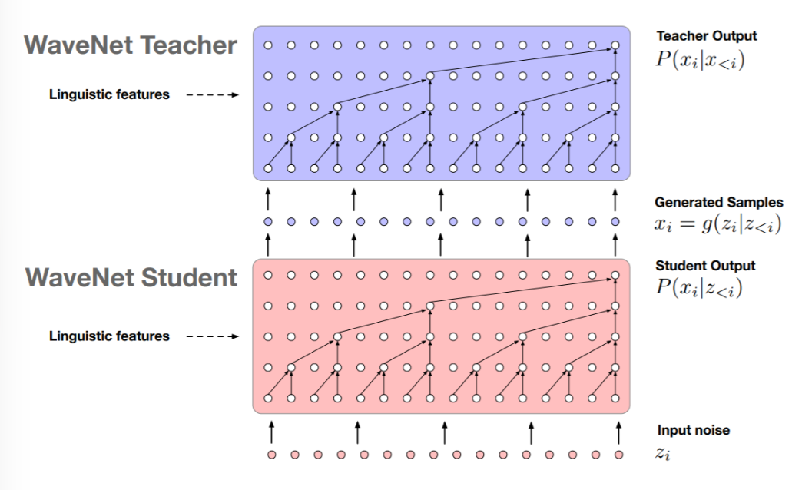
        

    - [WaveGlow](https://arxiv.org/abs/1811.00002)

        

            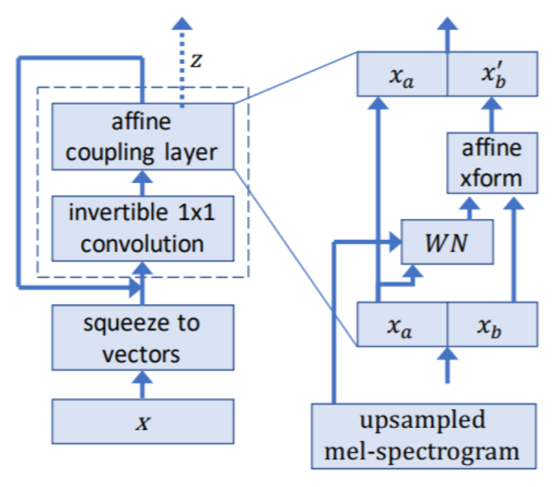
        

### Diffusion

扩散模型的运作机制是：

- 先获得一张和生成图像规模一样的随机噪声，然后通过一个去噪模型反复**去噪**(denoise)
- 去噪次数是预先确定的
- 去噪的步骤数是倒序排序的，也就是说最开始的步骤数最大的，往后递减，所以这个过程又叫**逆过程**(revervse process)

    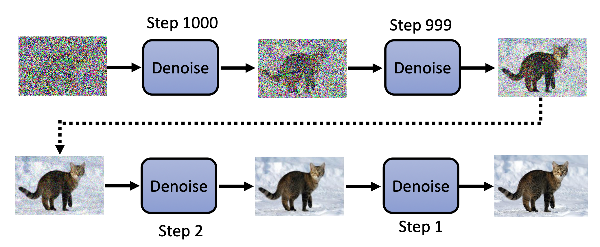

- 这个过程和雕刻一座雕像类似——雕像也是从一个大理石块开始（对应扩散模型的噪音），由雕塑家不断打磨，最终打造出一个石雕（对应扩散模型的生成图像）

在多轮去噪中，用的去噪模型都是同一个，但刚开始和快结束的两张图像的噪声量完全是不一样的，因此去噪模型除了将之前去噪过的图像作为输入外，还要考虑步骤数，因为步骤数和图像中的噪声量成正相关。

    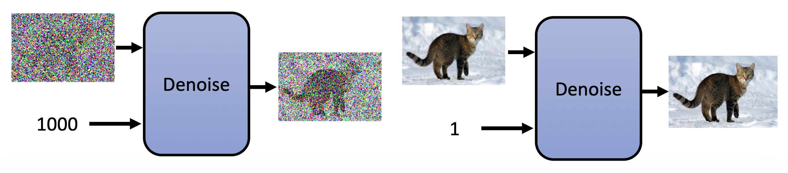

??? info "注"

    实际上，扩散模型也可以被看成是一种自回归，两者都是“N 步到位”的体现。

    

        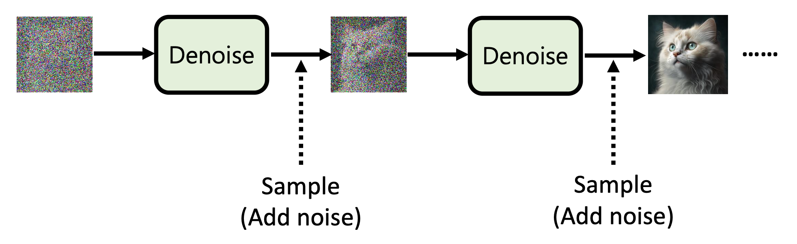
    

接下来看去噪模型的内部结构。如下图所示，去噪模型不是一个端到端的模型，而是要先经过一个叫做**噪声预测器**(noise predictor)的模型。它接收去噪模型的所有输入，输出它认为图像中包含的噪声。之后去噪模型将原图像减去这个预测出来的噪声，得到去噪后的图像。

    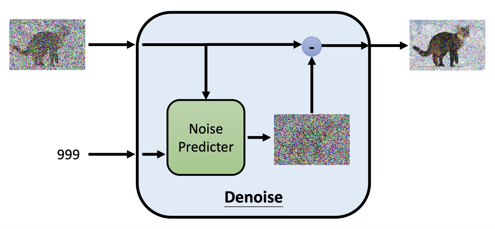

既然是模型，那么噪声预测器也要进行训练。训练时每个输入数据都要有一个匹配的基准事实(ground truth)，在这里就是真正的噪声。

    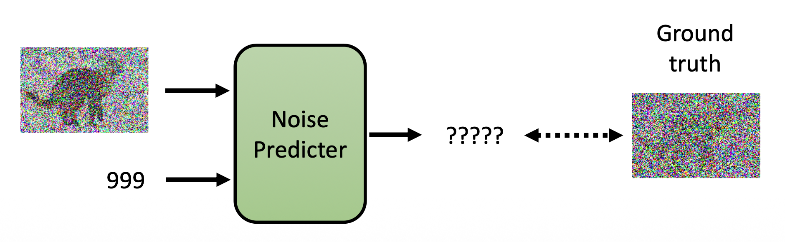

我们需要自己动手构造训练数据，而这个过程叫做**扩散过程**(diffusion process)。具体来说就是在一张清晰的图像上不断加上随机采样得来的噪声，每一步加上的噪声都要标上步骤数。注意这里的步骤数是递增的，因此该过程又叫做**前向过程**(forward process)。

    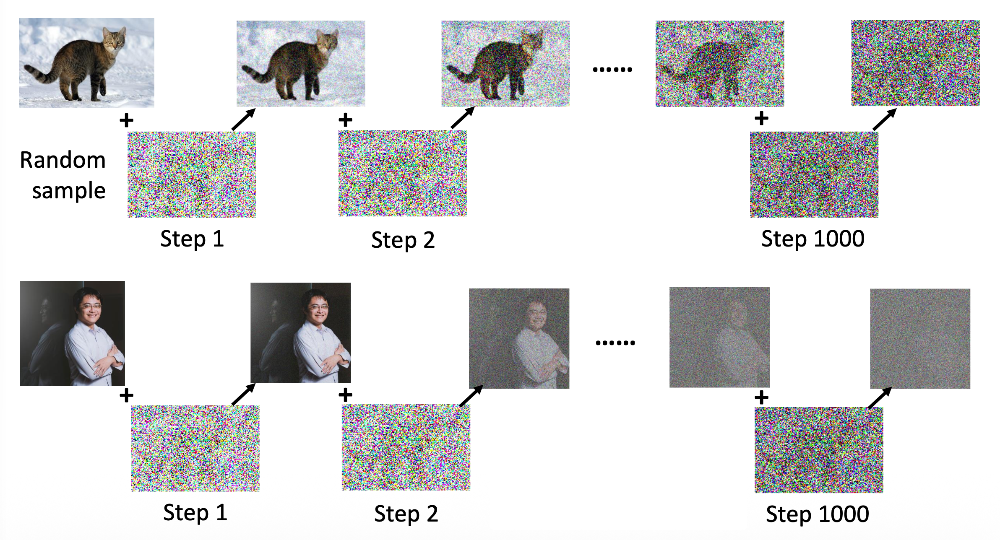

对于噪声预测器而言，在扩散过程中，加上噪声的图像和当前步骤数是输入，而对应的噪声就是基准事实。

    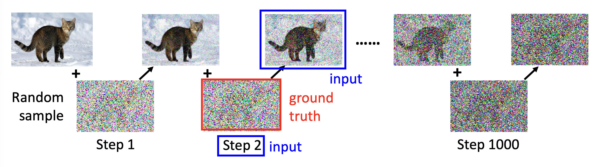

---
扩散模型的一大应用是文生图(text-to-image)。其中一个知名的训练数据集就是 [LAION](https://laion.ai/blog/laion-5b/)，里面包含 5.85B 左右的训练数据（图像）。在文生图模型中，去噪模型还要考虑输入文本，以产生符合文本描述的图像。另外训练时也要考虑输入文本。

    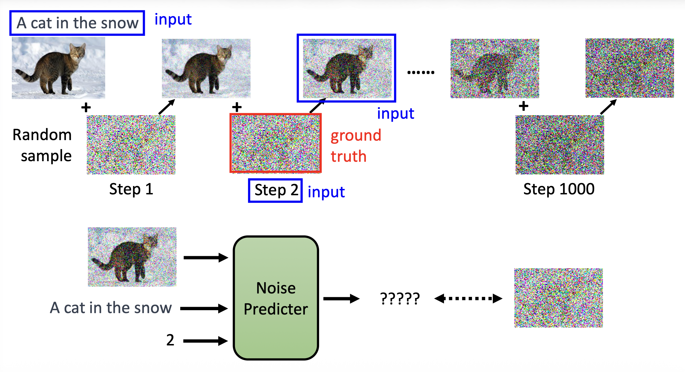

#### Stable Diffusion

扩散模型中的一种有名的实现是**稳定扩散**(stable diffusion)。其他知名的图像生成模型的原理也和它类似，所以接下来就来认识一下它的工作原理。下面是它的框架图，可以看到它包含了三个部件：

    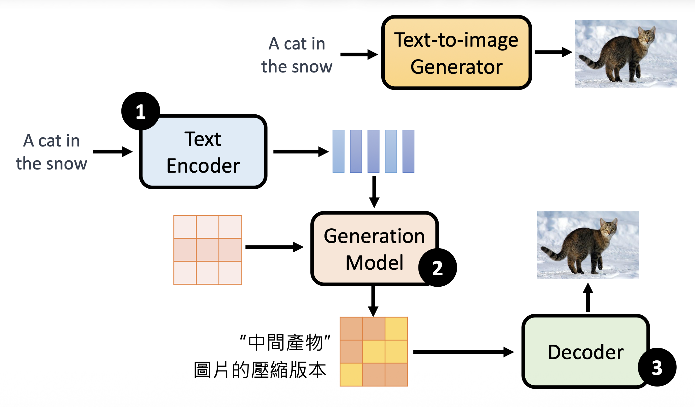

1. 文本编码器：将文本编码为向量
2. 生成模型：将包含文本信息的向量和噪音图像作为输入，输出图像的压缩版本（一种中间产物，不一定能够为人类直接理解）
3. 解码器：将图像的压缩版本还原为图像

???+ example "应用"

    === "例1：Stable Diffusion"

        

            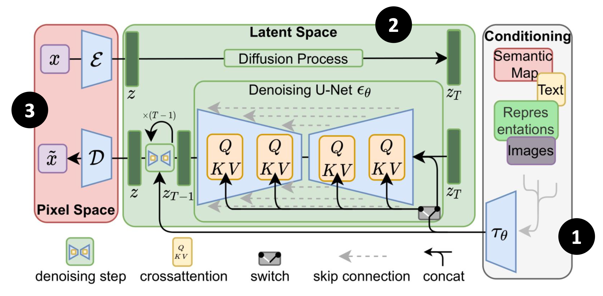
        

        - 编码器实际上不止接收文本输入，还有其他各种形式的数据

        >[论文链接](https://arxiv.org/abs/2112.10752)

    === "例2：DALL-E 系列"

        

            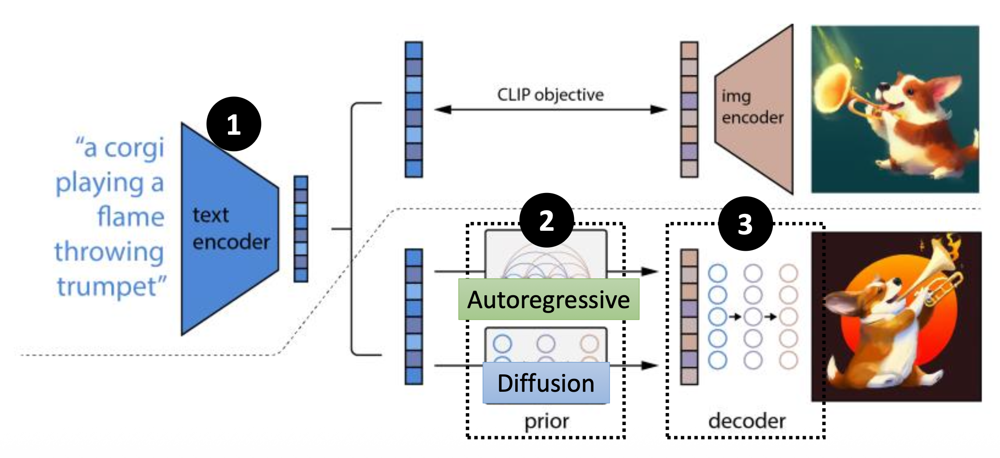
        

        - 生成模型除了扩散模型外，也可以用自编码器。尽管自编码器生成慢，但我们只需要它生成压缩版本，因此耗时不多，可以使用

        >论文链接：[链接1](https://arxiv.org/abs/2204.06125)、[链接2](https://arxiv.org/abs/2102.12092)

    === "例3：Imagen"

        

            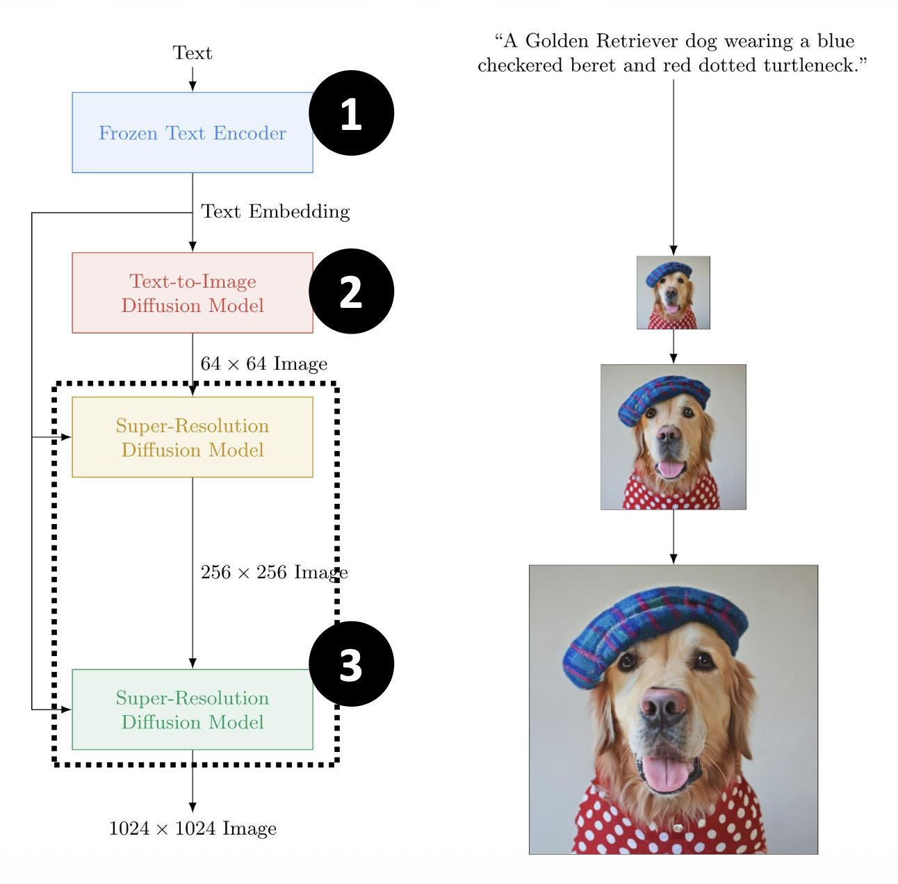
        

        - 它的“中间产物”是分辨率较小的图像，随后在解码器的帮助下不断增大分辨率

        >链接：[官网](https://imagen.research.google/)、[论文](https://arxiv.org/abs/2205.11487)

接下来详细介绍各部件的具体实现：

- 文本编码器
    - 可以用机器学习课程中介绍过的 [BERT](../ml/7.md#bert) 等语言模型来实现
    - 一般来说，编码器的参数量越大，生成图像的质量越高（图表中越靠右下角表现越好；[图表来源](https://arxiv.org/abs/2205.11487)）

        

            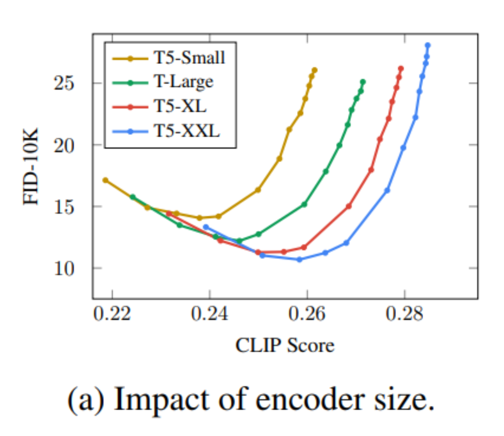
        

        - 纵轴是[弗雷歇起始距离（**FID**）](../ml/6.md#evaluation-of-generation)，值越小表明生成结果和基准事实越接近
            - FID-10K 中的 10K 指的是训练数据量
        - 横轴是[对比语言-图像预训练(contrastive language-image pre-training, **CLIP**)](https://arxiv.org/abs/2103.00020)
            - 用到 4 亿对图像-文本数据
            - 将文本和图像分别丢给文本编码器和图像编码器，两者输出的向量越接近，CLIP 分数就越大

            

                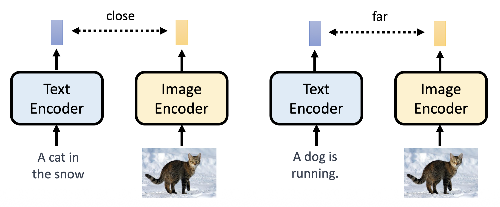
            

- 解码器
    - 训练时无需标注数据
    - 它能接受的中间产物
        - 分辨率较小的图

            

                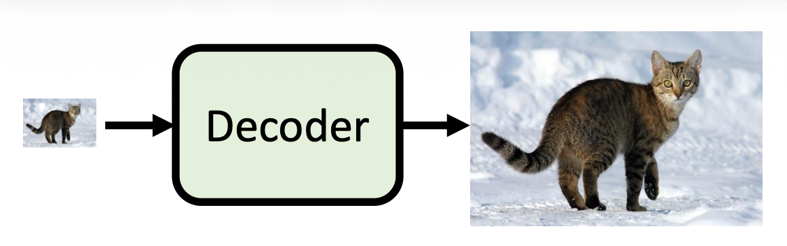
            

        - 潜表示(latent representation)

            

                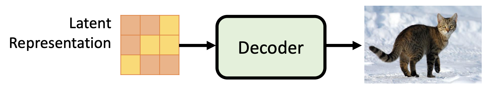
            

            - 为了让解码器理解潜表示，我们可以将解码器放在自编码器架构下进行训练

                

                    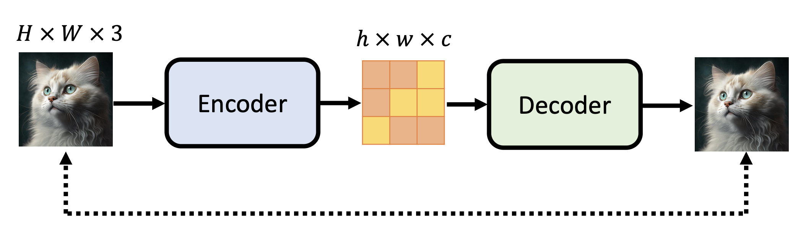
                

- 生成模型
    - 不同于前面介绍的一般的扩散模型，在扩散阶段开始前，需要先将图像和文本丢给一个编码器，然后向编码后的结果不断添加噪音

        

            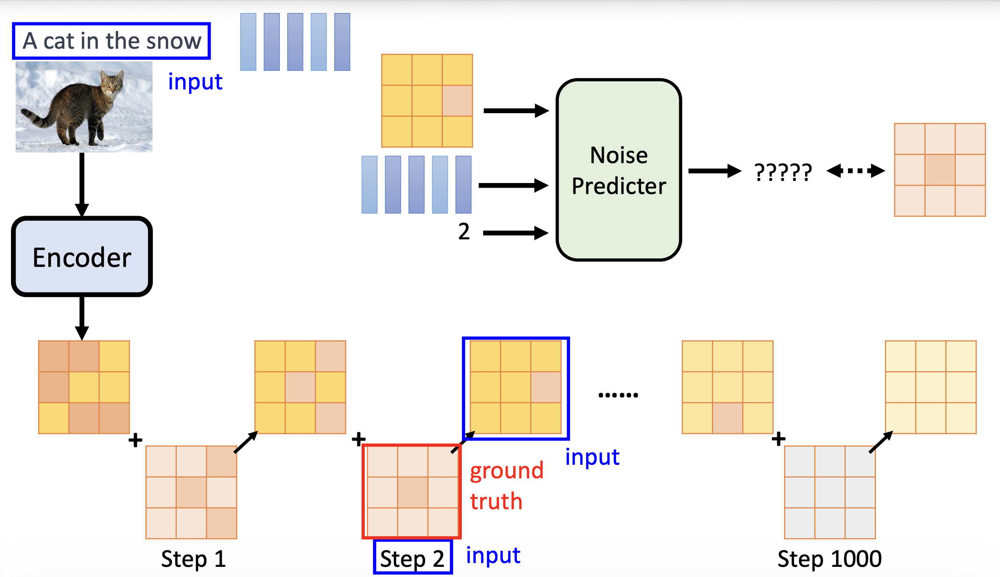
        

        

            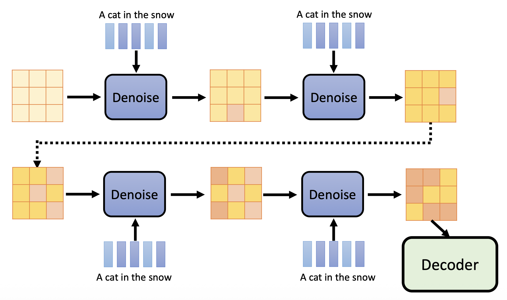
        

#### Denoising Diffusion Probabilistic Model

本节着重介绍隐藏在扩散模型背后的数学原理。以下是扩散模型的算法（训练 + 生成（采样））：

    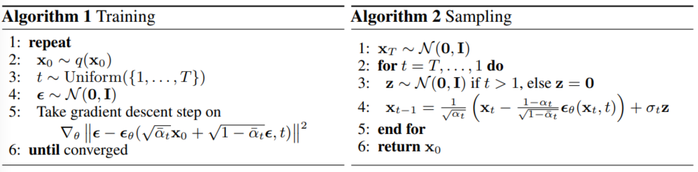

这些算法看似短短几行，实则暗藏玄机。下面就来仔细剖析其中的思想：

- 训练
    - $x_0$ 为清晰图像，$\varepsilon$ 为噪音
    - 第2行：从某个分布中采样一张清晰图像
    - 第4行：从正态分布中随机采样一个噪音
    - 第5行：
        - $\sqrt{\bar{\alpha}_t} x_0 + (1 - \sqrt{\bar{\alpha}_t}) \varepsilon$ 表示加了噪音后的图像
        - $\varepsilon_\theta(\sqrt{\bar{\alpha}_t} x_0 + (1 - \sqrt{\bar{\alpha}_t}) \varepsilon, t)$ 表示噪音预测器的输出结果
        - $\bar{\alpha}_1, \bar{\alpha}_2, \dots, \bar{\alpha}_T$ 的值逐渐递减
    - 算法还是太抽象了，下面用图示的方式展现算法：

        

            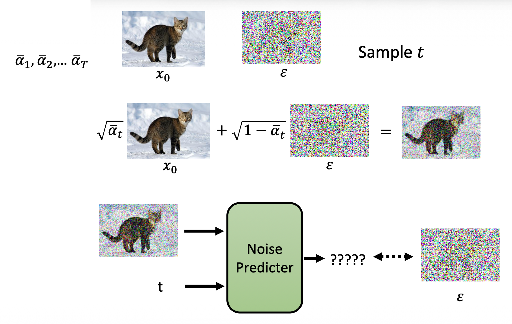
        

    - 前面我们说扩散过程是一个不断向清晰图像添加噪音的过程，但实际上这个算法告诉我们只需要加一次噪音就够了

        

            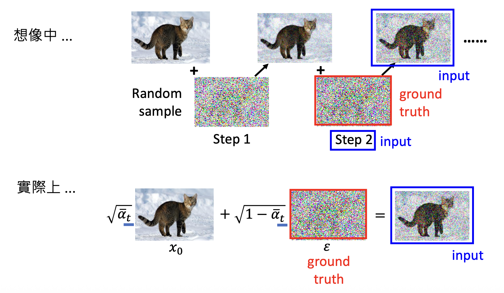
        

- 采样
    - $x_T$ 也是随机采样出来的噪音
    - $z$ 是另外采样出来的噪音
    - 算法的形象化表示如下：

        

            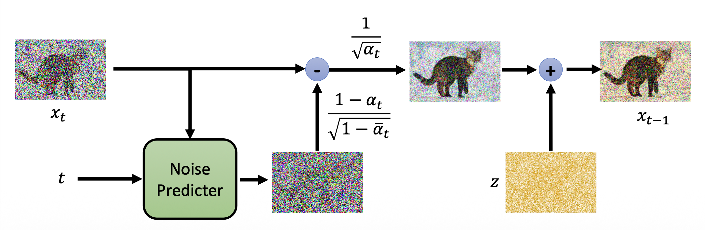
        

以上只是对算法的简单注释。在深入理解算法的正确性与合理性之前，我们先要清楚图像生成模型的共同目标是什么——不管图像生成模型采取何种技术，本质上它们做的事还是输入一个分布 $z$，输出一个关于生成图像的分布 $x$；优化目标就是让 $x$ 和真实图像的分布越接近越好。

    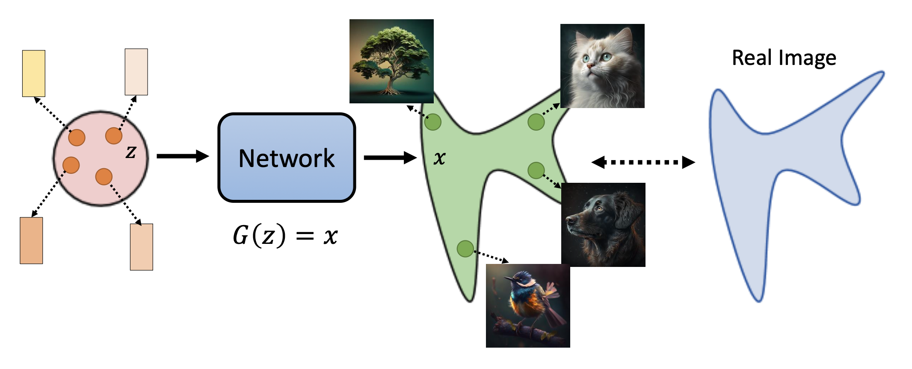

那么该如何衡量两个分布的接近程度呢？一种常用的方法是**最大可能性估计**(maximum likelihood estimation)，它的思路是：从真实数据分布 $P_{data}(x)$ 中采样出所有数据 $\{x^1, x^2, \dots, x^m\}$，计算这些数据在模型输出分布中出现的概率（即 $P_\theta (x^i)$）。模型的优化目标就转化为找参数 $\theta^* = \arg \max\limits_\theta \prod\limits_{i=1}^m P_\theta(x^i)$（即最大化可能性）。接下来对这个式子进一步转换：

$$
\begin{align*}
\theta^* & = \arg \max\limits_\theta \prod\limits_{i=1}^m P_\theta(x^i) \\
& \Rightarrow \arg \max\limits_\theta \log \prod\limits_{i=1}^m P_\theta(x^i) \\
& = \arg \max\limits_\theta \sum\limits_{i=1}^m \log P_\theta(x^i) \\
& \approx \arg \max\limits_\theta \mathbb{E}_{x \sim P_{data}} [\log P_\theta(x)] \\
& = \arg \max\limits_\theta \int\limits_x P_{data}(x) \log P_\theta(x) - \underbrace{\int\limits_x P_{data}(x) \log P_{data}(x)}_{\textcolor{cornflowerblue}{\text{not related to } \theta}} \\
& = \arg \max\limits_\theta \int\limits_x P_{data}(x) \log \dfrac{P_\theta(x)}{P_{data}(x)}dx = \underbrace{\arg \min\limits_\theta KL(P_{data} \| P_\theta)}_{\textcolor{cornflowerblue}{\text{difference between } P_{data} \text{ and } P_\theta}}
\end{align*}
$$

所以最大化可能性 -> 最小化 **KL 散度**(KL divergence)。

---
对于 VAE 模型而言，模型生成的分布为 $P_\theta(x) = \int\limits_z P(z) P_\theta(x|z) dz$（$z$ 是输入，$x$ 是输出）。如果 $P_\theta(x|z) = \begin{cases}1 & G(z) = x \\ 0 & G(z) \ne x\end{cases}$，那么可能性就几乎为0，显然不适合用于计算。因此我们会放宽 $P_\theta(x|z)$ 的限制——令 $P_\theta(x|z) \propto \exp(-\|G(z) - x\|_2)$，即一个以 $G(z)$ 为均值的正态分布的期望。

另外，VAE 模型还要计算 $\log P(x)$ 的下界，计算过程如下：

$$
\begin{align*}
\log P_\theta(x) & = \int\limits_z q(z|x) \log P(x) dz \quad \textcolor{green}{q(z|x) \text{ can be any distribution}}\\
& = \int\limits_z q(z|x) \log \left(\dfrac{P((z, x))}{P(z|x)}\right) dz = \int\limits_z q(z|x) \log \left(\dfrac{P((z, x))}{\textcolor{cornflowerblue}{q(z|x)}} \cdot \dfrac{\textcolor{cornflowerblue}{q(z|x)}}{P(z|x)}\right) dz \\
& = \int\limits_z q(z|x) \log \left(\dfrac{P((z, x))}{q(z|x)}\right) dz + \underbrace{\int\limits_z q(z|x) \log \left(\dfrac{q((z|x))}{P(z|x)}\right) dz}_{\textcolor{red}{KL(q(z|x)\|P(z|x)) \ge 0}} \\
& \ge \int\limits_z q(z|x) \log \left(\dfrac{P((z, x))}{q(z|x)}\right) dz = \mathbb{E}_{\underbrace{q(z|x)}_{\textcolor{red}{\text{encoder}}}} \left[\log\left(\dfrac{P(x, z)}{q(z|x)})\right)\right] \quad \textcolor{cornflowerblue}{\text{lower bound}}
\end{align*}
$$

---
我们将 VAE 的思路沿用到 DDPM：

- $P_\theta(x)$
    - 仍然将扩散模型的去噪过程看成多个步骤（从噪音 $x_T$ 开始，一直到清晰图像 $x_0$）
    - 对于中间图像 $x_t$，去噪后的结果是一个正态分布，即 $P(x_{t-1}|x_t) \propto \exp(-\|G(x_t) - x_{t-1}\|_2)$
    - 所以 $P_\theta (x_0) = \int\limits_{x_1 : x_T} P(x_T) P_\theta(x_{T-1}|x_T) \dots P_\theta(x_{t-1}|x_t) \dots P_\theta(x_0 | x_1) d x_1:x_T$
    - 注意 $P$ 和 $P_\theta$ 是独立的分布，而后者是模型生成出来的，而下标 $\theta$ 表示的就是模型的参数

- $\log P(x)$ 的下界
    - 对比 VAE 和 DDPM，发现两者的计算大差不差，只是 VAE 的分布来自编码器，而 DDPM 的分布来自扩散过程

        

            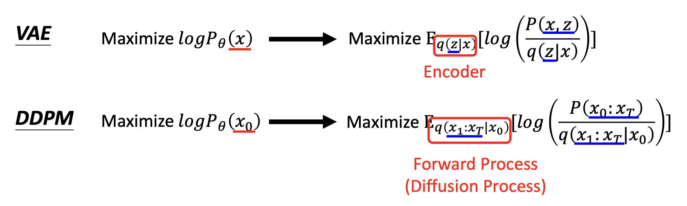
        

    - 其中 $q(x_1:x_T|x_0) = q(x_1|x_0)q(x_2|x_1) \dots q(x_T|x_{T-1})$
        - $q(x_t|x_{t-1})$

            

                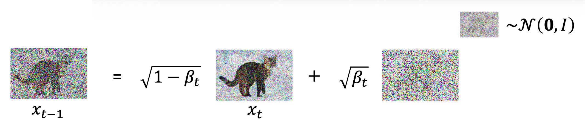
            

        - $q(x_t|x_0)$

            

                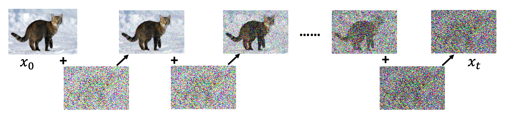
            

            - 先考虑 $q(x_1|x_0)$ 和 $q(x_2|x_1)$ 的计算

                

                    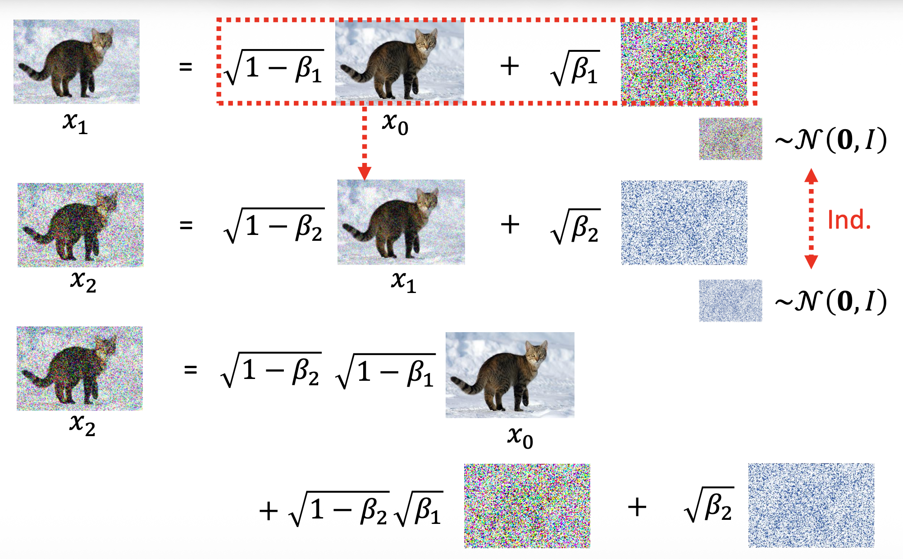
                

                可以将两个（独立的）噪音合并起来，简化计算 $q(x_2|x_0)$。

                

                    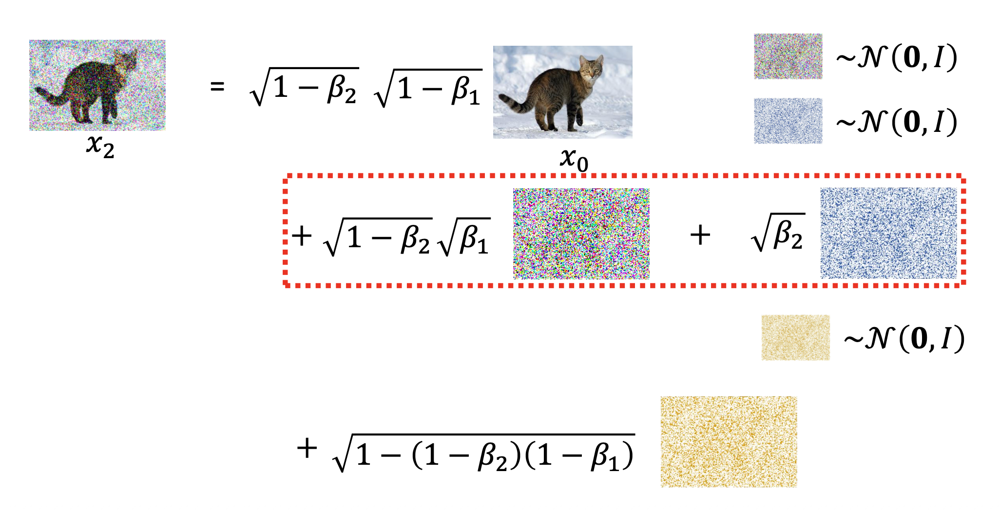
                

            - 通过这样的合并，在计算 $q(x_t|x_0)$ 时只需考虑一个噪声即可：

                

                    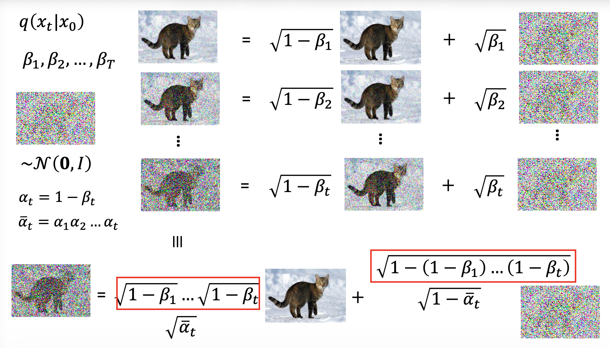
                

    - 接下来就可以转换那个要最大化的式子 $\mathbb{E}_{q(x_1:x_T|x_0)}[\log \left(\dfrac{P(x_0:x_T)}{q(x_1:x_T|x_0)}\right)]$。由于中间计算过程过于复杂，这里就不展示了，直接给出最终转换结果：

        $$
        \mathbb{E}_{q(x_1|x_0)} [\log P(x_0|x_1)] - KL(q(x_T|x_0)\|P(x_T)) - \sum\limits_{t=2}^T \mathbb{E}_{q(x_t|x_0)} [KL(q(x_{t-1}|x_t, x_0)\|P(x_{t-1}|x_t))]
        $$

        由于前两项的处理和最后一项是类似的，因此下面只考虑最后一项是如何计算的。

        - 计算 $q(x_{t-1}|x_t, x_0)$
            - 先算出 $q(x_t|x_0), q(x_{t-1}|x_0), q(x_t|x_{t-1})$ 的值

                

                    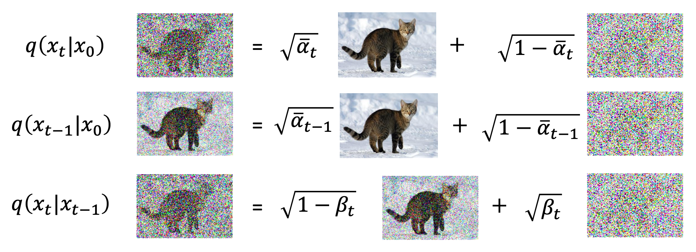
                

            - $q(x_{t-1}|x_t, x_0)$ 的含义是：已知 $x_0$ 和 $x_t$，但不知道中间过程，求 $x_{t-1}$ 的分布

                

                    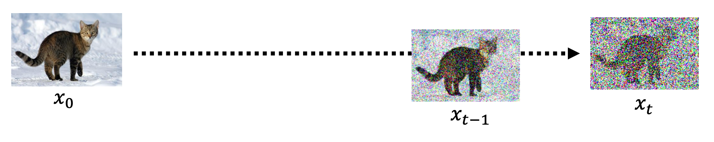
                

            - 计算：

                $$
                \begin{align*}
                q(x_{t-1}|x_t, x_0) & = \dfrac{q(x_{t-1}, x_t, x_0)}{q(x_t, x_0)} \\
                & = \dfrac{q(x_t|x_{t-1})q(x_{t-1}|x_0)q(x_0)}{q(x_t|x_0)q(x_0)} \\
                & = \dfrac{q(x_t|x_{t-1})q(x_{t-1}|x_0)}{q(x_t|x_0)}
                \end{align*}
                $$

                最后一行的三项都是已知的，所以 $q(x_{t-1}|x_t, x_0)$ 能够确定下来。

            - 要知道具体的值，还得继续往下算，由于太麻烦了，所以就只展示最终结果，不做额外解释：

                

                    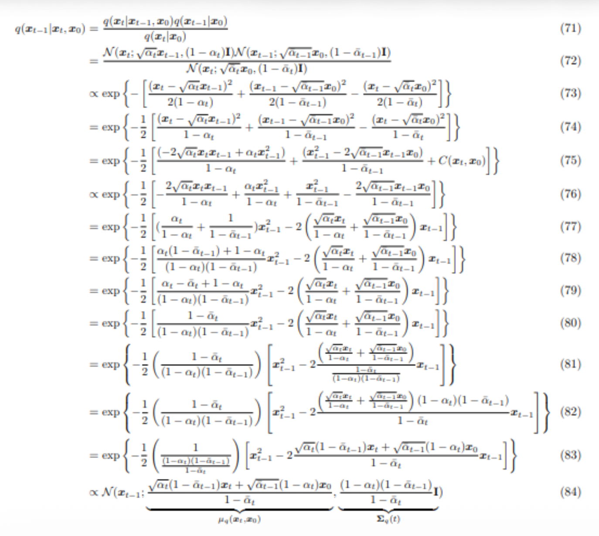
                

            - 我们知道，这一项是一个正态分布，所以根据前面的计算结果，可得
                - 均值：$\dfrac{\sqrt{\bar{\alpha}_{t-1}} \beta_t x_0 + \sqrt{\bar{\alpha}_t} (1 - \bar{\alpha}_{t-1}) x_t}{1 - \bar{\alpha}_t}$
                - 方差：$\dfrac{1 - \bar{\alpha}_{t-1}}{1 - \bar{\alpha}_t} \beta_t I$

        - 考虑整个 KL 散度
            - 第一个分布的均值和方差是固定的（就是前面算出来的那两个），第二个分布的方差是固定的，但均值是可调的(tunable)
            - 所以要想最小化 KL 散度，我们能做的就是让第二个分布的均值尽可能接近第一个分布，而第二个分布正是图像 $x_t$ 经过去噪后的分布

                

                    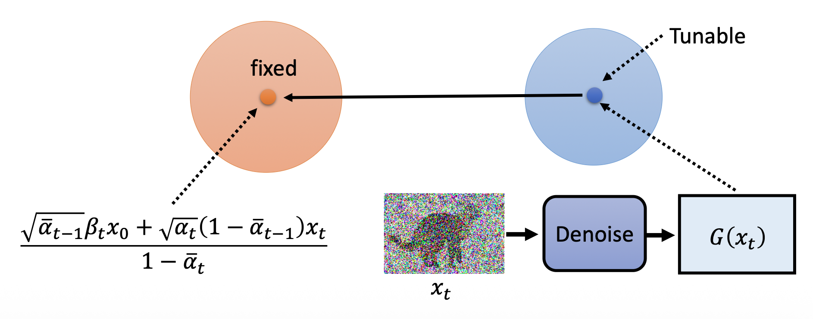
                

                

                    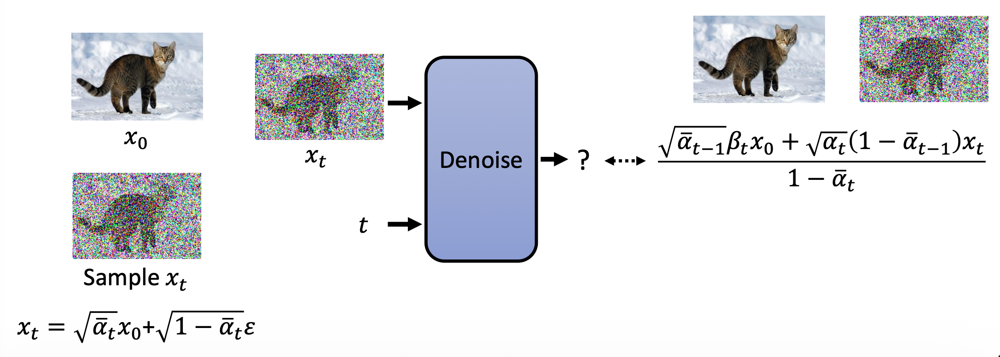
                

                注意，$x_t = \sqrt{\bar{\alpha}_t} x_0 + \sqrt{1 - \bar{\alpha}_t} \varepsilon \Rightarrow \dfrac{x_t - \sqrt{1 - \bar{\alpha}_t} \varepsilon}{\sqrt{\bar{\alpha}_t}} = x_0$

            - 处理第一个分布的均值：

                $$
                \begin{align*}
                & \dfrac{\sqrt{\bar{\alpha}_{t-1}} \beta_t \textcolor{red}{x_0} + \sqrt{\bar{\alpha}_t} (1 - \bar{\alpha}_{t-1}) x_t}{1 - \bar{\alpha}_t} \\
                = & \dfrac{\sqrt{\bar{\alpha}_{t-1}} \beta_t \textcolor{red}{\dfrac{x_t - \sqrt{1 - \bar{\alpha}_t} \varepsilon}{\sqrt{\bar{\alpha}_t}}} + \sqrt{\bar{\alpha}_t} (1 - \bar{\alpha}_{t-1}) x_t}{1 - \bar{\alpha}_t} \\
                = & \dfrac{1}{\sqrt{\bar{\alpha}_t}} \left(x_t - \dfrac{1 - \alpha_t}{\sqrt{1 - \bar{\alpha}_t}} \varepsilon\right)
                \end{align*}
                $$

                不难发现，这个式子正是采样算法第4行等式的前半部分。而式子中 $x_t, \alpha_t$ 都是固定值，实际需要模型预测的部分就是 $\varepsilon$ 了。

    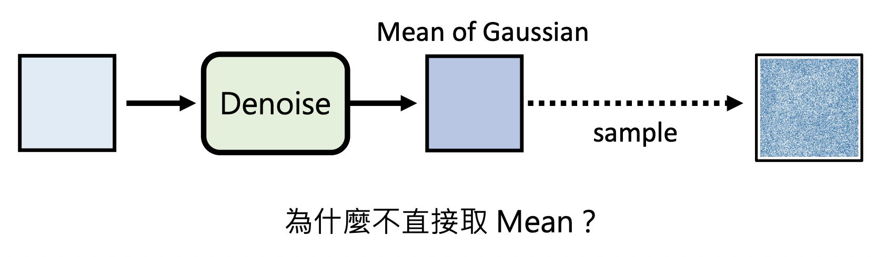

 

为什么采样算法第4行等式还有一项 $\sigma_t z$（一个正态分布）呢，而不是直接取前面计算出来的值（即正态分布的均值）呢？李宏毅老师给出了以下猜想：如果不引入额外的采样，模型生成的结果可能缺乏创新性，容易出现重复的内容。

???+ example "例子"

    === "例1：文本生成"

        

            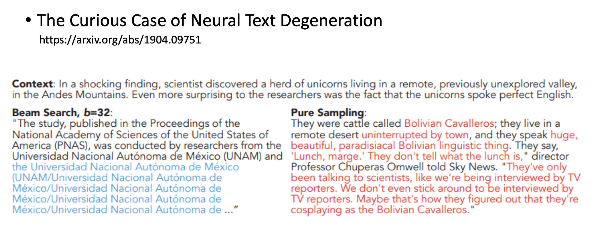
        
 

        

            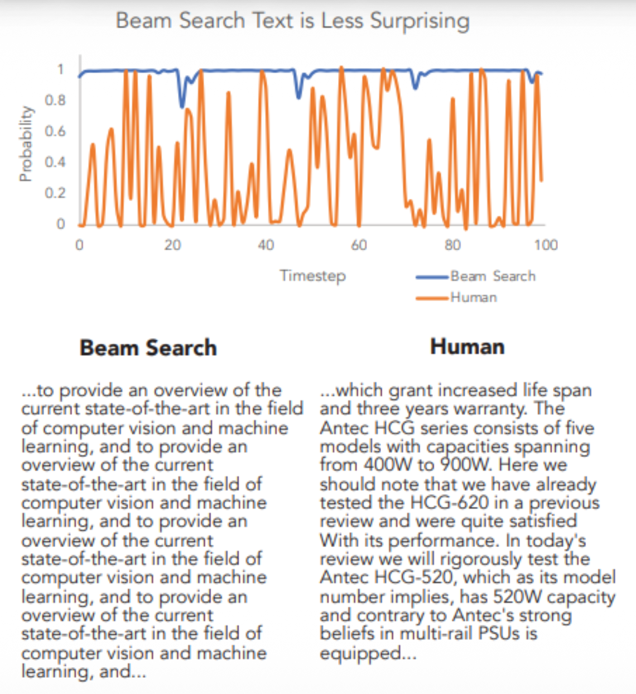
        
 

    === "例2：语音合成"

        

            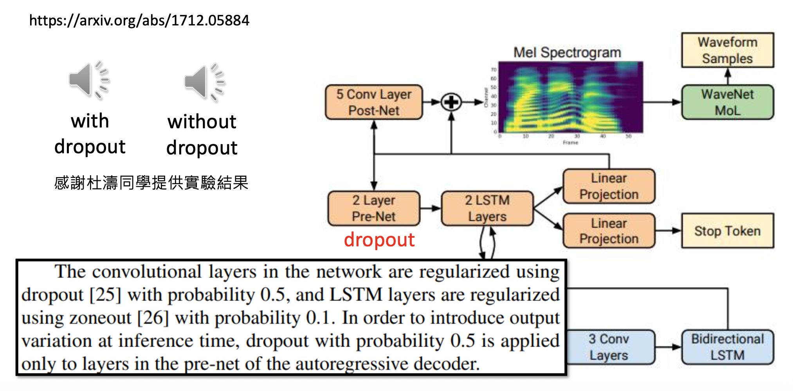
        
 

    === "例3：图像生成"

        如果 $\sigma_t = 0$，那么就无法正常生成图像了。

        

            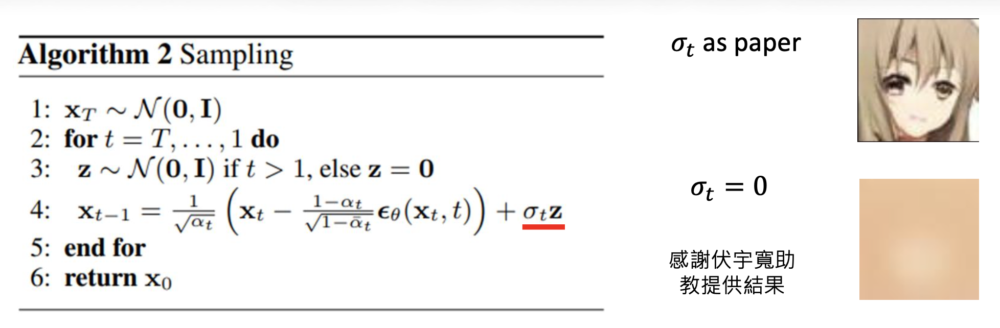
        
 

#### Applications

=== "语音"

    

        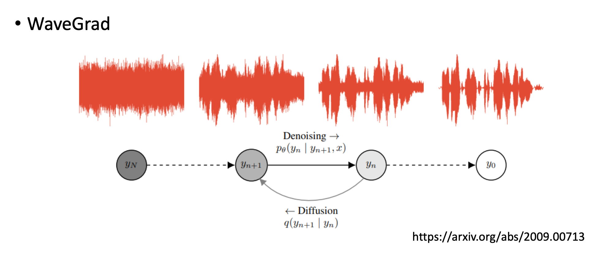
    
 

=== "文本"

    直接在文本上加噪音是很困难的。
    
    一种解决方案是在潜空间(latent space)上加噪音。下面列出一些相关研究：

    - Diffusion-LM

        

            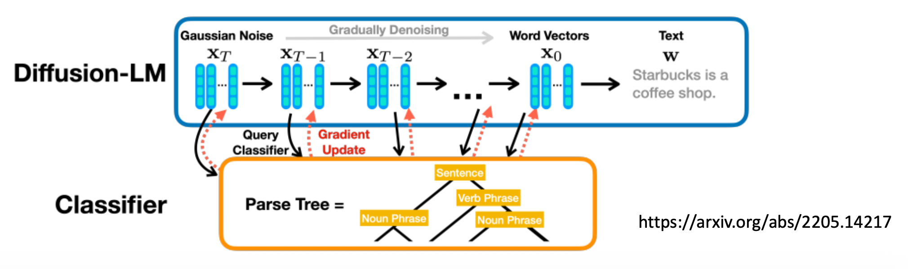
        
 

    - DiffuSeq

        

            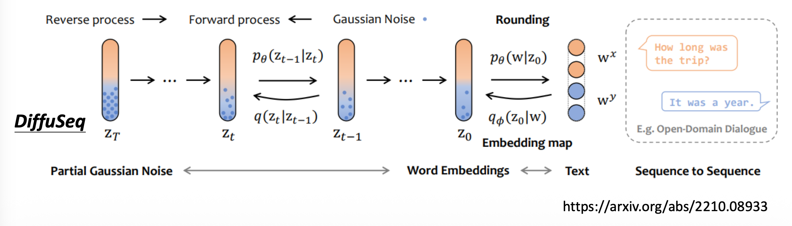
        
 

    另一种方法是不要加从正态分布上采样得到的噪音，改变噪音来源：

    

        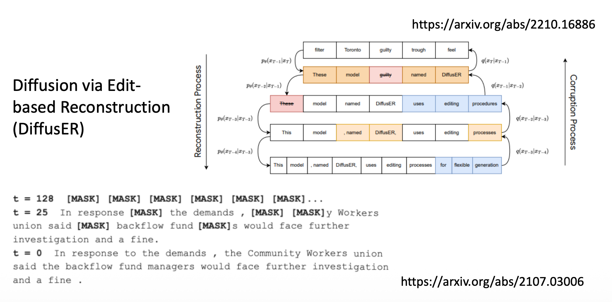
    

=== "图像"

    有一种叫做**掩码预测**(mask-predict)的方法，最开始用于[文本模型](https://aclanthology.org/D19-1633/)，简答来说就是做填空题：

    

        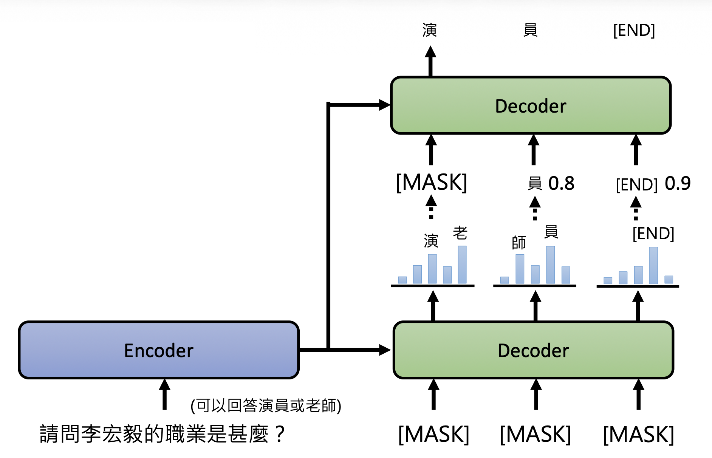
    

    这种技术还能用在图像生成上：

    

        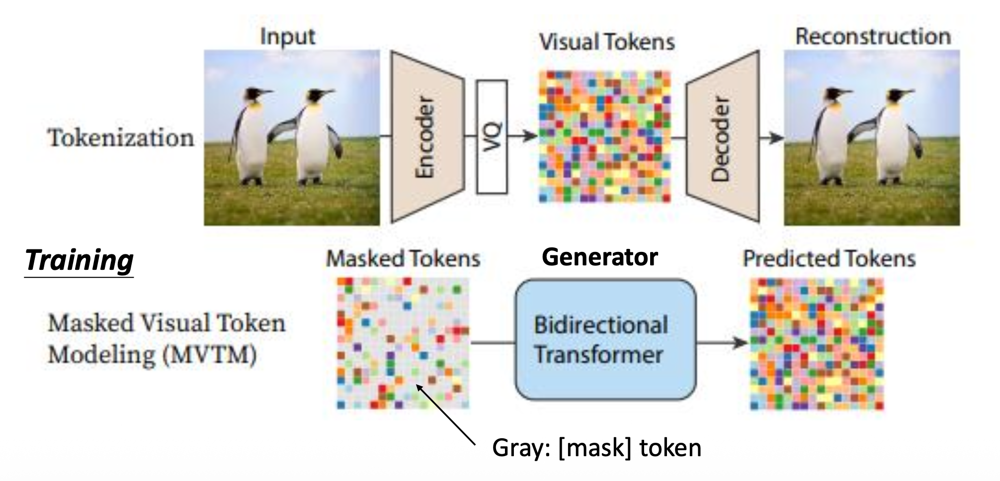
    

    

        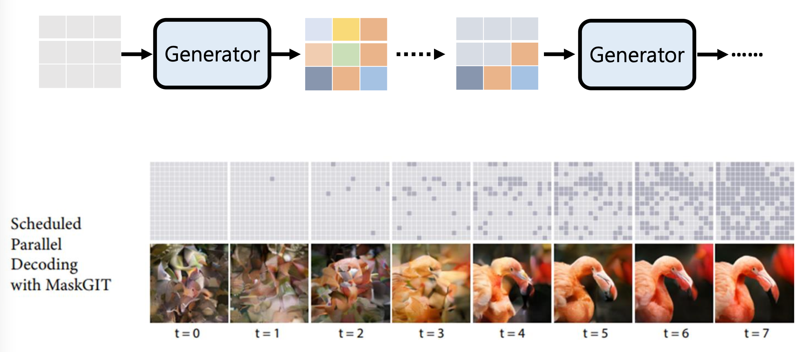
    

    

        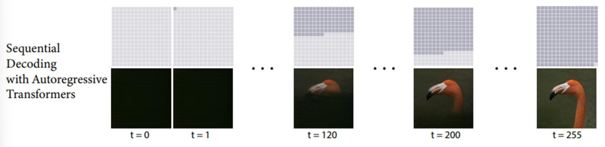
    

### GAN

这里不会展开介绍 GAN 的原理，感兴趣的读者可阅读笔者之前写过的 [GAN 笔记](../ml/6.md)。

实际上，GAN 可以是一个外挂，和前面几种方法结合起来使用，进一步提高图像/视频生成的质量。

    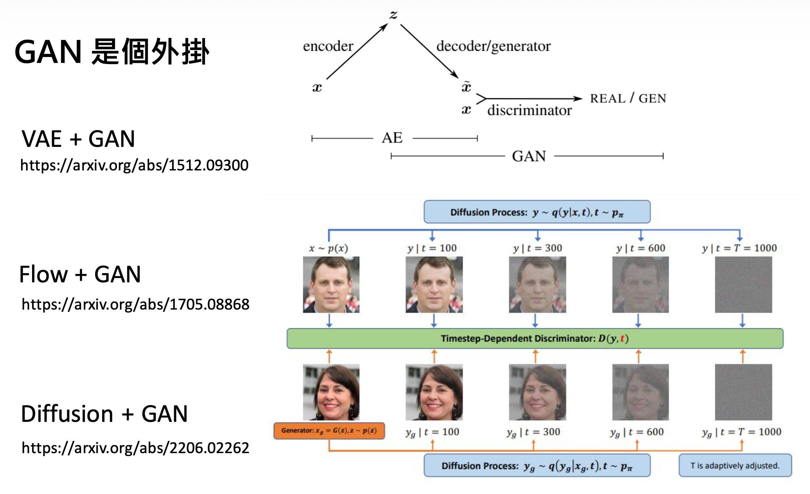

### Others

有一种更加强大的模型，可以让我们和它生成的视频进行互动，比如直接操控视频中人物的动作。这个模型就是 [**Genie**](https://arxiv.org/abs/2402.15391)（全程生成式可交互环境(generative interactive environments)）。该模型将一张图像（帧）和用户输入的动作作为输入，输出下一帧。

    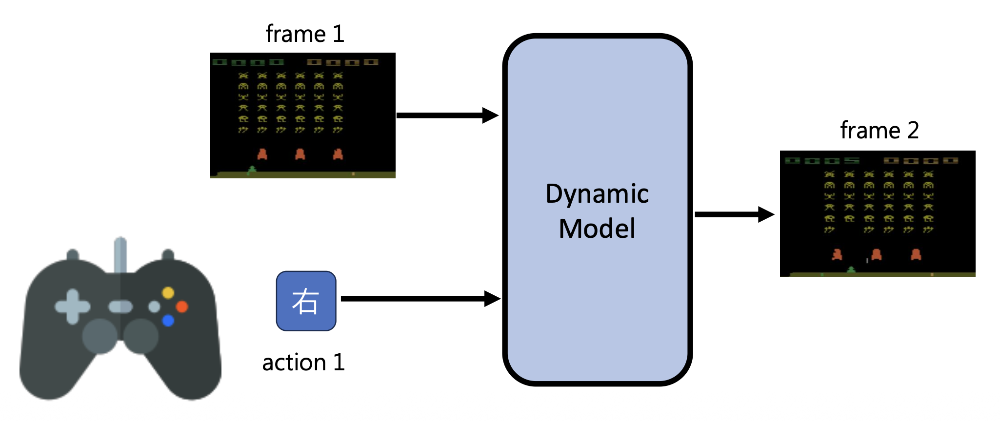

训练时，我们可以收集大量的视频数据，但是很难收集到用户输入的动作。所以可以采用类似自编码器架构的方法，另外准备一个从当前帧和下一帧的画面中提取动作的模型，它会输出行动的编号（叫做**潜在动作**(latent action)）。然后将潜在行动和当前帧画面丢给图像生成的模型，让它输出下一帧画面。

    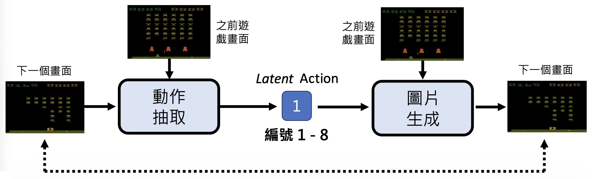

??? info "延伸阅读"

    - [An Introduction to Vision-Language Modeling](https://arxiv.org/abs/2405.17247)
    - [Video Diffusion Models: A Survey](https://arxiv.org/abs/2405.03150)