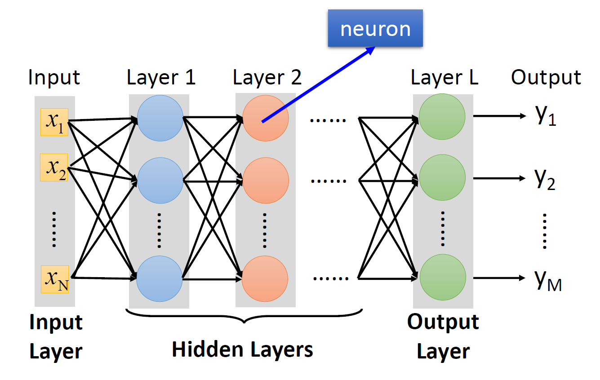

# Lec 1: Intro to Machine Learning

## Machine Learning

我们可以将机器学习简单理解为**寻找一个函数**，典型的函数类型有：

- **回归**(regression)：输出一个标量的函数

    

        
    

- **分类**(classification)：给定一组选项（类(classes)），能够输出正确选项的函数

    

        
    

    

        
    

- 其他各种函数：

    

        
    

实际上，回归和分类只是机器学习的一小部分，它们的共同特点是输出量比较简单。对于更复杂，具有结构特征的输出，比如图像、文档等，我们把这种情况称为**结构化学习**(structured learning)。

## Training

下面介绍机器学习的核心——寻找函数的步骤。实际上，实现这些步骤就是一个**训练**(training)的过程。

    

- **构造带有未知参数的函数**
    - 基于领域知识来构造函数，或者叫做**模型**(model)
    - 以一个简单的模型为例：$y = b + wx_1$，其中已知数据 $x_1$ 称为**特征点**(feature)，未知参数 $w, b$ 分别称为**权重**(weight)和**偏移**(bias)

- **从训练数据中定义损失**
    - **损失**(loss)：一个关于未知参数的函数，定义为 $L(w, b)$，用于衡量一组值的好坏
    - 先假定一组 $w, b$ 的值，代入已知数据 $x_1$，计算出预测值 $y$；并且记真实值为 $\hat{y}$（称为**标签**(label)），那么对应的误差为 $e_1 = |y - \hat{y}|$（绝对误差）
        - 也可以用平方差计算，即 $e = (y - \hat{y})^2$
    - 假如有 $n$ 个数据，那么可以获得 $n$ 个误差，可以取它们的均值作为损失，即 $L = \dfrac{1}{N} \sum\limits_N e_n$（MAE）
        - 如果求的是平方误差，那么得到的 $L$ 是 MSE
        - 也可以用其他方法计算损失
        - 如果 $y, \hat{y}$ 是按概率分布的，那么可以用[交叉熵](https://en.wikipedia.org/wiki/Cross-entropy)(cross-entropy)计算

    - 对于不同的 $b, w$，我们可以得到不同的 $L$ 值，因此我们可以根据计算得到的数据作出一张**误差曲面**(error surface)：

        

            
        

        用颜色表示 $L$ 值，越红表示 $L$ 越大，越紫表示 $L$ 越小

- **优化**(optimization)
    - 我们的目标是找到一组 $w^*, b^*$，使得 $L$ 最小，即 $w^*, b^* = arg \min\limits_{w, b} L$
    - 常用方法是**梯度下降法**(gradient descent)
        - 如果只考虑权重$w$和损失$L$（二维）：
            - 先（随机）挑选初始值 $w_0$
            - 计算 $\dfrac{\partial L}{\partial w} \Big|_{w = w^0}$（即 $w^0$ 对应点的斜率）
            - 若计算结果为负（下降），则增大 $w$（向右走），否则的话（上升）减小 $w$（向左走）
            - 规定移动步幅为 $\eta \dfrac{\partial L}{\partial w} \Big|_{w = w^0}$（如下图橙色箭头所示）。其中 $\eta$ 为**学习速率**(learning rate)，它是一个**超参数**(hyperparameter)，即事先人为给定的参数。那么下一个权重为 $w^1 \leftarrow w^0 - \eta \dfrac{\partial L}{\partial w} \Big|_{w = w^0}$
            - 重复除第一步外的所有步骤（迭代），直到
                - 找到最小值，可能是**全局最小值**(global minima)，也可能是**局部最小值**(local minima)。前者是我们预期的结果，而后者并不是我们想要的，但是梯度下降法误以为这就是最小值（受算法设计和数据特征的影响）
                    - 实际上，局部最小值并不一定是问题所在（？）
                - 超出规定的迭代次数

            

                
            

        - 再算上偏移$b$的话（三维）：
            - （随机）挑选初始值 $w^0, b^0$
            - 计算 $\dfrac{\partial L}{\partial w} \Big|_{w = w^0, b = b^0}$ 和 $\dfrac{\partial L}{\partial b} \Big|_{w = w^0, b = b^0}$（不用手算，大部分的深度学习框架都可以用一行语句算出来的）
            - 迭代更新 $w, b$：$w^1 \leftarrow w^0 - \eta \dfrac{\partial L}{\partial w} \Big|_{w = w^0, b = b^0}, b^1 \leftarrow b^0 - \eta \dfrac{\partial L}{\partial b} \Big|_{w = w^0, b = b^0}$

            

                
            

## Activation Functions

除了 $y = b + wx_1$ 这一模型外，我们还可以构造更为复杂的模型，以减小损失，比如 $y = b + \sum\limits_{j=1}^7 w_j x_j, y = b + \sum\limits_{j=1}^{28} w_j x_j$ 等等。实验表明，当累加的项数越多时，损失往往会更小，也就是说训练效果会更好；但项数多到一定程度后，提升效果就不太明显了。本质上，上述的这些模型都可以归类为**线性模型**(linear models)，这是一类最简单的模型。

    

### Sigmoid

由于过于简单，线性模型存在很严重的局限性（称为**模型偏移**(model bias)），无法表征所有的情况。因此我们需要一些更灵活、更精密的模型——下面引入一种表示所有曲线的方法：对于上图中的红色折线，我们可以用**一个常量（在图上就是一条水平线）+ 一组 Z 字形折线之和**表示，如下图所示：

    

可以看到，第 1 条 Z 字形折线的腰部与红色折线的第 1 段平行，以此类推，我们用 3 条折线复原了这条红色曲线的 3 段折线部分。随后我们可以通过上下平移这些 Z 字形折线，或者通过增加一个常量（水平线，图上为第 0 条线）来修正，最终可以完美复原这条红色折线。

不难想到，这种方法适用于所有的直直的折线。实际上，对于任意的曲线，该方法也照样使用：只要在曲线上选取足够多的点，用线段连接相邻点，这样就可以用折线来近似表示原曲线，然后每个折线段可以用一个 Z 字形折线拟合，最终可以做到用多条 Z 字形折线之和 + 常量来表示任意曲线（如下图所示）。

    

现在来看我们如何用一个函数来表示这条 Z 字形折线呢？实际上，这条折线来自于 **S 型函数**(sigmoid function)：$y = c \dfrac{1}{1 + e^{-(b + wx_1)}} = c\ sigmoid(b + wx_1)$，函数图像如下所示：

    

而 Z 字形折线是它的一种变体，称为**硬 S 型**(hard sigmoid)，可以通过选择合适的参数（$c, b, w$）得到。下面来看调整不同参数会得到什么样的效果：

    

所以，对于任意的曲线（函数），我们可以用一组 sigmoid 函数的线性组合来表示，即：

$$
y = b + \sum\limits_i c_i\ sigmoid(b_i + w_i x_1)
$$

上述式子仅针对最简单的线性模型。对于更一般的线性模型 $y = b + \sum\limits_{j=1} w_j x_j$，它的线性组合为：

$$
y = b + \sum\limits_i c_i\ sigmoid(b + \sum\limits_{j=1} w_j x_j)
$$

其中 $i, j$ 分别表示 sigmoid 函数和特征点的序号。下面我们用图形化的语言表示上述计算过程：

    

这里用 $r_i$ 表示第 $i$ 个 sigmoid 函数接受的参数（线性模型），于是得到了三个方程（蓝色方框内），不难想到可以用**矩阵**来表示这些方程：

$$
\begin{bmatrix}r_1 \\ r_2 \\ r_3\end{bmatrix} = \begin{bmatrix}b_1 \\ b_2 \\ b_3\end{bmatrix} + \begin{bmatrix}w_{11} & w_{12} & w_{13} \\ w_{21} & w_{22} & w_{23} \\ w_{31} & w_{32} & w_{33}\end{bmatrix} \begin{bmatrix}x_1 \\ x_2 \\ x_3\end{bmatrix}
$$

令 $a_i = sigmoid(r_i)$，继续计算，直到算出 $y$。完整的计算过程如下图所示：

    

事实上，计算 $y$ 的全过程都可以转化为矩阵的乘法和加法。对上式进一步化简，最终得到：

    

!!! info "注"

    上面的式子中出现了两个 $b$，但意义不同：

    - 灰色的$b$是一个常量
    - 绿色的$b$是每个 sigmoid 函数下线性模型的偏移量（矩阵）

### ReLU

除了 sigmoid 函数外，还有一类在机器学习中常见的，且与 sigmoid 十分相似的函数：**ReLU**（rectified linear unit，整流线性单元），它的函数图像如下所示：

    

可以看到，它的形状就是硬 sigmoid 函数去掉其中的顶边或底边；它也接收相同的参数，但是它的函数形式更为简单，就是一个 max 函数。

现在，我们用 ReLU 来表示任意的线性模型：

$$
y = b + \sum\limits_{2i} c_i\ max(b + \sum\limits_{j=1} w_j x_j)
$$

与 sigmoid 的等价形式相比，除了将 sigmoid 换成 max 外，另一处区别在于累加和的项数扩大了一倍，这是因为 2 个 ReLU 才能转化为 1 个 sigmoid，这一点是显而易见的。

在机器学习中，我们将 sigmoid 和 RELU 称为**激活函数**(activation functions)。

实践效果上看，ReLU 的效果更好，原因将在后面的章节中阐述。

## More General Framework

回到前面的机器学习三步框架：

- 上面算出的 $y$ 就是第一步中**带未知参数的函数**；除了 $x, y$ 外，其余部分都是未知参数。将这些未知参数放在一起，构成一个 $N \times 1$ 的矩阵，即一个 $N$ 维向量 $\bm{\theta} = \begin{bmatrix}\theta_1 \\ \theta_2 \\ \theta_3 \\ \vdots \end{bmatrix}$

    

        
    

- 现在这个模型的**损失**是一个关于参数 $\bm{\theta}$ 的函数，但具体计算误差和损失的过程其实没有太大的变化：$e = |y - \hat{y}|, L = \dfrac{1}{N} \sum\limits_n e_n$

- 在“**优化**”这步中，我们要求 $\bm{\theta^*} = arg\ \min\limits_{\bm{\theta}} L$，具体步骤还是类似的：
    - （随机）挑选初始值 $\bm{\theta^0}$
    - 计算梯度 $\bm{g} = \nabla L(\bm{\theta^0}) \begin{bmatrix}\dfrac{\partial L}{\partial \theta_1} \Big|_{\bm{\theta} = \bm{\theta^0}} \\ \dfrac{\partial L}{\partial \theta_2} \Big|_{\bm{\theta} = \bm{\theta^0}} \\ \vdots \end{bmatrix}$
    - 迭代更新 $\bm{\theta}$：$\bm{\theta_1} \leftarrow \bm{\theta^0} - \eta \bm{g}$，$\dots$
    - 但实践过程中，我们不会一下子处理这么多的参数，而是将这些参数**分批**(batch)处理，因此上面的优化过程可以改写为：

        

            
        

        如果所有的参数都按批用于更新梯度一次后，那么我们称之为 1 个**时期**(epoch)。对于每个时期，每批数据都会被随机打乱(shuffle)。

## Deep Learning

通过上述的训练过程，找到合适的参数后，便可以通过模型得到一组较为准确的一组预测值 $\bm{a}$（向量）。难道这样就结束了吗？我们还可以将 $\bm{a}$ 再一次代入这个模型中，得到 $\bm{a}'$，...，以此类推。

    
    

在机器学习中，我们通常为上图的计算过程赋予这些名称：

- **神经元**(neuron)：包括输入（通过权重和偏移对一组数据求和）、激活函数和输出
    - 网络参数(network parameter)$\theta$：神经元的所有权重和偏移
- **神经网络**(neural network)：由众多这样的神经元构成的集体，类似一张网（模拟人类的大脑）
- 层(layer)：相当于一次训练的过程
    - **输入层**(input layer)：初始输入的数据集
    - **隐藏层**(hidden layer)：中间的一排神经元
    - **输出层**(output layer)：最后一层神经元，得到训练结果

多次训练意味着有多层的神经元，看起来就很“深”，因此称之为**深度学习**(deep learning)。

??? example "（有些过时的）例子"

    

        
    

根据实际经验，随着层数的加深，训练结果的质量会不断提升，但也不是始终能够提升——到达一定层数后，虽然对于训练数据的预测更准确，但是对未来的预测结果的质量反而会下降，这种情况称为**过拟合**(overfitting)。因此，我们不会让层数一直深下去的，合适的层数需要通过直觉(intuition)和不断的试错(trial and error)得到。

