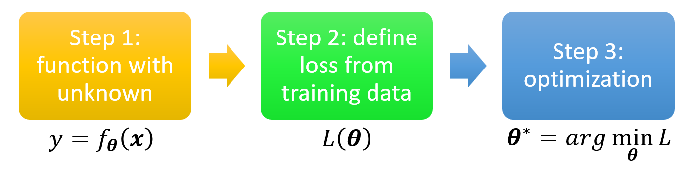
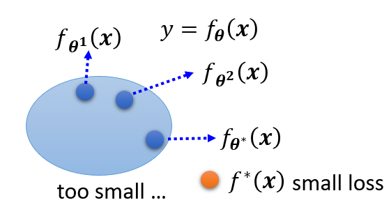

# Machine Learning - P1

## Introduction

我们可以将机器学习简单理解为**寻找一个函数**，典型的函数类型有：

- **回归**(regression)：输出一个标量的函数

    

        
    

- **分类**(classification)：给定一组选项（类(classes)），能够输出正确选项的函数

    

        
    

    

        
    

- 其他各种函数：

    

        
    

实际上，回归和分类只是机器学习的一小部分，它们的共同特点是输出量比较简单。对于更复杂，具有结构特征的输出，比如图像、文档等，我们把这种情况称为**结构化学习**(structured learning)。

## Training

下面介绍机器学习的核心——寻找函数的步骤。实际上，实现这些步骤就是一个**训练**(training)的过程。

    

- **构造带有未知参数的函数**
    - 基于领域知识来构造函数，或者叫做**模型**(model)
    - 以一个简单的模型为例：$y = b + wx_1$，其中已知数据 $x_1$ 称为**特征点**(feature)，未知参数 $w, b$ 分别称为**权重**(weight)和**偏移**(bias)

- **从训练数据中定义损失**
    - **损失**(loss)：一个关于未知参数的函数，定义为 $L(w, b)$，用于衡量一组值的好坏
    - 先假定一组 $w, b$ 的值，代入已知数据 $x_1$，计算出预测值 $y$；并且记真实值为 $\hat{y}$（称为**标签**(label)），那么对应的误差为 $e_1 = |y - \hat{y}|$（绝对误差）
        - 也可以用平方差计算，即 $e = (y - \hat{y})^2$
    - 假如有 $n$ 个数据，那么可以获得 $n$ 个误差，可以取它们的均值作为损失，即 $L = \dfrac{1}{N} \sum\limits_N e_n$（MAE）
        - 如果求的是平方误差，那么得到的 $L$ 是 MSE
        - 也可以用其他方法计算损失
        - 如果 $y, \hat{y}$ 是按概率分布的，那么可以用[交叉熵](https://en.wikipedia.org/wiki/Cross-entropy)(cross-entropy)计算

    - 对于不同的 $b, w$，我们可以得到不同的 $L$ 值，因此我们可以根据计算得到的数据作出一张**误差曲面**(error surface)：

        

            
        

        用颜色表示 $L$ 值，越红表示 $L$ 越大，越紫表示 $L$ 越小

- **优化**(optimization)
    - 我们的目标是找到一组 $w^*, b^*$，使得 $L$ 最小，即 $w^*, b^* = arg \min\limits_{w, b} L$
    - 常用方法是**梯度下降法**(gradient descent)
        - 如果只考虑权重$w$和损失$L$（二维）：
            - 先（随机）挑选初始值 $w_0$
            - 计算 $\dfrac{\partial L}{\partial w} \Big|_{w = w^0}$（即 $w^0$ 对应点的斜率）
            - 若计算结果为负（下降），则增大 $w$（向右走），否则的话（上升）减小 $w$（向左走）
            - 规定移动步幅为 $\eta \dfrac{\partial L}{\partial w} \Big|_{w = w^0}$（如下图橙色箭头所示）。其中 $\eta$ 为**学习速率**(learning rate)，它是一个**超参数**(hyperparameter)，即事先人为给定的参数。那么下一个权重为 $w^1 \leftarrow w^0 - \eta \dfrac{\partial L}{\partial w} \Big|_{w = w^0}$
            - 重复除第一步外的所有步骤（迭代），直到
                - 找到最小值，可能是**全局最小值**(global minima)，也可能是**局部最小值**(local minima)。前者是我们预期的结果，而后者并不是我们想要的，但是梯度下降法误以为这就是最小值（受算法设计和数据特征的影响）
                    - 实际上，局部最小值并不一定是问题所在（？）
                - 超出规定的迭代次数

            

                
            

        - 再算上偏移$b$的话（三维）：
            - （随机）挑选初始值 $w^0, b^0$
            - 计算 $\dfrac{\partial L}{\partial w} \Big|_{w = w^0, b = b^0}$ 和 $\dfrac{\partial L}{\partial b} \Big|_{w = w^0, b = b^0}$（不用手算，大部分的深度学习框架都可以用一行语句算出来的）
            - 迭代更新 $w, b$：$w^1 \leftarrow w^0 - \eta \dfrac{\partial L}{\partial w} \Big|_{w = w^0, b = b^0}, b^1 \leftarrow b^0 - \eta \dfrac{\partial L}{\partial b} \Big|_{w = w^0, b = b^0}$

            

                
            

## Activation Functions

除了 $y = b + wx_1$ 这一模型外，我们还可以构造更为复杂的模型，以减小损失，比如 $y = b + \sum\limits_{j=1}^7 w_j x_j, y = b + \sum\limits_{j=1}^{28} w_j x_j$ 等等。实验表明，当累加的项数越多（即使用更多特征点）时，损失往往会更小，也就是说训练效果会更好；但项数多到一定程度后，提升效果就不太明显了。本质上，上述的这些模型都可以归类为**线性模型**(linear models)，这是一类最简单的模型。

    

### Sigmoid

由于过于简单，线性模型存在很严重的局限性（称为**模型偏移**(model bias)），无法表征所有的情况。因此我们需要一些更灵活、更精密的模型——下面引入一种表示所有曲线的方法：对于上图中的红色折线，我们可以用**一个常量（在图上就是一条水平线）+ 一组 Z 字形折线之和**表示，如下图所示：

    

可以看到，第 1 条 Z 字形折线的腰部与红色折线的第 1 段平行，以此类推，我们用 3 条折线复原了这条红色曲线的 3 段折线部分。随后我们可以通过上下平移这些 Z 字形折线，或者通过增加一个常量（水平线，图上为第 0 条线）来修正，最终可以完美复原这条红色折线。

不难想到，这种方法适用于所有的直直的折线。实际上，对于任意的曲线，该方法也同样适用：只要在曲线上选取足够多的点，用线段连接相邻点，这样就可以用折线来近似表示原曲线，然后每个折线段可以用一个 Z 字形折线拟合，最终可以做到用多条 Z 字形折线之和 + 常量来表示任意曲线（如下图所示）。

    

现在来看我们如何用一个函数来表示这条 Z 字形折线呢？实际上，这条折线来自于 **S 型函数**(sigmoid function)：$y = c \dfrac{1}{1 + e^{-(b + wx_1)}} = c \cdot sigmoid(b + wx_1)$，函数图像如下所示：

    

而 Z 字形折线是它的一种变体，称为**硬 S 型**(hard sigmoid)，可以通过选择合适的参数（$c, b, w$）得到。下面来看调整不同参数会得到什么样的效果：

    

所以，对于任意的曲线（函数），我们可以用一组 sigmoid 函数的线性组合来表示，即：

$$
y = b + \sum\limits_i c_i\ sigmoid(b_i + w_i x_1)
$$

上述式子仅针对最简单的线性模型。对于更一般的线性模型 $y = b + \sum\limits_{j=1} w_j x_j$，它的线性组合为：

$$
y = b + \sum\limits_i c_i\ sigmoid(b + \sum\limits_{j=1} w_j x_j)
$$

其中 $i, j$ 分别表示 sigmoid 函数和特征点的序号。下面我们用图形化的语言表示上述计算过程：

    

这里用 $r_i$ 表示第 $i$ 个 sigmoid 函数接受的参数（线性模型），于是得到了三个方程（蓝色方框内），不难想到可以用**矩阵**来表示这些方程：

$$
\begin{bmatrix}r_1 \\ r_2 \\ r_3\end{bmatrix} = \begin{bmatrix}b_1 \\ b_2 \\ b_3\end{bmatrix} + \begin{bmatrix}w_{11} & w_{12} & w_{13} \\ w_{21} & w_{22} & w_{23} \\ w_{31} & w_{32} & w_{33}\end{bmatrix} \begin{bmatrix}x_1 \\ x_2 \\ x_3\end{bmatrix}
$$

令 $a_i = sigmoid(r_i)$，继续计算，直到算出 $y$。完整的计算过程如下图所示：

    

事实上，计算 $y$ 的全过程都可以转化为矩阵的乘法和加法。对上式进一步化简，最终得到：

    

!!! info "注"

    上面的式子中出现了两个 $b$，但意义不同：

    - 灰色的$b$是一个常量
    - 绿色的$b$是每个 sigmoid 函数下线性模型的偏移量（矩阵）

### ReLU

除了 sigmoid 函数外，还有一类在机器学习中常见的，且与 sigmoid 十分相似的函数：**ReLU**（rectified linear unit，整流线性单元），它的函数图像如下所示：

    

可以看到，它的形状就是硬 sigmoid 函数去掉其中的顶边或底边；它也接收相同的参数，但是它的函数形式更为简单，就是一个 max 函数。

现在，我们用 ReLU 来表示任意的线性模型：

$$
y = b + \sum\limits_{2i} c_i\ max(b + \sum\limits_{j=1} w_j x_j)
$$

与 sigmoid 的等价形式相比，除了将 sigmoid 换成 max 外，另一处区别在于累加和的项数扩大了一倍，这是因为 2 个 ReLU 才能转化为 1 个 sigmoid，这一点是显而易见的。

在机器学习中，我们将 sigmoid 和 RELU 称为**激活函数**(activation functions)。

实践效果上看，ReLU 的效果更好，原因将在后面的章节中阐述。

## More General Framework

回到前面的机器学习三步框架：

- 上面算出的 $y$ 就是第一步中**带未知参数的函数**；除了 $x, y$ 外，其余部分都是未知参数。将这些未知参数放在一起，构成一个 $N \times 1$ 的矩阵，即一个 $N$ 维向量 $\bm{\theta} = \begin{bmatrix}\theta_1 \\ \theta_2 \\ \theta_3 \\ \vdots \end{bmatrix}$

    

        
    

- 现在这个模型的**损失**是一个关于参数 $\bm{\theta}$ 的函数，但具体计算误差和损失的过程其实没有太大的变化：$e = |y - \hat{y}|, L = \dfrac{1}{N} \sum\limits_n e_n$

- 在“**优化**”这步中，我们要求 $\bm{\theta^*} = arg\ \min\limits_{\bm{\theta}} L$，具体步骤还是类似的：
    - （随机）挑选初始值 $\bm{\theta^0}$
    - 计算梯度 $\bm{g} = \nabla L(\bm{\theta^0}) \begin{bmatrix}\dfrac{\partial L}{\partial \theta_1} \Big|_{\bm{\theta} = \bm{\theta^0}} \\ \dfrac{\partial L}{\partial \theta_2} \Big|_{\bm{\theta} = \bm{\theta^0}} \\ \vdots \end{bmatrix}$
    - 迭代更新 $\bm{\theta}$：$\bm{\theta_1} \leftarrow \bm{\theta^0} - \eta \bm{g}$，$\dots$
    - 但实践过程中，我们不会一下子处理这么多的参数，而是将这些参数**分批**(batch)处理，因此上面的优化过程可以改写为：

        

            
        

        如果所有的参数都按批用于更新梯度一次后，那么我们称之为 1 个**时期**(epoch)。对于每个时期，每批数据都会被随机打乱(shuffle)。

## General Guidance

我们可以将机器学习的任务（尤其是这门课的 HW）简单地抽象为：

- 给定一组训练数据 $\{(\bm{x^1}, \hat{y}^1), (\bm{x^2}, \hat{y}^2), \dots, (\bm{x^N}, \hat{y}^N)\}$，以及一组测试数据 $\{\bm{x^{N+1}}, \bm{x^{N+2}}, \dots, \bm{x^{N+M}}\}$
- 在训练数据上进行训练：

    

        
    

- 使用效果最好的模型 $y = f_{\bm{\theta}^*}(\bm{x})$ 来标注测试数据，得到预测结果 $\{y^{N+1}, y^{N+2}, \dots, y^{N+M}\}$，然后上传到 Kaggle 评分

那我们该如何得到一个较好的模型呢？或者说当我们遇到一个效果不好的模型时，我们该如何改进呢？下面给出一张总体的方向图（总结地相当 nice！）

    

可以看到，如果某个模型无论在训练数据，还是在测试数据上的损失都很小的话，那么这个模型的表现就很好了。但只要有一种损失很大的话，就需要通过各种方法来改进我们的模型，那下面就来逐一分析改善模型的思路：

- **模型偏移**(model bias)的问题
    - 原因：模型过于简单。比如有一个简单的模型 $y = f_{\bm{\theta}}(\bm{x})$，通过训练不断寻找合适的参数，获得 $f_{\bm{\theta}^1}(\bm{x}), f_{\bm{\theta}^2}(\bm{x}), \dots$。最后得到一个损失尽可能小的模型 $f_{\bm{\theta}^*}(\bm{x})$，但实际上相比其他模型 $f^*(\bm{x})$ 它的损失还是很大。下图形象说明了这一点：

        

            
        

        这就好比在大海里捞针，但实际上这根针并不在这片海域里...

    - 解决方法：重新设计模型，使其变得更有弹性(flexible)，具体做法可以是：
        - 采取更多的特征点(features)
        - 进行更深的机器学习（使用更多的神经元或层）

        

            
        

- **优化**(optimization)的问题
    - 产生较大的损失有时不一定意味着模型的问题，也可能是优化策略选的不够好。比如前面介绍的梯度下降法就有可能陷入局部最小的问题，从而无法找到真正的最小值，下图形象展示了这一点：

        

            
        

        这就好比在大海里捞针，但就是找不到这根针

    - 解决方法：使用更强大的优化技术（之后会介绍）

???+ note "如何判断是模型偏移问题还是优化问题？"

    - 比较不同模型的效果

        

            
        

        如图所示，光看测试数据的结果，如果更深的网络效果更差，那么除了优化问题外还有可能是过拟合问题。然而，如果在训练数据上，更深的网络效果还是更差，那么就应该是优化问题了。

    - 从更浅（层数更少）的网络（或其他模型）入手，更方便优化
    - 如果更深的网络并没有在训练数据上得到更小的损失，那么就是优化问题了
        - 因为相比浅的网络，深的网络更具弹性。我们可以让网络中的某些层对数据不做任何改动，这样可以让该网络等价于层数更少的网络。因此通过对模型的修改是可以让更深的网络得到不高于更浅的网络的损失，那么上述问题就应该来自于优化方法的局限了。

- **过拟合**(overfitting)的问题：在训练数据上损失很小，但在测试数据上损失较大
    - 一个极端的例子：假如有训练数据 $\{(\bm{x^1}, \hat{y}^1), (\bm{x^2}, \hat{y}^2), \dots, (\bm{x^N}, \hat{y}^N)\}$，使用模型 $f(\bm{x}) = \begin{cases}\hat{y}^i & \exists \bm{x^i} = \bm{x} \\ random & otherwise\end{cases}$。显然这个模型没什么用，但是它在训练数据上是没有损失的（因为就是简单的 copy 训练数据），但在测试数据上损失很大（全部随机数，~~所以也有极小概率遇到损失很小的情况~~）
    - 原因：假设已知真实的数据分布（也就是最理想模型应有的样子，但无法直接观测；且由于数据是离散的，所以用虚线表示）以及训练数据（曲线上的部分点）。

        

            
        

        如果我们采取弹性较大的模型，并且让该模型恰好经过这些训练数据点，那么我们可能会得到以下结果：

        

            
        

        由于模型的弹性够大，对于非训练数据上的其他位置，它有着很高的自由变化程度，因而测试数据上的损失就会变得很大了，如下图所示：

        

            
        

    - 解决方法：
        - 使用更多的训练数据：这是一种简单有效的方法（但 HW 不能这样做）

            

                
            

        - **数据增强**(data augmentation)：在训练数据的基础上得到一些稍作修改的副本，从而形成更多的训练数据
            - 但是不要有太大或没意义的修改，比如对于一幅图像，对其左右翻转，适当缩放得到的图像都是 OK 的，但是上下翻转的图像就没什么实际意义了，因为通常人类不会阅读上下颠倒的图像

            

                
            

            
        - 给模型一些**限制**(constrain)，降低其弹性
            - 举例：比如规定模型就是一个二次函数，那么会得到以下结果：

                

                    
                

                可以看到模型效果会好很多。

            - 具体来说，可以通过以下方法来限制模型：
                - 减少未知参数，或让网络的层之间共享一些参数
                    - 后者就是**卷积神经网络**(CNN)的做法，它是**全连接**(fully-connected)神经网络（也就是之前介绍的一般的神经网络）的特殊情况，之后会详细介绍
                - 采用更少的特征点
                - 提早结束训练(early stopping)
                - 正则化(regularization)
                - dropout
            
            - 当然，限制不能太多，否则模型就会在训练数据上得到更大的损失，问题就回到了**模型偏移**上了

                

                    
                
    

    - 综上，我们需要权衡好模型偏移（与损失成正比）和模型的复杂性（或弹性）的关系，从而让模型在训练数据和测试数据上的损失都尽可能地小。下图展示了二者的关系：

        

            
        
  

    !!! note "交叉验证(cross validation)"

        在机器学习的作业平台 kaggle 上，我们用提供的训练数据得到一些模型，然后用公开的(public)测试数据上使用这些模型。如果发现其中某个模型的损失很小，并不意味着这个模型能够在私有的(private)测试数据（另一批测试数据，但是要在 ddl 之后才会用）上具备相似的损失量。

        

            
        
  

        还是拿之前介绍过的极端例子为例：$f_k(\bm{x}) = \begin{cases}\hat{y}^i & \exists \bm{x^i} = \bm{x} \\ random & otherwise\end{cases}$，其中 $k$ 表示训练次数。如果训练次数足够大，那就有可能遇到某次训练下的模型，碰巧在公共的测试数据上损失很小的情况，而实际上在私有的测试数据上的表现情况是随机的、未知的。所以仅根据公有测试数据的结果对模型效果做判断是不明智的。这也说明了有些模型即使很烂，但在某些测试数据集上的表现远超人类的异常现象。

        改进的做法是将原来的训练数据集分为两部分：一部分仍然作为训练数据，另一部分作为验证(validation)数据，不参与模型的训练中。当在这些训练数据中训练出一些模型后，我们将模型放到验证数据集上跑，观察损失有多大。根据这一损失选择的模型，无论是在公有的还是私有的测试数据集上，得到的损失应该是差不多的。尽管如此，还是不建议仅参考公有测试数据的损失来改进模型，因为这样可能出现过拟合的问题。

        

            
        

        如果不清楚该如何从原训练数据集中分出一部分作为验证数据，那么可以采用 **N 折交叉验证**(N-fold cross validation)：
            
        - 将训练数据集分为 N 等分
        - 取其中 1 份作为验证数据，余下 N - 1 份作为训练数据，在此基础上训练模型
        - 然后取另 1 份作为验证数据，余下 N - 1 份作为训练数据，在此基础上训练模型
        - 以此类推，直到每份数据都曾作为验证数据过，此时得到模型的 N 次训练下的损失，取平均值作为最终的损失
        - 比较不同模型的损失，取损失最小的模型，在整个训练数据集上重新训练，得到的模型用在测试数据上，这样在公有或私有的测试数据上的损失也差不多

        

            
        

- **错误匹配**(mismatch)的问题
    - 原因：训练数据和测试数据的分布不同
    - 此时需要注意数据是如何生成的
    - 除了 HW11 外，绝大多数 HW 没有这个问题

### More about Validation Set

!!! info "注意"

    我认为这块内容适合放在这个地方，但是它涉及到笔记 Machine Learning - P2 部分的[宝可梦/数码宝贝分类器](2.md#example-pokémondigimon-classifier)那边的知识，所以还是建议先学完那部分的笔记后再来看这里。

!!! question "问题"

    有时，虽然我们采取交叉验证的方法，在正式测试前现在验证集上跑一下，找到损失最小的模型，但放到测试集上，这个模型还是会出现过拟合的问题。这是为什么呢？下面就来简单探讨这个问题。

>个人感觉李宏毅老师对这块讲得太过简单，之后有时间的话可能还需要再补充一下。如果我忘记或鸽掉了的话，可以在评论区戳我一下~

简单回顾整个过程：假如我们在训练集上设计了三个模型 $H_1, H_2, H_3$，它们在最小损失上对应的阈值为 $h_1^*, h_2^*, h_3^*$。随后将这三个阈值放在验证集上跑一遍，得到了三个损失 $L(h_1^*, D_{val}), L(h_2^*, D_{val}), L(h_3^*, D_{val})$，从中挑选损失最小的那个模型（比如 $H_3$）放到测试集 $D_{test}$（可看做对 $D_{all}$ 的近似）跑。

现在，我们令 $H_{val} = \{h_1^*, h_2^*, h_3^*\}, h^* = arg \min\limits_{h \in H_{val}} L(h, D_{val})$，那么“从验证集中挑选表现最好的模型”这件事可以看作是在 $D_{val}$ 上“训练”模型 $H_{val}$。

根据后面介绍的[霍夫丁不等式](2.md#probability-of-failure)，可以得到

$$
P(D_{val}\ is\ \bm{bad}) \le |H_{val}| \cdot 2exp (-2N_{val} \varepsilon^2)
$$

因此，如果 $|H_{val}|$ 的值过大，也就是可选模型数越多，也就是参数越多的时候，即使把模型放到验证集跑过一遍后，因为验证集是不太好的，所以实际上模型的表现并没有在验证集中那么好。