# Adaptation

在之前的学习中，我们已经接触过大量的 ML 技术，所以训练一个一般的分类器对我们来说是小菜一碟的。然而，当测试数据和训练数据的分布不太一样时（比如在手写数字识别任务中，训练数据是黑底白字，而测试数据是彩色背景和数字），分类器的表现就不太理想了。

    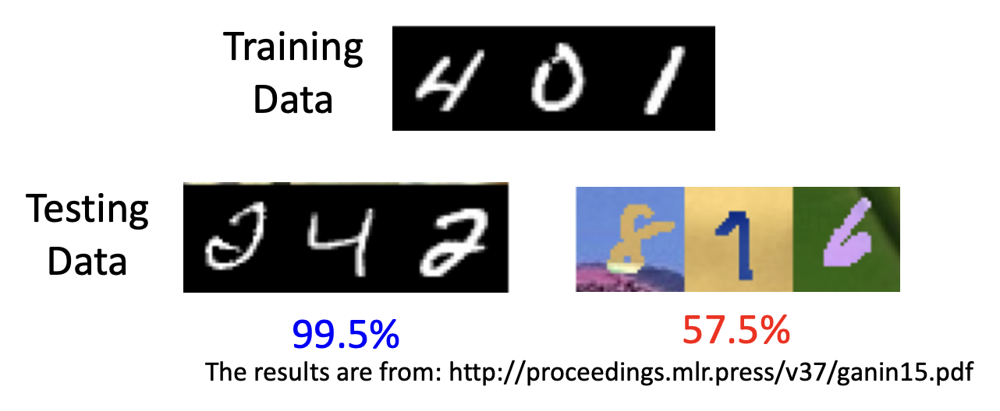

上述这种现象被称为**域偏移**(domain shift)。在谈论域偏移的时候，我们一般将训练数据记作**源域**(source domain)，将测试数据记作**目标域**(target domain)。除了上述域偏移的情况外，还有以下例子：

    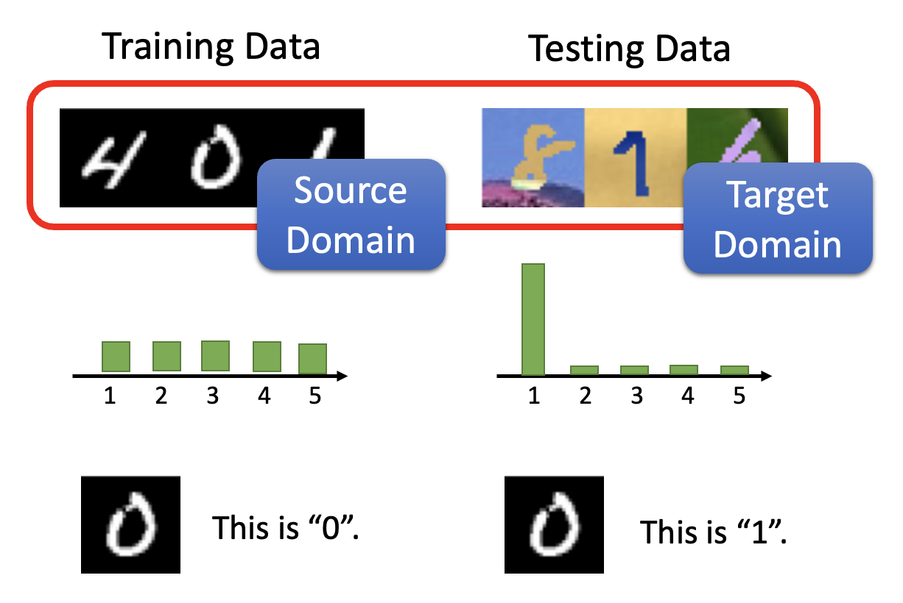

解决域偏移的方法叫做**域适应**(domain adaptation)（类似[**转移学习**](https://youtu.be/qD6iD4TFsdQ)(transfer learning)）。通常认为源域中的数据是标注好的，因而根据目标域的了解对域适应方法做出分类（从右往左分析）：

    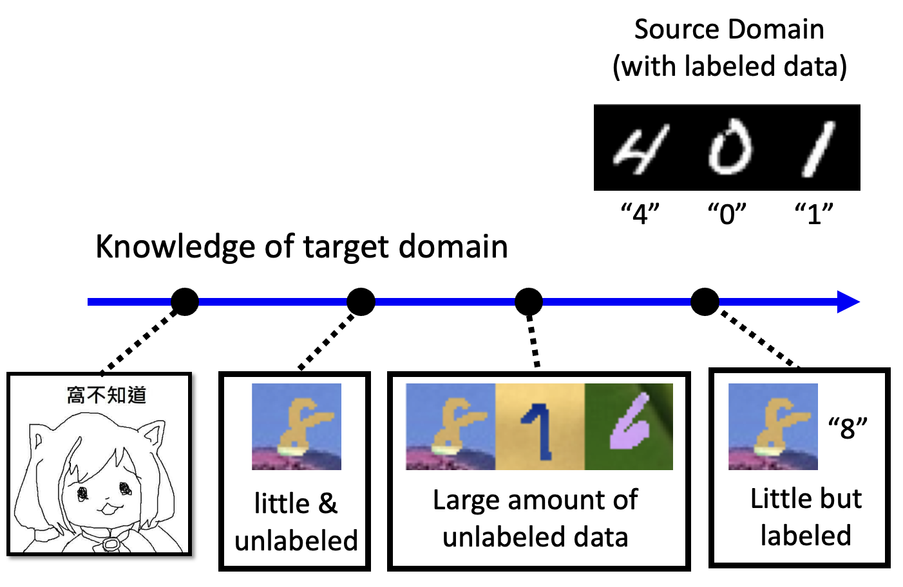

- 知道少量标注数据
    - 思路：用源数据训练模型，然后根据目标数据进行微调
    - 挑战：由于目标数据个数有限，因此小心过拟合的情况
- 知道大量未标注数据
    - 基本思路（**域对抗训练**(domain adversarial training)）：
        - 让源数据和目标数据分别经过一个**特征提取器**(feature extractor)（一种网络），分别得到各自的特征向量
        - 尽管源数据和目标数据的分布不同，但它们的特征向量应当具有相同的分布
        - 对于手写数字识别任务而言，这意味着特征提取器能够忽略图像颜色的差异

        

            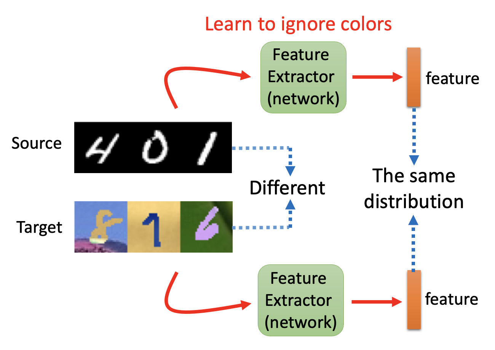
        

        - 接着将特征向量丢给**标签预测器**(label predictor)，输出一个关于类的分布
        - 我们可以从一个一般的分类器入手，将它一分为二，得到特征提取器和标签预测器；至于从哪一层“切开”，这就取决于我们的选择（超参数）
        - 对于有标注的源数据，我们希望它经过分类器得到的输出和标签尽可能一致；但是对于没有标注的目标数据，我们没有一个标准答案，因此采取的做法是比较目标数据特征向量和源数据特征向量，让前者尽可能接近后者

        

            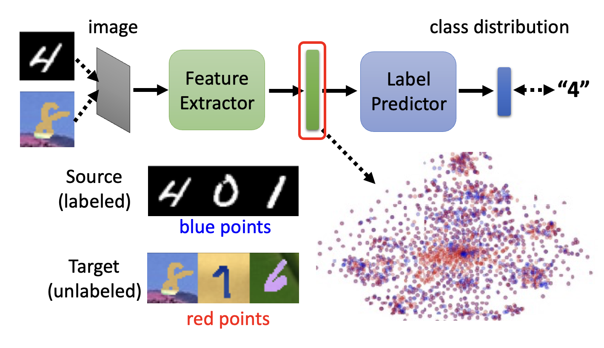
        

        - 要实现上一条的要求，需要有一个**域分类器**(domain classifier)，为特征向量分类，看它到底是属于源域还是目标域的；对应地，特征提取器的目标就变成了如何“骗过”域分类器
        - 是不是很有一种熟悉的感觉？又一个和 GAN 很像的训练过程——特征提取器对应生成器，域分类器对应判别器

        

            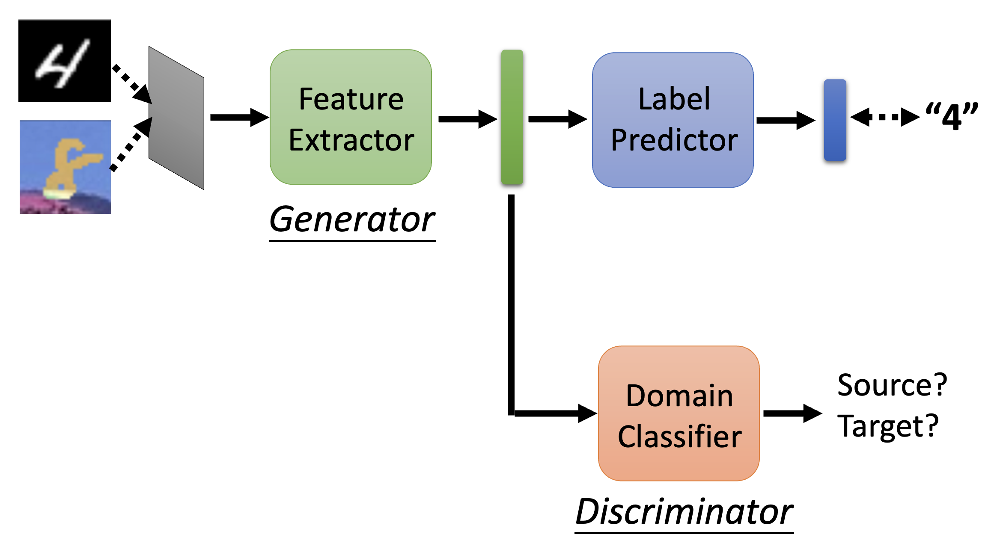
        

        - 既然要骗过域分类器，一种无脑的做法就是让特征提取器一直输出零向量，但这样做还会影响到标签预测器的处理，因此是不可行的
        - 特征提取器、标签预测器和域分类器的参数分别记作 $\theta_f, \theta_p, \theta_d$，标签预测器和域分类器的损失（交叉熵）分别记作 $L, L_d$，那么训练的目标分别为：
            - 标签预测器：$\theta_p^* = \min\limits_{\theta_p} L$
            - 域分类器：$\theta_d^* = \min\limits_{\theta_d} L_d$
            - 特征提取器：$\theta_f^* = \min\limits_{\theta_p} L - L_d$
                - 但这并不是最好的做法，原因留给读者思考

        - 域对抗训练的效果如下（表格第二行）：

            

                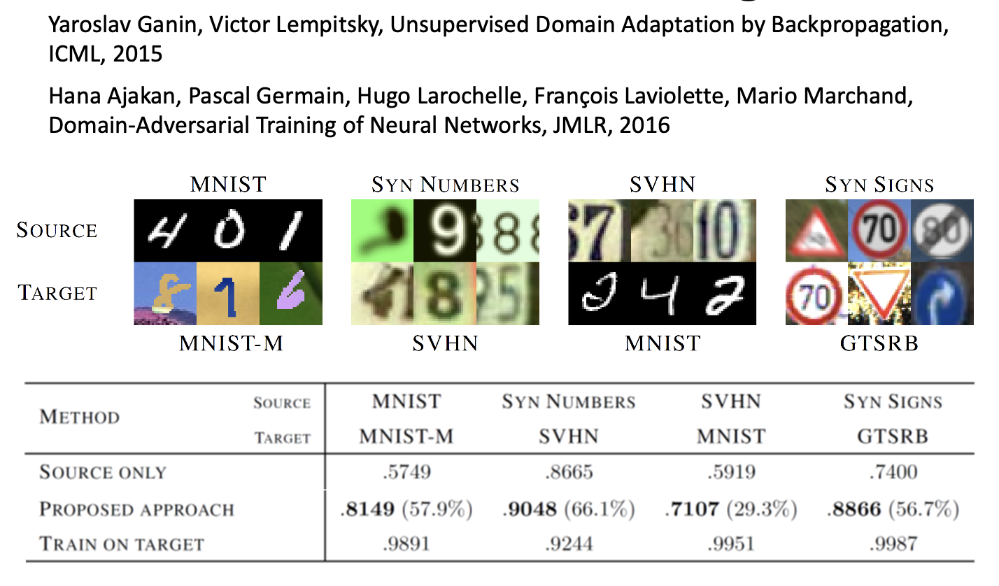
            

        - 这种训练方法的局限在于，尽管我们认为源数据和目标数据的分布应当越接近越好（对齐），但这不一定代表训练效果一定是好的

            

                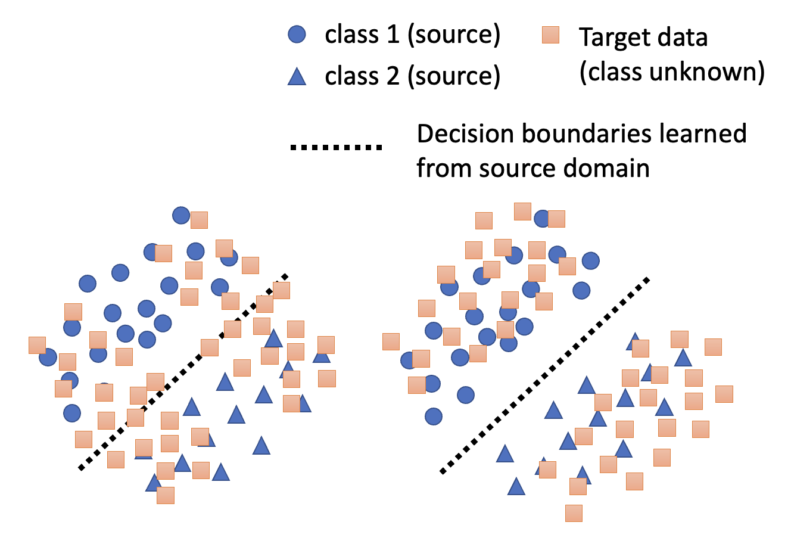
            

            虽然上面两张图中目标数据和源数据的分布都挺接近的，但是我们认为第二张图才是我们想要的结果，因为它反映了目标数据遵循源数据的分类（介于边界两边）

        - 为了达到第二张图的效果，需要考虑决策边界，下面提供了一些解决方案：

            

                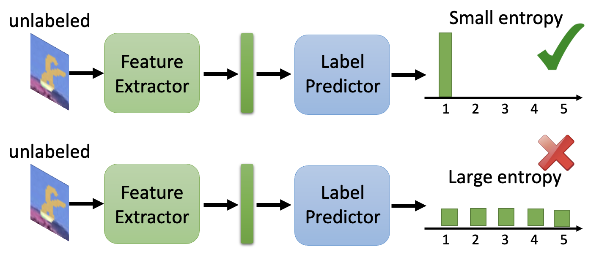
            

            - [用于教师指导下的决策边界迭代精炼训练(DIRT-T)](https://arxiv.org/abs/1802.08735)
            - [最大分类器差异](https://arxiv.org/abs/1712.02560)

        - 有时，源域和目标域之间可能存在包含关系或交集关系，那么也就存在部分目标数据可能无法归类到源数据的情况，反之亦然，此时强行让两者分布相近不太现实，因而有了[**通用域适应**](https://openaccess.thecvf.com/content_CVPR_2019/html/You_Universal_Domain_Adaptation_CVPR_2019_paper.html)(universal domain adaptation)的方法。

            

                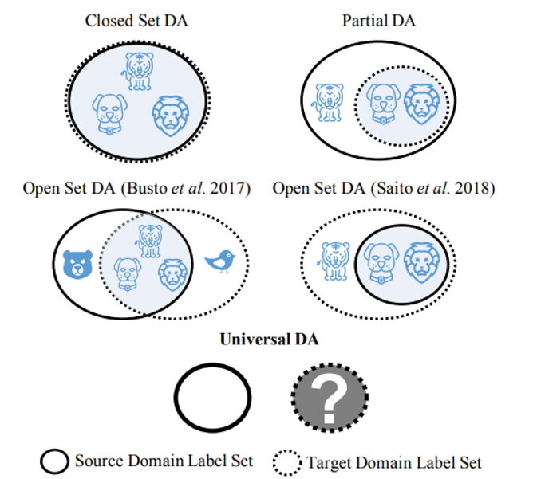
            

- 知道少量未标注数据
    - 技术：[测试时间训练](https://arxiv.org/abs/1909.13231)(testing time training, TTT)
- 啥都不知道
    - 技术：**域泛化**(domain generation)

        

            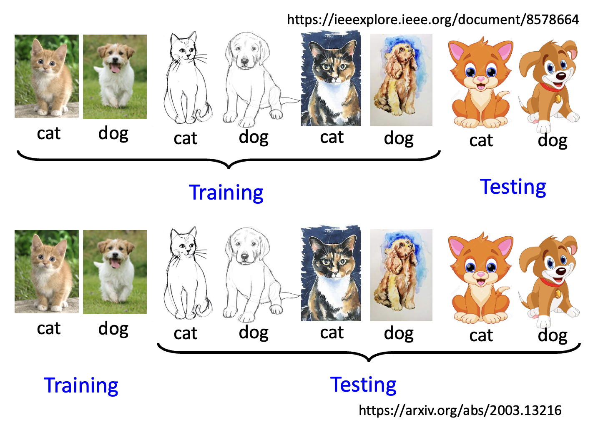
        
