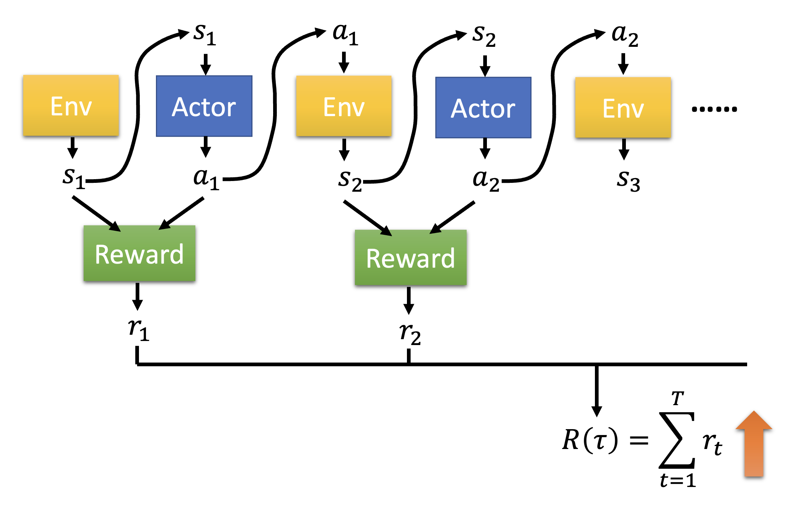
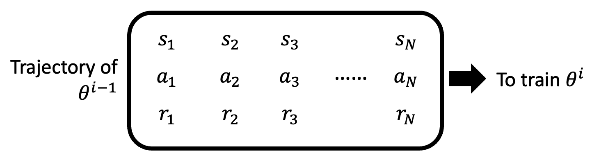
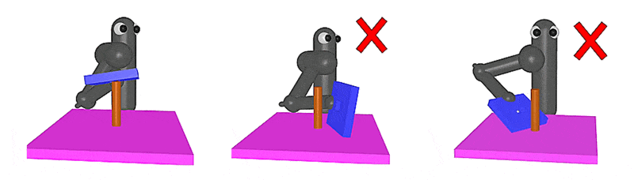

# Reinforcement Learning

之前的章节中，有一大半都是在讲监督学习，这种训练方式要求有一个标注好的数据集。但并不是所有任务都能够被标注，而且机器也没法仅凭一个标签对结果的好坏做出准确的分析，比如下围棋等等。而**强化学习**(reinforcement learning)就能解决这些无法被监督学习解决的问题，所以本节将详细介绍这一耳熟能详的技术。


## Basic Ideas

最开始的时候，我们认识到机器学习的目标近似于找一个函数；身为机器学习的成员之一，强化学习的目标亦是如此。整个强化学习的过程中有两个对象：**行动者**(actor)和**环境**(environment)。它们之间的关系是：

- 环境向行动者提供了**观察**(observation)（函数输入）
- 行动者在环境中采取**行动**(action)（函数输出）

所以行动者就是强化学习中要找的“函数”：行动 = f(观察)。函数的目标是找到一个策略，来最大化行动者从环境中得到的总**奖励**(reward)，而这个奖励来自行动者和环境的交互中。

<div style="text-align: center">
    
</div>

???+ example "例子"

    === "电子游戏：太空侵略者"

        我们将前面介绍的抽象模型套到这个最经典的电子游戏之一，以便我们更好地理解强化学习的基本概念。

        <div style="text-align: center">
            
        </div>

        - 环境即为整个游戏程序，而游戏界面对应行动者的观察
        - 行动者是玩家操控的飞船，它可以发起的行动有：左移、右移和开火（~~当然一动不动也可以算作一种行动~~）
        - 奖励就是左上角的分数，击落外星人即可得分
        - 游戏的终止条件是：要么击败所有外星人，要么玩家的飞船被外星人摧毁

        将游戏画面和上面的结构图结合起来，得到以下结构图：

        === "右移"

            <div style="text-align: center">
                
            </div>

        === "开火"

            <div style="text-align: center">
                
            </div>

    === "围棋"

        AlphaGo 也是基于强化学习训练出来的，下面是简化后的结构图：

        <div style="text-align: center">
            
        </div>

既然强化学习是机器学习的一种，那我们仍然可以在强化学习上套用机器学习的三个步骤（仍以太空侵略者为例）：

1. 构造带未知参数的函数
    - 行动者就是强化学习中的函数，里面也用到了神经网络结构，称为**策略网络**(policy network)
    - 神经网络的输入是用向量或矩阵形式表示的机器观察，输出是输出层中每个神经元对应的行动，
    - 由于每个输出神经元都会为各自的行动打分（概率），因此要根据这个分布采样，找出一个确定的行动
    - 由于是“采样”，所以即便对于同一张画面，通过强化学习训练的模型也可能采取不同的行动
    - 这个神经网络可以是 CNN，也可以是简单的全连接网络；或者可以用 RNN 或 Transformer 来看多个游戏画面，以把握全局

    <div style="text-align: center">
        
    </div>

2. 从训练数据中定义损失
    - 行动者会根据当前环境 $s_i$ 采取行动 $a_i$，使环境更新至 $s_{i+1}$，对应的奖励为 $r_i$
    - 这里假设在第 $T$ 轮交互后游戏结束，这整一个过程称为一个**回合**(episode)

    <div style="text-align: center">
        
        
    </div>

    - 总奖励（在 RL 相关文献中也叫做返回(return)）记作 $R = \sum\limits_{t=1}^T r_t$，而这正是我们期望最大化的值（对应一般机器学习中损失的相反数）

3. 优化
    - 以更抽象的形式表示上述过程，其中序列 $\tau = \{s_1, a_1, s_2, a_2, \dots \}$ 称为**轨迹**(trajectory)

        <div style="text-align: center">
            
        </div>

    - 然而，要想训练这样的模型，难度可不小
        - 首先，行动是采样得到的，所以同一个输入可能有多个输出的可能
        - 其次，除了行动者是可控的网络外，环境和奖励机制都是黑箱，而且都带有一定的随机性（在太空侵略者游戏中，我们不知道每次游戏出现什么画面）
    - 因此，类似 GAN，RL 的主要难点便是优化


## Policy Gradient

**策略梯度**(policy gradient)是 RL 常用的一种优化方法，下面将会详细介绍。


### How to Control the Actor

首先来看如何控制行动者。实际上行动者要做的事就是：对于给定的观察 $s$，希望采取或不采取某一行动 $\hat{a}$（这个 $\hat{a}$ 是一个标签，不过我们暂且不去管它是从哪里来的）。而损失函数的定义为：$L = \begin{cases}e & \text{take action } \hat{a} \\ -e & \text{don't take action } \hat{a} \end{cases}$（误差 $e$ 可用交叉熵计算得到），因而优化的目标就是找到行动者的参数 $\theta^* = \arg \min\limits_\theta L$。

<div style="text-align: center">
    
</div>

下面举个简单的例子：假如对于观察 $s$，我们希望行动者采取行动 $\hat{a}$；而对于观察 $s'$，我们不希望行动者采取行动 $\hat{a}'$。那么对应的损失函数就是 $L = e_1 - e_2$。

<div style="text-align: center">
    
</div>

接下来扩展到一般情况：假如已经迭代了 $N$ 轮，得到 $\{s_1, \hat{a}_1\}, \{s_2, \hat{a}_2\}, \dots, \{s_N, \hat{a}_N\}$ 以及对应的我们是否想要采取行动的期望（~~不是概率论中的“期望”~~）——采取行动为 +1，不采取行动为 -1，作为计算损失函数时误差前面的系数。那么损失函数就是一组误差的加减法，如下图所示：

<div style="text-align: center">
    
</div>

更一般地，我们为每个数据对赋予不同的实数权重 $A_n$，而不是只有 -1 和 1 两种选择，毕竟我们的“希望”也有强弱之分。此时损失函数就是 $L = \sum A_n e_n$。现在的难点在于我们该如何确定 $A_n$，下面就来探讨这个问题。

<div style="text-align: center">
    
</div>


### Version 0

最简单的做法是将每轮交互中产生的奖励 $r_n$ 作为系数 $A_n$，这样就能激励那些符合我们期望的行为，而打压那些不符预期的行为。

<div style="text-align: center">
    
</div>

然而，这是一种短视的做法！

- 由于前面的行动会影响到接下来的行动，继而影响到后续的奖励，因此当前最优的做法并不一定让最终结果也是最好的（类似贪心算法）
- **奖励延迟**(reward delay)：行动者应当牺牲当前的奖励，以获取更多的长远奖励
- 否则的话，以太空侵略者游戏为例，飞船（行动者）就会一直开火（因为只有开火才有正向奖励）而不移动，但这显然是不对的


### Version 1

既然当前行动会影响到后续行动，那么它对应的系数 $A_t$ 除了看自己的奖励外，还要看之后行动的奖励。所以令 $A_t = G_t = \sum\limits_{n=t}^T r_n$，其中 $G_t$ 称为**累积奖励**(cumulated reward)。

<div style="text-align: center">
    
</div>


### Version 2

但上述方法有一个问题：当前行动的影响范围有限，可能对很后面的行动影响不是很大。改进办法是增加一个**折扣因子**(discount factor) $\gamma < 1$，此时系数 $A_t = G_t' = \sum\limits_{n=t}^N \gamma^{n-t} r_n$。这样当 $n-t$ 很大时，$\gamma^{n-t}$ 的值就接近于0，第 $n$ 次行动对系数的计算影响就很小了。

<div style="text-align: center">
    
</div>


### Version 3

一个事实是：奖励的好坏是相对的。比如今天一张满分100分的考卷，小明考了70分。如果大家都是八九十分的话，那么小明考的不太理想；如果大家都是勉强及格的话，那么小明考的还算不错。为了让系数的大小更有区分度，在算出累积奖励 $G_t'$ 后还要再减去一个**基线**(baseline) $b$，使得 $G_t'$ 的值有正有负。这里的难点是如何寻找一个合适的基线。

<div style="text-align: center">
    
</div>


### Algorithm

下面将规范表述策略梯度算法：

```py linenums="1" hl_lines="3-5"
initialize actor network parameters theta[0]
for training iteration i = 1 to T
    using actor theta[i-1] to interact
    obtain data {s[1], a[1]}, {s[2], a[2]}, ..., {s[N], a[N]}
    compute A[1], ..., A[N]
    compute loss L
    theta[i] = theta[i-1] - eta * nabla_L
```

看起来和梯度下降法的区别不大，但高亮部分正是和梯度下降法最大的区别——训练数据的收集发生在训练阶段，而不是在训练前就准备好，这就意味着每一次迭代（参数更新）都要重新收集一波数据；换句话说，一个训练数据集仅能更新一次参数。

<div style="text-align: center">
    
</div>

为什么是这样的呢？我们可以做以下（~~可能不太恰当的~~）类比：对于一位棋艺精湛的棋手（参数更新后的模型）和新入门的小白（参数更新前的模型），高手能一眼看破在小白眼里可能比较不错的手法，所以这对 ta 的棋艺进步没什么帮助。


### On-policy v.s. Off-policy

上述 RL 框架中，用于训练的行动者和用于和环境交互的行动者是相同的，我们称这种情况为**在线策略**(on-policy)。对应地，**离线策略**(off-policy)就是两者不相同的情况。离线策略在这里不会细讲，不过值得一提的是这种方法的好处是训练当前参数 $\theta^i$ 可沿用上个参数 $\theta^{i-1}$ 的数据集，这样就无需每次更新都要重新收集数据。

<div style="text-align: center">
    
</div>

一种非常经典的离线策略技术是**近端策略优化**(proximal policy optimization, PPO)，它的要点是用于训练的行动者要知道自己和用于和环境交互的行动者之间的差异。


### Exploration

在收集数据中，一种重要的技术叫做**探索**(exploration)。之所以需要探索，是因为我们希望行动者的行动具有一定的随机性，而随机性往往是在训练数据中体现出来的，这也正是从概率分布中采样某个行动的原因。否则行动者可能会倾向于采取某个特定行动，这显然不是我们想要的。

探索（或者说增大随机性）的方法包括：

- 增大输出的熵
- 向参数添加噪音


## Actor-Critic

现在我们向 RL 引入一个新的模块，叫做**批评者**(critic)。训练批评者对训练行动者有一定的帮助，不过在了解起到什么帮助之前先来看一下批评者的工作原理。

批评者要做的事是：对于给定的行动者 $\theta$，根据当前的观察 $s$（有时还会考虑采取的行动 $a$）来评判行动者的表现好坏。这个批评者的一般形式是一个**值函数**(value function) $V^\theta(s)$，它的含义是：采用行动者 $\theta$ 后，根据看到的 $s$ 时预期得到的[折扣累积奖励](#version-2)。注意到函数上标 $\theta$，它意味着批评者的输出值取决于对行动者的评估。

<div style="text-align: center">
    
</div>


### How to Estimate Value Function

那么接下来的问题是如何估计 $V^\theta (s)$ 的值呢？下面给出一些常见的方法：

- **基于蒙特卡罗的方法**(Monte-Carlo(MC) based approach)：批评者观察和环境交互的行动者 $\theta$。例如对于环境 $s_a$，批评者直到完成整个回合后才能参考对应的累积奖励 $G_a'$

    <div style="text-align: center">
        
    </div>

- **时差法**(temporal-difference(TD) approach)：该方法不会看后续整个回合的数据，而是只看当前环境下的数据对以及下一个环境，即 $(s_t, a_t, r_t, s_{t+1})$
    - 对于那些回合数很长甚至无限长的情况，前一种方法就要延迟很长的时间了，而这种方法就比较管用
    - 观察 $s_t$ 和 $s_{t+1}$ 下值函数的值：
    
        $$
        \begin{align*}
        V^\theta (s_t) & = r_t + \gamma r_{t+1} + \gamma^2 r_{t+2} + \dots \\
        V^\theta (s_{t+1}) & = r_{t+1} + \gamma r_{t+2} + \dots
        \end{align*}
        $$

        两式相减，得到 $V^\theta (s_t) = \gamma V^\theta (s_{t+1}) + r_t$，或者 $r_t= \gamma V^\theta (s_{t+1}) - V^\theta (s_t)$

    - 现在的训练目标就是让 $\gamma V^\theta (s_{t+1}) - V^\theta (s_t)$（批评者的评估结果）和 $r_t$ 越接近越好

        <div style="text-align: center">
            
        </div>

???+ example "例子：比较 MC 和 TD"

    下面展示了批评者目前观察到的 8 个回合（为方便讨论，假设 $\gamma = 1$ 且忽略具体采取的行动）：

    { align=left width=30% }

    - 不难得到 $V^\theta (s_b) = \dfrac{6}{8} = \dfrac{3}{4}$
    - 但 $V^\theta (s_a)$ 的计算可能会有歧义
        - 如果用蒙特卡罗法做，$V^\theta (s_a) = \dfrac{0}{1} = 0$
        - 如果用时差法做，$V^\theta (s_a) = V^\theta (s_b) + r = \dfrac{3}{4} + 0 = \dfrac{3}{4}$
        - 两者的区别是：前者会认为 $s_a$ 和 $s_b$ 会相互影响，而后者并不这么认为


### Version 3.5

前面说过，训练行动者的 V3 中的难点是基线的选择。现在我们可以用批评者的评估结果（值函数）来替代基线，得到：

<div style="text-align: center">
    
</div>

对于某个数据对 $\{s_t, a_t\}$，系数 $A_t = G_t' - V^\theta (s_t)$。

- $V^\theta (s_t)$ 的计算：由于行动者会从一个概率分布中采样选择一个行动，所以对于当前观察 $s_t$，它不一定会选择行动 $a_t$，而是有多种行动可能，因此计算时要考虑到各种可能，求的是一种平均值

    <div style="text-align: center">
        
    </div>

- $G_t'$ 的计算：需要考虑在 $s_t$ 时采取 $a_t$ 后的累积奖励

    <div style="text-align: center">
        
    </div>


这个方法的缺陷在于 $G_t'$ 的计算仅考虑了一种采样可能，实际上对于 $s_t$，在沿 $a_t$ 后到达 $s_{t+1}$ 后，还有多条路可以选择。


### Version 4

基于上述分析，计算 $G_t'$ 时可参考 $V^\theta (s_t)$ 的计算，考虑多种行动可能（实际上也确实用到了值函数的值）：

<div style="text-align: center">
    
</div>

所以 $A_t = r_t + V^\theta (s_{t+1}) - V^\theta (s_t)$。这种方法叫做**优势行动者-批评者**(advantage actor-critic)。


### Tip

采用行动者-批评者框架训练时，一个小技巧是让行动者和批评者共享一些网络参数。这样做之所以合理，是因为两者的输入是相同的，那么在早期处理中，两者的部分内容应该是相似的。

<div style="text-align: center">
    
</div>


### Outlook: Deep Q Network

还有一种神奇的做法是只用批评者就知道要做什么行动，其中最知名的做法是深度 Q 网络(deep Q network, **DQN**)。[下图](https://arxiv.org/abs/1710.02298)展示了 DQN 及其各种变体的表现。

<div style="text-align: center">
    
</div>


## Reward Shaping

有时在一个回合内，大部分迭代中的奖励都是0（比如下围棋，机械臂拧螺丝等任务），那么系数 $A_t$ 就无法很好体现某个行动的表现好坏。这时开发者需要定义一种额外的奖励来引导智能体(agents)要采取什么样的行动，这种技术就叫做**奖励塑造**(reward shaping)。

???+ example "例子"

    === "例1：VisDoom"

        [VisDoom](https://vizdoom.cs.put.edu.pl/) 是一个 AI 机器人玩枪战游戏 DOOM 的项目。
        
        PPT 上有一个关于 [Visual Doom AI Competition @ CIG 2016](https://openreview.net/forum?id=Hk3mPK5gg&noteId=Hk3mPK5gg) 的例子，但是视频过长，读者可在有空的时候观看：

        


    === "例2：机械臂"

        某个任务要求机械臂将蓝色的板子套在棍子上。如果奖励仅仅考虑让板子和棍子的距离越近越好，那么就会出现下面右边两张图的错误情况，这时无论机械臂怎么弄都没法成功。所以需要通过奖励塑造的技术设定合理的奖励，促使机械臂朝正确目标前进。

        <div style="text-align: center">
            
        </div>

        [相关链接](https://bair.berkeley.edu/blog/2017/12/20/reverse-curriculum/)

    === "例3：基于好奇心的方法"

        该方法的思路是：智能体看到新的且有意义的东西时会获得额外奖励。只是新的，但是没有意义的东西（比如不断变化的噪音）不应该作为奖励的来源。下面是一段 demo 视频：

        

        相关链接：[官网](https://pathak22.github.io/noreward-rl/)，[论文](https://arxiv.org/abs/1705.05363)


## No Reward: Learning from Demonstration

对于某些任务，奖励的定义相当困难。可即便是精心定义的奖励也可能为智能体会带来不受控制的行为，比如机器人可根据[阿西莫夫三大定律](https://zh.wikipedia.org/zh-hans/%E6%9C%BA%E5%99%A8%E4%BA%BA%E4%B8%89%E5%AE%9A%E5%BE%8B)得到这样的结论：将人类关起来就能保障人类的生存，但这显然是不正确的。所以下面来看一些不用奖励进行 RL 的方法。


### Imitation Learning

<div style="text-align: center">
    
</div>

在**模仿学习**(imitation learning)中，行动者仍然与环境互动，但是不去使用奖励函数，而是参考**专家的演示**(demonstration)——机器会根据一系列关于专家的轨迹 $\{\hat{\tau}_1, \hat{\tau}_2, \dots, \hat{\tau}_K\}$ 来训练自己，从而达到“模仿”专家行为的效果。这种训练方法可用在无人驾驶、机器人等领域中。

{ width=30% align=left }

聪明的读者也许会发现，这种方法和监督学习十分相似：训练的目标同样是缩小模型输出和基准事实（监督学习中的标签/模仿学习中的专家数据）的差距（如左图所示）。所以模仿学习又称为**行为克隆**(behavior cloning)。

{ width=30% align=right }

但这种训练方法有一个明显的问题：专家数据是不完整的，只是从所有情况中采样部分数据。比如在无人驾驶任务中，专家数据（一般）不会包含撞墙的数据（不要拿自己生命开玩笑），所以机器看到的都是正常驾驶的数据。那么在遇到意外情况时，机器就不知道如何应对了。

上述问题衍生出来的另一个问题是：机器会完全模仿专家的行为，即便某些行为是没有意义的（可能是专家的一些习惯等等）。

??? example "例子"

    


### Inverse Reinforcement Learning

这是一般 RL 的流程图，可以看到它是基于环境和奖励来训练一个行动者的：

<div style="text-align: center">
    
</div>

但是现在讨论的情况是没有奖励的，所以我们可以采用相反的顺序来训练模型：根据环境和专家演示来反推奖励应该是什么样子的，接着根据奖励函数来寻找最优的行动者。这便是**逆强化学习**(inverse reinforcement learning, IRL)的大致流程。

<div style="text-align: center">
    
</div>

也许有人想学出来的奖励函数形式上会不会过于简单，从而影响训练效果。大可不必有这种担忧，因为即便是简单的奖励函数也能产生千变万化的、复杂的行动者。

IRL 的一个原则是：**老师永远是最棒的**(the teacher is always the best)。这并不意味着机器要模仿专家的行为，而是假定专家的行为能够得到最高价值的奖励。而 IRL 的基本思路是：

- 初始化<span style="color: cornflowerblue">行动者</span>
- 在每轮迭代中
    - <span style="color: cornflowerblue">行动者</span>和<span style="color: yellow">环境</span>交互，得到一些轨迹
    - 定义一个<span style="color: green">奖励函数</span>，使得老师的轨迹优于<span style="color: cornflowerblue">行动者</span>
    - <span style="color: cornflowerblue">行动者</span>基于新的<span style="color: green">奖励函数</span>最大化<span style="color: green">奖励</span>
- 输出奖励函数和从<span style="color: green">奖励函数</span>中学习的<span style="color: cornflowerblue">行动者</span>

对应的 IRL 框架图如下：

<div style="text-align: center">
    
</div>

是不是感觉 IRL 和 GAN 很像？确实如此，我们可将行动者看作 GAN 的生成器，而把奖励函数看作 GAN 的判别器。可从下图直观感受 GAN 和 IRL 的共同之处：

<div style="text-align: center">
    
</div>

??? example "例子（有关机器人的）"

    === "例1"

        

    === "例2"

        Chelsea Finn, Sergey Levine, Pieter Abbeel,  Guided Cost Learning: Deep Inverse Optimal Control via Policy Optimization, ICML, 2016

        - [官网](http://rll.berkeley.edu/gcl/)
        - [视频链接](https://www.youtube.com/watch?v=hXxaepw0zAw)

???+ abstract "更多方法"

    - [Visual Reinforcement Learning with Imagined Goals](https://arxiv.org/abs/1807.04742), NIPS 2018
    - [Skew-Fit: State-Covering Self-Supervised Reinforcement Learning](https://arxiv.org/abs/1903.03698), ICML 2020
    - Reinforcement learning with Imagined Goals (RIG)

        <div style="text-align: center">
            
        </div>