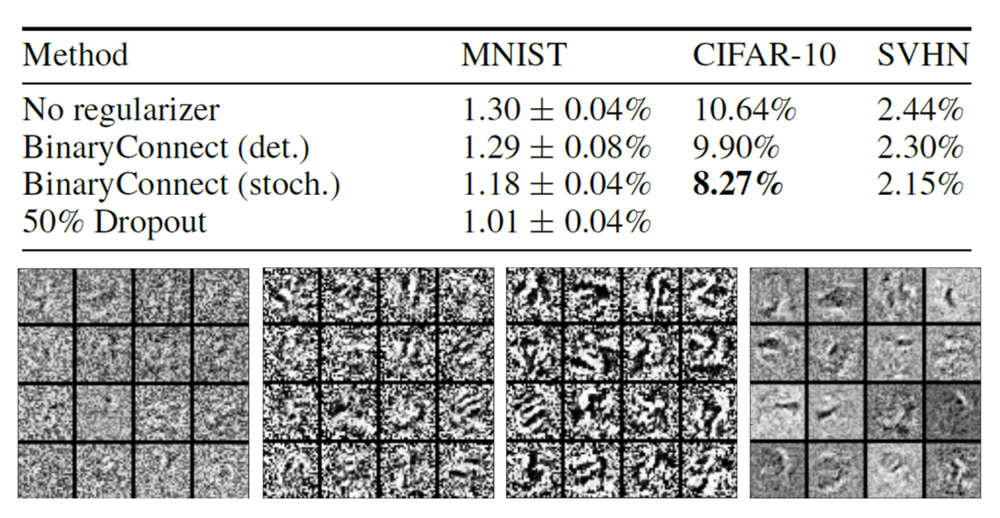

# Network Compression

有时，像 BERT 这么大的模型不是我们想要的，可能更小（参数量）的模型发挥更大的用处，比如将模型部署在资源受限的环境中（智能手表、无人机等）；或者是出于低延迟和隐私的考虑，需要部署在本地环境下（相比云服务器资源有限）。所以接下来将介绍一些压缩网络的技术。

!!! warning "注意"

    本讲介绍的这些技术都是软件层面上的，硬件层面的技术不在本讲的介绍范围内，感兴趣的读者可自行查阅相关资料。

## Network Pruning

第一种技术叫做**网络剪枝**(network pruning)。该技术的可行性来源于一个观察：网络存在**过参数化**(over-parameterized)的问题，即网络上有大量权重或神经元的冗余，那么它们就可以被剪掉。

???+ info "注"

    早在 1989 年的 NIPS 上，杨立昆等人已经在研究网络剪枝的问题了。

    

        
    

{ align=right width=30% }

网络剪枝的大致过程如下：

- 对于一个规模较大的预训练网络，评估其权重/神经元的重要性，然后去掉那些不重要的权重/神经元
    - 权重的重要性：绝对值、life long...
    - 神经元的重要性：对于给定数据集，非0的次数

- 剪枝后，模型的精度会有所下降（但期望不要下降太多）
- 让剪枝后的模型在训练数据上进行微调，以恢复精度
- 注意不要一次剪太多，否则上述恢复操作就没有效果了

下面来比较权重剪枝和神经元剪枝的细节：

- **权重剪枝**

    

        
    

    - 这种剪枝的问题是：剪枝后的模型架构不规整，不仅难以实现（现有的函数库（比如 PyTorch）不太支持这种情况），GPU 加速也会变得困难（阻碍矩阵运算）
    - 下图展示了权重剪枝的效果

        

            
        

        - 紫色曲线图对应稀疏度(sparsity)，即多少比例的参数被剪掉了；可以看到只保留了 10% 不到的参数，而且精度也几乎保留了下来（不过图中没表示出来，实际只降了 1-2% 左右）
        - 柱形图对应加速比大小，低于1的表示速度变得更慢，可见大多数模型在剪枝后速度反而变得更慢了
        
- **神经元剪枝**：由于剪枝后架构仍然规整，因此权重剪枝缺点的反面正是神经元剪枝的优点

    

        
    

### Why Pruning?

也许读者会问：既然我们能让一个大模型变成小模型还能保持差不多的精度，那么为什么不直接训练一个小模型，这样不是更省力吗？但是研究表明，直接训练一个小模型相比大模型更难训练成功，反过来说就是大模型更容易被优化。而这个“研究”给出的结论叫做[**彩票假说**](https://arxiv.org/abs/1803.03635)(lottery ticket hypothesis)，它的大致思想是：我们可以把一个大模型看作多个堆叠起来的小模型，那么训练一个大模型就相当于训练多个小模型。一个小模型相当于一张彩票（~~共同点就是都很玄学(bushi)~~），训练大模型可类比为买了多张彩票，那么中奖的概率相比买一张彩票会大一些，也就是说大模型中更容易训练出优质的参数

    

上面只是用一个浅显的比喻来简单认识了一下，接下来将从实验角度来说明这一假说的合理性。先对一个大模型的参数进行随机的初始化，然后通过不断训练得到更新后的模型，接着对该模型进行剪枝，得到一个小模型。神奇的地方在于，如果对小模型的参数进行随机初始化，那么这个小模型就训练不起来；但如果让小模型沿用一开始大模型用的随机参数初始化，那么模型就能训练起来。

    

由于彩票假说非常知名（得了 ICLR 2019 的最佳论文奖），所以后续也有针对该假说的研究。其中一篇有趣的研究叫做 [Deconstructing Lottery Tickets: Zeros, Signs, and the Supermask](https://arxiv.org/abs/1905.01067)，它尝试了多种不同的剪枝策略，发现下面用蓝框标出来的两种方法最有效。

    

- 第一种是训练前后绝对值差距越大，剪枝后的网络表现仍然不错
- 第二种是只要不改变初始权重的正负号，剪枝后的网络依然有效

    

        
    

- 还有一个发现是网络中存在某个子网络，只要将它单独拿出来（剪枝），连训练都不用（随机参数），得到的小网络就是一个好的网络
    - 在这篇研究之前已经出现了相关研究（[Weight Agnostic Neural Networks](https://arxiv.org/abs/1906.04358)）

还有一篇研究质疑彩票假说，标题为 [Rethinking the Value of Network Pruning](https://arxiv.org/abs/1810.05270)。它发现从头开始训练一个小模型是 OK 的，甚至可以得到更棒的结果，如下表最后一列所示（用大模型的随机化初始参数来初始化小模型的）：

    

另外该研究指出了彩票假说的局限性：只有在学习速率较小，且剪枝不规整（即对权重剪枝）的时候，彩票假说才是生效的。

## Knowledge Distillation

第二种方法叫做**知识蒸馏**(knowledge distillation)，它的大致思路是：称大模型为老师，并称小模型为学生，让学生学习老师的训练成果，即让学生的输出和老师的输出（一个分布）之间的交叉熵最小化。无论老师的输出对错，学生照学不误。

>个人感觉这有点像监督学习，老师的输出相当于一个标签或基准事实。

    

老师网络不一定是一个大网络，也可以是由多个网络**组装**(ensemeble)起来的网络。“组装”的意思可简单理解为训练多个模型，取它们输出的平均值作为组装后网络的输出。而组装正是 Kaggle 比赛中刷分的常用技巧。

知识蒸馏中会用到的一个小技巧是稍微修改一下 softmax 函数：将原来的计算公式 $y_i' = \dfrac{\exp(y_i)}{\sum_j \exp(y_i)}$ 改为 $y_i' = \dfrac{\exp(y_i / T)}{\sum_j \exp(y_i / T)}$。引入 $T$ 的意义是让原来比较集中的分布更加分散些，因为如果分布过于集中的话，学生学到的东西就和正确答案没什么不同了，但我们希望学生要学到老师的知识。

???+ example "例子"

    

        
    

    >假设 $T = 100$

相关研究：

- [Knowledge Distillation](https://arxiv.org/pdf/1503.02531.pdf)
- [Do Deep Nets Really Need to be Deep?](https://arxiv.org/pdf/1312.6184.pdf)

## Parameter Quantization

第三种技术叫做**参数量化**(parameter quantization)，具体方法有：

- 用更少的空间表示参数（比如将 64 位压缩到 32 位）
- **权重聚集**(weight clustering)：将网络中值相近的权重视为同一群权重，这群权重的值设为它们的平均值，这样就可以用更少的权重值表示整个网络的权重

    

        
    

- 使用更少的位表示经常出现的群，用更多的位表示不怎么出现的权重
    - 类比**哈夫曼编码**(Huffman encoding)

---
更激进的做法是只用一个位表示权重，即**二进制权重**(binary weight)，权重只有 +1 和 -1。下面是一些和二进制权重相关的研究：

- [二进制连接](https://arxiv.org/abs/1511.00363)(binary connect)

    

        
    

    下图展示了二进制连接的表现，可以看到它相比正常的网络也没差多少：

    

        
    

- [二进制网络](https://arxiv.org/abs/1602.02830)
- [XNOR-net](https://arxiv.org/abs/1603.05279)

## Architecture Design

下面将以 CNN 为例考虑如何通过架构设计来压缩网络规模。先给出标准 CNN 的示意图（包括输入、滤波器和输出）：

    

接下来介绍一种叫做**深度可分离卷积**(depthwise separable convolution)的技术，它的实现步骤如下：

1. 按深度卷积：

    

        
    

    - 滤波器的数量 = 输入通道数
    - 每个滤波器只考虑一个通道上的内容
    - 滤波器是 $k \times k$ 的矩阵
    - 通道之间没有交互（所以每个滤波器得到的结果是独立的）

2. 按点卷积：

    

        
    

    - 为获取通道之间的信息，还需用一些滤波器对所有通道进行扫描
    - 滤波器是 $1 \times 1$ 的矩阵

现在来比较标准 CNN 和深度可分离卷积用到的参数数量。令 $I, O$ 分别为输入通道和输出通道的数量，$k \times k$ 为滤波器的大小。

- 标准 CNN：$(k \times k \times I) \times O$
- 深度可分离卷积：$k \times k \times I + I \times O$

    

两者相除，得到：$\dfrac{k \times k \times I + I \times O}{(k \times k \times I) \times O} = \dfrac{1}{O} + \dfrac{1}{k \times k}$。由于 $O$ 通常会比较大，因此压缩比就是 $\dfrac{1}{k^2}$，也就是和滤波器的大小有关。

下面来解释这个技术的有效性。在深度可分离卷积出现前就有一种叫做**低秩近似**(low rank approximation)的方法来减少网络参数。假如某一层有 $N$ 个输入和 $M$ 个输出，且 $M > N$（反过来也没问题，不过 PPT 是这样假设的），那么这个层的参数个数就是 $W = N \times M$ 个。为了减小参数量，我们将一层拆成两层，中间结果有 $K$ 个。此时参数个数变为 $M \times K + K \times N = K \times (M + N)$。当 $K$ 比 $M, N$ 都小时，参数量就能得到减少。

    

??? example "例子（用低秩近似解释深度可分离卷积）"

    

        
    

更多相关技术：

- [SqueezeNet](https://arxiv.org/abs/1602.07360)
- [MobileNet](https://arxiv.org/abs/1704.04861)
- [ShuffleNet](https://arxiv.org/abs/1707.01083)
- [Xception](https://arxiv.org/abs/1610.02357)
- [GhostNet](https://arxiv.org/abs/1911.11907)

## Dynamic Computation

最后一种技术是**动态计算**(dynamic computation)。顾名思义，有时网络需根据实际情况动态调整所需的计算资源，比如在不同设备，或在同一设备下根据电量高低采用不同量的计算资源。也许读者会想训练一组不同的模型，以应对各种情况。但模型数量一多，占据空间就太大了，所以我们更希望模型能根据情况自由调整需求。

动态计算的方法有：

- **动态深度**

    

        
    

    - 如果计算资源充足的话（高电量），就让模型跑完所有层；如果计算资源不足，则就让模型跑到某一层就结束了，将这层的输出经过一个额外的层后就拿来作为最终结果
    - 损失函数 $L = e_1 + e_2 + \dots + e_L$，也就是说训练的时候要考虑每一层的损失
    - 应用：[Multi-Scale Dense Network(MSDNet)](https://arxiv.org/abs/1703.09844)

- **动态宽度**

    

        
    

    - 和上一种方法类似，但是减少的是每层用到的神经元个数
    - 损失函数 $L = e_1 + e_2 + e_3$
    - 应用：[Slimmable Neural Networks](https://arxiv.org/abs/1812.08928)

上述两种方法的一个共同点是宽度/深度的选择权还是在人类手中。对应地，存在由模型自己决定宽度/深度的方法，比如下面这种根据样例难度来计算的方法：

    

相关技术：

- SkipNet: Learning Dynamic Routing in Convolutional Networks
- Runtime Neural Pruning
- BlockDrop: Dynamic Inference Paths in Residual Networks