# Life-long Learning

看到“**终身学习**”(life-long learning)这样的标题，我们脑海中首先想到的可能是关于我们人类的终身学习，也就是“活到老，学到老”——不过本讲要介绍的是关于机器的终身学习。在还没学过机器学习相关知识前，我们对 AI 的想象也许是像下图这样：机器能一直从不同的任务重学习新技能，最终形成像《终结者》电影里的“天网”。

    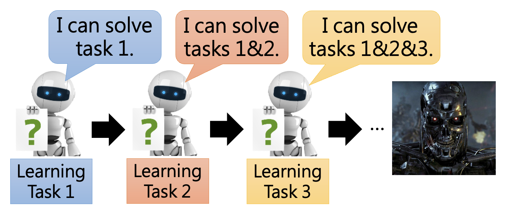

>注：在机器学习中，终身学习还有像 continue learning, never ending learning, incremental learning 等同义词。

在现实应用中，终身学习的流程大概如下图所示那样：

    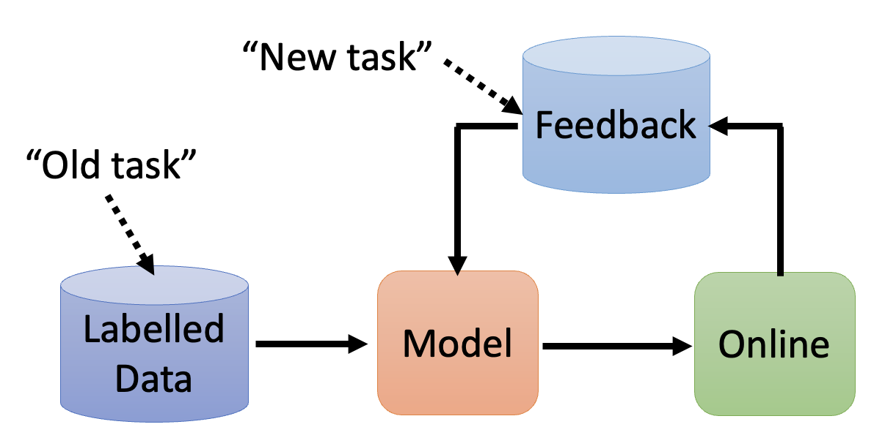

???+ example "例子"

    === "例1"

        假如现在让一个简单的模型（只有3层，每层50个神经元）来完成下面两个手写数字识别任务：

        

            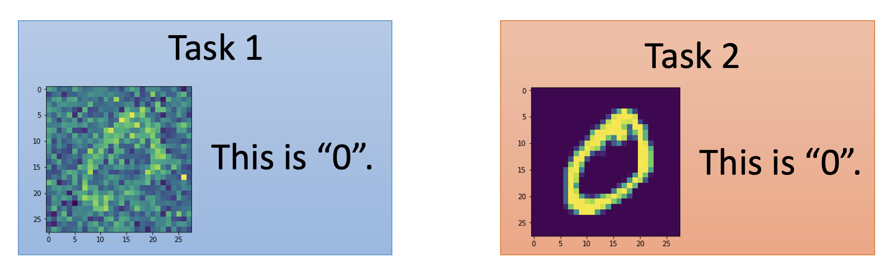
        

        如果先用任务1训练，再用任务2训练，得到的结果如下：

        

            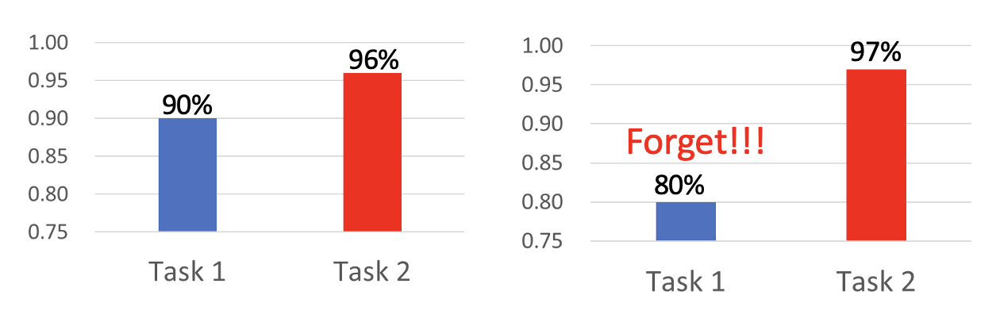
        

        可以看到，模型能够仅根据任务1的训练掌握了一定的完成任务2的能力，而且接着在任务2上训练能够继续提升该能力。但是在任务2上训练后，模型在任务1上的能力是明显下降的，说明模型对任务1有所“遗忘”。

        然而，如果让模型同时从任务1和任务2学习，那么模型能够在两个任务中同时取得不错的表现，这说明不是模型本身能力的不足，而是在一个接一个的训练中存在一些问题。

        

            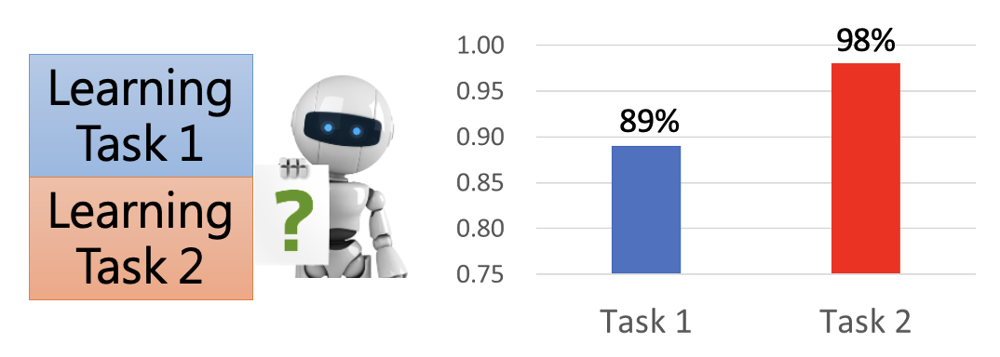
        
 

    === "例2"

        另一个例子是在 bAbi 语料库上训练一个 QA 模型，其中 bAbi 语料库包含了 20 个简单的 QA 任务，如下所示：

        

            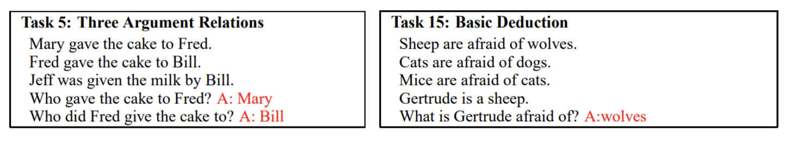
        
 

        如果是按任务顺序一个个来训练模型的话，模型在任务 5 上的准确率如下所示，可以看到只有在训练完任务 5 的那一刻，模型才能在任务 5 上取得较高的准确率，而无论在之前（没有训练过）还是之后（忘记了）准确率都很低。

        

            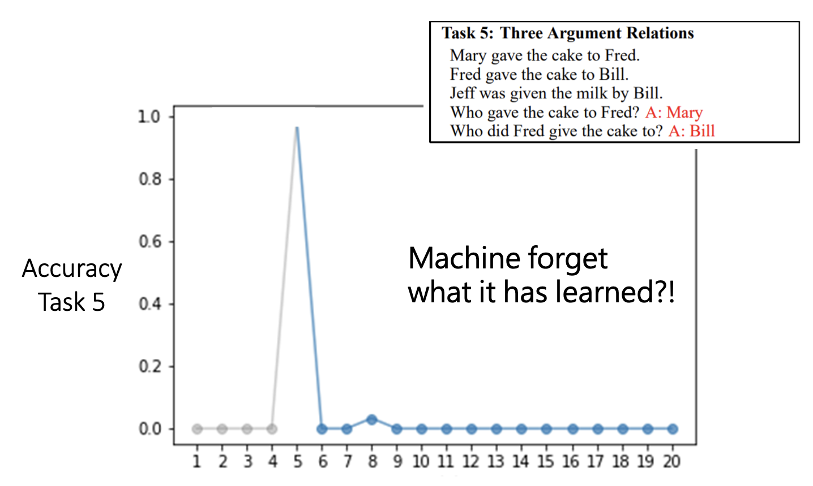
        

        但如果让模型同时在 20 个任务上进行训练的话，模型在每一个任务上的准确率基本都很高。

        

            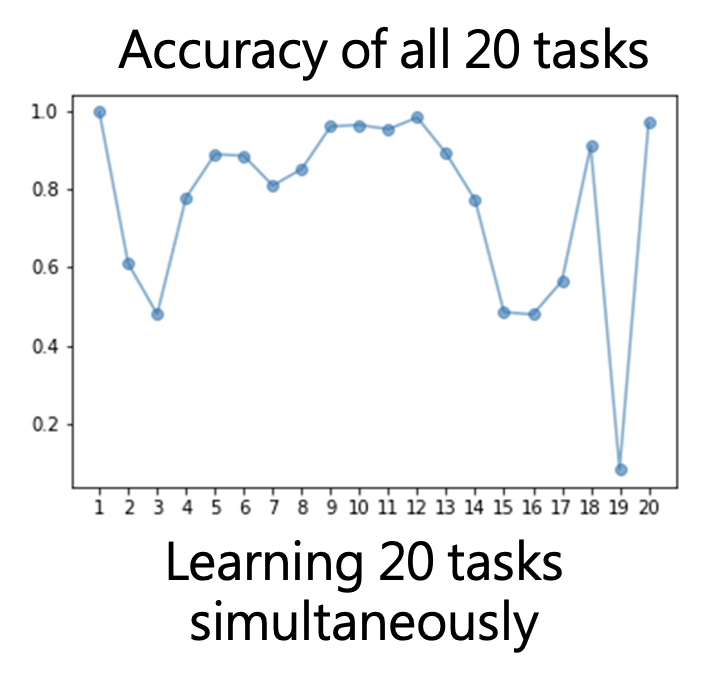
        

        这就说明了不是模型没能力学得更好，而是它没有做到这么好，正如孟子所说：“是不为也，非不能也。”

鉴于模型糟糕的记忆力，我们将这种现象称为**灾难性遗忘**(catastrophic forgetting)。

---
从前面的2个例子中不难发现，**多任务训练**(multi-task learning)比所谓的终身学习效果更好，那为什么不这么做呢？

    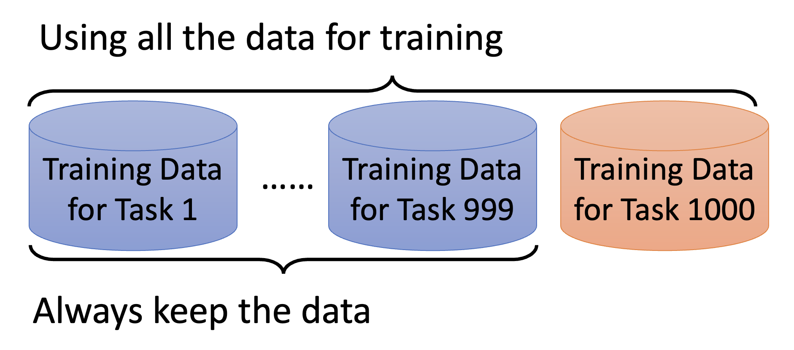

- 之前任务的数据都要保留下来，这会让存储空间变得更紧张
- 训练的时候要拿前面所有的数据一起训练，计算十分缓慢

不过由于多任务训练的效果更好，因此其结果常常作为终身学习的上界。

另一个思路是为每个任务训练不同的模型（“术业有专攻”）。

- 但每个模型都有各自的参数，也需要存储起来，一旦任务多起来后模型参数量就会很大，到最后也会更快耗尽存储空间。
- 还有一个问题是不同的模型无法迁移各自从不同任务中学到的知识，缺少“举一反三”的能力

    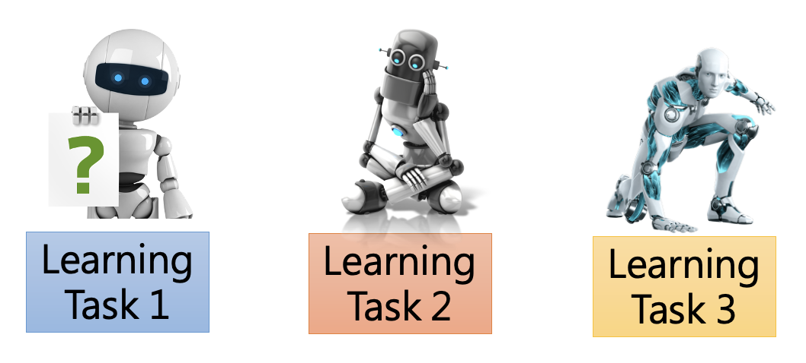

---
终身学习和**迁移学习**(transfer learning)的原理是差不多的，但最大的区别在于：

- 迁移学习要求在学完任务1后就能具备解决任务2的能力，至于机器之后还能不能完成任务1则不是我们要关心的
- 终身学习要求即便在学完任务2后，模型仍然具备完成任务1的能力

## Evaluation

在评估终身学习的效果前，我们需要准备好一个任务序列，比如：

    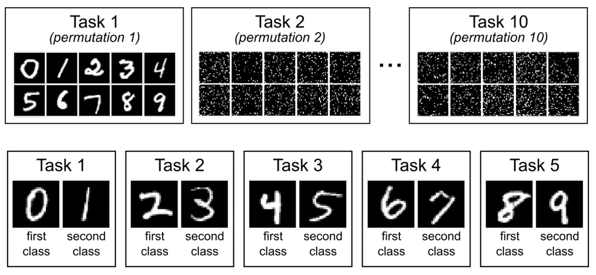

考虑更一般的情况：假如有 $T$ 个待训练的任务，我们绘制了一个 $(T + 1) \times (T + 1)$ 大小的表格，每个单元格 $R_{i, j}$ 代表在完成任务 $i$ 的训练后，模型在任务 $j$ 上的表现。

- $i > j$：$R_{i, j}$ 表明在训练完任务 $i$ 后模型是否忘了任务 $j$
- $i < j$：$R_{i, j}$ 表明模型是否能将任务 $i$ 的训练成果迁移到任务 $j$ 上

    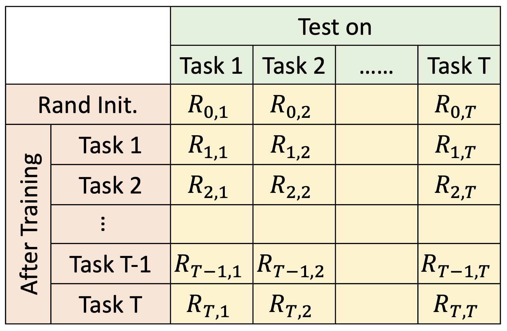

常见的评估方法有：

- 平均值：$\dfrac{1}{T} \sum\limits_{i=1}^T R_{T, i}$（仅看表格最后一行）
- **后向迁移**(backward transfer)：$\dfrac{1}{T-1} \sum\limits_{i=1}^{T-1} R_{T, i} - R_{i, i}$
    - 显然这个值通常为负（如果读者能找到让这个值为正的技术，那就很 nb 了）

    

        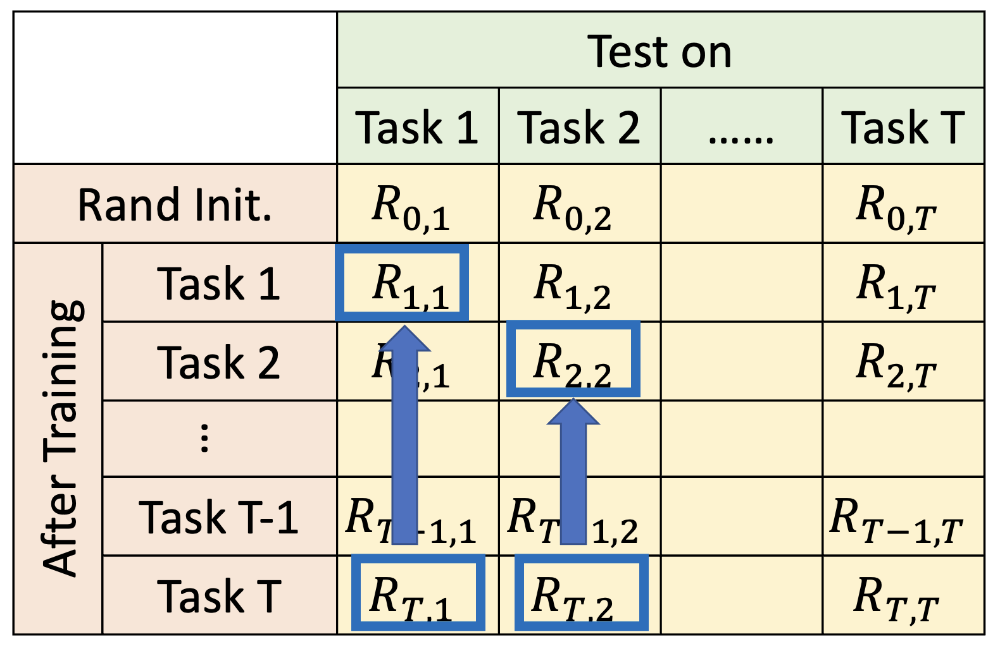
    

- **前向迁移**(forward transfer)：$\dfrac{1}{T-1} \sum\limits_{i=2}^{T} R_{i - 1, i} - R_{0, i}$

    

        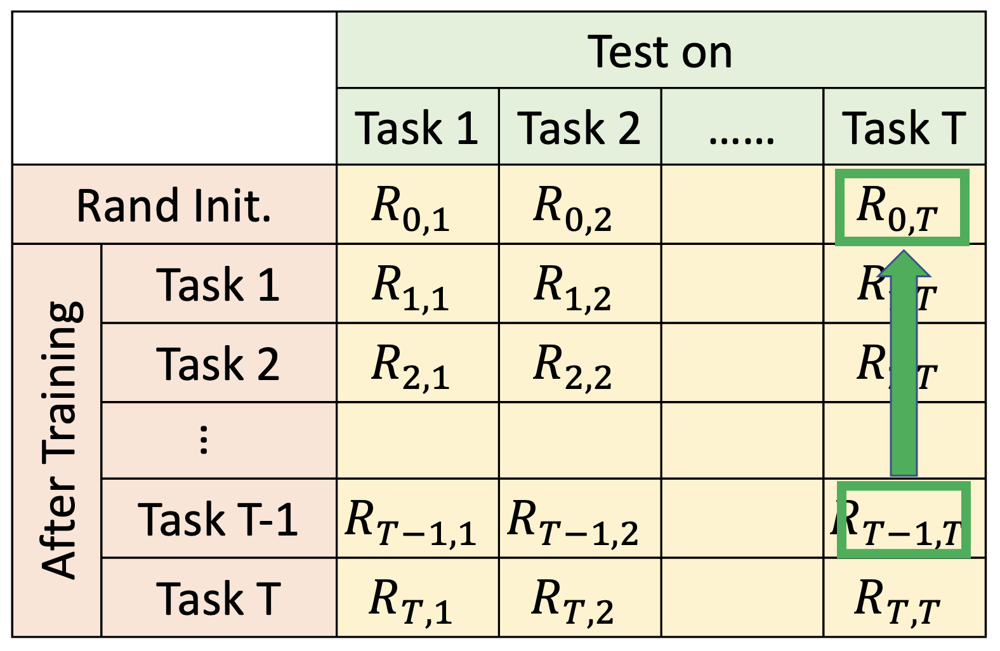
    

---
接下来将介绍三个常见的研究方向～

## Selective Synaptic Plasticity

先来看为什么会出现灾难性遗忘的现象。考虑一个很简单的例子：模型只有两个参数 $\theta_1, \theta_2$。在任务1中，初始参数为 $\bm{\theta}^0$，训练结束后参数为 $\bm{\theta}^b$。接着将在任务2上训练该模型（仍然沿用刚训练得到的参数），训练后得到参数 $\bm{\theta}^*$。这个时候就出现了一个问题：$\bm{\theta}^*$ 在任务1中并不是最优参数，甚至有可能让模型在任务1中表现很烂，也就是说模型忘记了它在任务1中习得的能力。

下图展示了模型在两个任务中的误差曲面，其中颜色越蓝表明损失越小：

    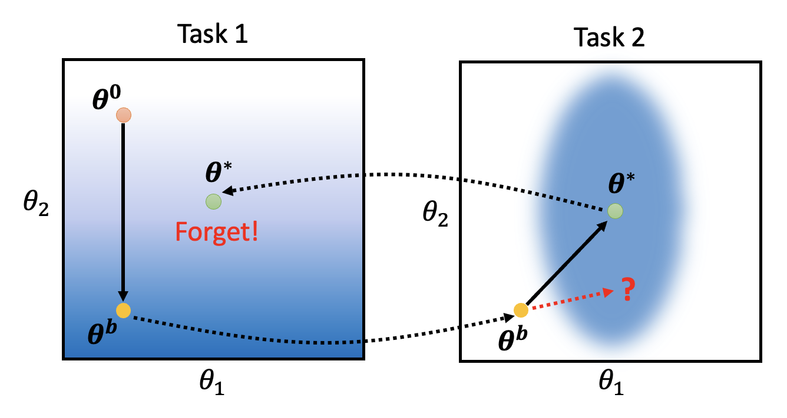

>要是模型在任务2的训练中能够沿红色虚线箭头前进，那么它就能保证其原来解决任务1的能力。

---
其中一个解决方案叫做**选择性突触可塑性**(selective synaptic plasticity)，它是一种基于正则化的方法(regularization-based approach)。它的基本思想是：只有部分参数对之前的任务来说是重要的，所以只需改变那些不重要的参数。假设 $\bm{\theta}^b$ 为模型从先前任务中习得的参数，并且令每个参数 $\theta^b_i$ 都有一个“守卫” $b_i$。那么重新定义损失函数为：

$$
L'(\bm{\theta}) = L(\bm{\theta}) + \lambda \sum\limits_i b_i (\theta_i - \theta_i^b)^2
$$

- $L'(\bm{\theta})$：将要被优化的损失
- $L(\bm{\theta})$：当前任务的损失
- $b_i$：“守卫”，反映第 $i$ 个参数的重要程度
- $\theta_i$：将要学习的参数
- $\theta_i^b$：从之前任务中习得的参数
- 因而 $\sum\limits_i b_i (\theta_i - \theta_i^b)^2$ 反映了 $\bm{\theta}, \bm{\theta}^b$ 之间在某个方向上要有多近
    - **灾难性遗忘**：若 $b_i = 0$，$\theta_i$ 没有任何约束（反正无论多大这项都没有影响）
    - **固执**(intransigence)：若 $b_i = \infty$，$\theta_i$ 和 $\theta_i^b$ 应当始终相等

那么接下来要讨论的问题是如何寻找合适的 $b_i$？下面仍然通过前面的例子来讲述大致的思路。假如已经在任务1上找到最优参数 $\bm{\theta}^b$。从这个点出发，沿 $\theta_1$ 方向看，损失没有太大的变化，说明这个参数不重要，是可以改变的，因而 $b_1$ 比较小；但沿 $\theta_2$ 方向看，损失变化明显，表明它是重要参数，$b_2$ 应当大一些。

    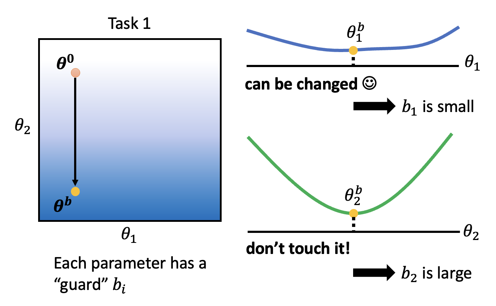

有了上面的发现后，在任务2上训练模型的时候就要有意地让模型尽可能沿 $\theta_1$ 方向变化而不是沿 $\theta_2$ 方向，这样模型可以兼顾两个任务上的能力。

    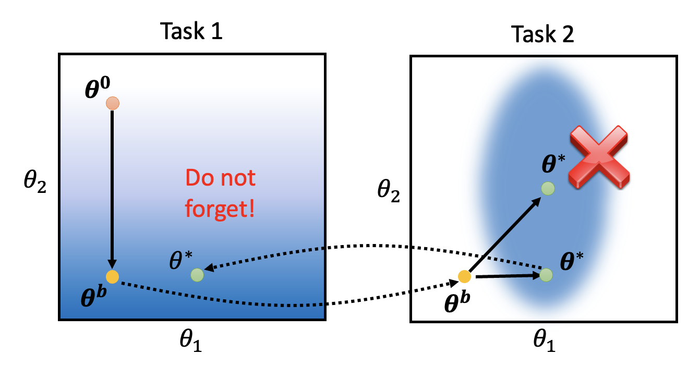

下面来看这种方法的效果。

- 蓝色曲线为 $b_i = 0$ 的情况（就是一般的梯度下降法）
    - 蓝色曲线随训练任务的继续，会逐渐遗忘解决先前任务的能力
- 绿色曲线为 $b_i = 1$ 的情况
    - 可以看到绿色曲线多数情况下处在偏下的准确率，说明它学习新本领的能力不足（有些“固执”）
- 红色曲线就用到了现在这种方法，虽然表现不一定是最好的，但是最稳定

    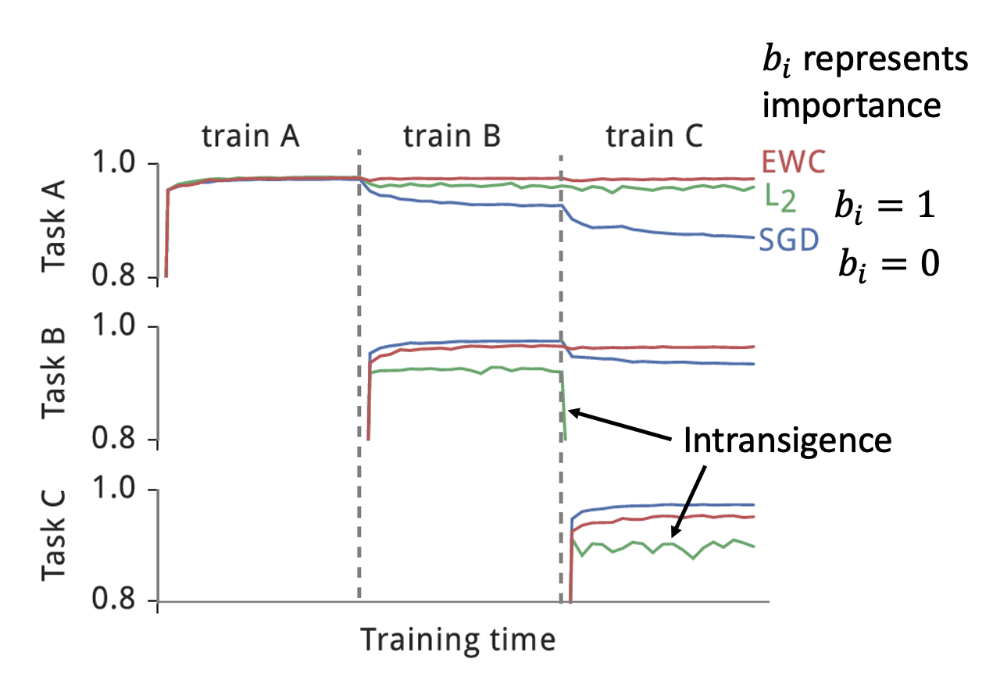

相关研究：

- [Elastic Weight Consolidation (EWC)](https://arxiv.org/abs/1612.00796)
    - 上面的实验结果来自这篇论文
- [Synaptic Intelligence (SI)](https://arxiv.org/abs/1703.04200)
- [Memory Aware Synapses (MAS)](https://arxiv.org/abs/1711.09601)
- [RWalk](https://arxiv.org/abs/1801.10112)
- [Sliced Cramer Preservation (SCP)](https://openreview.net/forum?id=BJge3TNKwH)

---
还有一种基于正则化的方法叫做[**梯度情景记忆**](https://arxiv.org/abs/1706.08840)(gradient episodic memory, GEM)，它的大致思路是让训练先前任务的梯度影响训练当前任务的梯度。但这种方法的问题在于它需要先前任务的数据，会占据更多空间。不过如果需要的数据量不大，那还是可以接受的。

    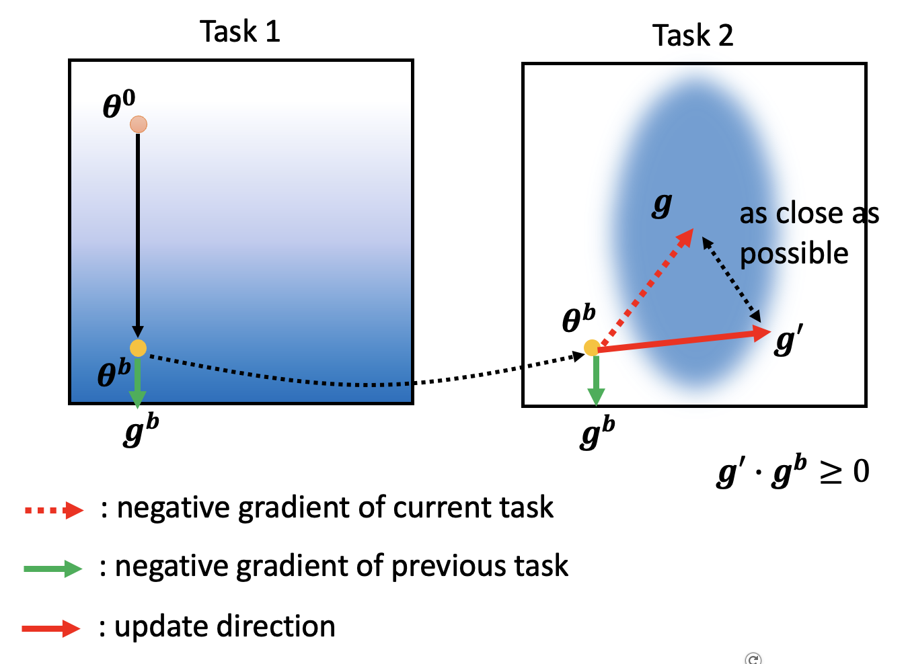

## Additional Neural Resource Allocation

第二个方向是尝试改变每个任务中对神经元的资源分配，具体有以下可行的做法：

- [渐进神经网络](https://arxiv.org/abs/1606.04671)(progressive neural network)：每多训练一个任务，就往原来的模型中增添更多的参数，并保留先前任务中训练得到的参数

    

        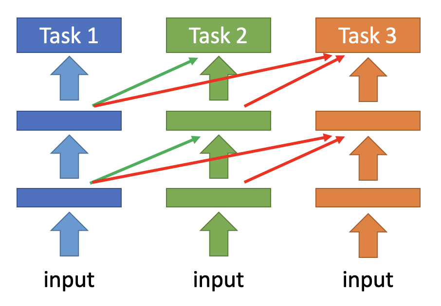
    

- [PackNet](https://arxiv.org/abs/1711.05769)

    

        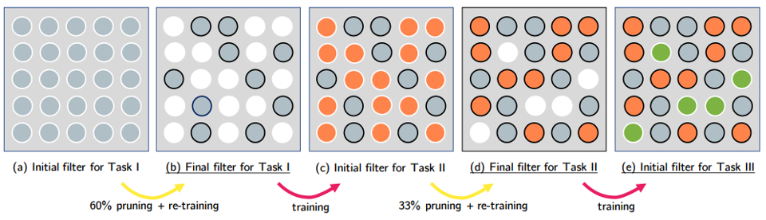
    

- [Compacting, Picking, and Growing (CPG)](https://arxiv.org/abs/1910.06562)

    

        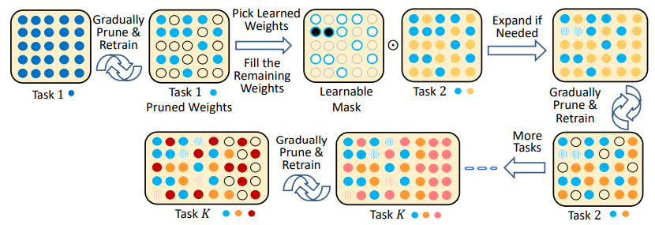
    

## Memory Replay

前面讲过，要是能集中所有任务的数据，那模型就不会出现灾难性遗忘的现象，但又规定不能保留先前任务的数据。我们可以从这个看似自相矛盾的要求中寻求一个平衡：额外训练一个生成模型（注意它也会占据一定空间），根据先前任务生成一些伪数据(pseudo-data)。这样模型就能从包含多个任务，但是量不大的伪数据中继续学到解决先前任务的能力了。

    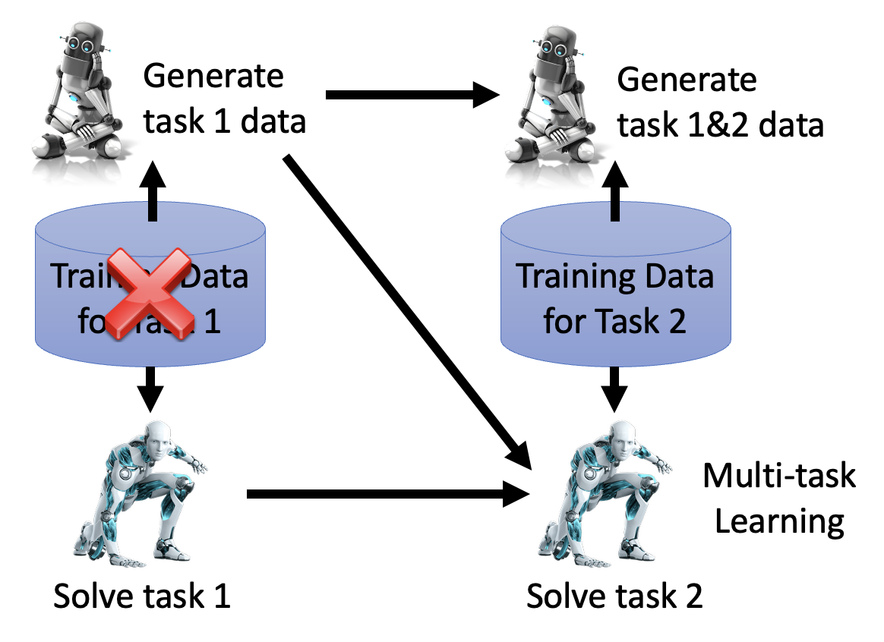

相关研究链接：

- https://arxiv.org/abs/1705.08690
- https://arxiv.org/abs/1711.10563
- https://arxiv.org/abs/1909.03329

## Others

前面介绍的模型过于简化，其中一个忽略的点是每个任务要求的分类数量可能是不同的（而我们默认是一样的），所以有以下研究专门解决这个问题：

- [Learning without forgetting (LwF)](https://arxiv.org/abs/1606.09282)

    

        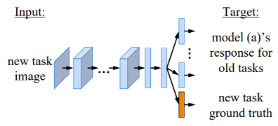
    

- [iCaRL: Incremental Classifier and Representation Learning](https://arxiv.org/abs/1611.07725)

    

        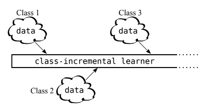
    

---
本讲只介绍了最简单的一类情况，其实还有两类更有挑战性的情况，感兴趣的读者可阅读论文 [*Three scenarios for continual learning*](https://arxiv.org/abs/1904.07734)。

---
也许读者已经注意到，任务的顺序对终身学习而言也是有不小影响的，有时可能因为任务顺序的改变，模型准确率就能有一些提升。

    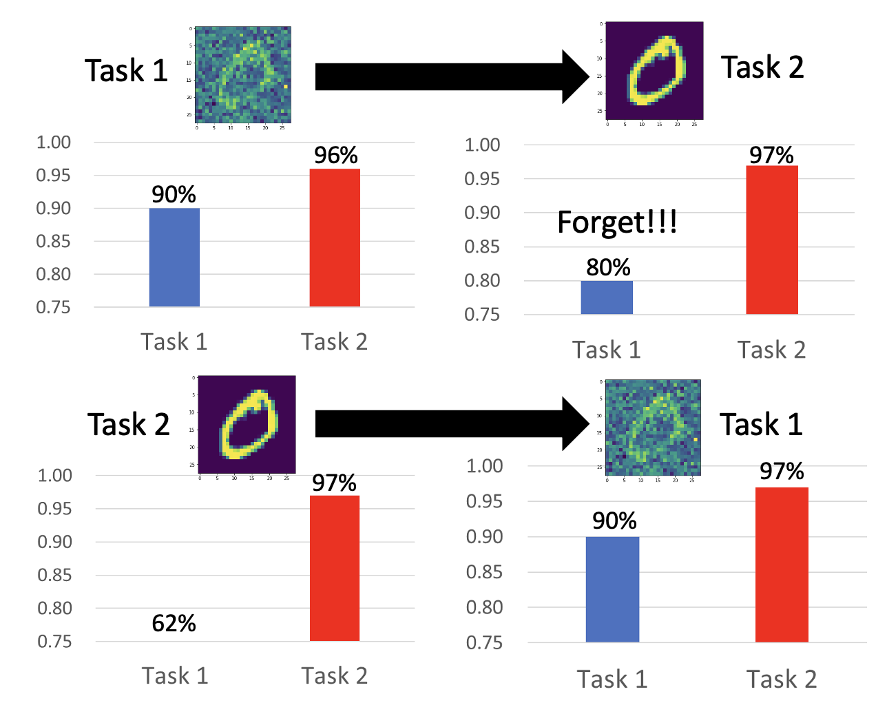

有关这一主题的研究叫做**课程学习**(curriculum learning)（~~什么鬼名字？~~）。