# Meta Learning

"meta" 在中文中叫做“元”，"meta-XX" 就是“元XX”，意思为“XX的XX”。因此本讲的主题“**元学习**”(meta learning)的意思为“学习的学习”——我们想让模型自己学会该如何学习，而无需靠人类手动设置超参数来学习。对我们来说，设置超参数是一件相当痛苦的事，尤其是在学校实验室的环境下（不能像企业那样有很多的 GPU），我们能够调整的超参数数量有限，而只有精心挑选过的超参数才能让模型达到令人满意的效果，否则就是“差之毫厘，失之千里”。

在正式介绍元学习前，可先简单回顾一下机器学习的三步骤（既可以参考下面折叠起来的内容，也可以阅读笔者前面的[笔记](1.md)）。

??? note "机器学习的流程"

    === "Step 1"

        

            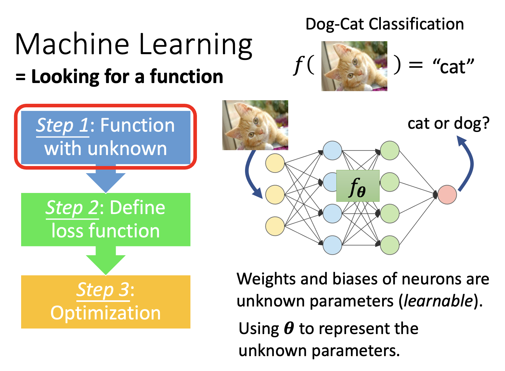
        

    === "Step 2"

        

            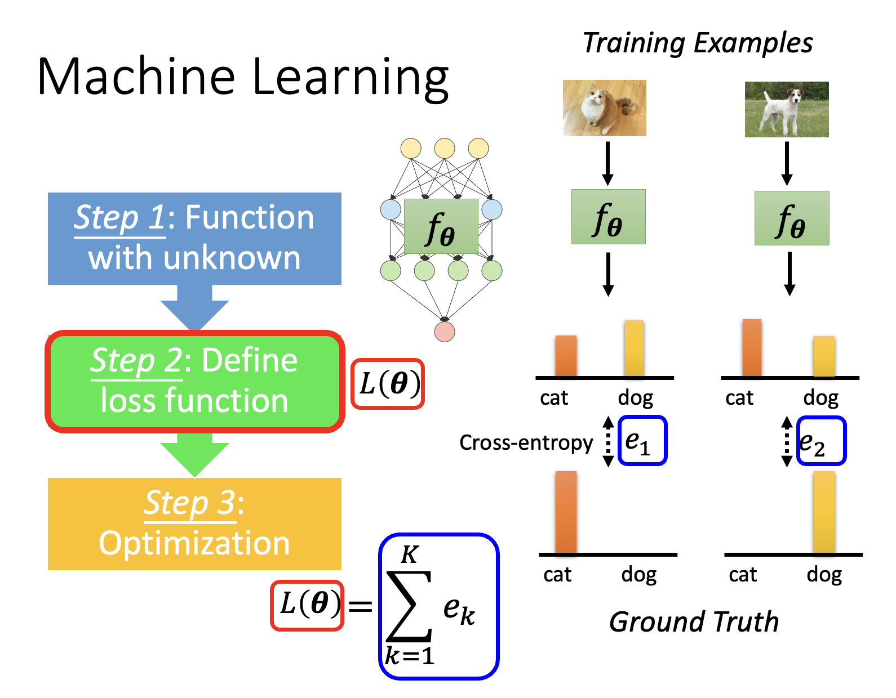
        

    === "Step 3"

        

            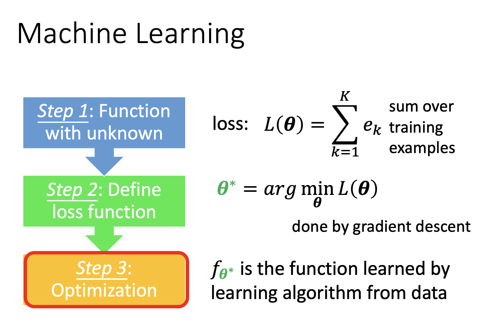
        

## Introduction

元学习的核心部分是一个**学习算法**(learning algorithm)，它是一个人为设定的，可以学习的函数，记作 $F$。它将整个数据集作为输入，输出一个分类器 $f^*$。测试的时候就将测试数据丢给分类器，期望分类器能做出正确的分类。

    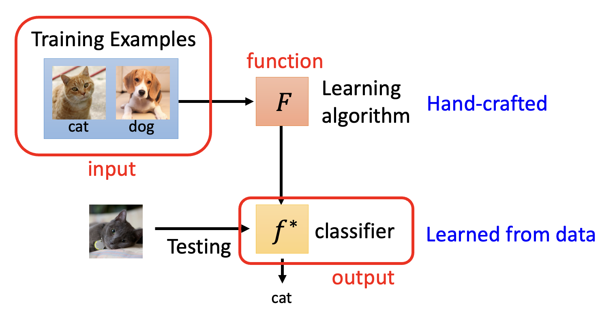

下面介绍该如何通过学习得到学习算法，其步骤也是和一般 ML 类似的三步：

1. 找出学习算法中可学习的(learnable)部分，包括：
    - 网络架构
    - 初始化参数
    - 学习速率
    - ...

    我们将要学习的部分记作 $\varphi$，因此原来的 $F$ 改写为 $F_\varphi$。之后我们就基于学习部分的不同对不同的元学习方法做分类。

2. 为学习算法 $F_\varphi$ 定义一个损失函数，记作 $L(\varphi)$。$L(\varphi)$ 值越低，表明学习算法越好。
    - $L(\varphi)$ 的计算需要考虑多个训练任务。

        

            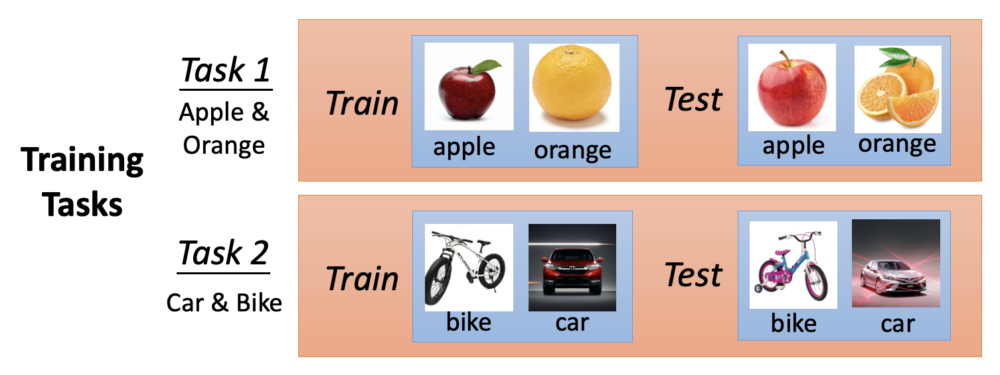
        

    - 假设在任务1上习得一个分类器，其参数记作 $\bm{\theta}^{1*}$。要想评估该分类器的表现好坏，需要评估这个分类器在测试集上的表现。记分类器的误差为 $l^1$（可通过计算交叉熵得到）。

        

            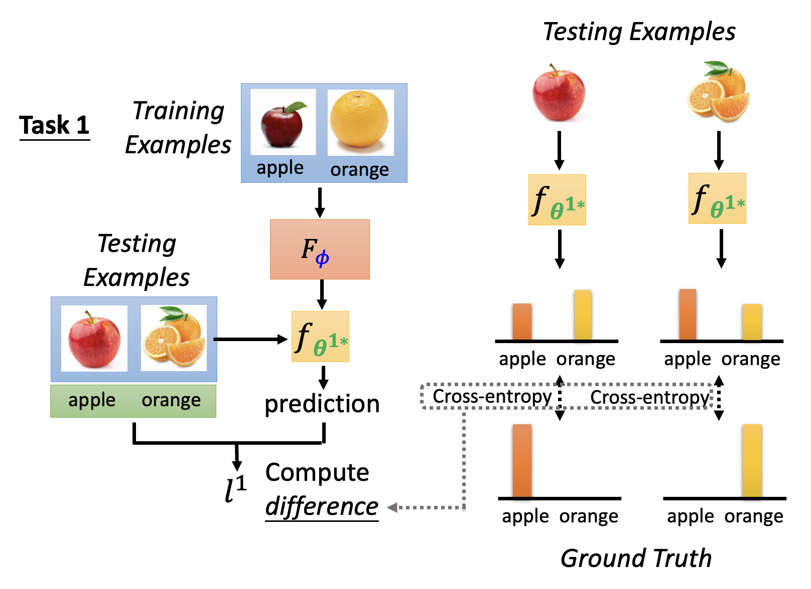
        

    - 由于有多个任务，每个任务都会有一个误差，因此 $L(\varphi)$ 就是这些误差的总和，即 $L = \sum\limits_{n=1}^N l^n$（$N$ 为训练任务总数）。

        

            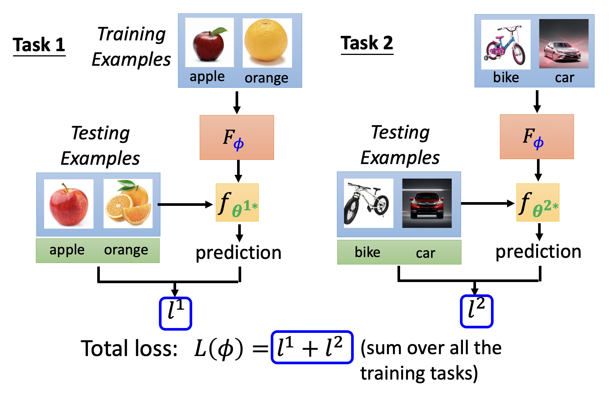
        

    - 注意到一般的 ML 是在**训练样例**上计算损失，但是在元学习中，损失是基于**测试样例**算出来的——但不要搞错，这里的“测试样例”是来自**训练任务**的测试样例（对应地还有“测试任务”的概念）。具体区别的阐释见下面一节。

3. 寻找使得 $L(\varphi)$ 最小化的参数 $\varphi$，即 $\varphi^* = \arg \min\limits_{\varphi} L(\varphi)$，这要求我们用已知的优化方法来寻找参数。
    - 若能计算 $\dfrac{\partial L(\varphi)}{\partial \varphi}$，那就直接用梯度下降法计算
    - 否则使用强化学习或进化算法硬做

下面总结一下元学习的整个框架：

    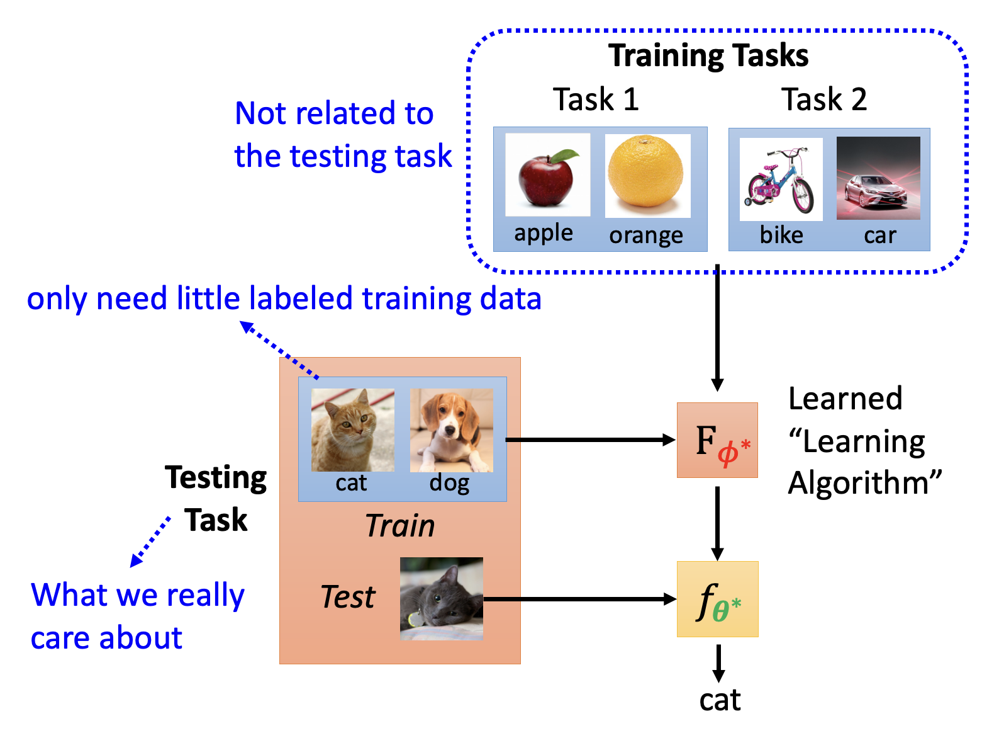

- 通过上述三个步骤，可以从多个训练任务中学出一个学习算法 $F_{\varphi^*}$
- 接着将测试任务中的训练数据丢给学习算法，让它生成一个分类器，再将测试任务中的测试数据丢给分类器，让它产生我们想要的分类结果
- 其中测试任务是我们真正关心的任务，而训练任务和测试任务是无关的
- 测试任务仅需少量标注好的训练数据（和**少样本学习**(few-shot learning)类似，而且这个概念常和元学习弄混淆，但两者还是有一定微妙的区别的）

## Machine Learning v.s. Meta Learning

前三小节介绍的是两者的区别，最后再介绍两者的相似之处。

### Goal

首先，从目标上看：

- 机器学习：寻找一个函数 f
- 元学习：寻找一个用于寻找一个函数 f 的函数 F

    

### Training and Testing on Data

其次，从训练数据上看：

- 机器学习是单任务的学习，称为**任务内训练**(within-task training)

    

        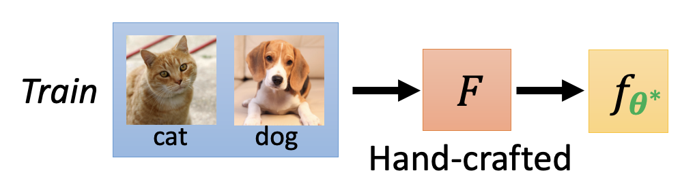
    

- 元学习是多任务（一组训练任务集）的学习，称为**跨任务训练**(across-task training)
    - 为避免混淆，我们称训练任务中的训练数据集为**支撑集**(support set)，称测试数据集为**查询集**(query set)

    

        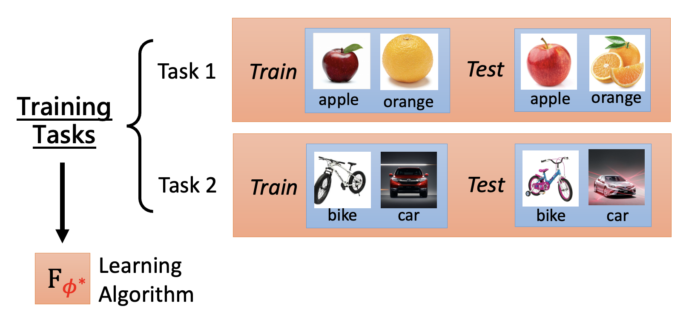
    

在文献中，跨任务训练和任务内训练分别被看作**外循环**(outer loop)和**内循环**(inner loop)，因为一个跨任务训练内会包含多个任务内训练。

相应地，在测试数据上也有**任务内测试**(within-task testing)和**跨任务测试**(across-task testing)的概念。

    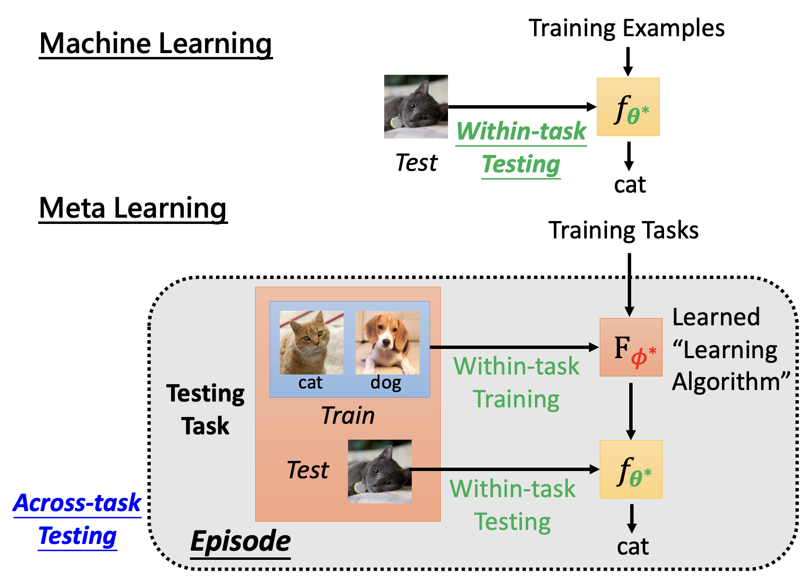

一个任务内训练 + 一个任务内测试 = **一集**(epsiode)

### Loss

再者，从损失函数的计算来看：

- 机器学习的损失函数计算了单个任务内多个训练样例的误差之和，即 $L(\bm{\theta}) = \sum\limits_{k=1}^K e_k$
- 元学习的损失函数则计算多个训练任务损失之和，即 $L(\varphi) = \sum\limits_{n=1}^N l^n$

### Similarities

元学习也具备一些和一般 ML 相似的特征，比如：

- 在训练任务上出现**过拟合**现象
- 需要更多的训练任务来提升表现
- **任务增强**(task augmentation)
- 在学习学习算法时也要调超参数（优化的时候更新 $\varphi$）
- 开发(development)任务

## What is Learnable in a Learning Algorithm?

先来简单回顾一下梯度下降法的大致流程（如果损失函数可微分的话，可直接用在元学习上）。

    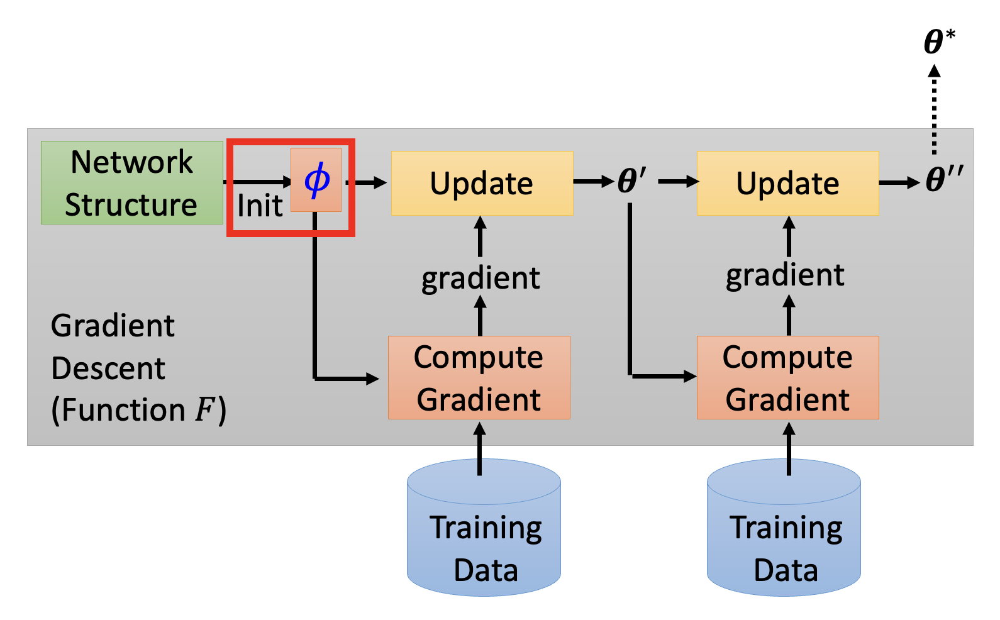

### MAML

第一个可学的地方是初始化的参数。其中最知名的方法之一是**模型无关的元学习**(model-agnostic meta-learning)，简称 **MAML**（发音和 mammal（哺乳动物）一样；有趣的是，这个研究的变体叫做 [Reptile](https://arxiv.org/abs/1803.02999)（爬行动物））。

由于原版的 MAML 是很难训练的，所以有人提出了一个叫做 MAML++ 的改进版（论文标题为 *How to train your MAML*）。从下面的实验数据中可以看出，训练效果确实得到显著提升。

    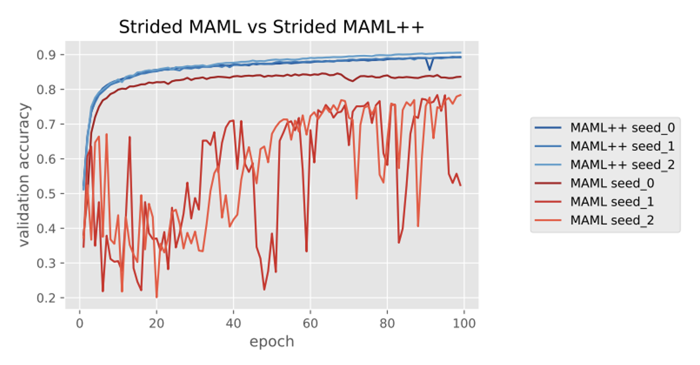

我们可以将 MAML 的工作和预训练进行比较，发现二者还是有一些相似之处的：

    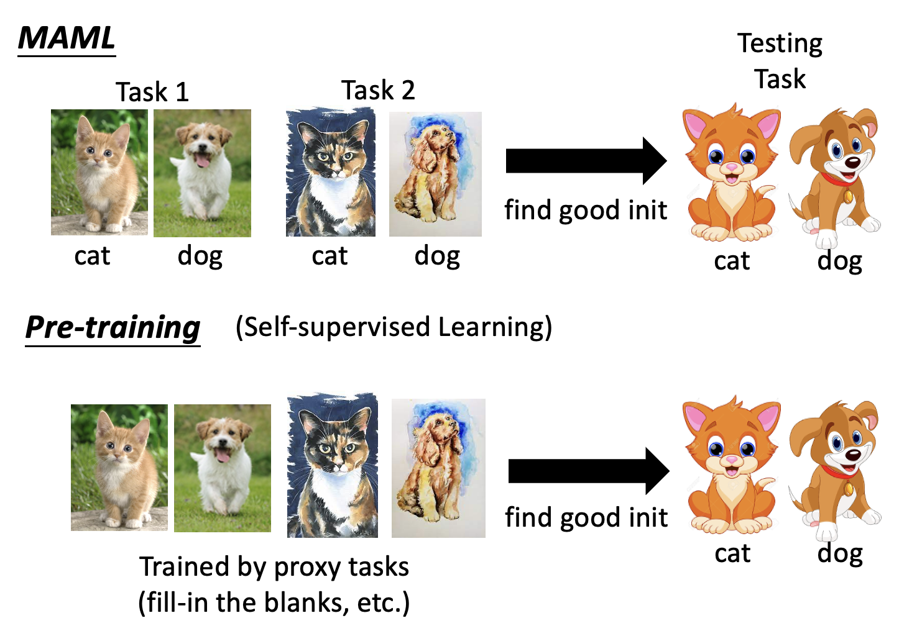

上图是以自监督学习为例的。对于更典型的情况，会用来自不同任务的数据来训练一个模型（所以这种方法称为**多任务学习**(multi-task learning)）。相比 MAML，由于多任务学习会将所有任务的资料倒在一起而不是分开来训练的，因此模型学起来会更难，其表现应为 MAML 表现的下界或基线(baseline)。

    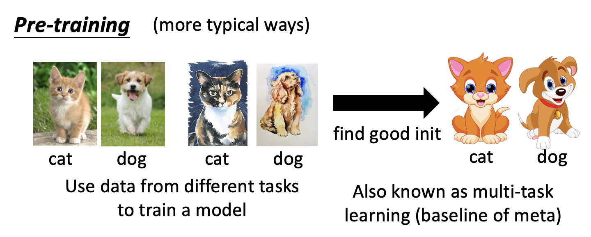

由于这里的训练任务和测试任务差别不是很大（都是对猫狗分类，不过图像画风不一致），所以这和[**域适应**](10.md)(domain adaptation)或**迁移学习**(transfer learning)有些像。

有一个叫做 ANIL(Almost No Inner Loop) 的研究指出，MAML 的表现之所以好，是因为 MAML 具有特征复用(feature reuse)的性质（右图），即 MAML 的初始参数就已经和每个任务中最好的参数比较接近了。

    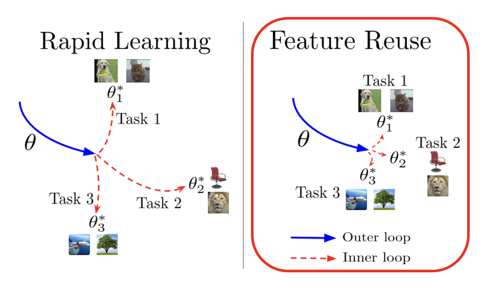

这里只是粗略地介绍了一下 MAML，更多内容详见下面的视频：

- [MAML v.s. Pre-training](https://youtu.be/vUwOA3SNb_E)
- [More mathematical details behind MAML](https://youtu.be/mxqzGwP_Qys)
- [First order MAML (FOMAML)](https://youtu.be/3z997JhL9Oo)
- [Reptile](https://youtu.be/9jJe2AD35P8)

### Optimizer

第二个可学的地方是优化器。早在 2016 年，就有人在研究这一点了（很有意思的论文标题：*Learning to learn by gradient descent by gradient descent*），下面是这个研究的实验结果：

    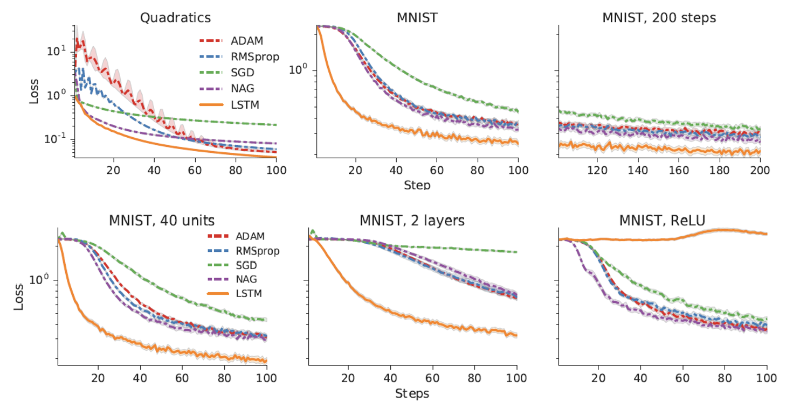

图中 LSTM 是元学习学出来的结果，可以看到在绝大多数情况下它由于其他的优化器。但如果将激活函数换成 ReLU（原来用的是 Sigmoid），LSTM 就训练不下去了。

### Network Architecture

第三个可学的地方是网络架构。显然，网络架构肯定不能直接微分，因此要用强化学习或进化算法来训练。

- 强化学习
    - 智能体采取一系列行动来决定网络架构，其中 $\varphi$ 为智能体的参数，而 $-L(\varphi)$ 为对应的奖励，训练的目标就是让它最大化
    - 一种知名的方法是**网络架构搜索**(network architecture search)，它的示意图如下：

        

            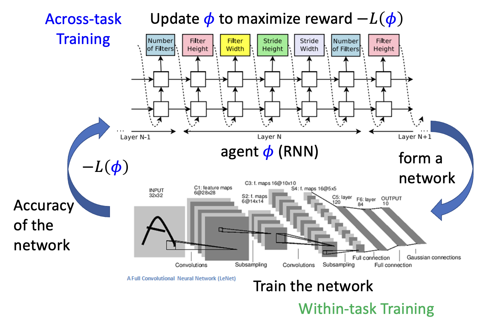
        

    - 相关研究：
        - Barret Zoph, et al., Neural Architecture Search with Reinforcement Learning, ICLR 2017
        - Barret Zoph, et al., Learning Transferable Architectures for Scalable Image Recognition, CVPR, 2018
        - Hieu Pham, et al., Efficient Neural Architecture Search via Parameter Sharing, ICML, 2018

- 进化算法
    - Esteban Real, et al., Large-Scale Evolution of Image Classifiers, ICML 2017
    - Esteban Real, et al., Regularized Evolution for Image Classifier Architecture Search, AAAI, 2019
    - Hanxiao Liu, et al., Hierarchical Representations for Efficient Architecture Search, ICLR, 2018

- DARTS（Hanxiao Liu, et al., DARTS: Differentiable Architecture Search, ICLR, 2019）：让网络变得可微分

    

        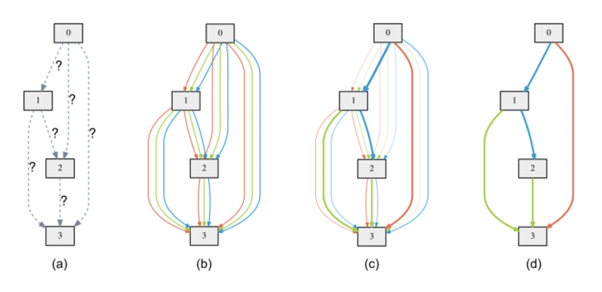
    

### Data Processing

第四个可学的地方是数据处理。具体方法有：

- **数据增强**(data augmentation)：让模型自己学会数据增强

    

        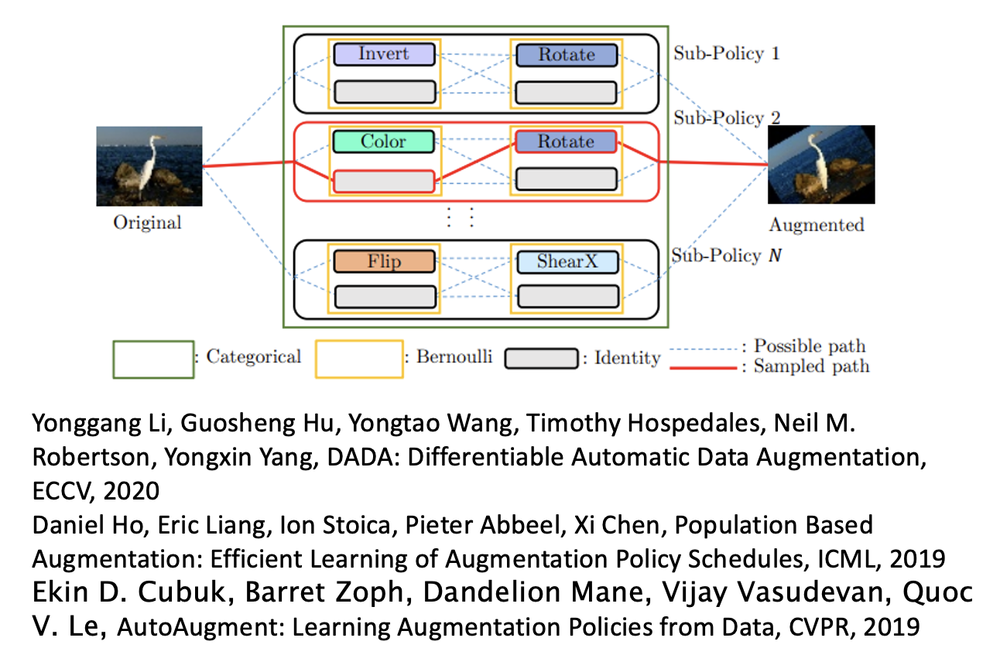
    

- **样本重加权**(sample reweighting)：
    - 有时为不同的样本给予不同的权重，那么就要采取不同的样本权重策略，比如有些样例距离边界特别近，是比较难学的那类样例，那么就让对应的权重大一些；又或者认为这种靠近边界的样例是一种“噪音”，应当为其赋予较小的权重。
    - 所以让模型通过学习，自行决定采用哪种策略

    

        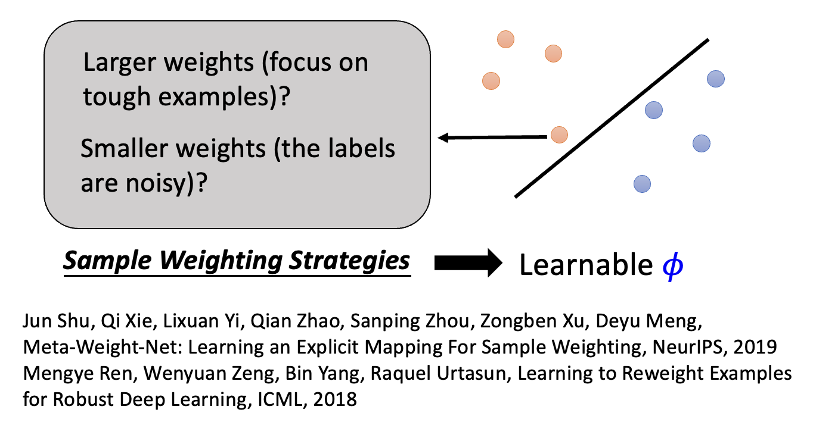
    

### Beyond Gradient Descent

我们甚至可以把整个网络看成元学习的参数 $\varphi$，也就是发明一个新的学习算法，而不采用梯度下降法。

    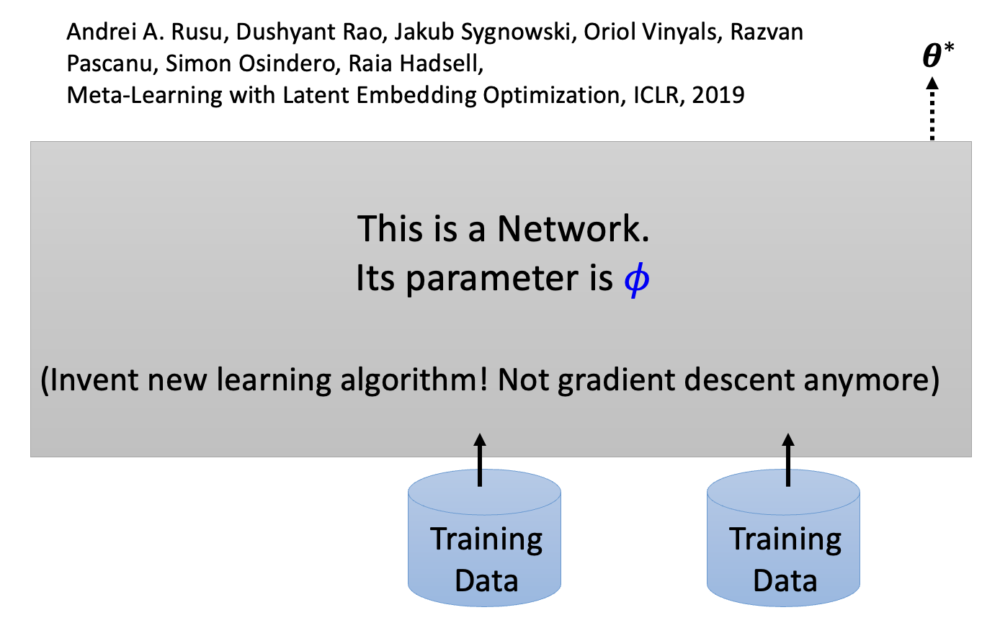

另外，到目前为止，我们还是分有训练和测试两个阶段——实际上可以把训练和测试包在同一个网络中。一种做法是将训练数据和测试数据一起作为网络的输入，输出关于测试数据的答案。有一系列的方法叫做**学会比较**(learning to compare)，又称基于指标的方法(metric-based approach)，它正是这样的元学习方法。

    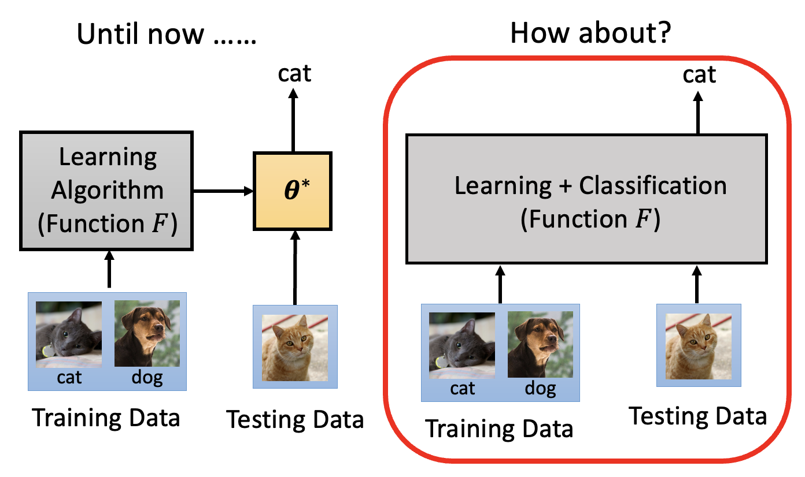

## Application

元学习的一个常见应用是**少样本图像分类**(few-shot image classification)。

    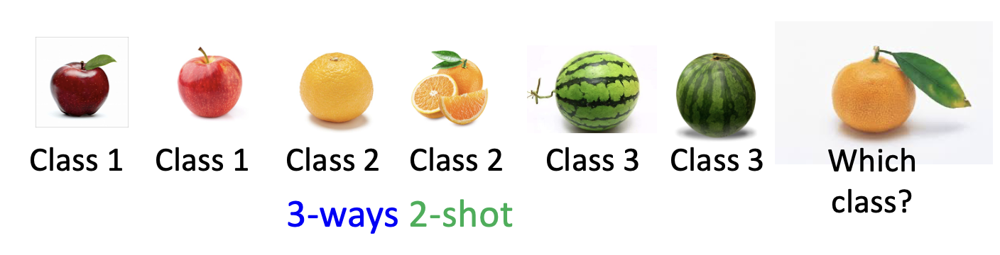

- 每个类仅有少量图像
- **N路K样本分类**(N-ways K-shot classification)：每个任务中有 N 个类和 K 个样例
- 在元学习中需要准备众多N路K样本任务作为训练和测试任务

其中一个著名的例子是 [Omniglot](https://github.com/brendenlake/omniglot)：包含 1623 个（~~奇异的~~）字符图像，每一类有 20 个样例。

    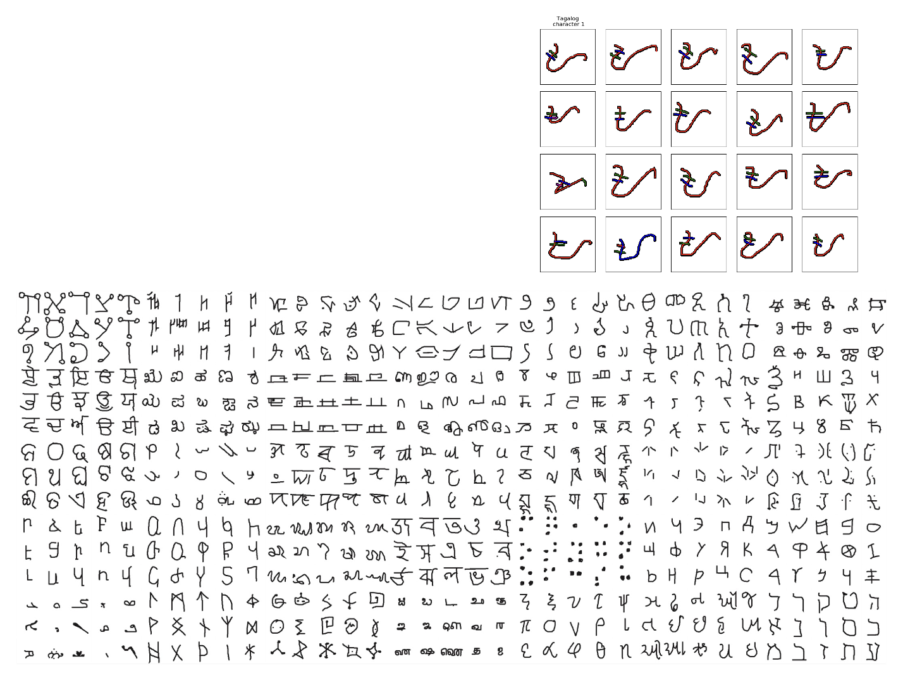

假如现在要让模型完成20路单样本分类任务，那么就要从每个类中挑选一个字符，得到 20 个字符作为训练数据集（支撑集），另外再从别的字符中挑一个作为测试数据集（查询集）。

    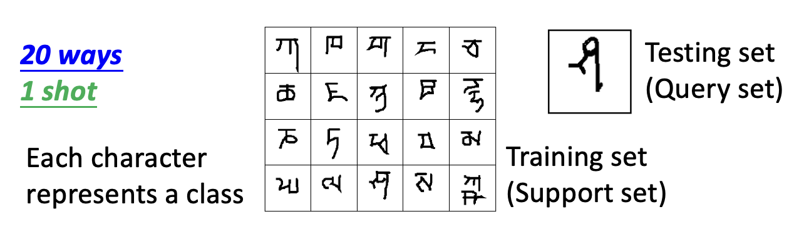

    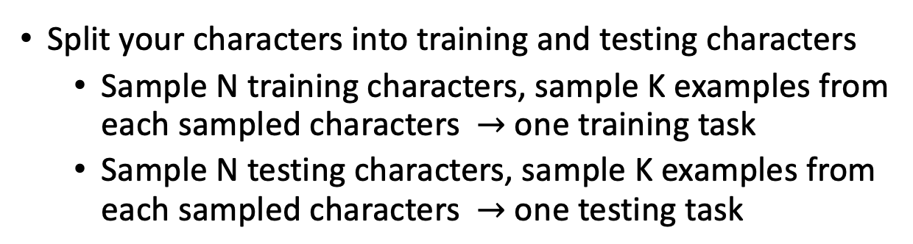

???+ abstract "元学习的各类应用"

    

        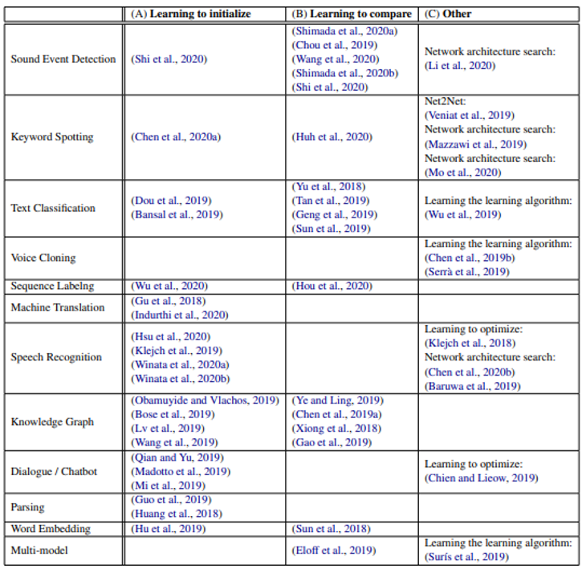
    

## Meta Learning v.s. Self-Supervised Learning

元学习和自监督学习的共同点在于它们都致力于寻找最好的初始化参数。

- 自监督学习：BERT 系列
- 元学习：MAML 系列

不过元学习有一个问题：以 MAML 为例，它在学习初始化参数 $\varphi$ 时需要用到梯度下降法，而在梯度下降法前也需要初始化参数（记作 $\varphi^0$），那么如何确定 $\varphi^0$ 呢？我们可以将 BERT 的参数作为 $\varphi^0$！

BERT 和 MAML 的结合堪称取长补短，相得益彰。

- BERT 的一个缺点是它对于不同的下游任务要有不同的（微调）目标（这种现象称为**学习鸿沟**(learning gap)）；而 MAML 一开始的目标就是要在训练任务上取得好的表现，那么很自然地它也能在测试任务上取得不错的成绩（如果训练有效的话）。
- MAML 也有缺点——它需要不少的训练任务，这些任务的数据需要人工标注，而且计算量大，因此成本可不小；而 BERT 训练时用到了大量未标注的数据，因此无需额外的标注工作。

下图展示了某个相关研究的实验结果，其中绿线对应 BERT 变体 + MAML 变体的表现，可以看到它比只用 BERT 变体表现更好。

    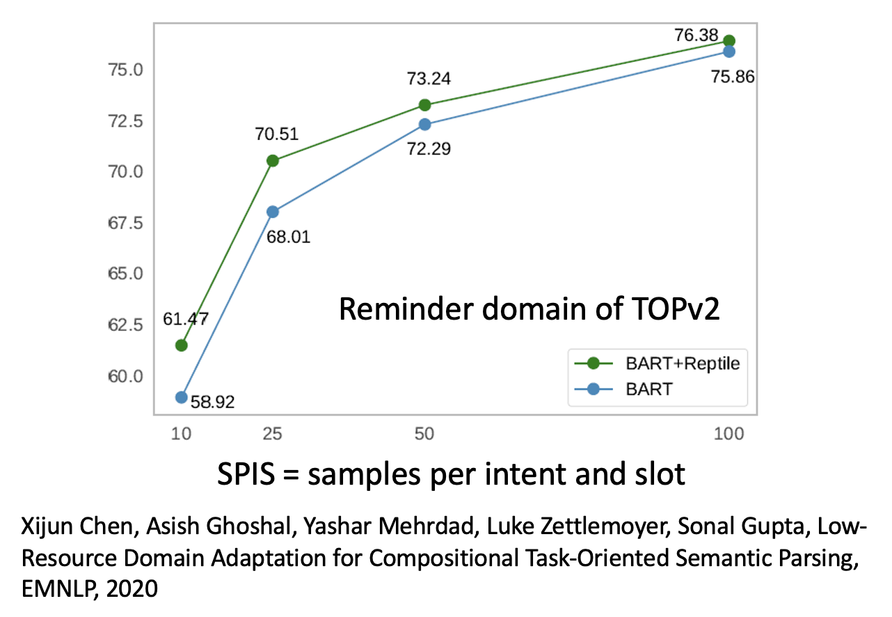

下表总结了相关文章以及用到的技术（由李宏毅老师整理，[论文链接](https://arxiv.org/abs/2205.01500)）：

    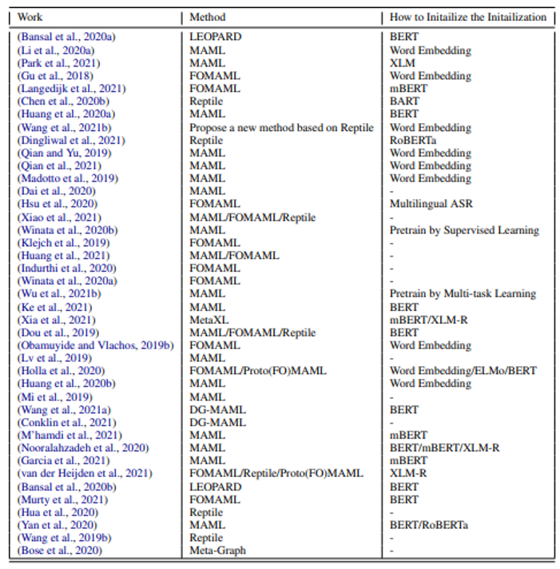

## Meta Learning v.s. Knowledge Distillation

在网络压缩一讲介绍[知识蒸馏](12.md#knowledge-distillation)的时候，我们忽略了一个问题：最好的老师网络“教”出来的学生网络一定是最好的吗？[研究](https://arxiv.org/abs/2202.07940)表明，答案是否定的。以表1为例，可以看到最好的老师是最后一个，但最好的学生是第1个老师教出来的。

    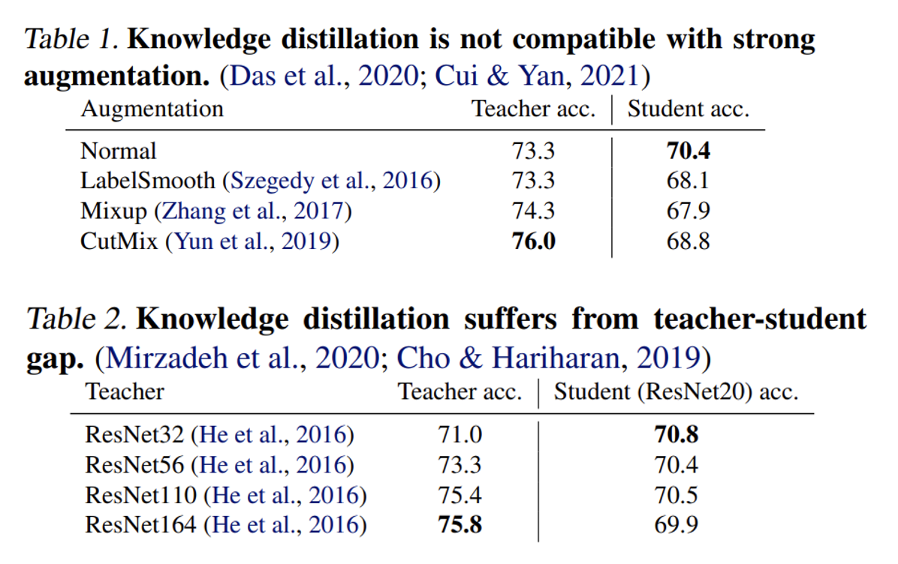

结合元学习，我们实现让老师网络自己学会如何教学生：老师网络更新的时候，不是要让自己的表现有多么好，而应该以学生表现的好坏作为目标，也就是说只有当学生在测试集上的失误率更低时，老师的网络参数才会更新。

    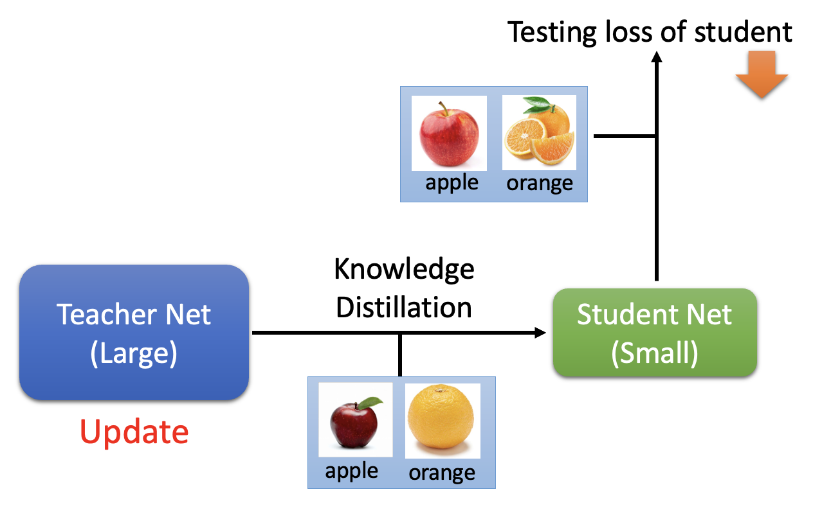

相关研究：

- Anguish Zhou, Canteen Xu, Julian McAuley, BERT Learns to Teach: Knowledge Distillation with Meta Learning, ACL, 2022
- Jiha Liu, Boxier Liu, Hong sheng Li, Yu Liu, Meta Knowledge Distillation, arrive, 2022

## Meta Learning v.s. Domain Generalization

稍微回忆一下：**域生成**(domain generalization)是[域适应](10.md)领域中的一种特殊情况，即模型无法得知目标域数据的情况。现在我们要将元学习用在这种情况上，对应的结构图如下：

    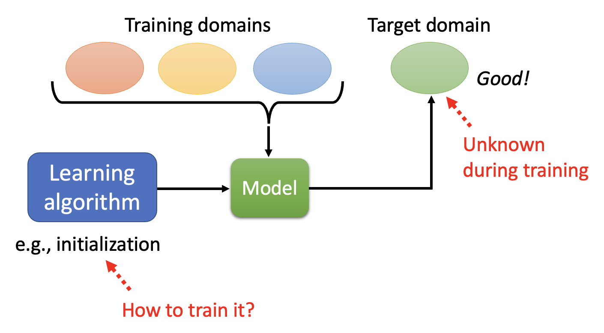

由于在训练时不知道目标域的数据，那我们可以想办法自己构造出一个“目标域数据”——从训练域中划出一部分数据作为假的目标域，模型训练时只参考未被划走的那部分数据，之后模型应当以在假的目标域上取得较好的表现为目标。

    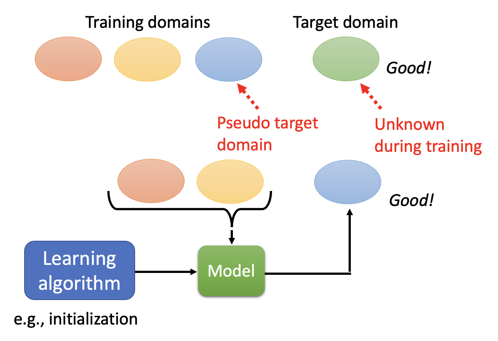

接着重新划分另一部分数据作为假的目标域，再次训练，直到所有训练域上的数据都充当过假的目标域数据。最后将这样训练出来的模型用在目标域上。

    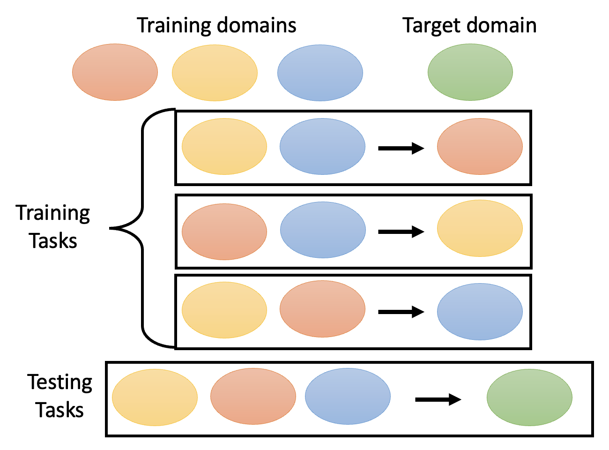

??? example "例子：文本分类"

    

        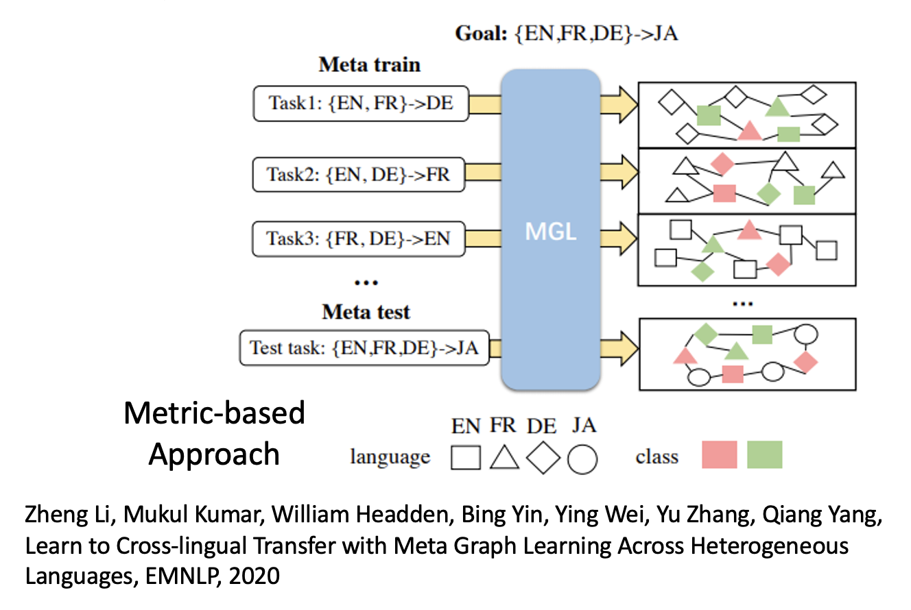
    

    其中 EN, FA, DE, JP 分别为英、法、德、日语，训练的目标是让模型仅从英、法、德语料中学到解决日语问题的能力。

---
下面换个角度看元学习和域适应的关系——域适应的特点是训练样例和测试样例可能有不同的分布，而元学习的特点是训练任务和测试任务可能有不同的分布，可见两者的相似性。所以元学习本身也需要域适应。

相关研究：Huaxin Yao, Langkawi Huang, Lijun Zhang, Ying Wei, Li Tian, James Zou, Jinzhou Huang, Zhenhua Li, Improving generalization in meta-learning via task augmentation, ICML, 2021

## Meta Learning v.s. Life-long Learning

这是基于正则化的终身学习原理图：

    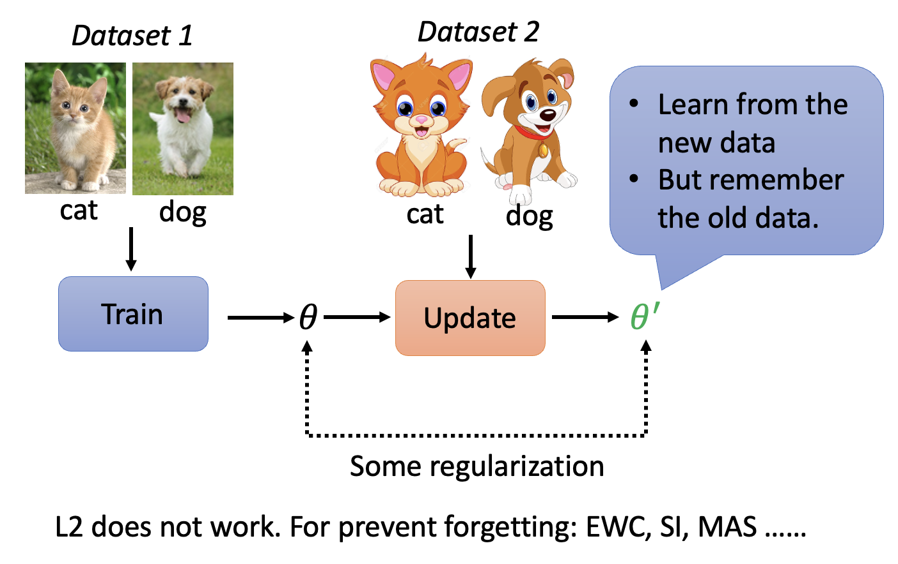

结合元学习后，模型就具备了能够自己学习该如何阻止灾难性遗忘的问题。

    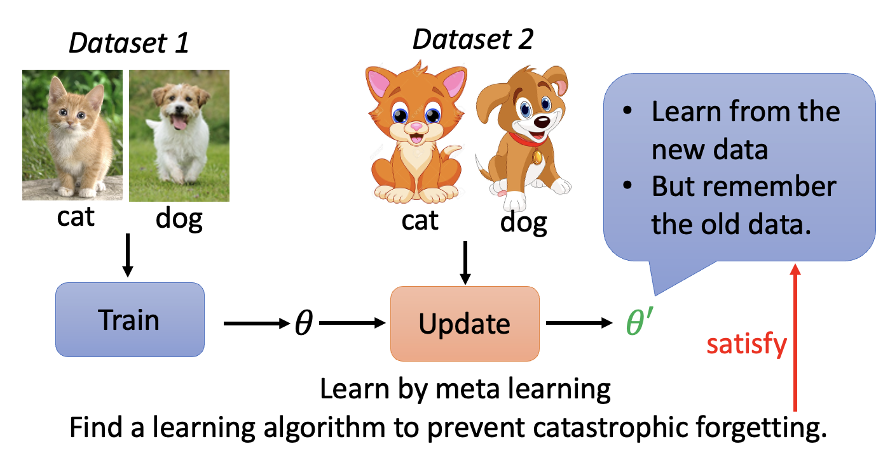

相关研究：

- Nicola De Cao, Wilker Aziz, Ivan Titov, Editing Factual Knowledge in Language Models, EMNLP, 2021
- Anton Sinisi, Vsevolod Pokorny, Dmitriy Pyrin, Sergei Popov, Artem Babenko, Editable Neural Networks, ICLR, 2020

---
虽然元学习能够为终身学习添一把力，但是元学习自身其实也面临相似的问题——灾难性遗忘！如下图所示，我们将终身学习和元学习的示意图放在一起对比，不难发现元学习中的学习算法也像终身学习的模型那样一个接一个地学习不同的训练任务，那么类似的遗忘问题也会同样存在。

    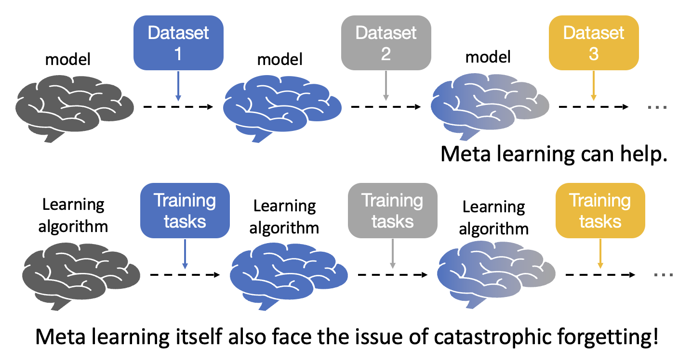

相关研究：

- Chelsea Finn, Aravind Rajeswaran, Sham Kakade, Sergey Levine, Online Meta-Learning, ICML, 2019
- Pouching Yap, Hippolyt Ritter, David Barber, Addressing Catastrophic Forgetting in Few-Shot Problems, ICML, 2021