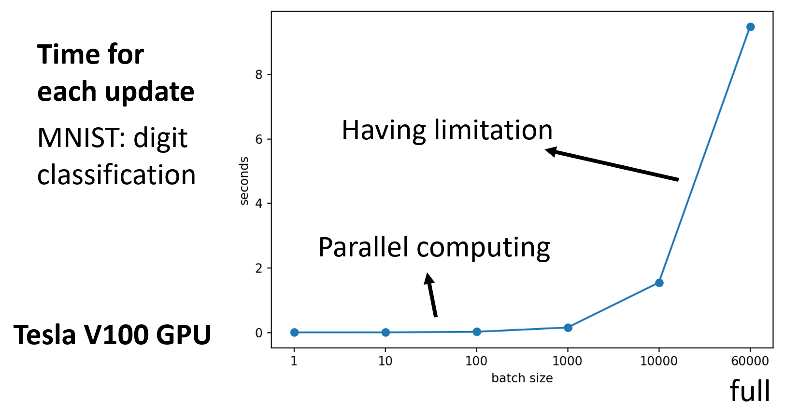
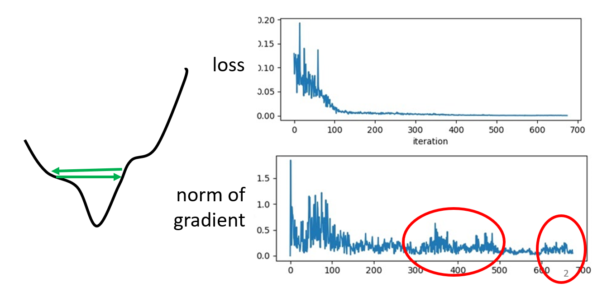
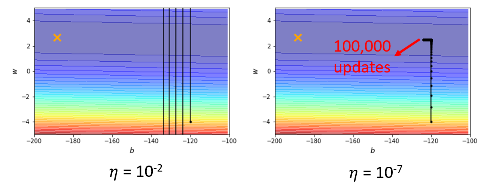
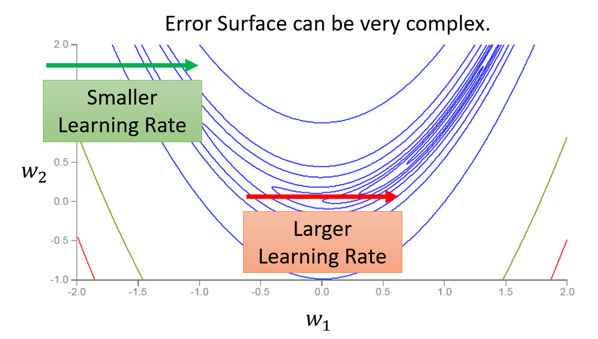

# Machine Learning - P2

## More Insight into Optimization

### Backpropogation

在机器学习中，未知参数 $\theta = \{w_1, w_2, \dots, b_1, b_2, \dots\}$ 通常会包含很多项。在使用梯度下降法时，每次都要对里面的每一项求偏微分；而且如果训练多次的话，计算量就会变得相当地大，因而效率就很低了。为了提高计算的效率，我们引入了一种新的计算技巧：**反向传播**(backpropogation)。

??? info "数学基础：偏微分的链式法则"

    - 情况1：若 $y = g(x), z = h(y)$

        $$
        \dfrac{dz}{dx} = \dfrac{dz}{dy} \dfrac{dy}{dx}
        $$

    - 情况2：若 $x = g(s), y = h(s) z = k(x, y)$

        $$
        \dfrac{dz}{ds} = \dfrac{\partial z}{\partial x} \dfrac{\partial x}{\partial s} + \dfrac{\partial z}{\partial y} \dfrac{\partial y}{\partial s}
        $$

记第 $n$ 项数据 $x^n$ 在神经网络中，训练得到的预测值 $y^n$ 与实际值 $\hat{y}^n$ 之差为 $C^n$，并且记损失 $L(\theta) = \sum\limits_{n=1}^n C^n(\theta)$（$N$ 项数据的误差和）。因此，对其中的一项参数 $w$ 求偏微分就是 $\dfrac{\partial L(\theta)}{\partial w} = \sum\limits_{n=1}^N \dfrac{\partial C^n(\theta)}{\partial w}$，这样我们将求梯度的问题从对损失 $L$ 求偏导转换为对每个数据对应的误差 $C^n$ 求偏导了。

现在考虑如何计算 $\dfrac{\partial C}{\partial w}$——根据链式法则，我们可以将其转化为 $\dfrac{\partial z}{\partial w} \dfrac{\partial C}{\partial z}$。其中这个 $z$ 是通过数据输入、权重和偏移计算得到的，如下图所示（简化版本）：

    

现在计算就被分为两部分了，这两部分同时也是反向传播的组成部分：

- **前递**(forward pass)：对所有的参数，计算 $\dfrac{\partial z}{\partial w}$
- **后递**(backward pass)：对所有的激活函数输入值 $z$，计算 $\dfrac{\partial C}{\partial z}$

其中前递的计算相当简单：$\dfrac{\partial z}{\partial w}$ 的值就是与权重相关联的输入数据，因此在训练的过程中，我们顺手就可以将这些值个计算出来。拿上图的例子来说，$\dfrac{\partial z}{\partial w_1} = x_1, \dfrac{\partial z}{\partial w_2} = x_2$。

??? example "例子"

    对于更多次的训练，道理也是一样简单。

    

        
    

难点在于计算后递，乍看上去好像无从下手。事实上，后递的计算又一次用到了链式法则：$\dfrac{\partial C}{\partial z} = \dfrac{\partial a}{\partial z} \dfrac{\partial C}{\partial a}$，其中 $a = \sigma(z)$（sigmoid 函数）。

- $\dfrac{\partial a}{\partial z} = \sigma'(z)$，因为我们直到 $z$ 的值（前面的计算中已经算过了），所以 $\sigma'(z)$ 就是一个常量

    ??? info "sigmoid 函数及其导函数的图像"

        

            
        

- $\dfrac{\partial C}{\partial a}$：又又一次用到链式法则，借助下图来理解这个过程：

    

        
    

    可以看到，$a$ 的值会影响到 $z', z''$，因此 $\dfrac{\partial C}{\partial a} = \dfrac{\partial z'}{\partial a} \dfrac{\partial C}{\partial z'} + \dfrac{\partial z''}{\partial a} \dfrac{\partial C}{\partial z''}$。其中 $\dfrac{\partial z'}{\partial a}, \dfrac{\partial z''}{\partial a}$ 的值很容易计算，就是对应的权重 $w_3, w_4$，而 $\dfrac{\partial C}{\partial z'}, \dfrac{\partial C}{\partial z''}$ 的值我们先暂时假设它们是已知量

总结一下：$\dfrac{\partial C}{\partial z} = \sigma'(z) \Big[w_3 \dfrac{\partial C}{\partial z'} + w_4 \dfrac{\partial C}{\partial z''}\Big]$。最后有待求解的就是刚才假设已知的那两个偏导数，这里我们分为两种情况讨论：

1. 如果它们位于最后一次的训练过程中（即在输出层中），那么：

    

        
    

    $$
    \dfrac{\partial C}{\partial z'} = \dfrac{\partial y_1}{\partial z'} \dfrac{\partial C}{\partial y_1}
    \quad
    \dfrac{\partial C}{\partial z''} = \dfrac{\partial y_2}{\partial z''} \dfrac{\partial C}{\partial y_2}
    $$

    这些量都是相当好计算的，所以结果自然就求出来了

2. 如果是在中间的训练过程中，那计算思路如下图所示：

    

        
    

    以 $z'$ 为例稍作解释：要求 $\dfrac{\partial C}{\partial z'}$，可以像求 $\dfrac{\partial C}{\partial z}$ 那样继续借助后面的计算值 $z_a, z_b$ 求解，连计算思路都是一样的。如此往复计算，直到计算到达输出层（即第一种情况时），我们可以依次往前计算前面所有的这些偏导数了！

事实上，在计算形如 $\dfrac{\partial C}{\partial z}$ 这类偏导数时，我们可以直接通过输出值 $y_1, y_2, \dots$ 按反方向计算，这也就是该算法名称的由来。

    

??? abstract "总结"

    

        
    

### Critical Points

在训练模型的时候，我们可能会遇到模型的损失无法进一步减小，也就是无法继续优化的情况。以梯度下降法为例，当**梯度接近0**的时候就会出现这种情况，如下图所示：

    

当梯度为0时，除了前面介绍过的**局部最小**(local minima)的情况，还有一种情况是位于**鞍点**(saddle point)：在某些方向上它是局部最小值，但是在另外的方向上它是局部最大值，因而可以逃脱局部最小值的困境。从形状看像一个马鞍，因而得名。我们将这两种情况统称为**关键点**(critical point)。

    

那么现在的问题是：已知梯度为0，我们该如何区分这属于哪一类关键点呢？这里就要用到一些微积分和线性代数的知识了。

首先要利用**泰勒级数**(Taylor Series)进行近似表示。假设某个参数下的损失为 $L(\bm{\theta})$，并且已知 $\bm{\theta}'$ 附近很小的一个范围内的有一个 $\bm{\theta}$，那么 $L(\bm{\theta})$ 可以被表示为：

$$
L(\bm{\theta}) = L(\bm{\theta}') + (\bm{\theta} - \bm{\theta}')^T \bm{g} + \dfrac{1}{2} (\bm{\theta} - \bm{\theta}')^T H (\bm{\theta} - \bm{\theta}')
$$

其中：

- **梯度** $\bm{g} = \nabla L(\bm{\theta}')$ 是一个向量，向量内元素 $\bm{g}_i = \dfrac{\partial L(\bm{\theta}')}{\partial \bm{\theta}_i}$
- [**黑塞矩阵**](https://en.wikipedia.org/wiki/Hessian_matrix)(Hessian matrix) $H$ 的元素为 $H_{ij} = \dfrac{\partial^2}{\partial \bm{\theta}_i \partial \bm{\theta}_j} L(\bm{\theta}')$

    

如果遇到关键点的话，$\bm{g} = 0$，那么中间项就可以消掉，只剩下：

$$
L(\bm{\theta}) = L(\bm{\theta}') + \dfrac{1}{2} (\bm{\theta} - \bm{\theta}')^T H (\bm{\theta} - \bm{\theta}')
$$

我们正是通过最后一项来判断关键点的类型。为了便于后续讲述，先令 $\bm{v}^T H \bm{v} = (\bm{\theta} - \bm{\theta}')^T H (\bm{\theta} - \bm{\theta}')$。对于所有的 $\bm{v}$，如果：

- $\bm{v}^T H \bm{v} > 0$，那么对于在 $\bm{\theta}'$ 附近的 $\bm{\theta}$，满足 $L(\bm{\theta}) > L(\bm{\theta}')$，因此这是一个**局部最小点**
    - 等价表述：当 $H$ 为**正定**(positive definite)矩阵，即所有特征值(eigen values)均为正数时，表明到达了局部最小点
- $\bm{v}^T H \bm{v} < 0$，那么对于在 $\bm{\theta}'$ 附近的 $\bm{\theta}$，满足 $L(\bm{\theta}) < L(\bm{\theta}')$，因此这是一个**局部最大点**
    - 等价表述：当 $H$ 为**负定**(negative definite)矩阵，即所有特征值均为负数时，表明到达了局部最大点
- 有时 $\bm{v}^T H \bm{v} > 0$，而有时 $\bm{v}^T H \bm{v} < 0$，那么这是一个**鞍点**
    - 等价表述：当 $H$ 的特征值有正有负时，表明到达了鞍点

    

??? example "例子"

    假设有一个很烂的模型 $y = w_1 w_2 x$，且已知训练数据 $(x, \hat{y}) = (1, 1)$（仅1组）。那么该模型的误差曲面(error surface)如下所示（图上已标出局部最小点和鞍点）：

    

        
    

    用 MSE 计算损失为：$L = (\hat{y} - w_1 w_2 x)^2 = (1 - w_1 w_2)^2$。然后计算每个参数关于损失的一阶和二阶微分，分别作为梯度和黑塞矩阵的元素：

    

        
    

    当 $w_1 = w_2 = 0$ 时，发现梯度为0，那么该点就是关键点。而且此时黑塞矩阵 $H = \begin{bmatrix} 0 & -2 \\ -2 & 0\end{bmatrix}$，特征值 $\lambda_1 = 2, \lambda_2 = -2$，因此可以判定该点为**鞍点**。

对于鞍点而言，黑塞矩阵除了能够用于判断外，还能为我们指示离开鞍点，即更新参数的方向。现在假设 $\bm{u}$ 是 $H$ 的一个特征向量，$\lambda$ 是 $u$的特征值，那么：

$$
\bm{u}^T H \bm{u} = \bm{u}^T (\lambda \bm{u}) = \lambda \|\bm{u}\|^2
$$

因此，如果 $\lambda < 0$ 的话，那么 $\bm{u}^T H \bm{u} < 0$。回到前面关于损失的泰勒展开式 $L(\bm{\theta}) = L(\bm{\theta}') + \dfrac{1}{2} (\bm{\theta} - \bm{\theta}')^T H (\bm{\theta} - \bm{\theta}')$，令 $\bm{u} = \bm{\theta} - \bm{\theta}'$，那么 $\bm{\theta} = \bm{\theta}' + \bm{u}$。由于此时 $L(\bm{\theta}) < L(\bm{\theta}')$，即 $\bm{\theta}'$ 位于局部最大点，那么从该点沿 $\bm{u}$ 的方向走的话，损失就会变小，从而离开局部最大点。总之，通过黑塞矩阵的特征向量，我们总能设法离开鞍点。

??? example "例子"

    接着前面的例子，第二个特征值为 $\lambda_2 = -2$，对应特征向量 $\bm{u} = \begin{bmatrix}1 \\ 1\end{bmatrix}$。只要沿着 $u$ 的方向更新参数，损失就会减小，如下面的误差曲面所示：

    

        
    

实践上，一般并不会实现这种方法，因为计算二次微分、特征值和特征向量等等运算太过复杂，效率不高。

---
那么鞍点和局部最小点这两种关键点，哪个更为常见呢？

    

可以看到，二维平面上的局部最小点，可能到三维乃至更高位的空间内就是一个鞍点，因为更多的维数意味着更多的逃离局部最小的可能。所以当参数足够多的时候，**鞍点**的数量可能相对更多一些。

事实上，上述理论有实践经验的支撑，如下图所示：

    

其中横轴表示**最小值比率**(minimum ratio)，即局部最小点在所有关键点中的占比，计算公式为：

$$
\text{Minimum ratio} = \dfrac{\text{Number of Positive Eigen values}}{\text{Number of Eigen values}}
$$

可以看到，当我们通过不断的训练将损失降得尽可能低时，最小值比率维持在0.5-0.6之间，也就是说始终没法达到真正的局部最小值（最小值比率 = 1），因此局部最小点在具体实现中属于罕见的情况。

### Batches

前面提到过，对于参数量很大的模型，会使用分**批**(batch)使用梯度下降法来更新参数，而不是一次性对所有参数求梯度。下面就通过对比更新小批量和大批量参数的效果，来说明为何需要分批更新。

假如模型有 N = 20 的参数，现提供两种（极端的）大小：大批的大小为 N，小批的大小为 1。下面通过误差曲面来分析两者的优化效果：

    

- 大批量：更新时间长（要处理 20 个参数），但是优化效果很好（powerful）
- 小批量：更新时间很短（1 次只更新 1 个参数），但是有很多噪点（noisy）

因此直接看貌似看不出两者有哪个能占据很大优势。其实上面只是做了理论层面的分析，实际上在机器学习中常常用到 GPU，而 GPU 的一大优势在于支持**并行计算**，因此我们得重新考虑时间上的估量了：

- 大批量并不意味着需要花更长的时间计算梯度（除非批量太大）

    

        
    

- 在一个时期(epoch)内，小批量反而需要花费更多的时间

    

        
    

尽管小批量在时间上并不占据太大的优势，但是它的强大之处在于能确保训练模型的精度，使模型具备更好的表现。

??? example "例子"

    

        
    

之所以大批量不好，并不是因为模型偏移或过拟合，而是优化上的不足：

    

- 对于大批量，尤其是全批量，未知参数关于损失的函数通常只有少数几条甚至一条，因此每次更新都顺着几乎既定的路径走。如果遇到了关键点，那么就很容易卡在那里不动了
- 对于小批量，由于每次只更新一小部分，因此会产生不同的损失函数。即使模型在优化的时候卡在某个损失函数上，只需更新一下，就跳到另一个损失函数，从而有很大概率避开了关键点

下面从另一个角度解释原因。对于训练数据上的损失函数，不同的局部最小点也有好坏之分，我们会认为狭窄的局部最小点是不利于测试的，而平坦的局部最小点相对而言比较好一些。如下图所示，假如训练数据上和测试数据上的损失函数有些错误匹配(mismatch)，那么局部最小点的好坏之分就表现得非常明显了：平坦的局部最小点在测试数据上没多大变动，而狭窄的局部最小点在测试数据上的损失就一下子变得很高。对于小批量而言，由于它的更新策略更具灵活性（noisy），因此它很容易跳脱这种狭窄的局部最小点；而对于大批量而言，它的行为有些“循规蹈矩”，因此很容易陷入狭窄的局部最小点而无法逃脱。所以通过小批量优化得到的模型表现会更好。

    

!!! abstract "总结"

    

        
    

    批量大小是一个**超参数**(hyperparameter)，我们可以根据需要进行手工调整。

??? "在线 vs 离线"

    我们可以将两种极端情况——一次只更新一笔数据（最小的批量），以及一次更新所有数据（最大的批量）分别对应两类算法：**在线**(off-line)和**离线**(on-line)，它们各自的用途为：

    - 在线：当内存空间有限时，我们可以采用此法
    - 离线：当内存空间足够时，且需要更简单的训练过程时，采用此法

    在之后的讨论中，我们默认采用离线算法。

### Momentum

在梯度下降法中，当梯度接近于0的时候，就会停在这些点上了。但是在物理世界中，即使某段路相当平坦（鞍点），甚至是一个小坑（局部最小点），由于物体具有惯性，因此还会继续移动，不会马上停下来。这给我们改进梯度下降法提供了一个不错的想法——引入**动量**(momentum)的概念，让之前的移动过程影响当下的移动过程，有助于摆脱局部最小的困境。

??? tip "对比"

    

        
    

    

        
    

在正式介绍该方法前，先来总结一下一般的梯度下降法，如下图所示。由于比较直观，这里就不再赘述了。

    

现在引入动量，那么每步的移动就是上一步的移动与当前梯度的差，具体来说：

- 令初始点为 $\bm{\theta}^0$，移动量 $\bm{m}^0 = 0$，梯度 $\bm{g}^0$
- 第一步移动 $\bm{m}^1 = \lambda \bm{m}^0 - \eta \bm{g}^0$，下一个目标点 $\bm{\theta}^1 = \bm{\theta}^0 + \bm{m}^1$，然后计算梯度 $\bm{g}^1$
- 第二步移动 $\bm{m}^2 = \lambda \bm{m}^1 - \eta \bm{g}^1$，下一个目标点 $\bm{\theta}^2 = \bm{\theta}^1 + \bm{m}^2$，然后计算梯度 $\bm{g}^2$
- 以此类推...

上述过程如下所示：

    

观察发现，第 $i$ 次移动量为前几次梯度 $\bm{g}^0, \bm{g}^1, \dots, \bm{g}^{i-1}$ 的加权和，比如：

$$
\begin{align}
\bm{m}^0 & = \bm{0} \notag \\
\bm{m}^1 & = - \eta \bm{g}^0 \notag \\
\bm{m}^2 & = -\lambda \eta \bm{g}^0 - \eta \bm{g}^1 \notag
\end{align}
$$

有了动量后，对于本节最开始提到的例子，现在的优化过程就可能像下图一样，不会被某些关键点给困住。

    

!!! note "注"

    梯度下降法 + 动量的优化方法一般简称为 **SGDM**。

### Adaptive Learning Rate

不少人会认为在训练过程中，如果模型无法得到进一步的优化（假定使用梯度下降法优化），那么应该是参数到达关键点附近的位置。然而，实际上并不一定是这种情况...

    

如上图所示，虽然损失值随着迭代次数的增加而逐渐减小，最终趋于稳定，但是梯度的模值仍然不断跳动，这就说明参数并不一定抵达关键点，而有可能出现了像左图所示的情况：由于每次迭代更新的步幅（学习速率）过大，导致参数点在“山坡”之间来回跳动，但此时的梯度值并不接近于0。接下来再看一个例子：

???+ example "例子"

    假如有一张凸(convex)的误差曲面，如下所示：

    

        
    

    下面是不同学习速率下模型的优化过程：

    

        
    

    - 如果学习速率过大，每次迭代更新的步幅就会很大，有些“刹不住车”，难以减小损失
    - 如果学习速率过小，每次迭代更新的步幅就会很小，因此当参数点到达了平缓的（梯度较小）区域时，更新速度就会变得很慢很慢，效率就太低了

综上，如果学习速率保持不变，就很难达到理想的优化效果。因此，不同的参数应当有不同的学习速率，以适应具体情况：

    

- 当参数在陡峭的误差曲面上的时候，学习速率应该变得更小
- 当参数在平坦的误差曲面上的时候，学习速率应该变得更大

!!! info "注"

    方便起见，在本节之后的分析中我们仅考虑参数集 $\bm{\theta}$ 的其中一个参数 $\theta_i$。

#### Adagrad

在原来的第 $t$ 次迭代优化中，参数更新的式子为：$\theta_i^{t+1} = \theta_i^t - \eta \bm{g}_i^t$，其中 $\bm{g}_i^t = \dfrac{\partial L}{\partial \bm{\theta}_i} \Big|_{\bm{\theta} = \bm{\theta}^t}$，此时的学习速率是固定的 $\eta$。为了让学习速率与参数有关，我们将迭代更新的式子转化为：

$$
\theta_i^{t+1} = \theta_i^t - \dfrac{\eta}{\sigma_i^t} \bm{g}_i^t
$$

其中 $\sigma_i^t$ 的值为前 $t$ 次（$0 \sim t - 1$）迭代的梯度的**均方根**(root mean square)，即：

$$
\sigma_i^t = \sqrt{\dfrac{1}{t+1}\sum\limits_{i=0}^t (\bm{g}_i^t)^2}
$$

实际上，这种优化方法称为 **Adagrad**。这样，对于不同的参数，便可以做到在梯度小的地方，迈的步子更大；在梯度大的地方，迈的步子更小。

    

#### RMSProp

??? question "Adagrad 的问题"

    === "问题1"

        然而，上述方法仍然有缺陷。对于更为复杂的误差曲面，即使是同一个参数，沿同一个方向（梯度）变化时，所经过的误差曲面有平坦的，也有陡峭的。上述方法在这种情况下仍然保持相同的学习速率，而这是不符合我们预期的。

        

            
        

    === "问题2"

        不难发现，Adagrad 在更新参数的时候会不断累积之前的梯度，那么如果在训练开始的时候，梯度就非常大的话，那么 $\sigma$ 也变得非常大，所以没走几步就走不下去了，影响到训练的效果了。

所以，接下来引入一种更好的优化方法，称为 **RMSProp**。它的迭代更新公式与 Adagrad 类似，区别在于 $\sigma_i^t$ 的公式发生了变化：

$$
\sigma_i^t = \sqrt{\alpha (\sigma_i^{t-1})^2 + (1 - \alpha)(\bm{g}_i^t)^2} 
$$

此时 $\sigma_i^t$ 的值不仅和当前的梯度有关，还受之前迭代的梯度的影响（可通过展开 $\sigma_i^t$ 发现）。此外，我们可以通过超参数 $\alpha \in (0, 1)$ 来调整 $\sigma_i^t$ 中 $\bm{g}_i^t$ 以及 $\sigma_i^{t-1}$ 的比例。如果 $\alpha$ 较小，那么当前梯度对 $\sigma_i^t$ 的影响更大，而之前的梯度影响更小。下图展现了使用 RMSProp 优化的大致效果：

    

#### Adam

将前面介绍过的动量方法与 RMSProp 结合起来，我们便可以得到一种很常用的优化方法，称为 **Adam**，其算法实现如下所示：

    

更新公式为：$\theta_i = \theta_{i-1} - \dfrac{\eta}{\sqrt{\hat{v_t}} + \varepsilon} \hat{m_t}$，其中：

- $\hat{m_t} = \dfrac{m_t}{1 - \beta_1^t} = \dfrac{\beta_1 m_{t-1} - (1 - \beta_1)g_{t-1}}{1 - \beta_1^t}$
    - 当 $t$（迭代次数）比较小的时候，$\hat{m_t}$ 会比较大，因为初始情况下不会有多少动量，所以需要适当增大，以避免在一开始就陷入关键点的情况出现；随着迭代次数的增加，$\hat{m_t}$ 会越来越小，趋于稳定
- $\hat{v_t} = \dfrac{v_t}{1 - \beta_2^t} = \dfrac{\beta_2 v_{t-1} + (1 - \beta_2)(g_{t-1})^2}{1 - \beta_2^t}$
    - 其设置也和 $\hat{m_t}$ 同理
- $\beta_1 = 0.9$
- $\beta_2 = 0.999$
- $\varepsilon = 10^{-8}$
    - 这些常数值是 Adam 的作者提出来的，通常不需要我们调整（~~调一下往往会得到更烂的结果~~）

!!! abstract "比较 SGDM 和 Adam"

    - 速度：Adam 更快
    - 收敛性：SGDM 的收敛效果更好，而 Adam 可能不收敛
    - 稳定性：SGDM 稳定，而 Adam 不稳定
    - 泛化障碍：SGDM 的泛化障碍更小
    - 适用场景：
        - SGDM：CV 领域，包括图像分类、分段(segmentation)、物体检测(object detection)等
        - Adam：NLP（问答、机器翻译、总结）、语音合成、GAN、强化学习等

#### Learning Rate Scheduling

回到前面提到过的凸误差曲面的例子，如果采用 Adagrad 方法的话，结果为：

    

可以看到，使用这种方法可以使模型获得最优的参数，但是在优化过程中会出现红圈所示的一些“爆炸”的情况。这是因为刚开始的时候沿竖直方向的梯度很大，但后来梯度变得很小（来到了平坦的区域）；而 $\sigma_i^t$ 会计算之前迭代过程中计算的所有梯度值，所以在平坦区域时，$\sigma_i^t$ 会累积一些沿竖直方向很小的梯度，那么有的时候学习速率就会变得很大，因此就会一下子“飞出去”，偏离预期更新的路径。

但是该优化方法有办法修正这一偏离，因为当偏出去后，梯度就会变大，那么学习速率就会减小（好比有股“摩擦力”），于是就又慢慢回到正轨了。

这样的优化并不完美，还有改进的空间，使其不会出现这么多的偏离现象，具体做法是使用一种叫做**学习速率调度**(learning rate scheduling)的方法，让学习速率不仅随梯度（空间）变化，还随**迭代次数**（时间）的变化而变化（下面记第 $t$ 次迭代的学习速率为 $\eta^t$）。这里介绍两种不同的方法：

- **学习速率衰减**(learning rate decay)：由于随着训练的深入，模型逐渐靠近最合适的参数目标，因此学习速率会随迭代次数的增加而下降，如下图所示：

    

        
    

    在上面的凸误差曲面的例子中，采用该方法后的优化过程为：

    

        
    

    现在的优化过程变得非常“丝滑”了~

- **热身**(warm up)：随着迭代次数的增加，学习速率先增后减

    

        
    

    之所以这样设定，是因为在训练刚开始的时候，还不清楚具体的误差曲面应该长什么样子，此时得到的 $\sigma_i^t$ 就有可能偏离过大，因而需要更小的学习速率以降低影响。而随着训练的进行，会逐渐摸清楚误差曲面大致的样子，因此学习速率会逐渐上升。

    - 残差神经网络和 Transformer 都提到了这种方法
    - RAdam -> Adam + 热身

!!! abstract "总结"

    结合前面提到的各种改进优化的技巧，可以得到以下式子：

    

        
    

    $\sigma_i^t$ 和 $\bm{m}_i^t$ 都与前面的梯度有关，但是一个在分母，一个在分子上。然而这并不意味着两者的效果会相互抵消，因为前者是标量，只影响学习速率的大小；而后者是向量，需要考虑方向，因此两者无法完全抵消。

### Other Optimizer

现在的优化器大多数可以分为 SGD 和 Adam 两大阵营：

    

- SWATS 同时利用了 SGD 和 Adam
- Lookahead 是一个堆所有优化器都适用的包装器(wrapper)，大致思路是每向前走 k 步就向后退 1 步，这样的好处是更稳定，且具备更好的泛化能力

遗憾的是，世界上没有一种通用的优化器，还需后人不断地探索出更棒的优化器！

## Classfication

前面介绍的机器学习研究的都是**回归**(regression)问题，即模型根据输入数据集，输出单个标量 $y$，并于真实值（标签）$\hat{y}$ 比较。现在我们来探讨**分类**(classification)问题，它与回归的不同在于：模型会从多个选项（称为类别(classes)）中挑选一个作为输出。

那我们是否可以将分类问题转化为回归问题呢？因为输出的都是单个量，那么也许可以尝试用单个标量表示挑选出来的类别；并且规定每个选项都用一个数值表示，便于将输出 $y$ 与标签 $\hat{y}$ 比较。然而，这样会带来一个明显的问题：类别之间的关系可不像数值之间的大小这么直接，也许类别之间的关系很复杂，也许压根没有关系，那么 $\hat{y} - y$ 也就无法准确表示输出类别与真实类别之间的关系，所以这不是一个好方法。

实际上，我们采用**独热向量**(one-hot vector)来表示每个类别。独热向量的特点是：向量里面的元素只有0和1，而且只有其中一位是1，其余位均为0。对于任意两个不同类别的独热向量，它们值为1的元素是不同的。这种方法的好处在于：任意不同两个类别之间的区别是一致的，因为它们对应的独热向量之间的距离是一样的，这样便于输出类别与真实类别的比较。

    

因为向量里面包含多个标量，那么模型就要从输出单个值转变为输出多个值，因此需要稍微改变一下模型的样子，如下所示：

    

重点关注输出部分的改变。以上图为例，现在的输出由 $y_1, y_2, y_3$ 三部分构成，每个输出都有各自不同的权重和偏移，但接收的都是来自激活函数的输出。

现在来比对一下回归和分类两类问题对应的模型（方程）：

    

相比回归模型，分类模型有一些小变化：

- 由于输出量从标量变为向量，因此对应地，权重从向量 $\bm{c}^T$ 变为矩阵 $W'$，偏移从标量 $b$ 变成向量 $\bm{b}'$
- 最后，还要将模型的输出值放到 **softmax 函数**做进一步的转化。这是因为通过模型得到的输出量可以是任意值，而我们要求的输出量中每个元素只能是0和1。而 softmax 就帮我们做了这步转化，它能将任何值映射到0或1上

### Softmax

下面大致介绍一下 softmax 函数的原理。假设原始的输出向量中包含 $y_1, y_2, y_3$ 三个元素，它们在 softmax 函数的输出分别为 $y_1', y_2', y_3'$，那么 softmax 的计算公式为：

$$
y_i' = \dfrac{exp(y_i)}{\sum_j exp(y_i)}
$$

下图形象展示了这一过程：

    

$y_i'$ 还有以下性质：

- $y_i' \in (0, 1)$
- $\sum_i y_i' = 1$
- 对于原始输出向量中的两个元素，它们之间的差距大小也能在对应的 softmax 结果中体现出来

??? example "例子"

    

        
    

实际上，如果只有两个类别的话，sigmoid 函数与 softmax 函数是等价的，但在这种情况下 sigmoid 函数会用的更多一些（虽然两者并没有孰优孰劣）。

### Loss

    

完善好我们的分类模型的输出后，现在来考虑如何计算损失。

- 损失 $L$ 还是可以用误差的均值计算
- 误差 $e$ 也可以继续沿用回归模型中的 MSE，即 $e = \sum\limits_i (\hat{\bm{y}}_i - \bm{y}_i')^2$。然而，在分类模型中，更好的误差计算方法是**交叉熵**(cross-entropy)，即 $e = -\sum\limits_i \hat{\bm{y}}_i \ln \bm{y}_i'$。虽然两者都能正确反映误差的大小，但是交叉熵更适用于分类模型的优化过程。下面通过一个例子来解释原因（严谨的数学推导过程见[过去的视频](http://speech.ee.ntu.edu.tw/~tlkagk/courses/MLDS_2015_2/Lecture/Deep%20More%20(v2).ecm.mp4/index.html
)）：

    ??? example "例子"

        给定以下分类模型：

        

            
        

        - 方便起见，规定输出量的范围为：$y_1, y_2 \in [-10, 10]$，$y_3 = -1000$（很小的常量，通过 softmax 后就接近于0）
        - 标签为 $\begin{bmatrix}1 \\ 0 \\ 0\end{bmatrix}$

        现在来比较通过 MSE 和交叉熵得到的误差曲面：

        

            
        

        可以看到：

        - 当 $y_1$ 很大，$y_2$ 很小的时候，两者得到的损失都很小；当 $y_1$ 很小，$y_2$ 很大的时候，两者得到的损失都很大
        - 然而，如果初始参数位于图上蓝点所示位置，并且使用一般的梯度下降法（即学习速率不变）的话，由于 MSE 的误差曲面过于平坦，即梯度很小，因此就会卡在原地不走了；而交叉熵的误差曲面较为陡峭，即有一定的梯度，因此可以继续走下去

        所以在分类模型中，交叉熵的计算方法更适用于优化过程。

!!! note "注"

    - 最小化交叉熵 == 最大化可能性(likelihood)
    - 改变损失函数也许就能降低优化的难度

### Example: Pokémon/Digimon Classifier

下面将以宝可梦/数码宝贝分类器为例，加深对机器学习原理的认识，同时也会学习到**模型复杂度**(model complexity)对训练的影响。

#### Function with Unknown Parameters

回顾一下训练的过程——第一步是<u>基于我们的领域知识，去找一个带有未知参数的函数</u>。这个函数大致长这样：

    

现在从宝可梦和数码宝贝中进行随机采样，观察它们的特征：

    

比对两者的画风，不难发现数码宝贝的线条较为复杂，而宝可梦的线条更为简单。为了验证这一发现的正确性，可以用一些图像处理工具来提取这些图片的线条：

    

使用边缘检测工具后，可以得到中间的图片，其中白色的像素表示精灵的线条。很明显，上面的宝可梦的线条比下面的数码宝贝的线条少得多。根据这一发现，我们可以确定大致的函数形式为：

    

- 函数用 $f_h$ 表示，其中 $h$ 是一个阈值，作为划分宝可梦和数码宝贝的依据：当超过该阈值时，说明该图像表示的是数码宝贝，否则的话就是宝可梦
    - 并且假定阈值的取值范围为 $H = \{1, 2, \dots, 10000\}$（图片最多有 10000 个像素点），因此 $|H|$ 可以表示候选函数的个数，即模型的“复杂度”(model "complexity")
- 另外用函数 $e$ 表示边缘检测工具计算得到的线条像素数

#### Loss of a Function

接下来进入训练的第二步：<u>对于给定的数据，定义一个损失函数</u>。

- 假如给定一个数据集 $D = \{(x^1, \hat{y}^1), (x^2, \hat{y}^2), \dots, (x^N, \hat{y}^N)\}$，其中 $x^n$ 表示输入的图片，$y^n$ 表示输出的宝可梦/数码宝贝的选项
- 此时损失函数是一个关于阈值 $h$ 和数据集 $D$ 的函数，即：

    $$
    L(h, D) = \dfrac{1}{N} \sum\limits_{n=1}^N l(h, x^n, \hat{y}^n)
    $$

    - 每个数据的损失（或者说误差）可以用一个简单的函数计算：$I(f_h(x^n) \ne \hat{y}^n) = \begin{cases}1 & \text{If } f_h(x^n) \ne \hat{y}^n \\ 0 & \text{Otherwise}\end{cases}$
    - 那么损失函数的取值范围为 $[0, 1]$，因此这里的损失函数又称为**错误率**(error rate)
    - 当然，由于这是一个分类问题，所以也可以用**交叉熵**来计算误差。但为了方便后续的解释，而且这是一个二项分类问题，所以后面还是按照这里定义的误差函数来分析

如果我们能够收集世界上所有的宝可梦和数码宝贝，由此构建了一个数据集 $\textcolor{red}{D_{all}}$，那么就能从中找出最佳的阈值 $\textcolor{red}{h^{all}}$，即 $\textcolor{red}{h^{all}} = arg \min\limits_h L(h, \textcolor{red}{D_{all}})$。然而，事实上我们只能从 $\textcolor{red}{D_{all}}$ 中收集部分的例子 $\textcolor{cornflowerblue}{D_{train}} = \{(x^1, \hat{y}^1), (x^2, \hat{y}^2), \dots, (x^N, \hat{y}^N)\}$，其中 $\{x^n, \hat{y}^n\} \sim \textcolor{red}{D_{all}}$ 是**独立同分布**的(i.i.d.)；而从 $\textcolor{cornflowerblue}{D_{train}}$ 上得到阈值为 $\textcolor{cornflowerblue}{h^{train}} = arg \min\limits_{h} L(h, \textcolor{cornflowerblue}{D_{train}})$。

所以，$\textcolor{red}{h^{all}}$ 只是我们的**理想**，但**现实**是我们只能通过机器学习得到 $\textcolor{cornflowerblue}{h^{train}}$（~~理想很丰满，现实很骨感（悲）~~）。因此，机器学习的目标就是要让现实尽可能地接近理想，在这个例子中就是要让 $L(\textcolor{cornflowerblue}{h^{train}}, \textcolor{red}{D_{all}})$ 与 $L(\textcolor{red}{h^{all}}, \textcolor{red}{D_{all}})$ 尽可能地接近。下面通过一个例子来加深对“理想和现实”的认识：

???+ example "例子"

    === "理想"

        假设我们收集到了世界上所有的宝可梦和数码宝贝。下面给出了相应的数据分布图，并计算了最佳阈值及其损失：

        

            
        

        !!! warning "注意"

            要清楚实际上是不可能获得所有数据的，这里只是一个假设。在现实中，一般会用测试数据 $D_{test}$ 作为 $D_{all}$ 的代表，因为 $D_{test}$ 可以反映 $D_{all}$ 的数据特征。
 

    === "现实1"

        现在随机采样得到 200 只宝可梦和数码宝贝，得到以下数据分布图，并计算了最佳阈值及其损失：

        

            
        

        ???+ question "思考"

            诶，怎么 $L(\textcolor{cornflowerblue}{h^{train1}}, \textcolor{cornflowerblue}{D_{train1}})$ 比 $L(\textcolor{red}{h^{all}}, \textcolor{red}{D_{all}})$ 还要低呢？事实上，这样的比较是没有意义的，因为这两个损失值是根据不同的数据集计算得到的，两者没有可比性。

            我们应该关注的是 $L(\textcolor{cornflowerblue}{h^{train1}}, \textcolor{red}{D_{all}})$ 的值。在这个例子中，其值为 0.28，与 $L(\textcolor{red}{h^{all}}, \textcolor{red}{D_{all}})$ 一致，这说明了“现实与理想”近乎一样~

            然而，这只是最理想的情况，后面的“现实”可没有这么“理想”！

    === "现实2"

        现在另外随机采样得到 200 只宝可梦和数码宝贝，得到以下数据分布图，并计算了最佳阈值及其损失：

        

            
        

        通过前面的分析，我们知道即使 $L(\textcolor{cornflowerblue}{h^{train2}}, \textcolor{cornflowerblue}{D_{train2}})$ 再小也无济于事，效果好不好还得看 $L(\textcolor{cornflowerblue}{h^{train2}}, \textcolor{red}{D_{all}})$——其结果为 0.37，比 $L(\textcolor{red}{h^{all}}, \textcolor{red}{D_{all}})$ 大好多，这说明了本次训练的效果比较糟糕。

下面从定量的角度分析训练的目标——我们希望 $L(\textcolor{cornflowerblue}{h^{train}}, \textcolor{red}{D_{all}}) - L(\textcolor{red}{h^{all}}, \textcolor{red}{D_{all}}) \le \delta$，其中 $\delta$ 是我们人为设定的范围——如果希望理想和现实很接近，那么就调小这个值。接下来就要考虑什么样的 $\textcolor{cornflowerblue}{D_{train}}$ 能够满足这一不等式的要求呢？这里直接给出结论：

$$
\forall \textcolor{green}{h} \in H, |L(\textcolor{green}{h}, \textcolor{cornflowerblue}{D_{train}}) - L(\textcolor{green}{h}, \textcolor{red}{D_{all}})| \le \dfrac{\delta}{2}
$$

当这一不等式满足时，我们希望的不等式条件就能成立。此时在对任意 $\textcolor{green}{h}$ 求解损失 $L$ 时，这个 $\textcolor{cornflowerblue}{D_{train}}$ 是 $\textcolor{red}{D_{all}}$ 的一个不错的代表。

??? proof "证明"

    $$
    \begin{align}
    L(\textcolor{cornflowerblue}{h^{train}}, \textcolor{red}{D_{all}}) & \le L(\textcolor{cornflowerblue}{h^{train}}, \textcolor{cornflowerblue}{D_{train}}) + \dfrac{\delta}{2} \notag \\
    & \le L(\textcolor{red}{h^{all}}, \textcolor{cornflowerblue}{D_{train}}) + \dfrac{\delta}{2} \quad \quad (\text{Because } \textcolor{cornflowerblue}{h^{train}} = arg \min\limits_{h} L(h, \textcolor{cornflowerblue}{D_{train}}))\notag \\
    & \le L(\textcolor{red}{h^{all}}, \textcolor{red}{D_{all}}) + \dfrac{\delta}{2} + \dfrac{\delta}{2} = L(\textcolor{red}{h^{all}}, \textcolor{red}{D_{all}}) + \delta \notag
    \end{align}
    $$

更一般地，我们希望采样得到一个好的数据集 $\textcolor{cornflowerblue}{D_{train}}$，满足：

$$
\forall \textcolor{green}{h} \in H, |L(\textcolor{green}{h}, \textcolor{cornflowerblue}{D_{train}}) - L(\textcolor{green}{h}, \textcolor{red}{D_{all}})| \le \varepsilon
$$

那么我们便想知道采样到一个**坏的**数据集 $\textcolor{cornflowerblue}{D_{train}}$的概率是多少，下面就来讨论这一问题

#### Probability of Failure

!!! info "注"

    下面的讨论不局限于特定的模型、特定的数据分布和特定的损失函数，我们讨论的是很一般的情况。

假设我们随机采样多次，得到多组如下所示的训练数据集。其中用蓝色的点表示好的数据集，黄色的点表示坏的数据集。那么黄色点的数量占所有点的数量就是采样到坏的数据集的概率 $P(\textcolor{cornflowerblue}{D_{train}}\ is\ \bm{bad})$。
    

    

如果 $\textcolor{cornflowerblue}{D_{train}}$ 是坏的话，那么至少有一个阈值 $\textcolor{green}{h}$，使得 $\forall \textcolor{green}{h} \in H, |L(\textcolor{green}{h}, \textcolor{cornflowerblue}{D_{train}}) - L(\textcolor{green}{h}, \textcolor{red}{D_{all}})| > \varepsilon$。下图展示了其中一种可能的情况：

    

用数学语言描述为：

$$
\begin{align}
P(\textcolor{cornflowerblue}{D_{train}}\ is\ \bm{bad}) & = \bigcup\limits_{h \in H} P(\textcolor{cornflowerblue}{D_{train}}\ is\ \bm{bad}\ due\ to\ \textcolor{green}{h}) \notag \\
& \le \sum\limits_{h \in H} P(\textcolor{cornflowerblue}{D_{train}}\ is\ \bm{bad}\ due\ to\ \textcolor{green}{h}) \notag
\end{align}
$$

- 为了计算方便，我们将集合的并运算转化为求和公式。这一放缩比较大胆，因为求和的结果很可能超过1，但为了后续讲解的方便，所以就不再深究这个问题了
- 下面用数学公式和一些图形来回顾何为“$\textcolor{cornflowerblue}{D_{train}}\ is\ \bm{bad}\ due\ to\ \textcolor{green}{h}$”

    

        
    

- 用[**霍夫丁不等式**](https://zh.wikipedia.org/wiki/%E9%9C%8D%E5%A4%AB%E4%B8%81%E4%B8%8D%E7%AD%89%E5%BC%8F)计算这个概率值：

    $$
    P(\textcolor{cornflowerblue}{D_{train}}\ is\ \bm{bad}\ due\ to\ \textcolor{green}{h}) \le 2exp(-2N \varepsilon^2)
    $$

    - 该不等式要求损失值 $L \in [0, 1]$
    - $N$ 表示 $\textcolor{cornflowerblue}{D_{train}}$ 中的样例数

继续化简式子：

$$
\begin{align}
P(\textcolor{cornflowerblue}{D_{train}}\ is\ \bm{bad}) & = \bigcup\limits_{h \in H} P(\textcolor{cornflowerblue}{D_{train}}\ is\ \bm{bad}\ due\ to\ \textcolor{green}{h}) \notag \\
& \le \sum\limits_{h \in H} P(\textcolor{cornflowerblue}{D_{train}}\ is\ \bm{bad}\ due\ to\ \textcolor{green}{h}) \notag
& \le \sum\limits_{h \in H} 2exp(-2N \varepsilon^2) \notag \\
& = |H| \cdot 2exp(-2N \varepsilon^2) \notag
\end{align}
$$

很明显，要想减小概率 $P(\textcolor{cornflowerblue}{D_{train}}\ is\ \bm{bad})$，可以做的调整有：

- 增大 $N$

    

        
    

- 减小 $|H|$

    

        
    

??? example "例子"

    

        
    

    如果我们希望 $P(\textcolor{cornflowerblue}{D_{train}}\ is\ \bm{bad}) \le \delta$，需要多少的训练样本呢？

    $$
    |H| \cdot 2exp(-2N\varepsilon^2) \le \delta \Rightarrow N \ge \dfrac{\log(\frac{2|H|}{\delta})}{2\varepsilon}
    $$

    假设 $|H| = 10000, \delta = 0.1, \varepsilon = 0.1$，可以解得 $N \ge 610$

#### Model Complexity

$$
P(\textcolor{cornflowerblue}{D_{train}}\ is\ \bm{bad}\ due\ to\ \textcolor{green}{h}) \le 2exp(-2N \varepsilon^2)
$$

再次观察霍夫丁不等式：其中的 $|H|$ 表示可选的函数个数。然而，可能会出现一种情况：函数的参数是连续的，那么 $|H|$ 不就是 $\infty$ 了吗，此时上面的不等式也就没有用了。关于这个问题，有以下几种解答：

- 计算机能做的事情都是离散的（~~好像很有道理~~）
- 使用 [VC-dimension](https://en.wikipedia.org/wiki/Vapnik%E2%80%93Chervonenkis_dimension)（本笔记中不会涉及到）

既然可以通过减小 $|H|$ 来降低 $P(\textcolor{cornflowerblue}{D_{train}})$，但为什么实际上我们不会让 $|H|$ 变得很小？原因在于：更小的 $H$ 意味着更少的候选函数（模型），那么 $\textcolor{red}{h^{all}} = arg \min\limits_{h \in H} L(h, D_{all})$ 的变动余地也很小，这可能导致 $L(\textcolor{red}{h^{all}}, \textcolor{red}{D_{all}})$ 变得更大。此时让 $L(\textcolor{cornflowerblue}{h^{train}}, \textcolor{red}{D_{all}})$ 再接近 $L(\textcolor{red}{h^{all}}, \textcolor{red}{D_{all}})$，前者的值会跟着后者的值一起变得很大，那么训练效果就不是很好了。下图形象地说明这一问题：

    

那么，是否存在一种“鱼和熊掌可以兼得”的方法呢？答案便是下一节介绍的**深度学习**(deep learning)！